# blvr_operatingmanual_function

## Page 1

HP-5142-6
Basic function
Operating method
Brushless Motors I/O signals
Power removal function
BLV Series
Modbus RTU control
(RS-485 communication)
R Type
Address codes list
OPERATING MANUAL Alarms and Information
Function Edition
Extended function
Appendix
Thank you for purchasing an Oriental Motor product.
This Operating Manual describes product handling procedures and safety precautions.
• Please read it thoroughly to ensure safe operation.
Original instructions
• Always keep the manual where it is readily available.

## Page 2

Table of contents
1 Operating manuals ...................................................................................................................................9
1 Basic function
1 Unit setting ...............................................................................................................................................12
1-1 Factory setting ..................................................................................................................................................................12
1-2 User-defined position unit setting .............................................................................................................................12
1-3 User-defined velocity unit setting .............................................................................................................................27
1-4 User-defined acceleration/deceleration unit .........................................................................................................29
1-5 Coordinate direction .......................................................................................................................................................30
1-6 Unit setting of geared motor .......................................................................................................................................32
2 Coordinates management ....................................................................................................................33
2-1 Coordinate home positions ..........................................................................................................................................33
2-2 WRAP Function .................................................................................................................................................................34
3 Stopping movement ..............................................................................................................................36
3-1 Operation stop input ......................................................................................................................................................36
3-2 Hardware overtravel .......................................................................................................................................................37
3-3 Software overtravel .........................................................................................................................................................38
3-4 Escape from the limit sensor ........................................................................................................................................39
3-5 Priority of stop action .....................................................................................................................................................39
4 Torque limiting function ........................................................................................................................41
5 ATL function .............................................................................................................................................42
6 Driver status and motor excitation ......................................................................................................44
6-1 Driver status (motor non-excitation status) ...........................................................................................................45
6-2 Driver status (motor excitation status) .....................................................................................................................49
2 Operating method
1 Flow of settings necessary for operation ...........................................................................................52
2 Operation overview ................................................................................................................................53
3 Operation types .......................................................................................................................................54
3-1 Types of operation ...........................................................................................................................................................54
3-2 Operation methods and operation types ...............................................................................................................57
3-3 Setting method of target position .............................................................................................................................62
3-4 Selecting the operation type .......................................................................................................................................64
3-5 Operation type and position loop .............................................................................................................................65
3-6 Motion extension mode ................................................................................................................................................67
3-7 Continuous operation (cyclic speed control) .........................................................................................................68
3-8 Continuous operation (torque control) ...................................................................................................................69
4 Direct data operation .............................................................................................................................71
4-1 Guidance .............................................................................................................................................................................72
4-2 Command necessary for direct data operation ....................................................................................................78
4-3 Trigger and lifetime .........................................................................................................................................................81
4-4 Data destination ...............................................................................................................................................................84
4-5 Transfer of operation data ............................................................................................................................................85
4-6 Operation example when operation data was overridden ..............................................................................86
2

## Page 3

Table of contents
4-7 Timing chart .......................................................................................................................................................................88
5 Stored data operation ............................................................................................................................89
5-1 Types of stored data (SD) operation ..........................................................................................................................89
5-2 Setting the data ................................................................................................................................................................90
5-3 Operation I/O event ........................................................................................................................................................94
5-4 Operation data number selection..............................................................................................................................95
5-5 Operating method and timing chart ........................................................................................................................97
5-6 Link method of operation data ...................................................................................................................................99
5-7 Sequence function ........................................................................................................................................................109
6 FW/RV operation ..................................................................................................................................115
6-1 Types of FW/RV operation ..........................................................................................................................................115
6-2 JOG operation .................................................................................................................................................................117
6-3 High-speed JOG operation .........................................................................................................................................119
6-4 Inching operation ..........................................................................................................................................................121
6-5 Continuous operation (position control) ..............................................................................................................123
6-6 Continuous operation (speed control) ...................................................................................................................126
6-7 Continuous operation (push-motion) ....................................................................................................................129
7 I/O homing operation .........................................................................................................................132
7-1 3-sensor mode ................................................................................................................................................................136
7-2 2-sensor mode ................................................................................................................................................................139
7-3 One-way rotation mode ..............................................................................................................................................141
7-4 Push-motion mode .......................................................................................................................................................143
8 Extended function ...............................................................................................................................145
8-1 Acceleration/deceleration setting method ..........................................................................................................145
8-2 Accept stored data override operation start by START input ........................................................................146
8-3 Automatic S-ON for the FW/RV operation ............................................................................................................148
3 I/O signals
1 Overview of I/O signals .......................................................................................................................150
1-1 Overview of input signals ...........................................................................................................................................150
1-2 Overview of output signals ........................................................................................................................................150
1-3 Setting contents of input signals and output signals .......................................................................................151
2 Signals list ..............................................................................................................................................153
2-1 Input signals list ..............................................................................................................................................................153
2-2 Output signals list ..........................................................................................................................................................156
3 Signal type .............................................................................................................................................162
3-1 Direct I/O ...........................................................................................................................................................................162
3-2 Remote I/O .......................................................................................................................................................................163
4 Input signals ..........................................................................................................................................165
4-1 Excitation switching signals .......................................................................................................................................165
4-2 Operation stop signals .................................................................................................................................................168
4-3 Signals used for stored data operation ..................................................................................................................179
4-4 Signals used for FW/RV operation ...........................................................................................................................181
4-5 Signal used for homing operation ...........................................................................................................................181
4-6 External sensor input signals .....................................................................................................................................182
3

## Page 4

Table of contents
4-7 Coordinate preset signals ...........................................................................................................................................183
4-8 Status releasing signals ................................................................................................................................................184
4-9 Driver function change signals .................................................................................................................................185
4-10 Communication setting change signals ................................................................................................................187
4-11 Latch input signals .........................................................................................................................................................188
4-12 User alarm input signal ................................................................................................................................................188
5 Output signals ......................................................................................................................................189
5-1 Driver status indication signals .................................................................................................................................189
5-2 Hardware status indication.........................................................................................................................................190
5-3 Operation status indication ........................................................................................................................................190
5-4 Operation ready indication ........................................................................................................................................195
5-5 Direct data operation status indication .................................................................................................................196
5-6 Stored data operation status indication ................................................................................................................197
5-7 Function status indication ..........................................................................................................................................198
5-8 Power removal function signals ...............................................................................................................................198
5-9 Motor position indication ...........................................................................................................................................199
5-10 Coordinate status indication ......................................................................................................................................201
5-11 Latch information indication .....................................................................................................................................202
5-12 User output signals ........................................................................................................................................................203
5-13 Response output ............................................................................................................................................................205
6 Using general signals ..........................................................................................................................206
7 Timing chart ..........................................................................................................................................207
4 Power removal function Driver model: BLVD-KRD, BLVD-KBRD
1 Overview of power removal function ..............................................................................................210
1-1 Block diagram ..................................................................................................................................................................210
1-2 Safety parameters ..........................................................................................................................................................210
2 Notes when using the power removal function .............................................................................211
3 Connecting I/O signals for power removal function .....................................................................212
3-1 Input signals .....................................................................................................................................................................212
3-2 Output signal ...................................................................................................................................................................213
4 How to use power removal function ................................................................................................214
4-1 Transition to power removal status .........................................................................................................................214
4-2 Return from power removal status ..........................................................................................................................215
4-3 Failure detection of power removal function ......................................................................................................216
5 Example of use......................................................................................................................................217
5-1 Operation in normal state ...........................................................................................................................................217
5-2 How to detect a failure .................................................................................................................................................217
6 Verification testing of power removal function .............................................................................218
6-1 Description of verification testing ...........................................................................................................................218
7 Related functions .................................................................................................................................219
7-1 Input signal.......................................................................................................................................................................219
7-2 Output signals .................................................................................................................................................................219
7-3 Alarms ................................................................................................................................................................................220
7-4 Parameters ........................................................................................................................................................................220
4

## Page 5

Table of contents
5 Power removal function Driver model: BLVD-KCRD
1 Overview of power removal function ..............................................................................................222
1-1 Block diagram ..................................................................................................................................................................222
2 Notes when using the power removal function .............................................................................223
3 Connecting I/O signals for power removal function .....................................................................224
3-1 Input signals .....................................................................................................................................................................224
3-2 Output signal ...................................................................................................................................................................224
4 How to use power removal function ................................................................................................225
4-1 Transition to power removal status .........................................................................................................................225
4-2 Return from power removal status ..........................................................................................................................226
4-3 Failure detection of power removal function ......................................................................................................227
5 Related functions .................................................................................................................................228
5-1 Input signal.......................................................................................................................................................................228
5-2 Output signals .................................................................................................................................................................228
5-3 Alarms ................................................................................................................................................................................229
5-4 Parameters ........................................................................................................................................................................229
6 Modbus RTU control (RS-485 communication)
1 Modbus RTU specifications ................................................................................................................232
1-1 Communications specifications. ...............................................................................................................................233
1-2 Communication timing................................................................................................................................................236
2 Message structure ................................................................................................................................238
2-1 Query ..................................................................................................................................................................................238
2-2 Response ...........................................................................................................................................................................240
3 Function code .......................................................................................................................................242
3-1 Reading from a holding register(s) (03h) ...............................................................................................................242
3-2 Writing to a holding register (06h) ..........................................................................................................................243
3-3 Diagnosis (08h) ...............................................................................................................................................................244
3-4 Writing to multiple holding registers (10h) ..........................................................................................................244
3-5 Read/write of multiple holding registers (17h) ...................................................................................................246
4 Flow of settings necessary for Modbus communication ..............................................................248
5 Setting of RS-485 communication ....................................................................................................249
5-1 Parameters updated when turning on the main power supply ...................................................................249
5-2 Parameters updated immediately after overriding ...........................................................................................250
6 Setting example of data in Modbus RTU mode .............................................................................251
6-1 Remote I/O commands ................................................................................................................................................251
7 Data setting method ...........................................................................................................................254
7-1 Overview of setting methods ....................................................................................................................................254
7-2 Direct reference ..............................................................................................................................................................255
7-3 Indirect reference ...........................................................................................................................................................256
8 Group send ............................................................................................................................................270
9 RS-485 communication monitor .......................................................................................................272
5

## Page 6

Table of contents
10 Timing chart ..........................................................................................................................................273
10-1 Communication start ....................................................................................................................................................273
10-2 Operation start ................................................................................................................................................................273
10-3 Operation stop, velocity change ..............................................................................................................................273
10-4 General signal ..................................................................................................................................................................274
10-5 Configuration ..................................................................................................................................................................274
11 Detection of communication errors .................................................................................................275
11-1 Communication errors .................................................................................................................................................275
11-2 Alarms related to RS-485 communication ............................................................................................................275
11-3 Information related to RS-485 communication ..................................................................................................276
12 Modbus RTU ID share mode ..............................................................................................................277
12-1 Overview of Modbus RTU ID share mode .............................................................................................................277
12-2 Function code..................................................................................................................................................................278
12-3 Guidance ...........................................................................................................................................................................279
12-4 Flow of setting of ID share mode .............................................................................................................................284
12-5 Initial setting of ID share mode .................................................................................................................................285
12-6 Setting of data to be read or written ......................................................................................................................286
12-7 Read/write in ID share mode .....................................................................................................................................289
12-8 Parameter list for Modbus RTU ID share mode ...................................................................................................297
7 Address codes list
1 Timing for parameter to update........................................................................................................310
2 I/O commands.......................................................................................................................................311
3 Group command ..................................................................................................................................313
4 Protect release commands .................................................................................................................314
5 Direct data operation commands .....................................................................................................315
6 Modbus indirect reference commands ............................................................................................317
7 Modbus indirect reference commands (compatible) ....................................................................325
8 General purpose registers ..................................................................................................................327
9 Maintenance commands ....................................................................................................................329
9-1 How to execute the maintenance commands ....................................................................................................330
9-2 Reset communication ..................................................................................................................................................330
10 Monitor commands .............................................................................................................................331
11 Operation data R/W commands ........................................................................................................351
11-1 Direct reference ..............................................................................................................................................................351
11-2 Offset reference ..............................................................................................................................................................356
12 Operation I/O event R/W commands ...............................................................................................357
12-1 Setting method ...............................................................................................................................................................357
12-2 Direct reference ..............................................................................................................................................................357
12-3 Offset reference ..............................................................................................................................................................359
13 Parameter R/W commands .................................................................................................................361
13-1 Basic setting and operation setting ........................................................................................................................361
13-2 Unit setting, coordinate setting, mechanism setting, jog setting, homing setting ...............................365
6

## Page 7

Table of contents
13-3 Communication setting (Modbus/CANopen) .....................................................................................................370
13-4 Communication setting (Modbus/CANopen) (compatible) ...........................................................................380
13-5 Modbus ID share mode setting ................................................................................................................................382
13-6 Power removal setting, ETO setting, and alarm setting ...................................................................................384
13-7 I/O operation and function .........................................................................................................................................386
13-8 Direct-IN function selection (DIN) ............................................................................................................................395
13-9 Direct-OUT function selection (DOUT) ..................................................................................................................396
13-10 Remote-I/O function selection (R-I/O) ....................................................................................................................397
13-11 Adjustment and function ............................................................................................................................................401
13-12 Information setting .......................................................................................................................................................405
13-13 USB and LED functions.................................................................................................................................................414
13-14 User output function selection .................................................................................................................................418
13-15 Virtual input function selection (VIN) .....................................................................................................................423
13-16 Data transfer ....................................................................................................................................................................426
13-17 General purpose registers ...........................................................................................................................................433
13-18 Latch function .................................................................................................................................................................435
13-19 CANopen objects ...........................................................................................................................................................436
14 I/O signals assignment list ..................................................................................................................442
14-1 Input signals .....................................................................................................................................................................442
14-2 Output signals .................................................................................................................................................................443
8 Alarms and Information
1 Alarms ....................................................................................................................................................446
1-1 Alarm reset .......................................................................................................................................................................446
1-2 Alarms list ..........................................................................................................................................................................447
1-3 Generation conditions of alarms ..............................................................................................................................454
1-4 Alarm history ...................................................................................................................................................................459
1-5 Timing chart .....................................................................................................................................................................462
2 Information ...........................................................................................................................................466
2-1 Information output .......................................................................................................................................................466
2-2 Clearing information .....................................................................................................................................................468
2-3 Information history .......................................................................................................................................................468
2-4 Information list ................................................................................................................................................................469
2-5 Information status .........................................................................................................................................................479
2-6 LED indication for information ..................................................................................................................................479
9 Extended function
1 Gain tuning............................................................................................................................................482
1-1 Setting of load inertia ...................................................................................................................................................482
1-2 Setting of motor response ..........................................................................................................................................482
2 Vibration suppression .........................................................................................................................485
2-1 Command filter ...............................................................................................................................................................485
2-2 Resonance suppression ...............................................................................................................................................487
2-3 Damping control ............................................................................................................................................................488
2-4 Electronic damper..........................................................................................................................................................488
7

## Page 8

Table of contents
3 Virtual input ..........................................................................................................................................489
4 User output ...........................................................................................................................................490
5 Data transfer .........................................................................................................................................492
6 Cumulative load ...................................................................................................................................493
7 Load status monitor ............................................................................................................................495
7-1 Load status monitor ......................................................................................................................................................495
7-2 Overload factor monitor ..............................................................................................................................................495
8 Actual velocity monitor ......................................................................................................................496
9 Latch function .......................................................................................................................................497
10 Driver simulation mode ......................................................................................................................500
10-1 Use this function for the following ..........................................................................................................................500
10-2 Monitor ..............................................................................................................................................................................500
10-3 Operation ..........................................................................................................................................................................500
10-4 Alarm ..................................................................................................................................................................................501
11 LED of driver ..........................................................................................................................................502
11-1 Changing the lighting color of LED .........................................................................................................................502
11-2 Changing the lighting conditions of LED ..............................................................................................................503
11-3 Changing the LED blinking condition when the main power supply is turned on ...............................504
12 NMT-Start Remote Node automatic issue .......................................................................................505
10 Appendix
1 Relation between operation types and operation data/parameters .........................................508
2 Main power supply input voltage and output torque (output power limiting) ......................510
8

## Page 9

1 Operating manuals
„ Related operating manuals
Operating manuals are not included with the product. Download them from Oriental Motor Website Download Page
or contact your nearest Oriental Motor sales office.
To use the product, read this manual together with the related operating manuals.
Search for an operating manual by the model name described on the nameplate.
Operating manual name
BLV Series R Type OPERATING MANUAL Function Edition (this document)
BLV Series R Type OPERATING MANUAL Installation and Connection Edition
BLV Series R Type Driver CANopen Communication Profile
BLV Series R Type Motor OPERATING MANUAL
„ How to read this manual
z The setting unit may vary depending on the application such as support software.
Note the setting units when setting operation data and parameters.
This manual describes using the setting units shown below.
Position: [step]
Velocity: [r/min]
„ Motor rotation direction
The rotation direction of the motor shaft represents the direction when viewed from the motor shaft.
CCW direction
CW direction
The relation between the setting value and the motor rotation direction are shown below.
Setting value Notation Motor rotation direction
Positive value FWD CW direction
Negative value RVS CCW direction
The motor rotation direction can be changed by changing the parameter.
9

## Page 10

10

## Page 11

1 Basic function
Table of contents
1 Unit setting ...............................................................12
1-1 Factory setting ................................................................12
1-2 User-defined position unit setting ..........................12
1-3 User-defined velocity unit setting ...........................27
1-4 User-defined acceleration/deceleration unit .......29
1-5 Coordinate direction .....................................................30
1-6 Unit setting of geared motor .....................................32
2 Coordinates management ....................................33
2-1 Coordinate home positions........................................33
2-2 WRAP Function ...............................................................34
3 Stopping movement ..............................................36
3-1 Operation stop input ....................................................36
3-2 Hardware overtravel .....................................................37
3-3 Software overtravel .......................................................38
3-4 Escape from the limit sensor ......................................39
3-5 Priority of stop action ...................................................39
4 Torque limiting function ........................................41
5 ATL function .............................................................42
6 Driver status and motor excitation ......................44
6-1 Driver status (motor non-excitation status) .........45
6-2 Driver status (motor excitation status) ...................49

## Page 12

Unit setting
12
1
Basic
function
1 Unit setting
Units for the position, velocity, and acceleration/deceleration can be set.
Setting each unit can operate the product based on the position or the velocity on the motor shaft, the driving shaft
of the gearbox, or the mechanism. Set a unit for the motor shaft, the driving shaft of the gearbox, or the mechanism
according to the equipment used.
Motor Setting unit
• User-defined position unit setting
Gear
• User-defined velocity unit setting
• User-defined acceleration/
deceleration unit setting
Mechanism
1-1 Factory setting
The motor shaft is set at the time of shipment. The unit setting for each item is as follows.
Item Setting
User-defined position unit [step]
User-defined velocity unit [r/min]
User-defined acceleration/deceleration unit [ms]
Control resolution 36,000 P/R [1 step = 0.01 deg. (motor shaft)]
Positive value (FWD): CW direction
Motor rotation direction
Negative value (RVS): CCW direction
Drive shaft setting Motor shaft
1-2 User-defined position unit setting
Setting the user-defined position unit can operate the product based on the position on the motor shaft, the driving
shaft of the gearbox, or the mechanism. Set a unit for the motor shaft, the driving shaft of the gearbox, or the
mechanism according to the equipment used.
The user-defined position unit having set is used as a unit of the travel amount or the actual position for positioning
operation.
The setting method of the user-defined position unit varies depending on which position unit for the motor shaft, the
driving shaft of the gearbox, or the mechanism is set. Select according to the equipment used.
z Drive shaft to be set and related parameters
Related parameter
• Control resolution
Motor
• Motor rotation direction
• Gear information
Gear
• Gear rotation direction
• Mechanism information specifications
Mechanism
• Mechanism information
• Mechanism traveling direction

## Page 13

Unit setting
1
Basic
function
Driving shaft of
Name Motor shaft Mechanism
gearbox
User-defined position unit setting Possible Possible Possible
Control resolution (numerator) Possible Not possible Not possible
Control resolution (denominator) Possible Not possible Not possible
Motor rotation direction Possible Possible Possible
Gear information (numerator) Not possible Possible Possible
Gear information (denominator) Not possible Possible Possible
Gear rotation direction Not possible Possible Possible
Mechanism information specifications Not possible Not possible Possible
Mechanism information (numerator) Not possible Not possible Possible
Mechanism information (denominator) Not possible Not possible Possible
Mechanism traveling direction Not possible Not possible Possible
Specify with the "User-defined position unit setting" parameter to which drive shaft is used to set.
Drive shaft to
Setting value of "User-defined position unit setting" parameter
be set
− 0: Encoder setting is prioritized (Use [Control resolution] if not a mechanical product) (initial value)
Motor shaft 1. Control resolution (step)
10: Use mechanism unit (×1)
11: Use mechanism unit (×0.1)
Mechanism
12: Use mechanism unit (×0.01)
13: Use mechanism unit (×0.001)
23: 0.001 rev (driving shaft of gearbox)
24: 0.0001 rev (driving shaft of gearbox)
25: 0.00001 rev (driving shaft of gearbox)
Driving shaft 26: 0.000001 rev (driving shaft of gearbox)
of gearbox 31: 0.1 deg (driving shaft of gearbox)
32: 0.01 deg (driving shaft of gearbox)
33: 0.001 deg (driving shaft of gearbox)
34: 0.0001 deg (driving shaft of gearbox)
Select according to the equipment used or the minimum travel unit.
z Control resolution
The control resolution [P/R] represents a resolution per revolution of the motor shaft.
To control with the motor shaft, set with the "Control resolution (numerator)" and "Control resolution (denominator)"
parameters.
When setting with the driving shaft of the gearbox or with the mechanism, the control resolution is automatically
calculated inside the driver if the "User-defined position unit setting" parameter and the related parameters are set.
Note that the calculated value must fall within the setting range specified below.
Setting range of control resolution: 500 to 36,000 P/R (initial value: 36,000 P/R)
If a resolution out of the setting range is set, information of "Unit setting" will be generated.
If the power supply is turned on again or Configuration is executed in a state where information of
"Unit setting" is being generated, an alarm of "Unit setting error" will be generated.
The present control resolution can be checked with the "Unit information monitor" of the support
software.
13

## Page 14

Unit setting
14
1
Basic
function
„ When setting with the motor shaft
Setting the following parameters can set the user-defined position unit based on the motor shaft.
• User-defined position unit setting Motor output shaft
• Control resolution (numerator)
• Control resolution (denominator)
• Motor rotation direction
<Setting procedures>
1. Set "Control resolution (step)" to the "User-defined position unit setting" parameter.
2. Set the minimum travel amount for positioning operation with the "Control resolution (numerator)" and "Control
resolution (denominator)" parameters.
(Initial value: Control resolution 36,000 P/R, which operates 0.01 degrees per step)
3. Sets the rotation direction of the motor shaft.
z Control resolution
If the "Control resolution (numerator)" and "Control resolution (denominator)" parameters are set, the control
resolution per revolution of the motor shaft can be set.
Note that the calculated value must fall within the setting range specified below.
Setting range of control resolution: 500 to 36,000 P/R (initial value: 36,000 P/R)
Control resolution (numerator)
Control resolution (P/R) =
Control resolution (denominator)
If a resolution out of the setting range is set, information of "Unit setting" will be generated.
If the power supply is turned on again or Configuration is executed in a state where information of
"Unit setting" is being generated, an alarm of "Unit setting error" will be generated.
z Rotation direction of drive shaft
Set the "Motor rotation direction" parameter according to your equipment.
Setting value of "Motor rotation direction" parameter Rotation direction of motor shaft
Positive value (FWD): CW direction
0: Not invert (+ = CW)
Negative value (RVS): CCW direction
Positive value (FWD): CCW direction
1: Invert (+ = CCW)
Negative value (RVS): CW direction
z Setting example
<Conditions>
• To operate the motor shaft by 0.1 degrees per step.
• To rotate the motor in the CCW direction when a positive value is set.
<Settings of parameters>
Parameter Setting value
User-defined position unit setting 1: Control resolution (step)
Control resolution (numerator) 3600
Control resolution (denominator) 1
Motor rotation direction 1: Invert
<Value to be executed>
Item Setting
User-defined position unit [step]
Control resolution 3600 P/R (1 step = 0.1 deg.)
Positive value (FWD): CCW direction
Rotation direction of motor shaft
Negative value (RVS): CW direction

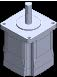

## Page 15

Unit setting
1
Basic
function
„ When setting with the driving shaft of the gearbox
Setting the following parameters can set the user-defined position unit based on the driving shaft of the gearbox.
• User-defined position unit setting Driving shaft of gearbox
• Motor rotation direction
• Gear information (numerator)
• Gear information (denominator)
• Gear rotation direction
Motor output shaft
In the case of a geared motor, information of the gearhead is written to the motor (encoder) in
advance. For details, refer to "1-6 Unit setting of geared motor" on p.32.
<Setting procedures>
1. Set the "User-defined position unit setting" parameter.
2. Set the gear ratio of equipment with the "Gear information (numerator)" and "Gear information (denominator)"
parameters.
3. Set the rotation direction of the driving shaft of the gearbox based on that of the motor shaft.
z Gear ratio
The gear ratio can be set using the "Gear information (numerator)" and "Gear information (denominator)" parameters.
Gear information (numerator)
Gear ratio =
Gear information (denominator)
The control resolution is automatically set inside the driver based on the "User-defined position unit setting"
parameter and the gear ratio.
The calculation of the control resolution varies depending on the setting value of the "User-defined position unit
setting" parameter.
When the user-defined position unit setting: "*** rev (driving shaft of gearbox)" is set
Drive shaft to be set Setting value of "User-defined position unit setting" parameter
23: 0.001 rev (driving shaft of gearbox)
24: 0.0001 rev (driving shaft of gearbox)
Driving shaft of gearbox
25: 0.00001 rev (driving shaft of gearbox)
26: 0.000001 rev (driving shaft of gearbox)
1 1
Control resolution (P/R) = ×
User-defined position unit (driving shaft of gearbox) Gear ratio
When the user-defined position unit setting: "*** deg (driving shaft of gearbox)" is set
Drive shaft to be set Setting value of "User-defined position unit setting" parameter
31: 0.1 deg (driving shaft of gearbox)
32: 0.01 deg (driving shaft of gearbox)
Driving shaft of gearbox
33: 0.001 deg (driving shaft of gearbox)
34: 0.0001 deg (driving shaft of gearbox)
360 1
Control resolution (P/R) = ×
User-defined position unit (driving shaft of gearbox) Gear ratio
Note that the calculated value must fall within the setting range specified below.
Setting range of control resolution: 500 to 36,000 P/R (initial value: 36,000 P/R)
15

## Page 16

Unit setting
16
1
Basic
function
If a resolution out of the setting range is set, information of "Unit setting" will be generated.
If the power supply is turned on again or Configuration is executed in a state where information of
"Unit setting" is being generated, an alarm of "Unit setting error" will be generated.
z Rotation direction of drive shaft
Set the "Motor rotation direction" and "Gear rotation direction" parameters according to your equipment.
Setting value of "Motor rotation Setting value of "Gear rotation
Rotation direction of motor shaft
direction" parameter direction" parameter
Positive value (FWD): CW direction
0: Not invert
Negative value (RVS): CCW direction
0: Not invert (+ = CW)
Positive value (FWD): CCW direction
1: Invert
Negative value (RVS): CW direction
Positive value (FWD): CCW direction
0: Not invert
Negative value (RVS): CW direction
1: Invert (+ = CCW)
Positive value (FWD): CW direction
1: Invert
Negative value (RVS): CCW direction
z Setting example
<Conditions>
• To set the driving shaft of the gearbox by 0.0001 revolutions.
• To use a gear of the gear ratio 10.
• The driving shaft of the gearbox and the motor shaft rotate in the same direction.
• To rotate the driving shaft of the gearbox in the CCW direction when a positive value is set.
<Settings of parameters>
Parameter Setting value
User-defined position unit setting 24: 0.0001 rev (driving shaft of gearbox)
Gear information (numerator) 10
Gear information (denominator) 1
Gear rotation direction 1: Invert
Motor rotation direction 0: Not invert
<Control resolution calculation>
1 1
Control resolution (P/R) = × = 1000
0.0001 rev 10
<Value to be executed>
Item Setting
User-defined position unit [0.0001 rev] (driving shaft of gearbox)
Control resolution 1000 P/R (1 step = 0.001 rev (motor shaft))
Positive value (FWD): CCW direction
Rotation direction of driving shaft of gearbox
Negative value (RVS): CW direction

## Page 17

Unit setting
„ When setting with the mechanism
Setting the following parameters can set the user-defined position unit based on the mechanism.
• User-defined position unit setting
Mechanism
• Motor rotation direction
• Gear information (numerator)
• Gear information (denominator)
• Gear rotation direction
• Mechanism information specifications
• Mechanism information (numerator) Driving shaft of gearbox
• Mechanism information (denominator)
• Mechanism traveling direction 1 Basic function
Motor output shaft
When setting with the mechanism, the user-defined position unit based on the mechanism can be set using the 
"User-defined position unit setting" and "Mechanism information specifications" parameters.
"Mechanism information  "User-defined position unit setting"  User-defined position unit 
| specifications" parameter | parameter                 | (mechanism)     |
| ------------------------- | ------------------------- | --------------- |
|                           | Use mechanism unit (×1)   | [1 × no unit]   |
|                           | Use mechanism unit (×0.1) | [0.1 × no unit] |
No unit
|                       | Use mechanism unit (×0.01)  | [0.01 × no unit]  |
| --------------------- | --------------------------- | ----------------- |
|                       | Use mechanism unit (×0.001) | [0.001 × no unit] |
|                       | Use mechanism unit (×1)     | [1 × mm]          |
| Linear motion [mm],   | Use mechanism unit (×0.1)   | [0.1 × mm]        |
setting: travel amount [mm/rev]
|     | Use mechanism unit (×0.01)  | [0.01 × mm]  |
| --- | --------------------------- | ------------ |
|     | Use mechanism unit (×0.001) | [0.001 × mm] |
|     | Use mechanism unit (×1)     | [1 × mm]     |
|     | Use mechanism unit (×0.1)   | [0.1 × mm]   |
Wheel [mm],  
setting: diameter [mm] Use mechanism unit (×0.01) [0.01 × mm]
|                   | Use mechanism unit (×0.001) | [0.001 × mm] |
| ----------------- | --------------------------- | ------------ |
|                   | Use mechanism unit (×1)     | [1 × rev]    |
| Rotation [rev],   | Use mechanism unit (×0.1)   | [0.1 × rev]  |
setting: mechanism reduction ratio Use mechanism unit (×0.01) [0.01 × rev]
|                   | Use mechanism unit (×0.001) | [0.001 × rev] |
| ----------------- | --------------------------- | ------------- |
|                   | Use mechanism unit (×1)     | [1 × deg]     |
| Rotation [deg],   | Use mechanism unit (×0.1)   | [0.1 × deg]   |
setting: mechanism reduction ratio
|     | Use mechanism unit (×0.01)  | [0.01 × deg]  |
| --- | --------------------------- | ------------- |
|     | Use mechanism unit (×0.001) | [0.001 × deg] |
<Setting procedures>
1.  Set the "User-defined position unit setting" and "Mechanism information specifications" parameters according to 
equipment and the minimum travel unit.
2.  Set the gear ratio of equipment with the "Gear information (numerator)" and "Gear information (denominator)" 
parameters.
3.  Set the rotation direction of the driving shaft of the gearbox based on that of the motor shaft.
4.  Sets the traveling direction of the mechanism based on the rotation direction of the driving shaft of the gearbox.
17

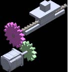

## Page 18

Unit setting
18
1
Basic
function
z Mechanism traveling direction
Set the "Motor rotation direction," "Gear rotation direction," and "Mechanism traveling direction" parameters
according to the equipment used.
"Gear rotation "Mechanism
"Motor rotation direction" direction" traveling direction"
Rotation direction of motor shaft
parameter setting value parameter setting parameter setting
value value
Positive value (FWD): CW direction
0: Not invert
Negative value (RVS): CCW direction
0: Not invert
Positive value (FWD): CCW direction
1: Invert
Negative value (RVS): CW direction
0: Not invert (+ = CW)
Positive value (FWD): CCW direction
0: Not invert
Negative value (RVS): CW direction
1: Invert
Positive value (FWD): CW direction
1: Invert
Negative value (RVS): CCW direction
Positive value (FWD): CCW direction
0: Not invert
Negative value (RVS): CW direction
0: Not invert
Positive value (FWD): CW direction
1: Invert
Negative value (RVS): CCW direction
1: Invert (+ = CCW)
Positive value (FWD): CW direction
0: Not invert
Negative value (RVS): CCW direction
1: Invert
Positive value (FWD): CCW direction
1: Invert
Negative value (RVS): CW direction
„ When "No unit" is selected in Mechanism information specifications
Select when a mechanism is installed on the driving shaft of the gearbox. Use when the user-defined position unit is
set as desired other than [mm].
Illustration example
The user-defined position unit can be set as follows using the "User-defined position unit setting" and "Mechanism
information specifications" parameters.
"Mechanism information "User-defined position unit setting" User-defined position unit
specifications" parameter parameter (mechanism)
Use mechanism unit (×1) [1 × no unit]
Use mechanism unit (×0.1) [0.1 × no unit]
No unit
Use mechanism unit (×0.01) [0.01 × no unit]
Use mechanism unit (×0.001) [0.001 × no unit]

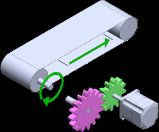

## Page 19

Unit setting
1
Basic
function
z Gear ratio
The gear ratio can be set using the "Gear information (numerator)" and "Gear information (denominator)" parameters.
Gear information (numerator)
Gear ratio =
Gear information (denominator)
• Setting example Example:
20
If the velocity of the driving shaft of the gearbox is set to one twentieth, Gear ratio 20 =
1
the gear ratio is 20.
• In the case of a geared motor, information of the gearhead is written to the motor (encoder) in
advance. For details, refer to "1-6 Unit setting of geared motor" on p.32.
z Mechanism information
Use the "Mechanism information (numerator)" and "Mechanism information (denominator)" parameters to set the
travel amount per revolution of the driving shaft of the gearbox [no unit/rev].
Mechanism information
(numerator)
Travel amount per revolution of driving shaft of gearbox [no unit/rev] = [no unit/rev]
Mechanism information
(denominator)
z Control resolution
Travel amount per revolution of driving shaft of gearbox 1
Control resolution (P/R) = ×
User-defined position unit (mechanism) Gear ratio
Note that the calculated value must fall within the setting range specified below.
Setting range of control resolution: 500 to 36,000 P/R (initial value: 36,000 P/R)
If a resolution out of the setting range is set, information of "Unit setting" will be generated.
If the power supply is turned on again or Configuration is executed in a state where information of
"Unit setting" is being generated, an alarm of "Unit setting error" will be generated.
19

## Page 20

Unit setting
20
1
Basic
function
„ When "Linear motion [mm], setting: travel amount [mm/rev]" is selected in
Mechanism information specifications
Select when a linear motion mechanism is assembled to the driving shaft of the gearbox.
Illustration example
The user-defined position unit can be set as follows using the "User-defined position unit setting" and "Mechanism
information specifications" parameters.
"Mechanism information "User-defined position unit setting" User-defined position unit
specifications" parameter parameter (mechanism)
Use mechanism unit (×1) [1 × mm]
Linear motion [mm], Use mechanism unit (×0.1) [0.1 × mm]
setting: travel amount [mm/rev] Use mechanism unit (×0.01) [0.01 × mm]
Use mechanism unit (×0.001) [0.001 × mm]
z Gear ratio
The gear ratio can be set using the "Gear information (numerator)" and "Gear information (denominator)" parameters.
Gear information (numerator)
Gear ratio =
Gear information (denominator)
• Setting example Example:
20
If the velocity of the driving shaft of the gearbox is set to one twentieth, Gear ratio 20 =
1
the gear ratio is 20.
• In the case of a geared motor, information of the gearhead is written to the motor (encoder) in
advance. For details, refer to "1-6 Unit setting of geared motor" on p.32.
z Mechanism information
Use the "Mechanism information (numerator)" and "Mechanism information (denominator)" parameters to set the
travel amount per revolution of the driving shaft of the gearbox [mm/rev].
Mechanism information
(numerator)
Travel amount per revolution of driving shaft of gearbox [mm/rev] = [mm/rev]
Mechanism information
(denominator)

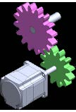

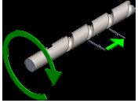

## Page 21

Unit setting
1
Basic
function
z Control resolution
Travel amount per revolution of driving shaft of gearbox 1
Control resolution (P/R) = ×
User-defined position unit (mechanism) Gear ratio
Note that the calculated value must fall within the setting range specified below.
Setting range of control resolution: 500 to 36,000 P/R (initial value: 36,000 P/R)
If a resolution out of the setting range is set, information of "Unit setting" will be generated.
If the power supply is turned on again or Configuration is executed in a state where information of
"Unit setting" is being generated, an alarm of "Unit setting error" will be generated.
„ When "Wheel [mm], setting: diameter [mm]" is selected in Mechanism information
specifications
Select when a mechanism having assembled a wheel on the driving shaft of the gearbox is used.
Illustration example
Wheel
The user-defined position unit can be set as follows using the "User-defined position unit setting" and "Mechanism
information specifications" parameters.
"Mechanism information "User-defined position unit setting" User-defined position unit
specifications" parameter parameter (mechanism)
Use mechanism unit (×1) [1 × mm]
Wheel [mm], Use mechanism unit (×0.1) [0.1 × mm]
setting: diameter [mm] Use mechanism unit (×0.01) [0.01 × mm]
Use mechanism unit (×0.001) [0.001 × mm]
z Gear ratio
The gear ratio can be set using the "Gear information (numerator)" and "Gear information (denominator)" parameters.
Gear information (numerator)
Gear ratio =
Gear information (denominator)
• Setting example Example:
20
If the velocity of the driving shaft of the gearbox is set to one twentieth, Gear ratio 20 =
1
the gear ratio is 20.
• In the case of a geared motor, information of the gearhead is written to the motor (encoder) in
advance. For details, refer to "1-6 Unit setting of geared motor" on p.32.
z Mechanism information
Use the "Mechanism information (numerator)" and "Mechanism information (denominator)" parameters to set the
diameter of the wheel assembled on the driving shaft of the gearbox [mm].
Mechanism information (numerator)
Diameter of wheel assembled on driving shaft of gearbox [mm] = [mm]
Mechanism information (denominator)
21

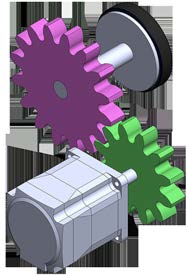

## Page 22

Unit setting
22
1
Basic
function
z Control resolution
Diameter of wheel assembled on driving shaft of gearbox × π 1
Control resolution (P/R) = ×
User-defined position unit (mechanism) Gear ratio
Note that the calculated value must fall within the setting range specified below.
Setting range of control resolution: 500 to 36,000 P/R (initial value: 36,000 P/R)
If a resolution out of the setting range is set, information of "Unit setting" will be generated.
If the power supply is turned on again or Configuration is executed in a state where information of
"Unit setting" is being generated, an alarm of "Unit setting error" will be generated.
„ When "Rotation [rev], setting: mechanism reduction ratio" is selected in
Mechanism information specifications
Select when a rotating mechanism having assembled a speed reduction or speed increasing mechanism on the
driving shaft of the gearbox is used.
Illustration example
The user-defined position unit can be set as follows using the "User-defined position unit setting" and "Mechanism
information specifications" parameters.
"Mechanism information "User-defined position unit setting" User-defined position unit
specifications" parameter parameter (mechanism)
Use mechanism unit (×1) [1 × rev]
Rotation [rev], Use mechanism unit (×0.1) [0.1 × rev]
setting: mechanism reduction ratio Use mechanism unit (×0.01) [0.01 × rev]
Use mechanism unit (×0.001) [0.001 × rev]
z Gear ratio
The gear ratio can be set using the "Gear information (numerator)" and "Gear information (denominator)" parameters.
Gear information (numerator)
Gear ratio =
Gear information (denominator)
• Setting example Example:
20
If the velocity of the driving shaft of the gearbox is set to one twentieth, Gear ratio 20 =
1
the gear ratio is 20.
• In the case of a geared motor, information of the gearhead is written to the motor (encoder) in
advance. For details, refer to "1-6 Unit setting of geared motor" on p.32.

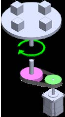

## Page 23

Unit setting
z  Mechanism information
Use the "Mechanism information (numerator)" and "Mechanism information (denominator)" parameters to set the 
gear ratio (mechanism reduction ratio) of the mechanism assembled on the driving shaft of the gearbox.
Mechanism information (numerator)
Mechanism reduction ratio =
Mechanism information (denominator)
z  Control resolution
|                            | 1   |     | 1   | 1   |
| -------------------------- | --- | --- | --- | --- |
| Control resolution (P/R) = |     | ×   | ×   |     |
User-defined position unit  Gear ratio Mechanism reduction ratio 1 Basic function
(mechanism)
Note that the calculated value must fall within the setting range specified below.
Setting range of control resolution: 500 to 36,000 P/R (initial value: 36,000 P/R)
If a resolution out of the setting range is set, information of "Unit setting" will be generated.
If the power supply is turned on again or Configuration is executed in a state where information of 
"Unit setting" is being generated, an alarm of "Unit setting error" will be generated.
„ When "Rotation [deg], setting: mechanism reduction ratio" is selected in 
Mechanism information specifications
Select when a rotating mechanism having assembled a speed reduction or speed increasing mechanism on the 
driving shaft of the gearbox is used.
Illustration example
 
The user-defined position unit can be set as follows using the "User-defined position unit setting" and "Mechanism 
information specifications" parameters.
"Mechanism information  "User-defined position unit setting"  User-defined position unit 
| specifications" parameter |                           | parameter |     | (mechanism) |
| ------------------------- | ------------------------- | --------- | --- | ----------- |
|                           | Use mechanism unit (×1)   |           |     | [1 × deg]   |
| Rotation [deg],           | Use mechanism unit (×0.1) |           |     | [0.1 × deg] |
setting: mechanism reduction ratio
|     | Use mechanism unit (×0.01)  |     |     | [0.01 × deg]  |
| --- | --------------------------- | --- | --- | ------------- |
|     | Use mechanism unit (×0.001) |     |     | [0.001 × deg] |
23

## Page 24

Unit setting
24
1
Basic
function
z Gear ratio
The gear ratio can be set using the "Gear information (numerator)" and "Gear information (denominator)" parameters.
Gear information (numerator)
Gear ratio =
Gear information (denominator)
• Setting example Example:
20
If the velocity of the driving shaft of the gearbox is set to one twentieth, Gear ratio 20 =
1
the gear ratio is 20.
• In the case of a geared motor, information of the gearhead is written to the motor (encoder) in
advance. For details, refer to "1-6 Unit setting of geared motor" on p.32.
z Mechanism information
Use the "Mechanism information (numerator)" and "Mechanism information (denominator)" parameters to set the
gear ratio (mechanism reduction ratio) of the mechanism assembled on the driving shaft of the gearbox.
Mechanism information (numerator)
Mechanism reduction ratio =
Mechanism information (denominator)
z Control resolution
360 1 1
Control resolution (P/R) = × ×
User-defined position unit Gear ratio Mechanism reduction ratio
(mechanism)
Note that the calculated value must fall within the setting range specified below.
Setting range of control resolution: 500 to 36,000 P/R (initial value: 36,000 P/R)
If a resolution out of the setting range is set, information of "Unit setting" will be generated.
If the power supply is turned on again or Configuration is executed in a state where information of
"Unit setting" is being generated, an alarm of "Unit setting error" will be generated.

## Page 25

Unit setting
1
Basic
function
„ Related parameters
Initial setting
Parameter name Description
Initial value Unit
Sets the position unit.
[Setting range]
0: Encoder setting is prioritized
(Use [Control resolution] if not a mechanical product)
1: Control resolution (step)
10: Use mechanism unit (×1)
11: Use mechanism unit (×0.1)
12: Use mechanism unit (×0.01)
User-defined position unit
13: Use mechanism unit (×0.001) 0 −
setting
23: 0.001 rev (driving shaft of gearbox)
24: 0.0001 rev (driving shaft of gearbox)
25: 0.00001 rev (driving shaft of gearbox)
26: 0.000001 rev (driving shaft of gearbox)
31: 0.1 deg (driving shaft of gearbox)
32: 0.01 deg (driving shaft of gearbox)
33: 0.001 deg (driving shaft of gearbox)
34: 0.0001 deg (driving shaft of gearbox)
Sets the rotation direction of the motor shaft.
[Setting range]
Motor rotation direction 0 −
0: Not invert
1: Invert
Sets the numerator of the control resolution.
Control resolution (numerator) [Setting range] 36,000 −
500 to 67,108,863
Sets the denominator of the control resolution.
Control resolution
[Setting range] 1 −
(denominator)
1 to 65,535
Sets the numerator of the gear ratio.
Gear information (numerator) [Setting range] 1 −
1 to 1000
Sets the denominator of the gear ratio.
Gear information
[Setting range] 1 −
(denominator)
1 to 1000
Sets the rotation direction of the driving shaft of the
gearbox.
Gear rotation direction [Setting range] 0 −
0: Not invert
1: Invert
25

## Page 26

Unit setting
26
1
Basic
function
Initial setting
Parameter name Description
Initial value Unit
Sets the mechanism information specifications.
[Setting range]
0: Encoder setting is prioritized
(if not a mechanical product, no unit)
1: Encoder setting is prioritized
(if not a mechanical product, linear motion [mm],
setting: travel amount [mm/rev])
2: Encoder setting is prioritized
(if not a mechanical product, wheel [mm],
setting: diameter [mm])
Mechanism information
5: Encoder setting is prioritized 2 −
specifications
(if not a mechanical product, rotation [rev],
setting: mechanism reduction ratio)
6: Encoder setting is prioritized
(if not a mechanical product, rotation [deg],
setting: mechanism reduction ratio)
8: No unit
9: Linear motion [mm], setting: travel amount [mm/rev]
10: Wheel [mm], setting: diameter [mm]
13: Rotation [rev], setting: mechanism reduction ratio
14: Rotation [deg], setting: mechanism reduction ratio
Sets the numerator of mechanism information.
Mechanism information
[Setting range] 1 −
(numerator)
1 to 65,535
Sets the denominator of mechanism information.
Mechanism information
[Setting range] 1 −
(denominator)
1 to 65,535
Sets the travel direction of the mechanism.
[Setting range]
Mechanism traveling direction 0 −
0: Not invert
1: Invert

## Page 27

Unit setting
1
Basic
function
1-3 User-defined velocity unit setting
Setting the "User-defined velocity unit setting" parameter can set the user-defined velocity unit.
The user-defined velocity unit having set is used as a unit of the demand velocity or the actual velocity for operation.
The user-defined velocity unit cannot be set depending on a combination of the "User-defined velocity unit setting,"
"Control resolution," and "Gear ratio" parameters. Information of "Unit setting" is generated if a combination that
cannot be set is selected.
If the power supply is turned on again or Configuration is executed in a state where information of
"Unit setting" is being generated, an alarm of "Unit setting error" will be generated.
Related parameter
Initial setting
Parameter name Description
Initial value Unit
Sets the velocity unit.
[Setting range]
0: Position unit is "Control resolution": r/min (motor shaft),
others: position unit/s
1: Position unit/s
2: r/min (motor shaft)
User-defined velocity unit 11: 0.1 r/min (motor shaft)
0 −
setting 12: 0.01 r/min (motor shaft)
20: 1 r/min (driving shaft of gearbox)
21: 0.1 r/min (driving shaft of gearbox)
22: 0.01 r/min (driving shaft of gearbox)
23: 0.001 r/min (driving shaft of gearbox)
24: 0.0001 r/min (driving shaft of gearbox)
25: 0.00001 r/min (driving shaft of gearbox)
„ User-defined velocity unit setting range
z When "*** (motor shaft)" is set
Information of "Unit setting" is generated if the following condition is satisfied.
User-defined velocity unit setting [r/min]
Condition: Control resolution (P/R) × < 1 [step/s]
60
Set the control resolution and the setting unit so that the calculation result is greater than 1.
<Setting example>
Parameter Setting value
User-defined velocity unit setting 12: 0.01 r/min (motor shaft)
Control resolution 36,000 [P/R]
Calculation result
36,000 [P/R] × 0.01 [r/min]
= 6
60
The calculation result is "6." This value is greater than 1, so an alarm or information will not be generated.
If the power supply is turned on again or Configuration is executed in a state where information of
"Unit setting" is being generated, an alarm of "Unit setting error" will be generated.
27

## Page 28

Unit setting
28
1
Basic
function
z When "*** (driving shaft of gearbox)" is set
Information of "Unit setting" is generated if one of the following conditions is satisfied.
Condition 1) User velocity unit [r/min] × Gear ratio ≥ 10 [r/min] (motor shaft)
User-defined velocity unit setting [r/min]
Condition 2) Control resolution (P/R) × × Gear ratio < 1 [step/s]
60
The gear ratio can be set using the "Gear information (numerator)" and "Gear information (denominator)" parameters.
Gear information (numerator)
Gear ratio =
Gear information (denominator)
<Setting example>
Parameter Setting value
User-defined velocity unit setting 23: 0.001 r/min (driving shaft of gearbox)
Control resolution 36,000 [P/R]
Gear ratio 20
Calculation result
Condition 1) 0.001 [r/min] × 20 = 0.02 < 10 [r/min]
36,000 [P/R] × 0.001 [r/min] × 20
Condition 2) = 12 ≥ 1 [step/s]
60
An alarm or information will not be generated since both the conditions 1) and 2) are not satisfied from the
calculation result.
If the power supply is turned on again or Configuration is executed in a state where information of
"Unit setting" is being generated, an alarm of "Unit setting error" will be generated.

## Page 29

Unit setting
1
Basic
function
1-4 User-defined acceleration/deceleration unit
Setting the "User-defined acceleration/deceleration unit setting" parameter can set the user-defined acceleration/
deceleration unit.
The user-defined acceleration/deceleration unit having set is used as a unit of the acceleration or the deceleration for
operation.
"(User-defined velocity unit)/s" is fixed in operation by the drive profile (CAN communication).
Related parameter
Initial setting
Parameter name Description
Initial value Unit
Sets the acceleration/deceleration unit.
This parameter is not applied when the product is
User-defined acceleration/
operated with the drive profile (CAN communication).
deceleration unit setting (DD, 1 −
[Setting range]
FWRV, SD, HOME operation)
0: (User-defined velocity unit)/s
1: ms
When "0: (User-defined velocity unit)/s" is set
Operating velocity [User-defined velocity unit]
Operating velocity
Deceleration rate
Acceleration
rate
Starting velocity
Time
When "1: ms" is set
Operating velocity [User-defined velocity unit]
Operating velocity
Starting velocity
Acceleration Deceleration Time
time rate
29

## Page 30

Unit setting
30
1
Basic
function
1-5 Coordinate direction
The objects of the position demand and velocity demand are changed using the "User-defined position unit setting"
parameter and the "User-defined velocity unit setting" parameter.
Setting of "User-defined position unit setting" parameter Object of position demand (position coordinate)
Control resolution (step) Motor shaft
*** rev (driving shaft of gearbox)
Driving shaft of gearbox
*** deg (driving shaft of gearbox)
Use mechanism unit (× ***) Position of moving part of mechanism
Setting of "User-defined velocity unit setting" parameter Object of velocity demand (velocity coordinate)
Position unit/s Same as the object of position demand
*** r/min (motor shaft) Motor shaft
*** r/min (driving shaft of gearbox) Driving shaft of gearbox
If the actual motor rotation direction is different between the position coordinate direction and the velocity
coordinate direction, the position coordinate direction follows the velocity coordinate direction.
Changing the "Position/velocity coordinate direction" parameter can change the relation between the position
coordinate direction and the velocity coordinate direction.
„ Motor rotation direction (velocity coordinate)
z Object of velocity demand: In the case of motor shaft
This is a mode to control the motor shaft directly.
The velocity can be commanded based on the motor shaft.
The actual motor rotation direction follows the setting of the following parameter.
• "Motor rotation direction" parameter
z Object of velocity demand: In the case of driving shaft of gearbox
This is a mode to control the driving shaft of the gearbox that a gear is installed to the motor shaft.
The velocity can be commanded based on the driving shaft of the gearbox.
The actual motor rotation direction follows the result composited the settings of the following parameters.
If the parameters are all set to "Invert," the rotation direction is not inverted due to "Invert × Invert."
• "Motor rotation direction" parameter
• "Gear rotation direction" parameter
z Object of velocity demand: In the case of velocity of moving part of mechanism
This is a mode to control the moving part of the mechanism when the mechanism is installed to the driving shaft of
the gearbox installed to the motor shaft.
The velocity can be commanded based on the moving part of the mechanism.
The actual motor rotation direction follows the result composited the settings of the following parameters.
If the parameters are all set to "Invert," the rotation direction is inverted due to "Invert × Invert × Invert."
• "Motor rotation direction" parameter
• "Gear rotation direction" parameter
• "Mechanism traveling direction" parameter
„ Motor rotation direction (position coordinate)
This is the same as the velocity.
„ Torque coordinate direction
The torque coordinate direction follows the velocity coordinate direction.
Changing the "Torque coordinate direction" parameter can change the torque coordinate direction to the position
coordinate direction.

## Page 31

Unit setting
1
Basic
function
„ Related parameters
Initial setting
Parameter name Description
Initial value Unit
Sets the position unit.
[Setting range]
0: Encoder setting is prioritized
(Use [Control resolution] if not a mechanical product)
1: Control resolution (step)
10: Use mechanism unit (×1)
11: Use mechanism unit (×0.1)
12: Use mechanism unit (×0.01)
User-defined
13: Use mechanism unit (×0.001) 0 −
position unit setting
23: 0.001 rev (driving shaft of gearbox)
24: 0.0001 rev (driving shaft of gearbox)
25: 0.00001 rev (driving shaft of gearbox)
26: 0.000001 rev (driving shaft of gearbox)
31: 0.1 deg (driving shaft of gearbox)
32: 0.01 deg (driving shaft of gearbox)
33: 0.001 deg (driving shaft of gearbox)
34: 0.0001 deg (driving shaft of gearbox)
Sets the velocity unit.
[Setting range]
0: Position unit is "Control resolution": r/min (motor shaft),
others: position unit/s
1: Position unit/s
2: r/min (motor shaft)
User-defined 11: 0.1 r/min (motor shaft)
0 −
velocity unit setting 12: 0.01 r/min (motor shaft)
20: 1 r/min (driving shaft of gearbox)
21: 0.1 r/min (driving shaft of gearbox)
22: 0.01 r/min (driving shaft of gearbox)
23: 0.001 r/min (driving shaft of gearbox)
24: 0.0001 r/min (driving shaft of gearbox)
25: 0.00001 r/min (driving shaft of gearbox)
Sets the rotation direction of the motor shaft.
Motor rotation [Setting range]
0 −
direction 0: Not invert
1: Invert
Sets the rotation direction of the driving shaft of the gearbox.
Gear rotation [Setting range]
0 −
direction 0: Not invert
1: Invert
Sets the travel direction of the mechanism.
Mechanism [Setting range]
0 −
traveling direction 0: Not invert
1: Invert
Sets directions for the position coordinate and the velocity
coordinate.
Position/velocity [Setting range]
2 −
coordinate direction 0: Follow unit setting
1: Match the direction of velocity coordinate with position coordinate
2: Match the direction of position coordinate with velocity coordinate
Selects the coordinate to be used as a reference with the torque
monitor.
Torque coordinate
[Setting range] 1 −
direction
0: Based on position coordinate
1: Based on velocity coordinate
31

## Page 32

Unit setting
32
1
Basic
function
1-6 Unit setting of geared motor
In the case of a geared motor, information of the gearhead is written to the motor (encoder) in advance.
Therefore, the following parameters are automatically applied to the unit setting even if a setting is not made.
• "Gear information (numerator)" parameter
• "Gear information (denominator)" parameter
• "Gear rotation direction" parameter
• In the case of motors of the combination type, information of the gearhead is not written to the
motor (encoder).
• If the "Gear information (numerator)" parameter or the "Gear information (denominator)"
parameter is changed from the initial value "1," the value set in the parameter is prioritized.
• If information of the gearhead written to the motor (encoder) is not used, set the "Gear information
(numerator)" parameter or the "Gear information (denominator)" parameter.
• If the reduction ratio of the entire equipment is desired to set only with the "Mechanism
information (numerator)" parameter and the "Mechanism information (denominator)" parameter,
set the "Gear information (numerator)" parameter and the "Gear information (denominator)"
parameter to the same value such as 2.
The information of the gearhead written to the motor (encoder) can be disabled.
z How to check
Information of the gearhead applied to the unit setting can be checked with the "Unit information monitor" of the
support software.
If information of the gearhead written to the motor (encoder) is applied, the "Gear setting" will be "Encoder."
When the parameter setting value is applied, the "Gear setting" will be "Parameter."

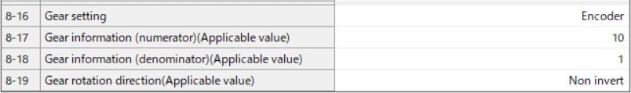

## Page 33

Coordinates management
1
Basic
function
2 Coordinates management
2-1 Coordinate home positions
There are two types of home positions, a mechanical home and an electrical home. When coordinates are set, the
ABSPEN output is turned ON.
The following operation cannot be executed if coordinates are not set.
Absolute positioning operation (when the "Permission of absolute positioning without setting
absolute coordinates" parameter is "Disable")
Related parameter
Initial setting
Parameter name Description
Initial value Unit
Permits absolute positioning operation in a state
where coordinates are not set.
Permission of absolute positioning
[Setting range] 0 −
without setting absolute coordinates
0: Disable
1: Enable
„ Mechanical home
The mechanical home is a home that is set by homing operation or the position preset.
„ Mechanical home setting
To set the mechanical home coordinates, perform the position preset or homing operation. If the mechanical home
coordinates are set, operation is performed on the coordinates centered on the mechanical home.
z Position preset
The position preset is an operation that sets the mechanical home.
It can be executed by the P-PRESET input or the “P-PRESET execution” of the maintenance command. When the
position preset is executed, the demand position and actual position become the value set in the “Home offset”
parameter, and the home is set.
z Homing operation
Homing operation is operation that detects the home using external sensors. When homing operation is completed,
the demand position and actual position become the value set in the “Home offset” parameter, and the home is set.
Related parameter
Initial setting
Parameter name Description
Initial value Unit
Sets the amount of offset from the home when homing operation is
completed or P-PRESET is executed.
Home offset 0 step
[Setting range]
−2,147,483,648 to 2,147,483,647 (User-defined position unit)
When the “Valid position range” parameter is set to “0 [: Software limit] - [Home offset],” the sign of
the home offset amount in the “Home offset” parameter is inverted.
33

## Page 34

Coordinates management
34
1
Basic
function
„ Electrical home
The electrical home is a home that is set in the driver. When the EL-PRST input is turned ON, the electrical home is set,
and the motor operates on the coordinate system with the electrical home as the home. If the EL-PRST input is turned
OFF, the electrical home is cleared. The ELPRST-MON output is being ON while the electrical home is set.
„ Electrical home setting
When the EL-PRST input is turned from OFF to ON, the demand position and actual position become zero, and the
electrical home is set.
While the EL-PRST input is ON, operation is performed on the coordinate system centered on the electrical home.
Turning the EL-PRST input from ON to OFF switches to the coordinate system centered the mechanical home.
If the position preset or homing operation is executed to set the mechanical home while the EL-PRST input is in an ON
state, the electrical home will have the same coordinate value as the mechanical home.
„ A state where coordinates are not set
Coordinates will be an unset state in the following cases. The ABSPEN output is turned OFF.
• When the main power supply is turned on
• After Configuration was executed.
2-2 WRAP Function
The WRAP function is a function to automatically preset the position information of the present position when the
position exceeds the set range. Setting the upper limit and the lower limit of the WRAP setting can restrict the
operation area of equipment or control an index table with coordinates on the positive and negative sides.
Related parameters
Initial setting
Parameter name Description
Initial value Unit
Sets the WRAP setting.
[Setting range]
WRAP setting 1: 32-bit range 1 −
(WRAP-type operation disabled/WRAP-ZERO output disabled)
2: Follows WRAP setting lower limit/WRAP setting upper limit
Sets the lower limit value of the WRAP setting.
WRAP setting lower
[Setting range] 0 step
limit
−536,870,912 to 0 (User-defined position unit)
Sets the upper limit value of the WRAP setting.
WRAP setting upper
[Setting range] 0 step
limit
0 to 536,870,911 (User-defined position unit)
• If both the "WRAP setting lower limit" and "WRAP setting upper limit" are set to "0," the WRAP
setting will be set to "32-bit range."
• When the WRAP setting is "32-bit range," an alarm of "Operation data error" will be generated if
operation related WRAP is executed.
„ When "32-bit range" is set
The position goes around between −2,147,483,648 and 2,147,483,647.
It shows 2,147,483,647 after −2,147,483,648,
and after that it shows in descending order.
−2,147,483,648 0 2,147,483,647
It shows −2,147,483,648 after 2,147,483,647,
and after that it shows in ascending order.

## Page 35

Coordinates management
1
Basic
function
„ When "Follows WRAP setting lower limit/WRAP setting upper limit" is set
The position goes around between the "WRAP setting lower limit" and the "WRAP setting upper limit."
z Setting example
If parameters are set as shown in the table below, the motor can be operated on the coordinates shown in the figure.
Item Setting
WRAP setting 2: Follows WRAP setting lower limit/WRAP setting upper limit
WRAP setting lower limit −6000
WRAP setting upper limit 5999
0
-6000 -3000 0 3000 5999
−3000 3000
−6000
Related output signals
• WRAP-ZERO output (p.201)
• WRAP-OVF output (p.201)
35

## Page 36

Stopping movement
36
1
Basic
function
3 Stopping movement
3-1 Operation stop input
When the operation stop signal is input during motor operation, the motor stops.
Related parameters
Initial setting
Parameter name Description
Initial value Unit
Sets how to stop the motor when the FW-BLK input or the RV-BLK
input is turned ON.
[Setting Range]
FW-BLK/RV-BLK 0: Immediate stop
1 −
input action 1: Deceleration stop
(according to the operation profile during operation)
2: Follow QSTOP setting (current is not cut off)
3: Follow STOP setting
Sets how to stop the motor when the STOP input is turned ON.
[Setting range]
−3: Deceleration time stop
(according to the Custom stopping time parameter)
−2: Deceleration rate stop
(according to the Custom stopping rate parameter)
STOP input action 1 −
−1: Immediate stop
1: Deceleration stop
(according to the operation profile during operation except for
the torque limiting value)
2: Deceleration rate stop
(according to the Quick stop rate parameter)
Sets the torque limiting value when the STOP input is turned ON.
STOP input
[Setting range]
stopping Torque 0 1=0.1%
0: Use profile torque limit continuously
limit value
1 to 10,000 (1=0.1%)
Sets how to stop the motor when the QSTOP input is turned ON.
[Setting range]
−3: Deceleration time stop
(according to the Custom stopping time parameter)
−2: Deceleration rate stop
(according to the Custom stopping rate parameter)
−1: Immediate stop
0: Immediate stop (current is cut off after stopping)
1: Deceleration stop
(according to the operation profile during operation except for
QSTOP input action 2 −
the torque limiting value)
(current is cut off after stopping)
2: Deceleration rate stop
(according to the Quick stop rate parameter)
(current is cut off after stopping)
5: Deceleration stop
(according to the operation profile during operation except for
the torque limiting value)
6: Deceleration rate stop
(according to the Quick stop rate parameter)

## Page 37

Stopping movement
1
Basic
function
Initial setting
Parameter name Description
Initial value Unit
Sets the torque limiting value when the QSTOP input is turned
QSTOP input ON.
stopping Torque [Setting range] 0 1=0.1%
limit value 0: Use profile torque limit continuously
1 to 10,000 (1=0.1%)
Sets the deceleration rate when "Deceleration rate stop (according
to the Quick stop rate parameter)" is selected in the "STOP input
Quick stop rate action" and "QSTOP input action" parameters. 1,000 (r/min)/s
[Setting range]
1 to 1,000,000,000 (User-defined velocity unit/s)
Sets the deceleration rate when "Deceleration rate stop (according
to the Custom stopping rate parameter)" is selected in the "STOP
Custom stopping
input action" and "QSTOP input action" parameters. 1,000 (r/min)/s
rate
[Setting range]
1 to 1,000,000,000 (User-defined velocity unit/s)
Sets the deceleration time when "Deceleration time stop
(according to the Custom stopping time parameter)" is selected in
Custom stopping
the "STOP input action" and "QSTOP input action" parameters. 1,000 ms
time
[Setting range]
1 to 1,000,000,000 ms
3-2 Hardware overtravel
Hardware overtravel is a function that limits the range of movement by installing the limit sensors (FW-LS, RV-LS) at
the upper and lower limits of the moving range. If the "FW-LS/RV-LS input action" parameter is set, the motor can be
stopped when the limit sensor is detected.
Related parameter
Initial setting
Parameter name Description
Initial value Unit
Sets how to stop the motor when the FW-LS input or the RV-LS input is
turned ON.
[Setting Range]
−1: Only for homing sensor
0: Immediate stop
1: Deceleration stop (according to the operation profile during operation)
FW-LS/RV-LS
2: Follow QSTOP setting (current is not cut off) 4 −
input action
3: Follow STOP setting
4: Immediate stop with alarm
5: Deceleration stop with alarm
(according to the operation profile during operation)
6: Follow QSTOP setting with alarm (current is not cut off)
7: Follow STOP setting with alarm
If the "FW-LS/RV-LS input action" parameter is set to an item describing "with alarm," the set values in
the "Stopping method at alarm generation" parameter and the "FW-LS/RV-LS input action" parameter
are compared, and the operation is stopped by the higher-priority stopping method.
37

## Page 38

Stopping movement
38
1
Basic
function
3-3 Software overtravel
Software overtravel is a function that limits the range of movement by setting the upper and lower limits of the
moving range by the parameters. When the demand position (mechanical home coordinate system) reaches the
software limit, the motor can be stopped according to the setting of the “Software overtravel action” parameter. If the
"Software overtravel action" parameter is set to an item describing "with alarm," an alarm of "Software overtravel" will
be generated after the motor stops. Also, if the target position exceeds the software limit, an alarm of "Operation data
error" will be generated.
Related parameters
Initial setting
Parameter name Description
Initial value Unit
Sets the operation when the demand position reaches the
software limit.
[Setting range]
−1: Disable
0: Immediate stop
1: Deceleration stop
Software overtravel (according to the operation profile during operation)
6 −
action 2: Follow QSTOP setting (current is not cut off)
3: Follow STOP setting
4: Immediate stop with alarm
5: Deceleration stop with alarm
(according to the operation profile during operation)
6: Follow QSTOP setting with alarm (current is not cut off)
7: Follow STOP setting with alarm
Sets the maximum value of the software limit.
Max software limit [Setting range] 0 step
−2,147,483,648 to 2,147,483,647 (User-defined position unit)
Sets the minimum value of the software limit.
Min software limit [Setting range] 0 step
−2,147,483,648 to 2,147,483,647 (User-defined position unit)
Sets the amount of offset from the home when homing operation
is completed or P-PRESET is executed.
Home offset 0 step
[Setting range]
−2,147,483,648 to 2,147,483,647 (User-defined position unit)
Sets the criterion of the software limit.
(Driver version 3.99 or before)
[Setting range] 0
0: [Software limit] - [Home offset] (CiA402 compatible)
1: Software limit (AZ compatible)
Valid position range Sets the criterion of the software limit. −
(Driver version 4.00 or later)
[Setting range]
−1
−1: [Software limit] + [Home offset] (CiA402 compatible)
0: [Software limit] - [Home offset] (Compatible with old version)
1: Software limit (AZ compatible)
• Setting both the "Max Software Limit" and the "Min Software Limit" to "0" will disable the software
overtravel.
• The software limit is enabled when coordinates are set.
If a value in the "Max software limit" parameter is set to equal or less than a value in the "Min
software limit" parameter, an alarm of "Operation data error" due to the software overtravel and
the software limit will be disabled.
In addition, if the software limit exceeds the WRAP setting range, an alarm of "Operation data
error" due to the software overtravel of the exceeded direction and the software limit will be
disabled.
• If the "Software overtravel action" parameter is set to an item describing "with alarm," the set
values in the "Stopping method at alarm generation" parameter and the "Software overtravel
action" parameter are compared, and the operation is stopped by the higher-priority stopping
method.

## Page 39

Stopping movement
1
Basic
function
3-4 Escape from the limit sensor
It is possible to escape in the reverse direction when the limit in the forward direction (FWD) is detected and in the
forward direction when that in the reverse direction (RVS) is detected.
3-5 Priority of stop action
When multiple stop commands are input to the driver, the motor stops according to the following priority.
Priority Stop level Stopping movement
Stop by CLR input
High 0 Immediate stop
Immediate stop *1
Deceleration stop when alarm is generated
1 Deceleration stop when power supply for communication is lost
Deceleration stop by maintenance command "Stop operation"
2 Deceleration stop by QSTOP input
Deceleration stop *2 Deceleration stop by FW-LS/RV-LS input *3
3 Deceleration stop by FW-BLK/RV-BLK input
Deceleration stop by software overtravel *3
4 Deceleration stop by STOP input
Low 5 Deceleration stop by stop operation
*1 When "Immediate stop" is selected in the stopping movement for each input signal
*2 For the same stop level, a larger value of the deceleration rate (faster stop) is prioritized.
*3 If the "FW-LS/RV-LS input action" parameter or the "Software overtravel action" parameter is set to an item
describing "with alarm," the stop level will be "1."
• In the following cases, immediate stop or deceleration stop cannot be executed using direct data
operation.
• While the motor is operating to stop by the operation stop signal
• When the motor is operating by a method other than direct data operation
• When combined with a gear, do not stop by the CLR input in a state where the motor shaft speed
exceeds 300 r/min.
Example of operation
z Operation when having input the QSTOP input (deceleration stop) while the motor was stopping by
the STOP input (deceleration stop)
The motor operates according to the QSTOP input due to high-priority input.
Velocity
Time
STOP input
(deceleration stop)
QSTOP input
(deceleration stop)
39

## Page 40

Stopping movement
40
1
Basic
function
z Operation when having input the STOP input (deceleration stop) while the motor was stopping by the
QSTOP input (deceleration stop)
Deceleration stop by the QSTOP input is continued because the QSTOP input has a higher stop priority.
Velocity
Time
QSTOP input
(deceleration stop)
STOP input
(deceleration stop)

## Page 41

Torque limiting function
1
Basic
function
4 Torque limiting function
The maximum output torque of the motor can be limited.
Set when limiting the motor output torque according to a load.
The motor operates at the lowest torque limiting value among the following conditions.
Name Description
Operation profile torque limiting Torque limiting by the torque limiting value when operation is executed
Torque limiting by the value set in the "TRQ-LMT input Torque limit value"
TRQ-LMT input torque limiting
parameter (when the TRQ-LMT input is ON)
ATL function torque limiting Torque limiting by the ATL function (initial value: enable)
Torque limiting by the torque limiting value when the STOP input or the
Stop command torque limiting
QSTOP input is turned ON
Torque limiting when an alarm of “Non-excitation after deceleration” is
Alarm torque limiting
generated (approximately 100%)
Output power limiting Torque limiting when the main power supply input voltage is dropped
The maximum torque limiting value varies depending on the motor.
60 W motor: 200%
100 W motor: 220%
200 W motor: 210%
400 W motor: 200%
750 W motor: 200%
If the limit value is significantly increased during torque limiting, a large impact torque may be
generated, causing damage to the motor or equipment. Beware of changing the limit value.
In the case of continuous operation (torque control), the torque limiting value of the operation
profile torque limiting is assumed as the target torque.
Related parameter
Initial setting
Parameter name Description
Initial value Unit
Selects the operating torque limit when the motor stops.
[Setting range]
Torque limit setting at motor
0: Follow the selection number 1 −
standstill
1: Maintain the previous operating torque limit
(reset by excitation OFF)
41

## Page 42

ATL function
42
1
Basic
function
5 ATL function
The ATL function is a function that prevents the overload alarm by automatically adjusting the torque limiting value
when the output torque increases to near the overload alarm level.
„ When the torque limiting value larger than the overload detection torque is set
The ATL function activates when all of the following conditions are satisfied.
• The output torque of the motor exceeded the overload detection torque.
• The driver was estimated to exceed the overload detection time based on the output torque of the motor.
Torque Overload detection time
* The ATL function activates to start
Maximum output torque
adjusting the torque limiting value.
or
torque limiting value It controls so as to fall below
the overload detection torque.
Overload detection torque
Time
* The time varies depending on the operating condition or a load.
„ When the torque limiting value smaller than the overload detection torque is set
The ATL function is not activated because the motor output torque is smaller than the overload detection torque.
Torque
Overload detection torque
Torque limiting value
Time
If the ATL function is activated, the motor may not operate according to the operation profile. Make
sure that changing the operation profile does not cause any problem in equipment beforehand.

## Page 43

ATL function
1
Basic
function
Related parameter
Initial setting
Parameter name Description
Initial value Unit
Selects the setting method of the ATL function.
[Setting Range]
ATL function mode setting 1 −
0: Follow ATL-EN input
1: ATL function enabled
• About ATL-EN Input
When the "ATL function mode setting" parameter is set to "Follow ATL-EN input," select whether to
enable or disable the ATL function using the ATL-EN input. Turning the ATL-EN input ON enables
the ATL function, and turning it OFF disables the ATL function.
z Operation example: When load fluctuation occurs during continuous operation
When ATL function is disabled
Load fluctuation occurs
Demand velocity
Actual velocity
Overload detection
torque
Motor output torque
Alarm is generated
ALM-A output ON
OFF
When ATL function is enabled
Load fluctuation Load fluctuation
occurs normal state
Demand velocity
Actual velocity
Overload detection
torque
Motor output torque
ALM-A output ON Alarm is not generated
OFF
43

## Page 44

Driver status and motor excitation
6  Driver status and motor excitation
„ Driver status and state transition of motor excitation
Electromagnetic 
| Driver status |     | Motor excitation |     | SON-MON output | PWR/SYS LED |
| ------------- | --- | ---------------- | --- | -------------- | ----------- |
brake
| Motor non-excitation |     | Non-excitation | Hold | OFF | White light |
| -------------------- | --- | -------------- | ---- | --- | ----------- |
1 Basic function
| FREE |     | Non-excitation | Release | OFF | White light |
| ---- | --- | -------------- | ------- | --- | ----------- |
Power removal with ETO Non-excitation Hold OFF Blinking white
| ETO                    |     | Non-excitation | Hold    | OFF | Blinking white |
| ---------------------- | --- | -------------- | ------- | --- | -------------- |
| Alarm (non-excitation) |     | Non-excitation | Hold    | OFF | Blinking red   |
| Alarm (excitation)     |     | Excitation     | Release | ON  | Blinking red   |
| Motor excitation       |     | Excitation     | Release | ON  | White light    |
Outline of ETO (External Torque Off)
When both the HWTO1 input and HWTO2 input are turned OFF, the driver transitions to the power removal status and 
concurrently with the "ETO" status.
At this time, the driver makes the motor put into a non-excitation state.
If both the HWTO1 input and HWTO2 input are turned ON, the power removal status is released, but the "ETO" status 
is retained without being released.
Main power supply OFF
Main power supply ON
S-ON=ON
S-ON=OFF
HWTO1, 
|     |     |     | HWTO2 | HWTO1,  |     |
| --- | --- | --- | ----- | ------- | --- |
Power 
|     | ETO-CLR=ON* |     | =ON | HWTO2 |     |
| --- | ----------- | --- | --- | ----- | --- |
ETO removal 
=OFF
with ETO
| Motor          |             | HWTO1、HWTO2=OFF |     |     | Motor      |
| -------------- | ----------- | --------------- | --- | --- | ---------- |
| non-excitation |             |                 |     |     | excitation |
|                | Alarm reset | Alarm           |     |     |            |
Error occurs
(non-excitation)
Error occurs
FREE=OFF
FREE=ON
FREE
FREE=ON
Alarm reset Error occurs
Alarm
(excitation)
* If the parameter is changed, the "ETO" status can be released by the ALM-RST input, the S-ON input, or the STOP 
input.
• The motor can be operated only when the driver status is in the "Motor excitation" status.
• When operating with the drive profile (CAN communication), the driver status is controlled by the 
state machine. Operating the state machine can release the ETO status.
44

## Page 45

Driver status and motor excitation
1
Basic
function
6-1 Driver status (motor non-excitation status)
„ Motor non-excitation
When the main power supply of the driver is turned on, the driver transitions to the "Motor non-excitation" status. The
PWR/SYS LED is lit in white.
The motor puts into a non-excitation state.
When an electromagnetic brake motor is used, the electromagnetic brake actuates to hold the motor shaft.
Also, if the S-ON input is turned OFF while the driver status is in the "Motor excitation" status, the driver transitions to
the "Motor non-excitation" status.
The SON-MON output is turned OFF.
ON
S-ON input
OFF
Driver status Motor excitation Motor non-excitation
ON
SON-MON output
OFF
Excitation
Motor excitation
Non-excitation
Hold
Electromagnetic brake
Release
If the motor excitation is turned off to put into a non-excitation state while the motor is rotating, the
motor, the driver, or the equipment may be damaged.
„ FREE
When the FREE input is turned ON, the driver transitions to the "FREE" status.
The PWR/SYS LED remains in white light.
The motor puts into a non-excitation state. Also, the SON-MON output is turned OFF.
When an electromagnetic brake motor is used, the electromagnetic brake is released.
If the FREE input is turned OFF, the driver transitions to the "Motor non-excitation" status.
ON
S-ON input
OFF
ON
FREE input
OFF
Driver status Motor excitation FREE non- M ex o c t i o ta r tion Motor excitation
ON
SON-MON output
OFF
Excitation
Motor excitation
Non-excitation
Hold
Electromagnetic brake
Release
45

## Page 46

Driver status and motor excitation
46
1
Basic
function
„ Alarm (non-excitation)
If the driver detects an alarm to put the motor into a non-excitation state, it transitions to the "Alarm (non-excitation)"
status.
The PWR/SYS LED blinks in red. The present alarm can be checked by counting the number of times the LED blinks.
The motor puts into a non-excitation state. Also, the SON-MON output and the ALM-B output are turned OFF, and the
ALM-A output is turned ON.
When an electromagnetic brake motor is used, the electromagnetic brake actuates to hold the motor shaft.
If the alarm is reset, the driver transitions to the "Motor non-excitation" status.
ON
S-ON input
OFF
Driver status Motor excitation Alarm (non-excitation) non- M ex o c t i o ta r tion Motor excitation
ON
ALM-RST input
OFF
ON
ALM-B output
OFF
ON
ALM-A output
OFF
ON
SON-MON output
OFF
Excitation
Motor excitation
Non-excitation
Hold
Electromagnetic brake
Release
Refer to p.447 for details about alarms.
„ Power removal with ETO
If the driver detects both the HWTO1 and HWTO2 inputs are turned OFF, it transitions to the "Power removal with
ETO" status.
The PWR/SYS LED blinks in white.
The motor puts into a non-excitation state. Also, the SON-MON output is turned OFF and the ETO-MON output is
turned ON.
When an electromagnetic brake motor is used, the electromagnetic brake actuates to hold the motor shaft.
If both the HWTO1 and HWTO2 inputs are turned ON, the driver transitions to the "ETO" status.
ON
S-ON input
OFF
ON
HWTO1 input, HWTO2 input
OFF
Driver status Motor excitation Power removal with ETO ETO
ON
SON-MON output
OFF
ON
ETO-MON output
OFF
Excitation
Motor excitation
Non-excitation
Hold
Electromagnetic brake
Release
Refer to p.210 for the power removal function.

## Page 47

Driver status and motor excitation
1
Basic
function
„ ETO
If both the HWTO1 and HWTO2 inputs are turned ON in a state where the driver is in the "Power removal with ETO"
status, the driver transitions to the "ETO" status.
The PWR/SYS LED continues to blink in white.
The motor remains in a non-excitation state. Also, the SON-MON output is continued in an OFF state, and the ETO-
MON output is continued in an ON state.
When an electromagnetic brake motor is used, the electromagnetic brake continues to hold the motor shaft.
If the ETO-CLR input is turned ON to release the "ETO" status, the driver transitions to the "Motor non-excitation"
status.
ON
S-ON input
OFF
ON
HWTO1 input, HWTO2 input
OFF
Driver status Pow w e i r t h re E m TO oval ETO non- M ex o c t i o ta r tion ex M ci o ta t t o i r on
ON
ETO-CLR input
OFF
ON
SON-MON output
OFF
ON
ETO-MON output
OFF
Excitation
Motor excitation
Non-excitation
Hold
Electromagnetic brake
Release
Related parameters
Initial setting
Parameter name Description
Initial value Unit
Sets the time from when the driver transitions to the ETO
status until it can release the ETO status.
ETO reset ineffective period 0 ms
[Setting range]
0 to 100 ms
Sets the judgment criterion of the signal when the ETO status
is released by the ETO-CLR input.
ETO reset action (ETO-CLR) [Setting range] 1 −
1: ON edge (Positive edge)
2: ON level
Enables to release the ETO status by the ALM-RST input.
[Setting range]
ETO reset action (ALM-RST) 0 −
0: Disable
1: ON edge (Positive edge)
Enables to release the ETO status by the S-ON input.
[Setting range]
ETO reset action (S-ON) 1 −
0: Disable
1: ON edge (Positive edge)
Enables to release the ETO status by the STOP input.
[Setting range]
ETO reset action (STOP) 1 −
0: Disable
1: ON edge (Positive edge)
47

## Page 48

Driver status and motor excitation
48
1
Basic
function
z "ETO reset ineffective period" parameter
The motor cannot be excited even if the ETO-CLR input is turned from OFF to ON until the time set in the "ETO reset
ineffective period" parameter is elapsed.
When the ETO-CLR input is turned ON before the time set in the "ETO reset ineffective period"
parameter is elapsed (when the motor is excited at the ON edge of the input)
ON
S-ON input
OFF
ON
HWTO1 input, HWTO2 input
OFF
Driver status Pow w e i r t h re E m TO oval ETO
ETO reset ineffective period
ON
ETO-CLR input
OFF
The ETO status cannot be released even if the ETO-CLR input
is turned ON within the ETO reset ineffective period.
When the ETO-CLR input is turned ON after the setting time of the "ETO reset ineffective period"
parameter is elapsed (when the motor is excited at the ON edge of the input)
ON
S-ON input
OFF
ON
HWTO1 input, HWTO2 input
OFF
Driver status Pow w e i r t h re E m TO oval ETO non- M ex o c t i o ta r tion Motor excitation
ETO reset ineffective period The ETO status can be released if the ETO-CLR input is
turned ON after the ETO reset ineffective period is elapsed.
ON
ETO-CLR input
OFF
z To release the "ETO" status by input signals other than ETO-CLR input
The function to release the "ETO" status can be added to the ALM-RST input, the S-ON input, and the STOP input using
parameters.
As the initial value, the function to release the "ETO" status is set to the S-ON input and the STOP input.

## Page 49

Driver status and motor excitation
1
Basic
function
6-2 Driver status (motor excitation status)
„ Motor excitation
If the S-ON input is turned ON in a state where the driver is in the "Motor non-excitation" status, the driver transitions
to the "Motor excitation" status.
The PWR/SYS LED remains in white light.
The motor puts into an excitation state. Also, the SON-MON output is turned ON.
When an electromagnetic brake motor is used, the electromagnetic brake is released.
ON
S-ON input
OFF
Driver status Motor non-excitation Motor excitation
ON
SON-MON output
OFF
Excitation
Motor excitation
Non-excitation
Hold
Electromagnetic brake
Release
The motor can be operated only when the driver status is in the "Motor excitation" status.
„ Alarm (excitation)
If the driver detects an alarm that allows the motor to keep an excitation state, the driver transitions to the "Alarm
(excitation)" status.
The PWR/SYS LED blinks in red. The present alarm can be checked by counting the number of times the LED blinks.
The motor remains in an excitation state. Also, the ALM-B output is turned OFF and the ALM-A output is turned ON.
When an electromagnetic brake motor is used, the electromagnetic brake is released.
ON
S-ON input
OFF
Driver status Motor excitation Alarm (excitation) Motor excitation
ON
ALM-RST input
OFF
ON
SON-MON output
OFF
ON
ALM-B output
OFF
ON
ALM-A output
OFF
Excitation
Motor excitation
Non-excitation
Hold
Electromagnetic brake
Release
Refer to p.447 for details about alarms.
49

## Page 50

50
1
Basic
function

## Page 51

2 Operating method
Table of contents
1 Flow of settings necessary for operation ...........52 6 FW/RV operation ...................................................115
2 Operation overview ................................................53 6-1 Types of FW/RV operation ........................................115
6-2 JOG operation ...............................................................117
3 Operation types .......................................................54
6-3 High-speed JOG operation .......................................119
3-1 Types of operation .........................................................54 6-4 Inching operation ........................................................121
3-2 Operation methods and operation types .............57 6-5 Continuous operation (position control) ............123
3-3 Setting method of target position ...........................62 6-6 Continuous operation (speed control) .................126
3-4 Selecting the operation type .....................................64 6-7 Continuous operation (push-motion) ..................129
3-5 Operation type and position loop ...........................65 7 I/O homing operation ..........................................132
3-6 Motion extension mode ..............................................67
7-1 3-sensor mode ..............................................................136
3-7 Continuous operation (cyclic speed control) .......68
7-2 2-sensor mode ..............................................................139
3-8 Continuous operation (torque control) .................69
7-3 One-way rotation mode ............................................141
4 Direct data operation .............................................71
7-4 Push-motion mode .....................................................143
4-1 Guidance ...........................................................................72 8 Extended function ................................................145
4-2 Command necessary for direct data operation ..78
8-1 Acceleration/deceleration setting method ........145
4-3 Trigger and lifetime .......................................................81
8-2 Accept stored data override operation
4-4 Data destination .............................................................84
start by START input ....................................................146
4-5 Transfer of operation data ..........................................85
8-3 Automatic S-ON for the FW/RV operation ..........148
4-6 Operation example when operation data was
overridden ........................................................................86
4-7 Timing chart .....................................................................88
5 Stored data operation ............................................89
5-1 Types of stored data (SD) operation ........................89
5-2 Setting the data ..............................................................90
5-3 Operation I/O event ......................................................94
5-4 Operation data number selection ...........................95
5-5 Operating method and timing chart ......................97
5-6 Link method of operation data .................................99
5-7 Sequence function ......................................................109

## Page 52

Flow of settings necessary for operation
52
2
Operating
method
1 Flow of settings necessary for operation
Details of are described in this part.
Operating Manual
Installation and
Connection Edition
Installing and wiring the
motor and the driver
Part 3
I/O assignments, input/output conditions, output of present value,
Assigning I/O
and functions useful for simplifying wirings are introduced.
Part 1
Setting the user-defined units Methods to change the setting units of the driver according to the
and coordinates system used as well as the WRAP function are introduced.
Selecting the operating
Direct data operation
method and setting the data
Stored data operation and
Part 6 sequential operation
Setting the parameters
FW/RV operation
Part 7
Setting the items related to I/O homing operation
information and alarms
Completion of setting

## Page 53

Operation overview
2
Operating
method
2 Operation overview
„ Direct data operation
Direct data operation is a method that allows overriding of data and start of operation to be executed at the same
time.
It is suitable to frequently change operation data such as the position (travel amount) and velocity or to adjust the
position finely.
„ Stored data operation
Stored data operation is an operation that sets the operation data such as the motor operating velocity and position
(travel amount) and executes.
Up to 256 operation data (No.0 to No.255) can be set.
„ FW/RV operation
FW/RV operation is an operating method that turns a specific input signal ON to execute an operation corresponding
to the signal.
FW/RV operation includes JOG operation, inching operation, and continuous operation.
„ I/O homing operation
Homing operation is an operation that detects the home using external sensors.
It is executed to return from the present position to the home when the power supply is turned on or positioning
operation is completed.
„ Operation via CAN communication (drive profile)
This product supports the operation modes listed below.
Refer to the CANopen communication specifications for details.
• Profile position mode (pp)
• Profile velocity mode (pv)
• Profile torque mode (tq)*
• Homing mode (hm)
* It is effective for drivers of version 4.00 or later.
53

## Page 54

Operation types
54
2
Operating
method
3 Operation types
3-1 Types of operation
Type of operation method Description
Stop operation This is used to stop the operation presently performed.
Operation type Description
Deceleration stop
The motor decelerates to a stop according to the operation profile
(according to the specified
specified.
operation profile)
Deceleration stop
The motor decelerates to a stop according to the operation profile
(according to the operation
being operated.
profile in during operation)
Immediate stop The motor stops immediately.
Continuous operation The motor starts rotating at the starting velocity and accelerates until it reaches the operating
velocity. Once it reaches the operating velocity, the velocity is kept constant and the operation is
continued.
Operation type Description
The motor starts rotating at the starting velocity and accelerates
Continuous operation until it reaches the operating velocity. Once it reaches the
(position control) operating velocity, the operation is continued with the velocity
maintained while monitoring the position deviation.
The motor starts rotating at the starting velocity and accelerates
Continuous operation until it reaches the operating velocity. Once it reaches the
(speed control) operating velocity, the operation is continued with the velocity
maintained.
The motor starts rotating at the starting velocity and accelerates
until it reaches the operating velocity. Once it reaches the
Continuous operation operating velocity, the operation is continued with the velocity
(cyclic speed control) *3 maintained.
This is an operation type suitable for applications where the
velocity is changed at a certain period in direct data operation.
The motor starts rotating at the starting velocity and accelerates
until it reaches the operating velocity. Once it reaches the
Continuous operation operating velocity, the operation is continued with the velocity
(push-motion) *1 maintained. When a mechanism installed to the motor presses
against a load, pressure is continuously applied to the load.
Set the torque limiting value to 100.0% or less. *2
The motor operates while its output torque is controlled at a
Continuous operation
specified value.
(torque control)
Set the target torque to 100.0% or less.*2

## Page 55

Operation types
2
Operating
method
Type of operation method Description
Positioning operation Operation with trapezoidal drive (drive with acceleration/deceleration time) is performed from
the present position to the target position. The motor starts rotating at the starting velocity and
accelerates until it reaches the operating velocity. Once it reaches the operating velocity, the
velocity is kept constant. Then, it decelerates when the stop position is approached, and finally
comes to a stop. The position loop is enabled when operation is started.
Setting method of
Operation type Description
target position
Absolute Positioning operation is performed from the present position to
Absolute positioning
positioning the set target position.
Incremental positioning Positioning operation with the set travel amount is performed
(based on demand position) from the present demand position.
Incremental Incremental positioning Positioning operation with the set travel amount is performed
positioning (based on actual position) from the present actual position.
Incremental positioning Positioning operation with the set travel amount is performed
(based on target position) from the present target position.
Positioning operation is performed to the target position within
WRAP absolute positioning
the WRAP range.
Positioning operation in the shortest distance is performed to the
WRAP proximity positioning
WRAP absolute target position within the WRAP range.
positioning WRAP absolute positioning Positioning operation in the forward direction (FWD) is performed
(FWD) to the target position within the WRAP range.
WRAP absolute positioning Positioning operation in the reverse direction (RVS) is performed
(RVS) to the target position within the WRAP range.
Positioning operation Operation with trapezoidal drive (drive with acceleration/deceleration time) is performed from
(speed control) the present position to the target position. The motor starts rotating at the starting velocity and
accelerates until it reaches the operating velocity. Once it reaches the operating velocity, the
velocity is kept constant. Then, it decelerates when the stop position is approached, and finally
comes to a stop. If a load exceeding the torque limiting value is applied, a slip occurs to turn the
SLIP output ON.
Setting method of
Operation type Description
target position
Incremental positioning Positioning operation (speed control) with the set travel amount
Incremental (based on demand position) is performed from the present demand position.
positioning Incremental positioning Positioning operation (speed control) with the set travel amount
(based on actual position) is performed from the present actual position.
55

## Page 56

Operation types
56
2
Operating
method
Type of operation method Description
Positioning push-motion Operation with trapezoidal drive (drive with acceleration/deceleration time) is performed from
operation *1 the present position to the target position. The motor starts rotating at the starting velocity and
accelerates until it reaches the operating velocity. Once it reaches the operating velocity, the
velocity is kept constant. Then, it decelerates when the stop position is approached, and finally
comes to a stop. Using the TLC output as the completion signal for push-motion operation can
judge whether a mechanism installed to the motor presses against a load.
Set the torque limiting value to 100.0% or less. *2
Setting method of
Operation type Description
target position
Absolute Positioning push-motion operation is performed from
Absolute positioning push-motion
positioning the present position to the set target position.
Positioning push-motion operation with the set travel
Incremental positioning push-motion
amount is performed from the present demand
(based on demand position) position.
Incremental
Incremental positioning push-motion Positioning push-motion operation with the set travel
positioning
(based on actual position) amount is performed from the present actual position.
Incremental positioning push-motion Positioning push-motion operation with the set travel
(based on target position) amount is performed from the present target position.
Positioning push-motion operation is performed to
WRAP absolute push-motion
the target position within the WRAP range.
Positioning push-motion operation is performed in
WRAP proximity push-motion the shortest distance to the target position within the
WRAP range.
WRAP absolute
Positioning push-motion operation in the forward
positioning
WRAP push-motion (FWD) direction (FWD) is performed to the target position
within the WRAP range.
Positioning push-motion operation in the forward
WRAP push-motion (RVS) direction (RVS) is performed to the target position
within the WRAP range.
*1 When combined with a gear, do not perform operation that continues pressing to a load.
*2 If a value larger than 100.0% is set to the torque limiting value (target torque), an alarm of Operation data error is generated.
*3 It is effective for the driver version 3.00 or later.
• To operate the motor, turn the S-ON input ON to put the motor into an excitation state.
• When combined with a gear, set the "Starting velocity" parameter so that the motor shaft speed is
300 r/min or lower.

## Page 57

Operation types
3-2  Operation methods and operation types
There are five types of operation methods as shown below.
To operate the motor, turn the S-ON input ON to put the motor into an excitation state.
„ Stop operation
This is used to stop the operation presently performed.
| z  Deceleration stop   | z  Deceleration stop   |     |     |
| ---------------------- | ---------------------- | --- | --- |
(according to the specified operation profile)  (according to the operation profile in during 
operation)
2 Operating method
| [Operation profile] | [Operation profile] |          |     |
| ------------------- | ------------------- | -------- | --- |
| Velocity            |                     | Velocity |     |
 
Time Time
| Torque          | Deceleration rate | Torque | Deceleration rate |
| --------------- | ----------------- | ------ | ----------------- |
|                 | (time)            |        | (time)            |
| Torque limiting | Torque limiting   |        |                   |
|  value          |                   |  value |                   |
z  Immediate stop
[Operation profile]
Velocity
Immediate stop*
 
Time
Torque
Torque limiting
 value
* The motor decelerates at the maximum deceleration rate.
57

## Page 58

Operation types
58
2
Operating
method
„ Continuous operation
The motor starts rotating at the starting velocity and accelerates until it reaches the operating velocity. Once it
reaches the operating velocity, the velocity is kept constant and the operation is continued.
Setting a positive value to the operating velocity continues to operate the motor at a constant velocity in the forward
direction (FWD), and setting a negative value continues to operate it at a constant velocity in the reverse direction
(RVS).
z Continuous operation (position control),
Continuous operation (speed control),
Continuous operation (push-motion),
Continuous operation (cyclic speed control)
[Operation profile]
Velocity
Operating
velocity
Starting velocity
Time
Acceleration rate
Torque
(time)
Torque limiting
value
For continuous operation (torque control), refer to "3-8 Continuous operation (torque control)" on
p.69.
When combined with a gear, do not perform continuous operation (push-motion).

## Page 59

Operation types
2
Operating
method
„ Positioning operation
Operation with trapezoidal drive (drive with acceleration/deceleration time) is performed from the present position to
the target position. The motor starts rotating at the starting velocity and accelerates until it reaches the operating
velocity.
Once it reaches the operating velocity, the velocity is kept constant. Then, it decelerates when the stop position is
approached, and finally comes to a stop.
z Absolute positioning, incremental positioning (based on demand position),
incremental positioning (based on actual position),
incremental positioning (based on target position),
WRAP absolute positioning, WRAP proximity positioning, WRAP absolute positioning (FWD),
WRAP absolute positioning (RVS)
[Operation profile]
Velocity Position (travel amount)
Operating velocity
Starting velocity
Time
Torque Acceleration rate Deceleration rate
(time) (time)
Torque limiting
value
The maximum travel amount of positioning operation is 2,147,483,647 steps. If the travel amount of
the motor exceeds the maximum travel amount, an alarm of "Operation data error" will be generated.
• The rotation direction of positioning operation is determined based on the setting of "Position."
Absolute positioning: Operates in the forward direction (FWD) when "Position" is larger than the
present position, and in the reverse direction (RVS) when "Position" is smaller
than the present position.
Incremental positioning: Operates in the forward direction (FWD) when a positive value is set, and
in the reverse direction (RVS) when a negative value is set.
• Operation when a negative value is set to the operating velocity is shown below.
Absolute positioning: Operates as the velocity of the absolute value.
Incremental positioning: Operates in the forward direction (FWD) when a negative value is set to
"Position," and in the reverse direction (RVS) when a positive value is set.
59

## Page 60

Operation types
60
2
Operating
method
„ Positioning operation (speed control)
Operation with trapezoidal drive (drive with acceleration/deceleration time) is performed from the present position to
the target position. The motor starts rotating at the starting velocity and accelerates until it reaches the operating
velocity.
Once it reaches the operating velocity, the velocity is kept constant. Then, it decelerates when the stop position is
approached, and finally comes to a stop.
If a load exceeding the torque limiting value is applied, a slip occurs to turn the SLIP output ON.
z Incremental positioning speed control (based on demand position),
incremental positioning speed control (based on actual position)
[Operation profile]
Velocity Position (travel amount)
Operating velocity
Starting velocity
Time
Torque Acceleration rate Deceleration rate
(time) (time)
Torque limiting
value
The maximum travel amount of positioning operation is 2,147,483,647 steps. If the travel amount of
the motor exceeds the maximum travel amount, an alarm of "Operation data error" will be generated.
• The rotation direction of positioning operation is determined based on the setting of "Position."
Setting a positive value rotates the motor in the forward direction (FWD), and setting a negative
value rotates it in the reverse direction (RVS).
• Operation when a negative value is set to the operating velocity is shown below.
Absolute positioning: Operates as the velocity of the absolute value.
Incremental positioning: Operates in the forward direction (FWD) when a negative value is set to
"Position," and in the reverse direction (RVS) when a positive value is set.

## Page 61

Operation types
2
Operating
method
„ Positioning push-motion operation
Operation with trapezoidal drive (drive with acceleration/deceleration time) is performed from the present position to
the target position. The motor starts rotating at the starting velocity and accelerates until it reaches the operating
velocity. Once it reaches the operating velocity, the velocity is kept constant. Then, it decelerates when the stop
position is approached, and finally comes to a stop. Using the TLC output as the completion signal for push-motion
operation can judge whether a mechanism installed to the motor presses against a load.
z Absolute positioning push-motion, incremental positioning push-motion (based on demand position),
incremental positioning push-motion (based on actual position),
incremental positioning push-motion (based on target position), WRAP absolute push-motion,
WRAP proximity push-motion, WRAP absolute push-motion (FWD), WRAP absolute push-motion (RVS)
[Operation profile]
Velocity Position (travel amount)
Operating velocity
Starting velocity
Time
Torque Acceleration rate Deceleration rate
(time) (time)
Torque limiting
value
• The maximum travel amount of positioning push-motion operation is 2,147,483,647 steps. If the
travel amount of the motor exceeds the maximum travel amount, an alarm of "Operation data
error" will be generated.
• When combined with a gear, do not perform positioning push-motion operation.
• If the motor moves to the position deviation alarm zone by an external force, an alarm of "Position
deviation" will be generated.
Setting value in "Position deviation alarm" parameter
Position deviation alarm zone Position deviation alarm zone
Starting position Target position
• The rotation direction of positioning operation is determined based on the setting of "Position."
Absolute positioning: Operates in the forward direction (FWD) when "Position" is larger than the
present position, and in the reverse direction (RVS) when "Position" is smaller
than the present position.
Incremental positioning: Operates in the forward direction (FWD) when a positive value is set, and
in the reverse direction (RVS) when a negative value is set.
• Operation when a negative value is set to the operating velocity is shown below.
Absolute positioning: Operates as the velocity of absolute value.
Incremental positioning: Operates in the forward direction (FWD) when a negative value is set to
"Position," and in the reverse direction (RVS) when a positive value is set.
61

## Page 62

Operation types
62
2
Operating
method
3-3 Setting method of target position
There are three types of setting methods for the target position as shown below.
z Absolute positioning
Set the target position on coordinates with the home as a reference.
Example: Setting when moving from the present position "100" to the target position "400"
Present position Target position
Home
0 100 200 300 400 500
Setting=400
Actual travel amount=300
z Incremental positioning
Set the position, which was moved by the set travel amount from the present position, as the target position. This is
suitable when the same travel amount is repeatedly operated.
Example: Setting when moving from the present position "100" to the target position "400"
Present position Target position
Home
0 100 200 300 400 500
Setting=300
Actual travel amount=300
Based on demand position: Positioning operation is performed based on the present demand
position.
Based on actual position: Positioning operation is performed based on the present actual position.
Based on target position: Positioning operation is performed based on the present target position.
z WRAP absolute positioning
This is used by setting the "WRAP setting" parameters to "Follows WRAP setting lower limit/WRAP setting upper limit."
Set the target position within the WRAP range.
Example: Setting when moving from the present position "100" to the target position "400"
Home
0 Present position
100
・ Setting=400
・ Actual travel amount=300
−250 250
Target position
−500
400
„ Orbit comparison of positioning operation
Movements when the following is set are shown below.
Item Setting
WRAP setting 2: Follows WRAP setting lower limit/WRAP setting upper limit
WRAP setting lower limit −500
WRAP setting upper limit 499

## Page 63

Operation types
2
Operating
method
From initial value (250) to a value set in "Position" of operation data
Operation type
250 to 900 250 to −1400
−100 0 0
z Absolute positioning
−250 250 −250 250
※ Sets coordinates of the target position
from the home.
−500 −400 −500
z Incremental positioning
(based on demand position)
0 0
z Incremental positioning 150 −150
(based on actual position)
z Incremental positioning −250 250 −250 250
(based on target position)
※ Sets the travel amount from the demand
position, actual position, or the present
−500 −500
target position to the next target
position.
−100 0 0
z WRAP absolute positioning
※ Sets the target position on coordinates −250 250 −250 250
with the home as a reference and
operates within the WRAP range.
−400
−500 −500
−100 0 0
z WRAP proximity positioning
※ Sets the target position on coordinates
with the home as a reference and −250 250 −250 250
operates to the target position within
the WRAP range in the shortest
distance.
−400
−500 −500
−100 0 0
z WRAP absolute positioning (FWD)
※ Sets the target position on coordinates
with the home as a reference and −250 250 −250 250
operates in the forward direction (FWD)
toward the target position within the
WRAP range.
−400
−500 −500
−100 0 0
z WRAP absolute positioning (RVS)
※ Sets the target position on coordinates
with the home as a reference and −250 250 −250 250
operates in the reverse direction (RVS)
toward the target position within the
WRAP range.
−400
−500 −500
* The value in  represents the coordinate of the position where the motor stopped.
63

## Page 64

Operation types
3-4  Selecting the operation type
The table below show a list of operation types that can be selected in direct data operation or stored data operation. 
Use the "Direct data operation operation type" command and the "Operation data R/W" command to set.
Setting value
Motion extension  Operation types
Normal
mode
Deceleration stop 
| 0 (00h) | −   |     |
| ------- | --- | --- |
(according to the specified operation profile) *
| −   | 1 (01h) | Absolute positioning                               |
| --- | ------- | -------------------------------------------------- |
| −   | 2 (02h) | Incremental positioning (based on demand position) |
| −   | 3 (03h) | Incremental positioning (based on actual position) |
2 Operating method
| −   | 4 (04h) | Incremental positioning (based on target position) |
| --- | ------- | -------------------------------------------------- |
Incremental positioning speed control 
| −   | 5 (05h) |     |
| --- | ------- | --- |
(based on demand position)
Incremental positioning speed control 
| −   | 6 (06h) |     |
| --- | ------- | --- |
(based on actual position)
| 39 (27h) | 7 (07h)  | Continuous operation (position control)     |
| -------- | -------- | ------------------------------------------- |
| −        | 8 (08h)  | Wrap absolute positioning                   |
| −        | 9 (09h)  | Wrap proximity positioning                  |
| −        | 10 (0Ah) | Wrap absolute positioning (FWD)             |
| −        | 11 (0Bh) | Wrap absolute positioning (RVS)             |
| −        | 12 (0Ch) | Wrap absolute push-motion                   |
| −        | 13 (0Dh) | Wrap proximity push-motion                  |
| −        | 14 (0Eh) | Wrap push-motion (FWD)                      |
| −        | 15 (0Fh) | Wrap push-motion (RVS)                      |
| 48 (30h) | 16 (10h) | Continuous operation (speed control)        |
| 49 (31h) | 17 (11h) | Continuous operation (push-motion)          |
| 50 (32h) | 18 (12h) | Continuous operation (torque control)       |
| 51 (33h) | 19 (13h) | Continuous operation (cyclic speed control) |
| −        | 20 (14h) | Absolute positioning push-motion            |
Incremental positioning push-motion 
| −   | 21 (15h) |     |
| --- | -------- | --- |
(based on demand position)
Incremental positioning push-motion 
| −   | 22 (16h) |     |
| --- | -------- | --- |
(based on actual position)
Incremental positioning push-motion 
| −   | 23 (17h) |     |
| --- | -------- | --- |
(based on target position)
Deceleration stop 
| 31 (1Fh) | −   |     |
| -------- | --- | --- |
(according to the operation profile during operation) *
| 32 (20h) | −   | Immediate stop * |
| -------- | --- | ---------------- |
* In the case of stored data operation, it is the operation type that is used when the operation data is linked. Therefore, 
the motor will not stop even if the START input is turned ON during operation.
• Refer to p.67 for the motion extension mode.
• The Motion extension mode and continuous operation (cyclic speed control) are effective for the 
driver version 3.00 or later.
When combining a 400 W motor with a gear, use the motion extension mode. 
When the 400 W motor with a gear is used in a normal state, the motor may be damaged if it rapidly 
decelerates while the demand velocity is significantly different from the actual velocity.
64

## Page 65

Operation types
3-5  Operation type and position loop
The table below shows operation types that the position loop is enabled.
| Direct data operation  |     | FW/RV  |     |     |
| ---------------------- | --- | ------ | --- | --- |
Drive profile
| Stored data operation |     | operation |     |     |
| --------------------- | --- | --------- | --- | --- |
Position 
Operation types setting value Operation types
|     |     | Input signal  | Operation  | loop |
| --- | --- | ------------- | ---------- | ---- |
Motion extension 
|     |     | (: FW or RV) | mode |     |
| --- | --- | ------------- | ---- | --- |
Normal
mode
Deceleration stop 
| 0 (00h) | −   | −   | − (according to the specified operation  | *1  |
| ------- | --- | --- | ---------------------------------------- | --- |
profile)
| −   | 1 (01h) | −   | pp Absolute positioning | Enabled |
| --- | ------- | --- | ----------------------- | ------- |
2 Operating method
Incremental positioning  
| −   | 2 (02h) | -JOG-P | pp  | Enabled |
| --- | ------- | ------- | --- | ------- |
(based on demand position)
Incremental positioning  
| −   | 3 (03h) | −   | pp  | Enabled |
| --- | ------- | --- | --- | ------- |
(based on actual position)
Incremental positioning  
| −   | 4 (04h) | −   | pp  | Enabled |
| --- | ------- | --- | --- | ------- |
(based on target position)
Incremental positioning speed control 
| −   | 5 (05h) | −   | −   | −   |
| --- | ------- | --- | --- | --- |
(based on demand position)
Incremental positioning speed control 
| −   | 6 (06h) | −   | pv  | −   |
| --- | ------- | --- | --- | --- |
(based on actual position)
39 (27h) 7 (07h) -POS − Continuous operation (position control) Enabled
| −   | 8 (08h)  | −   | pp Wrap absolute positioning       | Enabled |
| --- | -------- | --- | ---------------------------------- | ------- |
| −   | 9 (09h)  | −   | pp Wrap proximity positioning      | Enabled |
| −   | 10 (0Ah) | −   | pp Wrap absolute positioning (FWD) | Enabled |
| −   | 11 (0Bh) | −   | pp Wrap absolute positioning (RVS) | Enabled |
| −   | 12 (0Ch) | −   | pp Wrap absolute push-motion       | *2      |
| −   | 13 (0Dh) | −   | pp Wrap proximity push-motion      | *2      |
| −   | 14 (0Eh) | −   | pp Wrap push-motion (FWD)          | *2      |
| −   | 15 (0Fh) | −   | pp Wrap push-motion (RVS)          | *2      |
-SPD 
48 (30h) 16 (10h) -JOG  pv Continuous operation (speed control) −
-JOG-H
49 (31h) 17 (11h) -PSH − Continuous operation (push-motion) −
50 (32h) 18 (12h) − tq Continuous operation (torque control) −
Continuous operation  
| 51 (33h) | 19 (13h) | −   | −   | −   |
| -------- | -------- | --- | --- | --- |
(cyclic speed control)
| −   | 20 (14h) | −   | − Absolute positioning push-motion | *2  |
| --- | -------- | --- | ---------------------------------- | --- |
Incremental positioning push-motion 
| −   | 21 (15h) | −   | pp  | *2  |
| --- | -------- | --- | --- | --- |
(based on demand position)
Incremental positioning push-motion 
| −   | 22 (16h) | −   | pp  | *2  |
| --- | -------- | --- | --- | --- |
(based on actual position)
Incremental positioning push-motion 
| −   | 23 (17h) | −   | pp  | *2  |
| --- | -------- | --- | --- | --- |
(based on target position)
Deceleration stop 
31 (1Fh) − − − (according to the operation profile during  *1
operation) 
| 32 (20h) | −   | −   | − Immediate stop | *1  |
| -------- | --- | --- | ---------------- | --- |
*1 A state of the position loop is based on the operation type before starting stop operation.
*2 In positioning push-motion operation, the position loop is enabled only for the following time period when operation is 
stopped. 
1 ms or less or the setting time of the drive-complete delay time
65

## Page 66

Operation types
66
2
Operating
method
• The position loop is enabled in homing operation. (Except the push-motion mode)
• The position loop, when the motor is stopped in an excitation state, can be switched using the
PLOOP-MODE input. When performing an accurate position control in a state where position
deviation or slip does not occur, always turn the PLOOP-MODE input ON.
• If the operation mode is set to the profile position mode (pp) or the homing mode (hm), the
position loop is enabled when the motor is stopped in an excitation state.

## Page 67

Operation types
| 3-6  Motion extension mode |     |     |     |     |
| -------------------------- | --- | --- | --- | --- |
The motion extension mode is a control mode in which the driver generates the demand velocity with the "actual 
velocity" as the starting point when the velocity is changed.
When the actual velocity does not follow the demand velocity, the motor can quickly respond without waiting that 
the demand velocity becomes equal to the actual velocity.
In the following cases, the driver generates the demand velocity with the "actual velocity" as the starting point.
• When decelerating to the target velocity lower than the actual velocity in a state where the demand velocity is 
higher than actual velocity
• When accelerating to the target velocity higher than the actual velocity in a state where the demand velocity is 
lower than actual velocity
If the actual velocity has already exceeded the target velocity when the velocity is started changing, the demand 
velocity will immediately be a value of the target velocity.
The motion extension mode can be selected with the following methods.
2 Operating method
• Select with the operation type in the case of direct data operation or stored data operation.
• Select with the "FW/RV operation control mode setting" parameter in the case of FW/RV operation.
• Select with the Controlword in the case of the drive profile (CAN communication).
If the motion extension mode is not selected (in the case of a normal state), the driver generates the demand velocity 
with the "demand velocity" as the starting point.
| Control mode |     | Motion extension mode |     | Normal |
| ------------ | --- | --------------------- | --- | ------ |
When the velocity is changed, the demand velocity  When the velocity is changed, the demand velocity is 
is generated with the "actual velocity" as the  generated with the "demand velocity" as the starting 
|     | starting point.   |     | point.            |     |
| --- | ----------------- | --- | ----------------- | --- |
|     | Command for       |     | Command for       |     |
|     | changing velocity |     | changing velocity |     |
Inclination of 
Example of  operating profile
|           | Demand   |     | Demand   |     |
| --------- | -------- | --- | -------- | --- |
| operation | velocity |     | velocity |     |
Deceleration is not started 
The inclination of a graph  until the demand velocity 
is based on the operation 
and the actual velocity are 
profile. the same.
|     | Actual   |     | Actual   |     |
| --- | -------- | --- | -------- | --- |
|     | velocity |     | velocity |     |
• The motor can quickly respond according to the 
actual velocity.
• The demand velocity is generated according to the 
| Feature | • The time period required for changing the  |     |     |     |
| ------- | -------------------------------------------- | --- | --- | --- |
setting of the operation profile.
velocity may be shorter than the acceleration/
deceleration time set in the operation profile.
• When the velocity is frequently changed during 
operation
| Recommended  |                                                 |     | • When a predetermined operation is repeatedly  |     |
| ------------ | ----------------------------------------------- | --- | ----------------------------------------------- | --- |
| application  | • When the actual velocity does not follow the  |     | performed                                       |     |
demand velocity because the load inertia is large
• Even in the operation type in a normal state, operation in the motion extension mode is applied 
when stopped by stop operation or an operation stop signal.
• The motion extension mode is effective for the driver version 3.00 or later.
When combining a 400 W motor with a gear, use the motion extension mode. 
When the 400 W motor with a gear is used in a normal state, the motor may be damaged if it rapidly 
decelerates while the demand velocity is significantly different from the actual velocity.
67

## Page 68

Operation types
68
2
Operating
method
3-7 Continuous operation (cyclic speed control)
Continuous operation (cyclic speed control) is an operation type suitable for applications where the velocity is
changed at a certain period in direct data operation.
The acceleration/deceleration rate (acceleration/deceleration time) in this operation type changes as shown below.
• Acceleration rate (acceleration time)  Changing speed rate (changing speed time)
• Deceleration rate (deceleration time)  Stopping rate (stopping time)
When changing the rotation direction, the changing speed rate (changing speed time) is applied to reach the target
velocity after reversing.
Example of operation: When changing the velocity at a certain period
Velocity A A B A BB C D
600
0 Time
–200
A: Acceleration or deceleration at changing speed rate (changing speed time)
B: No velocity change
C: Reverse operation at changing speed rate (changing speed time)
D: Deceleration stop at stopping rate (stopping time)
: Starting velocity
• "Acceleration/deceleration setting method" parameter is not applied.
• Continuous operation (cyclic speed control) is effective for the driver version 3.00 or later.

## Page 69

Operation types
2
Operating
method
3-8 Continuous operation (torque control)
In this operation type, the “torque limiting value” and “velocity” of the operation profile change as shown below.
• Torque limiting value → Target torque
• Velocity → Speed limit value
The motor operates while its output torque is controlled at a specified value.
The target torque can be set within a range of −100.0% to 100.0%, based on the rated torque being 100%.
Torque is output in the forward direction (FWD) when the target torque is a positive value and in the reverse direction
(RVS) when it is a negative value.
The speed limit value is enabled as an absolute value in both directions of the output torque.
The demand torque variation per second (unit: 0.1 %/s) can be set with the “Torque slope” parameter.
The present demand torque can be checked using the demand torque monitor.
„ Example of operation
z When the “Torque slope” parameter is 1 or z When the “Torque slope” parameter is 0
more (step change)
Velocity Velocity
Speed limit value Speed limit value
Demand torque Time Demand torque Time
Target torque 1 Target torque 1
Target torque 2 Target torque 2
Time Time
Torque slope Torque slope
Operation start Target torque change Operation start Target torque change
(Target torque 1) (Target torque 2) (Target torque 1) (Target torque 2)
• If the target torque is changed significantly during the torque control process, a large impact
torque may be generated, causing damage to the motor or equipment. Be careful when changing
the target torque.
• For the “Continuous operation (torque control)” of the operation type, do not set a negative value
for the speed limit value. If a negative value is set for the speed limit value, the torque output
direction is inverted.
• For any operation type other than “Continuous operation (torque control),” do not set a negative
value for the torque limiting value. If a negative value is set for the torque limiting value, the
rotation direction may be inverted for certain operation types.
• If a value larger than 100.0% is set for the target torque, an alarm of “Operation data error” is
generated.
• Setting a negative value for the target torque and using the “Torque slope” parameter are effective
for drivers of version 4.00 or later.
• Stop operation or movement for stopping by an operation stop signal will be as follows depending
on the value of the “Torque slope” parameter.
1 or more: Stopping movement by torque control (The target torque is set to zero inside the
driver)
0: Stopping movement by speed control
• If the actual velocity exceeds the speed limit value during torque control, the operation switches
to speed control.
69

## Page 70

Operation types
70
2
Operating
method
Related parameter
Initial setting
Name Description Initial
Unit
value
Sets the torque slope.
This is enabled when the operation type is “Continuous operation (torque
control).”
Torque slope 0 1=0.1%/s
[Setting Range]
0: Step change
1 to 1,000,000 (1=0.1 %/s)

## Page 71

Direct data operation
2
Operating
method
4 Direct data operation
Direct data operation is a method that allows overriding of data and start of operation to be executed at the same
time.
It is suitable to frequently change operation data such as the position (travel amount) and velocity or to adjust the
position finely.
Triggers to start operation at the same time as overriding of data are as follows.
• One of the following items: Operation data number, operation type, position, operating velocity, acceleration rate,
deceleration rate, and torque limiting value
• The above seven items are collectively overridden
„ Application example of direct data operation
z Example 1
The position (travel amount) or the operating velocity
should be adjusted each time a load is changed because
the feed rate is different in each load.
Setting example
• Position (travel amount): Change as desired
• Operating velocity: Change as desired
• Trigger: All the items (setting value of trigger: 1)
Procedure
1. Write the position and the operating velocity.
2. Write "1" to the trigger.
Result
When the trigger is written, the changed value is updated
immediately, and operation is performed with the new
position and the operating velocity.
z Example 2
The operating velocity should be changed immediately
with the touch screen because a large load is inspected at a
lower rate.
Setting example
• Operating velocity: Change as desired
• Trigger: Operating velocity (setting value of trigger: −4)
Procedure
1. Write "−4" to the trigger.
2. Write the data of the operating velocity.
Result
If the operating velocity is written, the changed value is
updated immediately, and the operation is performed at
the new operating velocity.
To operate the motor, turn the S-ON input ON to put the motor into an excitation state.
71

## Page 72

Direct data operation
72
2
Operating
method
4-1 Guidance
If you are new to this product, read this section to understand the operating methods along with the operation flow.
STEP 1 Check of installation and connection

Turn on the main power supply and the power supply
STEP 2 Power activation
for communication.

Use the support software to check the communication
STEP 3 Check of communication parameters
parameters.

Turn the S-ON input of remote I/O ON to put the motor
STEP 4 Excitation of motor
into an excitation state.

Execute the continuous operation (speed control) to
STEP 5 Operation of motor
start operation.

STEP 6 Check of operation

STEP 7 Stop of operation Execute the stop operation to stop the operation.
z Operating conditions
This operation is performed under the following conditions. • Number of drivers connected: 1 unit
• Address number: 1
• Transmission rate: 230,400 bps
• Termination resistor: Set to enable
Before operating the motor, check the surrounding conditions to ensure safety.
This guidance is explained using BLVD-KRD as an example. A power supply for communication is
required only when the BLVD-KRD is used.

## Page 73

Direct data operation
2
Operating
method
STEP 1 Check of installation and connection
Support software
Host controller
Power supply for
communication
Motor
Main power supply
+ −
DC power
supply
STEP 2 Power activation
Turn on the main power supply and the power supply for communication.
Start the support software.
Execute "Communication port" to check the setting of the communication port.
Execute "Data reading" to read the driver data.
73

## Page 74

Direct data operation
74
2
Operating
method
STEP 3 Check of communication parameters
Start "Starts the simple setting." of the support software.
Set the following communication parameters according to the communication parameters of the host controller.
If the values are different, change the value of the "Input value" and execute "Reflecting on the driver."
If the following communication parameters are different from those of the host controller, execute "Detailed setting..."
to change the parameters.
Parameter name Setting
Byte & word order (Modbus) Even Address-High Word & Big-Endian
Communication stop bit (Modbus) 1 bit

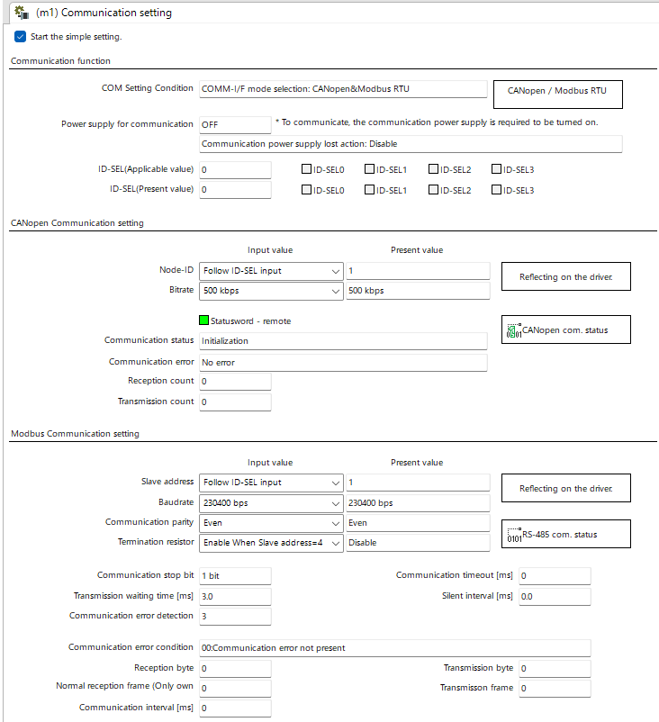

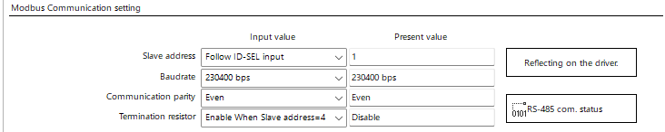

## Page 75

Direct data operation
| STEP 4 | Excitation of motor |     |     |     |
| ------ | ------------------- | --- | --- | --- |
Send the following query to turn the S-ON input of remote I/O ON.
Turning the S-ON input ON causes the motor to put into an excitation state.
01    10    00 7C    00 02    04    00 00 00 01    35    1E 
 
| 1 2 | 3 4 | 5 6 | 7 8 |     |
| --- | --- | --- | --- | --- |
Communication data 
| Number |     |     | Description |     |
| ------ | --- | --- | ----------- | --- |
(HEX)
|     | 01  | Address number=1 |     |     |
| --- | --- | ---------------- | --- | --- |
①
|     | 10  | Function code=10h |     |     |
| --- | --- | ----------------- | --- | --- |
②
|     | 00 7C | Write register lead address=007Ch |     | 2 Operating method |
| --- | ----- | --------------------------------- | --- | ------------------ |
③
| ④   | 00 02 | Number of write registers=2 registers |     |     |
| --- | ----- | ------------------------------------- | --- | --- |
| ⑤   | 04    | Number of write data bytes=4 bytes    |     |     |
⑥ 00 00 00 01 Turn the S-ON input ON (put the motor into an excitation state)
| ⑦   | 35  | Error check (lower) |     |     |
| --- | --- | ------------------- | --- | --- |
| ⑧   | 1E  | Error check (upper) |     |     |
75

## Page 76

Direct data operation
| STEP 5 |     | Operation of motor |     |     |     |     |
| ------ | --- | ------------------ | --- | --- | --- | --- |
As an example, this section explains how to execute the following operation. The trigger is assumed to be overridden 
collectively.
[Operation profile]
Velocity
1000 r/min
|                    |     | n        |     | D       |     |     |
| ------------------ | --- | -------- | --- | ------- | --- | --- |
|                    |     | i o s    |     | e       |     |     |
|                    |     | at 0     |     | tim c e |     |     |
|                    |     | r .      |     | le      |     |     |
|                    |     | el e   1 |     | e ra    |     |     |
|                    |     | e        |     |  2      |     |     |
|                    |     | c c m    |     | .5 tio  |     |     |
|                    |     | A ti     |     |  s n    |     |     |
| 2 Operating method |     |          |     | Time    |     |     |
01    10    00 5A    00 0E    1C    00 00 00 30    00 00 00 00    00 00 03 E8 
|     | 1 2 | 3 4 | 5 6 | 7   | 8   |     |
| --- | --- | --- | --- | --- | --- | --- |
 
00 00 03 E8    00 00 09 C4    00 00 03 E8    00 00 00 01    87    36
|     |     | 9   | 10  | 11  | 12 13 | 14  |
| --- | --- | --- | --- | --- | ----- | --- |
1.  Send the operation data and the trigger with the following query. Operation is started at the same time as the 
send. 
Communication data 
|     | Number |     |     | Description |     |     |
| --- | ------ | --- | --- | ----------- | --- | --- |
(HEX)
|     | ①   | 01    | Address number=1                       |     |     |     |
| --- | --- | ----- | -------------------------------------- | --- | --- | --- |
|     | ②   | 10    | Function code=10h                      |     |     |     |
|     | ③   | 00 5A | Write register lead address=005Ah      |     |     |     |
|     | ④   | 00 0E | Number of write registers=14 registers |     |     |     |
|     | ⑤   | 1C    | Number of write data bytes=28 bytes    |     |     |     |
Operation type=48: (Motion extension)  
|     | ⑥   | 00 00 00 30 |                 | continuous operation   |     |     |
| --- | --- | ----------- | --------------- | ---------------------- | --- | --- |
|     |     |             |                 | (speed control)        |     |     |
|     | ⑦   | 00 00 00 00 | Position=0 step |                        |     |     |
Setting of operation profile
|     | ⑧   | 00 00 03 E8 | Operating velocity=1000 r/min             |     |     |     |
| --- | --- | ----------- | ----------------------------------------- | --- | --- | --- |
|     | ⑨   | 00 00 03 E8 | Acceleration rate=1,000 ms                |     |     |     |
|     | ⑩   | 00 00 09 C4 | Deceleration rate=2,500 ms                |     |     |     |
|     | ⑪   | 00 00 03 E8 | Torque limiting value=100.0%              |     |     |     |
|     | ⑫   | 00 00 00 01 | Trigger=1: Normal start, Lifetime disable |     |     |     |
|     | ⑬   | 87          | Error check (lower)                       |     |     |     |
|     | ⑭   | 36          | Error check (upper)                       |     |     |     |
2.  Check the motor rotates without any problem.
When combining a 400 W motor with a gear, use the motion extension mode. 
When the 400 W motor with a gear is used in a normal state, the motor may be damaged if it rapidly 
decelerates while the demand velocity is significantly different from the actual velocity.
76

## Page 77

Direct data operation
| STEP 6 | Check of operation |     |     |     |     |
| ------ | ------------------ | --- | --- | --- | --- |
How did it go? Were you able to operate the motor properly? If the motor does not operate, check the following 
points.
• Is any alarm present?
• Are the power supply, the motor, and the RS-485 communication cable connected securely?
• Is the power supply for communication turned on?
• Are the slave addresses, the transmission rate, and the termination resistor set correctly?
• Is the COMM LED unlit? Or is it lit in red? (A communication error occurs)
• Is an unintended input signal is turned ON?
| STEP 7 | Stop of operation |     |     |     |     |
| ------ | ----------------- | --- | --- | --- | --- |
2 Operating method
1.  Send the operation data and the trigger with the following query. Operation is stopped at the same time as the 
send.
01    10    00 5A    00 0E    1C    00 00 00 00    00 00 00 00    00 00 00 00 
| 1 2 | 3 4 | 5 6 | 7   | 8   |     |
| --- | --- | --- | --- | --- | --- |
 
00 00 03 E8    00 00 09 C4    00 00 03 E8    00 00 00 01    46    B9
|     | 9   | 10  | 11  | 12 13 | 14  |
| --- | --- | --- | --- | ----- | --- |
Communication data 
| Number |     |     | Description |     |     |
| ------ | --- | --- | ----------- | --- | --- |
(HEX)
| ①   | 01    | Address number=1                       |     |     |     |
| --- | ----- | -------------------------------------- | --- | --- | --- |
| ②   | 10    | Function code=10h                      |     |     |     |
| ③   | 00 5A | Write register lead address=005Ah      |     |     |     |
| ④   | 00 0E | Number of write registers=14 registers |     |     |     |
| ⑤   | 1C    | Number of write data bytes=28 bytes    |     |     |     |
Operation type=0: Deceleration stop  
| ⑥   | 00 00 00 00 |                                           |                                                |     |     |
| --- | ----------- | ----------------------------------------- | ---------------------------------------------- | --- | --- |
|     |             |                                           | (according to the specified operation profile) |     |     |
| ⑦   | 00 00 00 00 | Position=0 step                           |                                                |     |     |
| ⑧   | 00 00 00 00 | Operating velocity=0 r/min                |                                                |     |     |
| ⑨   | 00 00 03 E8 | Acceleration rate=1,000 ms                |                                                |     |     |
| ⑩   | 00 00 09 C4 | Deceleration rate=2,500 ms                |                                                |     |     |
| ⑪   | 00 00 03 E8 | Torque limiting value=100.0%              |                                                |     |     |
| ⑫   | 00 00 00 01 | Trigger=1: Normal start, Lifetime disable |                                                |     |     |
| ⑬   | 46          | Error check (lower)                       |                                                |     |     |
|     | B9          | Error check (upper)                       |                                                |     |     |
⑭
2.  Check the motor stops without any problem.
77

## Page 78

Direct data operation
| 4-2  Command necessary for direct data operation |     |     |                 |     |
| ------------------------------------------------ | --- | --- | --------------- | --- |
| Register address                                 |     |     | Initial setting |     |
Name Description
| Upper Lower |     |     | Initial value | Unit |
| ----------- | --- | --- | ------------- | ---- |
The operation data of the specified operation data 
number is transferred to the direct data operation 
command.  
Writing a value of the operation data number executes 
the data transfer.  
Commands to be transferred are as follows. 
Direct data operation 
| 88  89          |                 | • Direct data operation operation type  |      |     |
| --------------- | --------------- | --------------------------------------- | ---- | --- |
|                 | operation data  |                                         | 0 *1 | −   |
| (0058h) (0059h) |                 | • Direct data operation position        |      |     |
number
• Direct data operation operating velocity 
2 Operating method • Direct data operation acceleration rate 
• Direct data operation deceleration rate 
• Direct data operation torque limiting value
[Setting range] 
0 to 255: Operation data No.0 to No.255
Sets the operation type for direct data operation.
| 90  91          | Direct data operation  |                 |      |     |
| --------------- | ---------------------- | --------------- | ---- | --- |
|                 |                        |                 | 0 *2 | −   |
| (005Ah) (005Bh) | operation type         | [Setting range] |      |     |
Refer to "3-4 Selecting the operation type" on p.64.
Sets the target position for direct data operation.
| 92  93          | Direct data operation  | [Setting range]  |      |      |
| --------------- | ---------------------- | ---------------- | ---- | ---- |
|                 |                        |                  | 0 *2 | step |
| (005Ch) (005Dh) | position               |                  |      |      |
−2,147,483,648 to 2,147,483,647  
(User-defined position unit)
Sets the operating velocity for direct data operation.
| 94  95          | Direct data operation  |                  |      |       |
| --------------- | ---------------------- | ---------------- | ---- | ----- |
|                 |                        |                  | 0 *2 | r/min |
| (005Eh) (005Fh) | operating velocity     | [Setting range]  |      |       |
−4,000,000 to 4,000,000 (User-defined velocity unit)
Sets the acceleration rate (acceleration time) for direct 
data operation.
| 96  97          | Direct data operation  |                  |          |     |
| --------------- | ---------------------- | ---------------- | -------- | --- |
|                 |                        |                  | 1,000 *2 | ms  |
| (0060h) (0061h) | acceleration rate      | [Setting range]  |          |     |
1 to 1,000,000,000  
(User-defined acceleration/deceleration unit)
Sets the deceleration rate (deceleration time) for direct 
data operation.
| 98  99          | Direct data operation  |                  |          |     |
| --------------- | ---------------------- | ---------------- | -------- | --- |
|                 |                        | [Setting range]  | 1,000 *2 | ms  |
| (0062h) (0063h) | deceleration rate      |                  |          |     |
1 to 1,000,000,000  
(User-defined acceleration/deceleration unit)
Sets the torque limiting value for direct data operation.
| 100  101        | Direct data operation  |                  |           |        |
| --------------- | ---------------------- | ---------------- | --------- | ------ |
|                 |                        | [Setting range]  | 10,000 *2 | 1=0.1% |
| (0064h) (0065h) | torque limiting value  |                  |           |        |
−1,000 to 10,000 (1=0.1%) *3
78

## Page 79

Direct data operation
2
Operating
method
Register address Initial setting
Name Description
Upper Lower Initial value Unit
Sets the trigger and the lifetime for direct data
operation.
[Setting range]
<Upper 16 bits> Lifetime setting *4
−1, 0: Direct data operation lifetime disable
1 to 32767: Direct data operation lifetime setting value
[ms]
<Lower 16 bits> Trigger setting
−7: Operation data number
−6: Operation type
−5: Position
−4: Operating velocity
−3: Acceleration rate
−2: Deceleration rate
−1: Torque limiting value
102 103 Direct data operation
0: Disable 0 −
(0066h) (0067h) trigger
1 to 3: Normal start
4, 5: Unit specified start
(acceleration/deceleration: rate)
6, 7: Unit specified start
(acceleration/deceleration: time)
8, 9: Unit specified start (velocity: step/s)
10, 11: Unit specified start
(velocity: step/s, acceleration/deceleration: rate)
12, 13: Unit specified start
(velocity: step/s, acceleration/deceleration: time)
14, 15: Unit specified start (velocity: r/min)
16, 17: Unit specified start
(velocity: r/min, acceleration/deceleration: rate)
18, 19: Unit specified start
(velocity: r/min, acceleration/deceleration: time)
Selects the stored area when the next direct data is
transferred during direct data operation.
104 105 Direct data operation (Data destination _p.84)
forwarding 0 −
(0068h) (0069h) [Setting range]
destination
0: Execution memory
1: Buffer memory
*1 The value set in the "Direct data operation operation parameter initial value reference data number" parameter will be the
initial value.
*2 The operation data of the operation data number set in the "Direct data operation operation parameter initial value reference
data number" parameter will be the initial value.
*3 The maximum torque limiting value varies depending on the motor. Refer to p.41 for the maximum value of each motor.
Set a negative value only when performing continuous operation (torque control).
*4 It is effective for the driver version 3.00 or later.
79

## Page 80

Direct data operation
80
2
Operating
method
„ Related parameters
Register address Initial setting
Name Description Initial
Upper Lower Unit
value
When "0" is written to the operating velocity, selects
whether to decelerate the motor to a stop or to change
Direct data operation
544 545 only the velocity to "0" in an operating status. *1
zero speed command 0 −
(0220h) (0221h) [Setting range]
action
0: Deceleration stop command
1: Velocity zero command
Sets the initial value of the trigger (lower 16 bits).
[Setting range]
−7: Operation data number update
−6: Operation type update
546 547 Direct data operation −5: Position update
0 −
(0222h) (0223h) trigger initial value −4: Operating velocity update
−3: Acceleration rate update
−2: Deceleration rate update
−1: Torque limiting value update
0: The trigger is used
Sets the initial value of the data destination.
Direct data operation
548 549 [Setting range]
data destination initial 0 −
(0224h) (0225h) 0: Execution memory
value
1: Buffer memory
Direct data operation Sets the operation data number to be used as the initial
550 551 operation parameter value for direct data operation.
0 −
(0226h) (0227h) initial value reference [Setting range]
data number 0 to 255: Operation data number
Sets the movement when setting "Direct data operation
trigger" which is set the trigger factor to transfer or
update the data in the direct data operation memory
area as execution data. When this parameter is set to
enable, if direct data operation is started by writing to
"Direct data operation trigger," the trigger (lower 16 bits)
of "Direct data operation trigger" is automatically cleared
to "0" regardless of whether it is successful or not.
Therefore, if the same data is written, direct data
operation can be started as many times as written. When
552 553 Direct data operation
this parameter is set to disable, "Direct data operation 1 −
(0228h) (0229h) trigger automatic clear
trigger" is not cleared to 0 even if it is written. Therefore,
direct data operation is not started even if the same data
is written in succession. To restart, one of the following is
required.
• Write "0" to "Direct data operation trigger" and then
write the value for starting.
• Write a different value to "Direct data operation trigger."
[Setting range]
0: Disable
1: Enable
Sets the initial value for direct data operation lifetime.
572 573 Direct data operation [Setting range]
0 ms
(023Ch) (023Dh) lifetime initial value *2 0: Disable
1 to 32,767 ms
*1 Although the motor does not rotate because the velocity is "0," the output signals are in an operating status.
*2 It is effective for the driver version 3.00 or later.

## Page 81

Direct data operation
4-3  Trigger and lifetime
Sets the trigger and the lifetime for direct data operation. 
Upper 16 bits: Direct data operation lifetime
Lower 16 bits: Trigger
If either the direct data operation lifetime or the trigger is out of the range, a communication error of 
"Out of setting range" occurs. In this case, both the upper and lower values are not applied.
„ Lower 16 bits   Trigger
This is a trigger to start operation at the same time as overriding of data in direct data operation.
„ When the trigger setting is "0" to "19" 2 Operating method
When the following value is written, all data is written in the selected unit, and simultaneously direct data operation is 
started. It is not started if the same value is written. If the "Direct data operation trigger automatic clear" parameter is 
set to "Enable," the trigger (lower 16 bits) will automatically return to "0" regardless of whether the operation is started 
or not (initial value: Enable).
xxxx: If the lifetime is not used, set 0000h or FFFFh.  
Set the lifetime when using it.
| Setting value |     |     |     |     | Starting method |     |
| ------------- | --- | --- | --- | --- | --------------- | --- |
Starting mode
Acceleration/
| Dec * | Hex |     |     |     | Velocity unit |     |
| ----- | --- | --- | --- | --- | ------------- | --- |
deceleration unit
| 0   | xxxx 0000h  |     | Not start |     | −   | −             |
| --- | ----------- | --- | --------- | --- | --- | ------------- |
|     | xxxx 0001h  |     |           |     |     | User-defined  |
1 (or 2, 3) (xxxx 0002h)  Normal start User-defined velocity unit acceleration/
|     | (xxxx 0003h) |     |                       |     |     | deceleration unit  |
| --- | ------------ | --- | --------------------- | --- | --- | ------------------ |
|     |              |     | Unit specified start  |     |     | (Velocity unit)/s  |
xxxx 0004h 
4 (or 5) (acceleration/ User-defined velocity unit (acceleration/
(xxxx 0005h)
|     |     |     | deceleration)         |     |     | deceleration rate) |
| --- | --- | --- | --------------------- | --- | --- | ------------------ |
|     |     |     | Unit specified start  |     |     | ms                 |
xxxx 0006h 
6 (or 7) (acceleration/ User-defined velocity unit (acceleration/
(xxxx 0007h)
|     |     |     | deceleration) |     |     | deceleration time) |
| --- | --- | --- | ------------- | --- | --- | ------------------ |
User-defined 
|          | xxxx 0008h   |     | Unit specified start  |                                  | step/s  |               |
| -------- | ------------ | --- | --------------------- | -------------------------------- | ------- | ------------- |
| 8 (or 9) |              |     |                       |                                  |         | acceleration/ |
|          | (xxxx 0009h) |     | (velocity)            | ((User-defined position unit)/s) |         |               |
deceleration unit
|            |              |                          | Unit specified start  |                                  |         | (Velocity unit)/s  |
| ---------- | ------------ | ------------------------ | --------------------- | -------------------------------- | ------- | ------------------ |
|            | xxxx 000Ah   |                          |                       |                                  | step/s  |                    |
| 10 (or 11) |              | (velocity, acceleration/ |                       |                                  |         | (acceleration/     |
|            | (xxxx 000Bh) |                          |                       | ((User-defined position unit)/s) |         |                    |
|            |              |                          | deceleration)         |                                  |         | deceleration rate) |
|            |              |                          | Unit specified start  |                                  |         | ms                 |
|            | xxxx 000Ch   |                          |                       |                                  | step/s  |                    |
| 12 (or 13) |              | (velocity, acceleration/ |                       |                                  |         | (acceleration/     |
|            | (xxxx 000Dh) |                          |                       | ((User-defined position unit)/s) |         |                    |
|            |              |                          | deceleration)         |                                  |         | deceleration time) |
User-defined 
|            | xxxx 000Eh   |     | Unit specified start  |     |                     |               |
| ---------- | ------------ | --- | --------------------- | --- | ------------------- | ------------- |
| 14 (or 15) |              |     |                       |     | r/min (motor shaft) | acceleration/ |
|            | (xxxx 000Fh) |     | (velocity)            |     |                     |               |
deceleration unit
|     |     |     | Unit specified start  |     |     | (Velocity unit)/s  |
| --- | --- | --- | --------------------- | --- | --- | ------------------ |
xxxx 0010h 
16 (or 17) (velocity, acceleration/ r/min (motor shaft) (acceleration/
(xxxx 0011h)
|     |     |     | deceleration)         |     |     | deceleration rate) |
| --- | --- | --- | --------------------- | --- | --- | ------------------ |
|     |     |     | Unit specified start  |     |     | ms                 |
xxxx 0012h 
18 (or 19) (velocity, acceleration/ r/min (motor shaft) (acceleration/
(xxxx 0013h)
|     |     |     | deceleration) |     |     | deceleration time) |
| --- | --- | --- | ------------- | --- | --- | ------------------ |
* This is the value when the lifetime is not used.
If the operation is started in a state where the setting value is "8" to "19" (Unit specified start (velocity) 
or Unit specified start (velocity, acceleration/deceleration)), the monitor unit of the target velocity 
will be the same as the specified unit only when the operation is being performed. Therefore, the 
target velocity is the value having commanded.
81

## Page 82

Direct data operation
„ When the trigger setting is "−1" to "−7"
Direct data operation is started when the data corresponding to the trigger is written. Even if operation is started, the 
setting value of the trigger is retained.
xxxx: If the lifetime is not used, set 0000h or FFFFh.  
Set the lifetime when using it.
Setting value Starting method
Starting mode
Acceleration/deceleration 
| Dec * | Hex | Velocity unit |
| ----- | --- | ------------- |
unit
Start when writing  User-defined acceleration/
| −7  | xxxx FFF9h | User-defined velocity unit |
| --- | ---------- | -------------------------- |
operation data number deceleration unit
Start when writing  User-defined acceleration/
| −6  | xxxx FFFAh | User-defined velocity unit |
| --- | ---------- | -------------------------- |
operation type deceleration unit
2 Operating method
User-defined acceleration/
| −5  | xxxx FFFBh Start when writing position | User-defined velocity unit |
| --- | -------------------------------------- | -------------------------- |
deceleration unit
User-defined acceleration/
| −4  | xxxx FFFCh Start when writing velocity | User-defined velocity unit |
| --- | -------------------------------------- | -------------------------- |
deceleration unit
Start when writing  User-defined acceleration/
| −3  | xxxx FFFDh | User-defined velocity unit |
| --- | ---------- | -------------------------- |
acceleration rate deceleration unit
Start when writing  User-defined acceleration/
| −2  | xxxx FFFEh | User-defined velocity unit |
| --- | ---------- | -------------------------- |
deceleration rate deceleration unit
Start when writing torque  User-defined acceleration/
| −1  | xxxx FFFFh | User-defined velocity unit |
| --- | ---------- | -------------------------- |
limiting value deceleration unit
* This is the value when the lifetime is not used.
„ Setting value of xxxx (setting value of lifetime)
Setting value
Direct data operation 
Description
| Dec    | Hex lifetime action |     |
| ------ | ------------------- | --- |
| −32768 | 8000h               |     |
•  •  The direct data operation lifetime is out of the setting range.  
Out of setting range
| •   | •     | The lifetime is continued counting while being counted. |
| --- | ----- | ------------------------------------------------------- |
| −2  | FFFEh |                                                         |
| −1  | FFFFh |                                                         |
The direct data operation lifetime is disabled.  
Stop
0 0000h The lifetime is stopped counting when already counting.
| 1   | 0001h |     |
| --- | ----- | --- |
| 2   | 0002h |     |
The setting value will be the direct data operation lifetime [ms].  
| •   | •  Start |     |
| --- | -------- | --- |
The lifetime is updated when already counting.
| •     | •     |     |
| ----- | ----- | --- |
| 32767 | 7FFFh |     |
82

## Page 83

Direct data operation
2
Operating
method
„ Upper 16 bits Direct data operation lifetime
z Direct data operation lifetime
The lifetime for direct data operation can be set.
Use the lifetime when direct data operation is periodically executed.
If the lifetime is set, the timer inside the driver starts counting (countdown) when direct data operation is executed.
When the count value reaches "0," an alarm of "RS-485 communication timeout" is generated, and the motor stops.
The lifetime is updated when the direct data operation is executed.
It is not updated by other communication than direct data operation.
Master Query Query Query Query
Executes direct Executes direct Actual velocity Communication
data operation data operation monitor errors
(first time)
Slave Response Response Response
(driver)
Lifetime count
Sets the lifetime Update of lifetime The lifetime is not updated by other
Starts counting communication than direct data operation.
Direct data operation
lifetime setting value
RS-485 communication
timeout alarm is generated
z Update of lifetime
The lifetime is stopped counting to set again.
The lifetime is updated at the following.
• When direct data operation is executed
• When the "Direct data operation trigger" command is written
83

## Page 84

Direct data operation
84
2
Operating
method
4-4 Data destination
During direct data operation, the stored area when the next direct data is transferred can be selected.
Setting value
Data destination
Dec Hex
0 0000 0000h Execution memory
1 0000 0001h Buffer memory
„ When the data destination is set to "Execution memory"
When the trigger is written, the data in operation can be overridden to the next direct data.
ON
RDY-DD-OPE output
OFF
ON
Trigger
OFF
Buffer memory
Data destination
Execution memory
Direct data A B C D E
Direct data
Buffer memory
ON
MOVE output A B C D E
OFF
ON
DDBUF-FULL output
OFF

## Page 85

Direct data operation
2
Operating
method
„ When the data destination is set to "Buffer memory"
If the trigger is written, the next direct data is stored in the buffer memory. When the data during operation is
completed, operation of the buffer memory is automatically started. One direct data can be stored in the buffer
memory. If the next direct data is written to the buffer memory, the DDBUF-FULL output is turned ON.
During stop or continuous operation, if "Buffer memory" is specified, the data is not stored in the buffer memory and
it is overridden to the next direct data immediately.
In the following cases, even if "Buffer memory" is specified, the direct data is not stored in the buffer memory. It is
rewritten to the next direct data immediately.
• When stopped (when operation is already ended)
• During continuous operation
• While instructing execution of stop operation
ON
RDY-DD-OPE output
OFF
ON
Trigger
OFF
Buffer memory
Data destination
Execution memory
Direct data A B C D E
Direct data
B C
Buffer memory
ON
MOVE output A B C D E
OFF
ON
DDBUF-FULL output
OFF
If the trigger is written in a state where the DDBUF-FULL output is ON, the following is applied.
When the data destination is set to "Buffer memory": The direct data is not applied.
When the data destination is set to "Execution memory": The written data is applied.
The data in the buffer memory is cleared.
4-5 Transfer of operation data
The value is transferred from the operation data of the direct data operation operation data number to each
command at the following time.
• When the main power supply is turned on or when Configuration is executed.
• When writing to the direct data operation operation data number is executed
Operation data (data source) and direct data operation command (data destination) are as follows.
Operation data (data source) Direct data operation command (data destination)
Operation type Direct data operation operation type
Position Direct data operation position
Velocity Direct data operation operating velocity
Acceleration rate / Acceleration time * Direct data operation acceleration rate
Deceleration rate / Deceleration time * Direct data operation deceleration rate
Torque limiting value Direct data operation torque limiting value
* The operation data of the data source varies depending on the setting of the "User-defined acceleration/
deceleration unit setting (DD, FWRV, SD, HOME operation)" parameter.
(User-defined velocity unit)/s: Acceleration rate and deceleration rate
ms: Acceleration time and deceleration time
85

## Page 86

Direct data operation
4-6  Operation example when operation data was overridden
This is operation when the data destination was set to "Execution memory" and the operation data was overridden 
(override).
(Operation example)
Operation when having overridden to the direct data operation 2 while the direct data operation 1 is executed
Example 1
Direct data operation 1: Continuous operation
Direct data operation 2: Continuous operation
When operating velocity 2 is faster than operating velocity 1 When operating velocity 1 is faster than operating velocity 2
| Velocity             |     |                      | Velocity |     |     |     |
| -------------------- | --- | -------------------- | -------- | --- | --- | --- |
| Operating velocity 2 |     | Operating velocity 1 |          |     |     |     |
2 Operating method
| Operating velocity 1 |     | Operating velocity 2 |     |     |     |     |
| -------------------- | --- | -------------------- | --- | --- | --- | --- |
| Starting velocity    |     | Starting velocity    |     |     |     |     |
Time Time
|                         | Acceleration | Acceleration            |        | Acceleration | Deceleration |     |
| ----------------------- | ------------ | ----------------------- | ------ | ------------ | ------------ | --- |
| Torque                  |              |                         | Torque |              |              |     |
|                         | rate 1       | rate 2                  |        | rate 1       | rate 2       |     |
|                         | (time)       | (time)                  |        | (time)       | (time)       |     |
| Torque limiting value 2 |              | Torque limiting value 2 |        |              |              |     |
| Torque limiting value 1 |              | Torque limiting value 1 |        |              |              |     |
Time Time
Example 2
Direct data operation 1: Positioning operation
Direct data operation 2: Positioning operation
When operating velocity 2 is faster than operating velocity 1 When operating velocity 1 is faster than operating velocity 2
Velocity
| Velocity |     | Position 2 (travel amount) |     |     |     |            |
| -------- | --- | -------------------------- | --- | --- | --- | ---------- |
|          |     | Operating velocity 1       |     |     |     | Position 2 |
Operating velocity 2
 (travel amount)
Operating velocity 2
Operating velocity 1
| Starting velocity |     | Starting velocity |     |     |     |     |
| ----------------- | --- | ----------------- | --- | --- | --- | --- |
Time Time
Acceleration Acceleration Deceleration Acceleration Deceleration Deceleration
| Torque                  |        |                         | Torque |        |        |        |
| ----------------------- | ------ | ----------------------- | ------ | ------ | ------ | ------ |
|                         | rate 1 | rate 2 rate 2           |        | rate 1 | rate 2 | rate 2 |
|                         | (time) | (time) (time)           |        |        |        |        |
|                         |        |                         |        | (time) | (time) | (time) |
| Torque limiting value 2 |        | Torque limiting value 2 |        |        |        |        |
| Torque limiting value 1 |        | Torque limiting value 1 |        |        |        |        |
Time
Time
Example 3
Direct data operation 1: Continuous operation
Direct data operation 2: Positioning operation
When operating velocity 2 is faster than operating velocity 1 When operating velocity 1 is faster than operating velocity 2
| Velocity |     | Position 2 (travel amount) | Velocity |     |     |     |
| -------- | --- | -------------------------- | -------- | --- | --- | --- |
Operating velocity 1
| Operating velocity 2 |     |     |     |     |     | Position 2 |
| -------------------- | --- | --- | --- | --- | --- | ---------- |
 (travel amount)
| Operating velocity 1 |     | Operating velocity 2 |     |     |     |     |
| -------------------- | --- | -------------------- | --- | --- | --- | --- |
| Starting velocity    |     | Starting velocity    |     |     |     |     |
Time Time
Torque Acceleration Acceleration Deceleration Torque Acceleration Deceleration Deceleration
|     | rate 1 | rate 2 rate 2 |     | rate 1 | rate 2 | rate 2 |
| --- | ------ | ------------- | --- | ------ | ------ | ------ |
(time)
|                         |     | (time) (time)           |     | (time) | (time) | (time) |
| ----------------------- | --- | ----------------------- | --- | ------ | ------ | ------ |
| Torque limiting value 2 |     | Torque limiting value 2 |     |        |        |        |
| Torque limiting value 1 |     | Torque limiting value 1 |     |        |        |        |
Time Time
86

## Page 87

Direct data operation
2
Operating
method
When the user-defined acceleration/deceleration unit is "ms" (time), the slope of acceleration/
deceleration is calculated based on the time from when the writing was performed.
Therefore, when the same data is redundantly written, the slope of acceleration/deceleration will be
smaller than that when it was written the first time even if the same data is written. (*1, *2)
*1 When the demand velocity does not reach the target velocity.
*2 Sop operation is excluded.
When the same data is redundantly written, setting the acceleration/deceleration unit to "(User-
defined velocity unit)/s" (acceleration/deceleration rate) is recommended.
Example: If the same data is written multiple times when decelerating from high speed
to low speed.
• User-defined acceleration/deceleration unit: ms
Deceleration command
Velocity
Target velocity
Time
• User-defined acceleration/deceleration unit: (User-defined velocity unit)/s
Deceleration command
Velocity
Target velocity
Time
87

## Page 88

Direct data operation
88
2
Operating
method
4-7 Timing chart
1. Check the RDY-DD-OPE output is being ON.
2. Send a query (including the trigger and data) to execute direct data operation.
3. When the master sends a query, the MOVE output is turned ON and operation is started.
4. When the motor stops, the MOVE output is turned OFF.
2 3
Master Query
Communication
Slave Response
ON
S-ON input
OFF
1
ON
RDY-DD-OPE output
OFF
ON 4
MOVE output
OFF
Motor operation
*1 *2
Master Query
Communication
Slave Response
ON
S-ON input
OFF
ON
RDY-DD-OPE output
OFF
*3
ON
MOVE output
OFF
Motor operation
*1 Query via RS-485 communication
*2 C3.5 (silent interval) + Longer one from among Tb4 (query processing time) and Tb2 (transmission waiting time)
*3 C3.5 (silent interval) + Tb4 (query processing time) + 2 ms or less

## Page 89

Stored data operation
| 5   | Stored data operation |     |     |     |     |     |     |     |     |     |     |     |
| --- | --------------------- | --- | --- | --- | --- | --- | --- | --- | --- | --- | --- | --- |
Stored data operation is an operation that sets the operation data such as the motor operating velocity and position 
(travel amount) and executes.
| 5-1  | Types of stored data (SD) operation |     |     |     |     |     |     |     |     |     |     |     |
| ---- | ----------------------------------- | --- | --- | --- | --- | --- | --- | --- | --- | --- | --- | --- |
Operation method
|     |     | Velocity |     |     |     |     | Velocity |     |     |     |     |     |
| --- | --- | -------- | --- | --- | --- | --- | -------- | --- | --- | --- | --- | --- |
2 Operating method
|     |             | 0   |                       |      |     |     |             | 0   |                      |     |      |     |
| --- | ----------- | --- | --------------------- | ---- | --- | --- | ----------- | --- | -------------------- | --- | ---- | --- |
|     |             |     |                       | Time |     |     |             |     |                      |     | Time |     |
|     | START input |     |                       |      |     |     | START input |     |                      |     |      |     |
|     |             |     | Positioning operation |      |     |     |             |     | Continuous operation |     |      |     |
Positioning operation
(speed control)
Positioning
push-motion operation
Linked method
|             | Velocity       |      | Velocity     |            |     | Velocity    |     |            |      | Velocity    |            |      |
| ----------- | -------------- | ---- | ------------ | ---------- | --- | ----------- | --- | ---------- | ---- | ----------- | ---------- | ---- |
|             | 0              |      |              | 0          |     |             | 0   |            |      |             | 0          |      |
|             |                | Time |              |            |     | Time        |     |            | Time |             |            | Time |
| START input |                |      | SSTART input |            |     | START input |     |            |      | START input |            |      |
|             | No link        |      |              | Manual     |     |             |     | Automatic  |      |             | Continuous |      |
|             | (single-motion |      |              | sequential |     |             |     | sequential |      |             | sequential |      |
|             | operation)     |      |              | operation  |     |             |     | operation  |      |             | operation  |      |
Extended linked method
|     |     | Velocity |     |     |          |     | Velocity |     |     | Without trigger |          |     |
| --- | --- | -------- | --- | --- | -------- | --- | -------- | --- | --- | --------------- | -------- | --- |
|     |     |          | 0   |     | Position |     |          | 0   |     |                 | Position |     |
With trigger
|     |     | START input |     |     |     |     | START input |     |     |     |     |     |
| --- | --- | ----------- | --- | --- | --- | --- | ----------- | --- | --- | --- | --- | --- |
Event trigger input
|     |     |     | Loop operation |     |     |     |     | Event jump operation |     |     |     |     |
| --- | --- | --- | -------------- | --- | --- | --- | --- | -------------------- | --- | --- | --- | --- |
89

## Page 90

Stored data operation
90
2
Operating
method
5-2 Setting the data
There are the following two types of settings for stored data operation.
z Operation data
Operation type, position, operating velocity, acceleration/deceleration rate, torque limiting value, etc. necessary for
stored data operation are set.
z Operation I/O event
Conditions to generate an event necessary for the event jump function and the event jump destination and event link
of operation when an event is generated are set. Use when the event jump function is used.
„ Operation data
Initial setting
Name Description
Initial value Unit
Selects the operation type.
Operation type [Setting range] 0 −
Refer to "3-4 Selecting the operation type" on p.64.
Sets the target position (travel amount).
It is not used for continuous operation.
Position 0 step
[Setting range]
−2,147,483,648 to 2,147,483,647 (User-defined position unit)
Sets the operating velocity.
Operating velocity [Setting range] 0 r/min
−4,000,000 to 4,000,000 (User-defined velocity unit)
Sets the acceleration rate.
Acceleration rate [Setting range] 1,000 (r/min)/s
1 to 1,000,000,000 ((User-defined velocity unit)/s)
Sets the deceleration rate.
Deceleration rate [Setting range] 1,000 (r/min)/s
1 to 1,000,000,000 ((User-defined velocity unit)/s)
Sets the acceleration time.
Acceleration time [Setting range] 1,000 ms
1 to 1,000,000,000 ms
Sets the deceleration time.
Deceleration time [Setting range] 1,000 ms
1 to 1,000,000,000 ms
Sets the torque limiting value.
Torque limiting value [Setting range] 10,000 1=0.1%
−1,000 to 10,000 (1=0.1%) *
Sets the waiting time generated after operation is completed.
Drive-complete delay
[Setting range] 0 ms
time
0 to 65,535 ms
Sets the mode for link operation.
[Setting range]
0: No link
Link 0 −
1: Manual sequential
2: Automatic sequential
3: Continuous sequential operation
Sets the next data.
[Setting range]
−256: Stop
Next data number −1 −
−2: (+2)
−1: (+1)
0 to 255: Operation data number

## Page 91

Stored data operation
Initial setting
Name Description
|     |     | Initial value | Unit |
| --- | --- | ------------- | ---- |
Sets the distance from the center position of the range in 
which the MAREA output is turned ON to the target position 
of the positioning operation.
| Area offset |     | 0   | step |
| ----------- | --- | --- | ---- |
[Setting range] 
−2,147,483,648 to 2,147,483,647 (User-defined position unit)
Sets the range in which the MAREA output is turned ON.
[Setting range] 
| Area width |     | −1  | step |
| ---------- | --- | --- | ---- |
−1: Disable 
0 to 4,194,303 (User-defined position unit)
Sets the number of times of loop.
| Loop count | [Setting range]  | 0   | −   |
| ---------- | ---------------- | --- | --- |
2 Operating method
0 to 100,000,000
Offsets the position (travel amount) every time loop is 
executed.
| Loop offset |     | 0   | step |
| ----------- | --- | --- | ---- |
[Setting range] 
−4,194,304 to 4,194,303 (User-defined position unit)
Sets to the operation data number in which loop is completed.
[Setting range] 
| Loop end point |     | 0   | −   |
| -------------- | --- | --- | --- |
0: −(not the loop end point) 
1: }L-End (loop end point)
Sets the number of the operation I/O event to generate a low 
event. The condition to generate the event is set in the 
operation I/O event.
| (Low) I/O event number |     | −1  | −   |
| ---------------------- | --- | --- | --- |
[Setting range] 
−1: −(Disable) 
0 to 31: Operation I/O event number
Sets the number of the operation I/O event to generate a 
middle event. The condition to generate the event is set in the 
operation I/O event.
(Middle) I/O event 
|        |                  | −1  | −   |
| ------ | ---------------- | --- | --- |
| number | [Setting range]  |     |     |
−1: −(Disable) 
0 to 31: Operation I/O event number
Sets the number of the operation I/O event to generate a high 
event. The condition to generate the event is set in the 
| (High) I/O event  | operation I/O event. |     |     |
| ----------------- | -------------------- | --- | --- |
|                   |                      | −1  | −   |
number
[Setting range] 
−1: −(Disable) 
0 to 31: Operation I/O event number
* The maximum torque limiting value varies depending on the motor. Refer to p.41 for the maximum value of each 
motor. Set a negative value only when performing continuous operation (torque control).
91

## Page 92

Stored data operation
z  Position, operating velocity, acceleration rate, deceleration rate, torque limiting value, drive-complete 
delay time
The target position, operating velocity, acceleration/deceleration rate (acceleration/deceleration time), and torque 
limiting value necessary for stored data operation are set.
• Positioning operation
User-defined acceleration/deceleration unit:   User-defined acceleration/deceleration unit: ms
(User-defined velocity unit)/s
|     |                    | Velocity |                    |                    | Velocity |                 |     |
| --- | ------------------ | -------- | ------------------ | ------------------ | -------- | --------------- | --- |
|     | Operating velocity |          | Deceleration rate  | Operating velocity |          |                 |     |
|     |                    |          | Drive-complete     |                    |          | Drive-complete  |     |
|     |                    |          | delay time         |                    |          | delay time      |     |
Acceleration
|     | Starting velocity |     |     | Starting velocity |     |     |     |
| --- | ----------------- | --- | --- | ----------------- | --- | --- | --- |
rate
|                    |                       |        | Time |                       |              |              | Time |
| ------------------ | --------------------- | ------ | ---- | --------------------- | ------------ | ------------ | ---- |
|                    |                       |        |      |                       | Acceleration | Deceleration |      |
| 2 Operating method |                       |        |      |                       | time         | time         |      |
|                    |                       | Torque |      |                       | Torque       |              |      |
|                    | Torque limiting value |        |      | Torque limiting value |              |              |      |
|                    |                       |        | Time |                       |              |              | Time |
|                    | RDY-SD-OPE            | ON     |      | RDY-SD-OPE            | ON           |              |      |
|                    | output                | OFF    |      | output                | OFF          |              |      |
• Continuous operation
User-defined acceleration/deceleration unit:   User-defined acceleration/deceleration unit: ms
(User-defined velocity unit)/s
|     |                       | Velocity          |      |                       | Velocity          |     |      |
| --- | --------------------- | ----------------- | ---- | --------------------- | ----------------- | --- | ---- |
|     | Operating velocity    |                   |      | Operating velocity    |                   |     |      |
|     | Starting velocity     | Acceleration rate |      | Starting velocity     |                   |     |      |
|     |                       |                   | Time |                       | Acceleration time |     | Time |
|     |                       | Torque            |      |                       | Torque            |     |      |
|     | Torque limiting value |                   |      | Torque limiting value |                   |     |      |
|     |                       |                   | Time |                       |                   |     | Time |
|     | RDY-SD-OPE            | ON                |      | RDY-SD-OPE            | ON                |     |      |
|     | output                | OFF               |      | output                | OFF               |     |      |
• When operating velocity is faster than starting velocity • When starting velocity is equal to or faster than 
operating velocity
|     | Velocity |     |     | Velocity |     |     |     |
| --- | -------- | --- | --- | -------- | --- | --- | --- |
Position (travel amount)
|     | Operating velocity |     |     | Starting velocity |     |     |     |
| --- | ------------------ | --- | --- | ----------------- | --- | --- | --- |
Deceleration  Position (travel amount)
rate
Acceleration Operating velocity
Starting velocity rate
|     |     |     | Time |     |     |     | Time |
| --- | --- | --- | ---- | --- | --- | --- | ---- |
92

## Page 93

Stored data operation
2
Operating
method
z Link and next data number
• No link
Operation is executed once with a single operation data number. (single-motion operation)
• Manual sequential
Operation based on the operation data number set in the "Next data number" is executed whenever the SSTART
input is turned ON.
The SSTART input is enabled when the RDY-SD-OPE output is ON.
• Automatic sequential
Operation based on the operation data number set in the "Next data number" is automatically started after stop
for the time set in the "Drive-complete delay time."
• Continuous sequential operation
Operation based on the operation data number set in the "Next data number" is executed without stopping the
motor.
z Area offset, area width
Setting the area offset or the area width can set the range of the MAREA output for each operation data.
When the operation direction is the forward direction
• Positioning operation • Continuous operation
Velocity Velocity
Operating Operating
velocity
velocity
Starting Starting
Position Position
velocity velocity
Area offset Area offset
Target position Starting position
Width Width Width Width
ON ON
MAREA output MAREA output
OFF OFF
z Loop count, loop offset, loop end point
If the loop count, the loop offset, and the loop end point are set, the loop function is enabled.
z (Low) I/O event number, (middle) I/O event number, (high) I/O event number
If the (low) I/O event number, the (middle) I/O event number, the (high) I/O event number are set, the event jump
function is enabled.
When they occur simultaneously, they operate according to the following priority.
In descending order: (High) I/O event number - (Middle) I/O event number - (Low) I/O event number
93

## Page 94

Stored data operation
94
2
Operating
method
5-3 Operation I/O event
This is the operation I/O event necessary for setting the (low) I/O event number, the (middle) I/O event number, and
the (high) I/O event number.
Initial setting
Name Description
Initial value Unit
Sets the linked method after event trigger detection.
[Setting range]
0: No link
Link 0 −
1: Manual sequential
2: Automatic sequential
3: Continuous sequential operation
Sets the next data.
[Setting range]
−256: Stop
Next data number −256 −
−2: (+2)
−1: (+1)
0 to 255: Operation data number
Sets the waiting time generated after event trigger detection.
Dwell [Setting range] 0 ms
0 to 1,000,000 ms
Sets I/O to be used as an event trigger.
Event trigger I/O [Setting range] 0: Not used −
"2 Signals list" on p.153
Sets the timing to detect the event trigger.
[Setting range]
0: Not event execution
1: ON (calculated cumulative: ms)
2: ON (continuous: ms)
Event trigger type 3: OFF (calculated cumulative: ms) 0 −
4: OFF (continuous: ms)
5: ON (form: positive edge)
6: OFF(form: negative edge)
7: ON (cumulative: ms)
8: OFF (cumulative: ms)
Sets the judgment time to detect the event trigger or the number
of times of detection.
Event trigger counter 0 −
[Setting range]
0 to 1,000,000 (1=1 ms or 1=once)
z Link, next data number
Sets the linked method and the next data number when the event trigger is detected. There are the following four
modes for link.
• No link
The event is ignored.
• Manual sequential
This makes the present operation decelerate to a stop. Then, after the time set in "Dwell" is elapsed, the RDY-SD-
OPE output is turned ON. If the SSTART input is turned ON, the operation based on the operation data number set
in the "Next data number" is executed.
• Automatic sequential
This makes the present operation decelerate to a stop. Then, after the time set in "Dwell" is elapsed, the operation
based on the operation data number set in the "Next data number" is automatically started.
• Continuous sequential operation
The operation based on the operation data number set in the "Next data number" is started without stopping the
operation.

## Page 95

Stored data operation
5-4  Operation data number selection
There are the following three methods to select the operation data number to be started.
• Selection by NET selection number
• Direct selection (D-SEL0 to D-SEL15)
• Selection by M0 to M7 inputs
The priority is applied according to the following order: NET selection number, direct selection, M0 to M7 inputs.
z  NET selection number
The NET selection number is a method that sets the operation data number with remote I/O.
If an operation data number other than 0 to 255 is set, the NET selection number is disabled and the direct selection 
or the selection by the M0 to M7 inputs is enabled.
z  Direct selection
The direct selection is a method in which the operation data number is set with parameters and selected with D-SEL0  2 Operating method
to D-SEL15 inputs.
If all D-SEL0 to D-SEL15 inputs are turned OFF or two or more inputs are turned ON, the direct selection is disabled 
and the selection by the M0 to M7 inputs is enabled.
Related parameters
Initial setting
Parameter name Description
Initial value Unit
Sets how to start the motor when the D-SEL input is 
turned ON.
| D-SEL drive start function | [Setting range]  | 1 − |
| -------------------------- | ---------------- | --- |
0: Operation data number selection only 
1: Operation data number selection + START function
| D-SEL0 operation number selection |     | 0 − |
| --------------------------------- | --- | --- |
| D-SEL1 operation number selection |     | 1 − |
| D-SEL2 operation number selection |     | 2 − |
| D-SEL3 operation number selection |     | 3 − |
| D-SEL4 operation number selection |     | 4 − |
| D-SEL5 operation number selection |     | 5 − |
| D-SEL6 operation number selection |     | 6 − |
Sets the corresponding operation data number to 
D-SEL7 operation number selection be started when each D-SEL input is turned ON. 7 −
| D-SEL8 operation number selection | [Setting range]  | 8 − |
| --------------------------------- | ---------------- | --- |
0 to 255: Operation data number
| D-SEL9 operation number selection  |     | 9 −  |
| ---------------------------------- | --- | ---- |
| D-SEL10 operation number selection |     | 10 − |
| D-SEL11 operation number selection |     | 11 − |
| D-SEL12 operation number selection |     | 12 − |
| D-SEL13 operation number selection |     | 13 − |
| D-SEL14 operation number selection |     | 14 − |
| D-SEL15 operation number selection |     | 15 − |
95

## Page 96

Stored data operation
z  Selection by M0 to M7 inputs
This is a method in which a desired operation data number is selected by a combination of ON-OFF status of the M0 
to M7 inputs.
| Operation data number | M7 M6   | M5 M4   | M3 M2   | M1 M0   |
| --------------------- | ------- | ------- | ------- | ------- |
| 0                     | OFF OFF | OFF OFF | OFF OFF | OFF OFF |
| 1                     | OFF OFF | OFF OFF | OFF OFF | OFF ON  |
| 2                     | OFF OFF | OFF OFF | OFF OFF | ON OFF  |
| •                     | •  •    | •  •    | •  •    | •  •    |
| •                     | •  •    | •  •    | •  •    | •  •    |
| •                     | • •     | • •     | • •     | • •     |
| 253                   | ON ON   | ON ON   | ON ON   | OFF ON  |
| 254                   | ON ON   | ON ON   | ON ON   | ON OFF  |
2 Operating method
| 255 | ON ON | ON ON | ON ON | ON ON |
| --- | ----- | ----- | ----- | ----- |
96

## Page 97

Stored data operation
2
Operating
method
5-5 Operating method and timing chart
„ Positioning operation
z Operating method
1. Check the RDY-SD-OPE output is being ON.
2. Select the operation data number using the M0 to M7 inputs, and turn the START input ON.
3. The RDY-SD-OPE output is turned OFF and the motor starts operation.
4. Check the RDY-SD-OPE output has been turned OFF and turn the START input OFF.
5. When the operation is completed, the RDY-SD-OPE output is turned ON.
ON
S-ON input
OFF
ON 2 4
START input
OFF
ON
M0 to M7 input
OFF
1
ON 5
RDY-SD-OPE output
OFF
Internal velocity command
3
z Timing chart
ON
S-ON input
OFF
2 ms or more 2 ms or more
ON
START input
OFF
ON
M0 to M7 input
OFF
2 ms or less
ON
RDY-SD-OPE output
OFF
2 ms or less
ON
MOVE output
OFF
ON
IN-POS output
OFF
Internal velocity command
97

## Page 98

Stored data operation
98
2
Operating
method
„ Continuous operation
z Operating method
1. Check the RDY-SD-OPE output is being ON.
2. Select the operation data number using the M0 to M7 inputs, and turn the START input ON.
The RDY-SD-OPE output is turned OFF and the motor starts operation.
3. Check the RDY-SD-OPE output has been turned OFF and turn the START input OFF.
4. If the STOP input is turned ON, the motor starts deceleration stop.
5. When the motor stops, the RDY-SD-OPE output is turned ON.
ON
S-ON input
OFF
ON 2 3
START input
OFF
ON
M0 to M7 input
OFF
ON 4
STOP input
OFF
1
ON 5
RDY-SD-OPE output
OFF
Internal velocity command
z Timing chart
ON
S-ON input
OFF
2 ms or more 2 ms or more
ON
START input
OFF
ON
M0 to M7 input
OFF
ON
STOP input
OFF
2 ms or more
ON
RDY-SD-OPE output
OFF
2 ms or more
ON
MOVE output
OFF
ON
IN-POS output
OFF
Internal velocity command

## Page 99

Stored data operation
2
Operating
method
5-6 Link method of operation data
Operations of two or more operation data numbers are linked. If the base point for linked operation is changed using
the M0 to M7 inputs or the D-SEL0 to D-SEL15 inputs, linked operation with multiple operation patterns can be set.
This can be used when a different operation pattern for each load is set.
The timing to transition to the operation data number of the next data varies depends on the operation method.
z Positioning operation, positioning push-motion operation
• When the demand position reaches the target position
• When the NEXT input is turned ON.
• When the event jump function is executed
z Continuous operation
• When the NEXT input is turned ON.
• When the event jump function is executed
„ No link
Operation is executed once with a single operation data number.
Related I/O signals
Drive-complete
delay time
Motor operation
ON
S-ON input
OFF
ON
START input
OFF
ON
M0 to M7 input
OFF
ON
MOVE output
OFF
ON
RDY-SD-OPE output
OFF
ON
IN-POS output
OFF
ON
SEQ-BSY output
OFF
ON
OPE-BSY output
OFF
ON
DELAY-BSY output
OFF
ON
SON-MON output
OFF
ON
MBC output
OFF
99

## Page 100

Stored data operation
„ Manual sequential operation
Operation based on the operation data number set in the "Next data number" is executed whenever the SSTART input 
is turned ON. This is a convenient method when multiple positioning operations are performed sequentially because 
there is no need to repeatedly select each operation data number.
• If the SSTART input is turned ON in a state where the SEQ-BSY output is ON (manual sequential 
standby state), the operation data number set in the "Next data number" is executed.
• If the SSTART input is turned ON in a state where the SEQ-BSY output is OFF, the operation data 
number presently selected is executed.
z  Example of use: When positioning operation is performed to multiple coordinates at a desired time
Setting the operation data
2 Operating method Position  Operating velocity  Acceleration time  Deceleration time 
Operation type
|      |                        |        |     | [step]                     |      | [r/min] |                   | [ms]    |     | [ms]             |     |
| ---- | ---------------------- | ------ | --- | -------------------------- | ---- | ------- | ----------------- | ------- | --- | ---------------- | --- |
| No.0 | Absolute positioning   |        |     | 1000                       |      | 1500    |                   | 1000    |     | 1000             |     |
| No.1 | Absolute positioning   |        |     | 2000                       |      | 2000    |                   | 2000    |     | 2000             |     |
| No.2 | Absolute positioning   |        |     | 300                        |      | 1500    |                   | 1000    |     | 1000             |     |
|      | Torque limiting value  |        |     | Drive-complete delay time  |      |         |                   |         |     |                  |     |
|      |                        |        |     |                            |      |         |                   | Link    |     | Next data number |     |
|      |                        | [%]    |     |                            | [ms] |         |                   |         |     |                  |     |
| No.0 |                        | 1000.0 |     |                            | 0    |         | Manual sequential |         |     |  (+1)           |     |
| No.1 |                        | 1000.0 |     |                            | 0    |         | Manual sequential |         |     |  (+1)           |     |
| No.2 |                        | 1000.0 |     |                            | 0    |         |                   | No link |     | Stop             |     |
Operation example
| Velocity |     |      |      |     |     | Velocity |      |     |      |     |     |
| -------- | --- | ---- | ---- | --- | --- | -------- | ---- | --- | ---- | --- | --- |
| 2,000    |     |      |      |     |     | 2,000    |      |     |      |     |     |
|          |     |      |      |     |     |          |      |     | 0    | 2   |     |
| 1,500    |     |      |      |     |     | 1,500    |      |     | 0    | 0   |     |
|          |     |      |      |     |     |          |      | 1   | 0    | 0   |     |
|          |     |      |      |     |     |          | 0 0  | 0   | 2    | 0   |     |
|          |     |      |      |     |     |          | 0    | 0   |      |     |     |
|          |     |      |      |     |     |          | 1    | 0   |      |     |     |
|          |     | No.0 | No.1 |     |     |          | No.0 |     | No.1 |     |     |
|          | 1   |      |      |     |     |          | 1    |     |      |     |     |
300
|     | 0   |     |       |       |          |     | 0   |     |     |     |      |
| --- | --- | --- | ----- | ----- | -------- | --- | --- | --- | --- | --- | ---- |
|     | 100 |     | 1,000 | 2,000 | Position |     |     |     |     |     | Time |
|     | −1  |     |       |       |          | −1  |     |     |     |     |      |
No.2
|        |     |     | No.2 |     |     |        |     |     |     | 0   | 1   |
| ------ | --- | --- | ---- | --- | --- | ------ | --- | --- | --- | --- | --- |
|        |     |     |      |     |     |        |     |     |     | 0   | 0   |
|        |     |     |      |     |     |        |     |     |     | 0 1 | 0   |
| −1,500 |     |     |      |     |     | −1,500 |     |     |     |     | 0   |
START
SSTART
100

## Page 101

Stored data operation
2
Operating
method
Timing chart
1. Check the RDY-SD-OPE output is being ON.
2. Select the operation data number using the M0 and M7 inputs.
3. Turn the START input ON.
The RDY-SD-OPE output is turned OFF and the SEQ-BSY output is turned ON, and the motor starts operation.
4. Check the RDY-SD-OPE output has been turned OFF and turn the START input OFF.
5. When the operation is completed, the RDY-SD-OPE output is turned ON.
6. Check the RDY-SD-OPE output has been turned ON and turn the SSTART input ON.
The operation of the linked operation data number by manual sequential is started.
7. Check the RDY-SD-OPE output has been turned OFF and turn the SSTART input OFF.
8. When all linked operations are completed, the SEQ-BSY output is turned OFF and the RDY-SD-OPE output is
turned ON.
ON 3 4
START input
OFF
ON
M0 to M7 input
OFF
ON 2 6 7
SSTART input
OFF
1
ON 5
RDY-SD-OPE output
OFF
ON 8
SEQ-BSY output
OFF
Internal velocity command
101

## Page 102

Stored data operation
102
2
Operating
method
Related I/O signals
Motor operation
ON
S-ON input
OFF
ON
START input
OFF
ON
SSTART input
OFF
ON
M0 to M7 input
OFF
ON
MOVE output
OFF
ON
RDY-SD-OPE output
OFF
ON
IN-POS output
OFF
ON
SEQ-BSY output
OFF
ON
OPE-BSY output
OFF
ON
DELAY-BSY output
OFF
ON
SON-MON output
OFF
ON
MBC output
OFF
ON
D-END0 output
OFF
ON
D-END1 output
OFF
ON
D-END2 output
OFF
ON
M-ACT0 to M-ACT7 output
OFF
ON
M-CHG output
OFF

## Page 103

Stored data operation
„ Automatic sequential operation
Two or more operations are automatically executed in sequence. After one operation is completed, operation of the 
operation data number set in the "Next data number" is started after stop for the time set in the "Drive-complete 
delay time." If there is operation data that "No link" is set, the motor operates stored data operation sequentially and 
stops when the operation data of "No link" is completed.
z  Example of use: When positioning operation is automatically performed to multiple coordinates 
Setting the operation data
|     |     |     |     | Position  | Operating velocity  |     |     | Acceleration time  |     | Deceleration time  |     |     |
| --- | --- | --- | --- | --------- | ------------------- | --- | --- | ------------------ | --- | ------------------ | --- | --- |
Operation type
|      |                      |     |     | [step] |     | [r/min] |     | [ms] |     |     | [ms] |     |
| ---- | -------------------- | --- | --- | ------ | --- | ------- | --- | ---- | --- | --- | ---- | --- |
| No.0 | Absolute positioning |     |     | 1000   |     | 1500    |     | 1000 |     |     | 1000 |     |
| No.1 | Absolute positioning |     |     | 2000   |     | 2000    |     | 2000 |     |     | 2000 |     |
No.2 Absolute positioning 300 1500 1000 1000 2 Operating method
|      | Torque limiting value  |        |     | Drive-complete delay time  |      |     |                      |         |     |                  |        |     |
| ---- | ---------------------- | ------ | --- | -------------------------- | ---- | --- | -------------------- | ------- | --- | ---------------- | ------ | --- |
|      |                        |        |     |                            |      |     |                      | Link    |     | Next data number |        |     |
|      |                        | [%]    |     |                            | [ms] |     |                      |         |     |                  |        |     |
| No.0 |                        | 1000.0 |     |                            | 5000 |     | Automatic sequential |         |     |                  |  (+1) |     |
| No.1 |                        | 1000.0 |     |                            | 5000 |     | Automatic sequential |         |     |                  |  (+1) |     |
| No.2 |                        | 1000.0 |     |                            | 0    |     |                      | No link |     |                  | Stop   |     |
Operation example
| Velocity |     |     |     |     |     | Velocity |     |     |     |     |     |     |
| -------- | --- | --- | --- | --- | --- | -------- | --- | --- | --- | --- | --- | --- |
| 2,000    |     |     |     |     |     | 2,000    |     |     |     |     |     |     |
|          |     |     |     |     |     |          |     |     | 0   | 2   |     |     |
| 1,500    |     |     |     |     |     | 1,500    |     |     | 0   | 0   |     |     |
|          |     |     |     |     |     |          |     | 1   | 0   | 0   |     |     |
|          |     |     |     |     |     |          | 0 0 | 0   | 2   | 0   |     |     |
0 0
1 0
|     |     | No.0 | No.1 |     |     |     |     | No.0 | No.1 |     |     |     |
| --- | --- | ---- | ---- | --- | --- | --- | --- | ---- | ---- | --- | --- | --- |
|     | 1   |      |      |     |     |     | 1   |      |      |     |     |     |
300
|     | 0   |     |       |       |          |     | 0   |      |     |      |     |      |
| --- | --- | --- | ----- | ----- | -------- | --- | --- | ---- | --- | ---- | --- | ---- |
|     | 100 |     | 1,000 | 2,000 | Position |     |     | 5000 |     | 5000 |     | Time |
|     | −1  |     |       |       |          | −1  |     |      |     |      |     |      |
No.2
|        |     |     | No.2 |     |     |        |     |     |     | 0   |     | 1   |
| ------ | --- | --- | ---- | --- | --- | ------ | --- | --- | --- | --- | --- | --- |
|        |     |     |      |     |     |        |     |     |     |     | 0   | 0   |
|        |     |     |      |     |     |        |     |     |     |     | 0   | 0   |
| −1,500 |     |     |      |     |     | −1,500 |     |     |     |     | 1   | 0   |
START
103

## Page 104

Stored data operation
104
2
Operating
method
Timing chart
1. Check the RDY-SD-OPE output is being ON.
2. Select the operation data number using the M0 and M7 inputs.
3. Turn the START input ON.
The RDY-SD-OPE output is turned OFF and the SEQ-BSY output is turned ON, and the motor starts operation.
4. Check the RDY-SD-OPE output has been turned OFF and turn the START input OFF.
5. When the first operation is completed, operation linked in "Automatic sequential" is started after stop for time set
in the "Drive-complete delay time."
6. When all linked operations are completed, the SEQ-BSY output is turned OFF and the RDY-SD-OPE output is
turned ON.
ON 2 4
START input
OFF
ON
M0 to M7 input
OFF
1 6
ON
RDY-SD-OPE output
OFF
ON 3
SEQ-BSY output
OFF
5
Internal velocity command

## Page 105

Stored data operation
2
Operating
method
Related I/O signals
Motor operation
ON
S-ON input
OFF
ON
START input
OFF
ON
M0 to M7 input
OFF
ON
MOVE output
OFF
ON
RDY-SD-OPE output
OFF
ON
IN-POS output
OFF
ON
SEQ-BSY output
OFF
ON
OPE-BSY output
OFF
ON
DELAY-BSY output
OFF
ON
SON-MON output
OFF
ON
MBC output
OFF
ON
D-END0 output
OFF
ON
D-END1 output
OFF
ON
D-END2 output
OFF
ON
M-ACT0 to M-ACT7 output
OFF
ON
M-CHG output
OFF
105

## Page 106

Stored data operation
„ Continuous sequential operation
Operation based on the operation data number set in the "Next data number" is executed continuously without 
stopping the motor. If there is operation data that "No link" is set, the motor operates stored data operation 
sequentially and stops when the operation data of "No link" is completed.
z  Example of use: When the velocity is changed at positions specified
Setting the operation data
|     |     |     |     | Position  | Operating velocity  |     | Acceleration time  |     | Deceleration time  |     |
| --- | --- | --- | --- | --------- | ------------------- | --- | ------------------ | --- | ------------------ | --- |
Operation type
|     |      |                      |     | [step] | [r/min] |      |     | [ms] |     | [ms] |
| --- | ---- | -------------------- | --- | ------ | ------- | ---- | --- | ---- | --- | ---- |
|     | No.0 | Absolute positioning |     | 1000   |         | 2000 |     | 2000 |     | 1000 |
|     | No.1 | Absolute positioning |     | 1700   |         | 3000 |     | 1000 |     | 2000 |
|     | No.2 | Absolute positioning |     | 3000   |         | 1000 |     | 2000 |     | 2000 |
2 Operating method
|     | No.3 | Absolute positioning   |     | 1300                       |      | 2000 |     | 1500 |                  | 1000 |
| --- | ---- | ---------------------- | --- | -------------------------- | ---- | ---- | --- | ---- | ---------------- | ---- |
|     |      | Torque limiting value  |     | Drive-complete delay time  |      |      |     |      |                  |      |
|     |      |                        |     |                            |      |      |     | Link | Next data number |      |
|     |      | [%]                    |     |                            | [ms] |      |     |      |                  |      |
Continuous sequential 
|     | No.0 | 1000.0 |     |     | 0   |     |     |     |     |  (+1) |
| --- | ---- | ------ | --- | --- | --- | --- | --- | --- | --- | ------ |
operation
Continuous sequential 
|     | No.1 | 1000.0 |     |     | 0   |     |     |     |     |  (+1) |
| --- | ---- | ------ | --- | --- | --- | --- | --- | --- | --- | ------ |
operation
Continuous sequential 
|     | No.2 | 1000.0 |     |     | 0   |     |     |     |     |  (+1) |
| --- | ---- | ------ | --- | --- | --- | --- | --- | --- | --- | ------ |
operation
|     | No.3 | 1000.0 |     |     | 0   |     |     | No link |     | Stop |
| --- | ---- | ------ | --- | --- | --- | --- | --- | ------- | --- | ---- |
Operation example
Acceleration time
of data No.1
| Velocity |     |     |     |     | Velocity |     |     |                   |              |     |
| -------- | --- | --- | --- | --- | -------- | --- | --- | ----------------- | ------------ | --- |
| 3,000    |     |     |     |     | 3,000    |     |     | Deceleration time |              |     |
|          |     |     |     |     |          |     | 0   |                   | of data No.2 |     |
0
1 0
2
| 2,000 |     |      |     |     | 2,000 |     |     | 0 0 |     |     |
| ----- | --- | ---- | --- | --- | ----- | --- | --- | --- | --- | --- |
|       |     | No.1 |     |     |       | 0   |     | 0   |     |     |
0
|     |     |     |     |     |     | 0   |     |     | Deceleration time |     |
| --- | --- | --- | --- | --- | --- | --- | --- | --- | ----------------- | --- |
2
| 1,000 |     |     |     |     | 1,000 |     |     |     |     | of data No.3 |
| ----- | --- | --- | --- | --- | ----- | --- | --- | --- | --- | ------------ |
*
1
| 1   | No.0 |     | No.2 |     | 1   | No.0 | No.1 | No.2 | 0   |     |
| --- | ---- | --- | ---- | --- | --- | ---- | ---- | ---- | --- | --- |
0
|        |     | 1,300       |      |          |        |     |     |     | 0   |        |
| ------ | --- | ----------- | ---- | -------- | ------ | --- | --- | --- | --- | ------ |
| 0      |     |             |      |          | 0      |     |     |     |     |        |
|        |     |             |      | Position |        |     |     |     |     | Time   |
|        | 100 | 1,000 1,700 |      | 3,000    |        |     |     |     |     |        |
| −1     |     |             |      |          | −1     |     |     |     |     |        |
|        |     |             | No.3 |          |        |     |     |     | 0   | No.3 1 |
|        |     |             |      |          |        |     |     |     | 0   | 0      |
|        |     |             |      |          |        |     |     |     | 5   | 0      |
|        |     |             |      |          |        |     |     |     | 1   | 0      |
| −2,000 |     |             |      |          | −2,000 |     |     |     |     |        |
START
|     |     |     |     |     |     |     |     | Acceleration time |     | Deceleration time |
| --- | --- | --- | --- | --- | --- | --- | --- | ----------------- | --- | ----------------- |
|     |     |     |     |     |     |     |     | of data No.3      |     | of data No.3      |
* If the direction of operation is switched to the opposite direction in the middle of operation, the target position will 
be exceeded.
• When operation is linked to the next operation data number, the motor accelerates according to 
the acceleration time of the next data number.
• If operation of the next data number was set to the rotation in the opposite direction, the motor 
decelerates according to the deceleration time of the next data number. 
However, in the case of positioning operation and positioning push-motion operation, the motor 
decelerates with the inclination according to the operating profile of the next data number.
• When stopped, the motor decelerates according to the deceleration time of the operation data 
number linked at last.
106

## Page 107

Stored data operation
2
Operating
method
Timing chart
1. Check the RDY-SD-OPE output is being ON.
2. Select the operation data number using the M0 and M7 inputs.
3. Turn the START input ON.
The RDY-SD-OPE output is turned OFF and the SEQ-BSY output is turned ON, and the motor starts operation.
4. Check the RDY-SD-OPE output has been turned OFF and turn the START input OFF.
5. When the motor reaches the target position during operation, the operation transitions to the next operation
linked, and the motor starts acceleration/deceleration from the present velocity to the target velocity.
6. When all linked operations are completed, the SEQ-BSY output is turned OFF and the RDY-SD-OPE output is
turned ON.
ON 3 4
START input
OFF
2
ON
M0 to M7 input
OFF
1
ON
RDY-SD-OPE output
OFF
ON
SEQ-BSY output
OFF
Internal velocity command
107

## Page 108

Stored data operation
108
2
Operating
method
Related I/O signals
Motor operation
ON
S-ON input
OFF
ON
START input
OFF
ON
M0 to M7 input
OFF
ON
MOVE output
OFF
ON
RDY-SD-OPE output
OFF
ON
IN-POS output
OFF
ON
SEQ-BSY output
OFF
ON
OPE-BSY output
OFF
ON
DELAY-BSY output
OFF
ON
SON-MON output
OFF
ON
MBC output
OFF
ON
D-END0 output
OFF
ON
D-END1 output
OFF
ON
D-END2 output
OFF
ON
D-END3 output
OFF
ON
M-ACT0 to M-ACT7 output
OFF
ON
M-CHG output
OFF

## Page 109

Stored data operation
2
Operating
method
5-7 Sequence function
„ Loop function
The loop function is a function that repeats the operation of the linked operation data numbers for the number of set
times.
From the operation data number having set the "Loop count" until the operation data number having set the "Loop
end point," operation is repeated for the number of times set in the "Loop count." When the operation for the number
of set times is completed, the operation transitions to the operation data number that is set to the "Next data
number."
No.0 No.1 No.2 No.3
Repeat the number of loop times
Loop start Loop end Transit to the operation of
the next data after loop end
If "No link" is included in the "Link" of the operation data number to be looped, the motor will stop
when operation of the operation data number that "No link" was set is completed. Be sure to link all
operations using "Manual sequential," "Automatic sequential," or "Continuous sequential operation."
109

## Page 110

Stored data operation
z  Example of use: When operation from the operation data No.0 to No.1 is repeated three times.
Setting the operation data
|     |     |     |     | Position  |     | Operating velocity  |     | Acceleration time  |     |     | Deceleration time  |     |     |
| --- | --- | --- | --- | --------- | --- | ------------------- | --- | ------------------ | --- | --- | ------------------ | --- | --- |
Operation type
|                    |                        |                      |     | [step]                     |      | [r/min] |                      |         | [ms] |                  |        | [ms] |     |
| ------------------ | ---------------------- | -------------------- | --- | -------------------------- | ---- | ------- | -------------------- | ------- | ---- | ---------------- | ------ | ---- | --- |
|                    | No.0                   | Absolute positioning |     | 5000                       |      | 2000    |                      |         | 1500 |                  |        | 1500 |     |
|                    | No.1                   | Absolute positioning |     | 100                        |      | 2000    |                      |         | 1500 |                  |        | 1500 |     |
|                    | No.2                   | Absolute positioning |     | 2000                       |      | 1000    |                      |         | 1500 |                  |        | 1500 |     |
|                    | Torque limiting value  |                      |     | Drive-complete delay time  |      |         |                      |         |      |                  |        |      |     |
|                    |                        |                      |     |                            |      |         |                      |         | Link | Next data number |        |      |     |
|                    |                        | [%]                  |     |                            | [ms] |         |                      |         |      |                  |        |      |     |
|                    | No.0                   | 1000.0               |     |                            | 0    |         | Automatic sequential |         |      |                  |  (+1) |      |     |
| 2 Operating method | No.1                   | 1000.0               |     |                            | 0    |         | Automatic sequential |         |      |                  |  (+1) |      |     |
|                    | No.2                   | 1000.0               |     |                            | 0    |         |                      | No link |      |                  | Stop   |      |     |
Area offset Area width Loop count Loop offset [step] Loop end point
|     | No.0 | 0   |     | −1  |     | 3   |     |     | 0   |     | −       |     |     |
| --- | ---- | --- | --- | --- | --- | --- | --- | --- | --- | --- | ------- | --- | --- |
|     | No.1 | 0   |     | −1  |     | 0   |     |     | 0   |     | } L-End |     |     |
|     | No.2 | 0   |     | −1  |     | 0   |     |     | 0   |     | −       |     |     |
Operation example
| Velocity |     |     |     |     | Velocity |     |     |     |     |     |     |     |     |
| -------- | --- | --- | --- | --- | -------- | --- | --- | --- | --- | --- | --- | --- | --- |
| 2,000    |     |     |     |     | 2,000    |     |     |     |     |     |     |     |     |
No.2
| 1,000  |     |       |       |          | 1,000  |     |        |      |        |      |        |      |      |
| ------ | --- | ----- | ----- | -------- | ------ | --- | ------ | ---- | ------ | ---- | ------ | ---- | ---- |
|        |     |       |       |          |        | 0   |        | 0    |        | 0    |        | 0    |      |
|        |     |       |       |          |        | 0   | 1      | 0    | 1      | 0    | 1      | 0    | 1    |
|        |     |       |       |          |        | 5   | 5      | 5    | 5      | 5    | 5      | 5    | 5    |
|        |     |       |       |          |        | 1   | No.0 0 | 1    | No.0 0 | 1    | No.0 0 | 1    | 0    |
|        |     |       |       |          |        |     | 0      |      | 0      |      | 0      |      | 0    |
|        | 1   |       |       |          |        | 1   |        |      |        |      |        |      |      |
|        | 0   |       |       |          |        | 0   |        |      |        |      |        |      |      |
|        | 100 | 2,000 | 5,000 | Position |        |     |        |      |        |      |        |      | Time |
|        | −1  |       |       |          |        | −1  |        |      |        |      |        |      |      |
|        |     |       |       |          |        |     |        | No.1 |        | No.1 |        | No.1 |      |
|        |     |       |       |          |        |     | 0      | 5 1  | 0      | 5 1  | 0      | 5 1  |      |
|        |     |       |       |          |        |     | 0 5    | 0    | 0 5    | 0    | 0 5    | 0    |      |
|        |     |       |       |          |        |     | 1      | 0    | 1      | 0    | 1      | 0    |      |
| −2,000 |     |       |       |          | −2,000 |     |        |      |        |      |        |      |      |
START
110

## Page 111

Stored data operation
2
Operating
method
z Offset of loop
If an offset is set, the target position for positioning can be shifted by the amount set in the "Loop offset" while
repeating the loop. Use for palletizing operation, etc.
Example of use: When operation from the operation data No.0 to No.1 is repeated three times.
(When the target position is increased by 100 steps every time loop is executed)
Setting the operation data
• In absolute positioning:
The coordinates of the target position is offset.
Position Operating velocity Acceleration time Deceleration time
Operation type
[step] [r/min] [ms] [ms]
No.0 Absolute positioning 1000 1200 1500 1500
No.1 Absolute positioning 100 1200 1500 1500
Torque Drive-complete Loop
Next data Area Area Loop Loop end
limiting value delay time Link offset
number offset width count point
[%] [ms] [step]
Automatic
No.0 1000.0 0  (+1) 0 −1 3 100 −
sequential
Automatic
No.1 1000.0 0 Stop 0 −1 0 0 } L-End
sequential
• In incremental positioning:
The travel amount to the target position is offset.
Position Operating velocity Acceleration time Deceleration time
Operation type
[step] [r/min] [ms] [ms]
Incremental positioning
No.0 900 1200 1500 1500
(based on demand position)
Incremental positioning
No.1 −900 1200 1500 1500
(based on demand position)
Torque Drive-complete Loop
Next data Area Area Loop Loop end
limiting value delay time Link offset
number offset width count point
[%] [ms] [step]
Automatic
No.0 1000.0 0  (+1) 0 −1 3 100 −
sequential
Automatic
No.1 1000.0 0 Stop 0 −1 0 −100 } L-End
sequential
Operation example
Velocity 100 100 Position offset
1,200
1
0
100 1,000 1,100 1,200 Position
−1
−1,200
111

## Page 112

Stored data operation
112
2
Operating
method
„ Event jump function
The event jump function is a function that branches the operation by turning ON-OFF the signal set in the "Event
trigger I/O"of the operation I/O event. The operation transitions to the "Next data number" forcibly when the event
trigger I/O is detected during linked operation or loop operation. Three types can be set for a single operation data:
"(Low) I/O event number," "(Middle) I/O event number," and "(High) I/O event number." When they occur
simultaneously, they operate according to the following priority.
In descending order: (High) I/O event number - (Middle) I/O event number - (Low) I/O event number
Velocity Event trigger detection
Push-motion Without
Continuous operation push-motion
operation
Coordinate
Absolute positioning operation
With push-motion

## Page 113

Stored data operation
2
Operating
method
z Types of event trigger
• ON (form: positive edge) • OFF(form: negative edge)
ON ON
Trigger I/O Trigger I/O
OFF OFF
Trigger count Trigger count
Internal counter Internal counter
ON ON
Event Event
OFF OFF
• ON (continuous: ms) • OFF (continuous: ms)
ON ON
Trigger I/O Trigger I/O
OFF OFF
Trigger count Trigger count
Internal timer Internal timer
ON ON
Event Event
OFF OFF
• ON (calculated cumulative: ms) • OFF (calculated cumulative: ms)
ON ON
Trigger I/O Trigger I/O
OFF OFF
Trigger count Trigger count
Internal timer Internal timer
ON ON
Event Event
OFF OFF
• ON (cumulative: ms) • OFF (cumulative: ms)
ON ON
Trigger I/O Trigger I/O
OFF OFF
Trigger count Trigger count
Internal timer Internal timer
ON ON
Event Event
OFF OFF
113

## Page 114

Stored data operation
114
2
Operating
method
z Example of use: When absolute positioning push-motion operation of the operation data No.0 is
executed
• Without push-motion: After the operation of No.0 is completed, the operation of No.1 is started.
(Event not generated)
• With push-motion: After the ON edge of the TLC output is detected, the operation of No.2 is started.
(Low event generated)
Setting the operation data
Position Operating velocity Acceleration time Deceleration time
Operation type
[step] [r/min] [ms] [ms]
Absolute positioning
No.0 2000 30 1000 1000
push-motion
Continuous operation
No.1 0 1000 500 500
(speed control)
No.2 Absolute positioning 100 1000 500 500
Torque limiting value Drive-complete delay time Next data
Link Area offset Area width
[%] [ms] number
Automatic
No.0 100.0 0  (+1) 0 −1
sequential
No.1 100.0 0 No link  (+1) 0 −1
No.2 100.0 0 No link  (+1) 0 −1
(Low) I/O event (Middle) I/O (High) I/O event
Loop count Loop offset [step] Loop end point
number event number number
No.0 0 0 − 0 − −
No.1 0 0 − − − −
No.2 0 0 − − − −
Operation I/O event setting
Next data Dwell Event trigger
Link Event trigger I/O Event trigger type
number [ms] counter
ON
No.0 Automatic sequential 2 0 TLC 1
(form: positive edge )
Operation example
Velocity Push-motion Velocity Push-motion
Without push-motion Without push-motion
1,000 1,000
30 30
0 0
100 2,000 Position Time
5 0
0 0
0 5
−1,000 −1,000
With push-motion With push-motion
START
TLC

## Page 115

FW/RV operation
2
Operating
method
6 FW/RV operation
FW/RV operation is an operating method that turns a specific input signal ON to execute an operation corresponding
to the signal. FW/RV operation includes JOG operation, inching operation, and continuous operation. The travel
amount, operating velocity, acceleration/deceleration rate, etc. for each operation are set with parameters.
6-1 Types of FW/RV operation
„ JOG operation
JOG operation is FW/RV operation that uses parameters specific to JOG.
z JOG operation
Velocity
(JOG) Operating velocity
(JOG) Starting velocity
0
Time
FW-JOG input
(RV-JOG input)
z High-speed JOG operation
Velocity
(JOG) Operating velocity (high)
(JOG) Starting velocity
0
Time
FW-JOG-H input
(RV-JOG-H input)
z Inching operation
Velocity
JOG travel amount
0
Time
FW-JOG-P input
(RV-JOG-P input)
115

## Page 116

FW/RV operation
116
2
Operating
method
„ Continuous operation
Continuous operation is FW/RV operation that uses "Operating velocity," "Acceleration rate," "Deceleration rate,"
"Acceleration time," "Deceleration time," and "Torque limiting value" of operation data.
z Continuous operation (position control) z Continuous operation (speed control)
Velocity Velocity
Push-motion
0 0
Time Time
Position deviation Position deviation
Overload alarm
Time Time
FW-POS input FW-SPD input
(RV-POS input) (RV-SPD input)
z Continuous operation (push-motion)
Velocity
Push-motion
0
Time
Position deviation
Time
FW-PSH input
(RV-PSH input)
• Link of operation data, loop function, and event jump function cannot be used in FW/RV operation.
To link operation data, use stored data operation.
• When combined with a gear, do not perform operation that continues pressing to a load.
• When combined with a gear, set the "JOG starting speed" parameter so that the motor shaft speed
is 300 r/min or lower.
„ Related parameters
Initial setting
Parameter name Description
Initial value Unit
Selects the control mode in FW/RV operation.
[Setting range]
FW/RV operation control mode setting * 1 −
0: Normal
1: Motion extension
* It is effective for the driver version 3.00 or later.
Refer to p.67 for the motion extension mode.

## Page 117

FW/RV operation
2
Operating
method
6-2 JOG operation
In JOG operation, the motor operates continuously in one direction while the FW-JOG input or the RV-JOG input is
being ON. If the signal having input is turned OFF, the motor decelerates to a stop. The motor operation can be
stopped by inputting the operation stop signal.
If both the FW-JOG input and the RV-JOG input are turned ON during JOG operation, the motor decelerates to a stop.
„ Operation example
Turning each input OFF starts
deceleration stop.
Motor operation
FW-JOG input
Turning the FW-JOG input ON
starts JOG operation in the
forward direction.
RV-JOG input
Turning the RV-JOG input ON starts
JOG operation in the reverse direction.
Related parameters
Initial setting
Parameter name Description
Initial value Unit
Sets the time constant for the command filter.
JOG/HOME command filter time
[Setting range] 1 ms
constant
1 to 200 ms
Sets the torque limiting value.
JOG/HOME Torque limit value [Setting range] 10,000 1=0.1%
0 to 10,000 (1=0.1%) *1
Sets the operating velocity for JOG operation and
inching operation.
(JOG) Operating velocity 100 r/min
[Setting range]
1 to 4,000,000 (User-defined velocity unit)
Sets the acceleration/deceleration rate or the
acceleration/deceleration time.
(JOG) Acceleration/deceleration [Setting range] 1,000 ms
1 to 1,000,000,000
(User-defined acceleration/deceleration unit)
Sets the starting velocity. *2
(JOG) Starting velocity [Setting range] 0 r/min
0 to 4,000,000 (User-defined velocity unit)
*1 The maximum torque limiting value varies depending on the motor. Refer to p.41 for the maximum value of
each motor.
*2 When combined with a gear, set the "JOG starting speed" parameter so that the motor shaft speed is 300 r/min or
lower.
117

## Page 118

FW/RV operation
118
2
Operating
method
„ Timing chart
1. Check the RDY-FWRV-OPE output is being ON.
2. Turn the FW-JOG input (or RV-JOG input) ON.
The RDY-FWRV-OPE output is turned OFF and the MOVE output is turned ON, and the motor starts operation.
3. Turn the FW-JOG input (or RV-JOG input) OFF.
The motor starts deceleration stop.
4. When the motor stops, the RDY-FWRV-OPE output is turned ON and the MOVE output is turned OFF.
ON
S-ON input
OFF
ON 2 3
FW-JOG input
OFF
ON 2 3
RV-JOG input
OFF
1 1
ON
RDY-FWRV-OPE output
OFF
ON
MOVE output
OFF
4
Motor operation
4
ON
S-ON input
OFF
ON
FW-JOG input
OFF
ON
RV-JOG input
OFF
2 ms or less * 2 ms or less *
ON
RDY-FWRV-OPE output
OFF
2 ms or less * 2 ms or less *
ON
MOVE output
OFF
Motor operation
* It varies depending on the load, operating velocity, speed filter, etc.

## Page 119

FW/RV operation
2
Operating
method
6-3 High-speed JOG operation
In high-speed JOG operation, the motor operates continuously in one direction while the FW-JOG-H input or the
RV-JOG-H input is being ON. If the signal having input is turned OFF, the motor decelerates to a stop. The motor
operation can be stopped by inputting the operation stop signal.
If both the FW-JOG input and the RV-JOG input are turned ON during JOG operation, the motor decelerates to a stop.
„ Operation example
Turning each input OFF starts
deceleration stop.
Motor operation
FW-JOG-H input
Turning the FW-JOG-H input ON
starts high-speed JOG operation
RV-JOG-H input in the forward direction.
Turning the RV-JOG-H input ON
starts high-speed JOG operation
in the reverse direction.
Related parameters
Initial setting
Parameter name Description
Initial value Unit
Sets the time constant for the command filter.
JOG/HOME command filter time
[Setting range] 1 ms
constant
1 to 200 ms
Sets the torque limiting value.
JOG/HOME Torque limit value [Setting range] 10,000 1=0.1%
0 to 10,000 (1=0.1%) *1
Sets the operating velocity for high-speed JOG
operation.
(JOG) Operating velocity (high) 500 r/min
[Setting range]
1 to 4,000,000 (User-defined velocity unit)
Sets the acceleration/deceleration rate or the
acceleration/deceleration time.
(JOG) Acceleration/deceleration [Setting range] 1000 ms
1 to 1,000,000,000
(User-defined acceleration/deceleration unit)
Sets the starting velocity. *2
(JOG) Starting velocity [Setting range] 0 r/min
0 to 4,000,000 (User-defined velocity unit)
*1 The maximum torque limiting value varies depending on the motor. Refer to p.41 for the maximum value of
each motor.
*2 When combined with a gear, set the "JOG starting speed" parameter so that the motor shaft speed is 300 r/min or
lower.
119

## Page 120

FW/RV operation
120
2
Operating
method
„ Timing chart
1. Check the RDY-FWRV-OPE output is being ON.
2. Turn the FW-JOG-H input (or RV-JOG-H input) ON.
The RDY-FWRV-OPE output is turned OFF and the MOVE output is turned ON, and the motor starts operation.
3. Turn the FW-JOG-H input (or RV-JOG-H input) OFF.
The motor starts deceleration stop.
4. When the motor stops, the RDY-FWRV-OPE output is turned ON and the MOVE output is turned OFF.
ON
S-ON input
OFF
ON 2 3
FW-JOG-H input
OFF
ON 2 3
RV-JOG-H input
OFF
1 1
ON
RDY-FWRV-OPE output
OFF
ON
MOVE output
OFF
4
Motor operation
4
ON
S-ON input
OFF
ON
FW-JOG-H input
OFF
ON
RV-JOG-H input
OFF
2 ms or less * 2 ms or less *
ON
RDY-FWRV-OPE output
OFF
2 ms or less * 2 ms or less *
ON
MOVE output
OFF
Motor operation
* It varies depending on the load, operating velocity, speed filter, etc.

## Page 121

FW/RV operation
2
Operating
method
6-4 Inching operation
In inching operation, the motor performs positioning operation when the FW-JOG-P input or the RV-JOG-P input is
turned from OFF to ON. The motor stops when it rotates by the number of steps set in "(JOG) Travel amount."
„ Operation example
The motor stops when operation with the travel
amount set in the "(JOG) Travel amount"
parameter is completed.
Motor operation
FW-JOG-P input
Turning the FW-JOG-P input ON
starts inching operation in
the forward direction.
RV-JOG-P input
Turning the RV-JOG-P input ON
starts inching operation in the
reverse direction.
Related parameters
Initial setting
Parameter name Description
Initial value Unit
Sets the time constant for the command filter.
JOG/HOME command filter time
[Setting range] 1 ms
constant
1 to 200 ms
Sets the torque limiting value.
JOG/HOME Torque limit value [Setting range] 10,000 1=0.1%
0 to 10,000 (1=0.1%) *1
Sets the travel amount for inching operation.
(JOG) Travel amount [Setting range] 1 step
1 to 8,388,607 (User-defined position unit)
Sets the operating velocity for JOG operation and
inching operation.
(JOG) Operating velocity 100 r/min
[Setting range]
1 to 4,000,000 (User-defined velocity unit)
Sets the acceleration/deceleration rate or the
acceleration/deceleration time.
(JOG) Acceleration/deceleration [Setting range] 1,000 ms
1 to 1,000,000,000
(User-defined acceleration/deceleration unit)
Sets the starting velocity. *2
(JOG) Starting velocity [Setting range] 0 r/min
0 to 4,000,000 (User-defined velocity unit)
*1 The maximum torque limiting value varies depending on the motor. Refer to p.41 for the maximum value of
each motor.
*2 When combined with a gear, set the "JOG starting speed" parameter so that the motor shaft speed is 300 r/min or
lower.
121

## Page 122

FW/RV operation
122
2
Operating
method
„ Timing chart
1. Check the RDY-FWRV-OPE output is being ON.
2. Turn the FW-JOG-P input (or RV-JOG-P input) ON. The IN-POS output and the RDY-FWRV-OPE output are turned
OFF and the MOVE output is turned ON, and the motor starts operation.
3. Check the RDY-FWRV-OPE output has been turned OFF and turn the FW-JOG-P input (or RV-JOG-P) input OFF.
4. When the motor stops, the IN-POS output and the RDY-FWRV-OPE output are turned ON and the MOVE output is
turned OFF.
ON
S-ON input
OFF
ON 2 3
FW-JOG-P input
OFF
ON 2 3
RV-JOG-P input
OFF
ON
IN-POS output
OFF
1 1
ON
RDY-FWRV-OPE output
OFF
ON
MOVE output
OFF
4
Motor operation
4
ON
S-ON input
OFF
ON
FW-JOG-P input
OFF
ON
RV-JOG-P input
OFF
2 ms or less * 2 ms or less *
ON
IN-POS output
OFF
2 ms or less * 2 ms or less *
ON
RDY-FWRV-OPE output
OFF
2 ms or less * 2 ms or less *
ON
MOVE output
OFF
Motor operation
* It varies depending on the load, operating velocity, speed filter, etc.

## Page 123

FW/RV operation
2
Operating
method
6-5 Continuous operation (position control)
When the operation data number is selected and the FW-POS input or the RV-POS input is turned ON, continuous
operation (position control) is started at the operating velocity corresponding to the operation data number selected.
Turning the FW-POS input ON rotates the motor in the forward direction (FWD), and turning the RV-POS input ON
rotates it in the reverse direction (RVS).
If the signal of the same rotation direction is turned ON while the motor decelerates to a stop, the motor accelerates
again and continues operation.
If both the FW-POS and RV-POS inputs are turned ON, the motor decelerates to a stop.
When the operation data number is changed during continuous operation, the operating velocity is changed to that
of the operation data number changed.
„ Operation example
When the motor is in push-motion status, When the position
Position deviation the position deviation increases. deviation exceeds
the threshold of the
"Position deviation alarm"
Turning each input OFF
parameter, an alarm is
starts deceleration stop.
generated.
Motor operation
Turning the FW-POS input ON
starts continuous operation
in the forward direction.
FW-POS input
M0 input
RV-POS input
Turning the RV-POS input ON starts
continuous operation in the reverse
direction.
123

## Page 124

FW/RV operation
Related operation data
Initial setting
Name Description
|     |     |     | Initial value | Unit |
| --- | --- | --- | ------------- | ---- |
Sets the operating velocity.
| Operating velocity | [Setting range]  |     | 0   | r/min |
| ------------------ | ---------------- | --- | --- | ----- |
−4,000,000 to 4,000,000 (User-defined velocity unit)
Sets the acceleration rate.
| Acceleration rate | [Setting range]  |     | 1,000 | (r/min)/s |
| ----------------- | ---------------- | --- | ----- | --------- |
1 to 1,000,000,000 ((User-defined velocity unit)/s)
Sets the deceleration rate.
| Deceleration rate | [Setting range]  |     | 1,000 | (r/min)/s |
| ----------------- | ---------------- | --- | ----- | --------- |
1 to 1,000,000,000 ((User-defined velocity unit)/s)
2 Operating method
Sets the acceleration time.
| Acceleration time | [Setting range]  |     | 1,000 | ms  |
| ----------------- | ---------------- | --- | ----- | --- |
1 to 1,000,000,000 ms
Sets the deceleration time.
| Deceleration time | [Setting range]  |     | 1,000 | ms  |
| ----------------- | ---------------- | --- | ----- | --- |
1 to 1,000,000,000 ms
Sets the torque limiting value.
| Torque limiting value | [Setting range]  |     | 10,000 | 1=0.1% |
| --------------------- | ---------------- | --- | ------ | ------ |
−1,000 to 10,000 (1=0.1%) *
* The maximum torque limiting value varies depending on the motor. Refer to p.41 for the maximum value of each 
motor. Set a negative value only when performing continuous operation (torque control).
Related parameter
Initial setting
Parameter name Description
|     |     | Initial value Unit |     |     |
| --- | --- | ------------------ | --- | --- |
Sets the starting velocity. *
| Starting velocity | [Setting range]  | 0 r/min |     |     |
| ----------------- | ---------------- | ------- | --- | --- |
0 to 4,000,000 (User-defined velocity unit)
* When combined with a gear, set the "Starting velocity" parameter so that the motor shaft speed is 300 r/min or 
lower.
124

## Page 125

FW/RV operation
2
Operating
method
„ Timing chart
1. Check the RDY-FWRV-OPE output is being ON.
2. Turn the FW-POS input (or RV-POS input) ON.
The RDY-FWRV-OPE output is turned OFF and the MOVE output is turned ON, and the motor starts operation.
3. Turn the FW-POS input (or RV-POS input) OFF.
The motor starts deceleration stop.
4. When the motor stops, the RDY-FWRV-OPE output is turned ON and the MOVE output is turned OFF.
ON
S-ON input
OFF
ON 2 3
FW-POS input
OFF
ON 2 3
RV-POS input
OFF
1 1
ON
RDY-FWRV-OPE output
OFF
ON
MOVE output
OFF
4
Motor operation
4
ON
S-ON input
OFF
ON
FW-POS input
OFF
ON
RV-POS input
OFF
2 ms or less * 2 ms or less *
ON
RDY-FWRV-OPE output
OFF
2 ms or less * 2 ms or less *
ON
MOVE output
OFF
Motor operation
* It varies depending on the load, operating velocity, speed filter, etc.
125

## Page 126

FW/RV operation
126
2
Operating
method
6-6 Continuous operation (speed control)
When the operation data number is selected and the FW-SPD input or the RV-SPD input is turned ON, continuous
operation (speed control) is started at the operating velocity corresponding to the operation data number selected.
Turning the FW-SPD input ON rotates the motor in the forward direction (FWD) and turning the RV-SPD input ON
rotates the motor in the reverse direction (RVS).
If the signal of the same rotation direction is turned ON while the motor decelerates to a stop, the motor accelerates
again and continues operation.
If both the FW-SPD and RV-SPD inputs are turned ON, the motor decelerates to a stop.
When the operation data number is changed during continuous operation, the operating velocity is changed to that
of the operation data number changed.
„ Operation example
When the position deviation is increased
to a certain value, it is fixed.
When the motor is in push-motion status,
the position deviation increases.
Position deviation
TLC output
Turning each input OFF
starts deceleration stop.
Motor operation
Turning the FW-SPD input ON
starts continuous operation in
the forward direction.
FW-SPD input
M0 input
RV-SPD input
Turning the RV-SPD input ON starts
continuous operation in the reverse
direction.

## Page 127

FW/RV operation
Related operation data
Initial setting
Name Description
|     |     |     | Initial value | Unit |
| --- | --- | --- | ------------- | ---- |
Sets the operating velocity.
| Operating velocity | [Setting range]  |     | 0   | r/min |
| ------------------ | ---------------- | --- | --- | ----- |
−4,000,000 to 4,000,000 (User-defined velocity unit)
Sets the acceleration rate.
| Acceleration rate | [Setting range]  |     | 1,000 | (r/min)/s |
| ----------------- | ---------------- | --- | ----- | --------- |
1 to 1,000,000,000 ((User-defined velocity unit)/s)
Sets the deceleration rate.
| Deceleration rate | [Setting range]  |     | 1,000 | (r/min)/s |
| ----------------- | ---------------- | --- | ----- | --------- |
1 to 1,000,000,000 ((User-defined velocity unit)/s)
2 Operating method
Sets the acceleration time.
| Acceleration time | [Setting range]  |     | 1,000 | ms  |
| ----------------- | ---------------- | --- | ----- | --- |
1 to 1,000,000,000 ms
Sets the deceleration time.
| Deceleration time | [Setting range]  |     | 1,000 | ms  |
| ----------------- | ---------------- | --- | ----- | --- |
1 to 1,000,000,000 ms
Sets the torque limiting value.
| Torque limiting value | [Setting range]  |     | 10,000 | 1=0.1% |
| --------------------- | ---------------- | --- | ------ | ------ |
−1,000 to 10,000 (1=0.1%) *
* The maximum torque limiting value varies depending on the motor. Refer to p.41 for the maximum value of each 
motor. Set a negative value only when performing continuous operation (torque control).
Related parameter
Initial setting
Parameter name Description
|     |     | Initial value Unit |     |     |
| --- | --- | ------------------ | --- | --- |
Sets the starting velocity. *
| Starting velocity | [Setting range]  | 0 r/min |     |     |
| ----------------- | ---------------- | ------- | --- | --- |
0 to 4,000,000 (User-defined velocity unit)
* When combined with a gear, set the "Starting velocity" parameter so that the motor shaft speed is 300 r/min or 
lower.
127

## Page 128

FW/RV operation
128
2
Operating
method
„ Timing chart
1. Check the RDY-FWRV-OPE output is being ON.
2. Turn the FW-SPD input (or RV-SPD input) ON.
The RDY-FWRV-OPE output is turned OFF and the MOVE output is turned ON, and the motor starts operation.
3. Turn the FW-SPD input (or RV-SPD input) OFF.
The motor starts deceleration stop.
4. When the motor stops, the RDY-FWRV-OPE output is turned ON and the MOVE output is turned OFF.
ON
S-ON input
OFF
ON 2 3
FW-SPD input
OFF
ON 2 3
RV-SPD input
OFF
1 1
ON
RDY-FWRV-OPE ouput
OFF
ON
MOVE output
OFF
4
Motor operation
4
ON
S-ON input
OFF
ON
FW-SPD input
OFF
ON
RV-SPD input
OFF
2 ms or less * 2 ms or less *
ON
RDY-FWRV-OPE output
OFF
2 ms or less * 2 ms or less *
ON
MOVE output
OFF
Motor operation
* It varies depending on the load, operating velocity, speed filter, etc.

## Page 129

FW/RV operation
2
Operating
method
6-7 Continuous operation (push-motion)
When the operation data number is selected and the FW-PSH input or the RV-PSH input is turned ON, continuous
operation (push-motion) is started at the operating velocity corresponding to the operation data number selected.
Turning the FW-PSH input ON rotates the motor in the forward direction (FWD) and turning the RV-PSH input ON
rotates the motor in the reverse direction (RVS).
If the signal of the same rotation direction is turned ON while the motor decelerates to a stop, the motor accelerates
again and continues operation.
If both the FW-PSH and RV-PSH inputs are turned ON, the motor decelerates to a stop.
When the operation data number is changed during continuous operation, the operating velocity is changed to that
of the operation data number changed.
• When combined with a gear, do not perform operation that continues pressing to a load.
• If a value larger than 100.0% is set to the torque limiting value, an alarm of "Operation data error" is
generated.
„ Operation example
When the position deviation is increased
Pressure is continuously
to a certain value, it is fixed.
applied with a certain
When the motor is in push-motion status, torque.
the position deviation increases.
Position deviation
TLC output
Turning each input OFF
starts deceleration stop.
Motor operation
Turning the FW-PSH input ON
starts continuous operation in
the forward direction.
FW-PSH input
M0 input
RV-PSH input
Turning the RV-PSH input ON starts
continuous operation in the reverse
direction.
129

## Page 130

FW/RV operation
Related operation data
Initial setting
Name Description
|     |     |     | Initial value | Unit |
| --- | --- | --- | ------------- | ---- |
Sets the operating velocity.
| Operating velocity | [Setting range]  |     | 0   | r/min |
| ------------------ | ---------------- | --- | --- | ----- |
−4,000,000 to 4,000,000 (User-defined velocity unit)
Sets the acceleration rate.
| Acceleration rate | [Setting range]  |     | 1,000 | (r/min)/s |
| ----------------- | ---------------- | --- | ----- | --------- |
1 to 1,000,000,000 ((User-defined velocity unit)/s)
Sets the deceleration rate.
| Deceleration rate | [Setting range]  |     | 1,000 | (r/min)/s |
| ----------------- | ---------------- | --- | ----- | --------- |
1 to 1,000,000,000 ((User-defined velocity unit)/s)
2 Operating method
Sets the acceleration time.
| Acceleration time | [Setting range]  |     | 1,000 | ms  |
| ----------------- | ---------------- | --- | ----- | --- |
1 to 1,000,000,000 ms
Sets the deceleration time.
| Deceleration time | [Setting range]  |     | 1,000 | ms  |
| ----------------- | ---------------- | --- | ----- | --- |
1 to 1,000,000,000 ms
Sets the torque limiting value.
| Torque limiting value | [Setting range]  |     | 10,000 | 1=0.1% |
| --------------------- | ---------------- | --- | ------ | ------ |
−1,000 to 10,000 (1=0.1%) *
* The maximum torque limiting value varies depending on the motor. Refer to p.41 for the maximum value of each 
motor. Set a negative value only when performing continuous operation (torque control).
Related parameter
Initial setting
Parameter name Description
|     |     | Initial value Unit |     |     |
| --- | --- | ------------------ | --- | --- |
Sets the starting velocity. *
| Starting velocity | [Setting range]  | 0 r/min |     |     |
| ----------------- | ---------------- | ------- | --- | --- |
0 to 4,000,000 (User-defined velocity unit)
* When combined with a gear, set the "Starting velocity" parameter so that the motor shaft speed is 300 r/min or 
lower.
130

## Page 131

FW/RV operation
2
Operating
method
„ Timing chart
1. Check the RDY-FWRV-OPE output is being ON.
2. Turn the FW-PSH input (or RV-PSH input) ON.
The RDY-FWRV-OPE output is turned OFF and the MOVE output is turned ON, and the motor starts operation.
3. Turn the FW-PSH input (or RV-PSH input) OFF.
The motor starts deceleration stop.
4. When the motor stops, the RDY-FWRV-OPE output is turned ON and the MOVE output is turned OFF.
ON
S-ON input
OFF
ON 2 3
FW-PSH input
OFF
ON 2 3
RV-PSH input
OFF
1 1
ON
RDY-FWRV-OPE output
OFF
ON
MOVE output
OFF
4
Motor operation
4
ON
S-ON input
OFF
ON
FW-PSH input
OFF
ON
RV-PSH input
OFF
2 ms or less * 2 ms or less *
ON
RDY-FWRV-OPE output
OFF
2 ms or less * 2 ms or less *
ON
MOVE output
OFF
Motor operation
* It varies depending on the load, operating velocity, speed filter, etc.
131

## Page 132

I/O homing operation
132
2
Operating
method
7 I/O homing operation
Homing operation is an operation that detects the home using external sensors.
It is executed to return from the present position to the home when the power supply is turned on or positioning
operation is completed.
There are four types of homing operation shown below.
Item Description Features
When the limit sensor is detected, the motor
rotates in the reverse direction and pull out of the
• Two sensors are required
limit sensor. After pulling out of the limit sensor,
externally.
2-sensor mode the motor rotates according to the value set in the
• The operating velocity is at a low "(HOME) Backward steps in 2 sensor homing"
rate ((HOME) Starting velocity).
parameter and stops. The stop position is set as
the home.
When the limit sensor is detected, the motor
• Three sensors are required
rotates in the reverse direction and pull out of the
externally. *2
3-sensor mode limit sensor. After that, it stops when the ON edge
• The operating velocity is at a high
of the HOME sensor is detected. The stop position
rate ((HOME) Operating velocity).
is set as the home.
The motor stops when the ON edge of the HOME
sensor is detected. After that, until the OFF edge
of the HOME sensor is detected, it pulls out of the
sensor according to the velocity set in the • One external sensor is required.
"(HOME) Last velocity" parameter. After pulling • The operating velocity is at a high
One-way rotation mode
out of the HOME sensor, the motor rotates rate ((HOME) Operating velocity).
according to the value set in the "(HOME) • Not rotate in the reverse direction
Operating amount in unidirectional homing"
parameter and stops. The stop position is set as
the home.
The motor rotates in the reverse direction when a
mechanism installed to the motor presses against
a mechanical stopper, etc. After that, it rotates
according to the value set in the "(HOME)
Backward steps after first entry in push-homing"
parameter and reverses, and then operates at the • An external sensor is not required.
Push-motion mode *1 "(HOME) Last velocity." When a mechanism • The operating velocity is at a high
installed to the motor presses against a rate ((HOME) Operating velocity).
mechanical stopper or others, it rotates in the
reverse direction and stops after rotating
according to the value set in the "(HOME)
Backward steps in push-homing" parameter. The
stop position is set as the home.
*1 When combined with a gear, do not perform push-motion homing operation.
*2 For a rotating mechanism, the home can be detected even using one external sensor.
Signals of external sensors required for homing operation are not assigned at the time of shipment.
Assign signals before executing homing operation.

## Page 133

I/O homing operation
Explanation of code
• VR: (HOME) Operating velocity
• VS: (HOME) Starting velocity
• VL: (HOME) Last velocity
• ---: Orbit when (HOME) Travel amount of additional operation after homing is set
| • 2-sensor mode |     |       | • 3-sensor mode |       |     |     |
| --------------- | --- | ----- | --------------- | ----- | --- | --- |
| RV-LS           |     | FW-LS | RV-LS HOMES     | FW-LS |     |     |
| +VR             |     |       | +VR             |       |     |     |
| +VS             |     |       | +VS             |       |     |     |
| +VL             |     |       | +VL             |       |     |     |
| −VL             |     |       | −VL             |       |     |     |
| −VS             |     |       | −VS             |       |     |     |
| −VR             |     |       | −VR             |       |     |     |
2 Operating method
| • One-way rotation mode |       |     | • Push-motion mode |                |     |     |
| ----------------------- | ----- | --- | ------------------ | -------------- | --- | --- |
|                         | HOMES |     | Reverse side       | Forward side   |     |     |
| +VR                     |       |     | Mechanical end     | Mechanical end |     |     |
+VS
+VR
+VL
|     |     |     | +VS | *1  |     |     |
| --- | --- | --- | --- | --- | --- | --- |
+VL
−VL
−VS
−VL
−VR
−VS
−VR
*2
*1 Depending on "(HOME) Backward steps after first entry in push-homing" parameter
*2 Depending on "(HOME) Backward steps in push-homing" parameter
When combined with a gear, set the "(HOME) Starting velocity" parameter and the "(HOME) Last 
velocity" parameter so that the motor shaft speed is 300 r/min or lower.
Related parameters
Initial setting
| Parameter name |     |     | Description |     |               |      |
| -------------- | --- | --- | ----------- | --- | ------------- | ---- |
|                |     |     |             |     | Initial value | Unit |
Sets the time constant for the command filter.
JOG/HOME command filter 
|     |     | [Setting range]  |     |     | 1   | ms  |
| --- | --- | ---------------- | --- | --- | --- | --- |
time constant
1 to 200 ms
Sets the torque limiting value.
JOG/HOME Torque limit 
|     |     | [Setting range]  |     |     | 10,000 | 1=0.1% |
| --- | --- | ---------------- | --- | --- | ------ | ------ |
value
0 to 10,000 (1=0.1%) *1
Sets the homing method.
[Setting range] 
0: 2 sensors 
| (HOME) Homing mode |     |     |     |     | 1   | −   |
| ------------------ | --- | --- | --- | --- | --- | --- |
1: 3 sensors 
2: One-way rotation 
3: Push
Sets the starting direction for home detection.
[Setting range] 
| (HOME) Starting direction |     |     |     |     | 1   | −   |
| ------------------------- | --- | --- | --- | --- | --- | --- |
0: Negative side
1: Positive side
Sets the acceleration/deceleration rate or the acceleration/
deceleration time.
(HOME) Acceleration/
|     |     | [Setting range]  |     |     | 1,000 | ms  |
| --- | --- | ---------------- | --- | --- | ----- | --- |
deceleration
1 to 1,000,000,000  
(User-defined acceleration/detection unit)
133

## Page 134

I/O homing operation
Initial setting
Parameter name Description
|     |     | Initial value | Unit |
| --- | --- | ------------- | ---- |
Sets the starting velocity. *2
| (HOME) Starting velocity |     | 30  | r/min |
| ------------------------ | --- | --- | ----- |
[Setting range] 
1 to 4,000,000 (User-defined velocity unit)
Sets the operating velocity.
| (HOME) Operating velocity |     | 60  | r/min |
| ------------------------- | --- | --- | ----- |
[Setting range] 
1 to 4,000,000 (User-defined velocity unit)
Sets the operating velocity when finally positioning with 
the home. *2
| (HOME) Last velocity |     | 30  | r/min |
| -------------------- | --- | --- | ----- |
[Setting range] 
1 to 4,000,000 (User-defined velocity unit)
2 Operating method Sets the amount of backward steps after homing 
| (HOME) Backward steps in  | operation in 2-sensor mode. |        |      |
| ------------------------- | --------------------------- | ------ | ---- |
|                           |                             | 18,000 | step |
| 2 sensor homing           | [Setting range]             |        |      |
0 to 8,388,607 (User-defined position unit)
Sets the operating amount after homing operation in 
| (HOME) Operating amount  | one-way rotation mode. |        |      |
| ------------------------ | ---------------------- | ------ | ---- |
|                          |                        | 18,000 | step |
| in unidirectional homing | [Setting range]        |        |      |
0 to 8,388,607 (User-defined position unit)
Sets the torque limiting value for push-motion homing.
(HOME) Torque limit value 
|     | [Setting range]  | 1000 | 1=0.1% |
| --- | ---------------- | ---- | ------ |
for push-homing
0 to 1,000 (1=0.1%) *1
Sets the amount of backward steps after first detecting 
(HOME) Backward steps 
the mechanical end in push-motion homing operation.
| after first entry in push- |     | 0   | step |
| -------------------------- | --- | --- | ---- |
[Setting range] 
homing
0 to 8,388,607 (User-defined position unit)
Sets the generation time of the TLC output that judges the 
completion of push motion.
(HOME) Pushing time in 
|             |                  | 200 | ms  |
| ----------- | ---------------- | --- | --- |
| push-homing | [Setting range]  |     |     |
1 to 65,535 ms
Sets the amount of backward steps after fixing the 
mechanical end position in push-motion homing 
(HOME) Backward steps in 
|     | operation. | 18,000 | step |
| --- | ---------- | ------ | ---- |
push-homing
[Setting range] 
0 to 8,388,607 (User-defined position unit)
Sets the amount of offset from the home when homing 
operation is completed or P-PRESET is executed.
| Home offset | [Setting range]  | 0   | step |
| ----------- | ---------------- | --- | ---- |
−2,147,483,648 to 2,147,483,647 (User-defined position 
unit)
*1 The maximum torque limiting value varies depending on the motor. Refer to p.41 for the maximum value of 
each motor.
*2 When combined with a gear, set the "(HOME) Starting velocity" parameter and the "(HOME) Last velocity" 
parameter so that the motor shaft speed is 300 r/min or lower.
• The ABSPEN output is turned OFF since the coordinates are not fixed during homing operation.
• In homing operation, the position preset (P-PRESET) is executed to set the coordinates after 
homing additional operation is completed. Therefore, the machine coordinates of the home 
position are depended on the "Home offset" parameter.
134

## Page 135

I/O homing operation
2
Operating
method
„ Additional function
z Homing additional operation
This is a function that performs positioning operation of the value set in the "(HOME) Travel amount of additional
operation after Homing" parameter after homing operation and sets the stopped position as the home.
z External sensor (signal) detection
Using the SLIT input or the ZSG-N signal concurrently with homing operation can detect the home more accurately.
Related parameters
Initial setting
Parameter name Description
Initial value Unit
Sets whether to use the SLIT input together when
returning to the home.
(HOME) SLIT detection [Setting range] 0 −
0: Disable
1: Enable
Sets whether to use the ZSG-N signal together
when returning to the home.
(HOME) ZSG signal detection [Setting range] 0 −
0: Disable
2: ZSG
Sets the travel amount for homing additional
operation.
(HOME) Travel amount of additional
[Setting range] 0 step
operation after homing
−2,147,483,647 to 2,147,483,647
(User-defined position unit)
„ Timing chart (3-sensor mode)
1. Check the RDY-HOME-OPE output is being ON.
2. Turn the HOME input ON.
3. The RDY-HOME-OPE output is turned OFF and the MOVE output is turned ON, and homing operation is started.
4. Check the RDY-HOME-OPE output has been turned OFF and turn the HOME input OFF.
5. The HOMES input is turned ON and the homing operation is completed.
The HOME-END output and the RDY-HOME-OPE output are turned ON, and the MOVE output and the OPE-BSY
output are turned OFF.
ON
S-ON input
OFF
ON 2 4
HOME input
OFF
ON 5
HOMES input
OFF
ON
HOME-END output
OFF
1
ON
RDY-HOME-OPE output
OFF
MOVE output ON 3
OFF
ON
OPE-BSY output
OFF
Motor operation
135

## Page 136

I/O homing operation
| 7-1  | 3-sensor mode |     |     |     |     |
| ---- | ------------- | --- | --- | --- | --- |
When the limit sensor is detected during operation, the motor rotates in the reverse direction and pulls out of the 
limit sensor. The motor operates at the "(HOME) Operating velocity" and stops when the ON edge of the HOME sensor 
is detected. The stop position is set as the home.
Explanation of code
• VR: (HOME) Operating velocity
• VS: (HOME) Starting velocity
• VL: (HOME) Last velocity
• ---: Orbit when (HOME) Travel amount of additional operation after homing is set
Starting position of  Starting direction of homing operation:  Starting direction of homing operation: 
|                    | homing operation | Positive direction |       | Negative direction |       |
| ------------------ | ---------------- | ------------------ | ----- | ------------------ | ----- |
| 2 Operating method |                  | RV-LS HOMES        | FW-LS | RV-LS HOMES        | FW-LS |
|                    |                  | +VR                |       | +VR                |       |
|                    |                  | +VS                |       | +VS                |       |
|                    |                  | +VL                |       | +VL                |       |
RV-LS
|     |     | −VL         |       | −VL         |       |
| --- | --- | ----------- | ----- | ----------- | ----- |
|     |     | −VS         |       | −VS         |       |
|     |     | −VR         |       | −VR         |       |
|     |     | RV-LS HOMES | FW-LS | RV-LS HOMES | FW-LS |
|     |     | +VR         |       | +VR         |       |
|     |     | +VS         |       | +VS         |       |
|     |     | +VL         |       | +VL         |       |
FW-LS
|     |     | −VL         |       | −VL         |       |
| --- | --- | ----------- | ----- | ----------- | ----- |
|     |     | −VS         |       | −VS         |       |
|     |     | −VR         |       | −VR         |       |
|     |     | RV-LS HOMES | FW-LS | RV-LS HOMES | FW-LS |
|     |     | +VR         |       | +VR         |       |
|     |     | +VS         |       | +VS         |       |
|     |     | +VL         |       | +VL         |       |
HOMES
|     |                    | −VL         |       | −VL         |       |
| --- | ------------------ | ----------- | ----- | ----------- | ----- |
|     |                    | −VS         |       | −VS         |       |
|     |                    | −VR         |       | −VR         |       |
|     |                    | RV-LS HOMES | FW-LS | RV-LS HOMES | FW-LS |
|     |                    | +VR         |       | +VR         |       |
|     |                    | +VS         |       | +VS         |       |
|     | Between HOMES and  | +VL         |       | +VL         |       |
RV-LS
|     |                    | −VL         |       | −VL         |       |
| --- | ------------------ | ----------- | ----- | ----------- | ----- |
|     |                    | −VS         |       | −VS         |       |
|     |                    | −VR         |       | −VR         |       |
|     |                    | RV-LS HOMES | FW-LS | RV-LS HOMES | FW-LS |
|     |                    | +VR         |       | +VR         |       |
|     |                    | +VS         |       | +VS         |       |
|     | Between HOMES and  | +VL         |       | +VL         |       |
FW-LS
|     |     | −VL |     | −VL |     |
| --- | --- | --- | --- | --- | --- |
|     |     | −VS |     | −VS |     |
|     |     | −VR |     | −VR |     |
When combined with a gear, set the "(HOME) Starting velocity" parameter and the "(HOME) Last 
velocity" parameter so that the motor shaft speed is 300 r/min or lower.
136

## Page 137

I/O homing operation
„ When using the HOME sensor only (rotating machine etc.)
If the limit sensor is not used, in case of a rotating mechanism for example, the sequence is as follows.
Starting position of  Starting direction of homing operation:  Starting direction of homing operation: 
| homing operation | Positive direction |       | Negative direction |     |
| ---------------- | ------------------ | ----- | ------------------ | --- |
|                  |                    | HOMES | HOMES              |     |
| +VR              |                    | +VR   |                    |     |
| +VS              |                    | +VS   |                    |     |
| +VL              |                    | +VL   |                    |     |
HOMES
| −VL |     | −VL   |       |                    |
| --- | --- | ----- | ----- | ------------------ |
| −VS |     | −VS   |       |                    |
| −VR |     | −VR   |       |                    |
|     |     | HOMES | HOMES | 2 Operating method |
| +VR |     | +VR   |       |                    |
| +VS |     | +VS   |       |                    |
| +VL |     | +VL   |       |                    |
Other than HOMES
| −VL |     | −VL |     |     |
| --- | --- | --- | --- | --- |
| −VS |     | −VS |     |     |
| −VR |     | −VR |     |     |
Depending on the value set in the "(HOME) Acceleration/deceleration" parameter, the motor may 
decelerate to a stop in excess of the HOME sensor after the HOME sensor was detected. There is a risk 
of contact if the distance between the mechanical end and the HOME sensor is close, so provide 
enough distance between them.
137

## Page 138

I/O homing operation
„ When the SLIT input and/or the ZSG signal are used concurrently
Even after homing operation is completed, operation is continued until an external signal is detected. If an external 
signal is detected while the HOME sensor is ON, homing operation is completed.
Home detection  Starting direction of homing operation:  Starting direction of homing operation: 
| signal     | Positive direction |       | Negative direction |       |
| ---------- | ------------------ | ----- | ------------------ | ----- |
|            | RV-LS HOMES        | FW-LS | RV-LS HOMES        | FW-LS |
|            | +VR                |       | +VR                |       |
|            | +VS                |       | +VS                |       |
|            | +VL                |       | +VL                |       |
| SLIT input | −VL                |       | −VL                |       |
|            | −VS                |       | −VS                |       |
|            | −VR                |       | −VR                |       |
2 Operating method
|              | ON          |              | ON          |       |
| ------------ | ----------- | ------------ | ----------- | ----- |
|              | SLIT input  |              | SLIT input  |       |
|              | OFF         |              | OFF         |       |
|              | RV-LS HOMES | FW-LS        | RV-LS HOMES | FW-LS |
|              | +VR         |              | +VR         |       |
|              | +VS         |              | +VS         |       |
|              | +VL         |              | +VL         |       |
| ZSG signal   | −VL         |              | −VL         |       |
|              | −VS         |              | −VS         |       |
|              | −VR         |              | −VR         |       |
|              | ON          |              | ON          |       |
| ZSG-N output |             | ZSG-N output |             |       |
|              | OFF         |              | OFF         |       |
|              | RV-LS HOMES | FW-LS        | RV-LS HOMES | FW-LS |
|              | +VR         |              | +VR         |       |
|              | +VS         |              | +VS         |       |
|              | +VL         |              | +VL         |       |
|              | −VL         |              | −VL         |       |
SLIT input and 
|     | −VS |     | −VS |     |
| --- | --- | --- | --- | --- |
ZSG signal
|              | −VR        |              | −VR        |     |
| ------------ | ---------- | ------------ | ---------- | --- |
|              | ON         |              | ON         |     |
|              | SLIT input |              | SLIT input |     |
|              | OFF        |              | OFF        |     |
|              | ON         |              | ON         |     |
| ZSG-N output |            | ZSG-N output |            |     |
|              | OFF        |              | OFF        |     |
138

## Page 139

I/O homing operation
7-2  2-sensor mode
The motor operates in the "(HOME) Starting direction" at the "(HOME) Starting velocity." When the limit sensor is 
detected, the motor rotates in the reverse direction and pulls out of the limit sensor at the "(HOME) Last velocity." 
After pulling out of the limit sensor, the motor operates according to the value set in the "(HOME) Backward steps in 2 
sensor homing" at the starting velocity and stops. The stop position is set as the home.
Explanation of code
• VR: (HOME) Operating velocity
• VS: (HOME) Starting velocity
• VL: (HOME) Last velocity
• ---: Orbit when (HOME) Travel amount of additional operation after homing is set
Starting position of  Starting direction of homing operation:  Starting direction of homing operation: 
| homing operation | Positive direction |     | Negative direction |     |
| ---------------- | ------------------ | --- | ------------------ | --- |
2 Operating method
|     | RV-LS | FW-LS | RV-LS | FW-LS |
| --- | ----- | ----- | ----- | ----- |
|     | +VR   |       | +VR   |       |
|     | +VS   |       | +VS   |       |
|     | +VL   |       | +VL   |       |
RV-LS
|     | −VL   |       | −VL * |       |
| --- | ----- | ----- | ----- | ----- |
|     | −VS   |       | −VS   |       |
|     | −VR   | *     | −VR   |       |
|     | RV-LS | FW-LS | RV-LS | FW-LS |
|     | +VR   |       | +VR   |       |
|     | +VS   | *     | +VS   |       |
|     | +VL   |       | +VL   |       |
FW-LS
|                    | −VL   |       | −VL * |       |
| ------------------ | ----- | ----- | ----- | ----- |
|                    | −VS   |       | −VS   |       |
|                    | −VR   |       | −VR   |       |
|                    | RV-LS | FW-LS | RV-LS | FW-LS |
|                    | +VR   |       | +VR   |       |
|                    | +VS   |       | +VS   |       |
| Between RV-LS and  | +VL   |       | +VL   |       |
FW-LS
|     | −VL |     | −VL * |     |
| --- | --- | --- | ----- | --- |
|     | −VS |     | −VS   |     |
|     | −VR | *   | −VR   |     |
* The motor pulls out of the limit sensor, and rotates according to the value set in the "(HOME) Backward steps in 2 
sensor homing."
When combined with a gear, set the "(HOME) Starting velocity" parameter and the "(HOME) Last 
velocity" parameter so that the motor shaft speed is 300 r/min or lower.
139

## Page 140

I/O homing operation
„ When the SLIT input and/or ZSG signal are used concurrently
Even after homing operation is completed, operation is continued until an external signal is detected. If an external 
signal is detected, homing operation is completed.
Home detection  Starting direction of homing operation:  Starting direction of homing operation: 
| signal     | Positive direction |       | Negative direction |       |
| ---------- | ------------------ | ----- | ------------------ | ----- |
|            | RV-LS              | FW-LS | RV-LS              | FW-LS |
|            | +VR                |       | +VR                |       |
|            | +VS                | *     | +VS                |       |
|            | +VL                |       | +VL                |       |
| SLIT input | −VL                |       | −VL                |       |
|            | −VS                |       | −VS *              |       |
|            | −VR                |       | −VR                |       |
2 Operating method
|              | ON         |              | ON         |       |
| ------------ | ---------- | ------------ | ---------- | ----- |
|              | SLIT input |              | SLIT input |       |
|              | OFF        |              | OFF        |       |
|              | RV-LS      | FW-LS        | RV-LS      | FW-LS |
|              | +VR        |              | +VR        |       |
|              | +VS        | *            | +VS        |       |
|              | +VL        |              | +VL        |       |
| ZSG signal   | −VL        |              | −VL        |       |
|              | −VS        |              | −VS *      |       |
|              | −VR        |              | −VR        |       |
|              | ON         |              | ON         |       |
| ZSG-N output |            | ZSG-N output |            |       |
|              | OFF        |              | OFF        |       |
|              | RV-LS      | FW-LS        | RV-LS      | FW-LS |
|              | +VR        |              | +VR        |       |
|              | +VS        | *            | +VS        |       |
|              | +VL        |              | +VL        |       |
|              | −VL        |              | −VL        |       |
SLIT input and 
|     | −VS |     | −VS * |     |
| --- | --- | --- | ----- | --- |
ZSG signal
|              | −VR        |              | −VR        |     |
| ------------ | ---------- | ------------ | ---------- | --- |
|              | ON         |              | ON         |     |
|              | SLIT input |              | SLIT input |     |
|              | OFF        |              | OFF        |     |
|              | ON         |              | ON         |     |
| ZSG-N output |            | ZSG-N output |            |     |
|              | OFF        |              | OFF        |     |
* The motor pulls out of the limit sensor, and rotates according to the value set in the "(HOME) Backward steps in 2 
sensor homing."
140

## Page 141

I/O homing operation
7-3  One-way rotation mode
The motor operates in the "(HOME) Starting direction" at the "(HOME) Operating velocity," and it decelerates to a stop 
when the HOME sensor is detected. After that, the motor pulls out of the range of the HOME sensor at the "(HOME) 
Last velocity," operates according to the value set in the "(HOME) Operating amount in unidirectional homing" at the 
"(HOME) Starting velocity," and stops. The stop position is set as the home.
Explanation of code
• VR: (HOME) Operating velocity
• VS: (HOME) Starting velocity
• VL: (HOME) Last velocity
• ---: Orbit when (HOME) Travel amount of additional operation after homing is set
Starting position of  Starting direction of homing operation:  Starting direction of homing operation: 
| homing operation | Positive direction |     | Negative direction |     |
| ---------------- | ------------------ | --- | ------------------ | --- |
2 Operating method
|     | HOMES |     |     | HOMES |
| --- | ----- | --- | --- | ----- |
|     | +VR   |     | +VR |       |
|     | +VS   |     | +VS | *     |
|     | +VL   |     | +VL |       |
HOMES
|     | −VL   | *   | −VL |       |
| --- | ----- | --- | --- | ----- |
|     | −VS   |     | −VS |       |
|     | −VR   |     | −VR |       |
|     | HOMES |     |     | HOMES |
|     | +VR   |     | +VR |       |
|     | +VS   |     | +VS | *     |
|     | +VL   |     | +VL |       |
Other than HOMES
|     | −VL | *   | −VL |     |
| --- | --- | --- | --- | --- |
|     | −VS |     | −VS |     |
|     | −VR |     | −VR |     |
* The motor pulls out of the HOME sensor, and rotates according to the value set in the "(HOME) Operating amount in 
unidirectional homing."
• When operation is started from a position other than the HOME sensor, if the motor pulls out of 
the HOME sensor during deceleration stop after detection of the HOME sensor, an alarm of 
"Homing operation error" is generated. Set the "(HOME) Acceleration/deceleration" parameter so 
that the motor can stop in the range of the HOME sensor.
• When combined with a gear, set the "(HOME) Starting velocity" parameter and the "(HOME) Last 
velocity" parameter so that the motor shaft speed is 300 r/min or lower.
141

## Page 142

I/O homing operation
„ When the SLIT input and/or ZSG signal are used concurrently
Even after homing operation is completed, operation is continued until an external signal is detected. If an external 
signal is detected, homing operation is completed.
|     | Starting direction of homing operation:  |     | Starting direction of homing operation:  |     |
| --- | ---------------------------------------- | --- | ---------------------------------------- | --- |
Home detection signal
|            | Positive direction |     | Negative direction |       |
| ---------- | ------------------ | --- | ------------------ | ----- |
|            | HOMES              |     |                    | HOMES |
|            | +VR                |     | +VR                |       |
|            | +VS                |     | +VS                | *     |
|            | +VL                |     | +VL                |       |
| SLIT input | −VL                |     | −VL                |       |
|            | −VS                | ※*  | −VS                |       |
|            | −VR                |     | −VR                |       |
2 Operating method
|              | ON         |              | ON         |       |
| ------------ | ---------- | ------------ | ---------- | ----- |
|              | SLIT input |              | SLIT input |       |
|              | OFF        |              | OFF        |       |
|              |            | HOMES        |            | HOMES |
|              | +VR        |              | +VR        |       |
|              | +VS        |              | +VS        | *     |
|              | +VL        |              | +VL        |       |
| ZSG signal   | −VL        |              | −VL        |       |
|              | −VS        | *            | −VS        |       |
|              | −VR        |              | −VR        |       |
|              | ON         |              | ON         |       |
| ZSG-N output |            | ZSG-N output |            |       |
|              | OFF        |              | OFF        |       |
|              |            | HOMES        |            | HOMES |
|              | +VR        |              | +VR        |       |
|              | +VS        |              | +VS        | *     |
|              | +VL        |              | +VL        |       |
|              | −VL        |              | −VL        |       |
SLIT input and ZSG 
|     | −VS | *   | −VS |     |
| --- | --- | --- | --- | --- |
signal
|              | −VR        |              | −VR        |     |
| ------------ | ---------- | ------------ | ---------- | --- |
|              | ON         |              | ON         |     |
|              | SLIT input |              | SLIT input |     |
|              | OFF        |              | OFF        |     |
|              | ON         |              | ON         |     |
| ZSG-N output |            | ZSG-N output |            |     |
|              | OFF        |              | OFF        |     |
* The motor pulls out of the HOME sensor, and rotates according to the value set in the "(HOME) Operating amount in 
unidirectional homing."
142

## Page 143

I/O homing operation
7-4  Push-motion mode
The motor operates in the "(HOME) Starting direction" at the "(HOME) Operating velocity," and rotates in the reverse 
direction when a mechanism installed to the motor presses against a stopper or others mounted at the mechanical 
end. After that, the motor rotates according to the value set in the "(HOME) Backward steps after first entry in push-
homing" and stops, and then operates again toward the stopper at the "(HOME) Last velocity." When the motor 
presses against a stopper or others again, it rotates in the reverse direction, rotates according to the value set in the 
"(HOME) Backward steps in push-homing" and stops.
Do not perform push-motion homing operation when combined with a gear.
Explanation of code
• VR: (HOME) Operating velocity
• VS: (HOME) Starting velocity
• VL: (HOME) Last velocity
• ---: Orbit when (HOME) Travel amount of additional operation after homing is set 2 Operating method
Starting position of  Starting direction of homing operation:  Starting direction of homing operation: 
homing operation Positive direction Negative direction
|     | Reverse side   | Forward side   | Reverse side   | Forward side   |
| --- | -------------- | -------------- | -------------- | -------------- |
|     | Mechanical end | Mechanical end | Mechanical end | Mechanical end |
*2
|     | +VR |     | +VR |     |
| --- | --- | --- | --- | --- |
|     | +VS | *1  | +VS |     |
Between mechanical 
|     | +VL |     | +VL |     |
| --- | --- | --- | --- | --- |
ends
|     | −VL |     | −VL    |     |
| --- | --- | --- | ------ | --- |
|     | −VS |     | −VS *1 |     |
|     | −VR | *2  | −VR    |     |
*1 The motor rotates from the mechanical end according to the value set in the "(HOME) Backward steps after first 
entry in push-homing."
*2 The motor rotates from the mechanical end according to the value set in the "(HOME) Backward steps in push-
homing."
When combined with a gear, do not perform push-motion homing operation.
143

## Page 144

I/O homing operation
„ When the SLIT input and/or ZSG signal are used concurrently
Even after homing operation is completed, operation is continued until an external signal is detected. If an external 
signal is detected, homing operation is completed.
Home 
Starting direction of homing operation:   Starting direction of homing operation:  
detection 
|     | Positive direction |     | Negative direction |     |
| --- | ------------------ | --- | ------------------ | --- |
signal
|     | Reverse side   | Forward side   | Reverse side   | Forward side   |
| --- | -------------- | -------------- | -------------- | -------------- |
|     | Mechanical end | Mechanical end | Mechanical end | Mechanical end |
|     | +VR            |                | +VR            |                |
|     | +VS            | *              | +VS            |                |
|     | +VL            |                | +VL            |                |
SLIT input
|                    | −VL            |                | −VL            |                |
| ------------------ | -------------- | -------------- | -------------- | -------------- |
| 2 Operating method | −VS            |                | −VS *          |                |
|                    | −VR            |                | −VR            |                |
|                    | ON             |                | ON             |                |
|                    | SLIT input     |                | SLIT input     |                |
|                    | OFF            |                | OFF            |                |
|                    | Reverse side   | Forward side   | Reverse side   | Forward side   |
|                    | Mechanical end | Mechanical end | Mechanical end | Mechanical end |
|                    | +VR            |                | +VR            |                |
|                    | +VS            | *              | +VS            |                |
|                    | +VL            |                | +VL            |                |
ZSG signal
|              | −VL            |                | −VL            |                |
| ------------ | -------------- | -------------- | -------------- | -------------- |
|              | −VS            |                | −VS *          |                |
|              | −VR            |                | −VR            |                |
|              | ON             |                | ON             |                |
| ZSG-N output |                | ZSG-N output   |                |                |
|              | OFF            |                | OFF            |                |
|              | Reverse side   | Forward side   | Reverse side   | Forward side   |
|              | Mechanical end | Mechanical end | Mechanical end | Mechanical end |
|              | +VR            |                | +VR            |                |
|              | +VS            | *              | +VS            |                |
|              | +VL            |                | +VL            |                |
SLIT input 
|     | -VL |     | −VL |     |
| --- | --- | --- | --- | --- |
and ZSG 
|     | -VS |     | −VS * |     |
| --- | --- | --- | ----- | --- |
signal
|              | -VR        |              | −VR        |     |
| ------------ | ---------- | ------------ | ---------- | --- |
|              | ON         |              | ON         |     |
|              | SLIT input |              | SLIT input |     |
|              | OFF        |              | OFF        |     |
|              | ON         |              | ON         |     |
| ZSG-N output |            | ZSG-N output |            |     |
|              | OFF        |              | OFF        |     |
* The motor rotates from the mechanical end according to the value set in the "(HOME) Backward steps in push-homing."
144

## Page 145

Extended function
| 8  Extended function |     |     |     |     |     |     |
| -------------------- | --- | --- | --- | --- | --- | --- |
The operating method can be extended by changing parameters.
The relation between extendable operations and parameters is shown in the table below.
Parameter name
|     |                | Acceleration/         |     | Accept stored data  |                         |     |
| --- | -------------- | --------------------- | --- | ------------------- | ----------------------- | --- |
|     | Operation type |                       |     |                     | Automatic S-ON for the  |     |
|     |                | deceleration setting  |     | override operation  |                         |     |
FW/RV operation 
|                       |     | method    |     | start by START input |               |     |
| --------------------- | --- | --------- | --- | -------------------- | ------------- | --- |
| Drive profile         |     | Available |     | Not available        | Not available |     |
| Direct data operation |     | Available |     | Not available        | Not available |     |
2 Operating method
| Stored data operation |               | Available     |     | Available     | Not available |           |
| --------------------- | ------------- | ------------- | --- | ------------- | ------------- | --------- |
|                       | JOG operation | Not available |     | Not available |               | Available |
High-speed JOG operation Not available Not available Available
|     | Inching operation | Not available |     | Not available |     | Available |
| --- | ----------------- | ------------- | --- | ------------- | --- | --------- |
Continuous operation 
| FW/RV     |                    | Available |     | Not available |     | Available |
| --------- | ------------------ | --------- | --- | ------------- | --- | --------- |
| operation | (position control) |           |     |               |     |           |
Continuous operation 
|     |     | Available |     | Not available |     | Available |
| --- | --- | --------- | --- | ------------- | --- | --------- |
(speed control)
Continuous operation 
|     |     | Available |     | Not available |     | Available |
| --- | --- | --------- | --- | ------------- | --- | --------- |
(push-motion)
|     | 2-sensor mode | Not available |     | Not available | Not available |     |
| --- | ------------- | ------------- | --- | ------------- | ------------- | --- |
Homing  3-sensor mode Not available Not available Not available
operation
One-way rotation mode Not available Not available Not available
|                                               | Push-motion mode | Not available |     | Not available | Not available |     |
| --------------------------------------------- | ---------------- | ------------- | --- | ------------- | ------------- | --- |
| 8-1  Acceleration/deceleration setting method |                  |               |     |               |               |     |
Changing the "Acceleration/deceleration setting method " parameter can change the motor operation when the 
velocity is changed.
„ When the user-defined acceleration/deceleration unit is "(User-defined velocity unit)/s"
z  For acceleration/deceleration
| Velocity |     |     | Velocity |     |     |     |
| -------- | --- | --- | -------- | --- | --- | --- |
Operation data overriding
| Operating |     |     | Operating |     |     |     |
| --------- | --- | --- | --------- | --- | --- | --- |
 velocity 2 Deceleration   velocity 1 Acceleration Deceleration 
|           | Acceleration rate 2 | rate 2 |     |        | rate 2 |     |
| --------- | ------------------- | ------ | --- | ------ | ------ | --- |
| Operating |                     |        |     | rate 1 |        |     |
Operating
|  velocity 1 |     |     |  velocity 2 |     |     | Deceleration  |
| ----------- | --- | --- | ----------- | --- | --- | ------------- |
Acceleration
| rate 1 |     |     |     |     |     | rate 2 |
| ------ | --- | --- | --- | --- | --- | ------ |
Operation data overriding
|     |     | Time |     |     |     | Time |
| --- | --- | ---- | --- | --- | --- | ---- |
z  For changing velocity/stop (AZ compatible)
Velocity
Velocity
Operation data overriding
| Operating                |                     |               | Operating   |              |              |               |
| ------------------------ | ------------------- | ------------- | ----------- | ------------ | ------------ | ------------- |
|                          |                     | Deceleration  |             |              | Acceleration |               |
|  velocity 2              |                     |               |  velocity 1 | Acceleration |              |               |
|                          | Acceleration rate 2 | rate 2        |             | rate 1       | rate 2       |               |
| Operating                |                     |               | Operating   |              |              |               |
|  velocity 1 Acceleration |                     |               |  velocity 2 |              |              | Deceleration  |
| rate 1                   |                     |               |             |              |              | rate 2        |
Operation data overriding
|     |     | Time |     |     |     | Time |
| --- | --- | ---- | --- | --- | --- | ---- |
145

## Page 146

Extended function
„ When the user-defined acceleration/deceleration unit is "ms"
z  For acceleration/deceleration
| Velocity | Operation data |     | Velocity |     | Operation data overriding |
| -------- | -------------- | --- | -------- | --- | ------------------------- |
overriding
| Operating   |     |     | Operating   |     |     |
| ----------- | --- | --- | ----------- | --- | --- |
|  velocity 2 |     |     |  velocity 1 |     |     |
| Operating   |     |     | Operating   |     |     |
|  velocity 1 |     |     |  velocity 2 |     |     |
Time Time
Acceleration Acceleration Deceleration Acceleration Deceleration Deceleration
|     | time 1 | time 2 time 2 |     | time 1 | time 2 time 2 |
| --- | ------ | ------------- | --- | ------ | ------------- |
2 Operating method
z  For changing velocity/stop (AZ compatible)
| Velocity | Operation data |     | Velocity |     | Operation data overriding |
| -------- | -------------- | --- | -------- | --- | ------------------------- |
overriding
| Operating |     |     | Operating |     |     |
| --------- | --- | --- | --------- | --- | --- |
 velocity 1
 velocity 2
| Operating   |     |     | Operating   |     |     |
| ----------- | --- | --- | ----------- | --- | --- |
|  velocity 1 |     |     |  velocity 2 |     |     |
Time Time
Acceleration Acceleration Deceleration Acceleration Acceleration Deceleration
|     |        |               |     | time 1 | time 2 time 2 |
| --- | ------ | ------------- | --- | ------ | ------------- |
|     | time 1 | time 2 time 2 |     |        |               |
Related parameter
Initial setting
|     | Parameter name |     | Description |     |     |
| --- | -------------- | --- | ----------- | --- | --- |
Initial value Unit
Selects the setting method for the acceleration rate and the 
deceleration rate.
Acceleration/deceleration 
0 −
[Setting range] 
setting method
0: Acceleration/deceleration 
1: Changing velocity/stop (AZ compatible)
When the operation type is "Continuous operation (cyclic speed control)," the "Acceleration/
deceleration setting method" parameter is not applied.
8-2  Accept stored data override operation start by START input
Setting the "Accept stored data override operation start by START input" parameter to "Enable" can override the 
operation data during stored data operation by the START input and the D-SEL input.
z  Operating method
1.  Check the RDY-SD-OPE output is being ON.
2.  Select the operation data number using the M0 to M7 inputs, and turn the START input ON.
3.  The RDY-SD-OPE output is turned OFF and the motor starts operation.
4.  Check the RDY-SD-OPE output has been turned OFF and turn the START input OFF.
5.  When the START input is turned OFF, the RDY-SD-OPE output is turned ON.
6.  Select the operation data number using the M0 to M7 inputs, and turn the START input ON.
7.  The operation data is overridden to execute operation.
146

## Page 147

Extended function
2
Operating
method
ON
S-ON input
OFF
ON
M0 to M7 input No.0 No.1 No.2
OFF
2
START input ON 4
OFF
1 6
RDY-SD-OPE output
ON
5
OFF
ON
MOVE output
OFF
7
Motor operation 3
No.1 No.2
ON
S-ON input
OFF
ON
M0 to M7 input No.0 No.1 No.2
OFF
2 ms or more
ON
START input
OFF
2 ms or less 2 ms or less
ON
RDY-SD-OPE output
OFF
ON
MOVE output
OFF
2 ms or less
Motor operation
No.1 No.2
When the operation data is overridden, all information related to the sequence function is cleared.
The D-SEL input is enabled only when the "D-SEL drive start function" parameter is set to
"1: Operation data number selection + START function."
Related parameter
Initial setting
Parameter name Description
Initial value Unit
Selects whether to start operation using the START input
while operating.
Accept stored data override When the function of the D-SEL input is set to "Operation data
operation start by START number selection + START function," the D-SEL is also applied. 0 −
input [Setting range]
0: Disable
1: Enable
147

## Page 148

Extended function
148
2
Operating
method
8-3 Automatic S-ON for the FW/RV operation
When the "Automatic S-ON for the FW/RV operation" parameter is set to "Enable," operation can be started from the
excitation OFF state by automatically controlling the S-ON input in FW/RV operation.
z For FW-JOG-P/RV-JOG-P
ON
FW-JOG-P/RV-JOG-P input
OFF
2 ms or less *2
ON
RDY-FWRV-OPE output
OFF
50 ms or less*1 *2
ON
MOVE output
OFF
Motor operation
10 ms or less 50 ms or less
Excitation
Motor excitation
Non-excitation 50 ms or less*1 20 ms or less
Hold
Electromagnetic brake
Release
*1 150 ms or less for 750 W motor
*2 It varies depending on the load, operating velocity, speed filter, etc.
z For other than FW-JOG-P/RV-JOG-P
ON
FW/RV operation command input
OFF
2 ms or less *2
ON
RDY-FWRV-OPE output
OFF
50 ms or less*1 *2
ON
MOVE output
OFF
Motor operation
10 ms or less 50 ms or less
Excitation
Motor excitation
Non-excitation 50 ms or less*1 20 ms or less
Hold
Electromagnetic brake
Release
*1 150 ms or less for 750 W motor
*2 It varies depending on the load, operating velocity, speed filter, etc.
Related parameter
Initial setting
Parameter name Description
Initial value Unit
Selects the setting that automatically turns the S-ON input
ON in FW/RV operation.
Automatic S-ON for the FW/RV
[Setting range] 0 −
operation
0: Disable
1: Enable

## Page 149

3 I/O signals
This part describes input signals and output signals.
Table of contents
1 Overview of I/O signals ........................................150 5 Output signals .......................................................189
1-1 Overview of input signals .........................................150 5-1 Driver status indication signals ...............................189
1-2 Overview of output signals ......................................150 5-2 Hardware status indication ......................................190
1-3 Setting contents of input signals and output 5-3 Operation status indication......................................190
signals ..............................................................................151 5-4 Operation ready indication ......................................195
2 Signals list ...............................................................153 5-5 Direct data operation status indication ...............196
5-6 Stored data operation status indication ..............197
2-1 Input signals list ............................................................153
5-7 Function status indication ........................................198
2-2 Output signals list ........................................................156
5-8 Power removal function signals .............................198
3 Signal type ..............................................................162
5-9 Motor position indication .........................................199
3-1 Direct I/O .........................................................................162 5-10 Coordinate status indication....................................201
3-2 Remote I/O .....................................................................163 5-11 Latch information indication ...................................202
4 Input signals ...........................................................165 5-12 User output signals .....................................................203
5-13 Response output ..........................................................205
4-1 Excitation switching signals .....................................165
4-2 Operation stop signals ...............................................168 6 Using general signals ...........................................206
4-3 Signals used for stored data operation ................179
7 Timing chart ...........................................................207
4-4 Signals used for FW/RV operation .........................181
4-5 Signal used for homing operation .........................181
4-6 External sensor input signals ...................................182
4-7 Coordinate preset signals .........................................183
4-8 Status releasing signals ..............................................184
4-9 Driver function change signals ...............................185
4-10 Communication setting change signals ..............187
4-11 Latch input signals.......................................................188
4-12 User alarm input signal ..............................................188

## Page 150

Overview of I/O signals
3
I/O
signals
1 Overview of I/O signals
1-1 Overview of input signals
„ Direct input
Direct input (DIN) is a method in which a signal is input directly by connecting the I/O cable to the connector.
If the composite input function is used, a single input can turn two signals ON simultaneously, achieving saving of
wiring.
Name Description
Input function Select the input signal to be assigned to DIN.
Inverting mode ON/OFF of the input signal can be changed.
ON The input signal is turned ON when the time having set is
exceeded.
ON signal dead-time
This can be used for taking measures to eliminate noise or
for adjusting the timing between devices.
The input signal having been turned ON is automatically
1-shot signal
turned OFF after 250 μs.
When DIN is turned ON, the signal selected here is also
Composite input function
turned ON.
1-2 Overview of output signals
„ Direct output
Direct output (DOUT) is a method in which a signal is output directly by connecting the I/O cable to the connector.
If the composite output function is used, the logical combination result of two output signals can be output in a
single signal.
Name Description
(Normal) Output function Select the output signal to be assigned to DOUT.
Inverting mode ON/OFF of the output signal can be changed.
The output signal is turned OFF when the time having set
is exceeded.
OFF delay time
This can be used for taking measures to eliminate noise or
ON for adjusting the timing between devices.
Composite logical Set the logical combination [logical conjunction or Logical
combination disjunction] of the composite output function.
Select the output signal for logical operation with the
signal of DOUT.
Composite output function
When logical combination of the two signals has been
established, DOUT is turned ON.
Change ON/OFF of the signal selected in the composite
Composite inverting mode
output function.
150

## Page 151

Overview of I/O signals
1-3  Setting contents of input signals and output signals
„ Direct input
z  Input function
| Name                |     | Description | Initial value |
| ------------------- | --- | ----------- | ------------- |
| DIN0 input function |     |             | 72: ID-SEL0   |
Selects the input signals to be assigned to DIN0 to DIN3.
| DIN1 input function |     |     | 73: ID-SEL1 |
| ------------------- | --- | --- | ----------- |
[Setting range] 
DIN2 input function _"2-1 Input signals list" on p.153 5: STOP
| DIN3 input function |     |     | 1: FREE |
| ------------------- | --- | --- | ------- |
z  Change of ON/OFF setting of input signals
| Name |     | Description | Initial value |
| ---- | --- | ----------- | ------------- |
Changes ON/OFF of DIN0 to DIN3.
3 I/O signals
[Setting range] 
| Inverting mode |     |     | 0   |
| -------------- | --- | --- | --- |
0: Not invert 
1: Invert
z  ON signal dead-time
| Name |     | Description | Initial value |
| ---- | --- | ----------- | ------------- |
The input signal is turned ON when the time having set is exceeded.  
This can be used for taking measures to eliminate noise or for adjusting the 
| ON signal dead-time | timing between devices. |     | 0   |
| ------------------- | ----------------------- | --- | --- |
[Setting range] 
0 to 250 ms
ON signal dead-time
ON
Direct input (DIN)
  OFF
ON
Internal signal
OFF
z  1-shot signal
| Name |     | Description | Initial value |
| ---- | --- | ----------- | ------------- |
Automatically turns the signal, which was input to DIN0 to DIN3, to OFF (or 
ON) 250 μs after input.
| 1-shot signal | [Setting range]  |     | 0   |
| ------------- | ---------------- | --- | --- |
0: Disable 
1: Enable
When the HMI input is assigned to the DIN input function, do not set the "1-shot signal" parameter to 
"Enable."
z  Composite input function
| Name |     | Description | Initial value |
| ---- | --- | ----------- | ------------- |
Automatically turns the signal, which was input to DIN0 to DIN3, to OFF (or 
| Composite input  | ON) 250 μs after input. |     |     |
| ---------------- | ----------------------- | --- | --- |
0: Not used
function
[Setting range] 
_"2-1 Input signals list" on p.153
151

## Page 152

Overview of I/O signals
3
I/O
signals
„ Direct output
z (Normal) Output function
Name Description Initial value
DOUT0 (normal)
Selects the output signals to be assigned to DOUT0 and DOUT1. 241: COMM-PWR
Output function
[Setting range]
DOUT1 (normal)
_"2-2 Output signals list" on p.156 130: ALM-B
Output function
z Change of ON/OFF setting of output signals
Name Description Initial value
Changes ON/OFF of DOUT0 and DOUT1.
[Setting range]
Inverting mode 0
0: Not invert
1: Invert
z OFF delay time
Name Description Initial value
Sets the OFF delay time of DOUT0 and DOUT1.
This can be used for taking measures to eliminate noise or for adjusting the
OFF delay time timing between devices. 0
[Setting range]
0 to 4,000 ms
OFF delay time
ON
Internal signal
OFF
ON
Direct output (DOUT)
OFF
z Composite logical combination
Name Description Initial value
Sets the logical combination [logical conjunction or logical disjunction] of the
composite output function.
Composite logical
[Setting range] 1
combination
0: AND
1: OR
z Composite output function
Name Description Initial value
Selects the output signals for logical operation with the signals of DOUT0
and DOUT1.
Composite output When logical combination of the two signals has been established, the
128: CONST-OFF
function output is turned ON.
[Setting range]
_"2-2 Output signals list" on p.156
z Composite inverting mode
Name Description Initial value
Changes ON/OFF of the composite output function.
Composite inverting [Setting range]
0
mode 0: Not invert
1: Invert
152

## Page 153

Signals list
2  Signals list
Assign I/O signals using the support software or via industrial network.
2-1  Input signals list
To assign signals via industrial network, use the "assignment numbers" in the table instead of the signal names.
Refer to "4 Input signals" on p.165 for details about each signal.
| Assignment number | Signal name |                                          | Function |     |
| ----------------- | ----------- | ---------------------------------------- | -------- | --- |
| 0                 | Not used    | Set when the input terminal is not used. |          |     |
Shut off the motor current to put the motor into a non-excitation state.  
1 FREE When an electromagnetic brake motor is used, the electromagnetic brake 
is released.
| 2   | S-ON | Put the motor into an excitation state. |     | 3 I/O signals |
| --- | ---- | --------------------------------------- | --- | ------------- |
Clear the deviation (position deviation) between the demand position 
| 3   | CLR |     |     |     |
| --- | --- | --- | --- | --- |
and actual position.
| 4   | QSTOP | Stop the motor. |     |     |
| --- | ----- | --------------- | --- | --- |
| 5   | STOP  | Stop the motor. |     |     |
Switch from automatic sequential to manual sequential. Continuous 
| 7   | BREAK-ATSQ |     |     |     |
| --- | ---------- | --- | --- | --- |
sequential operation is not changed.
| 8   | ALM-RST  | Reset the alarm generated presently.                 |     |     |
| --- | -------- | ---------------------------------------------------- | --- | --- |
| 9   | P-PRESET | Rewrite the mechanical home to the present position. |     |     |
10 EL-PRST Switch to the coordinate system with the electrical home as the home.
| 11  | USR-ALM * | Generate the user alarm.                    |     |     |
| --- | --------- | ------------------------------------------- | --- | --- |
| 12  | ETO-CLR   | Release the ETO status generated presently. |     |     |
| 13  | LAT-CLR   | Clear the latch information.                |     |     |
| 14  | INFO-CLR  | Clear the information status.               |     |     |
16 HMI Release the function limitation of the support software.
| 18  | TRQ-LMT    | Enable the TRQ-LMT input torque limiting. |     |     |
| --- | ---------- | ----------------------------------------- | --- | --- |
| 19  | SPD-LMT    | Enable the SPD-LMT input speed limit.     |     |     |
| 24  | PLOOP-MODE | Enable the position loop.                 |     |     |
| 25  | ATL-EN     | Enable the ATL function.                  |     |     |
| 32  | START      | Execute stored data operation.            |     |     |
Execute stored data operation.  
33 SSTART In manual sequential operation, operation of the next data number is 
executed.
35 NEXT Transition to the linked operation data number forcibly.
| 36  | HOME | Execute homing operation. |     |     |
| --- | ---- | ------------------------- | --- | --- |
| 40  | M0   |                           |     |     |
| 41  | M1   |                           |     |     |
| 42  | M2   |                           |     |     |
| 43  | M3   |                           |     |     |
Select the operation data number using eight bits.
| 44  | M4     |                                                 |     |     |
| --- | ------ | ----------------------------------------------- | --- | --- |
| 45  | M5     |                                                 |     |     |
| 46  | M6     |                                                 |     |     |
| 47  | M7     |                                                 |     |     |
| 48  | FW-JOG | Execute JOG operation in the forward direction. |     |     |
| 49  | RV-JOG | Execute JOG operation in the reverse direction. |     |     |
50 FW-JOG-H Execute high-speed JOG operation in the forward direction.
153

## Page 154

Signals list
| Assignment number | Signal name |     | Function |
| ----------------- | ----------- | --- | -------- |
51 RV-JOG-H Execute high-speed JOG operation in the reverse direction.
| 52  | FW-JOG-P | Execute inching operation in the forward direction. |     |
| --- | -------- | --------------------------------------------------- | --- |
| 53  | RV-JOG-P | Execute inching operation in the reverse direction. |     |
56 FW-POS Execute continuous operation (position control) in the forward direction.
57 RV-POS Execute continuous operation (position control) in the reverse direction.
58 FW-SPD Execute continuous operation (speed control) in the forward direction.
59 RV-SPD Execute continuous operation (speed control) in the reverse direction.
60 FW-PSH Execute continuous operation (push-motion) in the forward direction.
61 RV-PSH Execute continuous operation (push-motion) in the reverse direction.
| 64  | USR-LAT-IN0 |     |     |
| --- | ----------- | --- | --- |
These are external latch signals.
| 65  | USR-LAT-IN1 |                                              |     |
| --- | ----------- | -------------------------------------------- | --- |
| 66  | FW-BLK      | Stop the operation in the forward direction. |     |
| 67  | RV-BLK      | Stop the operation in the reverse direction. |     |
3 I/O signals 68 FW-LS This is a signal to be input from the limit sensor in the forward direction.
69 RV-LS This is a signal to be input from the limit sensor in the reverse direction.
70 HOMES This is a signal input from the mechanical home sensor.
| 71  | SLIT    | This is a signal to be input from the slit sensor. |     |
| --- | ------- | -------------------------------------------------- | --- |
| 72  | ID-SEL0 |                                                    |     |
73 ID-SEL1 Set the address number for RS-485 communication and CAN 
communication.
| 74  | ID-SEL2 |     |     |
| --- | ------- | --- | --- |
| 75  | ID-SEL3 |     |     |
| 80  | D-SEL0  |     |     |
| 81  | D-SEL1  |     |     |
| 82  | D-SEL2  |     |     |
| 83  | D-SEL3  |     |     |
| 84  | D-SEL4  |     |     |
| 85  | D-SEL5  |     |     |
| 86  | D-SEL6  |     |     |
| 87  | D-SEL7  |     |     |
Execute operation based on the operation data number having set in the 
| 88  | D-SEL8  | D-SEL input.               |     |
| --- | ------- | -------------------------- | --- |
| 89  | D-SEL9  |                            |     |
| 90  | D-SEL10 |                            |     |
| 91  | D-SEL11 |                            |     |
| 92  | D-SEL12 |                            |     |
| 93  | D-SEL13 |                            |     |
| 94  | D-SEL14 |                            |     |
| 95  | D-SEL15 |                            |     |
| 96  | R0      |                            |     |
| 97  | R1      |                            |     |
| 98  | R2      |                            |     |
| 99  | R3      |                            |     |
| 100 | R4      |                            |     |
| 101 | R5      | These are general signals. |     |
| 102 | R6      |                            |     |
| 103 | R7      |                            |     |
| 104 | R8      |                            |     |
| 105 | R9      |                            |     |
| 106 | R10     |                            |     |
154

## Page 155

Signals list
| Assignment number | Signal name                    | Function |               |
| ----------------- | ------------------------------ | -------- | ------------- |
| 107               | R11                            |          |               |
| 108               | R12                            |          |               |
| 109               | R13                            |          |               |
| 110               | R14                            |          |               |
| 111               | R15                            |          |               |
| 112               | R16                            |          |               |
| 113               | R17                            |          |               |
| 114               | R18                            |          |               |
| 115               | R19                            |          |               |
| 116               | R20                            |          |               |
| 117               | R21 These are general signals. |          |               |
| 118               | R22                            |          |               |
| 119               | R23                            |          |               |
| 120               | R24                            |          | 3 I/O signals |
| 121               | R25                            |          |               |
| 122               | R26                            |          |               |
| 123               | R27                            |          |               |
| 124               | R28                            |          |               |
| 125               | R29                            |          |               |
| 126               | R30                            |          |               |
| 127               | R31                            |          |               |
* It is effective for the driver version 3.00 or later.
155

## Page 156

Signals list
2-2  Output signals list
To assign signals via industrial network, use the "assignment numbers" in the table instead of the signal names.
Refer to "5 Output signals" on p.189 for details about each signal.
| Assignment number | Signal name  |                                           | Function |
| ----------------- | ------------ | ----------------------------------------- | -------- |
| 0                 | Not used     | Set when the output terminal is not used. |          |
| 1                 | FREE_R       |                                           |          |
| 2                 | S-ON_R       |                                           |          |
| 3                 | CLR_R        |                                           |          |
| 4                 | QSTOP_R      |                                           |          |
| 5                 | STOP_R       |                                           |          |
| 7                 | BREAK-ATSQ_R |                                           |          |
| 8                 | ALM-RST_R    |                                           |          |
| 9                 | P-PRESET_R   |                                           |          |
3 I/O signals
| 10  | EL-PRST_R     |                                         |     |
| --- | ------------- | --------------------------------------- | --- |
| 11  | USR-ALM_R     |                                         |     |
| 12  | ETO-CLR_R     |                                         |     |
| 13  | LAT-CLR_R     |                                         |     |
| 14  | INFO-CLR_R    |                                         |     |
| 16  | HMI_R         |                                         |     |
| 18  | TRQ-LMT_R     |                                         |     |
| 19  | SPD-LMT_R     |                                         |     |
| 24  | PLOOP-MODE_R  |                                         |     |
| 25  | ATL-EN_R      |                                         |     |
| 32  | START_R       |                                         |     |
| 33  | SSTART_R      |                                         |     |
| 35  | NEXT_R        |                                         |     |
| 36  | HOME_R        | Output in response to the input signal. |     |
| 40  | M0_R          |                                         |     |
| 41  | M1_R          |                                         |     |
| 42  | M2_R          |                                         |     |
| 43  | M3_R          |                                         |     |
| 44  | M4_R          |                                         |     |
| 45  | M5_R          |                                         |     |
| 46  | M6_R          |                                         |     |
| 47  | M7_R          |                                         |     |
| 48  | FW-JOG_R      |                                         |     |
| 49  | RV-JOG_R      |                                         |     |
| 50  | FW-JOG-H_R    |                                         |     |
| 51  | RV-JOG-H_R    |                                         |     |
| 52  | FW-JOG-P_R    |                                         |     |
| 53  | RV-JOG-P_R    |                                         |     |
| 56  | FW-POS_R      |                                         |     |
| 57  | RV-POS_R      |                                         |     |
| 58  | FW-SPD_R      |                                         |     |
| 59  | RV-SPD_R      |                                         |     |
| 60  | FW-PSH_R      |                                         |     |
| 61  | RV-PSH_R      |                                         |     |
| 64  | USR-LAT-IN0_R |                                         |     |
156

## Page 157

Signals list
| Assignment number | Signal name   | Function |               |
| ----------------- | ------------- | -------- | ------------- |
| 65                | USR-LAT-IN1_R |          |               |
| 66                | FW-BLK_R      |          |               |
| 67                | RV-BLK_R      |          |               |
| 68                | FW-LS_R       |          |               |
| 69                | RV-LS_R       |          |               |
| 70                | HOMES_R       |          |               |
| 71                | SLIT_R        |          |               |
| 72                | ID-SEL0_R     |          |               |
| 73                | ID-SEL1_R     |          |               |
| 74                | ID-SEL2_R     |          |               |
| 75                | ID-SEL3_R     |          |               |
| 80                | D-SEL0_R      |          |               |
| 81                | D-SEL1_R      |          |               |
| 82                | D-SEL2_R      |          | 3 I/O signals |
| 83                | D-SEL3_R      |          |               |
| 84                | D-SEL4_R      |          |               |
| 85                | D-SEL5_R      |          |               |
| 86                | D-SEL6_R      |          |               |
| 87                | D-SEL7_R      |          |               |
| 88                | D-SEL8_R      |          |               |
| 89                | D-SEL9_R      |          |               |
| 90                | D-SEL10_R     |          |               |
| 91                | D-SEL11_R     |          |               |
| 92                | D-SEL12_R     |          |               |
Output in response to the input signal.
| 93  | D-SEL13_R |     |     |
| --- | --------- | --- | --- |
| 94  | D-SEL14_R |     |     |
| 95  | D-SEL15_R |     |     |
| 96  | R0_R      |     |     |
| 97  | R1_R      |     |     |
| 98  | R2_R      |     |     |
| 99  | R3_R      |     |     |
| 100 | R4_R      |     |     |
| 101 | R5_R      |     |     |
| 102 | R6_R      |     |     |
| 103 | R7_R      |     |     |
| 104 | R8_R      |     |     |
| 105 | R9_R      |     |     |
| 106 | R10_R     |     |     |
| 107 | R11_R     |     |     |
| 108 | R12_R     |     |     |
| 109 | R13_R     |     |     |
| 110 | R14_R     |     |     |
| 111 | R15_R     |     |     |
| 112 | R16_R     |     |     |
| 113 | R17_R     |     |     |
| 114 | R18_R     |     |     |
| 115 | R19_R     |     |     |
| 116 | R20_R     |     |     |
157

## Page 158

Signals list
| Assignment number | Signal name |                                         | Function |
| ----------------- | ----------- | --------------------------------------- | -------- |
| 117               | R21_R       |                                         |          |
| 118               | R22_R       |                                         |          |
| 119               | R23_R       |                                         |          |
| 120               | R24_R       |                                         |          |
| 121               | R25_R       |                                         |          |
| 122               | R26_R       | Output in response to the input signal. |          |
| 123               | R27_R       |                                         |          |
| 124               | R28_R       |                                         |          |
| 125               | R29_R       |                                         |          |
| 126               | R30_R       |                                         |          |
| 127               | R31_R       |                                         |          |
| 128               | CONST-OFF   | Output an OFF state all the time.       |          |
129 ALM-A Output the alarm status of the driver (normally open).
3 I/O signals 130 ALM-B Output the alarm status of the driver (normally closed).
131 SYS-RDY Output when the main power supply of the driver is turned on.
| 133 | SON-MON | Output when the motor is in an excitation state. |     |
| --- | ------- | ------------------------------------------------ | --- |
| 134 | MOVE    | Output when the motor operates.                  |     |
| 135 | INFO    | Output the information status of the driver.     |     |
136 SYS-BSY Output when the driver is in an internal processing state.
| 137 | ETO-MON | Output when the driver is in the ETO status.    |     |
| --- | ------- | ----------------------------------------------- | --- |
| 138 | IN-POS  | Output when positioning operation is completed. |     |
Output when the output torque reaches the maximum output torque 
| 140 | TLC |     |     |
| --- | --- | --- | --- |
or the torque limiting value.
141 VA Output when the operating velocity reaches the target velocity.
142 ZV Output when the actual velocity reaches the velocity 0.
145 RDY-HOME-OPE Output when the driver is ready to start homing operation.
146 RDY-FWRV-OPE Output when the driver is ready to start FW/RV operation.
147 RDY-SD-OPE Output when the driver is ready to start stored data operation.
148 RDY-DD-OPE Output when the driver is ready to start direct data operation.
149 RDY-DPROF-OPE Output when the driver is ready to operate the drive profile.
152 OPE-BSY Output while internal oscillation is being performed.
154 SEQ-BSY Output when stored data operation is being performed.
Output when the driver is set in a standby state (Drive-complete delay 
| 155 | DELAY-BSY |     |     |
| --- | --------- | --- | --- |
time, Dwell).
Output when data is being written to the buffer area of direct data 
| 159 | DDBUF-FULL |     |     |
| --- | ---------- | --- | --- |
operation or drive profile.
| 160 | AREA0 |     |     |
| --- | ----- | --- | --- |
| 161 | AREA1 |     |     |
| 162 | AREA2 |     |     |
| 163 | AREA3 |     |     |
Output when the motor is within the area.
| 164 | AREA4 |     |     |
| --- | ----- | --- | --- |
| 165 | AREA5 |     |     |
| 166 | AREA6 |     |     |
| 167 | AREA7 |     |     |
The output is inverted when the WRAP range is exceeded.  
| 168 | WRAP-OVF |     |     |
| --- | -------- | --- | --- |
(Toggle action)
169 FW-SLS Output when the software limit in the forward direction is reached.
170 RV-SLS Output when the software limit in the reverse direction is reached.
171 ZSG-N Output every time the motor shaft rotates by 72° from the home.
158

## Page 159

Signals list
| Assignment number | Signal name |     | Function |
| ----------------- | ----------- | --- | -------- |
Output if the motor is in the home of the WRAP range when the 
172 WRAP-ZERO "WRAP setting" parameters is set to "Follows WRAP setting lower 
limit/WRAP setting upper limit."
Output when the motor is within the area that was set to the 
| 175 | MAREA |     |     |
| --- | ----- | --- | --- |
operation data.
Output when homing operation is completed or position preset is 
| 176 | HOME-END |     |     |
| --- | -------- | --- | --- |
executed.
| 177 | ABSPEN | Output when coordinates are set. |     |
| --- | ------ | -------------------------------- | --- |
178 ELPRST-MON Output when the electrical home coordinate is enabled.
| 184 | USR-LAT0 |     |     |
| --- | -------- | --- | --- |
Output when the external latch signal is detected.
| 185 | USR-LAT1 |     |     |
| --- | -------- | --- | --- |
186 JUMP0-LAT Output when the (Low) I/O event number trigger is detected.
187 JUMP1-LAT Output when the (Middle) I/O event number trigger is detected.
188 JUMP2-LAT Output when the (High) I/O event number trigger is detected.
189 NEXT-LAT Output when the operation is transitioned by the NEXT input. 3 I/O signals
Output when the operation is stopped by the STOP input or the 
| 190 | STOP-LAT |     |     |
| --- | -------- | --- | --- |
QSTOP input.
| 192 | PLOOP-MON | Output when the position loop is enabled. |     |
| --- | --------- | ----------------------------------------- | --- |
| 193 | SLIP      | Output when a slip occurred in the motor. |     |
| 194 | ATL-MON   | Output when the ATL function is enabled.  |     |
The output is inverted when operation is started, the operation data 
199 M-CHG number is switched, or the operation data is overwritten.  
(Toggle operation) *
Output the status of the M0 input corresponding to the operation 
| 200 | M-ACT0 |     |     |
| --- | ------ | --- | --- |
data number during operation.
Output the status of the M1 input corresponding to the operation 
| 201 | M-ACT1 |     |     |
| --- | ------ | --- | --- |
data number during operation.
Output the status of the M2 input corresponding to the operation 
| 202 | M-ACT2 |     |     |
| --- | ------ | --- | --- |
data number during operation.
Output the status of the M3 input corresponding to the operation 
| 203 | M-ACT3 |     |     |
| --- | ------ | --- | --- |
data number during operation.
Output the status of the M4 input corresponding to the operation 
| 204 | M-ACT4 |     |     |
| --- | ------ | --- | --- |
data number during operation.
Output the status of the M5 input corresponding to the operation 
| 205 | M-ACT5 |     |     |
| --- | ------ | --- | --- |
data number during operation.
Output the status of the M6 input corresponding to the operation 
| 206 | M-ACT6 |     |     |
| --- | ------ | --- | --- |
data number during operation.
Output the status of the M7 input corresponding to the operation 
| 207 | M-ACT7 |     |     |
| --- | ------ | --- | --- |
data number during operation.
| 208 | D-END0 |     |     |
| --- | ------ | --- | --- |
| 209 | D-END1 |     |     |
| 210 | D-END2 |     |     |
| 211 | D-END3 |     |     |
| 212 | D-END4 |     |     |
| 213 | D-END5 |     |     |
Output when the operation of the specified operation data number is 
| 214 | D-END6 |     |     |
| --- | ------ | --- | --- |
completed.
| 215 | D-END7  |     |     |
| --- | ------- | --- | --- |
| 216 | D-END8  |     |     |
| 217 | D-END9  |     |     |
| 218 | D-END10 |     |     |
| 219 | D-END11 |     |     |
| 220 | D-END12 |     |     |
159

## Page 160

Signals list
| Assignment number | Signal name |     | Function |
| ----------------- | ----------- | --- | -------- |
| 221               | D-END13     |     |          |
Output when the operation of the specified operation data number is 
| 222 | D-END14 |     |     |
| --- | ------- | --- | --- |
completed.
| 223 | D-END15 |     |     |
| --- | ------- | --- | --- |
224 TRQ-LMTD Output when the torque limiting by the TRQ-LMT input is enabled.
225 SPD-LMTD Output when the speed limit by the SPD-LMT input is enabled.
Output when the output torque reaches the torque to detect the 
| 228 | OL-DTCT |     |     |
| --- | ------- | --- | --- |
overload alarm.
| 232 | USR-OUT0 |     |     |
| --- | -------- | --- | --- |
| 233 | USR-OUT1 |     |     |
| 234 | USR-OUT2 |     |     |
Output a logical conjunction or a logical disjunction of two types of 
| 235 | USR-OUT3 |     |     |
| --- | -------- | --- | --- |
output signals and the comparison result with the internal monitor 
| 236 | USR-OUT4 | group. |     |
| --- | -------- | ------ | --- |
| 237 | USR-OUT5 |        |     |
| 238 | USR-OUT6 |        |     |
3 I/O signals
| 239 | USR-OUT7 |     |     |
| --- | -------- | --- | --- |
240 MAIN-PWR Output when the main power supply is in an ON state.
BLVD-KRD: Output when the power supply for communication is in 
an ON state.
| 241 | COMM-PWR |     |     |
| --- | -------- | --- | --- |
BLVD-KBRD, BLVD-KCRD: Output when the main power supply is 
in an ON state. 
Output when the electromagnetic brake is in a state of being 
| 244 | MBC |     |     |
| --- | --- | --- | --- |
released.
252 EDM-MON Output when both the HWTO1 and HWTO2 inputs are turned OFF.
Output when either the HWTO1 input or the HWTO2 input is turned 
| 253 | HWTOIN-MON |     |     |
| --- | ---------- | --- | --- |
OFF.
| 256 | INFO-USRIO-G |     |     |
| --- | ------------ | --- | --- |
| 257 | INFO-START-G |     |     |
| 258 | INFO-485-G   |     |     |
| 262 | INFO-MNT-G   |     |     |
| 263 | INFO-SET-G   |     |     |
| 264 | INFO-DRVTMP  |     |     |
| 265 | INFO-MTRTMP  |     |     |
| 266 | INFO-LOAD    |     |     |
| 267 | INFO-TRQ     |     |     |
| 268 | INFO-WATT    |     |     |
| 272 | INFO-VOLT-H  |     |     |
| 273 | INFO-VOLT-L  |     |     |
Output when the corresponding information is generated.  
| 283 | INFO-PRESET |     |     |
| --- | ----------- | --- | --- |
Refer to p.469 for the information list.
| 284 | INFO-DSLMTD |     |     |
| --- | ----------- | --- | --- |
| 285 | INFO-IOTEST |     |     |
| 286 | INFO-CONFIG |     |     |
| 287 | INFO-REBOOT |     |     |
| 288 | INFO-USRIO0 |     |     |
| 289 | INFO-USRIO1 |     |     |
| 290 | INFO-USRIO2 |     |     |
| 291 | INFO-USRIO3 |     |     |
| 292 | INFO-USRIO4 |     |     |
| 293 | INFO-USRIO5 |     |     |
| 294 | INFO-USRIO6 |     |     |
| 295 | INFO-USRIO7 |     |     |
160

## Page 161

Signals list
| Assignment number | Signal name    | Function |               |
| ----------------- | -------------- | -------- | ------------- |
| 296               | INFO-POS-ERR   |          |               |
| 300               | INFO-SPD-H     |          |               |
| 301               | INFO-SPD-L     |          |               |
| 302               | INFO-SPD-ERR   |          |               |
| 304               | INFO-TLC-TIME  |          |               |
| 306               | INFO-CULD0     |          |               |
| 307               | INFO-CULD1     |          |               |
| 311               | INFO-STLTIME   |          |               |
| 320               | INFO-WH-BOOT   |          |               |
| 321               | INFO-WH-USR    |          |               |
| 322               | INFO-WH-TOTAL  |          |               |
| 326               | INFO-MP-FWCRNT |          |               |
| 327               | INFO-MP-RVCRNT |          |               |
| 328               | INFO-TRIP0     |          | 3 I/O signals |
| 329               | INFO-TRIP1     |          |               |
| 330               | INFO-ODO       |          |               |
| 332               | INFO-CPU-LOAD  |          |               |
333 INFO-PTIME Output when the corresponding information is generated.  
Refer to p.469 for the information list.
| 334 | INFO-PCOUNT     |     |     |
| --- | --------------- | --- | --- |
| 336 | INFO-485-ERR    |     |     |
| 337 | INFO-485-PRCST  |     |     |
| 338 | INFO-485-INTVL  |     |     |
| 344 | INFO-CAN-WNG    |     |     |
| 353 | INFO-START-HOME |     |     |
| 354 | INFO-START-FWRV |     |     |
| 355 | INFO-START-SD   |     |     |
| 356 | INFO-START-DD   |     |     |
| 357 | INFO-START-DP   |     |     |
| 359 | INFO-IODRV-DIS  |     |     |
| 360 | INFO-FW-OT      |     |     |
| 361 | INFO-RV-OT      |     |     |
| 368 | INFO-UNIT-E     |     |     |
| 369 | INFO-SOFTLMT-E  |     |     |
| 376 | INFO-CPU-FAULT  |     |     |
| 377 | INFO-OC-FAULT   |     |     |
| 378 | INFO-ENC-FAULT  |     |     |
* In the case of operations other than stored data operation and continuous operation of FW/RV operation, it is 
effective for the driver version 3.00 or later.
161

## Page 162

Signal type
3  Signal type
3-1  Direct I/O
Direct I/O is I/O to be accessed via the I/O signal connector.
„ Assignment to input terminals
Assign the input signals to the input terminals DIN0 to DIN3 using the "DIN0 input function" to "DIN3 input function" 
parameters.
Refer to "2-1 Input signals list" on p.153 for input signals that can be assigned.
| Connector terminal number | Terminal name | Initial value |     |     |
| ------------------------- | ------------- | ------------- | --- | --- |
| 16                        | DIN0          | ID-SEL0       | 1 7 | 14  |
3 I/O signals
| 17  | DIN1 | ID-SEL1 |       |     |
| --- | ---- | ------- | ----- | --- |
| 18  | DIN2 | STOP    |       |     |
| 19  | DIN3 | FREE    | 15 21 | 28  |
• When the same input signal is assigned to multiple input terminals, the function will be executed if 
any of the terminals becomes active.
• When the HMI input is not assigned to the input terminal, this input will always be set to ON. Also, 
when this input is assigned to both direct I/O and remote I/O, the function will be executed only 
when both of them are turned ON.
„ Assignment to output terminals
Assign the output signals to the output terminals DOUT0 and DOUT1 using the "DOUT0 (normal) Output function" 
and "DOUT1 (normal) Output function" parameters.
Refer to "2-2 Output signals list" on p.156 for the output signals that can be assigned.
| Connector terminal number | Terminal name | Initial value |       |     |
| ------------------------- | ------------- | ------------- | ----- | --- |
|                           |               |               | 1 7   | 14  |
| 1, 2                      | DOUT0         | COMM-PWR      |       |     |
| 3, 4                      | DOUT1         | ALM-B         |       |     |
|                           |               |               | 15 21 | 28  |
162

## Page 163

Signal type
3-2  Remote I/O
Remote I/O is I/O to be accessed via RS-485 communication.
„ Assignment to input signals
Assign the input signals to R-IN0 to R-IN31 of remote I/O using the "R-IN0 input function" to "R-IN31 input function" 
parameters.
Refer to "2-1 Input signals list" on p.153 for input signals that can be assigned.
Remote I/O signal name Initial value Remote I/O signal name Initial value
| R-IN0 | S-ON       | R-IN16 | FW-JOG-P |
| ----- | ---------- | ------ | -------- |
| R-IN1 | PLOOP-MODE | R-IN17 | RV-JOG-P |
| R-IN2 | TRQ-LMT    | R-IN18 | FW-SPD   |
| R-IN3 | CLR        | R-IN19 | RV-SPD   |
| R-IN4 | QSTOP      | R-IN20 | HOME     |
| R-IN5 | STOP       | R-IN21 | Not used |
3 I/O signals
| R-IN6  | FREE    | R-IN22 | START  |
| ------ | ------- | ------ | ------ |
| R-IN7  | ALM-RST | R-IN23 | SSTART |
| R-IN8  | D-SEL0  | R-IN24 | M0     |
| R-IN9  | D-SEL1  | R-IN25 | M1     |
| R-IN10 | D-SEL2  | R-IN26 | M2     |
| R-IN11 | D-SEL3  | R-IN27 | M3     |
| R-IN12 | D-SEL4  | R-IN28 | M4     |
| R-IN13 | D-SEL5  | R-IN29 | M5     |
| R-IN14 | D-SEL6  | R-IN30 | M6     |
| R-IN15 | D-SEL7  | R-IN31 | M7     |
• When the same input signal is assigned to multiple input terminals, the function will be executed if 
any of the terminals becomes active.
• When the HMI input is not assigned to the input terminal, this input will always be set to ON. Also, 
when this input is assigned to both direct I/O and remote I/O, the function will be executed only 
when both of them are turned ON.
163

## Page 164

Signal type
„ Assignment to output signals
Assign the output signals to R-OUT0 to R-OUT31 of remote I/O using the "R-OUT0 output function" to "R-OUT31 
output function" parameters.
Refer to "2-2 Output signals list" on p.156 for the output signals that can be assigned.
Remote I/O signal name Initial value Remote I/O signal name Initial value
|               | R-OUT0  | SON-MON      | R-OUT16 | INFO         |
| ------------- | ------- | ------------ | ------- | ------------ |
|               | R-OUT1  | PLOOP-MON    | R-OUT17 | INFO-MNT-G   |
|               | R-OUT2  | TRQ-LMTD     | R-OUT18 | INFO-DRVTMP  |
|               | R-OUT3  | RDY-DD-OPE   | R-OUT19 | INFO-MTRTMP  |
|               | R-OUT4  | ABSPEN       | R-OUT20 | INFO-TRQ     |
|               | R-OUT5  | STOP_R       | R-OUT21 | INFO-WATT    |
|               | R-OUT6  | FREE_R       | R-OUT22 | INFO-VOLT-H  |
|               | R-OUT7  | ALM-A        | R-OUT23 | INFO-VOLT-L  |
|               | R-OUT8  | SYS-BSY      | R-OUT24 | INFO-START-G |
| 3 I/O signals | R-OUT9  | IN-POS       | R-OUT25 | INFO-USRIO-G |
|               | R-OUT10 | RDY-HOME-OPE | R-OUT26 | CONST-OFF    |
|               | R-OUT11 | RDY-FWRV-OPE | R-OUT27 | CONST-OFF    |
|               | R-OUT12 | RDY-SD-OPE   | R-OUT28 | CONST-OFF    |
|               | R-OUT13 | MOVE         | R-OUT29 | CONST-OFF    |
|               | R-OUT14 | VA           | R-OUT30 | USR-OUT0     |
|               | R-OUT15 | TLC          | R-OUT31 | USR-OUT1     |
164

## Page 165

Input signals
3
I/O
signals
4 Input signals
4-1 Excitation switching signals
These are signals to switch the motor excitation state between excitation and non-excitation.
„ S-ON input
Turning the S-ON input ON causes the motor to put into an excitation state. Turning it OFF causes the motor to put
into a non-excitation state.
In the case of an electromagnetic brake motor, the electromagnetic brake is released after the motor puts into an
excitation state.
1. When the S-ON input is turned ON, the motor puts into an excitation state and the operation ready output is
turned ON.
The electromagnetic brake is released.
2. When the S-ON input is turned OFF, the operation ready output is turned OFF and the motor puts into a non-
excitation state.
The electromagnetic brake actuates to hold the motor shaft.
ON 1 2
S-ON input
OFF
ON
Operation ready output
OFF
Excitation
Motor excitation
Non-excitation
Hold
Electromagnetic brake
Release
ON
S-ON input
OFF
50 ms or less*1 2 ms or less
ON
Operation ready output
OFF
10 ms or less 50 ms or less*2
Excitation
Motor excitation
Non-excitation
50 ms or less*1 20 ms or less*2
Hold
Electromagnetic brake
Release
*1 150 ms or less for 750 W motor
*2 The time period varies depending on a load or an operating condition while the motor rotates.
If the motor excitation is turned off to put into a non-excitation state while the motor is rotating, the
motor, the driver, or the equipment may be damaged.
165

## Page 166

Input signals
3
I/O
signals
„ FREE input
Turning the FREE input ON causes the motor current to shut off and the motor to put into a non-excitation state.
The motor output shaft can be rotated manually since the motor holding force is lost. When an electromagnetic brake
motor is used, the electromagnetic brake is also released.
When a load is installed vertically, do not turn the FREE input ON. The motor loses its holding force,
and the load may fall.
z When the motor is in an excitation state
1. When the FREE input is turned ON, the operation ready output is turned OFF and the motor puts into a non-
excitation state.
2. When the FREE input is turned OFF, the motor puts into an excitation state and the operation ready output is
turned ON.
ON
S-ON input
OFF
ON 1 2
FREE input
OFF
ON
Operation ready output
OFF
Excitation
Motor excitation
Non-excitation
Hold
Electromagnetic brake
Release
ON
S-ON input
OFF
ON
FREE input
OFF
2 ms or less 50 ms or less
ON
Operation ready output
OFF
50 ms or less 10 ms or less
Excitation
Motor excitation
Non-excitation
Hold
Electromagnetic brake
Release
166

## Page 167

Input signals
3
I/O
signals
z When the motor is in a non-excitation state
1. When the FREE input is turned ON, the electromagnetic brake is released.
2. When the FREE input is turned OFF, the electromagnetic brake actuates to hold the motor shaft.
ON
S-ON input
OFF
ON 1 2
FREE input
OFF
ON
Operation ready output
OFF
Excitation
Motor excitation
Non-excitation
Hold
Electromagnetic brake
Release
ON
S-ON input
OFF
ON
FREE input
OFF
ON
Operation ready output
OFF
Excitation
Motor excitation
Non-excitation
50 ms or less* 20 ms or less
Hold
Electromagnetic brake
Release
* 150 ms or less for 750 W motor
167

## Page 168

Input signals
3
I/O
signals
4-2 Operation stop signals
These are signals to stop the motor operation.
The IN-POS output is not turned ON even if an input of the operation stop signal is turned ON.
„ CLR input
Turning the CLR input ON causes the position deviation counter to clear, and the position deviation between the
demand position and the actual position is set to zero. The motor stops immediately if it is operating.
1. When the CLR input is turned ON during operation, the motor stops and the position deviation is also cleared.
2. When the CLR input is turned OFF, the operation ready output is turned ON.
ON 1 2
CLR input
OFF
ON
Operation ready output
OFF
ON
MOVE output
OFF
Excitation
Motor excitation
Non-excitation
Hold
Electromagnetic brake
Release
Motor operation
2 ms or more
ON
CLR input
OFF
2 ms or less 2 ms or less
ON
Operation ready output
OFF
2 ms or less
ON
MOVE output
OFF
Excitation
Motor excitation
Non-excitation
Hold
Electromagnetic brake
Release
*
Motor operation
* It varies depending on the driving condition.
When combined with a gear, do not stop by the CLR input in a state where the motor shaft speed
exceeds 300 r/min.
168

## Page 169

Input signals
3
I/O
signals
„ STOP input
Turning the STOP input ON causes the motor to stop.
The operation is stopped according to the "STOP input action" parameter.
The torque limiting value when stopped is based on the "STOP input stopping Torque limit value" parameter.
The remaining travel amount is cleared if positioning operation is being executed.
Related parameters
Initial setting
Parameter name Description
Initial value Unit
Sets how to stop the motor when the STOP input is turned
ON.
[Setting range]
−3: Deceleration time stop
(according to the Custom stopping time parameter)
−2: Deceleration rate stop
STOP input action (according to the Custom stopping rate parameter) 1 −
−1: Immediate stop
1: Deceleration stop
(according to the operation profile during operation except
for the torque limiting value)
2: Deceleration rate stop
(according to the Quick stop rate parameter)
Sets the torque limiting value when the STOP input is turned
ON.
STOP input stopping
[Setting range] 0 1=0.1%
Torque limiting value
0: Use profile torque limit continuously
1 to 10,000 (1=0.1%)
Sets the deceleration rate when "Deceleration rate stop
(according to the Quick stop rate parameter)" is selected in
Quick stop rate the "STOP input action" and "QSTOP input action" parameters. 1,000 (r/min)/s
[Setting range]
1 to 1,000,000,000 (User-defined velocity unit/s)
Sets the deceleration rate when "Deceleration rate stop
(according to the Custom stopping rate parameter)" is
selected in the "STOP input action" and "QSTOP input action"
Custom stopping rate 1,000 (r/min)/s
parameters.
[Setting range]
1 to 1,000,000,000 (User-defined velocity unit/s)
Sets the deceleration time when "Deceleration time stop
(according to the Custom stopping time parameter)" is
selected in the "STOP input action" and "QSTOP input action"
Custom stopping time 1,000 ms
parameters.
[Setting range]
1 to 1,000,000,000 ms
Sets the timeout period from when the velocity demand
becomes zero at standstill until the motor actually stops
Timeout of waiting for rotating.
motor rotation stop at When the timeout occurs, the MOVE output is turned OFF. 1,000 ms
standstill * [Setting range]
−1: No timeout setting
0 to 32,767 ms
* It is effective for the driver version 3.00 or later.
169

## Page 170

Input signals
3
I/O
signals
z When the stopping movement by the STOP input is other than "Immediate stop" (when the motor
stops while the STOP input is ON)
1. When the STOP input is turned ON during operation, the operation ready output is turned OFF and the motor
starts the stopping movement.
2. When the STOP input is turned OFF, the operation ready output is turned ON.
ON 1 2
STOP input
OFF
ON
Operation ready output
OFF
ON
MOVE output
OFF
Motor operation
Excitation
Motor excitation
Non-excitation
Hold
Electromagnetic brake
Release
2 ms or more
ON
STOP input
OFF
2 ms or less 2 ms or less
ON
Operation ready output
OFF
*
ON
MOVE output
OFF
2 ms or less
Motor operation
Excitation
Motor excitation
Non-excitation
Hold
Electromagnetic brake
Release
* It varies depending on the driving condition.
170

## Page 171

Input signals
3
I/O
signals
z When the stopping movement by the STOP input is other than "Immediate stop" (when the motor
does not stop while the STOP input is ON)
1. When the STOP input is turned ON during operation, the operation ready output is turned OFF and the motor
starts the stopping movement.
Even after the STOP input was turned OFF, the motor continues the deceleration operation until it stops.
2. When the STOP input is turned OFF, the operation ready output is turned ON.
2 ms or more
ON
STOP input
OFF
2 ms or less *
ON
Operation ready output
OFF
*
ON
MOVE output
OFF
2 ms or less
Motor operation
Excitation
Motor excitation
Non-excitation
Hold
Electromagnetic brake
Release
* It varies depending on the driving condition.
z When the stopping movement by the STOP input is "Immediate stop"
1. When the STOP input is turned ON during operation, the operation ready output is turned OFF and the motor
starts the stopping movement.
The motor stops at the demand position at the time when the ON status of the STOP input was detected.
2. When the STOP input is turned OFF, the operation ready output is turned ON.
2 ms or more
ON
STOP input
OFF
2 ms or less 2 ms or less
ON
Operation ready output
OFF
*
ON
MOVE output
OFF
*
Motor operation
Excitation
Motor excitation
Non-excitation
Hold
Electromagnetic brake
Release
* It varies depending on the driving condition.
171

## Page 172

Input signals
3
I/O
signals
„ QSTOP input
Turning the QSTOP input ON causes the motor to stop.
The operation is stopped according to the "QSTOP input action" parameter.
The torque limiting value when stopped is based on the "QSTOP input stopping Torque limit value" parameter.
The remaining travel amount is cleared if positioning operation is being executed.
Related parameters
Initial setting
Parameter name Description
Initial value Unit
Sets how to stop the motor when the QSTOP input is turned ON.
[Setting range]
−3: Deceleration time stop
(according to the Custom stopping time parameter)
−2: Deceleration rate stop
(according to the Custom stopping rate parameter)
−1: Immediate stop
0: Immediate stop (current is cut off after stopping)
1: Deceleration stop
(according to the operation profile during operation except for
QSTOP input action 2 −
the torque limiting value)
(current is cut off after stopping)
2: Deceleration rate stop
(according to the Quick stop rate parameter)
(current is cut off after stopping)
5: Deceleration stop
(according to the operation profile during operation except for
the torque limiting value)
6: Deceleration rate stop
(according to the Quick stop rate parameter)
Sets the torque limiting value when the QSTOP input is turned
QSTOP input ON.
stopping Torque [Setting range] 0 1=0.1%
limiting value 0: Use profile torque limit continuously
1 to 10,000 (1=0.1%)
Sets the deceleration rate when "Deceleration rate stop (according
to the Quick stop rate parameter)" is selected in the "STOP input
Quick stop rate action" and "QSTOP input action" parameters. 1,000 (r/min)/s
[Setting range]
1 to 1,000,000,000 (User-defined velocity unit/s)
Sets the deceleration rate when "Deceleration rate stop (according
to the Custom stopping rate parameter)" is selected in the "STOP
Custom stopping
input action" and "QSTOP input action" parameters. 1,000 (r/min)/s
rate
[Setting range]
1 to 1,000,000,000 (User-defined velocity unit/s)
Sets the deceleration time when "Deceleration time stop
(according to the Custom stopping time parameter)" is selected in
Custom stopping
the "STOP input action" and "QSTOP input action" parameters. 1,000 ms
time
[Setting range]
1 to 1,000,000,000 ms
Sets the timeout period from when the velocity demand becomes
zero at standstill until the motor actually stops rotating.
Timeout of waiting
When the timeout occurs, the MOVE output is turned OFF.
for motor rotation 1,000 ms
[Setting range]
stop at standstill *
−1: No timeout setting
0 to 32,767 ms
* It is effective for the driver version 3.00 or later.
172

## Page 173

Input signals
3
I/O
signals
z When the stopping movement by the QSTOP input is other than "Immediate stop"
(when the motor stops while the QSTOP input is ON)
1. When the QSTOP input is turned ON during operation, the operation ready output is turned OFF and the motor
starts the stopping movement.
2. When the QSTOP input is turned OFF, the operation ready output is turned ON.
ON 1 2
QSTOP input
OFF
ON
Operation ready output
OFF
ON
MOVE output
OFF
Motor operation
Excitation
Motor excitation
Non-excitation
Hold
Electromagnetic brake
Release
2 ms or more
ON
QSTOP input
OFF
2 ms or less 2 ms or less
ON
Operation ready output
OFF
*
ON
MOVE output
OFF
2 ms or less
Motor operation
Excitation
Motor excitation
Non-excitation
Hold
Electromagnetic brake
Release
* It varies depending on the driving condition.
173

## Page 174

Input signals
3
I/O
signals
z When the stopping movement by the QSTOP input is other than "Immediate stop"
(when the motor does not stop while the QSTOP input is ON)
1. When the QSTOP input is turned ON during operation, the operation ready output is turned OFF and the motor
starts the stopping movement.
Even after the QSTOP input was turned OFF, the motor continues the deceleration operation until it stops.
2. When the QSTOP input is turned OFF, the operation ready output is turned ON.
2 ms or more
ON
QSTOP input
OFF
2 ms or less 2 ms or less
ON
Operation ready output
OFF
*
ON
MOVE output
OFF
2 ms or less
Motor operation
Excitation
Motor excitation
Non-excitation
Hold
Electromagnetic brake
Release
* It varies depending on the driving condition.
z When the stopping movement by the QSTOP input is other than "Immediate stop"
(when "current is cut off after sopping" is specified)
2 ms or more
ON
QSTOP input
OFF
2 ms or less 50 ms or less*2
ON
Operation ready output
OFF
*1
ON
MOVE output
OFF
2 ms or less
Motor operation
50 ms or less 10 ms or less
Excitation
Motor excitation
Non-excitation
20 ms or less 50 ms or less*2
Hold
Electromagnetic brake
Release
*1 It varies depending on the driving condition.
*2 150 ms or less for 750 W motor
174

## Page 175

Input signals
3
I/O
signals
z When the stopping movement by the QSTOP input is "Immediate stop"
1. When the QSTOP input is turned ON during operation, the operation ready output is turned OFF and the motor
starts the stopping movement.
The motor stops at the demand position at the time when the ON status of the QSTOP input was detected.
2. When the QSTOP input is turned OFF, the operation ready output is turned ON.
2 ms or more
ON
QSTOP input
OFF
2 ms or less 2 ms or less
ON
Operation ready output
OFF
*
ON
MOVE output
OFF
*
Motor operation
Excitation
Motor excitation
Non-excitation
Hold
Electromagnetic brake
Release
* It varies depending on the driving condition.
z When the stopping movement by the QSTOP input is "Immediate stop"
(when "current is cut off after stopping" is specified)
2 ms or more
ON
QSTOP input
OFF
2 ms or less 50 ms or less*2
ON
Operation ready output
OFF
*1
ON
MOVE output
OFF
*1
Motor operation
50 ms or less 10 ms or less
Excitation
Motor excitation
Non-excitation
20 ms or less 50 ms or less*2
Hold
Electromagnetic brake
Release
*1 It varies depending on the driving condition.
*2 150 ms or less for 750 W motor
175

## Page 176

Input signals
3
I/O
signals
„ FW-BLK input, RV-BLK input
Turning the FW-BLK input ON causes the operation in the forward direction to stop, and turning the RV-BLK input ON
causes that in the reverse direction to stop. While an input that have stopped the operation is being ON, the motor
will not operate even if an operation start signal to operate in the same direction as the stop signal is input. An
operation start signal in the opposite direction can be used to operate.
Related parameter
Initial setting
Parameter name Description
Initial value Unit
Sets how to stop the motor when the FW-BLK input or the RV-BLK
input is turned ON.
[Setting Range]
FW-BLK/RV-BLK input 0: Immediate stop
1 −
action 1: Deceleration stop
(according to the operation profile during operation)
2: Follow QSTOP setting (current is not cut off)
3: Follow STOP setting
Sets the timeout period from when the velocity demand becomes
zero at standstill until the motor actually stops rotating.
Timeout of waiting for
When the timeout occurs, the MOVE output is turned OFF.
motor rotation stop at 1,000 ms
[Setting range]
standstill *
−1: No timeout setting
0 to 32,767 ms
* It is effective for the driver version 3.00 or later.
The following information is generated when the FW-BLK input or the RV-BLK input is turned ON.
- When the FW-BLK input is turned ON: "Forward operation prohibition"
- When the RV-BLK input is turned ON: "Reverse operation prohibition"
176

## Page 177

Input signals
3
I/O
signals
z When the stopping method by the FW-BLK/RV-BLK input is "Deceleration stop"
(when the motor stops while the FW-BLK input is ON)
1. When the FW-BLK input is turned ON during operation in the forward direction, the motor starts the stopping
movement.
2. When the operation is stopped, the MOVE output is turned OFF.
3. If an operation start signal in the reverse direction is input when the FW-BLK input is being ON, the MOVE output
is turned ON and operation is started.
ON 1
FW-BLK input
OFF
ON
RDY-DD-OPE output
OFF
ON
RDY-SD-OPE output
OFF
2
ON
MOVE output
OFF
Motor operation
3
Excitation
Motor excitation
Non-excitation
Hold
Electromagnetic brake
Release
2 ms or more
ON
FW-BLK input
OFF
ON
RDY-DD-OPE output
OFF
ON
RDY-SD-OPE output
OFF
*
ON
MOVE output
OFF
2 ms or less
Motor operation
Excitation
Motor excitation
Non-excitation
Hold
Electromagnetic brake
Release
* It varies depending on the driving condition.
177

## Page 178

Input signals
3
I/O
signals
z When the stopping method by the FW-BLK/RV-BLK input is "Deceleration stop"
(when the motor does not stop while the FW-BLK input is ON)
1. When the FW-BLK input is turned ON during operation in the forward direction, the motor starts the stopping
movement.
2. Even after the FW-BLK input is turned OFF, the motor continues the deceleration operation until it stops.
When the operation is stopped, the MOVE output is turned OFF.
2 ms or more
ON
FW-BLK input
OFF
ON
RDY-DD-OPE output
OFF
2 ms or less
ON
RDY-SD-OPE output
OFF
*
ON
MOVE output
OFF
2 ms or less
Motor operation
Excitation
Motor excitation
Non-excitation
Hold
Electromagnetic brake
Release
* It varies depending on the driving condition.
z When the stopping method by the FW-BLK/RV-BLK input is "Immediate stop"
1. When the FW-BLK input is turned ON during operation in the forward direction, the motor stops.
2. The motor stops at the demand position at the time when the ON status of the FW-BLK input was detected.
2 ms or more
ON
FW-BLK input
OFF
ON
RDY-DD-OPE output
OFF
2 ms or less
ON
RDY-SD-OPE output
OFF
*
ON
MOVE output
OFF
*
Motor operation
Excitation
Motor excitation
Non-excitation
Hold
Electromagnetic brake
Release
* It varies depending on the driving condition.
178

## Page 179

Input signals
4-3  Signals used for stored data operation
„ BREAK-ATSQ input
The operation is switched from automatic sequential to manual sequential while the BREAK-ATSQ input is ON.
„ START input
When the operation data number is selected to turn the START input ON, stored data operation is started.
In the case of manual sequential operation, the operation data number to be the starting point is started.
„ SSTART input
When the SSTART input is turned ON, stored data operation is started.
In manual sequential operation, operation of the next operation data number linked is started every time the SSTART 
input is turned ON.
In other than manual sequential operation, operation of the operation data number selected is started.
„ D-SEL0 to D-SEL15 inputs 3 I/O signals
When any of the D-SEL0 to D-SEL15 inputs is turned ON, stored data operation based on the operation data number 
set is executed.
Since stored data operation can be performed only by turning any of the D-SEL0 to D-SEL15 inputs ON, the steps of 
selecting the operation data number can be saved.
Related parameters
Initial setting
| Parameter name |     | Description | Initial  |
| -------------- | --- | ----------- | -------- |
Unit
value
Sets whether to start operation when the D-SEL input 
is turned ON.
| D-SEL drive start function | [Setting range]  |     | 1 − |
| -------------------------- | ---------------- | --- | --- |
0: Operation data number selection only 
1: Operation data number selection + START function
| D-SEL0 operation number selection |     |     | 0 − |
| --------------------------------- | --- | --- | --- |
| D-SEL1 operation number selection |     |     | 1 − |
| D-SEL2 operation number selection |     |     | 2 − |
| D-SEL3 operation number selection |     |     | 3 − |
| D-SEL4 operation number selection |     |     | 4 − |
| D-SEL5 operation number selection |     |     | 5 − |
| D-SEL6 operation number selection |     |     | 6 − |
Sets the operation data number corresponding to the 
| D-SEL7 operation number selection | D-SEL input.     |     | 7 − |
| --------------------------------- | ---------------- | --- | --- |
| D-SEL8 operation number selection | [Setting range]  |     | 8 − |
0 to 255: Operation data number
| D-SEL9 operation number selection  |     |     | 9 −  |
| ---------------------------------- | --- | --- | ---- |
| D-SEL10 operation number selection |     |     | 10 − |
| D-SEL11 operation number selection |     |     | 11 − |
| D-SEL12 operation number selection |     |     | 12 − |
| D-SEL13 operation number selection |     |     | 13 − |
| D-SEL14 operation number selection |     |     | 14 − |
| D-SEL15 operation number selection |     |     | 15 − |
179

## Page 180

Input signals
„ M0 to M7 inputs
Select a desired operation data number for stored data operation or FW/RV operation based on a combination of 
ON-OFF status of the M0 to M7 inputs.
If the "Torque limit setting at motor standstill" parameter is "Follow the selection number," the torque limiting when 
the motor stopped can also be selected.
| Operation data number | M7 M6   | M5 M4   | M3 M2   | M1 M0   |
| --------------------- | ------- | ------- | ------- | ------- |
| 0                     | OFF OFF | OFF OFF | OFF OFF | OFF OFF |
| 1                     | OFF OFF | OFF OFF | OFF OFF | OFF ON  |
| 2                     | OFF OFF | OFF OFF | OFF OFF | ON OFF  |
| 3                     | OFF OFF | OFF OFF | OFF OFF | ON ON   |
| •                     | •  •    | •  •    | •  •    | •  •    |
| •                     | •  •    | •  •    | •  •    | •  •    |
| •                     | • •     | • •     | • •     | • •     |
| 252                   | ON ON   | ON ON   | ON ON   | OFF OFF |
| 253                   | ON ON   | ON ON   | ON ON   | OFF ON  |
3 I/O signals
| 254 | ON ON | ON ON | ON ON | ON OFF |
| --- | ----- | ----- | ----- | ------ |
| 255 | ON ON | ON ON | ON ON | ON ON  |
Related parameter
Initial setting
| Parameter name |     | Description |     |     |
| -------------- | --- | ----------- | --- | --- |
Initial value Unit
Selects the operating torque limit when the motor stops.
[Setting range] 
Torque limit setting at motor 
|     | 0: Follow the selection number |     |     | 1 − |
| --- | ------------------------------ | --- | --- | --- |
standstill
1: Maintain the previous operating torque limit  
(reset by excitation OFF)
Setting example 1: When the operation data No.8 (binary number: 0000 1000) is specified
| Operation data number | M7 M6   | M5 M4   | M3 M2  | M1 M0   |
| --------------------- | ------- | ------- | ------ | ------- |
| 8                     | OFF OFF | OFF OFF | ON OFF | OFF OFF |
Setting example 2: When the operation data No.116 (binary number: 0111 0100) is specified
| Operation data number | M7 M6  | M5 M4 | M3 M2  | M1 M0   |
| --------------------- | ------ | ----- | ------ | ------- |
| 116                   | OFF ON | ON ON | OFF ON | OFF OFF |
„ NEXT input
If the NEXT input is turned ON during operation, operation is forcibly transitioned to the operation data number 
linked. If the next data number is not set, the present operation is continued. This is a signal necessary when 
performing a different operation on the way of continuous operation or push-motion operation.
180

## Page 181

Input signals
3
I/O
signals
4-4 Signals used for FW/RV operation
„ FW-JOG input, RV-JOG input
Turning the FW-JOG input ON performs JOG operation in the forward direction and turning the RV-JOG input ON
performs JOG operation in reverse direction.
„ FW-JOG-H input, RV-JOG-H input
Turning the FW-JOG-H input ON performs high-speed JOG operation in the forward direction and turning the RV-
JOG-H input ON performs high-speed JOG operation in the reverse direction.
„ FW-JOG-P input, RV-JOG-P input
Turning the FW-JOG-P input ON performs inching operation in the forward direction and turning the RV-JOG-P input
ON performs inching operation in reverse direction.
„ FW-POS input, RV-POS input
When the operation data number is selected and the FW-POS input or the RV-POS input is turned ON, continuous
operation (position control) is started at the operating velocity corresponding to the operation data number selected.
Turning the FW-POS input ON rotates the motor in the forward direction and turning the RV-POS input ON rotates the
motor in the reverse direction.
If the signal of the same rotation direction is turned ON while the motor decelerates to a stop, the motor accelerates
again and continues operation.
If both the FW-POS and RV-POS inputs are turned ON, the motor decelerates to a stop.
When the operation data number is changed during continuous operation, the operating velocity is changed to that
of the operation data number changed.
„ FW-SPD, RV-SPD input
When the operation data number is selected and the FW-SPD input or the RV-SPD input is turned ON, continuous
operation (speed control) is started at the operating velocity corresponding to the operation data number selected.
Turning the FW-SPD input ON rotates the motor in the forward direction and turning the RV-SPD input ON rotates the
motor in the reverse direction.
If the signal of the same rotation direction is turned ON while the motor decelerates to a stop, the motor accelerates
again and continues operation.
If both the FW-SPD and RV-SPD inputs are turned ON, the motor decelerates to a stop.
When the operation data number is changed during continuous operation, the operating velocity is changed to that
of the operation data number changed.
„ FW-PSH, RV-PSH input
When the operation data number is selected and the FW-PSH input or the RV-PSH input is turned ON, continuous
operation (push-motion) is started at the operating velocity corresponding to the operation data number selected.
Turning the FW-PSH input ON rotates the motor in the forward direction and turning the RV-PSH input ON rotates the
motor in the reverse direction.
If the signal of the same rotation direction is turned ON while the motor decelerates to a stop, the motor accelerates
again and continues operation.
If both the FW-PSH and RV-PSH inputs are turned ON, the motor decelerates to a stop.
When the operation data number is changed during continuous operation, the operating velocity is changed to that
of the operation data number changed.
4-5 Signal used for homing operation
„ HOME input
Turning the HOME input ON starts homing operation. When homing operation is completed, the HOME-END output
is turned ON.
181

## Page 182

Input signals
3
I/O
signals
4-6 External sensor input signals
„ FW-LS input, RV-LS input
These are input signals from the limit sensors. The FW-LS input is a sensor in the forward direction and the RV-LS input
is a sensor in the reverse direction.
z When returning to the home
When the FW-LS input or the RV-LS input is detected, homing operation is performed according to the setting of the
"(HOME) Homing mode" parameter.
z Other than when returning to the home
The hardware overtravel is detected to stop the motor. When the "FW-LS/RV-LS input action" parameter is set to "Only
for homing sensor," the motor does not stop.
Related parameter
Initial setting
Parameter name Description
Initial value Unit
Sets how to stop the motor when the FW-LS input or the
RV-LS input is turned ON.
[Setting Range]
−1: Only for homing sensor
0: Immediate stop
1: Deceleration stop
(according to the operation profile during operation)
FW-LS/RV-LS input action 4 −
2: Follow QSTOP setting (current is not cut off)
3: Follow STOP setting
4: Immediate stop with alarm
5: Deceleration stop with alarm
(according to the operation profile during operation)
6: Follow QSTOP setting with alarm (current is not cut off)
7: Follow STOP setting with alarm
Sets the timeout period from when the velocity demand
becomes zero at standstill until the motor actually stops
Timeout of waiting for rotating.
motor rotation stop at When the timeout occurs, the MOVE output is turned OFF. 1,000 ms
standstill * [Setting range]
−1: No timeout setting
0 to 32,767 ms
* It is effective for the driver version 3.00 or later.
„ HOMES input
This is an input signal from the mechanical home sensor when the "(HOME) Homing mode" parameter is set to the
3-sensor mode or the one-way rotation mode.
„ SLIT input
Connect when returning to the home using a sensor with slit.
When executing homing operation, using the SLIT input simultaneously can increase the accuracy of home detection.
182

## Page 183

Input signals
3
I/O
signals
4-7 Coordinate preset signals
This signal is used to preset the mechanical home or the electrical home.
„ P-PRESET input
Turning the P-PRESET input ON executes the position preset.
Preset by the P-RESET input cannot be executed during operation.
„ EL-PRST input
The coordinate system is switched to that with the electrical home as the home while the EL-PRST input is ON.
The coordinate position when the EL-PRST input is turned from OFF to ON is the electrical home, and the motor
operates in the electrical home coordinate system.
Turning the EL-PRST input OFF returns to the coordinate system with the mechanical home as the home.
Setting a different home (electrical home) from the mechanical home can control the motor in a different coordinate
temporarily.
ON
EL-PRST input
OFF
2 ms or less 2 ms or less
ON
ELPRST-MON output
OFF
Coordinate Mec c h o a o n r i d c i a n l a h t o e me Electrical home coordinate Mec c h o a o n r i d c i a n l a h t o e me
If the EL-PRST input is turned ON during operation, the demand position and the actual position at
that time is set to the electrical home coordinate. However, the target position of the operation being
executed remains at the position in the mechanical home coordinate system. Execute the operation
in the electrical home coordinate system after stopping the operation.
183

## Page 184

Input signals
3
I/O
signals
4-8 Status releasing signals
These signals are used to release the signal or status that is not released automatically.
„ ALM-RST input
If an alarm is generated, the motor will stop. If the ALM-RST input is turned from OFF to ON at this time, the alarm will
be reset (the alarm will be reset at the ON edge of the ALM-RST input). Be sure to remove the cause of the alarm and
ensure safety before resetting the alarm.
Note that some alarms cannot be reset with the ALM-RST input.
Refer to "1-2 Alarms list" on p.447 for alarms.
„ ETO-CLR input
After both the HWTO1 and HWTO2 inputs are turned ON and the power removal status is released, if the ETO-CLR
input is turned ON, the motor puts into an excitation state (when the S-ON input is ON).
Related parameter
Initial setting
Parameter name Description
Initial value Unit
Sets the judgment criterion of the signal when the ETO status is released
by the ETO-CLR input.
ETO reset action
[Setting range] 1 −
(ETO-CLR)
1: ON edge (Positive edge)
2: ON level
„ LAT-CLR input
This signal is used to clear the latched status. The following information is cleared by the LAT-CLR input.
• Information latched by the USR-LAT0 output, the USR-LAT1 output, and the user latch input
• Information latched by the NEXT-LAT output and the NEXT input
• Information latched by the JUMP0-LAT output and the (Low) I/O event number
• Information latched by the JUMP1-LAT output and the (Middle) I/O event number
• Information latched by the JUMP2-LAT output and the (High) I/O event number
• Information latched by stop of operation
• Cumulative load value (When the "Cumulative load value auto clear" parameter is disabled)
Refer to"9 Latch function" on p.497 for details about latch information.
„ INFO-CLR input
This signal is enabled when the "Information auto clear" parameter is set to "Disable."
When the INFO-CLR input is turned ON, the information status is cleared.
184

## Page 185

Input signals
3
I/O
signals
4-9 Driver function change signals
„ HMI input
When the HMI input is turned ON, the function limitation of the support software is released. When the HMI input is
turned OFF, the function limitation is imposed.
The following functions will be limited.
• Simple setting
• Remote operation
• I/O test
• Gain tuning
• Writing parameters, initializing
• Clearing various history items
• When the HMI input is not assigned to direct I/O or remote I/O, this input will always be set to ON.
Also, when this input is assigned to both direct I/O and remote I/O, the function will be executed
only when both of them are turned ON.
• When the HMI input is assigned to the DIN input function, do not set the "1 shot signal" parameter
to "Enable."
„ TRQ-LMT input
When the TRQ-LMT input is turned ON, the torque is limited by the value set in the "TRQ-LMT input Torque limit value"
parameter.
Related parameter
Initial setting
Parameter name Description
Initial value Unit
Sets the torque to be limited by the TRQ-LMT input.
Set the percentage of the torque based on the rated torque
TRQ-LMT input Torque
being 100%. 500 1=0.1%
limit value
[Setting range]
0 to 10,000 (1=0.1%)
„ SPD-LMT input
If the SPD-LMT input is turned ON, the operating velocity is limited.
Related parameters
Initial setting
Parameter name Description
Initial value Unit
Selects the setting method of the speed limit value.
SPD-LMT speed limit [Setting range]
0 −
type selection 0: Ratio
1: Value
Sets the percentage of the speed limit based on the
"Operating velocity" of the operation profile being 100%. This
SPD-LMT speed limit is enabled when the "SPD-LMT speed limit type selection"
50 %
ratio parameter is set to "Ratio."
[Setting range]
1 to 100%
Sets the value of the operating velocity. This is enabled when
the "SPD-LMT speed limit type selection" parameter is set to
SPD-LMT speed limit
"Value." 1,000 r/min
value
[Setting range]
1 to 4,000,000 (User-defined velocity unit)
185

## Page 186

Input signals
3
I/O
signals
„ PLOOP-MODE input
This signal is used to switch the position loop when the motor is stopped in an excitation state.
Turning the PLOOP-MODE input OFF disables the position loop, and turning it ON enables the position loop.
ON
S-ON input
OFF
ON
PLOOP-MODE input
OFF
2 ms or less 2 ms or less
ON
PLOOP-MON output
OFF
Position loop Disable Enable Disable
Refer to "3-5 Operation type and position loop" on p.65 for relation between the operation type
and the position loop.
„ ATL-EN input
This signal is used to switch the ATL function.
If the "ATL function mode setting" parameter is set to "Follow ATL-EN input," turning the ATL-EN input OFF disables the
ATL function, and turning it ON enables the ATL function.
Refer to p.42 for details about the ATL function.
z When the "ATL function mode setting" parameter is set to "Follow ATL-EN input"
ON
ATL-EN input
OFF
2 ms or less 2 ms or less
ON
ATL-MON output
OFF
ATL function Disable Enable Disable
z When the "ATL function mode setting" parameter is set to "ATL function enabled"
The ATL-MON output is turned ON regardless of the status of the ATL-EN input.
ON
ATL-EN input
OFF
ON
ATL-MON output
OFF
ATL function Enable
186

## Page 187

Input signals
4-10  Communication setting change signals
„ ID-SEL0 to ID-SEL3 inputs
Select the following communication settings based on a combination of ON-OFF status of the ID-SEL0 to ID-SEL3 
inputs.
• Address number setting of RS-485 communication
• Address number setting of CAN communication
| Address number setting | ID-SEL3 | ID-SEL2 | ID-SEL1 | ID-SEL0 |
| ---------------------- | ------- | ------- | ------- | ------- |
| 1                      | OFF     | OFF     | OFF     | OFF     |
| 2                      | OFF     | OFF     | OFF     | ON      |
| 3                      | OFF     | OFF     | ON      | OFF     |
| 4                      | OFF     | OFF     | ON      | ON      |
| 5                      | OFF     | ON      | OFF     | OFF     |
| 6                      | OFF     | ON      | OFF     | ON      |
3 I/O signals
| 7   | OFF | ON  | ON  | OFF |
| --- | --- | --- | --- | --- |
| 8   | OFF | ON  | ON  | ON  |
| 9   | ON  | OFF | OFF | OFF |
| 10  | ON  | OFF | OFF | ON  |
| 11  | ON  | OFF | ON  | OFF |
| 12  | ON  | OFF | ON  | ON  |
| 13  | ON  | ON  | OFF | OFF |
| 14  | ON  | ON  | OFF | ON  |
| 15  | ON  | ON  | ON  | OFF |
| 16  | ON  | ON  | ON  | ON  |
Timing chart
ON
Main power supply
OFF
500 ms or less
ID-SEL0 input to ID-SEL3 input
  1 s or less
ON
SYS-RDY output
OFF
| Address number setting |     | Address number setting |     |     |
| ---------------------- | --- | ---------------------- | --- | --- |
Even when the "Communication reset" of the maintenance command is executed to reset the 
communication, the address number setting can be changed.
Related parameters
Initial setting
| Parameter name |     |     | Description |     |
| -------------- | --- | --- | ----------- | --- |
Initial value Unit
Sets the address number (slave address).
[Setting range] 
Slave address (Modbus) −1: Follow ID-SEL input (ID = ID-SEL value + 1)  −1 −
1 to 31: Slave addresses 1 to 31 
※ Do not use 0.
Sets the CANopen Node-ID.
[Setting range] 
CANopen Node-ID −1 −
−1: Follow ID-SEL input (ID = ID-SEL + 1) 
0 to 127: Node-ID 0 to 127
187

## Page 188

Input signals
3
I/O
signals
4-11 Latch input signals
„ USR-LAT-IN0, USR-LAT-IN1 inputs
These signals can be used as inputs for user latches (USR-LAT0, USR-LAT1).
Related parameters
Initial setting
Parameter name Description
Initial value Unit
Selects the movement of the latch by USR-LAT0.
[Setting range]
USR-LAT0 action 0 −
0: 1 shot
1: Continuous
Selects the movement of the latch by USR-LAT1.
[Setting range]
USR-LAT1 action 0 −
0: 1 shot
1: Continuous
Selects the input source of USR-LAT0.
[Setting range]
USR-LAT0 source 0 −
0: IO for latch (USR-LAT-IN0)
1: Phase Z (ZSG-N)
Selects the input source of USR-LAT1.
[Setting range]
USR-LAT1 source 0 −
0: IO for latch (USR-LAT-IN1)
1: Phase Z (ZSG-N)
Refer top.497 for details about the latch function.
4-12 User alarm input signal
„ USR-ALM input
When the USR-ALM input is turned ON, the user alarm will be generated.
When the user alarm is generated, the motor excitation state after stop is based on the setting in the "User alarm
action" parameter.
Refer to p.446 for the alarm function.
Related parameters
Initial setting
Parameter name Description
Initial value Unit
Sets whether or not to excite the motor after stop when
the user alarm is generated.
User alarm action [Setting range] 0 −
0: Non-excitation after deceleration
1: Excitation
The USR-ALM input and the "User alarm action" parameter are effective for the driver version 3.00 or
later.
188

## Page 189

Output signals
3
I/O
signals
5 Output signals
5-1 Driver status indication signals
„ ALM-A output, ALM-B output
If an alarm is generated, the ALM-A output is turned ON and the ALM-B output is turned OFF. At the same time, the
PWR/SYS LED on the driver will blink in red, and the motor will stop. When an alarm to turn the motor excitation OFF
is generated, the motor puts into a non-excitation state after it stops.
The ALM-A output is normally open and the ALM-B output is normally closed.
„ SYS-RDY output
When signal input is enabled after the main power supply is turned on, the SYS-RDY output is turned ON.
„ INFO output
If information is generated, the INFO output is turned ON.
Related parameter
Initial setting
Parameter name Description
Initial value Unit
When the condition to clear the information is satisfied, a bit
output of the corresponding information is automatically turned
OFF.
Information auto clear 1 −
[Setting range]
0: Disable
1: Enable
„ SYS-BSY output
This signal is turned ON while the driver executes the maintenance command via communication.
„ Output of information signal
If corresponding information is generated, each output signal is turned ON.
Refer to "2-4 Information list" on p.469 for details about information.
189

## Page 190

Output signals
3
I/O
signals
5-2 Hardware status indication
„ SON-MON output
The SON-MON output is turned ON while the motor is in an excitation state.
„ MAIN-PWR output
The MAIN-PWR output is turned ON when the main power supply is turned on.
„ COMM-PWR output
BLVD-KRD: Output when the power supply for communication is in an ON state.
BLVD-KBRD, BLVD-KCRD: Output when the main power supply is in an ON state.
„ MBC output
Use this signal when controlling the electromagnetic brake by the host controller.
The MBC output is ON when the driver's command is in a state of releasing the electromagnetic brake, and it is OFF
when the driver's command is in a state of actuating the electromagnetic brake to hold the motor shaft.
Detect the ON-OFF status of the MBC output using the host controller, and control the electromagnetic brake.
5-3 Operation status indication
„ MOVE output
The MOVE output is turned ON while the motor is operating.
If positioning operation is performed, it is turned OFF when the command is completed. (After command filter)
If operation is stopped by stop operation or an operation stop signal, it is turned OFF when the motor rotation is
actually stopped.
The driver determines that the motor rotation is stopped when the actual velocity becomes zero or the ZV output is
turned ON.
Related parameter
Initial setting
Parameter name Description
Initial value Unit
Sets the minimum time during which the MOVE output
remains ON.
MOVE minimum ON time 0 ms
[Setting range]
0 to 255 ms
Sets the timeout period from when the velocity demand
becomes zero at standstill until the motor actually stops
Timeout of waiting for rotating.
motor rotation stop at When the timeout occurs, the MOVE output is turned OFF. 1,000 ms
standstill * [Setting range]
−1: No timeout setting
0 to 32,767 ms
* It is effective for the driver version 3.00 or later.
„ OPE-BSY output
The OPE-BSY output is turned ON while the driver is executing internal oscillation.
Internal oscillation is executed during the following operation.
• Direct data operation
• Stored data operation
• FW/RV operation
• Homing operation
• Operation via CAN communication (drive profile)
190

## Page 191

Output signals
3
I/O
signals
„ IN-POS output
After completion of positioning operation, when the difference (position deviation) between the demand position
and the actual position was converged in a value of the "IN-POS positioning completion signal range" parameter, the
IN-POS output is turned ON.
Speed
Demand Actual
velocity velocity
Position deviation
IN-POS positioning completion signal range
ON
IN-POS output
OFF
Related parameter
Initial setting
Parameter name Description
Initial value Unit
Sets the output range (one side) of the IN-POS output with the
IN-POS positioning target position as a center.
18 step
completion signal range [Setting range]
0 to 65,535 (User-defined position unit)
• When continuous operation is stopped, or when operation is interrupted by the STOP input or
other operation stop signals, the IN-POS output is not turned ON.
• During speed control, there is a possibility that the IN-POS output will not be turned ON because
the steady-state deviation of the position remains even after the completion of operation
depending on a load and an operating condition.
• The IN-POS output may be turned ON and OFF repeatedly if the setting value is small or depending
on a load or an operating condition.
Position deviation
IN-POS positioning completion signal range
ON
IN-POS output
OFF
„ TLC output
When the output torque reaches the maximum output torque of the motor, the TLC output is turned ON.
If the torque limiting value is set to a value smaller than the maximum output torque, the TLC output is turned ON
when the output torque reaches the torque limiting value.
Refer to p.41 for the torque limiting function.
191

## Page 192

Output signals
3
I/O
signals
„ VA output
This signal is turned ON when the operating velocity reaches the target velocity.
The judgment level can be set using the "VA mode selection" parameter.
z When the "VA mode selection" parameter is set to "Actual velocity attainment"
When the motor actual velocity is in the setting range of the "VA detection speed range" parameter with the demand
velocity as a center, the VA output is turned ON.
VA detection speed range
ON
VA output
OFF
z When the "VA mode selection" parameter is set to "Profile demand velocity attainment"
When the motor demand velocity matches the target velocity, the VA output is turned ON.
Target velocity
ON
VA output
OFF
z When the "VA mode selection" parameter is set to "Velocity attainment (actual velocity & profile
demand velocity)"
When the motor actual velocity is in the setting range of the "VA detection speed range" parameter with the target
velocity as a center, the VA output is turned ON.
Target velocity VA detection speed range
ON
VA output
OFF
Related parameters
Initial setting
Parameter name Description
Initial value Unit
Selects the judgment criterion of the VA output.
[Setting range]
VA mode selection 0: Actual velocity attainment 0 −
1: Profile demand velocity attainment
2: Velocity attainment (actual velocity & profile demand velocity)
Sets the output range (one side) of the VA output with the target
VA detection speed velocity as a center.
15 r/min
range [Setting range]
0 to 65,535 (User-defined velocity unit)
192

## Page 193

Output signals
3
I/O
signals
„ ZV output
When the actual velocity is equal to or less than the "ZV detection speed range" parameter with the velocity 0 as a
center, the ZV output is turned ON.
Actual velocity
Velocity 0 ZV detection speed range
ON
ZV output
OFF
Related parameter
Initial setting
Parameter name Description
Initial value Unit
Sets the output range (one side) of the ZV output with the
ZV detection speed operating velocity 0 as a center.
15 r/min
range [Setting range]
0 to 65,535 (User-defined velocity unit)
„ SLIP output
This signal is output when a slip occurs in the motor.
When the SLIP output turned ON while positioning operation is used, check if the target position has been reached.
„ TRQ-LMTD output
This signal is output when the motor output torque reaches the torque limiting value by the TRQ-LMT input.
The TRQ-LMTD output is turned ON when all of the following conditions are satisfied.
• The TRQ-LMT input is ON.
• The motor output torque reaches the value set in the "TRQ-LMT input Torque limit value" parameter.
Related parameter
Initial setting
Parameter name Description
Initial value Unit
Sets the torque to be limited by the TRQ-LMT input.
Set the percentage of the torque based on the rated torque
TRQ-LMT input Torque
being 100%. 500 1=0.1%
limit value
[Setting range]
0 to 10,000 (1=0.1%)
193

## Page 194

Output signals
3
I/O
signals
„ SPD-LMTD output
This signal is enabled when the speed limit is performed. If the operating velocity increases equal to or higher than
the value set in the "SPD-LMT speed limit ratio" parameter or the "SPD-LMT speed limit value" parameter, the
operating velocity is limited to turn the SPD-LMTD output ON.
Related parameters
Initial setting
Parameter name Description
Initial value Unit
Selects the setting method of the speed limit value.
SPD-LMT speed limit [Setting range]
0 −
type selection 0: Ratio
1: Value
Sets the percentage of the speed limit based on the
"Operating velocity" of the operation profile being 100%. This
SPD-LMT speed limit is enabled when the "SPD-LMT speed limit type selection"
50 %
ratio parameter is set to "Ratio."
[Setting range]
1 to 100%
Sets the value of the operating velocity. This is enabled when
the "SPD-LMT speed limit type selection" parameter is set to
SPD-LMT speed limit
"Value." 1,000 r/min
value
[Setting range]
1 to 4,000,000 (User-defined velocity unit)
„ OL-DTCT output
The OL-DTCT output is turned ON when the output torque reaches the load factor that detects the overload alarm.
Refer to p.454 for detection of the overload alarm.
„ HOME-END output
The HOME-END output is turned ON in the following cases and turned OFF when operation is started.
• When homing operation is completed and the coordinates are set
• When the position preset is executed and coordinates are set
„ M-CHG output
The ON-OFF status of the M-CHG output is inverted at the following cases. (Toggle action) *
• When operation is started
• When the operation data number is switched during operation
• When the operation data is rewritten (override)
* In the case of operations other than stored data operation and continuous operation of FW/RV operation, it is
effective for the driver version 3.00 or later.
„ M-ACT0 to M-ACT7 outputs
These signals are enabled in operations that operation data is used such as stored data operation and continuous
operation of FW/RV operation.
The operation data number presently being operated is output in binary.
The status of the signal output in the previous operation is maintained in operations that operation data is not used
such as homing operation and JOG operation.
194

## Page 195

Output signals
„ D-END0 to D-END15 outputs
These signals are enabled in operations that operation data is used such as stored data operation and continuous 
operation of FW/RV operation.
They are turned OFF when operation is started and ON when the operation of the specified operation data number is 
completed.
Use them to check each operation has been completed during link operation.
Related parameters
Initial setting
Parameter name Description
Initial value Unit
| D-END0 operation number selection |     | 0 − |
| --------------------------------- | --- | --- |
| D-END1 operation number selection |     | 1 − |
| D-END2 operation number selection |     | 2 − |
| D-END3 operation number selection |     | 3 − |
| D-END4 operation number selection |     | 4 − |
| D-END5 operation number selection |     | 5 − |
3 I/O signals
| D-END6 operation number selection |     | 6 − |
| --------------------------------- | --- | --- |
Sets the operation data number corresponding to 
| D-END7 operation number selection | the D-END output. | 7 − |
| --------------------------------- | ----------------- | --- |
| D-END8 operation number selection | [Setting range]   | 8 − |
0 to 255: Operation data number
| D-END9 operation number selection  |     | 9 −  |
| ---------------------------------- | --- | ---- |
| D-END10 operation number selection |     | 10 − |
| D-END11 operation number selection |     | 11 − |
| D-END12 operation number selection |     | 12 − |
| D-END13 operation number selection |     | 13 − |
| D-END14 operation number selection |     | 14 − |
| D-END15 operation number selection |     | 15 − |
5-4  Operation ready indication
„ RDY-DD-OPE output
When direct data operation is ready to start, the RDY-DD-OPE output is turned ON.
Execute direct data operation after the RDY-DD-OPE output is turned ON.
„ RDY-SD-OPE output
When stored data operation is ready to start, the RDY-SD-OPE output is turned ON.
Execute stored data operation after the RDY-SD-OPE output is turned ON.
„ RDY-FWRV-OPE output
When FW/RV operation is ready to start, the RDY-FWRV-OPE output is turned ON.
Execute FW/RV operation after the RDY-FWRV-OPE output is turned ON.
„ RDY-HOME-OPE output
When homing operation is ready to start, the RDY-HOME-OPE output is turned ON.
Execute homing operation after the RDY-HOME-OPE output is turned ON.
„ RDY-DPROF-OPE output
When the drive profile (CAN communication) is ready to start, the RDY-DPROF-OPE output is turned ON.
(This is the same function as “Drive profile operation ready” of “Statusword”)
195

## Page 196

Output signals
[ON condition of operation ready output]
The operation ready output is turned ON when all of applicable conditions shown in the table are satisfied.
|           |            |            | RDY-FWRV- | RDY-HOME- | RDY-      |
| --------- | ---------- | ---------- | --------- | --------- | --------- |
| Condition | RDY-DD-OPE | RDY-SD-OPE |           |           |           |
|           |            |            | OPE       | OPE       | DPROF-OPE |
The main power supply is turned 
|     | Applicable | Applicable | Applicable | Applicable | Applicable |
| --- | ---------- | ---------- | ---------- | ---------- | ---------- |
on.
Not 
The S-ON input is ON. Applicable Applicable Applicable *1 Applicable
applicable
|     | Not  | Not  | Not  | Not  |     |
| --- | ---- | ---- | ---- | ---- | --- |
The S-ON input is OFF. Applicable
|     | applicable | applicable | applicable | applicable |     |
| --- | ---------- | ---------- | ---------- | ---------- | --- |
The STOP input is OFF. Applicable Applicable Applicable Applicable Applicable
The QSTOP input is OFF. Applicable Applicable Applicable Applicable Applicable
The CLR input is OFF. Applicable Applicable Applicable Applicable Applicable
The FREE input is OFF. Applicable Applicable Applicable Applicable Applicable
An alarm is not present. Applicable Applicable Applicable Applicable Applicable
3 I/O signals
The driver is not in the ETO status. Applicable Applicable Applicable Applicable Applicable
Remote operation, data writing, or 
I/O test is not executed with the  Applicable Applicable Applicable Applicable Applicable
support software.
"Configuration" command, "Batch 
data initialization" command, "All 
data batch data initialization" 
|     | Applicable | Applicable | Applicable | Applicable | Applicable |
| --- | ---------- | ---------- | ---------- | ---------- | ---------- |
command, and "Read batch NV 
memory" command are not 
executed via communication.
Direct data operation is not  Not 
|     |     | Applicable | Applicable | Applicable | Applicable |
| --- | --- | ---------- | ---------- | ---------- | ---------- |
executed. applicable
Stored data operation is not 
|     | Applicable | Applicable *2 | Applicable | Applicable | Applicable |
| --- | ---------- | ------------- | ---------- | ---------- | ---------- |
executed.
FW/RV operation is not executed. Applicable Applicable Applicable Applicable Applicable
Homing operation is not executed. Applicable Applicable Applicable Applicable Applicable
All input signals to start operation 
|     | Applicable | Applicable | Applicable | Applicable | Applicable |
| --- | ---------- | ---------- | ---------- | ---------- | ---------- |
are OFF (before operation starts).
Drive profile (CAN communication)  Not 
|     | Applicable | Applicable | Applicable | Applicable |     |
| --- | ---------- | ---------- | ---------- | ---------- | --- |
is not executed. applicable
The state of drive profile (CAN 
|     | Not  | Not  | Not  | Not  |     |
| --- | ---- | ---- | ---- | ---- | --- |
communication) is “Operation  Applicable
|     | applicable | applicable | applicable | applicable |     |
| --- | ---------- | ---------- | ---------- | ---------- | --- |
enabled.”
*1 If the "Automatic S-ON for the FW/RV operation" parameter is set to "Enable", it is not applicable.
*2 If the "Accept stored data override operation start by START input" parameter is set to "Enable", it is not applicable.
5-5  Direct data operation status indication
„ DDBUF-FULL output
The DDBUF-FULL output is turned ON when data is being written to the buffer area of direct data operation or drive 
profile.
Refer to p.84 to p.85 for details about DDBUF-FULL output.
196

## Page 197

Output signals
3
I/O
signals
5-6 Stored data operation status indication
„ SEQ-BSY output
The SEQ-BSY output is turned ON while stored data operation is being performed.
„ DELAY-BSY output
The DELAY-BSY output is turned ON when the driver is in a state of the waiting time after operation (drive-complete
delay time) or the standby state (Dwell).
„ MAREA output
The MAREA output is turned ON when the motor is inside the set area.
Related parameter
Initial setting
Parameter name Description
Initial value Unit
Sets the criterion to turn the MAREA output ON and the status of
the MAREA output after operation.
[Setting range]
MAREA output source 0: Based on actual position (ON after operation) 0 −
1: Based on demand position (ON after operation)
2: Based on actual position (MAREA output OFF at completion)
3: Based on demand position (MAREA output OFF at completion)
Related operation data
Initial setting
Name Description
Initial value Unit
Sets the distance from the center position of the range in which the MAREA
output is turned ON to the target position of positioning operation.
Sets the distance to the operation start position in the case of continuous
Area offset 0 step
operation.
[Setting range]
−2,147,483,648 to 2,147,483,647 (User-defined position unit)
Sets the range in which the MAREA output is turned ON.
[Setting range]
Area width −1 step
−1: Disable
0 to 4,194,303 (User-defined position unit)
Offset
Motor operation
Width Width
ON
MAREA output
OFF
Setting Example 1: When MAREA is turned ON in a range of ±10 steps with the position of 5,000 steps
as a center in incremental positioning operation which travel distance is
10.000 steps.
• Area offset: −5,000 steps
• Area width: 10 steps
Setting Example 2: When MAREA is turned ON in a range of ±100 steps with the coordinate 1,000 as a
center in absolute positioning operation from the present position 5,000 to the
target position −8.000 steps.
• Area offset: 9,000 steps
• Area width: 100 steps
197

## Page 198

Output signals
3
I/O
signals
5-7 Function status indication
„ CONST-OFF output
Output an OFF state all the time.
„ PLOOP-MON output
The PLOOP-MON output is turned ON when the position loop is enabled.
„ ATL-MON output
The ATL-MON output is turned ON when the ATL function is enabled.
5-8 Power removal function signals
„ ETO-MON output
If the HWTO1 input or the HWTO2 input is turned OFF when the "Occur alarm at HWTO input OFF" parameter is set to
"Disable," the ETO-MON output is turned ON. If the motor is excited after the HWTO1 input and the HWTO2 input are
turned ON, the ETO-MON output is turned OFF.
Related parameter
Initial setting
Parameter name Description
Initial value Unit
Sets whether to generate an alarm of "HWTO input detection"
when both the HWTO1 and HWTO2 inputs are turned OFF.
Occur alarm at HWTO
[Setting range] 0 −
input OFF
0: Disable
1: Enable
„ EDM-MON output
If both the HWTO1 and HWTO2 inputs are turned OFF, the EDM-MON output is turned ON.
HWTO1 input HWTO2 input EDM-MON output Motor excitation
ON ON OFF Excitation
ON OFF OFF
OFF ON OFF Non-excitation
OFF OFF ON
„ HWTOIN-MON output
If either the HWTO1 input or the HWTO2 input is turned OFF, the HWTOIN-MON output is turned ON.
198

## Page 199

Output signals
3
I/O
signals
5-9 Motor position indication
„ ZSG-N output
This signal is turned ON every time the actual position of the motor is increased by 72 ° from the position having
preset by the maintenance command "ZSG-PRESET."
Related parameter
Initial setting
Parameter name Description
Initial value Unit
Sets the output width of the ZSG-N output.
ZSG-N signal width [Setting range] 180 1=0.01°
1 to 7200 (1=0.01°)
Set the "ZSG-N signal width" parameter according to the operating velocity so that the ZSG-N output
is output at least 1 ms.
„ AREA0 to AREA7 outputs
The AREA outputs are turned ON when the motor is inside the set area.
They are turned ON when the motor is inside the area even if the motor stops.
Related parameters
Initial setting
Parameter name Description
Initial value Unit
AREA0 positive direction
Sets the positive direction position or offset from the target
position/offset
position for the AREA0 to AREA7 outputs.
to 0 step
[Setting range]
AREA7 positive direction
−2,147,483,648 to 2,147,483,647 (User-defined position unit)
position/offset
AREA0 negative direction
Sets the negative direction position or the distance (width)
position/detection range
from the offset position for the AREA0 to AREA7 outputs.
to 0 step
[Setting range]
AREA7 negative direction
−2,147,483,648 to 2,147,483,647 (User-defined position unit)
position/detection range
Sets the range setting mode for the AREA0 to AREA7 outputs.
AREA0 range setting mode
[Setting range]
to 0 −
0: Range setting with absolute value
AREA7 range setting mode
1: Offset/width setting from the target position
Sets the judgment criterion of position for the AREA0 to
AREA0 positioning standard AREA7 outputs.
to [Setting range] 0 −
AREA7 positioning standard 0: Based on actual position
1: Based on demand position
199

## Page 200

Output signals
3
I/O
signals
When the "AREA range setting mode" parameter is "Range setting with absolute value"
• When a value in the "AREA positive direction position/offset" parameter is larger than that in the "AREA negative
direction position/detection range" parameter
When the motor position is larger than a value in the "AREA negative direction position/detection range"
parameter or smaller than that in the "AREA positive direction position/offset" parameter, the AREA output is
turned ON.
ON
AREA output
OFF
AREA negative AREA positive
direction position direction position
• When a value in the "AREA positive direction position/offset" parameter is smaller than that in the "AREA negative
direction position/detection range" parameter
When the motor position is smaller than a value in the "AREA positive direction position/offset" parameter or larger
than that in the "AREA negative direction position/detection range" parameter, the AREA output is turned ON.
ON
AREA output
OFF
AREA positive AREA negative
direction position direction position
• When a value in the "AREA positive direction position/offset" parameter is equal to that in the "AREA negative
direction position/detection range" parameter
When the motor position is equal to values in the "AREA positive direction position/offset" parameter and the
"AREA negative direction position/detection range" parameter, the AREA output is turned ON.
ON
AREA output
OFF
AREA positive direction position
AREA negative direction position
When the "AREA range setting mode" parameter is "Offset/width setting from the target position"
Offset
Motor operation
Width Width
ON
AREA0 to AREA7 output
OFF
„ FW-SLS output, RV-SLS output
When the demand position is exceeded the software limit range when the software overtravel is enabled, the FW-SLS
output or the RV-SLS output is turned ON.
Also, if the target position in excess of the software limit range is set, the FW-SLS output or the RV-SLS output is
turned ON. And the FW-SLS output or the RV-SLS output is turned OFF when operation is started or the motor
excitation is turned OFF.
Refer to "3-3 Software overtravel" on p.38 for details about the software overtravel.
200

## Page 201

Output signals
3
I/O
signals
„ WRAP-ZERO output
If the position set with the "WRAP-ZERO signal base setting" parameter is in the home position of the WRAP range
when the "WRAP setting" parameter is set to "Follows WRAP setting lower limit/WRAP setting upper limit," the WRAP-
ZERO output is turned ON.
Using the "The number of the WRAP-ZERO output in wrap range" parameter can output the signal for each interval by
equally dividing the WRAP range by a desired number of divisions.
Related parameters
Initial setting
Parameter name Description
Initial value Unit
Sets how often the WRAP-ZERO output is turned ON within the
The number of the
WRAP range.
WRAP-ZERO output in 1 −
[Setting range]
wrap range
1 to 536,870,911 divisions
Sets the output width of the WRAP-ZERO output.
WRAP-ZERO signal
[Setting range] 10 step
width
1 to 10,000 (User-defined position unit)
Sets the criterion of the WRAP-ZERO output.
WRAP-ZERO signal base [Setting range]
0 −
setting 0: Based on actual position
1: Based on demand position
ON
WRAP-ZERO signal width is 1
OFF
0
ON
WRAP-ZERO signal width is 2 or 3
OFF
−1 1
ON
WRAP-ZERO signal width is 4 or 5
OFF
−2 2
·
·
·
ON
WRAP-ZERO signal width is 10,000
OFF
−5,000 5,000
„ WRAP-OVF output
The ON/OFF of the WRAP-OVF output is inverted when the wrap range is exceeded.
5-10 Coordinate status indication
„ ABSPEN output
The ABSPEN output is turned ON when the coordinates are set.
„ ELPRST-MON output
The ELPRST-MON output is turned ON when the electrical home coordinate is enabled.
201

## Page 202

Output signals
3
I/O
signals
5-11 Latch information indication
„ USR-LAT0 output, USR-LAT1 output
Each output is turned ON when a trigger for the user latch input is detected.
When the LAT-CLR input is turned from OFF to ON, the output is turned OFF.
The relation between the trigger of the user latch input and the output is as follows.
• USR-LAT-IN0 input (or ZSG-N output): USR-LAT0 output
• USR-LAT-IN1 input (or ZSG-N output): USR-LAT1 output
„ JUMP0-LAT output, JUMP1-LAT output, JUMP2-LAT output
If the event trigger is detected, each output is turned ON.
When the LAT-CLR input is turned from OFF to ON, the output is turned OFF.
The relation between the event trigger and the output is as follows.
• (Low) I/O event number: JUMP0-LAT output
• (Middle) I/O event number: JUMP1-LAT output
• (High) I/O event number: JUMP2-LAT output
„ NEXT-LAT output
When the NEXT input is turned from OFF to ON, the NEXT-LAT output is turned ON. When the LAT-CLR input is turned
from OFF to ON, the NEXT-LAT output is turned OFF.
„ STOP-LAT output
If the event to stop operation occurs, the STOP-LAT output is turned ON. When the LAT-CLR input is turned from OFF
to ON, the STOP-LAT output is turned OFF.
Events to stop operation are as follows.
• When operation is stopped by the S-ON input, the FREE input, the CLR input, the QSTOP input, or the STOP input.
• When operation is stopped by the Quick stop event or the Halt event.
• When operation is stopped by software overtravel or hardware overtravel.
• When operation was stopped by alarm generation.
• When operation is stopped by the FW-BLK input while operation in the forward direction is executed.
• When operation is stopped by the RV-BLK input while operation in the reverse direction is executed.
• When operation is stopped by "Stop operation" of the maintenance command.
• When the power supply for communication is lost and operation is stopped.
202

## Page 203

Output signals
3
I/O
signals
5-12 User output signals
„ USR-OUT0 to USR-OUT7
A logical conjunction or a logical disjunction of two types of output signals and the comparison result with the
internal monitor group are output. Up to 8 user outputs can be set.
The output condition for user outputs can be selected from the following two items.
z Internal IO judgment
Assign two types of signals (A and B) to a single user output. USR-OUT is output after the logical combination of A and
B is established.
z Value judgment
Set the ON condition to a single user output. USR-OUT is output after the ON condition is established.
Related parameters
Initial setting
Parameter name Description Initial
Unit
value
Selects the operation mode of the user output.
[Setting range]
0: Internal IO judgment
User output
1: Value judgment (value X, value Y) = (value A, value B) 0 −
operation mode
2: Value judgment (value X, value Y) = (value of NET-ID=A, value B)
3: Value judgment (value X, value Y) = (value A, value of NET-ID=B)
4: Value Judgment (value X, value Y) = (value of NET-ID=A, value of NET-ID=B)
Selects the user output source A function (output signal) for USR-OUT0 to
User output (IO) USR-OUT7. 128:
source A CONST- −
[Setting range]
function OFF
_"2-2 Output signals list" on p.156
Changes ON/OFF of the user output source A.
User output (IO)
[Setting range]
source A 0 −
0: Not invert
inverting mode
1: Invert
Selects the user output source B function (output signal) for USR-OUT0 to
User output (IO) 128:
USR-OUT7.
source B CONST- −
[Setting range]
function OFF
_"2-2 Output signals list" on p.156
Changes ON/OFF of the user output source B.
User output (IO)
[Setting range]
source B 0 −
0: Not invert
inverting mode
1: Invert
Sets the logical combination of user output source A and user output source B.
User output (IO)
[Setting range]
logical 1 −
0: AND
operation
1: OR
203

## Page 204

Output signals
3
I/O
signals
Initial setting
Parameter name Description Initial
Unit
value
Select the ON condition of the user output when the value judgment is
selected for the operation mode.
[Setting range]
0: (value of target NET-ID + value Y) = (value X)
1: (value of target NET-ID + value Y) < (value X)
2: (value of target NET-ID + value Y) ≤ (value X)
User output 3: (value X) < (value of target NET-ID + value Y)
(value) ON 4: (value X) ≤ (value of target NET-ID + value Y) 0 −
condition 5: (value of target NET-ID) < (value X) or (value Y) < (value of target NET-ID)
6: (value of target NET-ID) ≤ (value X) or (value Y) ≤ (value of target NET-ID)
7: (value X) < (value of target NET-ID) <(value Y)
8: (value X) ≤ (value of target NET-ID) ≤ (value Y)
9: (value Y) = ((value of target NET-ID) And (value X))
10: (value Y) = ((value of target NET-ID) Or (value X))
11: ((value of target NET-ID) And (value X)) is not 0
User output Sets the target NET-ID of the user output.
(value) target [Setting range] 0 −
NET-ID 0 to 65,535
Sets the value A of the user output.
User output
[Setting range] 0 −
(value) value A
−2,147,483,648 to 2,147,483,647
Sets the value B of the user output.
User output
[Setting range] 0 −
(value) value B
−2,147,483,648 to 2,147,483,647
Refer to p.490 for details about user output.
204

## Page 205

Output signals
5-13  Response output
The response output is a signal to output the ON-OFF status of the corresponding input signal.
The table below shows the correspondences between input signals and output signals.
Input signal Output signal Input signal Output signal Input signal Output signal
| FREE       | FREE_R       | FW-JOG-P    | FW-JOG-P_R    | D-SEL14 | D-SEL14_R |
| ---------- | ------------ | ----------- | ------------- | ------- | --------- |
| S-ON       | S-ON_R       | RV-JOG-P    | RV-JOG-P_R    | D-SEL15 | D-SEL15_R |
| CLR        | CLR_R        | FW-POS      | FW-POS_R      | R0      | R0_R      |
| QSTOP      | QSTOP_R      | RV-POS      | RV-POS_R      | R1      | R1_R      |
| STOP       | STOP_R       | FW-SPD      | FW-SPD_R      | R2      | R2_R      |
| BREAK-ATSQ | BREAK-ATSQ_R | RV-SPD      | RV-SPD_R      | R3      | R3_R      |
| ALM-RST    | ALM-RST_R    | FW-PSH      | FW-PSH_R      | R4      | R4_R      |
| P-PRESET   | P-PRESET_R   | RV-PSH      | RV-PSH_R      | R5      | R5_R      |
| EL-PRST    | EL-PRST_R    | USR-LAT-IN0 | USR-LAT-IN0_R | R6      | R6_R      |
USR-ALM USR-ALM_R USR-LAT-IN1 USR-LAT-IN1_R R7 R7_R 3 I/O signals
| ETO-CLR    | ETO-CLR_R    | FW-BLK  | FW-BLK_R  | R8  | R8_R  |
| ---------- | ------------ | ------- | --------- | --- | ----- |
| LAT-CLR    | LAT-CLR_R    | RV-BLK  | RV-BLK_R  | R9  | R9_R  |
| INFO-CLR   | INFO-CLR_R   | FW-LS   | FW-LS_R   | R10 | R10_R |
| HMI        | HMI_R        | RV-LS   | RV-LS_R   | R11 | R11_R |
| TRQ-LMT    | TRQ-LMT_R    | HOMES   | HOMES_R   | R12 | R12_R |
| SPD-LMT    | SPD-LMT_R    | SLIT    | SLIT_R    | R13 | R13_R |
| PLOOP-MODE | PLOOP-MODE_R | ID-SEL0 | ID-SEL0_R | R14 | R14_R |
| ATL-EN     | ATL-EN_R     | ID-SEL1 | ID-SEL1_R | R15 | R15_R |
| START      | START_R      | ID-SEL2 | ID-SEL2_R | R16 | R16_R |
| SSTART     | SSTART_R     | ID-SEL3 | ID-SEL3_R | R17 | R17_R |
| NEXT       | NEXT_R       | D-SEL0  | D-SEL0_R  | R18 | R18_R |
| HOME       | HOME_R       | D-SEL1  | D-SEL1_R  | R19 | R19_R |
| M0         | M0_R         | D-SEL2  | D-SEL2_R  | R20 | R20_R |
| M1         | M1_R         | D-SEL3  | D-SEL3_R  | R21 | R21_R |
| M2         | M2_R         | D-SEL4  | D-SEL4_R  | R22 | R22_R |
| M3         | M3_R         | D-SEL5  | D-SEL5_R  | R23 | R23_R |
| M4         | M4_R         | D-SEL6  | D-SEL6_R  | R24 | R24_R |
| M5         | M5_R         | D-SEL7  | D-SEL7_R  | R25 | R25_R |
| M6         | M6_R         | D-SEL8  | D-SEL8_R  | R26 | R26_R |
| M7         | M7_R         | D-SEL9  | D-SEL9_R  | R27 | R27_R |
| FW-JOG     | FW-JOG_R     | D-SEL10 | D-SEL10_R | R28 | R28_R |
| RV-JOG     | RV-JOG_R     | D-SEL11 | D-SEL11_R | R29 | R29_R |
| FW-JOG-H   | FW-JOG-H_R   | D-SEL12 | D-SEL12_R | R30 | R30_R |
| RV-JOG-H   | RV-JOG-H_R   | D-SEL13 | D-SEL13_R | R31 | R31_R |
205

## Page 206

Using general signals
3
I/O
signals
6 Using general signals
The R0 to R31 inputs are general signals. Using the R0 to R31 inputs, I/O signals of the external equipment can be
controlled by the host controller via the driver. Direct I/O of the driver can be used as an I/O module.
„ Example of use for general signals
z When signals are output from the host controller to the external equipment
Assign the R0 input to R-IN0 and the R0_R output to DOUT0.
The DOUT0 output is turned ON when R-IN0 is set to 1, and the DOUT0 output is turned OFF when R-IN0 is set to 0.
z When outputs of the external equipment are input to the host controller
Assign the R1 input to DIN1 and the R1_R output to R-OUT1.
The R-OUT1 output is set to 1 when the DIN1 input is turned ON by the external equipment, and the R-OUT1 output is
set to 0 when the DIN1 input is turned OFF. ON/OFF of the DIN1 input can be set using the "DIN1 inverting mode"
parameter.
Direct I/O RS-485 communication
Host controller
External equipment
I/O RS-485 communication
R0_R (DOUT0) R0 (R-IN0)
Driver I/O RS-485 communication
Switch
Sensor, etc. R1 (DIN1) R1_R (R-OUT1)
Related parameters
Parameter name Description Initial value
Selects the input signal to be assigned to direct I/O.
Varies depending
Input function [Setting range]
on input
Input signal list_"2-1 Input signals list" on p.153
Direct-IN
[Setting Range]
Inverting mode 0: ON/OFF of the input signal is not inverted 0
1: ON/OFF of the input signal is inverted
Selects the output signal to be assigned to direct I/O.
Varies depending
Output function [Setting range]
on output
Output signal list_"2-2 Output signals list" on p.156
Direct-OUT
[Setting Range]
Inverting mode 0: ON/OFF of the output signal is not inverted 0
1: ON/OFF of the output signal is inverted
Selects the input signal to be assigned to remote-I/O.
Varies depending
Input function [Setting range]
on input
Input signal list_"2-1 Input signals list" on p.153
Remote-I/O
Selects the output signal to be assigned to remote-I/O.
Varies depending
Output function [Setting range]
on output
Output signal list_"2-2 Output signals list" on p.156
206

## Page 207

Timing chart
3
I/O
signals
7 Timing chart
„ Power activation
z BLVD-KRD
10 s or more
ON
Main power supply
OFF
1 s or less 1 s or less
SYS-RDY output Fixed
(output is set, and input is enabled) Not fixed
1 s or less 1 s or less
ON
MAIN-PWR output
OFF
0 s or more
ON
Power supply for communication
OFF
2 ms or less Whichever
0 s or more is longer 100 ms or less
ON
COMM-PWR output
OFF
z BLVD-KBRD, BLVD-KCRD
10 s or more
ON
Main power supply
OFF
1 s or less 1 s or less
SYS-RDY output Fixed
(output is set, and input is enabled) Not fixed
1 s or less 1 s or less
ON
MAIN-PWR output
OFF
1 s or less 1 s or less
ON
COMM-PWR output
OFF
„ Excitation
ON
Excitation command
OFF
2 ms or less 2 ms or less
ON
SON-MON output
OFF
50 ms or less*1 2 ms or less
ON
Operation ready output
OFF
10 ms or less 50 ms or less*2
Excitation
Motor excitation
Non-excitation
*1 150 ms or less for 750 W motor
*2 The time period varies depending on a load or an operating condition while the motor rotates.
207

## Page 208

Timing chart
3
I/O
signals
„ Electromagnetic brake
ON
Electromagnetic brake release command
OFF
2 ms or less 2 ms or less
ON
MBC output
OFF
50 ms or less* 20 ms or less
Hold
Electromagnetic brake
Release
* 150 ms or less for 750 W motor
„ I/O signals
(when the output is switched according to the ON edge of the input signal)
ON
Input signal (ON)
OFF
ON
Input signal (OFF)
OFF
2 ms or less 2 ms or less
ON
Output signal
OFF
„ I/O signals (when the output is switched with the ON/OFF edge of the input signal)
ON
Input signal
OFF
2 ms or less 2 ms or less
ON
Response signal
OFF
2 ms or less 2 ms or less
ON
Output signal
OFF
208

## Page 209

4 Power removal function
Driver model: BLVD-KRD, BLVD-KBRD
This part explains the power removal function.
This function applies to the driver models BLVD-KRD and BLVD-KBRD.
Table of contents
1 Overview of power removal function ...............210
1-1 Block diagram ................................................................210
1-2 Safety parameters ........................................................210
2 Notes when using the power removal
function ...................................................................211
3 Connecting I/O signals for power
removal function ...................................................212
3-1 Input signals...................................................................212
3-2 Output signal .................................................................213
4 How to use power removal function .................214
4-1 Transition to power removal status .......................214
4-2 Return from power removal status ........................215
4-3 Failure detection of power removal function ....216
5 Example of use ......................................................217
5-1 Operation in normal state .........................................217
5-2 How to detect a failure ...............................................217
6 Verification testing of power removal
function ...................................................................218
6-1 Description of verification testing .........................218
7 Related functions ..................................................219
7-1 Input signal ....................................................................219
7-2 Output signals ...............................................................219
7-3 Alarms ..............................................................................220
7-4 Parameters ......................................................................220

## Page 210

Overview of power removal function
4
Power
removal
function
Driver
model:
BLVD-KRD,
BLVD-KBRD
1 Overview of power removal function
The power removal function is a function that stops supplying the power to the motor by the hardware.
This function shuts off the drive signal of the inverter circuit that controls the motor current with two input channels
(HWTO1 input, HWTO2 input). This brings a shutoff state of the power supplying to the motor (power removal status).
The power removal function is assumed to be used to prevent unexpected starting of the moving parts of equipment
when an operator works inside the operating range of the moving parts.
Be sure to check the motor is in a standstill state before executing the power removal function.
Executing the power removal function while the motor is operated may cause damage to the motor,
the driver, or equipment.
1-1 Block diagram
+
DC power supply Motor
−
Power supply for
driving upper arm *
HWTO1+
Shut-off
HWTO1−
Power supply for
driving lower arm *
HWTO2+
Shut-off
HWTO2−
EDM+ Drive signal
EDM− Control circuit
* Turning the HWTO1 input OFF causes the upper arm drive signal of the inverter circuit to shut off.
Turning the HWTO2 input OFF causes the lower arm drive signal of the inverter circuit to shut off.
1-2 Safety parameters
Item Specifications
Safety integrity level SIL 2*
Average frequency of a dangerous failure per hour PFH=2.90×10-7[1/h]
Hardware fault tolerance HFT=1
Subsystem Type A
Mission time 20 years
Response time 15 ms or less
Performance level PL d(Category 3)*
Mean time to dangerous failure MTTFd:High
Average diagnostic coverage DCavg:High
Stop category 0(IEC 60204-1)
* It is necessary to monitor the EDM output using an external device.
210

## Page 211

Notes when using the power removal function
4
Power
removal
function
Driver
model:
BLVD-KRD,
BLVD-KBRD
2 Notes when using the power removal
function
z When the power removal function is used, be sure to conduct a risk assessment of equipment in
advance and check that the safety requirements of the safety-related parts of a control system are
satisfied.
z The design of the safety-related parts of a control system using the power removal function should be
performed by qualified personnel who are trained in the relevant safety standards and understand
the contents of this chapter.
z If the power removal function is activated, the motor output shaft may be rotated by external forces
(gravity on a vertical axis, etc.). To hold the motor output shaft in position, install an external brake
mechanism or equivalent. The brake mechanism of the electromagnetic brake motor is used for the
purpose to hold the position. Do not use the brake mechanism of the electromagnetic brake motor for
braking the motor rotation. This may result in injury or damage to equipment.
z If the power removal function is activated, the driver stops supplying the power to the motor.
However, the power supplying to the driver is not shut off, and the driver is not electrically insulated
either. Before performing maintenance or inspection, always turn off the driver power, and check the
PWR/SYS LED is turned off. Failure to do so may result in electric shock.
z If the inverter circuit is failed, the motor output shaft may rotate up to 180 degrees in an electrical
angle (36 degrees in a mechanical angle) even when the power removal function is activated. Make
sure this movement does not cause hazardous situations. Failure to do so may result in injury or
damage to equipment.
z Connect the I/O signals related to the power removal function to an external device which conforms to
the safety standard.
z Be sure to perform the verification testing of the power removal function when starting up or
maintaining the equipment, or when replacing the driver. Failure to do so may result in injury or
damage to equipment. If the power removal function is used in an incorrect state such as incorrect
wiring of I/O signals, the power removal function may not be activated properly, causing hazardous
situations.
211

## Page 212

Connecting I/O signals for power removal function
4
Power
removal
function
Driver
model:
BLVD-KRD,
BLVD-KBRD
3 Connecting I/O signals for power
removal function
When connecting the signals for power removal function, be
sure to remove the jumper wires (included) that connects +V
INCOM OUT0+
and HWTO1+, HWTO1− and HWTO2+, and HWTO2− and 0 V.
IN0 OUT0−
Do not connect anything to +V and 0 V.
IN1 OUT1+
IN2 OUT1−
IN3 CAN_L
NET-VIN* CAN_H
NET-GND* CAN_GND
485GND 485GND
TR+ TR+
TR− TR−
+V HWTO1+
HWTO2+ HWTO1−
HWTO2− 0V
EDM+ EDM−
* NC (not connected) for BLVD-KBRD.
3-1 Input signals
„ HWTO1 input, HWTO2 input
These are signals to activate the power removal function.
Turning the HWTO1 input OFF causes the upper arm drive signal of the inverter circuit to shut off.
Turning the HWTO2 input OFF causes the lower arm drive signal of the inverter circuit to shut off.
External equipment Driver Specifications
CN4
12 to 30 VDC • Input voltage: 12 to 30 VDC
HWTO1+ 6.6 kΩ
11
HWTO1− 10 kΩ
12
HWTO2+ 6.6 kΩ
26
HWTO2− 10 kΩ
27
0 V
Provide the contacts individually for operating the HWTO1 input and the HWTO2 input.
Safety input-off shot pulse for self-diagnosis of external device
If the safety output signal output from an external device includes the safety input-off shot pulse for self-diagnosis,
use an external device which pulse width is 1 ms or less. If the OFF-time of the HWTO1 input or the HWTO2 input by
the safety input-off shot pulse is 1 ms or less, the power removal function is not activated.
Safety input-off shot pulse for self-diagnosis
ON
HWTO1 input, HWTO2 input
OFF
1 ms or less
Driver status Power removal status
212

## Page 213

Connecting I/O signals for power removal function
4
Power
removal
function
Driver
model:
BLVD-KRD,
BLVD-KBRD
3-2 Output signal
„ EDM output
The EDM output is a signal to monitor a failure in the power removal function.
External equipment Driver Specifications
CN4
12 to 30 VDC • Input voltage: 12 to 30 VDC
EDM+
28 • Current: 10 mA or less
EDM- • Output saturated voltage: 2.0 VDC maximum.
14
0 V
The EDM output is not an output signal to ensure the safety. Do not use the EDM output for any
other purpose except for monitoring a failure.
213

## Page 214

How to use power removal function
4
Power
removal
function
Driver
model:
BLVD-KRD,
BLVD-KBRD
4 How to use power removal function
4-1 Transition to power removal status
1. Turn both the HWTO1 and HWTO2 inputs OFF.
Be sure to check the motor is in a standstill state before transitioning to the power removal status.
Transitioning to the power removal status while the motor is rotating may cause damage to the
motor, driver, or equipment.
2. The driver transitions to the power removal status to shut off the power supply to the motor, and the motor puts
into a non-excitation state.
When the OFF time of the HWTO1 input and HWTO2 input is less than 15 ms, the driver may not
transition to the power removal status.
3. If the "Occur alarm at HWTO input OFF" parameter is set to "Disable" (initial value: Disable), the ETO-MON output
is turned ON and the PWR/SYS LED blinks in white when the HWTO1 input or the HWTO2 input is turned OFF. Also,
the operation ready output is turned OFF.
When an electromagnetic brake motor is used, the electromagnetic brake actuates to hold the motor shaft.
The ETO-MON output, the READY output, the PWR/SYS LED, and the electromagnetic brake are not
safety-related parts of a control system.
„ Timing chart
ON
S-ON input
OFF
ON
HWTO1 input, HWTO2 input
OFF
15 ms or less
Driver status Power removal status
15 ms or less
ON
EDM output
OFF
15 ms or less
ON
ETO-MON output
OFF
15 ms or less
ON
Operation ready output
OFF
15 ms or less
Excitation
Motor excitation
Non-excitation
35 ms or less
Hold
Electromagnetic brake
Release
214

## Page 215

How to use power removal function
4
Power
removal
function
Driver
model:
BLVD-KRD,
BLVD-KBRD
4-2 Return from power removal status
1. Turn both the HWTO1 and HWTO2 inputs ON.
• Check the equipment is in a safe state before returning the driver from the power removal status.
• The power removal status cannot be released even if only one of the HWTO1 input and the HWTO2
input is turned ON.
2. The power removal status is released.
• When the power removal status is released, shutting off the power supply to the motor by the
hardware is released.
• The motor remains in a non-excitation state.
• When the ON time of the HWTO1 input and HWTO2 input is less than 15 ms, the power removal
status may not be released.
3. When the ETO-CLR input is turned ON (the initial value: enabled at the ON edge), the ETO status is released, the
ETO-MON output is turned OFF, the PWR/SYS LED is lit in white, and the motor is excited. Also, the operation ready
output is turned ON.
When an electromagnetic brake motor is used, the electromagnetic brake is released.
The ETO-CLR input, the ETO-MON output, the READY output, the PWR/SYS LED, and the
electromagnetic brake are not safety-related parts of a control system.
Refer to "6 Driver status and motor excitation" on p.44 for the ETO Status.
„ Timing chart
ON
S-ON input
OFF
ON
HWTO1 input, HWTO2 input
OFF
15 ms or less
Driver status Power removal status
15 ms or less
ON
EDM output
OFF
2 ms or more
ON
ETO-CLR input
OFF
2 ms or less
ON
ETO-MON output
OFF
50 ms or less
ON
Operation ready output
OFF
10 ms or less
Excitation
Motor excitation
Non-excitation
50 ms or less
Hold
Electromagnetic brake
Release
215

## Page 216

How to use power removal function
4-3  Failure detection of power removal function
A failure of the power removal function can be detected by monitoring the EDM output for the status of the HWTO1 
and HWTO2 inputs.
To transition to the power removal status, turn both the HWTO1 and HWTO2 inputs OFF.
To release the power removal status, turn both the HWTO1 and HWTO2 inputs ON.
A combination of the HWTO1 input, HWTO2 input, and EDM output is any of the following.
| HWTO1 input | HWTO2 input | EDM output | Motor excitation |
| ----------- | ----------- | ---------- | ---------------- |
| ON          | ON          | OFF        | Excitation       |
| OFF         | OFF         | ON         | Non-excitation   |
| ON          | OFF         | OFF        | Non-excitation   |
| OFF         | ON          | OFF        | Non-excitation   |
If only one of the HWTO1 input and the HWTO2 input is ON or OFF, the external device or wiring has failed. Check the 
cause and take a measure immediately. At this time, the EDM output is in an OFF state and the motor puts into a 
non-excitation state.
• Do not release the power removal function when the EDM output is in an OFF state.
• If the driver or external device is failed or an error in wirings occurs, check the cause and take a 
4 Power removal function Driver model: BLVD-KRD, BLVD-KBRD measure immediately.
• The power removal function of the driver is classified in Category 3 of ISO 13849-1. Not all 
dangerous failures can be detected with the EDM output.
216

## Page 217

Example of use
4
Power
removal
function
Driver
model:
BLVD-KRD,
BLVD-KBRD
5 Example of use
This section describes the connection method that the power removal function is activated when the door (guard) is
opened using a safety module.
Door (guard) Open
Safety switch
Safety module Driver
CN4
HWTO1+
Safety output 1
Safety input 1 HWTO1–
HWTO2+
Safety output 2
Safety input 2 HWTO2–
EDM+
12-30 VDC
Feedback input
EDM–
Power supply input
0 V
5-1 Operation in normal state
z When the door (guard) is opened z When the door (guard) is closed
Open the door (guard). Close the door (guard).
 
The safety input 1 and the safety input 2 of the The safety input 1 and the safety input 2 of the safety
safety module are turned OFF. module are turned ON.
 
The safety output 1 and the safety output 2 of the The safety output 1 and the safety output 2 of the
safety module are turned OFF. safety module are turned ON because the feedback
input (the EDM output of the driver) is ON.


The HWTO1 input and the HWTO2 input of the
driver are turned OFF. The HWTO1 input and the HWTO2 input of the driver
are turned ON, and the power removal function is

released.
The power removal function is activated and the
EDM output is turned ON.
5-2 How to detect a failure
If a failure that the HWTO1 input or the HWTO2 input is not turned OFF occurs, the EDM output is not turned ON.
A failure can be detected because the safety module is not reset even if the door (guard) is closed and the motor
cannot be started.
217

## Page 218

Verification testing of power removal function
4
Power
removal
function
Driver
model:
BLVD-KRD,
BLVD-KBRD
6 Verification testing of power removal
function
• Be sure to perform the verification testing of the power removal function when starting up or maintaining the
equipment, or when replacing the driver.
• According to use conditions of the safety related parts of a control system, perform a verification test of the power
removal function at least once three months.
• Keep the verification result on record.
6-1 Description of verification testing
1. Turn on the main power supply of the driver while both the HWTO1 and HWTO2 inputs are an ON state.
2. Check that the motor is excited by the S-ON input and the EDM output is an OFF state.
3. Turn both the HWTO1 and HWTO2 inputs OFF.
Check that the motor is in a non-excitation state and the EDM output is in an ON state.
218

## Page 219

Related functions
4
Power
removal
function
Driver
model:
BLVD-KRD,
BLVD-KBRD
7 Related functions
The related functions are not safety-related parts of a control system.
7-1 Input signal
„ ETO-CLR input
After both the HWTO1 and HWTO2 inputs are turned ON and the power removal status is released, if the ETO-CLR
input is turned ON, the motor puts into an excitation state. (When the S-ON input is ON)
Related parameter
Initial setting
Parameter name Description
Initial value Unit
Sets the judgment criterion of the signal when the ETO status
is released by the ETO-CLR input.
ETO reset action (ETO-CLR) [Setting range] 1 −
1: ON edge (Positive edge)
2: ON level
7-2 Output signals
„ ETO-MON output
If the "Occur alarm at HWTO input OFF" parameter is set to "Disable," the ETO-MON output is turned ON when the
HWTO1 input or the HWTO2 input is turned OFF. If the ETO-CLR input is turned ON after both the HWTO1 and HWTO2
inputs are turned ON, the ETO-MON output is turned OFF.
Related parameter
Initial setting
Parameter name Description
Initial value Unit
Sets whether to generate an alarm of "HWTO input
detection" when both the HWTO1 and HWTO2 inputs are
turned OFF.
Occur alarm at HWTO input OFF 0 −
[Setting range]
0: Disable
1: Enable
„ EDM-MON output
A combination of the HWTO1 input, HWTO2 input, and EDM-MON output is any of the following.
HWTO1 input HWTO2 input EDM-MON output
ON ON OFF
OFF OFF ON
ON OFF OFF
OFF ON OFF
Be sure to use the EDM output of CN4 to detect the failure of the power removal function.
219

## Page 220

Related functions
4
Power
removal
function
Driver
model:
BLVD-KRD,
BLVD-KBRD
„ HWTOIN-MON output
If the HWTO1 input or the HWTO2 input is turned OFF, the HWTOIN-MON output is turned ON.
HWTO1 input HWTO2 input HWTOIN-MON output
ON ON OFF
OFF OFF ON
ON OFF ON
OFF ON ON
7-3 Alarms
„ Alarm of HWTO input detection
If the "Occur alarm at HWTO input OFF" parameter is set to "Enable," an alarm of HWTO input detection is generated
when the HWTO1 input and the HWTO2 input are turned OFF.
At this time, the PWR/SYS LED blinks in red. The ETO-MON output remains OFF.
„ Alarm of HWTO input circuit error
If a time from when either the HWTO1 input or the HWTO2 input is turned OFF until the other input is turned OFF
exceeds the value set in the "HWTO delay time of checking dual system" parameter, an alarm of HWTO input circuit
error is generated.
At this time, the PWR/SYS LED blinks in red.
HWTO delay time of checking dual system
ON
HWTO1 input
OFF
ON
HWTO2 input An alarm is not generated
OFF
ON
HWTO1 input
OFF
ON
HWTO2 input An alarm is generated
OFF
7-4 Parameters
Parameters related to the power removal function are as follows.
Initial setting
Parameter name Description
Initial value Unit
Sets whether to generate an alarm of "HWTO input
detection" when both the HWTO1 and HWTO2 inputs are
turned OFF.
Occur alarm at HWTO input OFF 0 −
[Setting range]
0: Disable
1: Enable
Sets a threshold from when either the HWTO1 input or the
HWTO2 input is turned OFF until the other input is turned
OFF. If the other input is not turned OFF even when the
HWTO delay time of checking
threshold is exceeded, an alarm is generated. 0 −
dual system
[Setting range]
0 to 10: Disable
11 to 100 ms
220

## Page 221

5 Power removal function
Driver model: BLVD-KCRD
This part explains the power removal function.
This function applies to the driver model BLVD-KCRD.
Table of contents
1 Overview of power removal function ...............222
1-1 Block diagram ................................................................222
2 Notes when using the power removal
function ...................................................................223
3 Connecting I/O signals for power
removal function ...................................................224
3-1 Input signals...................................................................224
3-2 Output signal .................................................................224
4 How to use power removal function .................225
4-1 Transition to power removal status .......................225
4-2 Return from power removal status ........................226
4-3 Failure detection of power removal function ....227
5 Related functions ..................................................228
5-1 Input signal ....................................................................228
5-2 Output signals ...............................................................228
5-3 Alarms ..............................................................................229
5-4 Parameters ......................................................................229

## Page 222

Overview of power removal function
5
Power
removal
function
Driver
model:
BLVD-KCRD
1 Overview of power removal function
The power removal function is a function that stops supplying the power to the motor by the hardware.
This function shuts off the drive signal of the inverter circuit that controls the motor current with two input channels
(HWTO1 input, HWTO2 input). This brings a shutoff state of the power supplying to the motor (power removal status).
• Be sure to check the motor is in a standstill state before executing the power removal function.
Executing the power removal function while the motor is operated may cause damage to the
motor, the driver, or equipment.
• The power removal function of the BLVD-KCRD is not a safety function.
1-1 Block diagram
+
DC power supply Motor
−
Power supply for
driving upper arm *
HWTO1+
Shut-off
HWTO1−
Power supply for
driving lower arm *
HWTO2+
Shut-off
HWTO2−
EDM+ Drive signal
EDM−
Control circuit
* Turning the HWTO1 input OFF causes the upper arm drive signal of the inverter circuit to shut off.
Turning the HWTO2 input OFF causes the lower arm drive signal of the inverter circuit to shut off.
222

## Page 223

Notes when using the power removal function
5
Power
removal
function
Driver
model:
BLVD-KCRD
2 Notes when using the power removal
function
z If the power removal function is activated, the motor output shaft may be rotated by external forces
(gravity on a vertical axis, etc.). To hold the motor output shaft in position, install an external brake
mechanism or equivalent. The brake mechanism of the electromagnetic brake motor is used for the
purpose to hold the position. Do not use the brake mechanism of the electromagnetic brake motor for
braking the motor rotation. This may result in injury or damage to equipment.
z If the power removal function is activated, the driver stops supplying the power to the motor.
However, the power supplying to the driver is not shut off, and the driver is not electrically insulated
either. Before performing maintenance or inspection, always turn off the driver power, and check the
PWR/SYS LED is turned off. Failure to do so may result in electric shock.
z If the inverter circuit is failed, the motor output shaft may rotate up to 180 degrees in an electrical
angle (36 degrees in a mechanical angle) even when the power removal function is activated. Make
sure this movement does not cause hazardous situations. Failure to do so may result in injury or
damage to equipment.
The power removal function of the BLVD-KCRD is not a safety function.
223

## Page 224

Connecting I/O signals for power removal function
5
Power
removal
function
Driver
model:
BLVD-KCRD
3 Connecting I/O signals for power
removal function
When connecting the signals for power removal function, be
sure to remove the jumper wires (included) that connects +V
INCOM OUT0+
and HWTO1+, HWTO1− and HWTO2+, and HWTO2− and 0 V.
IN0 OUT0−
Do not connect anything to +V and 0 V.
IN1 OUT1+
IN2 OUT1−
IN3 CAN_L
NC CAN_H
NC CAN_GND
485GND 485GND
TR+ TR+
TR− TR−
+V HWTO1+
HWTO2+ HWTO1−
HWTO2− 0V
EDM+ EDM−
3-1 Input signals
„ HWTO1 input, HWTO2 input
These are signals to activate the power removal function.
Turning the HWTO1 input OFF causes the upper arm drive signal of the inverter circuit to shut off.
Turning the HWTO2 input OFF causes the lower arm drive signal of the inverter circuit to shut off.
External equipment Driver Specifications
CN4
12 to 30 VDC • Input voltage: 12 to 30 VDC
HWTO1+ 6.6 kΩ
11
HWTO1− 10 kΩ
12
HWTO2+ 6.6 kΩ
26
HWTO2− 10 kΩ
27
0 V
Provide the contacts individually for operating the HWTO1 input and the HWTO2 input.
3-2 Output signal
„ EDM output
The EDM output is a signal to monitor a failure in the power removal function.
External equipment Driver Specifications
CN4
12 to 30 VDC • Input voltage: 12 to 30 VDC
EDM+
28 • Current: 10 mA or less
EDM- • Output saturated voltage: 2.0 VDC maximum.
14
0 V
The EDM output is not an output signal to ensure the safety. Do not use the EDM output for any
other purpose except for monitoring a failure.
224

## Page 225

How to use power removal function
5
Power
removal
function
Driver
model:
BLVD-KCRD
4 How to use power removal function
4-1 Transition to power removal status
1. Turn both the HWTO1 and HWTO2 inputs OFF.
Be sure to check the motor is in a standstill state before transitioning to the power removal status.
Transitioning to the power removal status while the motor is rotating may cause damage to the
motor, driver, or equipment.
2. The driver transitions to the power removal status to shut off the power supply to the motor, and the motor puts
into a non-excitation state.
When the OFF time of the HWTO1 input and HWTO2 input is less than 15 ms, the driver may not
transition to the power removal status.
3. If the "Occur alarm at HWTO input OFF" parameter is set to "Disable" (initial value: Disable), the ETO-MON output
is turned ON and the PWR/SYS LED blinks in white when the HWTO1 input or the HWTO2 input is turned OFF. Also,
the operation ready output is turned OFF.
When an electromagnetic brake motor is used, the electromagnetic brake actuates to hold the motor shaft.
„ Timing chart
ON
S-ON input
OFF
ON
HWTO1 input, HWTO2 input
OFF
15 ms or less
Driver status Power removal status
15 ms or less
ON
EDM output
OFF
15 ms or less
ON
ETO-MON output
OFF
15 ms or less
ON
Operation ready output
OFF
15 ms or less
Excitation
Motor excitation
Non-excitation
35 ms or less
Hold
Electromagnetic brake
Release
225

## Page 226

How to use power removal function
5
Power
removal
function
Driver
model:
BLVD-KCRD
4-2 Return from power removal status
1. Turn both the HWTO1 and HWTO2 inputs ON.
• Check the equipment is in a safe state before returning the driver from the power removal status.
• The power removal status cannot be released even if only one of the HWTO1 input and the HWTO2
input is turned ON.
2. The power removal status is released.
• When the power removal status is released, shutting off the power supply to the motor by the
hardware is released.
• The motor remains in a non-excitation state.
• When the ON time of the HWTO1 input and HWTO2 input is less than 15 ms, the power removal
status may not be released.
3. When the ETO-CLR input is turned ON (the initial value: enabled at the ON edge), the ETO status is released, the
ETO-MON output is turned OFF, the PWR/SYS LED is lit in white, and the motor is excited. Also, the operation ready
output is turned ON.
When an electromagnetic brake motor is used, the electromagnetic brake is released.
Refer to "6 Driver status and motor excitation" on p.44 for the ETO Status.
„ Timing chart
ON
S-ON input
OFF
ON
HWTO1 input, HWTO2 input
OFF
15 ms or less
Driver status Power removal status
15 ms or less
ON
EDM output
OFF
2 ms or more
ON
ETO-CLR input
OFF
2 ms or less
ON
ETO-MON output
OFF
150 ms or less
ON
Operation ready output
OFF
10 ms or less
Excitation
Motor excitation
Non-excitation
150 ms or less
Hold
Electromagnetic brake
Release
226

## Page 227

How to use power removal function
4-3  Failure detection of power removal function
A failure of the power removal function can be detected by monitoring the EDM output for the status of the HWTO1 
and HWTO2 inputs.
To transition to the power removal status, turn both the HWTO1 and HWTO2 inputs OFF.
To release the power removal status, turn both the HWTO1 and HWTO2 inputs ON.
A combination of the HWTO1 input, HWTO2 input, and EDM output is any of the following.
| HWTO1 input | HWTO2 input | EDM output | Motor excitation |
| ----------- | ----------- | ---------- | ---------------- |
| ON          | ON          | OFF        | Excitation       |
| OFF         | OFF         | ON         | Non-excitation   |
| ON          | OFF         | OFF        | Non-excitation   |
| OFF         | ON          | OFF        | Non-excitation   |
If only one of the HWTO1 input and the HWTO2 input is ON or OFF, the external device or wiring has failed. Check the 
cause and take a measure immediately. At this time, the EDM output is in an OFF state and the motor puts into a 
non-excitation state.
• Do not release the power removal function when the EDM output is in an OFF state.
• If the driver or external device is failed or an error in wirings occurs, check the cause and take a 
measure immediately. 5 Power removal function Driver model: BLVD-KCRD
227

## Page 228

Related functions
5
Power
removal
function
Driver
model:
BLVD-KCRD
5 Related functions
5-1 Input signal
„ ETO-CLR input
After both the HWTO1 and HWTO2 inputs are turned ON and the power removal status is released, if the ETO-CLR
input is turned ON, the motor puts into an excitation state. (When the S-ON input is ON)
Related parameter
Initial setting
Parameter name Description
Initial value Unit
Sets the judgment criterion of the signal when the ETO status
is released by the ETO-CLR input.
ETO reset action (ETO-CLR) [Setting range] 1 −
1: ON edge (Positive edge)
2: ON level
5-2 Output signals
„ ETO-MON output
If the "Occur alarm at HWTO input OFF" parameter is set to "Disable," the ETO-MON output is turned ON when the
HWTO1 input or the HWTO2 input is turned OFF. If the ETO-CLR input is turned ON after both the HWTO1 and HWTO2
inputs are turned ON, the ETO-MON output is turned OFF.
Related parameter
Initial setting
Parameter name Description
Initial value Unit
Sets whether to generate an alarm of "HWTO input
detection" when both the HWTO1 and HWTO2 inputs are
turned OFF.
Occur alarm at HWTO input OFF 0 −
[Setting range]
0: Disable
1: Enable
„ EDM-MON output
A combination of the HWTO1 input, HWTO2 input, and EDM-MON output is any of the following.
HWTO1 input HWTO2 input EDM-MON output
ON ON OFF
OFF OFF ON
ON OFF OFF
OFF ON OFF
Be sure to use the EDM output of CN4 to detect the failure of the power removal function.
228

## Page 229

Related functions
5
Power
removal
function
Driver
model:
BLVD-KCRD
„ HWTOIN-MON output
If the HWTO1 input or the HWTO2 input is turned OFF, the HWTOIN-MON output is turned ON.
HWTO1 input HWTO2 input HWTOIN-MON output
ON ON OFF
OFF OFF ON
ON OFF ON
OFF ON ON
5-3 Alarms
„ Alarm of HWTO input detection
If the "Occur alarm at HWTO input OFF" parameter is set to "Enable," an alarm of HWTO input detection is generated
when the HWTO1 input and the HWTO2 input are turned OFF.
At this time, the PWR/SYS LED blinks in red. The ETO-MON output remains OFF.
„ Alarm of HWTO input circuit error
If a time from when either the HWTO1 input or the HWTO2 input is turned OFF until the other input is turned OFF
exceeds the value set in the "HWTO delay time of checking dual system" parameter, an alarm of HWTO input circuit
error is generated.
At this time, the PWR/SYS LED blinks in red.
HWTO delay time of checking dual system
ON
HWTO1 input
OFF
ON
HWTO2 input An alarm is not generated
OFF
ON
HWTO1 input
OFF
ON
HWTO2 input An alarm is generated
OFF
5-4 Parameters
Parameters related to the power removal function are as follows.
Initial setting
Parameter name Description
Initial value Unit
Sets whether to generate an alarm of "HWTO input
detection" when both the HWTO1 and HWTO2 inputs are
turned OFF.
Occur alarm at HWTO input OFF 0 −
[Setting range]
0: Disable
1: Enable
Sets a threshold from when either the HWTO1 input or the
HWTO2 input is turned OFF until the other input is turned
OFF. If the other input is not turned OFF even when the
HWTO delay time of checking
threshold is exceeded, an alarm is generated. 0 −
dual system
[Setting range]
0 to 10: Disable
11 to 100 ms
229

## Page 230

5
Power
removal
function
Driver
model:
BLVD-KCRD
230

## Page 231

6 Modbus RTU control
(RS-485 communication)
This part describes how to control from the host controller via RS-485 communication. The protocol used in
RS-485 communication is the Modbus protocol.
Table of contents
1 Modbus RTU specifications .................................232 9 RS-485 communication monitor ........................272
1-1 Communications specifications .............................233 10 Timing chart ...........................................................273
1-2 Communication timing .............................................236
10-1 Communication start ..................................................273
2 Message structure .................................................238
10-2 Operation start ..............................................................273
2-1 Query ................................................................................238 10-3 Operation stop, velocity change ............................273
2-2 Response .........................................................................240 10-4 General signal ................................................................274
3 Function code ........................................................242 10-5 Configuration ................................................................274
11 Detection of communication errors ..................275
3-1 Reading from a holding register(s) (03h).............242
3-2 Writing to a holding register (06h) ........................243 11-1 Communication errors ...............................................275
3-3 Diagnosis (08h) .............................................................244 11-2 Alarms related to RS-485 communication ..........275
3-4 Writing to multiple holding registers (10h) ........244 11-3 Information related to RS-485
3-5 Read/write of multiple holding registers communication ............................................................276
(17h) ..................................................................................246 12 Modbus RTU ID share mode ...............................277
4 Flow of settings necessary for Modbus
12-1 Overview of Modbus RTU ID share mode ...........277
communication .....................................................248
12-2 Function code ...............................................................278
12-3 Guidance .........................................................................279
5 Setting of RS-485 communication .....................249
12-4 Flow of setting of ID share mode ...........................284
5-1 Parameters updated when turning on the main
12-5 Initial setting of ID share mode ...............................285
power supply .................................................................249
12-6 Setting of data to be read or written ....................286
5-2 Parameters updated immediately after
overriding .......................................................................250 12-7 Read/write in ID share mode ...................................289
12-8 Parameter list for Modbus RTU ID share
6 Setting example of data in Modbus RTU
mode ................................................................................297
mode........................................................................251
6-1 Remote I/O commands ..............................................251
7 Data setting method ............................................254
7-1 Overview of setting methods ..................................254
7-2 Direct reference ............................................................255
7-3 Indirect reference .........................................................256
8 Group send .............................................................270

## Page 232

Modbus RTU specifications
6
Modbus
RTU
control
(RS-485
communication)
1 Modbus RTU specifications
The Modbus protocol is simple to use and its specification is open to the public, so this protocol is widely used in
industrial applications.
Modbus communication is based on the single-master/multiple-slave method. Only the master can issue a query
(command).
Each slave executes the process requested by query and returns a response message.
The driver supports the RTU mode only as the transmission mode. The ASCⅡ mode is not supported.
Under this protocol, messages are sent in one of three methods.
z Unicast mode
The master sends a query to only one slave. The slave executes the Master Query
process and returns a response.
Slave Response
z Broadcast mode
If the slave address 0 is specified on the master, the master can send
Master Query
a command to all slaves. Each slave executes the process, but does
not return a response. Slave No response
z ID share mode
The master can send a query to multiple slaves at once by sharing a Query
slave address (share ID) with multiple slaves. The slave executes the
AxisAxisAxis
process and returns a response sequentially. In the ID share mode, Master 1 2 3
synchronization between slaves is better than in the unicast mode
Slave AxisAxisAxis
since a query can be sent to multiple slaves at the same time. The 1 2 3
ID share mode is our unique transmission method.
Response
232

## Page 233

Modbus RTU specifications
233
6
Modbus
RTU
control
(RS-485
communication)
1-1 Communications specifications
Electrical In conformance with EIA-485
characteristics Use twisted-pair wires and keep the total extension distance up to 10 m (32.8 ft.). *
Communication Half duplex
mode Asynchronous mode (data: 8 bits, stop bit: 1 bit/2 bits, parity: none/even number/odd number)
Transmission rate Selectable from 9,600 bps, 19,200 bps, 38,400 bps, 57,600 bps, 115,200 bps, and 230,400 bps.
Protocol Modbus RTU mode
Type of
Up to 31 drivers can be connected to one host controller.
Connection
* If the motor cable or power supply cable generates an undesirable amount of noise depending on the wiring or
configuration, shield the cable or install a ferrite core.
„ Connection example
Host controller
Driver Driver
1st unit 2nd unit
Power supply for
Power supply for
communication
communication
Main power supply Main power supply
+ − + −
DC power supply DC power supply
The connection example is explained using the BLVD-KRD. A power supply for communication is
required only when the BLVD-KRD is used.

## Page 234

Modbus RTU specifications
6
Modbus
RTU
control
(RS-485
communication)
„ Termination resistor
Connect a termination resistor for a driver located the farthest away (positioned at the end) from the host controller.
There are the following two methods for how to connect a termination resistor.
z When a termination resistor inside the driver is used
Using the support software, set the "RS-485 communication termination resistor" parameter to "Enable" or to the
terminating slave address.
Name Setting
RS-485 communication termination resistor Enable
The termination resistor is turned ON only when the main power is supplied to the driver since it is
turned ON or OFF inside the driver.
The termination resistor inside the driver is enabled when the slave address 4 is set (initial value).
When the slave address 4 is used, check the connection of a termination resistor.
z When a resistor (120 Ω) is connected between the TR+ and TR− terminals of the CN4 connector
Connecting method Resistor
1. Connect lead wires to a resistor.
2. Connect the lead wires between the TR+ and
TR− terminals of CN4.
• Be sure to connect a resistor between the TR+ and TR− terminals. Incorrect connection may cause
damage to the resistor.
• When connecting a resistor, set the "RS-485 communication termination resistor" parameter to
"Disable."
For a resistor, use a metal film resistor of 120 Ω, 1/2 W or more.
234

## Page 235

Modbus RTU specifications
235
6
Modbus
RTU
control
(RS-485
communication)
Related parameter
Initial
Register address
setting
Parameter name Description
Initial
Upper Lower Unit
value
Selects the setting of the termination resistor for RS-485 communication
built in the driver.
[Setting Range]
−1: Enable
0: Disable
1: Follow communication ID (Enable when the active communication ID is 1)
2: Follow communication ID (Enable when the active communication ID is 2)
3: Follow communication ID (Enable when the active communication ID is 3)
4: Follow communication ID (Enable when the active communication ID is 4)
5: Follow communication ID (Enable when the active communication ID is 5)
6: Follow communication ID (Enable when the active communication ID is 6)
7: Follow communication ID (Enable when the active communication ID is 7)
8: Follow communication ID (Enable when the active communication ID is 8)
9: Follow communication ID (Enable when the active communication ID is 9)
10: Follow communication ID (Enable when the active communication ID is 10)
11: Follow communication ID (Enable when the active communication ID is 11)
RS-485 12: Follow communication ID (Enable when the active communication ID is 12)
990 991 communication 13: Follow communication ID (Enable when the active communication ID is 13)
4 −
(03DEh) (03DFh) termination 14: Follow communication ID (Enable when the active communication ID is 14)
resistor 15: Follow communication ID (Enable when the active communication ID is 15)
16: Follow communication ID (Enable when the active communication ID is 16)
17: Follow communication ID (Enable when the active communication ID is 17)
18: Follow communication ID (Enable when the active communication ID is 18)
19: Follow communication ID (Enable when the active communication ID is 19)
20: Follow communication ID (Enable when the active communication ID is 20)
21: Follow communication ID (Enable when the active communication ID is 21)
22: Follow communication ID (Enable when the active communication ID is 22)
23: Follow communication ID (Enable when the active communication ID is 23)
24: Follow communication ID (Enable when the active communication ID is 24)
25: Follow communication ID (Enable when the active communication ID is 25)
26: Follow communication ID (Enable when the active communication ID is 26)
27: Follow communication ID (Enable when the active communication ID is 27)
28: Follow communication ID (Enable when the active communication ID is 28)
29: Follow communication ID (Enable when the active communication ID is 29)
30: Follow communication ID (Enable when the active communication ID is 30)
31: Follow communication ID (Enable when the active communication ID is 31))
„ Address number setting (communication ID)
Set the address number (communication ID) of RS-485 communication.
There are the following two methods for how to set the address number.
z When setting using the support software.
Set the address number with "Starts the simple setting." of the support software.
z When setting using the ID-SEL0 to ID-SEL3 input signals.
Set the address number based on a combination of ON-OFF status of the ID-SEL0 to ID-SEL3 input signals.
Refer to p.187 for ID-SEL input signals.

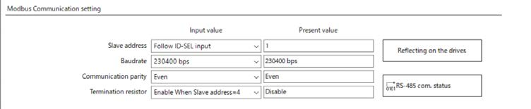

## Page 236

Modbus RTU specifications
6
Modbus
RTU
control
(RS-485
communication)
1-2 Communication timing
The communication time monitored by the driver and the communication timing of the master are as follows.
Tb3（ Broadcast）
Tb4
C3.5
Master Query Query
Slave Response
(Driver)
C3.5 Tb5Whichever is longer
Tb2
Tb1
Code Name Description
The driver monitors an interval between received queries. If the driver cannot
receive a query after the time set in the "Communication timeout (Modbus)"
Communication
Tb1 parameter (Initial value: Disable) has elapsed, an alarm of "Communication
timeout (driver)
timeout" is generated. When normal messages including messages to other
slaves were received, an alarm of "Communication timeout" is not generated.
This is the amount of time from when the driver receives a query from the master
Transmission waiting
Tb2 until when it starts sending a response. Set using the "Transmission waiting time
time (driver)
(Modbus)" parameter.
Broadcasting interval This is the amount of time until the master sends the next query in broadcasting. Tb3
(master) A time equivalent to or longer than the silent interval (C3.5) plus 5 ms is required.
This is the amount of time from when the master receives the response until
when it sends the next query (setting in the master side). Set so that it is equal to
Transmission waiting
Tb4 or longer than the time of the silent interval (C3.5). If the "Silent Interval
time (master)
(Modbus)" parameter is set to "0: Automatic," set the master side according to the
"Estimate of transmission waiting time (master) (Tb4)" in the table below.
This is the amount of time that the driver processes a received query. The query
Query processing time
Tb5 processing time varies depending on the message structure of the received
(driver)
query.
This is the amount of time to determine the end of a query or response message.
An interval equal to or longer than the time of the silent interval (C3.5) is required
when the message ends. When the "Silent interval (Modbus)" parameter of the
C3.5 Silent interval
driver is set to "0: Automatic," the silent interval (C3.5) varies depending on the
transmission rate. For details, refer to the "Silent interval (C3.5)" shown on the
table below.
To communicate with the driver periodically, set the "Communication timeout (Modbus)" parameter.
Setting the parameter can make an alarm of "RS-485 communication timeout" generate if
communication between the master and the driver is disconnected.
236

## Page 237

Modbus RTU specifications
237
6
Modbus
RTU
control
(RS-485
communication)
„ When the "Silent interval (Modbus)" parameter is set to "Automatic"
Transmission rate (bps) Silent interval (C3.5) Estimate of transmission waiting time (Master) (Tb4)
9,600 4.0 ms or more 5.0 ms or more
19,200 or more 2.5 ms or more 3.0 ms or more
• If the transmission waiting time (Tb4) of the master is shorter than the silent interval, the slave
discards the message and a communication error occurs. When a communication error occurs,
check the silent interval of the slave and set the transmission waiting time (Tb4) of the master
again.
• The silent interval (C3.5) may vary depending on the product series connected. When connecting
multiple product series, set the driver parameters as follows.
- "Silent interval (Modbus)" parameter: "0: Automatic"
- "Transmission waiting time (Modbus)" parameter: 1.0 ms or more
• In a system where only products having the "Silent interval (Modbus)" parameter are connected,
the communication cycle can be improved if the setting of the "Silent interval (Modbus)"
parameter is common to the products connected. Use in a state of setting to "0: Automatic"
normally.

## Page 238

Message structure
2  Message structure
The message format is shown below.
| Master        |     | Query | Slave                  |     |     |     |     |
| ------------- | --- | ----- | ---------------------- | --- | --- | --- | --- |
| Slave address |     |       | Slave address          |     |     |     |     |
| Function code |     |       | Response Function code |     |     |     |     |
| Data          |     |       | Data                   |     |     |     |     |
| Error check   |     |       | Error check            |     |     |     |     |
2-1  Query
The query message structure is shown below.
|     | Slave address |     | Function code | Data     |     | Error check |     |
| --- | ------------- | --- | ------------- | -------- | --- | ----------- | --- |
|     | 8 bits        |     | 8 bits        | Nx8 bits |     | 16 bits     |     |
„ Slave address
Specify the slave address. (Unicast mode)
6 Modbus RTU control (RS-485 communication)
If the slave address is set to "0," the master can send a query to all slaves. (Broadcast mode)
„ Function code
The function codes and message lengths supported by the driver are as follows.
|     | Function code |                                       | Function | Number of registers |          |     | Broadcast    |
| --- | ------------- | ------------------------------------- | -------- | ------------------- | -------- | --- | ------------ |
|     | 03h           | Reading from holding registers        |          |                     | 1 to 125 |     | Not possible |
|     | 06h           | Writing to a holding register         |          |                     | 1        |     | Possible     |
|     | 08h           | Diagnosis                             |          |                     | −        |     | Not possible |
|     | 10h           | Writing to multiple holding registers |          |                     | 1 to 123 |     | Possible     |
Read: 1 to 125 
|     | 17h | Read/write of multiple holding registers |     |     |     |     | Not possible |
| --- | --- | ---------------------------------------- | --- | --- | --- | --- | ------------ |
Write: 1 to 121
„ Data
Set data related to the function code. The data length varies depending on the function code.
„ Error check
In the Modbus RTU mode, error checks are based on the CRC-16 method. The slave calculates a CRC-16 of each 
received message and compares the result against the error check value included in the message. If the calculated 
CRC-16 value matches the error check value, the slave determines that the message is normal.
z  CRC-16 calculation method
1.  Calculate an exclusive-OR (XOR) value of the default value of FFFFh and slave address (8 bits).
2.  Shift the result of step 1 to the right by 1 bit. Repeat this shift until the overflow bit becomes "1."
3.  Upon obtaining "1" as the overflow bit, calculate an XOR of the result of step 2 and A001h.
4.  Repeat steps 2 and 3 until a shift is performed eight times.
5.  Calculate an XOR of the result of step 4 and function code (8 bits).
Repeat steps 2 to 4 for all bytes.
The final result gives the result of CRC-16 calculation.
238

## Page 239

Message structure
z  Calculation example of CRC-16
The table shows a calculation example when setting the slave address of the first byte to 02h and the function code of 
the second byte to 07h.
The result of actual CRC-16 calculation is calculated including the data on and after the third byte.
| Description                      | Result              | Bit shifted out |
| -------------------------------- | ------------------- | --------------- |
| CRC register initial value FFFFh | 1111 1111 1111 1111 | −               |
| Lead byte 02h                    | 0000 0000 0000 0010 | −               |
| Initial value FFFFh and XOR      | 1111 1111 1111 1101 | −               |
| First time of right shift        | 0111 1111 1111 1110 | 1               |
1010 0000 0000 0001 
| A001h and XOR |     | −   |
| ------------- | --- | --- |
1101 1111 1111 1111
| Second time of right shift | 0110 1111 1111 1111 | 1   |
| -------------------------- | ------------------- | --- |
1010 0000 0000 0001 
| A001h and XOR |     | −   |
| ------------- | --- | --- |
1100 1111 1111 1110
| Third time of right shift  | 0110 0111 1111 1111 | 0   |
| -------------------------- | ------------------- | --- |
| Fourth time of right shift | 0011 0011 1111 1111 | 1   |
1010 0000 0000 0001 
| A001h and XOR |     | −   |
| ------------- | --- | --- |
1001 0011 1111 1110
| Fifth time of right shift | 0100 1001 1111 1111 | 0   |
| ------------------------- | ------------------- | --- |
| Sixth time of right shift | 0010 0100 1111 1111 | 1   |
1010 0000 0000 0001 
| A001h and XOR |     | −   |
| ------------- | --- | --- |
1000 0100 1111 1110 6 Modbus RTU control (RS-485 communication)
| Seventh time of right shift | 0100 0010 0111 1111 | 0   |
| --------------------------- | ------------------- | --- |
| Eighth time of right shift  | 0010 0001 0011 1111 | 1   |
1010 0000 0000 0001 
| A001h and XOR |     | −   |
| ------------- | --- | --- |
1000 0001 0011 1110
0000 0000 0000 0111 
| Next byte 07h and XOR |     | −   |
| --------------------- | --- | --- |
1000 0001 0011 1001
| First time of right shift | 0100 0000 1001 1100 | 1   |
| ------------------------- | ------------------- | --- |
1010 0000 0000 0001 
| A001h and XOR |     | −   |
| ------------- | --- | --- |
1110 0000 1001 1101
| Second time of right shift | 0111 0000 0100 1110 | 1   |
| -------------------------- | ------------------- | --- |
1010 0000 0000 0001 
| A001h and XOR |     | −   |
| ------------- | --- | --- |
1101 0000 0100 1111
| Third time of right shift | 0110 1000 0010 0111 | 1   |
| ------------------------- | ------------------- | --- |
1010 0000 0000 0001 
| A001h and XOR |     | −   |
| ------------- | --- | --- |
1100 1000 0010 0110
| Fourth time of right shift | 0110 0100 0001 0011 | 0   |
| -------------------------- | ------------------- | --- |
| Fifth time of right shift  | 0011 0010 0000 1001 | 1   |
1010 0000 0000 0001 
| A001h and XOR |     | −   |
| ------------- | --- | --- |
1001 0010 0000 1000
| Sixth time of right shift   | 0100 1001 0000 0100 | 0   |
| --------------------------- | ------------------- | --- |
| Seventh time of right shift | 0010 0100 1000 0010 | 0   |
| Eighth time of right shift  | 0001 0010 0100 0001 | 0   |
| Result of CRC-16            | 0001 0010 0100 0001 | −   |
239

## Page 240

Message structure
2-2  Response
Slave-returned responses are classified into three types: normal response, no response, and exception response.
The response message structure is the same as the query message structure.
| Slave address | Function code | Data     | Error check |
| ------------- | ------------- | -------- | ----------- |
| 8 bits        | 8 bits        | Nx8 bits | 16 bits     |
„ Normal response
Upon receiving a query from the master, the slave executes the requested process and returns a response 
corresponding to the function code.
„ No response
The slave may not return a response to a query sent by the master. This condition is referred to as "No response."
The causes of no response are explained below.
z  Transmission error
The slave discards the query if any of the transmission errors in the next table is detected. No response is returned.
Cause of transmission 
Description
error
| Framing error | Stop bit 0 was detected.                           |     |     |
| ------------- | -------------------------------------------------- | --- | --- |
| Parity error  | A mismatch with the specified parity was detected. |     |     |
6 Modbus RTU control (RS-485 communication) Mismatched CRC The calculated value of CRC-16 was found not matching the error check value.
| Invalid message length | The message length exceeded 256 bytes. |     |     |
| ---------------------- | -------------------------------------- | --- | --- |
z  Other than transmission error
A response may not be returned without any transmission error being detected.
| Cause |     | Description |     |
| ----- | --- | ----------- | --- |
If the query was broadcast, the slave executes the requested process but does not 
Broadcast
return a response.
Mismatched slave address When the slave address in the query is not matched the slave address of the driver.
„ Exception response
An exception response is returned if the slave cannot execute the process requested by the query. Appended to this 
response is an exception code indicating why the process cannot be executed. The message structure of exception 
response is as follows.
| Slave address | Function code | Exception code | Error check |
| ------------- | ------------- | -------------- | ----------- |
| 8 bits        | 8 bits        | 8 bits         | 16 bits     |
z  Function code
The function code in the exception response is a sum of the function code in the query and 80h.
| Function code of query | Exception response |     |     |
| ---------------------- | ------------------ | --- | --- |
| 03h                    | 83h                |     |     |
| 06h                    | 86h                |     |     |
| 08h                    | 88h                |     |     |
| 10h                    | 90h                |     |     |
| 17h                    | 97h                |     |     |
240

## Page 241

Message structure
z  Example of exception response
| Slave address            |     | 01h Query | Slave address       | 01h |
| ------------------------ | --- | --------- | ------------------- | --- |
| Function code            |     | 10h       | Function code       | 90h |
| Register address (upper) |     | 00h       | Data Exception code | 04h |
| Register address (lower) |     | 5Eh       | Error check (lower) | 4Dh |
Number of registers (upper) 00h Response Error check (upper) C3h
| Number of registers (lower)                |     | 02h |     |     |
| ------------------------------------------ | --- | --- | --- | --- |
| Data Number of data bytes                  |     | 04h |     |     |
| Value write to register address (upper)    |     | 00h |     |     |
| Value write to register address (lower)    |     | 00h |     |     |
| Value write to register address +1 (upper) |     | 01h |     |     |
| Value write to register address +1 (lower) |     | F4h |     |     |
| Error check (lower)                        |     | 77h |     |     |
| Error check (upper)                        |     | 08h |     |     |
z  Exception code
This code indicates why the process cannot be executed.
Exception  Communication 
|     | Cause |     | Description |     |
| --- | ----- | --- | ----------- | --- |
code error code
The process could not be executed because the function 
code was invalid. 6 Modbus RTU control (RS-485 communication)
01h 88h Invalid function • The function code is not supported.
• The sub-function code for diagnosis (08h) is other than 
00h.
The process could not be executed because the data 
address was invalid.
| 02h 88h | Invalid data address |     |     |     |
| ------- | -------------------- | --- | --- | --- |
• The register address and the number of registers 
exceeded FFFFh in total.
The process could not be executed because the data was 
invalid.
• The number of registers is 0.
| 03h 8Ch | Invalid data |     |     |     |
| ------- | ------------ | --- | --- | --- |
• The number of bytes is other than "the number of 
register ×2."
• Invalid data length
The process could not be executed because an error 
occurred at the slave.
• Communication with user I/F is in progress (89h). 
Execute the following with the support software 
- Data writing (under writing to the driver) 
- Initialization  
89h 
- Configuration 
8Ah 
| 04h | Slave error | - I/O test or remote operation |     |     |
| --- | ----------- | ------------------------------ | --- | --- |
8Ch 
8Dh • NV memory processing in progress (8Ah) 
- Internal processing is in progress (SYS-BSY is ON). 
- An alarm of "EEPROM error" is present.
• Outside the parameter setting range (8Ch) 
The value write is outside the setting range.
• Command execute disable (8Dh)
z  About slave error
When the "Slave error response mode (Modbus)" parameter is set to "0: Normal response," even if the slave error 
occurs, a normal response is returned. Set it when no exception response is required, as in the case of a touch screen.
241

## Page 242

Function code
3  Function code
This chapter explains the function codes supported by the driver.
Note that function codes other than those described here cannot be executed even if they are sent.
3-1  Reading from a holding register(s) (03h)
This function code is used to read a register (16 bits). Up to 125 successive registers (125×16 bits) can be read.
Read the upper and lower data at the same time. If they are not read at the same time, the value may be invalid.
When multiple holding registers are read, they are read in order of register addresses.
„ Example of read
Read "Driver temperature" and "Motor temperature" of the slave address 1.
Description Register address Value read Corresponding decimal
| Driver temperature (upper) |     | 248 (00F8h) | 0000h |     |
| -------------------------- | --- | ----------- | ----- | --- |
383
| Driver temperature (lower) |     | 249 (00F9h) | 017Fh |     |
| -------------------------- | --- | ----------- | ----- | --- |
| Motor temperature (upper)  |     | 250 (00FAh) | 0000h |     |
426
| Motor temperature (lower) |     | 251 (00FBh) | 01AAh |     |
| ------------------------- | --- | ----------- | ----- | --- |
z  Query
6 Modbus RTU control (RS-485 communication)
| Field name               |     | Data                               |     | Description |
| ------------------------ | --- | ---------------------------------- | --- | ----------- |
| Slave address            |     | 01h Slave address 1                |     |             |
| Function code            |     | 03h Reading from holding registers |     |             |
| Register address (upper) |     | 00h                                |     |             |
Register address to start reading from
| Register address (lower) |     | F8h |     |     |
| ------------------------ | --- | --- | --- | --- |
Data
| Number of registers (upper) |     | 00h |     |     |
| --------------------------- | --- | --- | --- | --- |
Number of registers to be read from the starting register address  
| Number of registers (lower) |     | 04h (4 registers=0004h) |     |     |
| --------------------------- | --- | ----------------------- | --- | --- |
| Error check (lower)         |     | C5h                     |     |     |
Calculation result of CRC-16
| Error check (upper) |     | F8h |     |     |
| ------------------- | --- | --- | --- | --- |
z  Response
|               | Field name |     | Data              | Description |
| ------------- | ---------- | --- | ----------------- | ----------- |
| Slave address |            |     | 01h Same as query |             |
| Function code |            |     | 03h Same as query |             |
Number of data bytes 08h Twice the number of registers in the query
| Value read from register address (upper) |     |     | 00h |     |
| ---------------------------------------- | --- | --- | --- | --- |
Value read from register address 00F8h
| Value read from register address (lower)    |     |     | 00h |     |
| ------------------------------------------- | --- | --- | --- | --- |
| Value read from register address +1 (upper) |     |     | 01h |     |
Value read from register address 00F9h
| Data Value read from register address +1 (lower) |     |     | 7Fh |     |
| ------------------------------------------------ | --- | --- | --- | --- |
| Value read from register address +2 (upper)      |     |     | 00h |     |
Value read from register address 00FAh
| Value read from register address +2 (lower) |     |     | 00h |     |
| ------------------------------------------- | --- | --- | --- | --- |
| Value read from register address +3 (upper) |     |     | 01h |     |
Value read from register address 00FBh
| Value read from register address +3 (lower) |     |     | AAh |     |
| ------------------------------------------- | --- | --- | --- | --- |
| Error check (lower)                         |     |     | 00h |     |
Calculation result of CRC-16
| Error check (upper) |     |     | 23h |     |
| ------------------- | --- | --- | --- | --- |
242

## Page 243

Function code
3-2  Writing to a holding register (06h)
This function code is used to write data to a specified register address. However, since the result combining the upper 
and lower may be outside the data range, write the upper and lower at the same time using the "Writing to multiple 
holding registers (10h)."
„ Example of write
Write 80 (50h) to the command filter time constant of the slave address 2.
Description Register address Value write Corresponding decimal
| Command filter time constant (lower) | 597 (255h) |     | 0050h | 80  |
| ------------------------------------ | ---------- | --- | ----- | --- |
z  Query
| Field name               | Data                              | Description |     |     |
| ------------------------ | --------------------------------- | ----------- | --- | --- |
| Slave address            | 02h Slave address 2               |             |     |     |
| Function code            | 06h Writing to a holding register |             |     |     |
| Register address (upper) | 02h                               |             |     |     |
Register address to be written
| Register address (lower) | 55h |     |     |     |
| ------------------------ | --- | --- | --- | --- |
Data
| Value write (upper) | 00h |     |     |     |
| ------------------- | --- | --- | --- | --- |
Value written to the register address
| Value write (lower) | 50h |     |     |     |
| ------------------- | --- | --- | --- | --- |
| Error check (lower) | 98h |     |     |     |
Calculation result of CRC-16
| Error check (upper) | 6Dh |     |     |     |
| ------------------- | --- | --- | --- | --- |
6 Modbus RTU control (RS-485 communication)
z  Response
| Field name               | Data              | Description |     |     |
| ------------------------ | ----------------- | ----------- | --- | --- |
| Slave address            | 02h Same as query |             |     |     |
| Function code            | 06h Same as query |             |     |     |
| Register address (upper) | 02h               |             |     |     |
Same as query
| Register address (lower) | 55h |     |     |     |
| ------------------------ | --- | --- | --- | --- |
Data
| Value write (upper) | 00h |     |     |     |
| ------------------- | --- | --- | --- | --- |
Same as query
| Value write (lower) | 50h |     |     |     |
| ------------------- | --- | --- | --- | --- |
| Error check (lower) | 98h |     |     |     |
Calculation result of CRC-16
| Error check (upper) | 6Dh |     |     |     |
| ------------------- | --- | --- | --- | --- |
243

## Page 244

Function code
3-3  Diagnosis (08h)
This function code is used to diagnose the communication between a master and a slave. Arbitrary data is sent and 
the result of returned data is used to determine whether the communication is normal. 00h (reply to query) is the only 
sub-function.
„ Example of diagnosis
Send arbitrary data (1234h) to the slave for diagnosis.
z  Query
| Field name                | Data                | Description |     |
| ------------------------- | ------------------- | ----------- | --- |
| Slave address             | 03h Slave address 3 |             |     |
| Function code             | 08h Diagnosis       |             |     |
| Sub-function code (upper) | 00h                 |             |     |
Return the query data
| Sub-function code (lower) | 00h |     |     |
| ------------------------- | --- | --- | --- |
Data
| Data value (upper) | 12h |     |     |
| ------------------ | --- | --- | --- |
Arbitrary data (1234h)
| Data value (lower)  | 34h |     |     |
| ------------------- | --- | --- | --- |
| Error check (lower) | ECh |     |     |
Calculation result of CRC-16
| Error check (upper) | 9Eh |     |     |
| ------------------- | --- | --- | --- |
z  Response
6 Modbus RTU control (RS-485 communication) Field name Data Description
| Slave address             | 03h Same as query |     |     |
| ------------------------- | ----------------- | --- | --- |
| Function code             | 08h Same as query |     |     |
| Sub-function code (upper) | 00h               |     |     |
Same as query
| Sub-function code (lower) | 00h |     |     |
| ------------------------- | --- | --- | --- |
Data
| Data value (upper) | 12h |     |     |
| ------------------ | --- | --- | --- |
Same as query
| Data value (lower)  | 34h |     |     |
| ------------------- | --- | --- | --- |
| Error check (lower) | ECh |     |     |
Same as query
| Error check (upper) | 9Eh |     |     |
| ------------------- | --- | --- | --- |
3-4  Writing to multiple holding registers (10h)
This function code is used to write data to multiple successive registers. Up to 123 registers can be written.
Write the data to the upper and lower at the same time. If not, an invalid value may be written.
Registers are written in order of register addresses. Note that even when an exception response is returned because 
some data is invalid as being outside the specified range, etc., other data may have been written properly.
„ Example of write
Set the following data to the "Operating velocity," "Acceleration rate," and "Deceleration rate" of direct data operation 
in the slave address 4.
Description Register address Value write Corresponding decimal
| Direct data operation operating velocity (upper) |     | 94 (005Eh) | 0000h |
| ------------------------------------------------ | --- | ---------- | ----- |
1,000
| Direct data operation operating velocity (lower) |     | 95 (005Fh) | 03E8h |
| ------------------------------------------------ | --- | ---------- | ----- |
| Direct data operation acceleration rate (upper)  |     | 96 (0060h) | 0000h |
1,000
| Direct data operation acceleration rate (lower) |     | 97 (0061h) | 03E8h |
| ----------------------------------------------- | --- | ---------- | ----- |
| Direct data operation deceleration rate (upper) |     | 98 (0062h) | 0000h |
2,000
| Direct data operation deceleration rate (lower) |     | 99 (0063h) | 07D0h |
| ----------------------------------------------- | --- | ---------- | ----- |
244

## Page 245

Function code
z  Query
| Field name | Data |     | Description |
| ---------- | ---- | --- | ----------- |
Slave address 04h Slave address 4
Function code 10h Writing to multiple holding registers
| Register address (upper) | 00h |     |     |
| ------------------------ | --- | --- | --- |
Register address to start writing from
| Register address (lower)    | 5Eh |     |     |
| --------------------------- | --- | --- | --- |
| Number of registers (upper) | 00h |     |     |
Number of registers to be written from the starting 
Number of registers (lower) 06h register address (6 registers=0006h)
Number of data bytes 0Ch Twice the number of registers in the query
| Value write to register address (upper) | 00h |     |     |
| --------------------------------------- | --- | --- | --- |
Value written to register address 005Eh
| Value write to register address (lower)    | 00h |     |     |
| ------------------------------------------ | --- | --- | --- |
| Value write to register address +1 (upper) | 03h |     |     |
Value written to register address 005Fh
| Data Value write to register address +1 (lower) | E8h |     |     |
| ----------------------------------------------- | --- | --- | --- |
| Value write to register address +2 (upper)      | 00h |     |     |
Value written to register address 0060h
| Value write to register address +2 (lower) | 00h |     |     |
| ------------------------------------------ | --- | --- | --- |
| Value write to register address +3 (upper) | 03h |     |     |
Value written to register address 0061h
| Value write to register address +3 (lower) | E8h |     |     |
| ------------------------------------------ | --- | --- | --- |
| Value write to register address +4 (upper) | 00h |     |     |
Value written to register address 0062h
| Value write to register address +4 (lower) | 00h |     |     |
| ------------------------------------------ | --- | --- | --- |
| Value write to register address +5 (upper) | 07h |     |     |
Value written to register address 0063h 6 Modbus RTU control (RS-485 communication)
| Value write to register address +5 (lower) | D0h |     |     |
| ------------------------------------------ | --- | --- | --- |
Error check (lower) 43h
Calculation result of CRC-16
Error check (upper) C0h
z  Response
| Field name | Data | Description |     |
| ---------- | ---- | ----------- | --- |
Slave address 04h Same as query
Function code 10h Same as query
| Register address (upper) | 00h |     |     |
| ------------------------ | --- | --- | --- |
Same as query
| Register address (lower) | 5Eh |     |     |
| ------------------------ | --- | --- | --- |
Data
| Number of registers (upper) | 00h |     |     |
| --------------------------- | --- | --- | --- |
Same as query
| Number of registers (lower) | 06h |     |     |
| --------------------------- | --- | --- | --- |
Error check (lower) 21h
Calculation result of CRC-16
Error check (upper) 8Ch
245

## Page 246

Function code
3-5  Read/write of multiple holding registers (17h)
With a single function code, reading data and writing data for multiple successive registers can be performed.
Data is written first, and then data is read from the specified registers.
„ Read
Data can be read from successive registers of up to 125.
Read the upper and lower data at the same time. If they are not read at the same time, the value may be invalid.
If multiple registers are read, they are read in order of register addresses.
„ Write
Data can be written to successive registers of up to 121.
Write the data to the upper and lower at the same time. If not, an invalid value may be written.
Registers are written in order of register addresses. Note that even when an exception response is returned because 
some data is invalid as being outside the specified range, etc., other data may have been written properly.
„ Example of read/write
Prepare the read address and write address in a single query.
In this example, after writing the data to the "Operating velocity," "Acceleration rate," and "Deceleration rate" of direct 
data operation in the slave address 1, read the present temperatures for the driver and the motor.
Description Register address Value write Corresponding decimal
| Direct data operation operating velocity (upper) | 94 (005Eh) | 0000h |
| ------------------------------------------------ | ---------- | ----- |
1,000
6 Modbus RTU control (RS-485 communication) Direct data operation operating velocity (lower) 95 (005Fh) 03E8h
| Direct data operation acceleration rate (upper) | 96 (0060h) | 0000h |
| ----------------------------------------------- | ---------- | ----- |
1,000
| Direct data operation acceleration rate (lower) | 97 (0061h) | 03E8h |
| ----------------------------------------------- | ---------- | ----- |
| Direct data operation deceleration rate (upper) | 98 (0062h) | 0000h |
2,000
| Direct data operation deceleration rate (lower) | 99 (0063h) | 07D0h |
| ----------------------------------------------- | ---------- | ----- |
Description Register address Value read Corresponding decimal
| Driver temperature (upper) | 248 (00F8h) | 0000h |
| -------------------------- | ----------- | ----- |
383
| Driver temperature (lower) | 249 (00F9h) | 017Fh |
| -------------------------- | ----------- | ----- |
| Motor temperature (upper)  | 250 (00FAh) | 0000h |
426
| Motor temperature (lower) | 251 (00FBh) | 01AAh |
| ------------------------- | ----------- | ----- |
246

## Page 247

Function code
247
6
Modbus
RTU
control
(RS-485
communication)
z Query
Field name Data Description
Slave address 01h Slave address 1
Function code 17h Read/write of multiple holding registers
(Read) Register address (upper) 00h
Register address to start reading from
(Read) Register address (lower) F8h
(Read) Number of registers (upper) 00h Number of registers to be read from the
(Read) Number of registers (lower) 04h starting register address (4 registers=0004h)
(Write) Register address (upper) 00h
Register address to start writing from
(Write) Register address (lower) 5Eh
(Write) Number of registers (upper) 00h Number of registers to be written from the
(Write) Number of registers (lower) 06h starting register address (6 registers=0006h)
(Write) Number of data bytes 0Ch Twice the number of registers in the query
(Write) Value write to register address (upper) 00h
Value written to register address 005Eh
Data (Write) Value write to register address (lower) 00h
(Write) Value write to register address +1 (upper) 03h
Value written to register address 005Fh
(Write) Value write to register address +1 (lower) E8h
(Write) Value write to register address +2 (upper) 00h
Value written to register address 0060h
(Write) Value write to register address +2 (lower) 00h
(Write) Value write to register address +3 (upper) 03h
Value written to register address 0061h
(Write) Value write to register address +3 (lower) E8h
(Write) Value write to register address +4 (upper) 00h
Value written to register address 0062h
(Write) Value write to register address +4 (lower) 00h
(Write) Value write to register address +5 (upper) 07h
Value written to register address 0063h
(Write) Value write to register address +5 (lower) D0h
Error check (lower) C6h
Calculation result of CRC-16
Error check (upper) 00h
z Response
Field name Data Description
Slave address 01h Same as query
Function code 17h Same as query
Twice the number of (Read) registers in the
(Read) Number of data bytes 08h
query
(Read) Value read from register address (upper) 00h
Value read from register address 00F8h
(Read) Value read from register address (lower) 00h
(Read) Value read from register address +1 (upper) 01h
Data Value read from register address 00F9h
(Read) Value read from register address +1 (lower) 7Fh
(Read) Value read from register address +2 (upper) 00h
Value read from register address 00FAh
(Read) Value read from register address +2 (lower) 00h
(Read) Value read from register address +3 (upper) 01h
Value read from register address 00FBh
(Read) Value read from register address +3 (lower) AAh
Error check (lower) 40h
Calculation result of CRC-16
Error check (upper) 63h

## Page 248

Flow of settings necessary for Modbus communication
6
Modbus
RTU
control
(RS-485
communication)
4 Flow of settings necessary for Modbus
communication
Details of are described in this part.
Operating Manual
Installation and
Connection Edition
Installing and wiring the
motor and the driver
Set items necessary for communication such as the address number
Setting the address number and the transmission rate, via RS-485 communication or using the
and the transmission rate support software.
_1-1 Communications specifications
Indirect reference: Store the data in addresses exclusive for sending
Selecting the setting method and send.
of a query Direct reference: Specify the data to the register address and send.
_7 Data setting method
Part 3 I/O assignments, input/output conditions, and functions useful for
Assigning I/O
simplifying wirings are introduced.
Part 1
Setting the user-defined units Methods to change the setting units of the driver according to the
and coordinates system used as well as the WRAP function are introduced.
Part 2
Selecting the operation Direct data operation
method and setting the data
Stored data operation
and sequential operation
Part 6
Setting the parameters
FW/RV operation
Part 7
Setting the items related to I/O homing operation
information and alarms
Completion of setting
248

## Page 249

Setting of RS-485 communication
5  Setting of RS-485 communication
Set parameters necessary for RS-485 communication before performing communication.
5-1  Parameters updated when turning on the main power supply
These are parameters related to sending and receiving via RS-485 communication.
• They are out of the range of Configuration.
• They are not initialized even if "Batch data initialization" of the maintenance command is executed.
• They are initialized if "All data batch initialization" of th maintenance command is executed. If the main power 
supply is turned on again after "All data batch initialization" was executed, the communication setting may be 
changed, thereby causing communication to disable.
• They are initialized if "Reset" of the support software is executed.
Register address Initial setting
| Name        |     | Description | Initial  |
| ----------- | --- | ----------- | -------- |
| Upper Lower |     |             | Unit     |
value
Sets the communication protocol.
[Setting range] 
Communication 
| 994  995        | −1: Disable                           |     |     |
| --------------- | ------------------------------------- | --- | --- |
| I/F mode        |                                       |     | 4 − |
| (03E2h) (03E3h) | 2: Modbus RTU (RS-485 communication)  |     |     |
selection
3: CANopen (CAN)
4: CANopen (CAN) & Modbus RTU (RS-485 communication) 6 Modbus RTU control (RS-485 communication)
Sets the address number (slave address).  
[Setting range] 
4992  4993  Slave address 
|     | −1: Follow ID-SEL input (ID = ID-SEL value + 1)  |     | −1 − |
| --- | ------------------------------------------------ | --- | ---- |
(1380h) (1381h) (Modbus) *
1 to 31: Slave addresses 1 to 31 
※ Do not use 0.
Sets the transmission rate.
[Setting range] 
0: 9,600 bps 
4994  4995  Baudrate 
|     | 1: 19,200 bps  |     | 5 − |
| --- | -------------- | --- | --- |
(1382h) (1383h) (Modbus) *
2: 38,400 bps 
3: 57,600 bps 
4: 115,200 bps 
5: 230,400 bps
Sets the byte order of 32-bit data. Set when the 
arrangement of communication data is different from 
the master.  
(Setting example_p.250)
Byte & word 
4996  4997 
| order           |                                         |     | 0 − |
| --------------- | --------------------------------------- | --- | --- |
| (1384h) (1385h) | [Setting range]                         |     |     |
| (Modbus) *      | 0: Even Address-High Word & Big-Endian  |     |     |
1: Even Address-Low Word & Big-Endian 
2: Even Address-High Word & Little-Endian 
3: Even Address-Low Word & Little-Endian
Sets the communication parity.
| Communication  | [Setting range]  |     |     |
| -------------- | ---------------- | --- | --- |
4998  4999 
| parity   | 0: None  |     | 1 − |
| -------- | -------- | --- | --- |
(1386h) (1387h)
(Modbus) *
1: Even parity 
2: Odd parity
Sets the communication stop bit.
Communication 
| 5000  5001  | [Setting range]  |     |     |
| ----------- | ---------------- | --- | --- |
| stop bit    |                  |     | 0 − |
(1388h) (1389h)
| (Modbus) * | 0: 1 bit  |     |     |
| ---------- | --------- | --- | --- |
1: 2 bits
Sets the transmission waiting time for RS-485 
Transmission 
| 5006  5007    | communication. |     |             |
| ------------- | -------------- | --- | ----------- |
| waiting time  |                |     | 30 1=0.1 ms |
(138Eh) (138Fh)
[Setting range] 
(Modbus) *
0 to 10,000 (1=0.1 ms)
249

## Page 250

Setting of RS-485 communication
| Register address |      |     |             |     | Initial setting |
| ---------------- | ---- | --- | ----------- | --- | --------------- |
|                  | Name |     | Description |     | Initial         |
| Upper Lower      |      |     |             |     | Unit            |
value
Sets the silent interval.
| 5008  5009  | Silent interval  | [Setting range]  |     |     |     |
| ----------- | ---------------- | ---------------- | --- | --- | --- |
0 1=0.1 ms
| (1390h) (1391h) | (Modbus) * | 0: Set automatically  |     |     |     |
| --------------- | ---------- | --------------------- | --- | --- | --- |
1 to 100 (1=0.1 ms)
* When writing is performed with the support software, the value written is immediately updated.
„ Setting example of "Byte & word order (Modbus)" parameter
When 32-bit data "1234 5678h" is stored in the register address 1000h and 1001h, the arrangement changes to the 
following according to the setting of the parameter.
|     |     | 1000h (even number address) |     | 1001h (odd number address) |     |
| --- | --- | --------------------------- | --- | -------------------------- | --- |
Parameter setting
|                                           |     | Upper | Lower | Upper | Lower |
| ----------------------------------------- | --- | ----- | ----- | ----- | ----- |
| 0: Even Address-High Word & Big-Endian    |     | 12h   | 34h   | 56h   | 78h   |
| 1: Even Address-Low Word & Big-Endian     |     | 56h   | 78h   | 12h   | 34h   |
| 2: Even Address-High Word & Little-Endian |     | 34h   | 12h   | 78h   | 56h   |
| 3: Even Address-Low Word & Little-Endian  |     | 78h   | 56h   | 34h   | 12h   |
This manual describes based on "0: Even Address-High Word & Big-Endian."
6 Modbus RTU control (RS-485 communication)
5-2  Parameters updated immediately after overriding
Set the following parameters using the support software or via RS-485 communication.
| Register address |      |     |             |     | Initial setting |
| ---------------- | ---- | --- | ----------- | --- | --------------- |
|                  | Name |     | Description |     | Initial         |
| Upper Lower      |      |     |             |     | Unit            |
value
Sets the condition in which a communication timeout 
occurs in RS-485 communication.
| 5002  5003      | Communication    |                  |     |     |      |
| --------------- | ---------------- | ---------------- | --- | --- | ---- |
|                 |                  | [Setting range]  |     |     | 0 ms |
| (138Ah) (138Bh) | timeout (Modbus) |                  |     |     |      |
0: Not monitored 
1 to 10,000 ms
A communication error alarm is generated when the 
RS-485 communication error has occurred by the 
Communication 
| 5004  5005      |                  | number of times set here. |     |     |     |
| --------------- | ---------------- | ------------------------- | --- | --- | --- |
|                 | error detection  |                           |     |     | 3 − |
| (138Ch) (138Dh) |                  |                           |     |     |     |
[Setting range] 
(Modbus)
0: Disable 
1 to 10 times
Sets the response when the slave error occurred.
| 5010  5011  | Slave error response  | [Setting range]  |     |     |     |
| ----------- | --------------------- | ---------------- | --- | --- | --- |
1 −
| (1392h) (1393h) | mode (Modbus) | 0: Normal response  |     |     |     |
| --------------- | ------------- | ------------------- | --- | --- | --- |
1: Exception response
|     | RS-485  | Sets the monitor axis in the RS-485 communication  |     |     |     |
| --- | ------- | -------------------------------------------------- | --- | --- | --- |
frame monitor of the support software.
| 5056  5057  | communication  |     |     |     |     |
| ----------- | -------------- | --- | --- | --- | --- |
1 −
| (13C0h) (13C1h) | frame monitor  | [Setting range]                  |     |     |     |
| --------------- | -------------- | -------------------------------- | --- | --- | --- |
|                 | target ID      | 1 to 127: Slave address 1 to 127 |     |     |     |
To communicate with the driver periodically, set the "Communication timeout (Modbus)" parameter.
Setting the parameter can make an alarm of "RS-485 communication timeout" generate if 
communication between the master and the driver is disconnected.
250

## Page 251

Setting example of data in Modbus RTU mode
6  Setting example of data in Modbus RTU  
mode
6-1  Remote I/O commands
These are commands related to remote I/O. The set value is stored in RAM.
Modbus 
| communication    |      |     |             | Initial setting |        |     |
| ---------------- | ---- | --- | ----------- | --------------- | ------ | --- |
| register address | Name |     | Description | R/W             | NET-ID |     |
Initial 
| Upper Lower |     |     |     |     | Unit |     |
| ----------- | --- | --- | --- | --- | ---- | --- |
value
Selects the operation data number. 
| 114  115        | NET selection data  |                                         |     |        | 57      |     |
| --------------- | ------------------- | --------------------------------------- | --- | ------ | ------- | --- |
|                 |                     | Operation data can be sent at the same  |     | R/W −1 | −       |     |
| (0072h) (0073h) | number              |                                         |     |        | (0039h) |     |
time as "Driver input command (2nd)."
116  117  Driver input  The same input command as "Driver  58 
|     |     |     |     | R/W 0 | −   |     |
| --- | --- | --- | --- | ----- | --- | --- |
(0074h) (0075h) command (2nd) input command" is automatically set. (003Ah)
Selects the operation data number. 
118  119  NET selection data  Operation data can be sent at the same  59 
|     |     |     |     | R/W −1 | −   | 6 Modbus RTU control (RS-485 communication) |
| --- | --- | --- | --- | ------ | --- | ------------------------------------------- |
(0076h) (0077h) number time as "Driver input command  (003Bh)
(automatic OFF)."
The same input command as "Driver 
|                 | Driver input    | input command" is automatically set. If  |     |       |         |     |
| --------------- | --------------- | ---------------------------------------- | --- | ----- | ------- | --- |
| 120  121        |                 |                                          |     |       | 60      |     |
|                 | command         | the input signal is turned ON with this  |     | R/W 0 | −       |     |
| (0078h) (0079h) |                 |                                          |     |       | (003Ch) |     |
|                 | (automatic OFF) | command, it is automatically turned      |     |       |         |     |
OFF after 250 μs.
Selects the operation data number. 
| 122  123        | NET selection data  |                                         |     |        | 61      |     |
| --------------- | ------------------- | --------------------------------------- | --- | ------ | ------- | --- |
|                 |                     | Operation data can be sent at the same  |     | R/W −1 | −       |     |
| (007Ah) (007Bh) | number              |                                         |     |        | (003Dh) |     |
time as "Driver input command."
Sets the input command to the driver.  
| 124  125        | Driver input  |                                      |     |       | 62      |     |
| --------------- | ------------- | ------------------------------------ | --- | ----- | ------- | --- |
|                 |               | (Details of bits arrangement _ Next  |     | R/W 0 | −       |     |
| (007Ch) (007Dh) | command       |                                      |     |       | (003Eh) |     |
section)
| 126  127        |                      | Reads the output status of the driver.   |     |     | 63      |     |
| --------------- | -------------------- | ---------------------------------------- | --- | --- | ------- | --- |
|                 | Driver output status |                                          |     | R − | −       |     |
| (007Eh) (007Fh) |                      | (Details of bits arrangement _p.253)     |     |     | (003Fh) |     |
251

## Page 252

Setting example of data in Modbus RTU mode
„ Driver input command
These are the driver input signals that can be accessed via Modbus communication. They can also be accessed in units 
of one register (16 bits).
Values in brackets [ ] are initial values. 
They can be changed using the parameter. (Parameters _p.397, assignment of input signals _p.153)
z  Upper
Register 
Description
address
|     | bit15 | bit14 | bit13 | bit12 | bit11 | bit10 | bit9 | bit8 |
| --- | ----- | ----- | ----- | ----- | ----- | ----- | ---- | ---- |
R-IN31  R-IN30  R-IN29  R-IN28  R-IN27  R-IN26  R-IN25  R-IN24 
| 124     | [M7] | [M6] | [M5] | [M4] | [M3] | [M2] | [M1] | [M0] |
| ------- | ---- | ---- | ---- | ---- | ---- | ---- | ---- | ---- |
| (007Ch) | bit7 | bit6 | bit5 | bit4 | bit3 | bit2 | bit1 | bit0 |
R-IN23  R-IN22  R-IN21  R-IN20  R-IN19  R-IN18  R-IN17  R-IN16 
[SSTART] [START] [Not used] [HOME] [RV-SPD] [FW-SPD] [RV-JOG-P] [FW-JOG-P]
z  Lower
Register 
Description
address
|     | bit15 | bit14 | bit13 | bit12 | bit11 | bit10 | bit9 | bit8 |
| --- | ----- | ----- | ----- | ----- | ----- | ----- | ---- | ---- |
R-IN15  R-IN14  R-IN13  R-IN12  R-IN11  R-IN10  R-IN9  R-IN8 
125  [D-SEL7] [D-SEL6] [D-SEL5] [D-SEL4] [D-SEL3] [D-SEL2] [D-SEL1] [D-SEL0]
| (007Dh) | bit7 | bit6 | bit5 | bit4 | bit3 | bit2 | bit1 | bit0 |
| ------- | ---- | ---- | ---- | ---- | ---- | ---- | ---- | ---- |
6 Modbus RTU control (RS-485 communication)
|     | R-IN7  | R-IN6  | R-IN5  | R-IN4  | R-IN3  | R-IN2  | R-IN1  | R-IN0  |
| --- | ------ | ------ | ------ | ------ | ------ | ------ | ------ | ------ |
[ALM-RST] [FREE] [STOP] [QSTOP] [CLR] [TRQ-LMT] [PLOOP-MODE] [S-ON]
Input "0" for the bit that "Not used" is set.
252

## Page 253

Setting example of data in Modbus RTU mode
„ Driver output status
These are the driver output signals that can be accessed via Modbus communication. They can also be accessed in 
units of one register (16 bits).
Values in brackets [ ] are initial values. 
They can be changed using the parameter. (Parameters _p.397, assignment of output signals _p.156)
z  Upper
Register 
Description
address
|      | bit15      | bit14      |     | bit13       | bit12       |     | bit11       | bit10       | bit9     | bit8     |
| ---- | ---------- | ---------- | --- | ----------- | ----------- | --- | ----------- | ----------- | -------- | -------- |
|      |            |            |     |             |             |     |             |             | R-OUT25  | R-OUT24  |
|      | R-OUT31    | R-OUT30    |     | R-OUT29     | R-OUT28     |     | R-OUT27     | R-OUT26     |          |          |
|      |            |            |     |             |             |     |             |             | [INFO-   | [INFO-   |
|      | [USR-OUT1] | [USR-OUT0] |     | [CONST-OFF] | [CONST-OFF] |     | [CONST-OFF] | [CONST-OFF] |          |          |
| 126  |            |            |     |             |             |     |             |             | USRIO-G] | START-G] |
(007Eh)
|     | bit7     |          | bit6 | bit5     | bit4     |     | bit3     | bit2     | bit1     | bit0     |
| --- | -------- | -------- | ---- | -------- | -------- | --- | -------- | -------- | -------- | -------- |
|     |          |          |      |          |          |     | R-OUT19  | R-OUT18  |          |          |
|     | R-OUT23  | R-OUT22  |      | R-OUT21  | R-OUT20  |     |          |          | R-OUT17  | R-OUT16  |
|     |          |          |      |          |          |     | [INFO-   | [INFO-   |          |          |
[INFO-VOLT-L] [INFO-VOLT-H] [INFO-WATT] [INFO-TRQ] [INFO-MNT-G] [INFO]
|     |     |     |     |     |     |     | MTRTMP] | DRVTMP] |     |     |
| --- | --- | --- | --- | --- | --- | --- | ------- | ------- | --- | --- |
z  Lower
Register 
Description
address
|     | bit15 | bit14 | bit13 | bit12 |     | bit11 |     | bit10 | bit9 | bit8 |
| --- | ----- | ----- | ----- | ----- | --- | ----- | --- | ----- | ---- | ---- |
R-OUT15  R-OUT14  R-OUT13  R-OUT12  R-OUT11  R-OUT10  R-OUT9  R-OUT8 
6 Modbus RTU control (RS-485 communication)
127  [TLC] [VA] [MOVE] [RDY-SD-OPE] [RDY-FWRV-OPE] [RDY-HOME-OPE] [IN-POS] [SYS-BSY]
(007Fh)
|     | bit7 | bit6 | bit5 | bit4 |     | bit3 |     | bit2 | bit1 | bit0 |
| --- | ---- | ---- | ---- | ---- | --- | ---- | --- | ---- | ---- | ---- |
R-OUT7  R-OUT6  R-OUT5  R-OUT4  R-OUT3  R-OUT2  R-OUT1  R-OUT0 
[ALM-A] [FREE_R] [STOP_R] [ABSPEN] [RDY-DD-OPE] [TRQ-LMTD] [PLOOP-MON] [SON-MON]
253

## Page 254

Data setting method
6
Modbus
RTU
control
(RS-485
communication)
7 Data setting method
7-1 Overview of setting methods
There are two methods to set data via Modbus communication.
The communication specifications of Modbus allows reading/writing from/to successive addresses when multiple
data pieces are handled.
Input method Features
• This is a method to read or write by specifying the register addresses of parameters or
commands directly.
Direct reference • Multiple times of queries are required to send when reading/writing from/to multiple
register addresses. (For successive register addresses, sending one query can read/write
from/to multiple register addresses.)
• This method requires to register the register addresses to be read or written in indirect
reference addresses.
Indirect reference
• Sending one query can read/write from/to multiple register addresses because the register
addresses in the indirect reference area are successive.
Example) When writing to the "Direct data operation zero velocity command action," "Command filter
time constant," and "MOVE minimum ON time" parameters.
Direct reference
To write to the parameters, a query is required to send three times.
Register address
Setting target
Upper Lower
544 545
Direct data operation zero velocity command action  Query 1)
(0220h) (0221h)
• •
• •
596 597
Command filter time constant  Query 2)
(0254h) (0255h)
• •
• •
3604 3605
MOVE minimum ON time  Query 3)
(0E14h) (0E15h)
254

## Page 255

Data setting method
255
6
Modbus
RTU
control
(RS-485
communication)
Indirect reference
1. Register the "Direct data operation zero velocity command action," "Command filter time constant," and "MOVE
minimum ON time" parameters in indirect reference addresses.
Register address Parameter to be set
Setting target Setting
Upper Lower Parameter name
value *
1536 1537 272 Direct data operation zero velocity command
Indirect reference address (0)
(0600h) (0601h) (0110h) action
1538 1539 298
Indirect reference address (1) Command filter time constant
(0602h) (0603h) (012Ah)
1540 1541 1802
Indirect reference address (2) MOVE minimum ON time
(0604h) (0605h) (070Ah)
* Set the value of NET-ID of each parameter.
2. Send a query to the indirect reference areas 0 to 2.
Register address
Setting target
Upper Lower
1792 1793 Indirect reference area 0
 Query *
(0700h) (0701h) (Direct data operation zero velocity command action)
1794 1795 Indirect reference area 1
(0702h) (0703h) (Command filter time constant)
1796 1797 indirect reference area 2
(0704h) (0705h) (MOVE minimum ON time)
* Sending one query can write because the register addresses are successive.
Refer to "Setting example" on p.267 for the setting example.
7-2 Direct reference
This is a method to read or write by specifying the register addresses of parameters or commands directly.
Multiple times of queries are required to send when reading/writing from/to multiple register addresses.
For successive register addresses, sending one query can read/write from/to multiple register addresses.

## Page 256

Data setting method
6
Modbus
RTU
control
(RS-485
communication)
7-3 Indirect reference
Sending one query can read/write from/to multiple register addresses because the register addresses in the indirect
reference area are successive.
However, this method requires to register the register addresses to be read or written in indirect reference addresses.
„ Addresses and areas of indirect reference
Indirect reference has 128 addresses and 128 areas (0 to 127).
Name Description
Indirect reference address (0)
Indirect reference address (1)
•
Sets parameters or commands to be read or written in indirect reference.
•
Set the value of NET-ID of the parameters or commands to be read or written.
•
Indirect reference address (126)
Indirect reference address (127)
This is an area to read/write from/to the parameter or command registered in the
Indirect reference area 0
indirect reference address (0).
This is an area to read/write from/to the parameter or command registered in the
Indirect reference area 1
indirect reference address (1).
• •
• •
• •
This is an area to read/write from/to the parameter or command registered in the
Indirect reference area 126
indirect reference address (126).
This is an area to read/write from/to the parameter or command registered in the
Indirect reference area 127
indirect reference address (127).
z Indirect reference address setting
Register address Initial setting
Name Description Initial
Upper Lower Unit
value
1536 1537
Indirect reference address setting (0)
(0600h) (0601h)
1538 1539
Indirect reference address setting (1)
(0602h) (0603h)
1540 1541
Indirect reference address setting (2)
(0604h) (0605h)
1542 1543
Indirect reference address setting (3)
(0606h) (0607h)
1544 1545
Indirect reference address setting (4) Sets NET-ID of commands or
(0608h) (0609h)
parameters to be registered in the
1546 1547
Indirect reference address setting (5) indirect reference addresses. 0 −
(060Ah) (060Bh)
[Setting range]
1548 1549
Indirect reference address setting (6) 0 to 65,535 (0 to FFFFh)
(060Ch) (060Dh)
1550 1551
Indirect reference address setting (7)
(060Eh) (060Fh)
1552 1553
Indirect reference address setting (8)
(0610h) (0611h)
1554 1555
Indirect reference address setting (9)
(0612h) (0613h)
1556 1557
Indirect reference address setting (10)
(0614h) (0615h)
256

## Page 257

Data setting method
257
6
Modbus
RTU
control
(RS-485
communication)
Register address Initial setting
Name Description Initial
Upper Lower Unit
value
1558 1559
Indirect reference address setting (11)
(0616h) (0617h)
1560 1561
Indirect reference address setting (12)
(0618h) (0619h)
1562 1563
Indirect reference address setting (13)
(061Ah) (061Bh)
1564 1565
Indirect reference address setting (14)
(061Ch) (061Dh)
1566 1567
Indirect reference address setting (15)
(061Eh) (061Fh)
1568 1569
Indirect reference address setting (16)
(0620h) (0621h)
1570 1571
Indirect reference address setting (17)
(0622h) (0623h)
1572 1573
Indirect reference address setting (18)
(0624h) (0625h)
1574 1575
Indirect reference address setting (19)
(0626h) (0627h)
1576 1577
Indirect reference address setting (20)
(0628h) (0629h)
1578 1579
Indirect reference address setting (21)
(062Ah) (062Bh)
1580 1581
Indirect reference address setting (22)
(062Ch) (062Dh)
Sets NET-ID of commands or
1582 1583
Indirect reference address setting (23) parameters to be registered in the
(062Eh) (062Fh)
indirect reference addresses. 0 −
1584 1585
Indirect reference address setting (24) [Setting range]
(0630h) (0631h)
0 to 65,535 (0 to FFFFh)
1586 1587
Indirect reference address setting (25)
(0632h) (0633h)
1588 1589
Indirect reference address setting (26)
(0634h) (0635h)
1590 1591
Indirect reference address setting (27)
(0636h) (0637h)
1592 1593
Indirect reference address setting (28)
(0638h) (0639h)
1594 1595
Indirect reference address setting (29)
(063Ah) (063Bh)
1596 1597
Indirect reference address setting (30)
(063Ch) (063Dh)
1598 1599
Indirect reference address setting (31)
(063Eh) (063Fh)
1600 1601
Indirect reference address setting (32)
(0640h) (0641h)
1602 1603
Indirect reference address setting (33)
(0642h) (0643h)
1604 1605
Indirect reference address setting (34)
(0644h) (0645h)
1606 1607
Indirect reference address setting (35)
(0646h) (0647h)
1608 1609
Indirect reference address setting (36)
(0648h) (0649h)

## Page 258

Data setting method
6
Modbus
RTU
control
(RS-485
communication)
Register address Initial setting
Name Description Initial
Upper Lower Unit
value
1610 1611
Indirect reference address setting (37)
(064Ah) (064Bh)
1612 1613
Indirect reference address setting (38)
(064Ch) (064Dh)
1614 1615
Indirect reference address setting (39)
(064Eh) (064Fh)
1616 1617
Indirect reference address setting (40)
(0650h) (0651h)
1618 1619
Indirect reference address setting (41)
(0652h) (0653h)
1620 1621
Indirect reference address setting (42)
(0654h) (0655h)
1622 1623
Indirect reference address setting (43)
(0656h) (0657h)
1624 1625
Indirect reference address setting (44)
(0658h) (0659h)
1626 1627
Indirect reference address setting (45)
(065Ah) (065Bh)
1628 1629
Indirect reference address setting (46)
(065Ch) (065Dh)
1630 1631
Indirect reference address setting (47)
(065Eh) (065Fh)
1632 1633
Indirect reference address setting (48)
(0660h) (0661h)
Sets NET-ID of commands or
1634 1635
Indirect reference address setting (49) parameters to be registered in the
(0662h) (0663h)
indirect reference addresses. 0 −
1636 1637
Indirect reference address setting (50) [Setting range]
(0664h) (0665h)
0 to 65,535 (0 to FFFFh)
1638 1639
Indirect reference address setting (51)
(0666h) (0667h)
1640 1641
Indirect reference address setting (52)
(0668h) (0669h)
1642 1643
Indirect reference address setting (53)
(066Ah) (066Bh)
1644 1645
Indirect reference address setting (54)
(066Ch) (066Dh)
1646 1647
Indirect reference address setting (55)
(066Eh) (066Fh)
1648 1649
Indirect reference address setting (56)
(0670h) (0671h)
1650 1651
Indirect reference address setting (57)
(0672h) (0673h)
1652 1653
Indirect reference address setting (58)
(0674h) (0675h)
1654 1655
Indirect reference address setting (59)
(0676h) (0677h)
1656 1657
Indirect reference address setting (60)
(0678h) (0679h)
1658 1659
Indirect reference address setting (61)
(067Ah) (067Bh)
1660 1661
Indirect reference address setting (62)
(067Ch) (067Dh)
258

## Page 259

Data setting method
259
6
Modbus
RTU
control
(RS-485
communication)
Register address Initial setting
Name Description Initial
Upper Lower Unit
value
1662 1663
Indirect reference address setting (63)
(067Eh) (067Fh)
1664 1665
Indirect reference address setting (64)
(0680h) (0681h)
1666 1667
Indirect reference address setting (65)
(0682h) (0683h)
1668 1669
Indirect reference address setting (66)
(0684h) (0685h)
1670 1671
Indirect reference address setting (67)
(0686h) (0687h)
1672 1673
Indirect reference address setting (68)
(0688h) (0689h)
1674 1675
Indirect reference address setting (69)
(068Ah) (068Bh)
1676 1677
Indirect reference address setting (70)
(068Ch) (068Dh)
1678 1679
Indirect reference address setting (71)
(068Eh) (068Fh)
1680 1681
Indirect reference address setting (72)
(0690h) (0691h)
1682 1683
Indirect reference address setting (73)
(0692h) (0693h)
1684 1685
Indirect reference address setting (74)
(0694h) (0695h)
Sets NET-ID of commands or
1686 1687
Indirect reference address setting (75) parameters to be registered in the
(0696h) (0697h)
indirect reference addresses. 0 −
1688 1689
Indirect reference address setting (76) [Setting range]
(0698h) (0699h)
0 to 65,535 (0 to FFFFh)
1690 1691
Indirect reference address setting (77)
(069Ah) (069Bh)
1692 1693
Indirect reference address setting (78)
(069Ch) (069Dh)
1694 1695
Indirect reference address setting (79)
(069Eh) (069Fh)
1696 1697
Indirect reference address setting (80)
(06A0h) (06A1h)
1698 1699
Indirect reference address setting (81)
(06A2h) (06A3h)
1700 1701
Indirect reference address setting (82)
(06A4h) (06A5h)
1702 1703
Indirect reference address setting (83)
(06A6h) (06A7h)
1704 1705
Indirect reference address setting (84)
(06A8h) (06A9h)
1706 1707
Indirect reference address setting (85)
(06AAh) (06ABh)
1708 1709
Indirect reference address setting (86)
(06ACh) (06ADh)
1710 1711
Indirect reference address setting (87)
(06AEh) (06AFh)
1712 1713
Indirect reference address setting (88)
(06B0h) (06B1h)

## Page 260

Data setting method
6
Modbus
RTU
control
(RS-485
communication)
Register address Initial setting
Name Description Initial
Upper Lower Unit
value
1714 1715
Indirect reference address setting (89)
(06B2h) (06B3h)
1716 1717
Indirect reference address setting (90)
(06B4h) (06B5h)
1718 1719
Indirect reference address setting (91)
(06B6h) (06B7h)
1720 1721
Indirect reference address setting (92)
(06B8h) (06B9h)
1722 1723
Indirect reference address setting (93)
(06BAh) (06BBh)
1724 1725
Indirect reference address setting (94)
(06BCh) (06BDh)
1726 1727
Indirect reference address setting (95)
(06BEh) (06BFh)
1728 1729
Indirect reference address setting (96)
(06C0h) (06C1h)
1730 1731
Indirect reference address setting (97)
(06C2h) (06C3h)
1732 1733
Indirect reference address setting (98)
(06C4h) (06C5h)
1734 1735
Indirect reference address setting (99)
(06C6h) (06C7h)
1736 1737
Indirect reference address setting (100)
(06C8h) (06C9h)
Sets NET-ID of commands or
1738 1739
Indirect reference address setting (101) parameters to be registered in the
(06CAh) (06CBh)
indirect reference addresses. 0 −
1740 1741
Indirect reference address setting (102) [Setting range]
(06CCh) (06CDh)
0 to 65,535 (0 to FFFFh)
1742 1743
Indirect reference address setting (103)
(06CEh) (06CFh)
1744 1745
Indirect reference address setting (104)
(06D0h) (06D1h)
1746 1747
Indirect reference address setting (105)
(06D2h) (06D3h)
1748 1749
Indirect reference address setting (106)
(06D4h) (06D5h)
1750 1751
Indirect reference address setting (107)
(06D6h) (06D7h)
1752 1753
Indirect reference address setting (108)
(06D8h) (06D9h)
1754 1755
Indirect reference address setting (109)
(06DAh) (06DBh)
1756 1757
Indirect reference address setting (110)
(06DCh) (06DDh)
1758 1759
Indirect reference address setting (111)
(06DEh) (06DFh)
1760 1761
Indirect reference address setting (112)
(06E0h) (06E1h)
1762 1763
Indirect reference address setting (113)
(06E2h) (06E3h)
1764 1765
Indirect reference address setting (114)
(06E4h) (06E5h)
260

## Page 261

Data setting method
261
6
Modbus
RTU
control
(RS-485
communication)
Register address Initial setting
Name Description Initial
Upper Lower Unit
value
1766 1767
Indirect reference address setting (115)
(06E6h) (06E7h)
1768 1769
Indirect reference address setting (116)
(06E8h) (06E9h)
1770 1771
Indirect reference address setting (117)
(06EAh) (06EBh)
1772 1773
Indirect reference address setting (118)
(06ECh) (06EDh)
1774 1775
Indirect reference address setting (119)
(06EEh) (06EFh)
1776 1777
Indirect reference address setting (120) Sets NET-ID of commands or
(06F0h) (06F1h)
parameters to be registered in the
1778 1779
Indirect reference address setting (121) indirect reference addresses. 0 −
(06F2h) (06F3h)
[Setting range]
1780 1781
Indirect reference address setting (122) 0 to 65,535 (0 to FFFFh)
(06F4h) (06F5h)
1782 1783
Indirect reference address setting (123)
(06F6h) (06F7h)
1784 1785
Indirect reference address setting (124)
(06F8h) (06F9h)
1786 1787
Indirect reference address setting (125)
(06FAh) (06FBh)
1788 1789
Indirect reference address setting (126)
(06FCh) (06FDh)
1790 1791
Indirect reference address setting (127)
(06FEh) (06FFh)
z Indirect reference area
Register address Register address
Name Name
Upper Lower Upper Lower
1792 1793 1814 1815
Indirect reference area 0 Indirect reference area 11
(0700h) (0701h) (0716h) (0717h)
1794 1795 1816 1817
Indirect reference area 1 Indirect reference area 12
(0702h) (0703h) (0718h) (0719h)
1796 1797 1818 1819
Indirect reference area 2 Indirect reference area 13
(0704h) (0705h) (071Ah) (071Bh)
1798 1799 1820 1821
Indirect reference area 3 Indirect reference area 14
(0706h) (0707h) (071Ch) (071Dh)
1800 1801 1822 1823
Indirect reference area 4 Indirect reference area 15
(0708h) (0709h) (071Eh) (071Fh)
1802 1803 1824 1825
Indirect reference area 5 Indirect reference area 16
(070Ah) (070Bh) (0720h) (0721h)
1804 1805 1826 1827
Indirect reference area 6 Indirect reference area 17
(070Ch) (070Dh) (0722h) (0723h)
1806 1807 1828 1829
Indirect reference area 7 Indirect reference area 18
(070Eh) (070Fh) (0724h) (0725h)
1808 1809 1830 1831
Indirect reference area 8 Indirect reference area 19
(0710h) (0711h) (0726h) (0727h)
1810 1811 1832 1833
Indirect reference area 9 Indirect reference area 20
(0712h) (0713h) (0728h) (0729h)
1812 1813 1834 1835
Indirect reference area 10 Indirect reference area 21
(0714h) (0715h) (072Ah) (072Bh)

## Page 262

Data setting method
6
Modbus
RTU
control
(RS-485
communication)
Register address Register address
Name Name
Upper Lower Upper Lower
1836 1837 1890 1891
Indirect reference area 22 Indirect reference area 49
(072Ch) (072Dh) (0762h) (0763h)
1838 1839 1892 1893
Indirect reference area 23 Indirect reference area 50
(072Eh) (072Fh) (0764h) (0765h)
1840 1841 1894 1895
Indirect reference area 24 Indirect reference area 51
(0730h) (0731h) (0766h) (0767h)
1842 1843 1896 1897
Indirect reference area 25 Indirect reference area 52
(0732h) (0733h) (0768h) (0769h)
1844 1845 1898 1899
Indirect reference area 26 Indirect reference area 53
(0734h) (0735h) (076Ah) (076Bh)
1846 1847 1900 1901
Indirect reference area 27 Indirect reference area 54
(0736h) (0737h) (076Ch) (076Dh)
1848 1849 1902 1903
Indirect reference area 28 Indirect reference area 55
(0738h) (0739h) (076Eh) (076Fh)
1850 1851 1904 1905
Indirect reference area 29 Indirect reference area 56
(073Ah) (073Bh) (0770h) (0771h)
1852 1853 1906 1907
Indirect reference area 30 Indirect reference area 57
(073Ch) (073Dh) (0772h) (0773h)
1854 1855 1908 1909
Indirect reference area 31 Indirect reference area 58
(073Eh) (073Fh) (0774h) (0775h)
1856 1857 1910 1911
Indirect reference area 32 Indirect reference area 59
(0740h) (0741h) (0776h) (0777h)
1858 1859 1912 1913
Indirect reference area 33 Indirect reference area 60
(0742h) (0743h) (0778h) (0779h)
1860 1861 1914 1915
Indirect reference area 34 Indirect reference area 61
(0744h) (0745h) (077Ah) (077Bh)
1862 1863 1916 1917
Indirect reference area 35 Indirect reference area 62
(0746h) (0747h) (077Ch) (077Dh)
1864 1865 1918 1919
Indirect reference area 36 Indirect reference area 63
(0748h) (0749h) (077Eh) (077Fh)
1866 1867 1920 1921
Indirect reference area 37 Indirect reference area 64
(074Ah) (074Bh) (0780h) (0781h)
1868 1869 1922 1923
Indirect reference area 38 Indirect reference area 65
(074Ch) (074Dh) (0782h) (0783h)
1870 1871 1924 1925
Indirect reference area 39 Indirect reference area 66
(074Eh) (074Fh) (0784h) (0785h)
1872 1873 1926 1927
Indirect reference area 40 Indirect reference area 67
(0750h) (0751h) (0786h) (0787h)
1874 1875 1928 1929
Indirect reference area 41 Indirect reference area 68
(0752h) (0753h) (0788h) (0789h)
1876 1877 1930 1931
Indirect reference area 42 Indirect reference area 69
(0754h) (0755h) (078Ah) (078Bh)
1878 1879 1932 1933
Indirect reference area 43 Indirect reference area 70
(0756h) (0757h) (078Ch) (078Dh)
1880 1881 1934 1935
Indirect reference area 44 Indirect reference area 71
(0758h) (0759h) (078Eh) (078Fh)
1882 1883 1936 1937
Indirect reference area 45 Indirect reference area 72
(075Ah) (075Bh) (0790h) (0791h)
1884 1885 1938 1939
Indirect reference area 46 Indirect reference area 73
(075Ch) (075Dh) (0792h) (0793h)
1886 1887 1940 1941
Indirect reference area 47 Indirect reference area 74
(075Eh) (075Fh) (0794h) (0795h)
1888 1889 1942 1943
Indirect reference area 48 Indirect reference area 75
(0760h) (0761h) (0796h) (0797h)
262

## Page 263

Data setting method
263
6
Modbus
RTU
control
(RS-485
communication)
Register address Register address
Name Name
Upper Lower Upper Lower
1944 1945 1996 1997
Indirect reference area 76 Indirect reference area 102
(0798h) (0799h) (07CCh) (07CDh)
1946 1947 1998 1999
Indirect reference area 77 Indirect reference area 103
(079Ah) (079Bh) (07CEh) (07CFh)
1948 1949 2000 2001
Indirect reference area 78 Indirect reference area 104
(079Ch) (079Dh) (07D0h) (07D1h)
1950 1951 2002 2003
Indirect reference area 79 Indirect reference area 105
(079Eh) (079Fh) (07D2h) (07D3h)
1952 1953 2004 2005
Indirect reference area 80 Indirect reference area 106
(07A0h) (07A1h) (07D4h) (07D5h)
1954 1955 2006 2007
Indirect reference area 81 Indirect reference area 107
(07A2h) (07A3h) (07D6h) (07D7h)
1956 1957 2008 2009
Indirect reference area 82 Indirect reference area 108
(07A4h) (07A5h) (07D8h) (07D9h)
1958 1959 2010 2011
Indirect reference area 83 Indirect reference area 109
(07A6h) (07A7h) (07DAh) (07DBh)
1960 1961 2012 2013
Indirect reference area 84 Indirect reference area 110
(07A8h) (07A9h) (07DCh) (07DDh)
1962 1963 2014 2015
Indirect reference area 85 Indirect reference area 111
(07AAh) (07ABh) (07DEh) (07DFh)
1964 1965 2016 2017
Indirect reference area 86 Indirect reference area 112
(07ACh) (07ADh) (07E0h) (07E1h)
1966 1967 2018 2019
Indirect reference area 87 Indirect reference area 113
(07AEh) (07AFh) (07E2h) (07E3h)
1968 1969 2020 2021
Indirect reference area 88 Indirect reference area 114
(07B0h) (07B1h) (07E4h) (07E5h)
1970 1971 2022 2023
Indirect reference area 89 Indirect reference area 115
(07B2h) (07B3h) (07E6h) (07E7h)
1972 1973 2024 2025
Indirect reference area 90 Indirect reference area 116
(07B4h) (07B5h) (07E8h) (07E9h)
1974 1975 2026 2027
Indirect reference area 91 Indirect reference area 117
(07B6h) (07B7h) (07EAh) (07EBh)
1976 1977 2028 2029
Indirect reference area 92 Indirect reference area 118
(07B8h) (07B9h) (07ECh) (07EDh)
1978 1979 2030 2031
Indirect reference area 93 Indirect reference area 119
(07BAh) (07BBh) (07EEh) (07EFh)
1980 1981 2032 2033
Indirect reference area 94 Indirect reference area 120
(07BCh) (07BDh) (07F0h) (07F1h)
1982 1983 2034 2035
Indirect reference area 95 Indirect reference area 121
(07BEh) (07BFh) (07F2h) (07F3h)
1984 1985 2036 2037
Indirect reference area 96 Indirect reference area 122
(07C0h) (07C1h) (07F4h) (07F5h)
1986 1987 2038 2039
Indirect reference area 97 Indirect reference area 123
(07C2h) (07C3h) (07F6h) (07F7h)
1988 1989 2040 2041
Indirect reference area 98 Indirect reference area 124
(07C4h) (07C5h) (07F8h) (07F9h)
1990 1991 2042 2043
Indirect reference area 99 Indirect reference area 125
(07C6h) (07C7h) (07FAh) (07FBh)
1992 1993 2044 2045
Indirect reference area 100 Indirect reference area 126
(07C8h) (07C9h) (07FCh) (07FDh)
1994 1995 2046 2047
Indirect reference area 101 Indirect reference area 127
(07CAh) (07CBh) (07FEh) (07FFh)

## Page 264

Data setting method
6
Modbus
RTU
control
(RS-485
communication)
„ Addresses and areas of indirect reference (compatible)
The function is the same as the indirect reference address and the indirect reference area.
Use when replacing from our existing product.
z Indirect reference address setting (compatible)
Register address Initial setting
Name Description Initial
Upper Lower Unit
value
4864 4865 Indirect reference address setting (0)
(1300h) (1301h) (compatible)
4866 4867 Indirect reference address setting (1)
(1302h) (1303h) (compatible)
4868 4869 Indirect reference address setting (2)
(1304h) (1305h) (compatible)
4870 4871 Indirect reference address setting (3)
(1306h) (1307h) (compatible)
4872 4873 Indirect reference address setting (4)
(1308h) (1309h) (compatible)
4874 4875 Indirect reference address setting (5)
(130Ah) (130Bh) (compatible)
4876 4877 Indirect reference address setting (6)
(130Ch) (130Dh) (compatible)
4878 4879 Indirect reference address setting (7)
(130Eh) (130Fh) (compatible)
4880 4881 Indirect reference address setting (8)
(1310h) (1311h) (compatible)
4882 4883 Indirect reference address setting (9)
(1312h) (1313h) (compatible)
Sets NET-ID of commands or
4884 4885 Indirect reference address setting (10)
parameters to be registered in the
(1314h) (1315h) (compatible)
indirect reference addresses. 0 −
4886 4887 Indirect reference address setting (11)
[Setting range]
(1316h) (1317h) (compatible)
0 to 65,535 (0 to FFFFh)
4888 4889 Indirect reference address setting (12)
(1318h) (1319h) (compatible)
4890 4891 Indirect reference address setting (13)
(131Ah) (131Bh) (compatible)
4892 4893 Indirect reference address setting (14)
(131Ch) (131Dh) (compatible)
4894 4895 Indirect reference address setting (15)
(131Eh) (131Fh) (compatible)
4896 4897 Indirect reference address setting (16)
(1320h) (1321h) (compatible)
4898 4899 Indirect reference address setting (17)
(1322h) (1323h) (compatible)
4900 4901 Indirect reference address setting (18)
(1324h) (1325h) (compatible)
4902 4903 Indirect reference address setting (19)
(1326h) (1327h) (compatible)
4904 4905 Indirect reference address setting (20)
(1328h) (1329h) (compatible)
4906 4907 Indirect reference address setting (21)
(132Ah) (132Bh) (compatible)
264

## Page 265

Data setting method
265
6
Modbus
RTU
control
(RS-485
communication)
Register address Initial setting
Name Description Initial
Upper Lower Unit
value
4908 4909 Indirect reference address setting (22)
(132Ch) (132Dh) (compatible)
4910 4911 Indirect reference address setting (23)
(132Eh) (132Fh) (compatible)
4912 4913 Indirect reference address setting (24)
(1330h) (1331h) (compatible)
4914 4915 Indirect reference address setting (25)
(1332h) (1333h) (compatible)
Sets NET-ID of commands or
4916 4917 Indirect reference address setting (26)
parameters to be registered in the
(1334h) (1335h) (compatible)
indirect reference addresses. 0 −
4918 4919 Indirect reference address setting (27)
[Setting range]
(1336h) (1337h) (compatible)
0 to 65,535 (0 to FFFFh)
4920 4921 Indirect reference address setting (28)
(1338h) (1339h) (compatible)
4922 4923 Indirect reference address setting (29)
(133Ah) (133Bh) (compatible)
4924 4925 Indirect reference address setting (30)
(133Ch) (133Dh) (compatible)
4926 4927 Indirect reference address setting (31)
(133Eh) (133Fh) (compatible)

## Page 266

Data setting method
z  Indirect reference area (compatible)
| Register address |      | Register address |      |
| ---------------- | ---- | ---------------- | ---- |
|                  | Name |                  | Name |
| Upper Lower      |      | Upper Lower      |      |
4928  4929  Indirect reference area 0  4960  4961  Indirect reference area 16 
| (1340h) (1341h) | (compatible) | (1360h) (1361h) | (compatible) |
| --------------- | ------------ | --------------- | ------------ |
4930  4931  Indirect reference area 1  4962  4963  Indirect reference area 17 
| (1342h) (1343h) | (compatible) | (1362h) (1363h) | (compatible) |
| --------------- | ------------ | --------------- | ------------ |
4932  4933  Indirect reference area 2  4964  4965  Indirect reference area 18 
| (1344h) (1345h) | (compatible) | (1364h) (1365h) | (compatible) |
| --------------- | ------------ | --------------- | ------------ |
4934  4935  Indirect reference area 3  4966  4967  Indirect reference area 19 
| (1346h) (1347h) | (compatible) | (1366h) (1367h) | (compatible) |
| --------------- | ------------ | --------------- | ------------ |
4936  4937  Indirect reference area 4  4968  4969  Indirect reference area 20 
| (1348h) (1349h) | (compatible) | (1368h) (1369h) | (compatible) |
| --------------- | ------------ | --------------- | ------------ |
4938  4939  Indirect reference area 5  4970  4971  Indirect reference area 21 
| (134Ah) (134Bh) | (compatible) | (136Ah) (136Bh) | (compatible) |
| --------------- | ------------ | --------------- | ------------ |
4940  4941  Indirect reference area 6  4972  4973  Indirect reference area 22 
| (134Ch) (134Dh) | (compatible) | (136Ch) (136Dh) | (compatible) |
| --------------- | ------------ | --------------- | ------------ |
4942  4943  Indirect reference area 7  4974  4975  Indirect reference area 23 
| (134Eh) (134Fh) | (compatible) | (136Eh) (136Fh) | (compatible) |
| --------------- | ------------ | --------------- | ------------ |
4944  4945  Indirect reference area 8  4976  4977  Indirect reference area 24 
| (1350h) (1351h) | (compatible) | (1370h) (1371h) | (compatible) |
| --------------- | ------------ | --------------- | ------------ |
4946  4947  Indirect reference area 9  4978  4979  Indirect reference area 25 
6 Modbus RTU control (RS-485 communication)
| (1352h) (1353h) | (compatible) | (1372h) (1373h) | (compatible) |
| --------------- | ------------ | --------------- | ------------ |
4948  4949  Indirect reference area 10  4980  4981  Indirect reference area 26 
| (1354h) (1355h) | (compatible) | (1374h) (1375h) | (compatible) |
| --------------- | ------------ | --------------- | ------------ |
4950  4951  Indirect reference area 11  4982  4983  Indirect reference area 27 
| (1356h) (1357h) | (compatible) | (1376h) (1377h) | (compatible) |
| --------------- | ------------ | --------------- | ------------ |
4952  4953  Indirect reference area 12  4984  4985  Indirect reference area 28 
| (1358h) (1359h) | (compatible) | (1378h) (1379h) | (compatible) |
| --------------- | ------------ | --------------- | ------------ |
4954  4955  Indirect reference area 13  4986  4987  Indirect reference area 29 
| (135Ah) (135Bh) | (compatible) | (137Ah) (137Bh) | (compatible) |
| --------------- | ------------ | --------------- | ------------ |
4956  4957  Indirect reference area 14  4988  4989  Indirect reference area 30 
| (135Ch) (135Dh) | (compatible) | (137Ch) (137Dh) | (compatible) |
| --------------- | ------------ | --------------- | ------------ |
4958  4959  Indirect reference area 15  4990  4991  Indirect reference area 31 
| (135Eh) (135Fh) | (compatible) | (137Eh) (137Fh) | (compatible) |
| --------------- | ------------ | --------------- | ------------ |
266

## Page 267

Data setting method
„ Setting example
This section explains an example when sending/receiving data to/from the slave address 1 using indirect reference.
z  STEP 1: Registration in indirect reference addresses
Setting data
Register address
Indirect reference 
|                     |                 | Data to be sent                                           | Setting value |
| ------------------- | --------------- | --------------------------------------------------------- | ------------- |
| address             | Upper Lower     |                                                           |               |
|                     |                 | Direct data operation  272 (0110h)                        |               |
| Indirect reference  | 1536  1537      |                                                           |               |
|                     |                | zero velocity  (Value in NET-ID of Direct data operation  |               |
| address setting (0) | (0600h) (0601h) |                                                           |               |
|                     |                 | command action zero velocity command action)              |               |
298 (012Ah) 
| Indirect reference  | 1538  1539      | Command filter time                      |     |
| ------------------- | --------------- | ---------------------------------------- | --- |
|                     |                | (Value in NET-ID of Command filter time  |     |
| address setting (1) | (0602h) (0603h) | constant                                 |     |
constant)
1802 (070Ah) 
| Indirect reference  | 1540  1541      | MOVE minimum ON                   |     |
| ------------------- | --------------- | --------------------------------- | --- |
|                     |                | (Value in NET-ID MOVE minimum ON  |     |
| address setting (2) | (0604h) (0605h) | time                              |     |
time)
Send the following query to register the addresses of the sending data in indirect reference addresses.
Query
|               | Field name | Data                                      | Description |
| ------------- | ---------- | ----------------------------------------- | ----------- |
| Slave address |            | 01h Slave address 1                       |             |
| Function code |            | 10h Writing to multiple holding registers |             |
6 Modbus RTU control (RS-485 communication)
| Register address (upper) |     | 06h |     |
| ------------------------ | --- | --- | --- |
Register address to start writing from 
Register address (lower) 00h = Indirect reference address setting (0) (0600h)
| Number of registers (upper) |     | 00h |     |
| --------------------------- | --- | --- | --- |
Number of registers to be written from the starting 
Number of registers (lower) 06h register address = 6 registers (0006h)
Number of data bytes 0Ch Twice the number of registers in the query = 12
| Value write to register address (upper) |     | 00h |     |
| --------------------------------------- | --- | --- | --- |
Value written to register address 0600h 
| Value write to register address (lower) |     | 00h |     |
| --------------------------------------- | --- | --- | --- |
= Direct data operation zero velocity command action 
| Value write to register address +1 (upper) |     | 01h |     |
| ------------------------------------------ | --- | --- | --- |
(NET-ID: 0110h)
| Data Value write to register address +1 (lower) |     | 10h |     |
| ----------------------------------------------- | --- | --- | --- |
| Value write to register address +2 (upper)      |     | 00h |     |
Value write to register address +2 (lower) 00h Value written to register address 0602h 
= Command filter time constant (NET-ID: 012Ah)
| Value write to register address +3 (upper) |     | 01h |     |
| ------------------------------------------ | --- | --- | --- |
| Value write to register address +3 (lower) |     | 2Ah |     |
| Value write to register address +4 (upper) |     | 00h |     |
Value write to register address +4 (lower) 00h Value written to register address 0604h 
Value write to register address +5 (upper) 07h = MOVE minimum ON time (NET-ID: 070Ah)
| Value write to register address +5 (lower) |     | 0Ah |     |
| ------------------------------------------ | --- | --- | --- |
| Error check (lower)                        |     | EFh |     |
Calculation result of CRC-16
| Error check (upper) |     | 53h |     |
| ------------------- | --- | --- | --- |
267

## Page 268

Data setting method
z  STEP 2: Writing to indirect reference areas
Setting data
Register address
| Indirect reference area |     |     | Data to be sent | Setting value |
| ----------------------- | --- | --- | --------------- | ------------- |
Upper Lower
|                           | 1792  1793      | Direct data operation        |     |           |
| ------------------------- | --------------- | ---------------------------- | --- | --------- |
| Indirect reference area 0 |                 |                             |     | 0 (0000h) |
|                           | (0700h) (0701h) | zero velocity command action |     |           |
|                           | 1794  1795      |                              |     |           |
Indirect reference area 1  Command filter time constant 10 (000Ah)
(0702h) (0703h)
|                           | 1796  1797  |                        |     |           |
| ------------------------- | ----------- | ---------------------- | --- | --------- |
| Indirect reference area 2 |             |  MOVE minimum ON time |     | 1 (0001h) |
(0704h) (0705h)
Send the following query to write the setting values of the sending data in indirect reference areas.
Query
|                          | Field name | Data |                                       | Description |
| ------------------------ | ---------- | ---- | ------------------------------------- | ----------- |
| Slave address            |            | 01h  | Slave address 1                       |             |
| Function code            |            | 10h  | Writing to multiple holding registers |             |
| Register address (upper) |            | 07h  |                                       |             |
Register address to start writing from 
 = Indirect reference area 0 (0700h)
| Register address (lower) |     | 00h |     |     |
| ------------------------ | --- | --- | --- | --- |
Number of registers (upper) 00h Number of registers to be written from the starting 
register address = 6 registers (0006h)
| Number of registers (lower) |     | 06h |     |     |
| --------------------------- | --- | --- | --- | --- |
6 Modbus RTU control (RS-485 communication)
Number of data bytes 0Ch Twice the number of registers in the query = 12
| Value write to register address (upper) |     | 00h |     |     |
| --------------------------------------- | --- | --- | --- | --- |
Value write to register address (lower) 00h Value written to register address 0700h 
= Direct data operation zero velocity command action 
| Value write to register address +1 (upper) |     | 00h |     |     |
| ------------------------------------------ | --- | --- | --- | --- |
= 0 (0000h)
| Data Value write to register address +1 (lower) |     | 00h |     |     |
| ----------------------------------------------- | --- | --- | --- | --- |
| Value write to register address +2 (upper)      |     | 00h |     |     |
Value written to register address 0702h 
| Value write to register address+2 (lower) |     | 00h |     |     |
| ----------------------------------------- | --- | --- | --- | --- |
= Command filter time constant 
| Value write to register address +3 (upper) |     | 00h |     |     |
| ------------------------------------------ | --- | --- | --- | --- |
= 10 (000Ah)
| Value write to register address +3 (lower) |     | 0Ah |     |     |
| ------------------------------------------ | --- | --- | --- | --- |
| Value write to register address +4 (upper) |     | 00h |     |     |
Value written to register address 0704h 
| Value write to register address +4 (lower) |     | 00h |     |     |
| ------------------------------------------ | --- | --- | --- | --- |
= MOVE minimum ON time 
| Value write to register address +5 (upper) |     | 00h |     |     |
| ------------------------------------------ | --- | --- | --- | --- |
= 1 (0001h)
| Value write to register address +5 (lower) |     | 01h |     |     |
| ------------------------------------------ | --- | --- | --- | --- |
| Error check (lower)                        |     | E1h |     |     |
Calculation result of CRC-16
| Error check (upper) |     | 27h |     |     |
| ------------------- | --- | --- | --- | --- |
268

## Page 269

Data setting method
z  STEP 3: Reading from indirect reference areas
Send the following query to read the data written to indirect reference areas.
Query
| Field name | Data |     | Description |
| ---------- | ---- | --- | ----------- |
Slave address 01h Slave address 1
Function code 03h Reading from holding registers
| Register address (upper) | 07h Register address to start reading from  |     |     |
| ------------------------ | ------------------------------------------- | --- | --- |
= Indirect reference area 0 (0700h)
| Register address (lower) | 00h |     |     |
| ------------------------ | --- | --- | --- |
Data
Number of registers (upper) 00h Number of registers to be read from the starting register address  
(6 registers = 0006h)
| Number of registers (lower) | 06h |     |     |
| --------------------------- | --- | --- | --- |
Error check (lower) C4h
Calculation result of CRC-16
Error check (upper) BCh
Response
| Field name |     | Data | Description |
| ---------- | --- | ---- | ----------- |
Slave address 01h Same as query
Function code 03h Same as query
Number of data bytes 0Ch Twice the number of registers in the query = 12
| Value read from register address (upper) |     | 00h |     |
| ---------------------------------------- | --- | --- | --- |
| Value read from register address (lower) |     | 00h |     |
Value read from register address 0700h  6 Modbus RTU control (RS-485 communication)
| Value read from register address +1 (upper) |     | 00h = 0 (0000h) |     |
| ------------------------------------------- | --- | --------------- | --- |
| Value read from register address +1 (lower) |     | 00h             |     |
| Value read from register address +2 (upper) |     | 00h             |     |
Data Value read from register address +2 (lower) 00h Value read from register address 0702h 
= 10 (000Ah)
| Value read from register address +3 (upper) |     | 00h |     |
| ------------------------------------------- | --- | --- | --- |
| Value read from register address +3 (lower) |     | 0Ah |     |
| Value read from register address +4 (upper) |     | 00h |     |
Value read from register address +4 (lower) 00h Value read from register address 0704h 
= 1 (0001h)
| Value read from register address +5 (upper) |     | 00h |     |
| ------------------------------------------- | --- | --- | --- |
| Value read from register address +5 (lower) |     | 01h |     |
Error check (lower) CAh
Calculation result of CRC-16
Error check (upper) B1h
It was found that the data had been written normally using indirect reference.
269

## Page 270

Group send
6
Modbus
RTU
control
(RS-485
communication)
8 Group send
Multiple slaves are made into a group and a query is sent to all slaves in the group at once.
„ Group composition
A group consists of one parent slave and child slaves and only the parent slave returns a response.
„ Group address
To perform the group send, set a group address to the child Query
slaves to be included in the group. The child slaves to which Master (to parent slave)
the group address has been set can receive a query sent to
Parent slave Response
the parent slave.
The parent slave is not always required. A group can be
composed by only child slaves. In this case, set an unused Query
Master
(to parent slave)
address as an address of the group.
When a query is sent from the master to the address of the Child slave No response
group, the child slaves execute the process. after execution
However, no response is returned. In broadcasting, all the slaves execute the process, however, the slaves that execute
the process can be limited in this method.
„ Parent slave
No special setting is required on the parent slave to perform the group send. The address of the parent slave becomes
the group address. When a query is sent from the master to the parent slave, the parent slave executes the requested
process and returns a response. (Same as the unicast mode)
„ Child slave
Slaves to which the address of the parent slave is set become the child slaves.
When a query sent to the address of the group is received, the child slaves execute the process. However, no response
is returned.
The function code that can be executed in the group send is "Writing to multiple holding registers (10h)" only.
„ Setting of Group
Set the address of the parent slave to the "Group ID" of the child slaves. Change the group in the unicast mode. For
reading and writing when setting the "Group ID," execute the upper and lower parameters at the same time.
z Related command
Register address Initial setting
Name Description
Upper Lower Initial value Unit
Sets an address of the group.
48 49 [Setting range]
Group ID −1 −
(0030h) (0031h) −1: No group specification (group send is not performed)
1 to 31: The address (address of the parent slave) of the group
• Do not set "0" to the group ID.
• Change the group address in the unicast mode.
• The group setting is stored in RAM, so the initial value is returned when the main power supply of
the driver is turned off.
The initial value can be changed using the "Initial group ID (Modbus)" parameter.
270

## Page 271

Group send
z  Related parameter
Register address Initial setting
|     | Parameter name |     | Description |     |
| --- | -------------- | --- | ----------- | --- |
Initial 
| Upper Lower |     |     |     | Unit |
| ----------- | --- | --- | --- | ---- |
value
Sets the address of a group (address number of parent 
slave).
| 5012  5013  | Initial group ID  |     |     |     |
| ----------- | ----------------- | --- | --- | --- |
[Setting range] 
−1 −
| (1394h) (1395h) | (Modbus) | −1: Disable (no group transmission)  |     |     |
| --------------- | -------- | ------------------------------------ | --- | --- |
1 to 31: Group ID 
※ Do not use 0.
| Host controller | Parent slave |     | Child slave | Child slave |
| --------------- | ------------ | --- | ----------- | ----------- |
 
|     | Address 1 |     | Address 2 | Address 3 |
| --- | --------- | --- | --------- | --------- |
"Group" command: −1 (individual) "Group" command: 1 "Group" command: 1
Address 1 Address 2 6 Modbus RTU control (RS-485 communication)
|     | Start of positioning |     | Start of positioning |     |
| --- | -------------------- | --- | -------------------- | --- |
Master to Slave
operation operation
| Slave to Master |     | Address 1 response |     | Address 2 response |
| --------------- | --- | ------------------ | --- | ------------------ |
Motor operation 
of  address 1 
(parent slave)
Motor operation 
of  address 2 
(child slave)
Motor operation 
of  address 3 
(child slave)
271

## Page 272

RS-485 communication monitor
9  RS-485 communication monitor
This section indicates items that can be monitored via RS-485 communication. They can also be checked using the 
"RS-485 communication status monitor" of the support software.
| Register address |     |      |     |             | Initial setting |
| ---------------- | --- | ---- | --- | ----------- | --------------- |
|                  |     | Name |     | Description | Initial         |
| Upper Lower      |     |      |     |             | Unit            |
value
| 172  173        |                                 |     | Indicates the communication error code     |     |     |
| --------------- | ------------------------------- | --- | ------------------------------------------ | --- | --- |
|                 | Present communication error     |     |                                            |     | − − |
| (00ACh) (00ADh) |                                 |     | received last time.                        |     |     |
| 340  341        | RS-485 communication reception  |     |                                            |     |     |
|                 |                                 |     | Indicates the number of bytes received.    |     | − − |
| (0154h) (0155h) | byte counter                    |     |                                            |     |     |
| 342  343        | RS-485 communication            |     |                                            |     |     |
|                 |                                 |     | Indicates the number of bytes transmitted. |     | − − |
| (0156h) (0157h) | transmission byte counter       |     |                                            |     |     |
344  345  RS-485 communication normal  Indicates the number of normal frames 
− −
| (0158h) (0159h) | reception frame counter (All) |     | received. |     |     |
| --------------- | ----------------------------- | --- | --------- | --- | --- |
RS-485 communication normal 
| 346  347        |                           |     | Indicates the number of normal frames  |     |     |
| --------------- | ------------------------- | --- | -------------------------------------- | --- | --- |
|                 | reception frame counter   |     |                                        |     | − − |
| (015Ah) (015Bh) |                           |     | received to own address.               |     |     |
(Only own address)
348  349  RS-485 communication abnormal  Indicates the number of abnormal frames 
− −
| (015Ch) (015Dh) | reception frame counter (All) |     | received. |     |     |
| --------------- | ----------------------------- | --- | --------- | --- | --- |
6 Modbus RTU control (RS-485 communication) 350  351  RS-485 communication  Indicates the number of frames 
− −
| (015Eh) (015Fh) | transmission frame counter |     | transmitted. |     |     |
| --------------- | -------------------------- | --- | ------------ | --- | --- |
352  353  RS-485 communication register  Indicates the number of times the register 
− −
| (0160h) (0161h) | write error counter |     | write error occurred. |     |     |
| --------------- | ------------------- | --- | --------------------- | --- | --- |
354  355  RS-485 communication valid  Indicates the number of valid frames per 
− −
| (0162h) (0163h) | frame/second |     | second. |     |     |
| --------------- | ------------ | --- | ------- | --- | --- |
356  357  RS-485 communication  Indicates the communication processing 
− ms
(0164h) (0165h) processing time time for RS-485 communication.
358  359  RS-485 communication  Indicates the maximum communication 
− ms
(0166h) (0167h) maximum processing time processing time after turning on the power.
| 360  361        |                               |     | Indicates the communication interval for  |     |      |
| --------------- | ----------------------------- | --- | ----------------------------------------- | --- | ---- |
|                 | RS-485 communication interval |     |                                           |     | − ms |
| (0168h) (0169h) |                               |     | RS-485 communication.                     |     |      |
362  363  RS-485 communication  Indicates the maximum communication 
− ms
(016Ah) (016Bh) maximum interval interval for RS-485 communication.
272

## Page 273

Timing chart
273
6
Modbus
RTU
control
(RS-485
communication)
10 Timing chart
10-1 Communication start
ON
Power supply input
OFF
1 s or more *
Master Query
Communication
Slave Response
* C3.5 (silent interval) + Longer one from among Tb5 (query processing time (driver)) and Tb2 (transmission waiting
time (driver side))
10-2 Operation start
*2
Master Query *1
Communication
Slave Response
*3
ON
MOVE output
OFF
*1 A message including a query to start operation via RS-485 communication
*2 C3.5 (silent interval) + Longer one from among Tb5 (query processing time (driver)) and Tb2 (transmission waiting
time (driver side))
*3 C3.5 (silent interval) + Tb5 (query processing time (driver)) + 2 ms or less
10-3 Operation stop, velocity change
*2
Master Query *1
Communication
Slave Response
*3
Motor velocity demand
*1 A message including a query to stop operation and another to change the velocity via RS-485 communication
*2 C3.5 (silent interval) + Longer one from among Tb5 (query processing time (driver)) and Tb2 (transmission waiting
time (driver side))
*3 C3.5 (silent interval) + Tb5 (query processing time (driver)) + 2 ms or less

## Page 274

Timing chart
6
Modbus
RTU
control
(RS-485
communication)
10-4 General signal
*2
Master Query *1
Communication
Slave Response
*3
ON
General signal
OFF
*1 A message including a query for remote output via RS-485 communication
*2 C3.5 (silent interval) + Longer one from among Tb5 (query processing time (driver)) and Tb2 (transmission waiting
time (driver side))
*3 C3.5 (silent interval) + Tb5 (query processing time (driver)) + 2 ms or less
10-5 Configuration
*2
Master Query *1 Query
Communication
Slave Response
*5
*3 *4
Internal processing Internal processing is in progress
*1 A message including a query for configuration via RS-485 communication.
*2 C3.5 (silent interval) + Longer one from among Tb5 (query processing time (driver)) and Tb2 (transmission waiting
time (driver side))
*3 C3.5 (silent interval) + Tb5 (query processing time (driver)) + 2 ms or less
*4 1 s or less
*5 Do not execute writing while configuration is executed.
274

## Page 275

Detection of communication errors
275
6
Modbus
RTU
control
(RS-485
communication)
11 Detection of communication errors
This is a function to detect abnormalities that may occur in RS-485 communication, including two types:
communication errors and alarms.
11-1 Communication errors
If the communication error with error code 84h occurs, the COMM LED on the driver is lit in red.
For communication errors other than 84h, the LED will not be lit or blink.
The communication error can be checked using the "Communication error history" command via RS-485
communication or using the support software.
The communication error history is cleared when the main power supply of the driver is turned off
because it is stored in RAM.
„ Communication error list
Type of communication error Error code Cause
A transmission error was detected.
RS-485 communication error 84h
(Reference _p.240)
An exception response (exception code 01h, 02h) was detected.
Command not yet defined 88h
(Reference _p.240)
Execution disable due to user
89h
I/F communication in progress
An exception response (exception code 04h) was detected.
Execution disable due to (Reference _p.240)
non-volatile memory 8Ah
processing in progress
An exception response (exception code 03h, 04h) was detected.
Outside setting range 8Ch
(Reference _p.240)
An exception response (exception code 04h) was detected.
Command execute disable 8Dh
(Reference _p.240)
11-2 Alarms related to RS-485 communication
If an alarm related to RS-485 communication is generated, the ALM-A output is turned ON and the ALM-B output is
turned OFF to stop the motor.
The PWR/SYS LED on the driver will blink in red.
„ Alarm list related to RS-485 communication
Alarm code Alarm type Cause
When the "Communication power supply lost action" parameter
is set to "Immediate stop with alarm," "Deceleration stop with
81h Network bus error alarm," "Follow QSTOP setting with alarm", or "Follow STOP setting
with alarm," OFF (OFF edge) of the power supply for
communication was detected.
The RS-485 communication error occurred consecutively by the
84h RS-485 communication error number of times set in the "Communication error detection
(Modbus)" parameter.
The time set in the "Communication timeout (Modbus)"
85h RS-485 communication timeout parameter has elapsed, and yet the communication could not be
established with the host controller.

## Page 276

Detection of communication errors
6
Modbus
RTU
control
(RS-485
communication)
11-3 Information related to RS-485 communication
If information related to RS-485 communication is generated, the motor will continue operating and the PWR/SYS LED
on the driver will blink in blue.
„ RS-485 communication error information
If the RS-485 communication error occurs consecutively more than the number of times set in the "RS-485
communication error information (INFO-485-ERR)" parameter, information will be generated.
When the communication is performed properly, the number of times that has counted is reset.
„ RS-485 communication processing time information
If the RS-485 communication processing time exceeds the time set in the "RS-485 communication processing time
information (INFO-485-PRCST)" parameter, information will be generated.
„ RS-485 communication interval information
If the RS-485 communication interval exceeds the time set in the "RS-485 communication interval information (INFO-
485-INTVL)" parameter, information will be generated..
RS-485 communication interval
C3.5 C3.5
Master Query Query
Slave Response
(Driver)
276

## Page 277

Modbus RTU ID share mode
277
6
Modbus
RTU
control
(RS-485
communication)
12 Modbus RTU ID share mode
12-1 Overview of Modbus RTU ID share mode
Sharing the communication ID (Share Control Global ID) with multiple slaves, the master can send a query to multiple
slaves at once. The slave executes the process and returns a response sequentially.
Synchronization between slaves is better than the unicast mode since a query can be sent to multiple slaves at the
same time. The ID share mode is our unique transmission method.
Query
AxisAxisAxis
Master 1 2 3
Slave AxisAxisAxis
1 2 3
Response
„ Example of operation
This section describes operation that a query is sent to two slaves using the ID share mode.
To use the ID share mode, setting a share group is required first.
A share group is a group of slaves that operates in the ID share mode.
A share group is set by setting Share Control Global ID, Share Control Number, and Share Control Local ID.
The settings of two slaves are as follows.
Command Slave address 5 Slave address 7
Share Control Global ID 15 (0Fh) 15 (0Fh)
Share Control Number 2 (02h) 2 (02h)
Share Control Local ID 1 (01h) 2 (02h)
The address when a query is sent to the share group is the value of Share Control Global ID.
In this case, Share Control Number is set to 2 in order to set two slaves to the share group.
The master can send a query to the slave address 5 (Share Control Local ID=1) and the slave address 7 (Share Control
Local ID=2) at once by sending a query to the share group address (Share Control Global ID=15).
The master can also send a query to the slave address 5 and the slave address 7 separately.
Host controller
(master)
Share group
Slave address 15
Slave address 5 Slave address 7

## Page 278

Modbus RTU ID share mode
The motor operation when the master sent a command of continuous operation is as follows.
The master sends a query to the share group address (slave address 15), and the slave addresses 5 and 7 start 
continuous operation. Responses are sent in order, starting with Share Control Local ID=1.
A query can be sent for each slave address. Therefore, the operation profile can be changed for each slave address.
|     |                              | Slave address 15 |     | Slave address 15             |     |
| --- | ---------------------------- | ---------------- | --- | ---------------------------- | --- |
|     | (Share Control Global ID=15) |                  |     | (Share Control Global ID=15) |     |
|     | Transmit                     | Query            |     | Query                        |     |
Master
Receive
|     | Transmit | Response |     |     |     |
| --- | -------- | -------- | --- | --- | --- |
Slave address 5
Receive
 
Slave address 5
Motor operation
|     | Transmit |     | Response |     |     |
| --- | -------- | --- | -------- | --- | --- |
Slave address 7
Receive
Slave address 7
Motor operation
Even if a share group is set, communication can be performed in the unicast mode or the broadcast 
mode.
6 Modbus RTU control (RS-485 communication)
12-2  Function code
Number of registers
| Function code |     | Function |           |                    | Possible to use |
| ------------- | --- | -------- | --------- | ------------------ | --------------- |
|               |     |          | Each axis | Total for all axes |                 |
03h Reading from holding registers 1 to 24 1 to 125 * Possible
| 06h | Writing to a holding register |     | −   | −   | Not possible |
| --- | ----------------------------- | --- | --- | --- | ------------ |
| 08h | Diagnosis                     |     | −   | −   | Not possible |
10h Writing to multiple holding registers 1 to 24 1 to 123 Possible
|     | Read/write of multiple holding  |     | Read: 1 to 24  | Read: 1 to 125 *  |          |
| --- | ------------------------------- | --- | -------------- | ----------------- | -------- |
| 17h |                                 |     |                |                   | Possible |
|     | registers                       |     | Write: 1 to 24 | Write: 1 to 121   |          |
* The maximum number of registers in total for all axes includes the error check between slaves.  
Example: When used with six axes, the maximum value is 119 (125 − 6 = 119).
278

## Page 279

Modbus RTU ID share mode
12-3  Guidance
If you are new to this product, read this section to understand the flow to read the data in the ID share mode.
This example shows how to execute read of the present alarm, driver temperature, and motor temperature for two 
drivers using the host controller.
STEP 1 Check of installation and connection

Check of power-on state and 
STEP 2
communication parameters

STEP 3 Setting of termination resistor

Initial setting of ID share mode 
| STEP 4 |     | Set to drivers 1) and 2) in the unicast mode. |     |     |
| ------ | --- | --------------------------------------------- | --- | --- |
(Setting of share group)

Setting to read present alarm, driver 
| STEP 5 |     | Set to drivers 1) and 2) in the unicast mode. |     |     |
| ------ | --- | --------------------------------------------- | --- | --- |
temperature, and motor temperature

Read of present alarm, driver 
STEP 6 temperature, and motor temperature of  Send a query to drivers 1) and 2) in the ID share mode.
6 Modbus RTU control (RS-485 communication)
drivers 1) and 2)

STEP 7 Check of read result
z  Operating conditions
This operation is performed under the following  • Number of drivers connected: 2 units
conditions.
• Address number:1, 2
• Transmission rate: 230,400 bps
• Termination resistor: Set the communication ID=2 only
Before operating the motor, check the condition of the surrounding area to ensure safety.
The connection example is explained using the BLVD-KRD. A power supply for communication is 
required only when the BLVD-KRD is used.
z  Driver status
The status of driver 1) and driver 2) is as follows.
|                            | Driver 1)  |                | Driver 2)  |                |
| -------------------------- | ---------- | -------------- | ---------- | -------------- |
| Description                |            | Corresponding  |            | Corresponding  |
|                            | Value read |                | Value read |                |
|                            |            | decimal        |            | decimal        |
| Present alarm (upper)      | 0000h      |                | 0000h      |                |
|                            |            | 0              |            | 48             |
| Present alarm (lower)      | 0000h      |                | 0030h      |                |
| Driver temperature (upper) | 0000h      |                | 0000h      |                |
|                            |            | 383            |            | 450            |
| Driver temperature (lower) | 017Fh      |                | 01C2h      |                |
| Motor temperature (upper)  | 0000h      |                | 0000h      |                |
|                            |            | 426            |            | 538            |
| Motor temperature (lower)  | 01AAh      |                | 021Ah      |                |
STEP 4 and STEP 5 can also be set using the support software.
279

## Page 280

Modbus RTU ID share mode
STEP 1 Check of installation and connection
„ Connection example
Host controller
Driver  Driver 
1st unit 2nd unit
Power supply for
Power supply for
 communication
 communication
6 Modbus RTU control (RS-485 communication)
Main power supply Main power supply
+ − + −
| DC power supply |     | DC power supply |
| --------------- | --- | --------------- |
STEP 2 Check of power-on state and communication parameters
After turning on the main power supply of the driver, check the communication parameters listed below are the same 
values as the host controller using the support software.
If the values are different, change the communication parameters of the driver.
Setting
Name
|                        | Driver 1)   | Driver 2)   |
| ---------------------- | ----------- | ----------- |
| Slave address (Modbus) | ID=1        | ID=2        |
| Baudrate (Modbus)      | 230,400 bps | 230,400 bps |
Byte & word order (Modbus) Even Address-High Word & Big-Endian Even Address-High Word & Big-Endian
Communication parity 
|     | Even number | Even number |
| --- | ----------- | ----------- |
(Modbus)
Communication stop bit 
|     | 1 bit | 1 bit |
| --- | ----- | ----- |
(Modbus)
Transmission waiting time 
|     | 30 (3.0ms) | 30 (3.0ms) |
| --- | ---------- | ---------- |
(Modbus)
| Silent interval (Modbus) | 0 (Automatic) | 0 (Automatic) |
| ------------------------ | ------------- | ------------- |
280

## Page 281

Modbus RTU ID share mode
281
6
Modbus
RTU
control
(RS-485
communication)
STEP 3 Setting of termination resistor
Set the "RS-485 communication termination resistor" parameter to "Enable" with the support software.
Setting
Name
Driver 1) Driver 2)
RS-485 communication termination resistor Disable Enable
STEP 4 Initial setting of ID share mode
Send the following query to perform the initial setting of the ID share mode for drivers 1) and 2). (Unicast mode)
1. Set Share Control Global ID, Share Control Number, and Share Control Local ID to driver 1) with the following
query.
Communication data (HEX) Description
Share Control Global ID=15 (0Fh)
01 10 09 80 00 06 0C 00 00 00 0F 00 00 00 02 00 00 00 01 44 D5 Share Control Number=2 (02h)
Share Control Local ID=1 (01h)
2. Set Share Control Global ID, Share Control Number, and Share Control Local ID to driver 2) with the following
query.
Communication data (HEX) Description
Share Control Global ID=15 (0Fh)
02 10 09 80 00 06 0C 00 00 00 0F 00 00 00 02 00 00 00 02 40 90 Share Control Number=2 (02h)
Share Control Local ID=2 (02h)
The initial setting of ID share mode can also be set using the support software.

## Page 282

Modbus RTU ID share mode
6
Modbus
RTU
control
(RS-485
communication)
STEP 5 Setting to read present alarm, driver temperature, and motor temperature
Send the following query to set NET-ID of the data to be read in the ID share mode to drivers 1) and 2).
(Unicast mode)
1. Set NET-ID of the present alarm, driver temperature, and motor temperature to the Share Read data 0 to 2 of driver
1) with the following query.
Communication data (HEX) Description
Share Read data 0=64
(40h): Present alarm
Share Read data 1=124
01 10 09 90 00 06 0C 00 00 00 40 00 00 00 7C 00 00 00 7D 10 C1
(7Ch): Driver temperature
Share Read data 2=125
(7Dh): Motor temperature
2. Set NET-ID of the present alarm, driver temperature, and motor temperature to the Share Read data 0 to 2 of driver
2) with the following query.
Communication data (HEX) Description
Share Read data 0=64
(40h): Present alarm
Share Read data 1=124
02 10 09 90 00 06 0C 00 00 00 40 00 00 00 7C 00 00 00 7D 54 85
(7Ch): Driver temperature
Share Read data 2=125
(7Dh): Motor temperature
In this guidance, the same data is set to the Share Read data 0 to 2 of drivers 1) and 2), but different
data can be set to each driver.
Data can also be set using the support software.
Read of present alarm, driver temperature, and motor temperature of drivers 1)
STEP 6
and 2)
Send the following query to read the data from drivers 1) and 2). (ID share mode)
0F 03 00 00 00 0E C5 20
1 2 3 4 5 6
Communication data
Number Description
(HEX)
① 0F Address number=15
② 03 Function code=03h
③ 00 00 Head of ID share register address to be read (Share Read data 0)=0000h
④ 00 0E Number of registers to be read=14 registers *
⑤ C5 Error check (lower)
⑥ 20 Error check (upper)
* Number of registers = (number of ID share register addresses to be read + 1) × Share Control Number = (6 + 1) × 2 =
14
Set so that the number of registers to be read should be 26 × Share Control Number or less.
282

## Page 283

Modbus RTU ID share mode
STEP 7 Check of read result
Check the read result.
0F    03    1C    00 00 00 00    00 00 01 7F    00 00 01 AA    B6 10 
| 1 2 | 3 4 | 5   | 6   | 7   |
| --- | --- | --- | --- | --- |
 
00 00 00 30    00 00 01 C2    00 00 02 1A    AC AA    00    00
|     | 8   | 9   | 10 11 | 12 13 |
| --- | --- | --- | ----- | ----- |
Communication data 
| Number |     |     |     | Description |
| ------ | --- | --- | --- | ----------- |
(HEX)
| ① 0F |     | Address number=15                          |     |     |
| ---- | --- | ------------------------------------------ | --- | --- |
| ② 03 |     | Read function code=03h                     |     |     |
| ③ 1C |     | Twice the number of registers in the query |     |     |
④ 00 00 00 00  Value read from driver 1) Share Read data 0 (Present alarm)
| 00 00 01 7F |     | Value read from driver 1) Share Read data 1 (Driver temperature) |     |     |
| ----------- | --- | ---------------------------------------------------------------- | --- | --- |
⑤
| 00 00 01 AA |     | Value read from driver 1) Share Read data 2 (Motor temperature) |     |     |
| ----------- | --- | --------------------------------------------------------------- | --- | --- |
⑥
| B6 10 |     | Error check for between slaves (indefinite value) |     |     |
| ----- | --- | ------------------------------------------------- | --- | --- |
⑦
| 00 00 00 30 |     | Value read from driver 2) Share Read data 0 (Present alarm) |     |     |
| ----------- | --- | ----------------------------------------------------------- | --- | --- |
⑧
⑨ 00 00 01 C2 Value read from driver 2) Share Read data 1 (Driver temperature)
6 Modbus RTU control (RS-485 communication)
⑩ 00 00 02 1A Value read from driver 2) Share Read data 2 (Motor temperature)
| ⑪ AC AA |     | Error check for between slaves (indefinite value) |     |     |
| ------- | --- | ------------------------------------------------- | --- | --- |
| ⑫ 00    |     | Error check (lower)                               |     |     |
| ⑬ 00    |     | Error check (upper)                               |     |     |
STEP 8 Did the system communicate properly?
If the communication could not performed properly, check the following points.
• Are the main power supply, the power supply for communication, and the RS-485 communication cable connected 
securely?
• Are the slave addresses, the transmission rate, and the termination resistor set correctly?
• Is the COMM LED lit in red? (A communication error occurs)
283

## Page 284

Modbus RTU ID share mode
12-4  Flow of setting of ID share mode
This section describes the setting flow when the ID share mode is used.
To use the ID share mode, setting a share group is required first.
This is an operation example when a share group is set as follows.
Host controller
(master)
Share group
  Slave address 15
Slave address 1 Slave address 2
| Command/parameter       |          | Slave address 1 |          | Slave address 2 |
| ----------------------- | -------- | --------------- | -------- | --------------- |
| Slave address (Modbus)  | ID=1     |                 | ID=2     |                 |
| Share Control Global ID | 15 (0Fh) |                 | 15 (0Fh) |                 |
| Share Control Number    | 2 (02h)  |                 | 2 (02h)  |                 |
6 Modbus RTU control (RS-485 communication)
| Share Control Local ID | 1 (01h)            |     | 2 (02h)            |     |
| ---------------------- | ------------------ | --- | ------------------ | --- |
| Share Read data 0      | Present alarm      |     | Present alarm      |     |
| Share Read data 1      | Driver temperature |     | Driver temperature |     |
| Share Read data 2      | Motor temperature  |     | Motor temperature  |     |
Share Write data 0 Direct data operation operating velocity Direct data operation operating velocity
Share Write data 1 Direct data operation acceleration rate Direct data operation acceleration rate
Share Write data 2 Direct data operation deceleration rate Direct data operation deceleration rate
„ STEP 1: Initial setting of ID share mode
First, perform the initial setting of the ID share mode.
In the initial setting of the ID share mode, set a share group.
Set Share Control Global ID, Share Control Number, and Share Control Local ID for each slave address.
„ STEP 2: Setting of data to be read and written
Next, set the data to be read or that to be written.
For the data to be read, set NET-ID to the Modbus register address of Share Read data.
For the data to be written, set NET-ID to the Modbus register address of Share Write data.
„ STEP 3: Read/write in ID share mode
Use the ID share mode to read/write from/to each slave.
284

## Page 285

Modbus RTU ID share mode
12-5  Initial setting of ID share mode
Before using the ID share mode, create a group of slaves that operates in the ID share mode.
A group that operates in the ID share mode is called a share group.
To set a share group, set Share Control Global ID, Share Control Number, and Share Control Local ID for each slave 
address.
„ Setting example of share group
Set the following data to "Share Control Global ID," "Share Control Number," and "Share Control Local ID" of the slave 
address 1.
To set a share group, use the function code of writing to multiple holding registers (10h).
Also, to set a share group, send a query in the unicast mode.
This example explains using the slave address 1 only. Set to the slave address 2 in the same way.
|                                 |     |                  | Slave address 1 |                | Slave address 2 |                |
| ------------------------------- | --- | ---------------- | --------------- | -------------- | --------------- | -------------- |
| Description                     |     | Register address |                 | Corresponding  |                 | Corresponding  |
|                                 |     |                  | Value write     |                | Value write     |                |
|                                 |     |                  |                 | decimal        |                 | decimal        |
| Share Control Global ID (upper) |     | 2432 (0980h)     | 0000h           |                | 0000h           |                |
|                                 |     |                  |                 | 15             |                 | 15             |
| Share Control Global ID (lower) |     | 2433 (0981h)     | 000Fh           |                | 000Fh           |                |
| Share Control Number (upper)    |     | 2434 (0982h)     | 0000h           |                | 0000h           |                |
|                                 |     |                  |                 | 2              |                 | 2              |
| Share Control Number (lower)    |     | 2435 (0983h)     | 0002h           |                | 0002h           |                |
| Share Control Local ID (upper)  |     | 2436 (0984h)     | 0000h           |                | 0000h           |                |
|                                 |     |                  |                 | 1              |                 | 2              |
| Share Control Local ID (lower)  |     | 2437 (0985h)     | 0001h           |                | 0002h           |                |
6 Modbus RTU control (RS-485 communication)
Set one by one in order from "1" in the Share Control Local ID.
Query (unicast mode)
|                          | Field name |     | Data                                      |     | Description |     |
| ------------------------ | ---------- | --- | ----------------------------------------- | --- | ----------- | --- |
| Slave address            |            |     | 01h Slave address 1                       |     |             |     |
| Function code            |            |     | 10h Writing to multiple holding registers |     |             |     |
| Register address (upper) |            |     | 09h                                       |     |             |     |
Register address to start writing from
| Register address (lower) |     |     | 80h |     |     |     |
| ------------------------ | --- | --- | --- | --- | --- | --- |
Number of registers (upper) 00h Number of registers to be written from the starting 
register address (6 registers=0006h)
| Number of registers (lower) |     |     | 06h |     |     |     |
| --------------------------- | --- | --- | --- | --- | --- | --- |
Number of data bytes 0Ch Twice the number of registers in the query
| Value write to register address (upper) |     |     | 00h |     |     |     |
| --------------------------------------- | --- | --- | --- | --- | --- | --- |
Value written to register address 0980h
| Value write to register address (lower)    |     |     | 00h |     |     |     |
| ------------------------------------------ | --- | --- | --- | --- | --- | --- |
| Value write to register address +1 (upper) |     |     | 00h |     |     |     |
Value written to register address 0981h
| Data Value write to register address +1 (lower) |     |     | 0Fh |     |     |     |
| ----------------------------------------------- | --- | --- | --- | --- | --- | --- |
| Value write to register address +2 (upper)      |     |     | 00h |     |     |     |
Value written to register address 0982h
| Value write to register address +2 (lower) |     |     | 00h |     |     |     |
| ------------------------------------------ | --- | --- | --- | --- | --- | --- |
| Value write to register address +3 (upper) |     |     | 00h |     |     |     |
Value written to register address 0983h
| Value write to register address +3 (lower) |     |     | 02h |     |     |     |
| ------------------------------------------ | --- | --- | --- | --- | --- | --- |
| Value write to register address +4 (upper) |     |     | 00h |     |     |     |
Value written to register address 0984h
| Value write to register address +4 (lower) |     |     | 00h |     |     |     |
| ------------------------------------------ | --- | --- | --- | --- | --- | --- |
| Value write to register address +5 (upper) |     |     | 00h |     |     |     |
Value written to register address 0985h
| Value write to register address +5 (lower) |     |     | 01h |     |     |     |
| ------------------------------------------ | --- | --- | --- | --- | --- | --- |
| Error check (lower)                        |     |     | 44h |     |     |     |
Calculation result of CRC-16
| Error check (upper) |     |     | D5h |     |     |     |
| ------------------- | --- | --- | --- | --- | --- | --- |
285

## Page 286

Modbus RTU ID share mode
Response (unicast mode)
|               | Field name | Data              | Description |     |     |     |
| ------------- | ---------- | ----------------- | ----------- | --- | --- | --- |
| Slave address |            | 01h Same as query |             |     |     |     |
| Function code |            | 10h Same as query |             |     |     |     |
Register address (upper) 09h
Same as query
Register address (lower) 80h
Data
Number of registers (upper) 00h
Same as query
Number of registers (lower) 06h
Error check (lower) 42h
Calculation result of CRC-16
Error check (upper) 7Fh
Send a query to set a share group for the slave address 2 in the same way.
12-6  Setting of data to be read or written
Next, set the data to be read or that to be written.
For the data to be read, set NET-ID to the Modbus register address of Share Read data.
For the data to be written, set NET-ID to the Modbus register address of Share Write data.
„ Setting example of data to be read
For the slave address 1, set "Present alarm" in the "Share Read data 0," "Driver temperature" in the "Share Read data 1," 
and "Motor temperature" in the "Share Read data 2."
6 Modbus RTU control (RS-485 communication)
To set Share Read data, use the function code of writing to multiple holding registers (10h).
Send a query in the unicast mode for these settings.
A value written to the register address of Share Read data is NET-ID.
Refer to p.299 for NET-ID that can be set to Share Read data. 
In this example, the same NET-ID is set to the Share Read data 0 to 2 of the slave addresses 1 and 2, but different 
NET-ID can also be set to the slave address 1 and the slave address 2, respectively.
This example explains using slave address 1 only. Set to the slave address 2 in the same way.
|     |     |     | Slave address 1 |     | Slave address 2 |     |
| --- | --- | --- | --------------- | --- | --------------- | --- |
Register  Setting item 
Description
|     |     | address to be read | NET-ID      | Corresponding  | NET-ID      | Corresponding  |
| --- | --- | ------------------ | ----------- | -------------- | ----------- | -------------- |
|     |     |                    | Value write | decimal        | Value write | decimal        |
2448 
| Share Read data 0 (upper) |     |     | 0000h |     | 0000h |     |
| ------------------------- | --- | --- | ----- | --- | ----- | --- |
(0990h) Present 
|     |     |     |     | 64  |     | 64  |
| --- | --- | --- | --- | --- | --- | --- |
alarm
2449 
| Share Read data 0 (lower) |     |     | 0040h |     | 0040h |     |
| ------------------------- | --- | --- | ----- | --- | ----- | --- |
(0991h)
2450 
| Share Read data 1 (upper) |     |     | 0000h |     | 0000h |     |
| ------------------------- | --- | --- | ----- | --- | ----- | --- |
(0992h) Driver 
|     |     |     |     | 124 |     | 124 |
| --- | --- | --- | --- | --- | --- | --- |
2451  temperature
| Share Read data 1 (lower) |     |     | 007Ch |     | 007Ch |     |
| ------------------------- | --- | --- | ----- | --- | ----- | --- |
(0993h)
2452 
| Share Read data 2 (upper) |     |     | 0000h |     | 0000h |     |
| ------------------------- | --- | --- | ----- | --- | ----- | --- |
(0994h)
Motor 
|     |     |     |     | 125 |     | 125 |
| --- | --- | --- | --- | --- | --- | --- |
2453  temperature
| Share Read data 2 (lower) |     |     | 007Dh |     | 007Dh |     |
| ------------------------- | --- | --- | ----- | --- | ----- | --- |
(0995h)
286

## Page 287

Modbus RTU ID share mode
Query (unicast mode)
| Field name |     | Data | Description |
| ---------- | --- | ---- | ----------- |
Slave address 01h Slave address 1
Function code 10h Writing to multiple holding registers
| Register address (upper) |     | 09h |     |
| ------------------------ | --- | --- | --- |
Register address to start writing from
| Register address (lower) |     | 90h |     |
| ------------------------ | --- | --- | --- |
Number of registers (upper) 00h Number of registers to be written from the starting 
Number of registers (lower) 06h register address (6 registers=0006h)
Number of data bytes 0Ch Twice the number of registers in the query
| Value write to register address (upper) |     | 00h |     |
| --------------------------------------- | --- | --- | --- |
Value written to register address 0990h
| Value write to register address (lower)    |     | 00h |     |
| ------------------------------------------ | --- | --- | --- |
| Value write to register address +1 (upper) |     | 00h |     |
Value written to register address 0991h
| Data Value write to register address +1 (lower) |     | 40h |     |
| ----------------------------------------------- | --- | --- | --- |
| Value write to register address +2 (upper)      |     | 00h |     |
Value written to register address 0992h
| Value write to register address +2 (lower) |     | 00h |     |
| ------------------------------------------ | --- | --- | --- |
| Value write to register address +3 (upper) |     | 00h |     |
Value written to register address 0993h
| Value write to register address +3 (lower) |     | 7Ch |     |
| ------------------------------------------ | --- | --- | --- |
| Value write to register address +4 (upper) |     | 00h |     |
Value written to register address 0994h
| Value write to register address +4 (lower) |     | 00h |     |
| ------------------------------------------ | --- | --- | --- |
| Value write to register address +5 (upper) |     | 00h |     |
6 Modbus RTU control (RS-485 communication)
Value written to register address 0995h
| Value write to register address +5 (lower) |     | 7Dh |     |
| ------------------------------------------ | --- | --- | --- |
Error check (lower) 10h
Calculation result of CRC-16
Error check (upper) C1h
Response (unicast mode)
| Field name | Data | Description |     |
| ---------- | ---- | ----------- | --- |
Slave address 01h Same as query
Function code 10h Same as query
| Register address (upper) | 09h |     |     |
| ------------------------ | --- | --- | --- |
Same as query
| Register address (lower) | 90h |     |     |
| ------------------------ | --- | --- | --- |
Data
| Number of registers (upper) | 00h |     |     |
| --------------------------- | --- | --- | --- |
Same as query
| Number of registers (lower) | 06h |     |     |
| --------------------------- | --- | --- | --- |
Error check (lower) 43h
Calculation result of CRC-16
Error check (upper) BAh
Send a query to set the read data for the slave address 2 in the same way.
287

## Page 288

Modbus RTU ID share mode
„ Setting example of data to be written
For the slave address 1, set "Direct data operation operating velocity" in the "Share Write data 0," "Direct data 
operation acceleration rate" in the "Share Write data 1," and "Direct data operation deceleration rate" in the "Share 
Write data 2."
To set Share Write data, use the function code of writing to multiple holding registers (10h).
Send a query in the unicast mode for these settings.
A value written to the register address of Share Write data is NET-ID.
Refer to p.299 for NET-ID that can be set to Share Write data.
In this example, the same NET-ID is set to the Share Write data 0 to 2 of the slave addresses 1 and 2, but different 
NET-ID can also be set to the slave address 1 and the slave address 2, respectively.
This example explains using slave address 1 only. Set to the slave address 2 in the same way.
|             |           |                  | Slave address 1 |                | Slave address 2 |                |
| ----------- | --------- | ---------------- | --------------- | -------------- | --------------- | -------------- |
|             | Register  | Setting item to  |                 |                |                 |                |
| Description |           |                  | NET-ID          | Corresponding  | NET-ID          | Corresponding  |
|             | address   | be written       |                 |                |                 |                |
|             |           |                  | Value write     | decimal        | Value write     | decimal        |
2472 
| Share Write data 0 (upper) |     | Direct data  | 0000h |     | 0000h |     |
| -------------------------- | --- | ------------ | ----- | --- | ----- | --- |
(09A8h)
operation 
|     |     |     |     | 47  |     | 47  |
| --- | --- | --- | --- | --- | --- | --- |
2473  operating 
| Share Write data 0 (lower) |         |          | 002Fh |     | 002Fh |     |
| -------------------------- | ------- | -------- | ----- | --- | ----- | --- |
|                            | (09A9h) | velocity |       |     |       |     |
2474 
Direct data 
| Share Write data 1 (upper) |         |            | 0000h |     | 0000h |     |
| -------------------------- | ------- | ---------- | ----- | --- | ----- | --- |
|                            | (09AAh) | operation  |       |     |       |     |
|                            |         |            |       | 48  |       | 48  |
acceleration 
2475 
| Share Write data 1 (lower) |     | rate | 0030h |     | 0030h |     |
| -------------------------- | --- | ---- | ----- | --- | ----- | --- |
(09ABh)
2476  Direct data 
| Share Write data 2 (upper)                  |         |            | 0000h |     | 0000h |     |
| ------------------------------------------- | ------- | ---------- | ----- | --- | ----- | --- |
| 6 Modbus RTU control (RS-485 communication) | (09ACh) | operation  |       |     |       |     |
|                                             |         |            |       | 49  |       | 49  |
deceleration 
2477 
| Share Write data 2 (lower) |         |      | 0031h |     | 0031h |     |
| -------------------------- | ------- | ---- | ----- | --- | ----- | --- |
|                            | (09ADh) | rate |       |     |       |     |
Query (unicast mode)
|                          | Field name |     | Data                                      |     | Description |     |
| ------------------------ | ---------- | --- | ----------------------------------------- | --- | ----------- | --- |
| Slave address            |            |     | 01h Slave address 1                       |     |             |     |
| Function code            |            |     | 10h Writing to multiple holding registers |     |             |     |
| Register address (upper) |            |     | 09h                                       |     |             |     |
Register address to start writing from
| Register address (lower)    |     |     | A8h |     |     |     |
| --------------------------- | --- | --- | --- | --- | --- | --- |
| Number of registers (upper) |     |     | 00h |     |     |     |
Number of registers to be written from the starting 
Number of registers (lower) 06h register address (6 registers=0006h)
Number of data bytes 0Ch Twice the number of registers in the query
| Value write to register address (upper) |     |     | 00h |     |     |     |
| --------------------------------------- | --- | --- | --- | --- | --- | --- |
Value written to register address 09A8h
| Value write to register address (lower)    |     |     | 00h |     |     |     |
| ------------------------------------------ | --- | --- | --- | --- | --- | --- |
| Value write to register address +1 (upper) |     |     | 00h |     |     |     |
Value written to register address 09A9h
| Data Value write to register address +1 (lower) |     |     | 2Fh |     |     |     |
| ----------------------------------------------- | --- | --- | --- | --- | --- | --- |
| Value write to register address +2 (upper)      |     |     | 00h |     |     |     |
Value written to register address 09AAh
| Value write to register address +2 (lower) |     |     | 00h |     |     |     |
| ------------------------------------------ | --- | --- | --- | --- | --- | --- |
| Value write to register address +3 (upper) |     |     | 00h |     |     |     |
Value written to register address 09ABh
| Value write to register address +3 (lower) |     |     | 30h |     |     |     |
| ------------------------------------------ | --- | --- | --- | --- | --- | --- |
| Value write to register address +4 (upper) |     |     | 00h |     |     |     |
Value written to register address 09ACh
| Value write to register address +4 (lower) |     |     | 00h |     |     |     |
| ------------------------------------------ | --- | --- | --- | --- | --- | --- |
| Value write to register address +5 (upper) |     |     | 00h |     |     |     |
Value written to register address 09ADh
| Value write to register address +5 (lower) |     |     | 31h |     |     |     |
| ------------------------------------------ | --- | --- | --- | --- | --- | --- |
| Error check (lower)                        |     |     | FAh |     |     |     |
Calculation result of CRC-16
| Error check (upper) |     |     | DAh |     |     |     |
| ------------------- | --- | --- | --- | --- | --- | --- |
288

## Page 289

Modbus RTU ID share mode
Response (unicast mode)
| Field name               | Data              | Description |     |
| ------------------------ | ----------------- | ----------- | --- |
| Slave address            | 01h Same as query |             |     |
| Function code            | 10h Same as query |             |     |
| Register address (upper) | 09h               |             |     |
Same as query
| Register address (lower) | A8h |     |     |
| ------------------------ | --- | --- | --- |
Data
| Number of registers (upper) | 00h |     |     |
| --------------------------- | --- | --- | --- |
Same as query
| Number of registers (lower) | 06h |     |     |
| --------------------------- | --- | --- | --- |
| Error check (lower)         | C2h |     |     |
Calculation result of CRC-16
| Error check (upper) | 77h |     |     |
| ------------------- | --- | --- | --- |
Send a query to set the write data for the slave address 2 in the same way.
12-7  Read/write in ID share mode
Use the ID share mode to read/write from/to each slave.
„ Read using ID share mode
To read in the ID share mode, use the function code of reading from a holding register(s) (03h) to read a value (16 bits) 
of Share Read data. Up to 24 successive registers (24 × 16 bits) can be read.
The relation between the ID share register address and Share Read data is shown in the table below.
6 Modbus RTU control (RS-485 communication)
ID share register  Corresponding Share Read  ID share register  Corresponding Share Read 
| address | data | address | data |
| ------- | ---- | ------- | ---- |
0 (0000h) Share Read data 0 (upper) 12 (000Ch) Share Read data 6 (upper)
1 (0001h) Share Read data 0 (lower) 13 (000Dh) Share Read data 6 (lower)
2 (0002h) Share Read data 1 (upper) 14 (000Eh) Share Read data 7 (upper)
3 (0003h) Share Read data 1 (lower) 15 (000Fh) Share Read data 7 (lower)
4 (0004h) Share Read data 2 (upper) 16 (0010h) Share Read data 8 (upper)
5 (0005h) Share Read data 2 (lower) 17 (0011h) Share Read data 8 (lower)
6 (0006h) Share Read data 3 (upper) 18 (0012h) Share Read data 9 (upper)
7 (0007h) Share Read data 3 (lower) 19 (0013h) Share Read data 9 (lower)
8 (0008h) Share Read data 4 (upper) 20 (0014h) Share Read data 10 (upper)
9 (0009h) Share Read data 4 (lower) 21 (0015h) Share Read data 10 (lower)
10 (000Ah) Share Read data 5 (upper) 22 (0016h) Share Read data 11 (upper)
11 (000Bh) Share Read data 5 (lower) 23 (0017h) Share Read data 11 (lower)
Read the upper and lower data at the same time. If they are not read at the same time, the value may be invalid.
When multiple holding registers are read, they are read in order of ID share register addresses.
289

## Page 290

Modbus RTU ID share mode
z  Example of read
Read "Present alarm," "Driver temperature" and "Motor temperature" of the slave address 1.
Read "Present alarm," "Driver temperature" and "Motor temperature" of the slave address 2.
Slave address 1 Slave address 2
Description ID share register address
Value  Corresponding  Value  Corresponding 
|     |     |     | read | decimal read decimal |
| --- | --- | --- | ---- | -------------------- |
0 (0000h):  
| Present alarm (upper) |     |     | 0000h | 0000h |
| --------------------- | --- | --- | ----- | ----- |
Share Read data 0 (upper)
0 48
1 (0001h):  
| Present alarm (lower) |     |     | 0000h | 0030h |
| --------------------- | --- | --- | ----- | ----- |
Share Read data 0 (lower)
2 (0002h):  
| Driver temperature (upper) |     |     | 0000h | 0000h |
| -------------------------- | --- | --- | ----- | ----- |
Share Read data 1 (upper)
383 450
3 (0003h):  
| Driver temperature (lower) |     |     | 017Fh | 01C2h |
| -------------------------- | --- | --- | ----- | ----- |
Share Read data 1 (lower)
4 (0004h):  
| Motor temperature (upper) |     |     | 0000h | 0000h |
| ------------------------- | --- | --- | ----- | ----- |
Share Read data 2 (upper)
426 538
5 (0005h):  
| Motor temperature (lower) |     |     | 01AAh | 021Ah |
| ------------------------- | --- | --- | ----- | ----- |
Share Read data 2 (lower)
Query (ID share mode)
|               | Field name | Data                 |     | Description |
| ------------- | ---------- | -------------------- | --- | ----------- |
| Slave address |            | 0Fh Slave address 15 |     |             |
6 Modbus RTU control (RS-485 communication)
| Function code                     |     | 03h Reading from holding registers |     |     |
| --------------------------------- | --- | ---------------------------------- | --- | --- |
| ID share register address (upper) |     | 00h                                |     |     |
ID share register address to start reading from  
| ID share register address (lower) |     | 00h (Share Read data 0 (upper)) |     |     |
| --------------------------------- | --- | ------------------------------- | --- | --- |
Data
| Number of registers (upper) |     | 00h |     |     |
| --------------------------- | --- | --- | --- | --- |
Number of registers to be read from the starting ID share 
| Number of registers (lower) |     | 0Eh register address (14 registers=000Eh) * |     |     |
| --------------------------- | --- | ------------------------------------------- | --- | --- |
| Error check (lower)         |     | C5h                                         |     |     |
Calculation result of CRC-16
| Error check (upper) |     | 20h |     |     |
| ------------------- | --- | --- | --- | --- |
* Number of registers = (number of ID share register addresses to be read + 1) × Share Control Number
Set so that the number of registers to be read should be 26 × Share Control Number or less.
290

## Page 291

Modbus RTU ID share mode
291
6
Modbus
RTU
control
(RS-485
communication)
Response (ID share mode)
Field name Data Description
Slave address 0Fh Same as query
Function code 03h Same as query
Twice the number of registers in
Number of data bytes 1Ch
the query
Value read from ID share register address (upper) 00h Value read from Share Read data 0
Value read from ID share register address (lower) 00h (upper)
Value read from ID share register address +1 (upper) 00h Value read from Share Read data 0
Value read from ID share register address +1 (lower) 00h (lower)
Value read from ID share register address +2 (upper) 00h Value read from Share Read data 1
Value read from ID share register address +2 (lower) 00h (upper)
Share
Control Value read from ID share register address +3 (upper) 01h Value read from Share Read data 1
Local Value read from ID share register address +3 (lower) 7Fh (lower)
ID 1
Value read from ID share register address +4 (upper) 00h Value read from Share Read data 2
Value read from ID share register address +4 (lower) 00h (upper)
Value read from ID share register address +5 (upper) 01h Value read from Share Read data 2
Value read from ID share register address +5 (lower) AAh (lower)
Error check for between slaves (lower) B6h The error check value for between
Data
Error check for between slaves (upper) 10h slaves is indefinite.
Value read from ID share register address (upper) 00h Value read from Share Read data 0
Value read from ID share register address (lower) 00h (upper)
Value read from ID share register address +1 (upper) 00h Value read from Share Read data 0
Value read from ID share register address +1 (lower) 30h (lower)
Value read from ID share register address +2 (upper) 00h Value read from Share Read data 1
Value read from ID share register address +2 (lower) 00h (upper)
Share
Control Value read from ID share register address +3 (upper) 01h Value read from Share Read data 1
Local Value read from ID share register address +3 (lower) C2h (lower)
ID 2
Value read from ID share register address +4 (upper) 00h Value read from Share Read data 2
Value read from ID share register address +4 (lower) 00h (upper)
Value read from ID share register address +5 (upper) 02h Value read from Share Read data 2
Value read from ID share register address +5 (lower) 1Ah (lower)
Error check for between slaves (lower) ACh The error check value for between
Error check for between slaves (upper) AAh slaves is indefinite.
Error check (lower) 00h
Calculation result of CRC-16
Error check (upper) 00h

## Page 292

Modbus RTU ID share mode
„ Write using ID share mode
To write in the ID share mode, use the function code of writing to multiple holding registers (10h) to write a value 
(16 bits) of Share Write data. Up to 24 registers can be written.
The relation between the ID share register address and Share Write data is shown in the table below.
ID share register  Corresponding Share Write  ID share register  Corresponding Share Write 
| address | data | address | data |
| ------- | ---- | ------- | ---- |
0 (0000h) Share Write data 0 (upper) 12 (000Ch) Share Write data 6 (upper)
1 (0001h) Share Write data 0 (lower) 13 (000Dh) Share Write data 6 (lower)
2 (0002h) Share Write data 1 (upper) 14 (000Eh) Share Write data 7 (upper)
3 (0003h) Share Write data 1 (lower) 15 (000Fh) Share Write data 7 (lower)
4 (0004h) Share Write data 2 (upper) 16 (0010h) Share Write data 8 (upper)
5 (0005h) Share Write data 2 (lower) 17 (0011h) Share Write data 8 (lower)
6 (0006h) Share Write data 3 (upper) 18 (0012h) Share Write data 9 (upper)
7 (0007h) Share Write data 3 (lower) 19 (0013h) Share Write data 9 (lower)
8 (0008h) Share Write data 4 (upper) 20 (0014h) Share Write data 10 (upper)
9 (0009h) Share Write data 4 (lower) 21 (0015h) Share Write data 10 (lower)
10 (000Ah) Share Write data 5 (upper) 22 (0016h) Share Write data 11 (upper)
11 (000Bh) Share Write data 5 (lower) 23 (0017h) Share Write data 11 (lower)
Write the data to the upper and lower at the same time. If not, an invalid value may be written. Data is written in order 
of ID share register addresses. Note that even when an exception response is returned because some data is invalid as 
being outside the specified range, etc., other data may have been written properly.
6 Modbus RTU control (RS-485 communication)
z  Example of write
Write the following data to "Direct data operation operating velocity," "Direct data operation acceleration rate," and 
"Direct data operation deceleration rate" of the slave addresses 1 and 2.
|                            |                            | Slave address 1       | Slave address 2       |
| -------------------------- | -------------------------- | --------------------- | --------------------- |
| Description                | ID share register address  |                       |                       |
|                            |                            | Value  Corresponding  | Value  Corresponding  |
|                            |                            | write decimal         | write decimal         |
| Direct data operation      | 0 (0000h):                 |                       |                       |
|                            |                            | 0000h                 | 0000h                 |
| operating velocity (upper) | Share Write data 0 (upper) |                       |                       |
|                            |                            | 1,000                 | 2,000                 |
| Direct data operation      | 1 (0001h):                 |                       |                       |
|                            |                            | 03E8h                 | 07D0h                 |
| operating velocity (lower) | Share Write data 0 (lower) |                       |                       |
| Direct data operation      | 2 (0002h):                 |                       |                       |
|                            |                            | 0000h                 | 0000h                 |
| acceleration rate (upper)  | Share Write data 1 (upper) |                       |                       |
|                            |                            | 1,000                 | 2,000                 |
| Direct data operation      | 3 (0003h):                 |                       |                       |
|                            |                            | 03E8h                 | 07D0h                 |
| acceleration rate (lower)  | Share Write data 1 (lower) |                       |                       |
| Direct data operation      | 4 (0004h):                 |                       |                       |
|                            |                            | 0000h                 | 0000h                 |
| deceleration rate (upper)  | Share Write data 2 (upper) |                       |                       |
|                            |                            | 2,000                 | 5,000                 |
| Direct data operation      | 5 (0005h):                 |                       |                       |
|                            |                            | 07D0h                 | 1388h                 |
| deceleration rate (lower)  | Share Write data 2 (lower) |                       |                       |
292

## Page 293

Modbus RTU ID share mode
Query (ID share mode)
| Field name |     | Data | Description |
| ---------- | --- | ---- | ----------- |
Slave address 0Fh Slave address 15
Function code 10h Writing to multiple holding registers
ID share register address (upper) 00h ID share register address to start 
writing from (Share Write data 0 
| ID share register address (lower) |     | 00h (upper)) |     |
| --------------------------------- | --- | ------------ | --- |
Number of registers (upper) 00h Number of registers to be written 
from the starting ID share register 
Number of registers (lower) 0Ch address (12 registers=000Ch) *
Twice the number of registers in the 
| Number of data bytes |     | 18h |     |
| -------------------- | --- | --- | --- |
query
| Value write to ID share register address (upper) |     | 00h |     |
| ------------------------------------------------ | --- | --- | --- |
Value written to ID share register 
| Value write to ID share register address (lower)    |     | 00h address 0000h |     |
| --------------------------------------------------- | --- | ----------------- | --- |
| Value write to ID share register address +1 (upper) |     | 03h               |     |
Value written to ID share register 
| Value write to ID share register address +1 (lower) |     | E8h address 0001h |     |
| --------------------------------------------------- | --- | ----------------- | --- |
| Value write to ID share register address +2 (upper) |     | 00h               |     |
Share  Value written to ID share register 
| Control  Value write to ID share register address +2 (lower) |     | 00h address 0002h |     |
| ------------------------------------------------------------ | --- | ----------------- | --- |
Local  Value write to ID share register address +3 (upper) 03h Value written to ID share register 
ID 1
| Value write to ID share register address +3 (lower) |     | E8h address 0003h |     |
| --------------------------------------------------- | --- | ----------------- | --- |
Data Value write to ID share register address +4 (upper) 00h Value written to ID share register 
address 0004h 6 Modbus RTU control (RS-485 communication)
| Value write to ID share register address +4 (lower) |     | 00h |     |
| --------------------------------------------------- | --- | --- | --- |
Value write to ID share register address +5 (upper) 07h Value written to ID share register 
address 0005h
| Value write to ID share register address +5 (lower) |     | D0h |     |
| --------------------------------------------------- | --- | --- | --- |
Value write to ID share register address (upper) 00h Value written to ID share register 
address 0000h
| Value write to ID share register address (lower)    |     | 00h |     |
| --------------------------------------------------- | --- | --- | --- |
| Value write to ID share register address +1 (upper) |     | 07h |     |
Value written to ID share register 
| Value write to ID share register address +1 (lower) |     | D0h address 0001h |     |
| --------------------------------------------------- | --- | ----------------- | --- |
| Value write to ID share register address +2 (upper) |     | 00h               |     |
Share  Value written to ID share register 
| Value write to ID share register address +2 (lower) |     | 00h address 0002h |     |
| --------------------------------------------------- | --- | ----------------- | --- |
Control 
| Local  Value write to ID share register address +3 (upper) |     | 07h |     |
| ---------------------------------------------------------- | --- | --- | --- |
Value written to ID share register 
ID 2
| Value write to ID share register address +3 (lower) |     | D0h address 0003h |     |
| --------------------------------------------------- | --- | ----------------- | --- |
Value write to ID share register address +4 (upper) 00h Value written to ID share register 
| Value write to ID share register address +4 (lower) |     | 00h address 0004h |     |
| --------------------------------------------------- | --- | ----------------- | --- |
Value write to ID share register address +5 (upper) 13h Value written to ID share register 
| Value write to ID share register address +5 (lower) |     | 88h address 0005h |     |
| --------------------------------------------------- | --- | ----------------- | --- |
Error check (lower) 99h
Calculation result of CRC-16
Error check (upper) 21h
* Number of registers = (Share Control Number) × Number of ID share register addresses to be written
Response (ID share mode)
| Field name | Data | Description |     |
| ---------- | ---- | ----------- | --- |
Slave address 0Fh Same as query
Function code 10h Same as query
| ID share register address (upper) | 00h |     |     |
| --------------------------------- | --- | --- | --- |
Same as query
| ID share register address (lower) | 00h |     |     |
| --------------------------------- | --- | --- | --- |
Data
| Number of registers (upper) | 00h |     |     |
| --------------------------- | --- | --- | --- |
Same as query
| Number of registers (lower) | 0Ch |     |     |
| --------------------------- | --- | --- | --- |
Error check (lower) C1h
Calculation result of CRC-16
Error check (upper) 22h
293

## Page 294

Modbus RTU ID share mode
„ Read/write using ID share mode
To read and write in the ID share mode, use the function code of read/write of multiple holding registers (17h).
With this function code, reading data of Share Read data and writing data of Share Write data can be performed.
Data is written first, and then data is read.
z  Read
Read the value (16 bits) of Share Read data. Up to 24 successive registers (24 × 16 bits) can be read. The relation 
between the ID share register address and Share Read data is the same as "Reading from a holding register(s) (03h)." 
Read the upper and lower data at the same time. If they are not read at the same time, the value may be invalid. When 
multiple holding registers are read, they are read in order of ID share register addresses.
z  Write
Write the data to the value (16 bits) of Share Write data. Up to 24 registers can be written.
The relation between the ID share register address and Share Write data is the same as "Writing to multiple holding 
registers (10h)."
Write the data to the upper and lower at the same time. If not, an invalid value may be written. Data is written in order 
of ID share register addresses. Note that even when an exception response is returned because some data is invalid as 
being outside the specified range, etc., other data may have been written properly.
z  Example of read/write
Read "Present alarm," "Driver temperature" and "Motor temperature" of the slave address 1.
Read "Present alarm," "Driver temperature" and "Motor temperature" of the slave address 2.
|     | Slave address 1 | Slave address 2 |
| --- | --------------- | --------------- |
Description ID share register address Value  Corresponding  Value  Corresponding 
|     | read decimal | read decimal |
| --- | ------------ | ------------ |
6 Modbus RTU control (RS-485 communication) 0 (0000h):  
| Present alarm (upper) | 0000h | 0000h |
| --------------------- | ----- | ----- |
Share Read data 0 (upper)
0 48
1 (0001h):  
| Present alarm (lower) | 0000h | 0030h |
| --------------------- | ----- | ----- |
Share Read data 0 (lower)
2 (0002h):  
| Driver temperature (upper) | 0000h | 0000h |
| -------------------------- | ----- | ----- |
Share Read data 1 (upper) 
383 450
3 (0003h):  
| Driver temperature (lower) | 017Fh | 01C2h |
| -------------------------- | ----- | ----- |
Share Read data 1 (lower)
4 (0004h):  
| Motor temperature (upper) | 0000h | 0000h |
| ------------------------- | ----- | ----- |
Share Read data 2 (upper)
426 538
5 (0005h):  
| Motor temperature (lower) | 01AAh | 021Ah |
| ------------------------- | ----- | ----- |
Share Read data 2 (lower)
Write to the "Direct data operation operating velocity," "Direct data operation acceleration rate," and "Direct data 
operation deceleration rate" of the slave addresses 1 and 2.
|     | Slave address 1 | Slave address 2 |
| --- | --------------- | --------------- |
Description ID share register address Value  Corresponding  Value  Corresponding 
|     | write decimal | write decimal |
| --- | ------------- | ------------- |
Direct data operation  0 (0000h):  
|     | 0000h | 0000h |
| --- | ----- | ----- |
operating velocity (upper) Share Write data 0 (upper)
1,000 2,000
Direct data operation  1 (0001h): 
|     | 03E8h | 07D0h |
| --- | ----- | ----- |
operating velocity (lower) Share Write data 0 (lower)
Direct data operation  2 (0002h):  
|     | 0000h | 0000h |
| --- | ----- | ----- |
acceleration rate (upper) Share Write data 1 (upper)
1,000 2,000
Direct data operation  3 (0003h): 
|     | 03E8h | 07D0h |
| --- | ----- | ----- |
acceleration rate (lower) Share Write data 1 (lower)
Direct data operation  4 (0004h):  
|     | 0000h | 0000h |
| --- | ----- | ----- |
deceleration rate (upper) Share Write data 2 (upper)
2,000 5,000
Direct data operation  5 (0005h):  
|     | 07D0h | 1388h |
| --- | ----- | ----- |
deceleration rate (lower) Share Write data 2 (lower)
294

## Page 295

Modbus RTU ID share mode
295
6
Modbus
RTU
control
(RS-485
communication)
Query (ID share mode)
Field name Data Description
Slave address 0Fh Slave address 15
Read/write of multiple
Function code 17h
holding registers
(Read) ID share register address (upper) 00h ID share register address to
start reading from (Share
(Read) ID share register address (lower) 00h Read data 0 (upper))
Number of registers to be
(Read) Number of registers (upper) 00h
read from the starting ID
share register address
(Read) Number of registers (lower) 0Eh
(14 registers=000Eh) *1
(Write) ID share register address (upper) 00h ID share register address to
start writing from (Share Write
(Write) ID share register address (lower) 00h data 0 (upper))
Number of registers to be
(Write) Number of registers (upper) 00h
written from the starting ID
share register address
(Write) Number of registers (lower) 0Ch
(12 registers=000Ch) *2
Twice the number of registers
(Write) Number of data bytes 18h
in the query
(Write) Value write to ID share register address (upper) 00h Value written to ID share
(Write) Value write to ID share register address (lower) 00h register address 0000h
(Write) Value write to ID share register address +1 (upper) 03h Value written to ID share
(Write) Value write to ID share register address +1 (lower) E8h register address 0001h
Data (Write) Value write to ID share register address +2 (upper) 00h Value written to ID share
Share
Control (Write) Value write to ID share register address +2 (lower) 00h register address 0002h
Local (Write) Value write to ID share register address +3 (upper) 03h Value written to ID share
ID 1
(Write) Value write to ID share register address +3 (lower) E8h register address 0003h
(Write) Value write to ID share register address +4 (upper) 00h Value written to ID share
(Write) Value write to ID share register address +4 (lower) 00h register address 0004h
(Write) Value write to ID share register address +5 (upper) 07h Value written to ID share
(Write) Value write to ID share register address +5 (lower) D0h register address 0005h
(Write) Value write to ID share register address (upper) 00h Value written to ID share
(Write) Value write to ID share register address (lower) 00h register address 0000h
(Write) Value write to ID share register address +1 (upper) 07h Value written to ID share
(Write) Value write to ID share register address +1 (lower) D0h register address 0001h
(Write) Value write to ID share register address +2 (upper) 00h Value written to ID share
Share
Control (Write) Value write to ID share register address +2 (lower) 00h register address 0002h
Local (Write) Value write to ID share register address +3 (upper) 07h Value written to ID share
ID 2
(Write) Value write to ID share register address +3 (lower) D0h register address 0003h
(Write) Value write to ID share register address +4 (upper) 00h Value written to ID share
(Write) Value write to ID share register address +4 (lower) 00h register address 0004h
(Write) Value write to ID share register address +5 (upper) 13h Value written to ID share
(Write) Value write to ID share register address +5 (lower) 88h register address 0005h
Error check (lower) A2h
Calculation result of CRC-16
Error check (upper) 94h
*1 Number of registers = (number of ID share register addresses to be read + 1) × Share Control Number
*2 Number of registers = (Share Control Number) × Number of ID share register addresses to be written
Set so that the number of registers to be read should be 26 × Share Control Number or less.

## Page 296

Modbus RTU ID share mode
6
Modbus
RTU
control
(RS-485
communication)
Response (ID share mode)
Field name Data Description
Slave address 0Fh Same as query
Function code 17h Same as query
Twice the number of
(Read) Number of data bytes 1Ch
registers in the query
(Read) Value read from ID share register address (upper) 00h Value read from Share Read
(Read) Value read from ID share register address (lower) 00h data 0 (upper)
(Read) Value read from ID share register address +1 (upper) 00h Value read from Share Read
(Read) Value read from ID share register address +1 (lower) 00h data 0 (lower)
(Read) Value read from ID share register address +2 (upper) 00h Value read from Share Read
(Read) Value read from ID share register address +2 (lower) 00h data 1 (upper)
Share
Control (Read) Value read from ID share register address +3 (upper) 01h Value read from Share Read
Local (Read) Value read from ID share register address +3 (lower) 7Fh data 1 (lower)
ID 1
(Read) Value read from ID share register address +4 (upper) 00h Value read from Share Read
(Read) Value read from ID share register address +4 (lower) 00h data 2 (upper)
(Read) Value read from ID share register address +5 (upper) 01h Value read from Share Read
(Read) Value read from ID share register address +5 (lower) AAh data 2 (lower)
Error check for between slaves (lower) A2h The error check value for
Data
Error check for between slaves (upper) 04h between slaves is indefinite.
(Read) Value read from ID share register address (upper) 00h Value read from Share Read
(Read) Value read from ID share register address (lower) 00h data 0 (upper)
(Read) Value read from ID share register address +1 (upper) 00h Value read from Share Read
(Read) Value read from ID share register address +1 (lower) 30h data 0 (lower)
(Read) Value read from ID share register address +2 (upper) 00h Value read from Share Read
(Read) Value read from ID share register address +2 (lower) 00h data 1 (upper)
Share
Control (Read) Value read from ID share register address +3 (upper) 01h Value read from Share Read
Local (Read) Value read from ID share register address +3 (lower) C2h data 1 (lower)
ID 2
(Read) Value read from ID share register address +4 (upper) 00h Value read from Share Read
(Read) Value read from ID share register address +4 (lower) 00h data 2 (upper)
(Read) Value read from ID share register address +5 (upper) 02h Value read from Share Read
(Read) Value read from ID share register address +5 (lower) 1Ah data 2 (lower)
Error check for between slaves (lower) ACh The error check value for
Error check for between slaves (upper) AAh between slaves is indefinite.
Error check (lower) 00h
Calculation result of CRC-16
Error check (upper) 00h
296

## Page 297

Modbus RTU ID share mode
12-8  Parameter list for Modbus RTU ID share mode
Set parameters necessary for the ID share mode to each slave in the unicast mode before communication.
Refer to p.284 to p.288 for the setting method.
„ Related parameters
Register address Initial setting
| Parameter name | Description | Initial  |
| -------------- | ----------- | -------- |
Upper Lower Unit
value
Sets the communication ID used in the ID 
share mode.
2432  2433  Share control global ID 
[Setting range]  −1 −
(0980h) (0981h) (Modbus)
−1: ID share mode is not used 
1 to 127: Communication ID to share
Sets the number of slave axes used in the ID 
2434  2435  share mode.
| Share control number (Modbus) |     | 1 − |
| ----------------------------- | --- | --- |
(0982h) (0983h)
[Setting range] 
1 to 31
Sets the ID for identifying the slave used in 
the ID share mode.
2436  2437 
| Share control local ID (Modbus) |     | 0 − |
| ------------------------------- | --- | --- |
(0984h) (0985h) [Setting range] 
0: ID share mode is not used 
1 to 31: ID for slave identification
6 Modbus RTU control (RS-485 communication)
2448  2449 
| Share Read data 0 (Modbus) |     | 0 − |
| -------------------------- | --- | --- |
(0990h) (0991h)
2450  2451 
| Share Read data 1 (Modbus) |     | 0 − |
| -------------------------- | --- | --- |
(0992h) (0993h)
2452  2453 
| Share Read data 2 (Modbus) |     | 0 − |
| -------------------------- | --- | --- |
(0994h) (0995h)
2454  2455 
| Share Read data 3 (Modbus) |     | 0 − |
| -------------------------- | --- | --- |
(0996h) (0997h)
2456  2457 
| Share Read data 4 (Modbus) |     | 0 − |
| -------------------------- | --- | --- |
(0998h) (0999h)
2458  2459  Sets the NET-ID of data to be read in the ID 
| Share Read data 5 (Modbus) |     | 0 − |
| -------------------------- | --- | --- |
(099Ah) (099Bh) share mode.
2460  2461  [Setting range] 
| Share Read data 6 (Modbus) |     | 0 − |
| -------------------------- | --- | --- |
(099Ch) (099Dh) Refer to p.299.
2462  2463 
| Share Read data 7 (Modbus) |     | 0 − |
| -------------------------- | --- | --- |
(099Eh) (099Fh)
2464  2465 
| Share Read data 8 (Modbus) |     | 0 − |
| -------------------------- | --- | --- |
(09A0h) (09A1h)
2466  2467 
| Share Read data 9 (Modbus) |     | 0 − |
| -------------------------- | --- | --- |
(09A2h) (09A3h)
2468  2469 
| Share Read data 10 (Modbus) |     | 0 − |
| --------------------------- | --- | --- |
(09A4h) (09A5h)
2470  2471 
| Share Read data 11 (Modbus) |     | 0 − |
| --------------------------- | --- | --- |
(09A6h) (09A7h)
2472  2473 
| Share Write data 0 (Modbus) |     | 0 − |
| --------------------------- | --- | --- |
(09A8h) (09A9h)
2474  2475  Sets the NET-ID of data to be written in the 
| Share Write data 1 (Modbus) |     | 0 − |
| --------------------------- | --- | --- |
(09AAh) (09ABh) ID share mode.
2476  2477  [Setting range] 
| Share Write data 2 (Modbus) |     | 0 − |
| --------------------------- | --- | --- |
(09ACh) (09ADh) Refer to p.299.
2478  2479 
| Share Write data 3 (Modbus) |     | 0 − |
| --------------------------- | --- | --- |
(09AEh) (09AFh)
297

## Page 298

Modbus RTU ID share mode
Register address Initial setting
| Parameter name | Description | Initial  |
| -------------- | ----------- | -------- |
Upper Lower Unit
value
2480  2481 
| Share Write data 4 (Modbus) |     | 0 − |
| --------------------------- | --- | --- |
(09B0h) (09B1h)
2482  2483 
| Share Write data 5 (Modbus) |     | 0 − |
| --------------------------- | --- | --- |
(09B2h) (09B3h)
2484  2485 
| Share Write data 6 (Modbus) |     | 0 − |
| --------------------------- | --- | --- |
(09B4h) (09B5h)
2486  2487  Sets the NET-ID of data to be written in the 
| Share Write data 7 (Modbus) |     | 0 − |
| --------------------------- | --- | --- |
(09B6h) (09B7h) ID share mode.
2488  2489  [Setting range] 
| Share Write data 8 (Modbus) |     | 0 − |
| --------------------------- | --- | --- |
(09B8h) (09B9h) Refer to p.299.
2490  2491 
| Share Write data 9 (Modbus) |     | 0 − |
| --------------------------- | --- | --- |
(09BAh) (09BBh)
2492  2493 
| Share Write data 10 (Modbus) |     | 0 − |
| ---------------------------- | --- | --- |
(09BCh) (09BDh)
2494  2495 
| Share Write data 11 (Modbus) |     | 0 − |
| ---------------------------- | --- | --- |
(09BEh) (09BFh)
„ Share Control Global ID
The slave address shared with slaves that use the ID share mode is set.
6 Modbus RTU control (RS-485 communication) The address of the share group is the value of Share Control Global ID.
• Do not set "0" in the Share Control Global ID.
• Do not set the slave address used by the slave.
„ Share Control Number
The number of slave axes used in the ID share mode is set.
„ Share Control Local ID
The ID for identifying the slave used in the ID share mode is set.
Set one by one in order from "1" in the Share Control Local ID.
298

## Page 299

Modbus RTU ID share mode
„ Commands and parameters that can be set to Share Read data, Share Write data
NET-ID of data to be read/written in the ID share mode is set.
For Share Read data and Share Write data, set "NET-ID" shown in the table below.
Initial setting
| NET-ID | Name |     | Description | Initial  | R/W |
| ------ | ---- | --- | ----------- | -------- | --- |
Unit
value
The operation data of the specified operation data 
number is transferred to the direct data operation 
command.  
Writing a value of the operation data number 
executes the data transfer.  
Commands to be transferred are as follows. 
| 44  Direct data operation operation  |     | • Direct data operation operation type  |     |        |     |
| ------------------------------------ | --- | --------------------------------------- | --- | ------ | --- |
|                                      |     |                                         |     | 0 *1 − | R/W |
| (002Ch) data number                  |     | • Direct data operation position        |     |        |     |
• Direct data operation operating velocity 
• Direct data operation acceleration rate 
• Direct data operation deceleration rate 
• Direct data operation torque limiting value
[Setting range] 
0 to 255: Operation data No.0 to No.255
Sets the operation type for direct data operation.
45  Direct data operation operation 
|     |     | [Setting range]  |     | 0 *2 − | R/W |
| --- | --- | ---------------- | --- | ------ | --- |
(002Dh) type
Refer to "3-4 Selecting the operation type" on p.64.
Sets the target position for direct data operation. 6 Modbus RTU control (RS-485 communication)
| 46                             |     | [Setting range]  |     |           |     |
| ------------------------------ | --- | ---------------- | --- | --------- | --- |
| Direct data operation position |     |                  |     | 0 *2 step | R/W |
(002Eh)
−2,147,483,648 to 2,147,483,647 
 (User-defined position unit)
Sets the operating velocity for direct data operation.
| 47  Direct data operation operating  |     | [Setting range]  |     |            |     |
| ------------------------------------ | --- | ---------------- | --- | ---------- | --- |
|                                      |     |                  |     | 0 *2 r/min | R/W |
(002Fh) velocity
−4,000,000 to 4,000,000  
(User-defined velocity unit)
Sets the acceleration rate (acceleration time) for 
direct data operation.
| 48  Direct data operation  |     |     |     | 1,000  |     |
| -------------------------- | --- | --- | --- | ------ | --- |
ms R/W
[Setting range] 
| (0030h) acceleration rate |     |     |     | *2  |     |
| ------------------------- | --- | --- | --- | --- | --- |
1 to 1,000,000,000  
(User-defined acceleration/deceleration unit)
Sets the deceleration rate (deceleration time) for 
direct data operation.
| 49  Direct data operation  |     |                  |     | 1,000  |     |
| -------------------------- | --- | ---------------- | --- | ------ | --- |
|                            |     | [Setting range]  |     | ms     | R/W |
| (0031h) deceleration rate  |     |                  |     | *2     |     |
1 to 1,000,000,000  
(User-defined acceleration/deceleration unit)
Sets the torque limiting value for direct data 
| 50  Direct data operation torque  |     | operation.       |     | 10,000  |     |
| --------------------------------- | --- | ---------------- | --- | ------- | --- |
|                                   |     |                  |     | 1=0.1%  | R/W |
| (0032h) limiting value            |     | [Setting range]  |     | *2      |     |
−1,000 to 10,000 (1=0.1%) *3
299

## Page 300

Modbus RTU ID share mode
6
Modbus
RTU
control
(RS-485
communication)
Initial setting
NET-ID Name Description Initial R/W
Unit
value
Sets the trigger and the lifetime for direct data
operation.
[Setting range]
<Upper 16 bits> Lifetime setting *4
−1, 0: Direct data operation lifetime disable
1 to 32767: Direct data operation lifetime setting
value [ms]
<Lower 16 bits> Trigger setting
−7: Operation data number
−6: Operation type
−5: Position
−4: Operating velocity
−3: Acceleration rate
−2: Deceleration rate
−1: Torque limiting value
0: Disable
1 to 3: Normal start
51
Direct data operation trigger 4, 5: Unit specified start 0 − R/W
(0033h)
(acceleration/deceleration: rate)
6, 7: Unit specified start
(acceleration/deceleration: time)
8, 9: Unit specified start (velocity: step/s)
10, 11: Unit specified start
(velocity: step/s,
acceleration/deceleration: rate)
12, 13: Unit specified start
(velocity: step/s,
acceleration/deceleration: time)
14, 15: Unit specified start (velocity: r/min)
16, 17: Unit specified start
(velocity: r/min,
acceleration/deceleration: rate)
18, 19: Unit specified start
(velocity: r/min,
acceleration/deceleration: time)
Selects the stored area when the next direct data is
transferred during direct data operation.
52 Direct data operation (Data destination _p.84)
0 − R/W
(0034h) forwarding destination [Setting range]
0: Execution memory
1: Buffer memory
58 The same input command as "Driver input
Driver input command (2nd) 0 − R/W
(003Ah) command" is automatically set.
The same input command as "Driver input
60 Driver input command command" is automatically set. If the input signal is
0 − R/W
(003Ch) (automatic OFF) turned ON with this command, it is automatically
turned OFF after 250 μs.
Selects the operation data number. Operation data
61
NET selection number can be sent at the same time as "Driver input −1 − R/W
(003Dh)
command."
62 Sets the input command to the driver.
Driver input command 0 − R/W
(003Eh) (Details of bits arrangement _p.312)
63 Reads the output status of the driver.
Driver output status − − R
(003Fh) (Details of bits arrangement _p.312)
64
Present alarm Indicates the alarm code presently being generated. − − R
(0040h)
75 Target position (User-defined Indicates the present target position.
− step R
(004Bh) position unit) (User-defined position unit)
300

## Page 301

Modbus RTU ID share mode
301
6
Modbus
RTU
control
(RS-485
communication)
Initial setting
NET-ID Name Description Initial R/W
Unit
value
76 Demand position (User-defined Indicates the present demand position.
− step R
(004Ch) position unit) (User-defined position unit)
77 Actual position (User-defined Indicates the present actual position.
− step R
(004Dh) position unit) (User-defined position unit)
78 Target velocity (User-defined Indicates the present target velocity.
− r/min R
(004Eh) velocity unit) (User-defined velocity unit)
79 Demand velocity (User-defined Indicates the present demand velocity.
− r/min R
(004Fh) velocity unit) (User-defined velocity unit)
80 Actual velocity (User-defined Indicates the present actual velocity.
− r/min R
(0050h) velocity unit) (User-defined velocity unit)
82
Demand torque*5 Indicates the present demand torque. − 1=0.1% R
(0052h)
86 Indicates the communication error code received last
Present communication error − − R
(0056h) time.
Indicates the operation data number presently
97
Present selected data number selected. The order of the priority is: NET selection − − R
(0061h)
number, direct selection (D-SEL), M0 to M7 inputs.
Indicates the operation data number presently being
98 operated in stored data operation or continuous
Present operation data number − − R
(0062h) operation. In operation not using operation data, −1
is displayed. −1 is displayed also during stop.
99
Demand position (step) Indicates the present demand position. (step) − step R
(0063h)
100
Demand velocity (r/min) Indicates the present demand velocity. (r/min) − r/min R
(0064h)
101
Demand velocity (step/s) Indicates the present demand velocity. (step/s) − step/s R
(0065h)
102
Actual position (step) Indicates the present actual position. (step) − step R
(0066h)
103
Actual velocity (r/min) Indicates the present actual velocity. (r/min) − r/min R
(0067h)
104
Actual velocity (step/s) Indicates the present actual velocity. (step/s) − step/s R
(0068h)
105 Indicates the remaining time in the drive-complete
Remaining dwell time − ms R
(0069h) delay time or dwell. (ms)
106 Indicates the status of direct I/O.
Direct I/O − − R
(006Ah) (Arrangement of bits _p.348)
107 Indicates the output torque presently generated as a
Torque monitor − 1=0.1% R
(006Bh) percentage of the rated torque.
Indicates the output torque presently generated as a
108
Load factor monitor percentage of the maximum torque in the − 1=0.1% R
(006Ch)
continuous duty region.
Indicates the integrated value of the load during
operation. (Internal unit)
109
Cumulative load monitor The load is accumulated regardless of the rotation − − R
(006Dh)
direction of the motor.
(Details of cumulative load monitor _p.493)
110
Torque limiting value Indicates the present torque limiting value. (1=0.1%) − 1=0.1% R
(006Eh)
Indicates the operation data number specified in
"Next data number" of the operation data in
112
Next data number operation. The value is latched even after the − − R
(0070h)
operation is completed. When "Link" is "No Link" or
"Next data number" is "Stop," −1 is displayed.

## Page 302

Modbus RTU ID share mode
Initial setting
| NET-ID | Name |     | Description | Initial  | R/W |
| ------ | ---- | --- | ----------- | -------- | --- |
Unit
value
Indicates the operation data number that is the 
113 
Loop origin data number starting point of the loop in loop operation. When  − − R
(0071h)
loop is not executed or stopped, −1 is displayed.
Indicates the present number of loop times in loop 
114 
Loop count operation. When operation other than loop is  − − R
(0072h)
executed or loop is stopped, 0 is displayed.
Indicates the deviation between the demand 
115 
Position deviation position and the actual position.   − step R
(0073h)
(User-defined position unit)
Indicates the deviation between the demand velocity 
117 
| Speed deviation |     | and the actual velocity.   |     | − r/min | R   |
| --------------- | --- | -------------------------- | --- | ------- | --- |
(0075h)
(User-defined velocity unit)
| 119                       |     | Indicates the time from when the command is          |     |          |     |
| ------------------------- | --- | ---------------------------------------------------- | --- | -------- | --- |
| Settling time             |     |                                                      |     | − ms     | R   |
| (0077h)                   |     | completed until the IN-POS output is turned ON. (ms) |     |          |     |
| 120                       |     | Indicates the judgment state of the overload alarm.  |     |          |     |
| Overload factor monitor*5 |     |                                                      |     | − 1=0.1% | R   |
| (0078h)                   |     | The overload alarm is generated at 100.0%.           |     |          |     |
Indicates the travel distance of the motor in 
122 
| Tripmeter 1 |     | revolutions. (1=0.1 krev)  |     | − 1=0.1 krev | R   |
| ----------- | --- | -------------------------- | --- | ------------ | --- |
(007Ah)
This can be cleared on the customer side.
| 124                |     | Indicates the present driver temperature.   |     |            |     |
| ------------------ | --- | ------------------------------------------- | --- | ---------- | --- |
| Driver temperature |     |                                             |     | − 1=0.1 °C | R   |
| (007Ch)            |     | (1=0.1 °C)                                  |     |            |     |
6 Modbus RTU control (RS-485 communication)
| 125               |     | Indicates the present motor temperature.   |     |            |     |
| ----------------- | --- | ------------------------------------------ | --- | ---------- | --- |
| Motor temperature |     |                                            |     | − 1=0.1 °C | R   |
| (007Dh)           |     | (1=0.1 °C)                                 |     |            |     |
Indicates the cumulative travel distance of the motor 
126 
| Odometer |     | in revolutions. (1=0.1 krev)  |     | − 1=0.1 krev | R   |
| -------- | --- | ----------------------------- | --- | ------------ | --- |
(007Eh)
This cannot be cleared on the customer side.
Indicates the travel distance of the motor in 
127 
| Tripmeter 0 |     | revolutions. (1=0.1 krev)  |     | − 1=0.1 krev | R   |
| ----------- | --- | -------------------------- | --- | ------------ | --- |
(007Fh)
This can be cleared on the customer side.
144  Actual position 32-bit counter  This is the actual position 32-bit counter. Counts 
|                                      |     |                                     |     | − step | R   |
| ------------------------------------ | --- | ----------------------------------- | --- | ------ | --- |
| (0090h) (User-defined position unit) |     | independently of the WRAP function. |     |        |     |
Demand position 32-bit 
| 145      |     | This is the demand position 32-bit counter. Counts  |     |        |     |
| -------- | --- | --------------------------------------------------- | --- | ------ | --- |
| counter  |     |                                                     |     | − step | R   |
| (0091h)  |     | independently of the WRAP function.                 |     |        |     |
(User-defined position unit)
Indicates the present number of loop times in loop 
147 
Loop count buffer operation. The value is kept until the operation start  − − R
(0093h)
signal is turned ON.
150 
Corrected max software limit Indicates the maximum value of the software limit. − step R
(0096h)
151 
Corrected min software limit Indicates the minimum value of the software limit. − step R
(0097h)
| 155                       |     | Indicates the present current value of the main      |     |              |     |
| ------------------------- | --- | ---------------------------------------------------- | --- | ------------ | --- |
| Main power supply current |     |                                                      |     | − 1=0.001 A  | R   |
| (009Bh)                   |     | power supply. (1=0.001 A)                            |     |              |     |
| 156                       |     | Indicates the present power consumption.             |     |              |     |
| Power consumption         |     |                                                      |     | − 1=0.1 W    | R   |
| (009Ch)                   |     | (1=0.1 W)                                            |     |              |     |
| 157                       |     | Indicates the present energy consumption.            |     |              |     |
| Energy consumption        |     |                                                      |     | − 1=0.001 Wh | R   |
| (009Dh)                   |     | (1=0.001 Wh)                                         |     |              |     |
| 158                       |     | Indicates the total energy consumption. (Wh)         |     |              |     |
| User energy consumption   |     |                                                      |     | − Wh         | R   |
| (009Eh)                   |     | This can be cleared on the customer side.            |     |              |     |
| 159                       |     | Indicates the total energy consumption. (Wh)         |     |              |     |
| Total energy consumption  |     |                                                      |     | − Wh         | R   |
| (009Fh)                   |     | This cannot be cleared on the customer side.         |     |              |     |
| 161                       |     | Indicates the total time that has elapsed since the  |     |              |     |
| Total uptime              |     |                                                      |     | − min        | R   |
| (00A1h)                   |     | main power supply was turned on. (min)               |     |              |     |
302

## Page 303

Modbus RTU ID share mode
Initial setting
| NET-ID | Name |     | Description | Initial  | R/W |
| ------ | ---- | --- | ----------- | -------- | --- |
Unit
value
| 162                       |     | Indicates the total number of times that the driver   |     |           |     |
| ------------------------- | --- | ----------------------------------------------------- | --- | --------- | --- |
| Number of boots           |     |                                                       |     | − −       | R   |
| (00A2h)                   |     | was started.                                          |     |           |     |
| 163                       |     | Indicates the inverter voltage of the driver.         |     |           |     |
| Inverter voltage          |     |                                                       |     | − 1=0.1 V | R   |
| (00A3h)                   |     | (1=0.1 V)                                             |     |           |     |
| 164                       |     | Indicates the main power supply voltage.              |     |           |     |
| Main power supply voltage |     |                                                       |     | − 1=0.1 V | R   |
| (00A4h)                   |     | (1=0.1 V)                                             |     |           |     |
| 169                       |     | Indicates the time at which the main power supply is  |     |           |     |
| Continuous uptime         |     |                                                       |     | − ms      | R   |
| (00A9h)                   |     | supplied continuously. (ms)                           |     |           |     |
170  RS-485 communication 
|     |     | Indicates the number of bytes received. |     | − − | R   |
| --- | --- | --------------------------------------- | --- | --- | --- |
(00AAh) reception byte counter
171  RS-485 communication 
|     |     | Indicates the number of bytes transmitted. |     | − − | R   |
| --- | --- | ------------------------------------------ | --- | --- | --- |
(00ABh) transmission byte counter
172  RS-485 communication normal 
|     |     | Indicates the number of normal frames received. |     | − − | R   |
| --- | --- | ----------------------------------------------- | --- | --- | --- |
(00ACh) reception frame counter (All)
RS-485 communication normal 
| 173                       |     | Indicates the number of normal frames received to  |     |     |     |
| ------------------------- | --- | -------------------------------------------------- | --- | --- | --- |
| reception frame counter   |     |                                                    |     | − − | R   |
| (00ADh)                   |     | own address.                                       |     |     |     |
(Only own address)
RS-485 communication 
174 
abnormal reception frame  Indicates the number of abnormal frames received. − − R
(00AEh)
counter (All)
6 Modbus RTU control (RS-485 communication)
175  RS-485 communication 
|     |     | Indicates the number of frames transmitted. |     | − − | R   |
| --- | --- | ------------------------------------------- | --- | --- | --- |
(00AFh) transmission frame counter
176  RS-485 communication register  Indicates the number of times the register write error 
|                             |     |           |     | − − | R   |
| --------------------------- | --- | --------- | --- | --- | --- |
| (00B0h) write error counter |     | occurred. |     |     |     |
177  RS-485 communication valid 
|     |     | Indicates the number of valid frames per second. |     | − − | R   |
| --- | --- | ------------------------------------------------ | --- | --- | --- |
(00B1h) frame/second
178  RS-485 communication  Indicates the communication processing time for 
|                         |     |                       |     | − ms | R   |
| ----------------------- | --- | --------------------- | --- | ---- | --- |
| (00B2h) processing time |     | RS-485 communication. |     |      |     |
179  RS-485 communication  Indicates the maximum communication processing 
|                                 |     |                                                  |     | − ms | R   |
| ------------------------------- | --- | ------------------------------------------------ | --- | ---- | --- |
| (00B3h) maximum processing time |     | time after turning on the power.                 |     |      |     |
| 180                             |     | Indicates the communication interval for RS-485  |     |      |     |
| RS-485 communication interval   |     |                                                  |     | − ms | R   |
| (00B4h)                         |     | communication.                                   |     |      |     |
181  RS-485 communication  Indicates the maximum communication interval for 
|                          |     |                       |     | − ms | R   |
| ------------------------ | --- | --------------------- | --- | ---- | --- |
| (00B5h) maximum interval |     | RS-485 communication. |     |      |     |
184 
| I/O status 1 |     |     |     | − − | R   |
| ------------ | --- | --- | --- | --- | --- |
(00B8h)
185 
| I/O status 2 |     |     |     | − − | R   |
| ------------ | --- | --- | --- | --- | --- |
(00B9h)
186 
| I/O status 3 |     |     |     | − − | R   |
| ------------ | --- | --- | --- | --- | --- |
(00BAh)
187 
| I/O status 4 |     |     |     | − − | R   |
| ------------ | --- | --- | --- | --- | --- |
(00BBh)
Indicates the ON-OFF status of the internal I/O.  
(Arrangement of bits _p.349)
188 
| I/O status 5 |     |     |     | − − | R   |
| ------------ | --- | --- | --- | --- | --- |
(00BCh)
189 
| I/O status 6 |     |     |     | − − | R   |
| ------------ | --- | --- | --- | --- | --- |
(00BDh)
190 
| I/O status 7 |     |     |     | − − | R   |
| ------------ | --- | --- | --- | --- | --- |
(00BEh)
191 
| I/O status 8 |     |     |     | − − | R   |
| ------------ | --- | --- | --- | --- | --- |
(00BFh)
303

## Page 304

Modbus RTU ID share mode
Initial setting
| NET-ID | Name | Description | Initial  | R/W |
| ------ | ---- | ----------- | -------- | --- |
Unit
value
1392 
| Information status 0 |     |     |     | R   |
| -------------------- | --- | --- | --- | --- |
(0570h)
1393 
| Information status 1 |     |     |     | R   |
| -------------------- | --- | --- | --- | --- |
Indicates the information status presently being 
(0571h)
|     | generated.   |     | − − |     |
| --- | ------------ | --- | --- | --- |
1394 
(Arrangement of bits _p.347)
| Information status 2 |     |     |     | R   |
| -------------------- | --- | --- | --- | --- |
(0572h)
1395 
| Information status 3 |     |     |     | R   |
| -------------------- | --- | --- | --- | --- |
(0573h)
1396  Indicates the number of times that information was 
| Information count |     |     | − − | R   |
| ----------------- | --- | --- | --- | --- |
(0574h) generated.
1408  Latch monitor status  Indicates the status of the latch by the USR-LAT0 
|     |     |     | − − | R   |
| --- | --- | --- | --- | --- |
(0580h) (USR-LAT0:POS-EDGE) input (positive edge).
1409  Latch monitor demand position  Indicates the demand position latched by the USR-
|     |     |     | − step | R   |
| --- | --- | --- | ------ | --- |
(0581h) (USR-LAT0: POS-EDGE) LAT0 input (positive edge).
1410  Latch monitor actual position  Indicates the actual position latched by the USR-LAT0 
|     |     |     | − step | R   |
| --- | --- | --- | ------ | --- |
(0582h) (USR-LAT0: POS-EDGE) input (positive edge).
1411  Latch monitor target position  Indicates the target position latched by the USR-LAT0 
|     |     |     | − step | R   |
| --- | --- | --- | ------ | --- |
(0583h) (USR-LAT0: POS-EDGE) input (positive edge).
1412  Latch monitor operation  Indicates the operation number latched by the 
|     |     |     | − − | R   |
| --- | --- | --- | --- | --- |
(0584h) number (USR-LAT0: POS-EDGE) USR-LAT0 input (positive edge).
6 Modbus RTU control (RS-485 communication)
1413  Latch monitor number of loop  Indicates the number of loop times latched by the 
|     |     |     | − − | R   |
| --- | --- | --- | --- | --- |
(0585h) (USR-LAT0: POS-EDGE) USR-LAT0 input (positive edge).
1414  Latch monitor number of latch  Indicates the number of times latched by the USR-
|     |     |     | − − | R   |
| --- | --- | --- | --- | --- |
(0586h) (USR-LAT0: POS-EDGE) LAT0 input (positive edge).
Latch monitor number of 
1415  Indicates the number of continuous uptime latched 
| continuous uptime  |     |     | − ms | R   |
| ------------------ | --- | --- | ---- | --- |
(0587h) by the USR-LAT0 input (positive edge).
(USR-LAT0: POS-EDGE)
1416  Latch monitor status  Indicates the status of the latch by the USR-LAT0 
|     |     |     | − − | R   |
| --- | --- | --- | --- | --- |
(0588h) (USR-LAT0: NEG-EDGE) input (negative edge).
1417  Latch monitor demand position  Indicates the demand position latched by the USR-
|     |     |     | − step | R   |
| --- | --- | --- | ------ | --- |
(0589h) (USR-LAT0: NEG-EDGE) LAT0 input (negative edge).
1418  Latch monitor actual position  Indicates the actual position latched by the USR-LAT0 
|     |     |     | − step | R   |
| --- | --- | --- | ------ | --- |
(058Ah) (USR-LAT0: NEG-EDGE) input (negative edge).
1419  Latch monitor target position  Indicates the target position latched by the USR-LAT0 
|     |     |     | − step | R   |
| --- | --- | --- | ------ | --- |
(058Bh) (USR-LAT0: NEG-EDGE) input (negative edge).
1420  Latch monitor operation  Indicates the operation number latched by the 
|     |     |     | − − | R   |
| --- | --- | --- | --- | --- |
(058Ch) number (USR-LAT0: NEG-EDGE) USR-LAT0 input (negative edge).
1421  Latch monitor number of loop  Indicates the number of loop times latched by the 
|     |     |     | − − | R   |
| --- | --- | --- | --- | --- |
(058Dh) (USR-LAT0: NEG-EDGE) USR-LAT0 input (negative edge).
1422  Latch monitor number of latch   Indicates the number of times latched by the USR-
|     |     |     | − − | R   |
| --- | --- | --- | --- | --- |
(058Eh) (USR-LAT0: NEG-EDGE) LAT0 input (negative edge).
Latch monitor number of 
1423  Indicates the number of continuous uptime latched 
| continuous uptime  |     |     | − ms | R   |
| ------------------ | --- | --- | ---- | --- |
(058Fh) by the USR-LAT0 input (negative edge).
(USR-LAT0: NEG-EDGE)
1424  Latch monitor status  Indicates the status of the latch by the USR-LAT1 
|     |     |     | − − | R   |
| --- | --- | --- | --- | --- |
(0590h) (USR-LAT1: POS-EDGE) input (positive edge).
1425  Latch monitor demand position  Indicates the demand position latched by the USR-
|     |     |     | − step | R   |
| --- | --- | --- | ------ | --- |
(0591h) (USR-LAT1: POS-EDGE) LAT1 input (positive edge).
1426  Latch monitor actual position  Indicates the actual position latched by the USR-LAT1 
|     |     |     | − step | R   |
| --- | --- | --- | ------ | --- |
(0592h) (USR-LAT1: POS-EDGE) input (positive edge).
1427  Latch monitor target position  Indicates the target position latched by the USR-LAT1 
|     |     |     | − step | R   |
| --- | --- | --- | ------ | --- |
(0593h) (USR-LAT1: POS-EDGE) input (positive edge).
304

## Page 305

Modbus RTU ID share mode
Initial setting
| NET-ID | Name |     | Description | Initial  | R/W |
| ------ | ---- | --- | ----------- | -------- | --- |
Unit
value
1428  Latch monitor operation  Indicates the operation number latched by the 
|                                     |     |                                 |     | − − | R   |
| ----------------------------------- | --- | ------------------------------- | --- | --- | --- |
| (0594h) number (USR-LAT1: POS-EDGE) |     | USR-LAT1 input (positive edge). |     |     |     |
1429  Latch monitor number of loop  Indicates the number of loop times latched by the 
|                              |     |                                 |     | − − | R   |
| ---------------------------- | --- | ------------------------------- | --- | --- | --- |
| (0595h) (USR-LAT1: POS-EDGE) |     | USR-LAT1 input (positive edge). |     |     |     |
1430  Latch monitor number of latch  Indicates the number of times latched by the USR-
|                              |     |                             |     | − − | R   |
| ---------------------------- | --- | --------------------------- | --- | --- | --- |
| (0596h) (USR-LAT1: POS-EDGE) |     | LAT1 input (positive edge). |     |     |     |
Latch monitor number of 
| 1431               |     | Indicates the number of continuous uptime latched  |     |      |     |
| ------------------ | --- | -------------------------------------------------- | --- | ---- | --- |
| continuous uptime  |     |                                                    |     | − ms | R   |
| (0597h)            |     | by the USR-LAT1 input (positive edge).             |     |      |     |
(USR-LAT1: POS-EDGE)
1432  Latch monitor status  Indicates the status of the latch by the USR-LAT1 
|                              |     |                        |     | − − | R   |
| ---------------------------- | --- | ---------------------- | --- | --- | --- |
| (0598h) (USR-LAT1: NEG-EDGE) |     | input (negative edge). |     |     |     |
1433  Latch monitor demand position  Indicates the demand position latched by the USR-
|                              |     |                             |     | − step | R   |
| ---------------------------- | --- | --------------------------- | --- | ------ | --- |
| (0599h) (USR-LAT1: NEG-EDGE) |     | LAT1 input (negative edge). |     |        |     |
1434  Latch monitor actual position  Indicates the actual position latched by the USR-LAT1 
|                              |     |                        |     | − step | R   |
| ---------------------------- | --- | ---------------------- | --- | ------ | --- |
| (059Ah) (USR-LAT1: NEG-EDGE) |     | input (negative edge). |     |        |     |
1435  Latch monitor target position  Indicates the target position latched by the USR-LAT1 
|                              |     |                        |     | − step | R   |
| ---------------------------- | --- | ---------------------- | --- | ------ | --- |
| (059Bh) (USR-LAT1: NEG-EDGE) |     | input (negative edge). |     |        |     |
1436  Latch monitor operation  Indicates the operation number latched by the 
|                                     |     |                                 |     | − − | R   |
| ----------------------------------- | --- | ------------------------------- | --- | --- | --- |
| (059Ch) number (USR-LAT1: NEG-EDGE) |     | USR-LAT1 input (negative edge). |     |     |     |
1437  Latch monitor number of loop  Indicates the number of loop times latched by the 
|                              |     |                                 |     | − − | R 6 Modbus RTU control (RS-485 communication) |
| ---------------------------- | --- | ------------------------------- | --- | --- | --------------------------------------------- |
| (059Dh) (USR-LAT1: NEG-EDGE) |     | USR-LAT1 input (negative edge). |     |     |                                               |
1438  Latch monitor number of latch  Indicates the number of times latched by the USR-
|                              |     |                             |     | − − | R   |
| ---------------------------- | --- | --------------------------- | --- | --- | --- |
| (059Eh) (USR-LAT1: NEG-EDGE) |     | LAT1 input (negative edge). |     |     |     |
Latch monitor number of 
| 1439               |     | Indicates the number of continuous uptime latched  |     |      |     |
| ------------------ | --- | -------------------------------------------------- | --- | ---- | --- |
| continuous uptime  |     |                                                    |     | − ms | R   |
| (059Fh)            |     | by the USR-LAT1 input (negative edge).             |     |      |     |
(USR-LAT1: NEG-EDGE)
1440  Latch monitor status 
|     |     | Indicates the status of the latch by the low event. |     | − − | R   |
| --- | --- | --------------------------------------------------- | --- | --- | --- |
(05A0h) (IO event − low event)
1441  Latch monitor demand position  Indicates the demand position latched by the low 
|                                |     |        |     | − step | R   |
| ------------------------------ | --- | ------ | --- | ------ | --- |
| (05A1h) (IO event − low event) |     | event. |     |        |     |
1442  Latch monitor actual position  Indicates the actual position latched by the low 
|                                |     |        |     | − step | R   |
| ------------------------------ | --- | ------ | --- | ------ | --- |
| (05A2h) (IO event − low event) |     | event. |     |        |     |
1443  Latch monitor target position  Indicates the target position latched by the low 
|                                |     |        |     | − step | R   |
| ------------------------------ | --- | ------ | --- | ------ | --- |
| (05A3h) (IO event − low event) |     | event. |     |        |     |
1444  Latch monitor operation  Indicates the operation number latched by the low 
|                                       |     |        |     | − − | R   |
| ------------------------------------- | --- | ------ | --- | --- | --- |
| (05A4h) number (IO event − low event) |     | event. |     |     |     |
1445  Latch monitor number of loop   Indicates the number of loop times latched by the 
|                                |     |            |     | − − | R   |
| ------------------------------ | --- | ---------- | --- | --- | --- |
| (05A5h) (IO event − low event) |     | low event. |     |     |     |
1446  Latch monitor number of latch  Indicates the number of times latched by the low 
|                                |     |        |     | − − | R   |
| ------------------------------ | --- | ------ | --- | --- | --- |
| (05A6h) (IO event − low event) |     | event. |     |     |     |
Latch monitor number of 
| 1447               |     | Indicates the number of continuous uptime latched  |     |      |     |
| ------------------ | --- | -------------------------------------------------- | --- | ---- | --- |
| continuous uptime  |     |                                                    |     | − ms | R   |
| (05A7h)            |     | by the low event.                                  |     |      |     |
(IO event − low event)
1448  Latch monitor status 
|     |     | Indicates the status of the latch by the middle event. |     | − − | R   |
| --- | --- | ------------------------------------------------------ | --- | --- | --- |
(05A8h) (IO event − middle event)
1449  Latch monitor demand position  Indicates the demand position latched by the middle 
|                                   |     |        |     | − step | R   |
| --------------------------------- | --- | ------ | --- | ------ | --- |
| (05A9h) (IO event − middle event) |     | event. |     |        |     |
1450  Latch monitor actual position  Indicates the actual position latched by the middle 
|                                   |     |        |     | − step | R   |
| --------------------------------- | --- | ------ | --- | ------ | --- |
| (05AAh) (IO event − middle event) |     | event. |     |        |     |
1451  Latch monitor target position  Indicates the target position latched by the middle 
|                                   |     |        |     | − step | R   |
| --------------------------------- | --- | ------ | --- | ------ | --- |
| (05ABh) (IO event − middle event) |     | event. |     |        |     |
Latch monitor operation 
| 1452    |     | Indicates the operation number latched by the  |     |     |     |
| ------- | --- | ---------------------------------------------- | --- | --- | --- |
| number  |     |                                                |     | − − | R   |
| (05ACh) |     | middle event.                                  |     |     |     |
(IO event − middle event)
305

## Page 306

Modbus RTU ID share mode
Initial setting
| NET-ID | Name |     | Description | Initial  | R/W |
| ------ | ---- | --- | ----------- | -------- | --- |
Unit
value
1453  Latch monitor number of loop  Indicates the number of loop times latched by the 
|         |                           |               |     | − − | R   |
| ------- | ------------------------- | ------------- | --- | --- | --- |
| (05ADh) | (IO event − middle event) | middle event. |     |     |     |
1454  Latch monitor number of latch  Indicates the number of times latched by the middle 
|         |                           |        |     | − − | R   |
| ------- | ------------------------- | ------ | --- | --- | --- |
| (05AEh) | (IO event − middle event) | event. |     |     |     |
Latch monitor number of 
| 1455  |                    | Indicates the number of continuous uptime latched  |     |      |     |
| ----- | ------------------ | -------------------------------------------------- | --- | ---- | --- |
|       | continuous uptime  |                                                    |     | − ms | R   |
(05AFh) by the middle event.
(IO event − middle event)
1456  Latch monitor status 
|     |     | Indicates the status of the latch by the high event. |     | − − | R   |
| --- | --- | ---------------------------------------------------- | --- | --- | --- |
(05B0h) (IO event − high event)
1457  Latch monitor demand position  Indicates the demand position latched by the high 
|         |                         |        |     | − step | R   |
| ------- | ----------------------- | ------ | --- | ------ | --- |
| (05B1h) | (IO event − high event) | event. |     |        |     |
1458  Latch monitor actual position  Indicates the actual position latched by the high 
|         |                         |        |     | − step | R   |
| ------- | ----------------------- | ------ | --- | ------ | --- |
| (05B2h) | (IO event − high event) | event. |     |        |     |
1459  Latch monitor target position  Indicates the target position latched by the high 
|         |                         |        |     | − step | R   |
| ------- | ----------------------- | ------ | --- | ------ | --- |
| (05B3h) | (IO event − high event) | event. |     |        |     |
1460  Latch monitor operation  Indicates the operation number latched by the high 
|         |                                |        |     | − − | R   |
| ------- | ------------------------------ | ------ | --- | --- | --- |
| (05B4h) | number (IO event − high event) | event. |     |     |     |
1461  Latch monitor number of loop  Indicates the number of loop times latched by the 
|         |                         |             |     | − − | R   |
| ------- | ----------------------- | ----------- | --- | --- | --- |
| (05B5h) | (IO event − high event) | high event. |     |     |     |
1462  Latch monitor number of latch  Indicates the number of times latched by the high 
| 6 Modbus RTU control (RS-485 communication) |                         |        |     | − − | R   |
| ------------------------------------------- | ----------------------- | ------ | --- | --- | --- |
| (05B6h)                                     | (IO event − high event) | event. |     |     |     |
Latch monitor number of 
| 1463    |                    | Indicates the number of continuous uptime latched  |     |      |     |
| ------- | ------------------ | -------------------------------------------------- | --- | ---- | --- |
|         | continuous uptime  |                                                    |     | − ms | R   |
| (05B7h) |                    | by the high event.                                 |     |      |     |
(IO event − high event)
1464 
Latch monitor status (STOP) Indicates the status of the latch by the stop input. − − R
(05B8h)
1465  Latch monitor demand position  Indicates the demand position latched by the stop 
|         |        |        |     | − step | R   |
| ------- | ------ | ------ | --- | ------ | --- |
| (05B9h) | (STOP) | input. |     |        |     |
1466  Latch monitor actual position  Indicates the actual position latched by the stop 
|         |        |        |     | − step | R   |
| ------- | ------ | ------ | --- | ------ | --- |
| (05BAh) | (STOP) | input. |     |        |     |
1467  Latch monitor target position  Indicates the target position latched by the stop 
|         |        |        |     | − step | R   |
| ------- | ------ | ------ | --- | ------ | --- |
| (05BBh) | (STOP) | input. |     |        |     |
1468  Latch monitor operation  Indicates the operation number latched by the stop 
|         |               |        |     | − − | R   |
| ------- | ------------- | ------ | --- | --- | --- |
| (05BCh) | number (STOP) | input. |     |     |     |
1469  Latch monitor number of loop  Indicates the number of loop times latched by the 
|         |        |             |     | − − | R   |
| ------- | ------ | ----------- | --- | --- | --- |
| (05BDh) | (STOP) | stop input. |     |     |     |
1470  Latch monitor number of latch  Indicates the number of times latched by the stop 
|         |        |        |     | − − | R   |
| ------- | ------ | ------ | --- | --- | --- |
| (05BEh) | (STOP) | input. |     |     |     |
1471  Latch monitor number of  Indicates the number of continuous uptime latched 
|         |                          |                    |     | − ms | R   |
| ------- | ------------------------ | ------------------ | --- | ---- | --- |
| (05BFh) | continuous uptime (STOP) | by the stop input. |     |      |     |
1472 
Latch monitor status (NEXT) Indicates the status of the latch by the NEXT input. − − R
(05C0h)
1473  Latch monitor demand position  Indicates the demand position latched by the NEXT 
|         |        |        |     | − step | R   |
| ------- | ------ | ------ | --- | ------ | --- |
| (05C1h) | (NEXT) | input. |     |        |     |
1474  Latch monitor actual position  Indicates the actual position latched by the NEXT 
|         |        |        |     | − step | R   |
| ------- | ------ | ------ | --- | ------ | --- |
| (05C2h) | (NEXT) | input. |     |        |     |
1475  Latch monitor target position  Indicates the target position latched by the NEXT 
|         |        |        |     | − step | R   |
| ------- | ------ | ------ | --- | ------ | --- |
| (05C3h) | (NEXT) | input. |     |        |     |
1476  Latch monitor operation  Indicates the operation number latched by the NEXT 
|         |               |        |     | − − | R   |
| ------- | ------------- | ------ | --- | --- | --- |
| (05C4h) | number (NEXT) | input. |     |     |     |
1477  Latch monitor number of loop  Indicates the number of loop times latched by the 
|         |        |             |     | − − | R   |
| ------- | ------ | ----------- | --- | --- | --- |
| (05C5h) | (NEXT) | NEXT input. |     |     |     |
306

## Page 307

Modbus RTU ID share mode
Initial setting
| NET-ID | Name |     | Description | Initial  | R/W |
| ------ | ---- | --- | ----------- | -------- | --- |
Unit
value
1478  Latch monitor number of latch  Indicates the number of times latched by the NEXT 
|                |     |        |     | − − | R   |
| -------------- | --- | ------ | --- | --- | --- |
| (05C6h) (NEXT) |     | input. |     |     |     |
1479  Latch monitor number of  Indicates the number of continuous uptime latched 
|                                  |     |                                                        |     | − ms | R   |
| -------------------------------- | --- | ------------------------------------------------------ | --- | ---- | --- |
| (05C7h) continuous uptime (NEXT) |     | by the NEXT input.                                     |     |      |     |
| 1619                             |     | Indicates the elapsed time from starting operation. 0  |     |      |     |
| Continuous operating time *4     |     |                                                        |     | − ms | R   |
| (0653h)                          |     | is shown during stop.                                  |     |      |     |
1620  Continuous operating time  Indicates the elapsed time from starting operation. 
|                   |     |                                                   |     | − ms | R   |
| ----------------- | --- | ------------------------------------------------- | --- | ---- | --- |
| (0654h) buffer *4 |     | The value is kept until operation is started.     |     |      |     |
| 192               |     | Resets the alarm being generated presently. Some  |     |      |     |
| Alarm reset       |     |                                                   |     | − −  | R/W |
| (00C0h)           |     | alarms cannot be reset.                           |     |      |     |
211 
| Clear information |     | Clears the information. |     | − − | R/W |
| ----------------- | --- | ----------------------- | --- | --- | --- |
(00D3h)
223 
| Stop operation |     | Stops the operation. |     | − − | R/W |
| -------------- | --- | -------------------- | --- | --- | --- |
(00DFh)
*1 The value set in the "Direct data operation operation parameter initial value reference data number" parameter will be the 
initial value.
*2 The operation data of the operation data number set in the "Direct data operation operation parameter initial value reference 
data number" parameter will be the initial value.
*3 The maximum torque limiting value varies depending on the motor. Refer to p.41 for the maximum value of each motor. 
Set a negative value only when performing continuous operation (torque control).
6 Modbus RTU control (RS-485 communication)
*4 It is effective for the driver version 3.00 or later.
*5 It is effective for the driver version 4.00 or later.
307

## Page 308

308
6
Modbus
RTU
control
(RS-485
communication)

## Page 309

7 Address codes list
Table of contents
1 Timing for parameter to update ........................310 13 Parameter R/W commands ..................................361
2 I/O commands .......................................................311 13-1 Basic setting and operation setting ......................361
13-2 Unit setting, coordinate setting, mechanism
3 Group command ...................................................313 setting, jog setting, homing setting ......................365
13-3 Communication setting (Modbus/CANopen) ...370
4 Protect release commands ..................................314
13-4 Communication setting (Modbus/CANopen)
5 Direct data operation commands ......................315 (compatible)...................................................................380
13-5 Modbus ID share mode setting ..............................382
6 Modbus indirect reference commands .............317
13-6 Power removal setting, ETO setting, and
alarm setting ..................................................................384
7 Modbus indirect reference commands
13-7 I/O operation and function ......................................386
(compatible) ...........................................................325
13-8 Direct-IN function selection (DIN) ..........................395
8 General purpose registers ...................................327 13-9 Direct-OUT function selection (DOUT) ................396
13-10 Remote-I/O function selection (R-I/O)..................397
9 Maintenance commands .....................................329
13-11 Adjustment and function ..........................................401
9-1 How to execute the maintenance 13-12 Information setting .....................................................405
commands .....................................................................330
13-13 USB and LED functions ..............................................414
9-2 Reset communication ................................................330
13-14 User output function selection ...............................418
10 Monitor commands ..............................................331 13-15 Virtual input function selection (VIN) ...................423
13-16 Data transfer ..................................................................426
11 Operation data R/W commands .........................351
13-17 General purpose registers .........................................433
11-1 Direct reference ............................................................351
13-18 Latch function ...............................................................435
11-2 Offset reference ............................................................356
13-19 CANopen objects .........................................................436
12 Operation I/O event R/W commands ................357
14 I/O signals assignment list ...................................442
12-1 Setting method.............................................................357
14-1 Input signals...................................................................442
12-2 Direct reference ............................................................357
14-2 Output signals ...............................................................443
12-3 Offset reference ............................................................359

## Page 310

Timing for parameter to update
7
Address
codes
list
1 Timing for parameter to update
All data used with the driver is 32 bits wide. Therefore, when accessed with NET-ID, one register represents one data.
With the Modbus protocol, since the register is 16 bits wide, two registers represent one data.
Parameters are stored in RAM or non-volatile memory. The parameters stored in RAM are erased once the main power
supply is shut off, however, the parameters stored in the non-volatile memory are retained even if the main power
supply is shut off.
When the main power supply of the driver is turned on, the parameters stored in the non-volatile memory are sent to
RAM, and the recalculation and setup for the parameters are executed in RAM.
When parameters are set via communication, they are stored in RAM. To save the parameters stored in RAM to the
non-volatile memory, execute the "Write batch NV memory" of the maintenance command.
The parameters set with the support software will be stored in the non-volatile memory if "Data writing" is performed.
When a parameter is changed, the timing to update the new value varies depending on the parameter. See the
following four types.
• Update immediately .........................................................................Recalculation and setup are immediately executed when
the parameter is written.
• Update after operation stop ..........................................................Recalculation and setup are executed when the operation
is stopped.
• Update after executing Configuration .......................................Recalculation and setup are executed after Configuration
is executed or the main power supply is turned on again.
• Update after turning on the main power supply again ......Recalculation and setup are executed after the main power
supply is turned on again.
• Parameters set via communication are stored in RAM. When changing a parameter that requires to
turn on the main power supply again to update data, be sure to store it in the non-volatile memory
before turning off the main power supply.
• The non-volatile memory can be rewritten approximately 100,000 times.
„ Notation rules
In this part, each update timing is represented in an alphabet.
A: Update immediately
B: Update after operation stop
C: Update after executing Configuration or turning on the main power supply again
D: Update after turning on the main power supply again
READ/WRITE may be represented as "R/W" in this part.
310

## Page 311

I/O commands
| 2  I/O commands |     |     |     |     |     |
| --------------- | --- | --- | --- | --- | --- |
These are commands related to I/O. The set value is stored in RAM.
Modbus 
Initial 
communication 
setting
| register address | Name |     | Description | R/W | NET-ID |
| ---------------- | ---- | --- | ----------- | --- | ------ |
Initial 
| Upper Lower |     |     |     |     | Unit |
| ----------- | --- | --- | --- | --- | ---- |
value
Selects the operation data number. Operation data can 
| 114  115        | NET selection  |                                                    |     |        | 57      |
| --------------- | -------------- | -------------------------------------------------- | --- | ------ | ------- |
|                 |                | be sent at the same time as "Driver input command  |     | R/W −1 | −       |
| (0072h) (0073h) | data number    |                                                    |     |        | (0039h) |
(2nd)."
116  117  Driver input  The same input command as "Driver input command" is  58 
|                 |               |                    |     | R/W 0 | −       |
| --------------- | ------------- | ------------------ | --- | ----- | ------- |
| (0074h) (0075h) | command (2nd) | automatically set. |     |       | (003Ah) |
Selects the operation data number. Operation data can 
| 118  119        | NET selection  |                                                    |     |        | 59      |
| --------------- | -------------- | -------------------------------------------------- | --- | ------ | ------- |
|                 |                | be sent at the same time as "Driver input command  |     | R/W −1 | −       |
| (0076h) (0077h) | data number    |                                                    |     |        | (003Bh) |
(automatic OFF)."
The same input command as "Driver input command" is 
Driver input 
120  121  automatically set. If the input signal is turned ON with  60 
|     | command  |     |     | R/W 0 | −   |
| --- | -------- | --- | --- | ----- | --- |
(0078h) (0079h) this command, it is automatically turned OFF after  (003Ch)
(automatic OFF)
250 μs.
122  123  NET selection  Selects the operation data number. Operation data can  61 
|     |     |     |     | R/W −1 | −   |
| --- | --- | --- | --- | ------ | --- |
(007Ah) (007Bh) data number be sent at the same time as "Driver input command." (003Dh)
124  125  Driver input  Sets the input command to the driver.   62 
|     |     |     |     | R/W 0 | −   |
| --- | --- | --- | --- | ----- | --- |
(007Ch) (007Dh) command (Details of bits arrangement _ Next section) (003Eh)
126  127  Driver output  Reads the output status of the driver.   63  7 Address codes list
|     |     |     |     | R − | −   |
| --- | --- | --- | --- | --- | --- |
(Details of bits arrangement _p.312)
| (007Eh) (007Fh) | status |     |     |     | (003Fh) |
| --------------- | ------ | --- | --- | --- | ------- |
311

## Page 312

I/O commands
„ Driver input command
These are the driver input signals that can be accessed via Modbus communication. They can also be accessed in units 
of one register (16 bits).
Values in brackets [ ] are initial values. They can be changed using the parameter.  
(Parameters _p.397, assignment of input signals _p.153)
z  Upper
Register 
Description
address
|     | bit 15 | bit 14 | bit 13 | bit 12 | bit 11 | bit 10 | bit 9 | bit 8 |
| --- | ------ | ------ | ------ | ------ | ------ | ------ | ----- | ----- |
R-IN31  R-IN30  R-IN29  R-IN28  R-IN27  R-IN26  R-IN25  R-IN24 
| 124     | [M7]  | [M6]  | [M5]  | [M4]  | [M3]  | [M2]  | [M1]  | [M0]  |
| ------- | ----- | ----- | ----- | ----- | ----- | ----- | ----- | ----- |
| (007Ch) | bit 7 | bit 6 | bit 5 | bit 4 | bit 3 | bit 2 | bit 1 | bit 0 |
R-IN23  R-IN22  R-IN21  R-IN20  R-IN19  R-IN18  R-IN17  R-IN16 
[SSTART] [START] [Not used] [HOME] [RV-SPD] [FW-SPD] [RV-JOG-P] [FW-JOG-P]
z  Lower
Register 
Description
address
|     | bit 15 | bit 14 | bit 13 | bit 12 | bit 11 | bit 10 | bit 9 | bit 8 |
| --- | ------ | ------ | ------ | ------ | ------ | ------ | ----- | ----- |
R-IN15  R-IN14  R-IN13  R-IN12  R-IN11  R-IN10  R-IN9  R-IN8 
125  [D-SEL7] [D-SEL6] [D-SEL5] [D-SEL4] [D-SEL3] [D-SEL2] [D-SEL1] [D-SEL0]
| (007Dh) | bit 7  | bit 6  | bit 5  | bit 4  | bit 3  | bit 2  | bit 1  | bit 0  |
| ------- | ------ | ------ | ------ | ------ | ------ | ------ | ------ | ------ |
|         | R-IN7  | R-IN6  | R-IN5  | R-IN4  | R-IN3  | R-IN2  | R-IN1  | R-IN0  |
[ALM-RST] [FREE] [STOP] [QSTOP] [CLR] [TRQ-LMT] [PLOOP-MODE] [S-ON]
7 Address codes list
Input "0" for the bit that "Not used" is set.
„ Driver output status
These are the driver output signals that can be accessed via Modbus communication. They can also be accessed in 
units of one register (16 bits).
Values in brackets [ ] are initial values. They can be changed using the parameter.  
(Parameters _p.397, assignment of output signals _p.156)
z  Upper
Register 
Description
address
|         | bit 15     | bit 14     | bit 13      | bit 12      | bit 11      | bit 10      | bit 9        | bit 8    |
| ------- | ---------- | ---------- | ----------- | ----------- | ----------- | ----------- | ------------ | -------- |
|         |            |            |             |             |             |             | R-OUT25      | R-OUT24  |
|         | R-OUT31    | R-OUT30    | R-OUT29     | R-OUT28     | R-OUT27     | R-OUT26     |              |          |
|         |            |            |             |             |             |             | [INFO-       | [INFO-   |
|         | [USR-OUT1] | [USR-OUT0] | [CONST-OFF] | [CONST-OFF] | [CONST-OFF] | [CONST-OFF] |              |          |
| 126     |            |            |             |             |             |             | USRIO-G]     | START-G] |
| (007Eh) | bit 7      | bit 6      | bit 5       | bit 4       | bit 3       | bit 2       | bit 1        | bit 0    |
|         | R-OUT23    | R-OUT22    |             |             | R-OUT19     | R-OUT18     |              |          |
|         |            |            | R-OUT21     | R-OUT20     |             |             | R-OUT17      | R-OUT16  |
|         | [INFO-     | [INFO-     |             |             | [INFO_      | [INFO-      |              |          |
|         |            |            | [INFO-WATT] | [INFO-TRQ]  |             |             | [INFO-MNT-G] | [INFO]   |
|         | VOLT-L]    | VOLT-H]    |             |             | MTRTMP]     | DRVTMP]     |              |          |
z  Lower
Register 
Description
address
|     | bit 15 | bit 14 | bit 13 | bit 12 | bit 11 | bit 10 | bit 9 | bit 8 |
| --- | ------ | ------ | ------ | ------ | ------ | ------ | ----- | ----- |
R-OUT15  R-OUT14  R-OUT13  R-OUT12  R-OUT11  R-OUT10  R-OUT9  R-OUT8 
[TLC] [VA] [MOVE] [RDY-SD-OPE] [RDY-FWRV-OPE] [RDY-HOME-OPE] [IN-POS] [SYS-BSY]
127 
| (007Fh) | bit 7 | bit 6 | bit 5 | bit 4 | bit 3 | bit 2 | bit 1 | bit 0 |
| ------- | ----- | ----- | ----- | ----- | ----- | ----- | ----- | ----- |
R-OUT7  R-OUT6  R-OUT5  R-OUT4  R-OUT3  R-OUT2  R-OUT1  R-OUT0 
[ALM-A] [FREE_R] [STOP_R] [ABSPEN] [RDY-DD-OPE] [TRQ-LMTD] [PLOOP-MON] [SON-MON]
312

## Page 313

Group command
| 3  Group command |     |     |     |     |
| ---------------- | --- | --- | --- | --- |
This is a command related to group send. The set value is stored in RAM.
Modbus 
Initial 
communication 
setting
| register address | Name | Description | R/W | NET-ID |
| ---------------- | ---- | ----------- | --- | ------ |
Initial 
| Upper Lower |     |     |     | Unit |
| ----------- | --- | --- | --- | ---- |
value
Sets an address of the group. *1
| 48  49          | [Setting range]  |     |           | 24      |
| --------------- | ---------------- | --- | --------- | ------- |
|                 | Group ID         |     | R/W −1 *2 | −       |
| (0030h) (0031h) |                  |     |           | (0018h) |
−1: No group specification (group send is not performed) 
1 to 31: The address (address of the parent slave) of the group
*1 Do not set "0" to the group ID.
*2 The initial value can be changed using the "Initial group ID (Modbus)" parameter.
7 Address codes list
313

## Page 314

Protect release commands
| 4  Protect release commands |     |     |     |     |     |     |
| --------------------------- | --- | --- | --- | --- | --- | --- |
The key code to release the function limitation by the HMI input is set.
Modbus 
Initial 
communication 
setting
| register address | Name |     | Description |     | R/W | NET-ID |
| ---------------- | ---- | --- | ----------- | --- | --- | ------ |
Initial 
| Upper Lower |     |     |     |     |     | Unit |
| ----------- | --- | --- | --- | --- | --- | ---- |
value
Inputs the key code to release the limitation by the HMI 
| 68  69          |                 |          |     |     |       | 34      |
| --------------- | --------------- | -------- | --- | --- | ----- | ------- |
|                 | HMI release key | input.   |     |     | R/W 0 | −       |
| (0044h) (0045h) |                 |          |     |     |       | (0022h) |
(Key code _ Next table)
Key code table
| Process that requires protect release |     | Command name |     | Key code |     |     |
| ------------------------------------- | --- | ------------ | --- | -------- | --- | --- |
Release of limitation by HMI input HMI release key 864617234 (33890312h)
7 Address codes list
314

## Page 315

Direct data operation commands
| 5  Direct data operation commands |     |     |     |     |     |
| --------------------------------- | --- | --- | --- | --- | --- |
These are commands used when direct data operation is performed. The set value is stored in RAM.
All commands can be read and written (READ/WRITE).
Modbus 
| communication    |      |     |             | Initial setting |        |
| ---------------- | ---- | --- | ----------- | --------------- | ------ |
| register address | Name |     | Description | R/W             | NET-ID |
Initial 
| Upper Lower |     |     |     |     | Unit |
| ----------- | --- | --- | --- | --- | ---- |
value
The operation data of the specified 
operation data number is transferred to the 
direct data operation command.  
Writing a value of the operation data 
number executes the data transfer.  
Commands to be transferred are as follows. 
• Direct data operation operation type 
88  89  Direct data operation  • Direct data operation position  44 
|                 |                       |     |     | R/W 0 *1 | −       |
| --------------- | --------------------- | --- | --- | -------- | ------- |
| (0058h) (0059h) | operation data number |     |     |          | (002Ch) |
• Direct data operation operating velocity 
• Direct data operation acceleration rate 
• Direct data operation deceleration rate 
• Direct data operation torque limiting 
value
[Setting range] 
0 to 255: Operation data No.0 to No.255
Sets the operation type for direct data 
operation.
7 Address codes list
| 90  91          | Direct data operation  |                 |     |          | 45      |
| --------------- | ---------------------- | --------------- | --- | -------- | ------- |
|                 |                        | [Setting range] |     | R/W 0 *2 | −       |
| (005Ah) (005Bh) | operation type         |                 |     |          | (002Dh) |
Refer to "3-4 Selecting the operation type" 
on p.64.
Sets the target position for direct data 
operation.
| 92  93          | Direct data operation  |                  |     |          | 46      |
| --------------- | ---------------------- | ---------------- | --- | -------- | ------- |
|                 |                        | [Setting range]  |     | R/W 0 *2 | step    |
| (005Ch) (005Dh) | position               |                  |     |          | (002Eh) |
−2,147,483,648 to 2,147,483,647  
(User-defined position unit)
Sets the operating velocity for direct data 
operation.
| 94  95          | Direct data operation  |                  |     |          | 47      |
| --------------- | ---------------------- | ---------------- | --- | -------- | ------- |
|                 |                        | [Setting range]  |     | R/W 0 *2 | r/min   |
| (005Eh) (005Fh) | operating velocity     |                  |     |          | (002Fh) |
−4,000,000 to 4,000,000  
(User-defined velocity unit)
Sets the acceleration rate (acceleration 
time) for direct data operation.
| 96  97  | Direct data operation  | [Setting range]  |     | 1,000  | 48  |
| ------- | ---------------------- | ---------------- | --- | ------ | --- |
|         |                        |                  |     | R/W    | ms  |
(0060h) (0061h) acceleration rate 1 to 1,000,000,000   *2 (0030h)
(User-defined acceleration/deceleration 
unit)
Sets the deceleration rate (deceleration 
time) for direct data operation.
| 98  99  | Direct data operation  |                  |     | 1,000  | 49  |
| ------- | ---------------------- | ---------------- | --- | ------ | --- |
|         |                        | [Setting range]  |     | R/W    | ms  |
(0062h) (0063h) deceleration rate 1 to 1,000,000,000   *2 (0031h)
(User-defined acceleration/deceleration 
unit)
Sets the torque limiting value for direct 
data operation.
| 100  101  | Direct data operation  |     |     | 10,000  | 50     |
| --------- | ---------------------- | --- | --- | ------- | ------ |
|           |                        |     |     | R/W     | 1=0.1% |
(0064h) (0065h) torque limiting value [Setting range]  *2 (0032h)
−1,000 to 10,000 (1=0.1%) *3
315

## Page 316

Direct data operation commands
7
Address
codes
list
Modbus
communication Initial setting
register address Name Description R/W NET-ID
Initial
Upper Lower Unit
value
Sets the trigger and the lifetime for direct
data operation.
[Setting range]
<Upper 16 bits> Lifetime setting *4
−1, 0: Direct data operation lifetime disable
1 to 32767: Direct data operation lifetime
setting value [ms]
<Lower 16 bits> Trigger setting
−7: Operation data number
−6: Operation type
−5: Position
−4: Operating velocity
−3: Acceleration rate
−2: Deceleration rate
−: Torque limiting value
0: Disable
1 to 3: Normal start
102 103 Direct data operation 51
4, 5: Unit specified start R/W 0 −
(0066h) (0067h) trigger (0033h)
(acceleration/deceleration: rate)
6, 7: Unit specified start
(acceleration/deceleration: time)
8, 9: Unit specified start (velocity: step/s)
10, 11: Unit specified start
(velocity: step/s,
acceleration/deceleration: rate)
12, 13: Unit specified start
(velocity: step/s,
acceleration/deceleration: time)
14, 15: Unit specified start (velocity: r/min)
16, 17: Unit specified start
(velocity: r/min,
acceleration/deceleration: rate)
18, 19: Unit specified start
(velocity: r/min,
acceleration/deceleration: time)
Selects the stored area when the next
direct data is transferred during direct data
104 105 Direct data operation operation. 52
R/W 0 −
(0068h) (0069h) forwarding destination [Setting range] (0034h)
0: Execution memory
1: Buffer memory
*1 The value set in the "Direct data operation operation parameter initial value reference data number" parameter will be the
initial value.
*2 The operation data of the operation data number set in the "Direct data operation operation parameter initial value reference
data number" parameter will be the initial value.
*3 The maximum torque limiting value varies depending on the motor. Refer to p.41 for the maximum value of each motor.
Set a negative value only when performing continuous operation (torque control).
*4 It is effective for the driver version 3.00 or later.
316

## Page 317

Modbus indirect reference commands
6  Modbus indirect reference commands
These are commands used when indirect reference is performed via Modbus RTU communication. The set value is 
stored in RAM.
All commands can be read and written (READ/WRITE).
Modbus 
Initial 
communication 
setting
| register address | Name | Description | R/W | NET-ID |
| ---------------- | ---- | ----------- | --- | ------ |
Initial 
| Upper Lower |     |     | Unit |     |
| ----------- | --- | --- | ---- | --- |
value
This is an area to read/write from/to the 
| 1792  1793  |     |     |     | 896  |
| ----------- | --- | --- | --- | ---- |
Indirect reference area 0 parameter or command registered in the  R/W − −
| (0700h) (0701h) |     |     |     | (0380h) |
| --------------- | --- | --- | --- | ------- |
indirect reference address (0).
This is an area to read/write from/to the 
| 1794  1795  |     |     |     | 897  |
| ----------- | --- | --- | --- | ---- |
Indirect reference area 1 parameter or command registered in the  R/W − −
| (0702h) (0703h) |     |     |     | (0381h) |
| --------------- | --- | --- | --- | ------- |
indirect reference address (1).
This is an area to read/write from/to the 
| 1796  1797  |     |     |     | 898  |
| ----------- | --- | --- | --- | ---- |
Indirect reference area 2 parameter or command registered in the  R/W − −
| (0704h) (0705h) |     |     |     | (0382h) |
| --------------- | --- | --- | --- | ------- |
indirect reference address (2).
This is an area to read/write from/to the 
| 1798  1799  |     |     |     | 899  |
| ----------- | --- | --- | --- | ---- |
Indirect reference area 3 parameter or command registered in the  R/W − −
| (0706h) (0707h) |     |     |     | (0383h) |
| --------------- | --- | --- | --- | ------- |
indirect reference address (3).
This is an area to read/write from/to the 
| 1800  1801  |     |     |     | 900  |
| ----------- | --- | --- | --- | ---- |
Indirect reference area 4 parameter or command registered in the  R/W − −
| (0708h) (0709h) |     |     |     | (0384h) |
| --------------- | --- | --- | --- | ------- |
indirect reference address (4).
7 Address codes list
This is an area to read/write from/to the 
| 1802  1803  |     |     |     | 901  |
| ----------- | --- | --- | --- | ---- |
Indirect reference area 5 parameter or command registered in the  R/W − −
| (070Ah) (070Bh) |     |     |     | (0385h) |
| --------------- | --- | --- | --- | ------- |
indirect reference address (5).
This is an area to read/write from/to the 
| 1804  1805  |     |     |     | 902  |
| ----------- | --- | --- | --- | ---- |
Indirect reference area 6 parameter or command registered in the  R/W − −
| (070Ch) (070Dh) |     |     |     | (0386h) |
| --------------- | --- | --- | --- | ------- |
indirect reference address (6).
This is an area to read/write from/to the 
| 1806  1807  |     |     |     | 903  |
| ----------- | --- | --- | --- | ---- |
Indirect reference area 7 parameter or command registered in the  R/W − −
| (070Eh) (070Fh) |     |     |     | (0387h) |
| --------------- | --- | --- | --- | ------- |
indirect reference address (7).
This is an area to read/write from/to the 
| 1808  1809  |     |     |     | 904  |
| ----------- | --- | --- | --- | ---- |
Indirect reference area 8 parameter or command registered in the  R/W − −
| (0710h) (0711h) |     |     |     | (0388h) |
| --------------- | --- | --- | --- | ------- |
indirect reference address (8).
This is an area to read/write from/to the 
| 1810  1811  |     |     |     | 905  |
| ----------- | --- | --- | --- | ---- |
Indirect reference area 9 parameter or command registered in the  R/W − −
| (0712h) (0713h) |     |     |     | (0389h) |
| --------------- | --- | --- | --- | ------- |
indirect reference address (9).
This is an area to read/write from/to the 
| 1812  1813  |     |     |     | 906  |
| ----------- | --- | --- | --- | ---- |
Indirect reference area 10 parameter or command registered in the  R/W − −
| (0714h) (0715h) |     |     |     | (038Ah) |
| --------------- | --- | --- | --- | ------- |
indirect reference address (10).
This is an area to read/write from/to the 
| 1814  1815  |     |     |     | 907  |
| ----------- | --- | --- | --- | ---- |
Indirect reference area 11 parameter or command registered in the  R/W − −
| (0716h) (0717h) |     |     |     | (038Bh) |
| --------------- | --- | --- | --- | ------- |
indirect reference address (11).
This is an area to read/write from/to the 
| 1816  1817  |     |     |     | 908  |
| ----------- | --- | --- | --- | ---- |
Indirect reference area 12 parameter or command registered in the  R/W − −
| (0718h) (0719h) |     |     |     | (038Ch) |
| --------------- | --- | --- | --- | ------- |
indirect reference address (12).
This is an area to read/write from/to the 
| 1818  1819  |     |     |     | 909  |
| ----------- | --- | --- | --- | ---- |
Indirect reference area 13 parameter or command registered in the  R/W − −
| (071Ah) (071Bh) |     |     |     | (038Dh) |
| --------------- | --- | --- | --- | ------- |
indirect reference address (13).
This is an area to read/write from/to the 
| 1820  1821  |     |     |     | 910  |
| ----------- | --- | --- | --- | ---- |
Indirect reference area 14 parameter or command registered in the  R/W − −
| (071Ch) (071Dh) |     |     |     | (038Eh) |
| --------------- | --- | --- | --- | ------- |
indirect reference address (14).
317

## Page 318

Modbus indirect reference commands
Modbus 
Initial 
communication 
setting
| register address | Name | Description | R/W | NET-ID |
| ---------------- | ---- | ----------- | --- | ------ |
Initial 
| Upper Lower |     |     | Unit |     |
| ----------- | --- | --- | ---- | --- |
value
This is an area to read/write from/to the 
| 1822  1823  |     |     |     | 911  |
| ----------- | --- | --- | --- | ---- |
Indirect reference area 15 parameter or command registered in the  R/W − −
| (071Eh) (071Fh) |     |     |     | (038Fh) |
| --------------- | --- | --- | --- | ------- |
indirect reference address (15).
This is an area to read/write from/to the 
| 1824  1825  |     |     |     | 912  |
| ----------- | --- | --- | --- | ---- |
Indirect reference area 16 parameter or command registered in the  R/W − −
| (0720h) (0721h) |     |     |     | (0390h) |
| --------------- | --- | --- | --- | ------- |
indirect reference address (16).
This is an area to read/write from/to the 
| 1826  1827  |     |     |     | 913  |
| ----------- | --- | --- | --- | ---- |
Indirect reference area 17 parameter or command registered in the  R/W − −
| (0722h) (0723h) |     |     |     | (0391h) |
| --------------- | --- | --- | --- | ------- |
indirect reference address (17).
This is an area to read/write from/to the 
| 1828  1829  |     |     |     | 914  |
| ----------- | --- | --- | --- | ---- |
Indirect reference area 18 parameter or command registered in the  R/W − −
| (0724h) (0725h) |     |     |     | (0392h) |
| --------------- | --- | --- | --- | ------- |
indirect reference address (18).
This is an area to read/write from/to the 
| 1830  1831  |     |     |     | 915  |
| ----------- | --- | --- | --- | ---- |
Indirect reference area 19 parameter or command registered in the  R/W − −
| (0726h) (0727h) |     |     |     | (0393h) |
| --------------- | --- | --- | --- | ------- |
indirect reference address (19).
This is an area to read/write from/to the 
| 1832  1833  |     |     |     | 916  |
| ----------- | --- | --- | --- | ---- |
Indirect reference area 20 parameter or command registered in the  R/W − −
| (0728h) (0729h) |     |     |     | (0394h) |
| --------------- | --- | --- | --- | ------- |
indirect reference address (20).
This is an area to read/write from/to the 
| 1834  1835  |     |     |     | 917  |
| ----------- | --- | --- | --- | ---- |
Indirect reference area 21 parameter or command registered in the  R/W − −
| (072Ah) (072Bh) |     |     |     | (0395h) |
| --------------- | --- | --- | --- | ------- |
indirect reference address (21).
This is an area to read/write from/to the 
| 1836  1837  |     |     |     | 918  |
| ----------- | --- | --- | --- | ---- |
7 Address codes list Indirect reference area 22 parameter or command registered in the  R/W − −
| (072Ch) (072Dh) |     |     |     | (0396h) |
| --------------- | --- | --- | --- | ------- |
indirect reference address (22).
This is an area to read/write from/to the 
| 1838  1839  |     |     |     | 919  |
| ----------- | --- | --- | --- | ---- |
Indirect reference area 23 parameter or command registered in the  R/W − −
| (072Eh) (072Fh) |     |     |     | (0397h) |
| --------------- | --- | --- | --- | ------- |
indirect reference address (23).
This is an area to read/write from/to the 
| 1840  1841  |     |     |     | 920  |
| ----------- | --- | --- | --- | ---- |
Indirect reference area 24 parameter or command registered in the  R/W − −
| (0730h) (0731h) |     |     |     | (0398h) |
| --------------- | --- | --- | --- | ------- |
indirect reference address (24).
This is an area to read/write from/to the 
| 1842  1843  |     |     |     | 921  |
| ----------- | --- | --- | --- | ---- |
Indirect reference area 25 parameter or command registered in the  R/W − −
| (0732h) (0733h) |     |     |     | (0399h) |
| --------------- | --- | --- | --- | ------- |
indirect reference address (25).
This is an area to read/write from/to the 
| 1844  1845  |     |     |     | 922  |
| ----------- | --- | --- | --- | ---- |
Indirect reference area 26 parameter or command registered in the  R/W − −
| (0734h) (0735h) |     |     |     | (039Ah) |
| --------------- | --- | --- | --- | ------- |
indirect reference address (26).
This is an area to read/write from/to the 
| 1846  1847  |     |     |     | 923  |
| ----------- | --- | --- | --- | ---- |
Indirect reference area 27 parameter or command registered in the  R/W − −
| (0736h) (0737h) |     |     |     | (039Bh) |
| --------------- | --- | --- | --- | ------- |
indirect reference address (27).
This is an area to read/write from/to the 
| 1848  1849  |     |     |     | 924  |
| ----------- | --- | --- | --- | ---- |
Indirect reference area 28 parameter or command registered in the  R/W − −
| (0738h) (0739h) |     |     |     | (039Ch) |
| --------------- | --- | --- | --- | ------- |
indirect reference address (28).
This is an area to read/write from/to the 
| 1850  1851  |     |     |     | 925  |
| ----------- | --- | --- | --- | ---- |
Indirect reference area 29 parameter or command registered in the  R/W − −
| (073Ah) (073Bh) |     |     |     | (039Dh) |
| --------------- | --- | --- | --- | ------- |
indirect reference address (29).
This is an area to read/write from/to the 
| 1852  1853  |     |     |     | 926  |
| ----------- | --- | --- | --- | ---- |
Indirect reference area 30 parameter or command registered in the  R/W − −
| (073Ch) (073Dh) |     |     |     | (039Eh) |
| --------------- | --- | --- | --- | ------- |
indirect reference address (30).
This is an area to read/write from/to the 
| 1854  1855  |     |     |     | 927  |
| ----------- | --- | --- | --- | ---- |
Indirect reference area 31 parameter or command registered in the  R/W − −
| (073Eh) (073Fh) |     |     |     | (039Fh) |
| --------------- | --- | --- | --- | ------- |
indirect reference address (31).
This is an area to read/write from/to the 
| 1856  1857  |     |     |     | 928  |
| ----------- | --- | --- | --- | ---- |
Indirect reference area 32 parameter or command registered in the  R/W − −
| (0740h) (0741h) |     |     |     | (03A0h) |
| --------------- | --- | --- | --- | ------- |
indirect reference address (32).
318

## Page 319

Modbus indirect reference commands
Modbus 
Initial 
communication 
setting
| register address | Name | Description | R/W | NET-ID |
| ---------------- | ---- | ----------- | --- | ------ |
Initial 
| Upper Lower |     |     | Unit |     |
| ----------- | --- | --- | ---- | --- |
value
This is an area to read/write from/to the 
| 1858  1859  |     |     |     | 929  |
| ----------- | --- | --- | --- | ---- |
Indirect reference area 33 parameter or command registered in the  R/W − −
| (0742h) (0743h) |     |     |     | (03A1h) |
| --------------- | --- | --- | --- | ------- |
indirect reference address (33).
This is an area to read/write from/to the 
| 1860  1861  |     |     |     | 930  |
| ----------- | --- | --- | --- | ---- |
Indirect reference area 34 parameter or command registered in the  R/W − −
| (0744h) (0745h) |     |     |     | (03A2h) |
| --------------- | --- | --- | --- | ------- |
indirect reference address (34).
This is an area to read/write from/to the 
| 1862  1863  |     |     |     | 931  |
| ----------- | --- | --- | --- | ---- |
Indirect reference area 35 parameter or command registered in the  R/W − −
| (0746h) (0747h) |     |     |     | (03A3h) |
| --------------- | --- | --- | --- | ------- |
indirect reference address (35).
This is an area to read/write from/to the 
| 1864  1865  |     |     |     | 932  |
| ----------- | --- | --- | --- | ---- |
Indirect reference area 36 parameter or command registered in the  R/W − −
| (0748h) (0749h) |     |     |     | (03A4h) |
| --------------- | --- | --- | --- | ------- |
indirect reference address (36).
This is an area to read/write from/to the 
| 1866  1867  |     |     |     | 933  |
| ----------- | --- | --- | --- | ---- |
Indirect reference area 37 parameter or command registered in the  R/W − −
| (074Ah) (074Bh) |     |     |     | (03A5h) |
| --------------- | --- | --- | --- | ------- |
indirect reference address (37).
This is an area to read/write from/to the 
| 1868  1869  |     |     |     | 934  |
| ----------- | --- | --- | --- | ---- |
Indirect reference area 38 parameter or command registered in the  R/W − −
| (074Ch) (074Dh) |     |     |     | (03A6h) |
| --------------- | --- | --- | --- | ------- |
indirect reference address (38).
This is an area to read/write from/to the 
| 1870  1871  |     |     |     | 935  |
| ----------- | --- | --- | --- | ---- |
Indirect reference area 39 parameter or command registered in the  R/W − −
| (074Eh) (074Fh) |     |     |     | (03A7h) |
| --------------- | --- | --- | --- | ------- |
indirect reference address (39).
This is an area to read/write from/to the 
| 1872  1873  |     |     |     | 936  |
| ----------- | --- | --- | --- | ---- |
Indirect reference area 40 parameter or command registered in the  R/W − − 7 Address codes list
| (0750h) (0751h) |     |     |     | (03A8h) |
| --------------- | --- | --- | --- | ------- |
indirect reference address (40).
This is an area to read/write from/to the 
| 1874  1875  |     |     |     | 937  |
| ----------- | --- | --- | --- | ---- |
Indirect reference area 41 parameter or command registered in the  R/W − −
| (0752h) (0753h) |     |     |     | (03A9h) |
| --------------- | --- | --- | --- | ------- |
indirect reference address (41).
This is an area to read/write from/to the 
| 1876  1877  |     |     |     | 938  |
| ----------- | --- | --- | --- | ---- |
Indirect reference area 42 parameter or command registered in the  R/W − −
| (0754h) (0755h) |     |     |     | (03AAh) |
| --------------- | --- | --- | --- | ------- |
indirect reference address (42).
This is an area to read/write from/to the 
| 1878  1879  |     |     |     | 939  |
| ----------- | --- | --- | --- | ---- |
Indirect reference area 43 parameter or command registered in the  R/W − −
| (0756h) (0757h) |     |     |     | (03ABh) |
| --------------- | --- | --- | --- | ------- |
indirect reference address (43).
This is an area to read/write from/to the 
| 1880  1881  |     |     |     | 940  |
| ----------- | --- | --- | --- | ---- |
Indirect reference area 44 parameter or command registered in the  R/W − −
| (0758h) (0759h) |     |     |     | (03ACh) |
| --------------- | --- | --- | --- | ------- |
indirect reference address (44).
This is an area to read/write from/to the 
| 1882  1883  |     |     |     | 941  |
| ----------- | --- | --- | --- | ---- |
Indirect reference area 45 parameter or command registered in the  R/W − −
| (075Ah) (075Bh) |     |     |     | (03ADh) |
| --------------- | --- | --- | --- | ------- |
indirect reference address (45).
This is an area to read/write from/to the 
| 1884  1885  |     |     |     | 942  |
| ----------- | --- | --- | --- | ---- |
Indirect reference area 46 parameter or command registered in the  R/W − −
| (075Ch) (075Dh) |     |     |     | (03AEh) |
| --------------- | --- | --- | --- | ------- |
indirect reference address (46).
This is an area to read/write from/to the 
| 1886  1887  |     |     |     | 943  |
| ----------- | --- | --- | --- | ---- |
Indirect reference area 47 parameter or command registered in the  R/W − −
| (075Eh) (075Fh) |     |     |     | (03AFh) |
| --------------- | --- | --- | --- | ------- |
indirect reference address (47).
This is an area to read/write from/to the 
| 1888  1889  |     |     |     | 944  |
| ----------- | --- | --- | --- | ---- |
Indirect reference area 48 parameter or command registered in the  R/W − −
| (0760h) (0761h) |     |     |     | (03B0h) |
| --------------- | --- | --- | --- | ------- |
indirect reference address (48).
This is an area to read/write from/to the 
| 1890  1891  |     |     |     | 945  |
| ----------- | --- | --- | --- | ---- |
Indirect reference area 49 parameter or command registered in the  R/W − −
| (0762h) (0763h) |     |     |     | (03B1h) |
| --------------- | --- | --- | --- | ------- |
indirect reference address (49).
This is an area to read/write from/to the 
| 1892  1893  |     |     |     | 946  |
| ----------- | --- | --- | --- | ---- |
Indirect reference area 50 parameter or command registered in the  R/W − −
| (0764h) (0765h) |     |     |     | (03B2h) |
| --------------- | --- | --- | --- | ------- |
indirect reference address (50).
319

## Page 320

Modbus indirect reference commands
Modbus 
Initial 
communication 
setting
| register address | Name | Description | R/W | NET-ID |
| ---------------- | ---- | ----------- | --- | ------ |
Initial 
| Upper Lower |     |     | Unit |     |
| ----------- | --- | --- | ---- | --- |
value
This is an area to read/write from/to the 
| 1894  1895  |     |     |     | 947  |
| ----------- | --- | --- | --- | ---- |
Indirect reference area 51 parameter or command registered in the  R/W − −
| (0766h) (0767h) |     |     |     | (03B3h) |
| --------------- | --- | --- | --- | ------- |
indirect reference address (51).
This is an area to read/write from/to the 
| 1896  1897  |     |     |     | 948  |
| ----------- | --- | --- | --- | ---- |
Indirect reference area 52 parameter or command registered in the  R/W − −
| (0768h) (0769h) |     |     |     | (03B4h) |
| --------------- | --- | --- | --- | ------- |
indirect reference address (52).
This is an area to read/write from/to the 
| 1898  1899  |     |     |     | 949  |
| ----------- | --- | --- | --- | ---- |
Indirect reference area 53 parameter or command registered in the  R/W − −
| (076Ah) (076Bh) |     |     |     | (03B5h) |
| --------------- | --- | --- | --- | ------- |
indirect reference address (53).
This is an area to read/write from/to the 
| 1900  1901  |     |     |     | 950  |
| ----------- | --- | --- | --- | ---- |
Indirect reference area 54 parameter or command registered in the  R/W − −
| (076Ch) (076Dh) |     |     |     | (03B6h) |
| --------------- | --- | --- | --- | ------- |
indirect reference address (54).
This is an area to read/write from/to the 
| 1902  1903  |     |     |     | 951  |
| ----------- | --- | --- | --- | ---- |
Indirect reference area 55 parameter or command registered in the  R/W − −
| (076Eh) (076Fh) |     |     |     | (03B7h) |
| --------------- | --- | --- | --- | ------- |
indirect reference address (55).
This is an area to read/write from/to the 
| 1904  1905  |     |     |     | 952  |
| ----------- | --- | --- | --- | ---- |
Indirect reference area 56 parameter or command registered in the  R/W − −
| (0770h) (0771h) |     |     |     | (03B8h) |
| --------------- | --- | --- | --- | ------- |
indirect reference address (56).
This is an area to read/write from/to the 
| 1906  1907  |     |     |     | 953  |
| ----------- | --- | --- | --- | ---- |
Indirect reference area 57 parameter or command registered in the  R/W − −
| (0772h) (0773h) |     |     |     | (03B9h) |
| --------------- | --- | --- | --- | ------- |
indirect reference address (57).
This is an area to read/write from/to the 
| 1908  1909  |     |     |     | 954  |
| ----------- | --- | --- | --- | ---- |
7 Address codes list Indirect reference area 58 parameter or command registered in the  R/W − −
| (0774h) (0775h) |     |     |     | (03BAh) |
| --------------- | --- | --- | --- | ------- |
indirect reference address (58).
This is an area to read/write from/to the 
| 1910  1911  |     |     |     | 955  |
| ----------- | --- | --- | --- | ---- |
Indirect reference area 59 parameter or command registered in the  R/W − −
| (0776h) (0777h) |     |     |     | (03BBh) |
| --------------- | --- | --- | --- | ------- |
indirect reference address (59).
This is an area to read/write from/to the 
| 1912  1913  |     |     |     | 956  |
| ----------- | --- | --- | --- | ---- |
Indirect reference area 60 parameter or command registered in the  R/W − −
| (0778h) (0779h) |     |     |     | (03BCh) |
| --------------- | --- | --- | --- | ------- |
indirect reference address (60).
This is an area to read/write from/to the 
| 1914  1915  |     |     |     | 957  |
| ----------- | --- | --- | --- | ---- |
Indirect reference area 61 parameter or command registered in the  R/W − −
| (077Ah) (077Bh) |     |     |     | (03BDh) |
| --------------- | --- | --- | --- | ------- |
indirect reference address (61).
This is an area to read/write from/to the 
| 1916  1917  |     |     |     | 958  |
| ----------- | --- | --- | --- | ---- |
Indirect reference area 62 parameter or command registered in the  R/W − −
| (077Ch) (077Dh) |     |     |     | (03BEh) |
| --------------- | --- | --- | --- | ------- |
indirect reference address (62).
This is an area to read/write from/to the 
| 1918  1919  |     |     |     | 959  |
| ----------- | --- | --- | --- | ---- |
Indirect reference area 63 parameter or command registered in the  R/W − −
| (077Eh) (077Fh) |     |     |     | (03BFh) |
| --------------- | --- | --- | --- | ------- |
indirect reference address (63).
This is an area to read/write from/to the 
| 1920  1921  |     |     |     | 960  |
| ----------- | --- | --- | --- | ---- |
Indirect reference area 64 parameter or command registered in the  R/W − −
| (0780h) (0781h) |     |     |     | (03C0h) |
| --------------- | --- | --- | --- | ------- |
indirect reference address (64).
This is an area to read/write from/to the 
| 1922  1923  |     |     |     | 961  |
| ----------- | --- | --- | --- | ---- |
Indirect reference area 65 parameter or command registered in the  R/W − −
| (0782h) (0783h) |     |     |     | (03C1h) |
| --------------- | --- | --- | --- | ------- |
indirect reference address (65).
This is an area to read/write from/to the 
| 1924  1925  |     |     |     | 962  |
| ----------- | --- | --- | --- | ---- |
Indirect reference area 66 parameter or command registered in the  R/W − −
| (0784h) (0785h) |     |     |     | (03C2h) |
| --------------- | --- | --- | --- | ------- |
indirect reference address (66).
This is an area to read/write from/to the 
| 1926  1927  |     |     |     | 963  |
| ----------- | --- | --- | --- | ---- |
Indirect reference area 67 parameter or command registered in the  R/W − −
| (0786h) (0787h) |     |     |     | (03C3h) |
| --------------- | --- | --- | --- | ------- |
indirect reference address (67).
This is an area to read/write from/to the 
| 1928  1929  |     |     |     | 964  |
| ----------- | --- | --- | --- | ---- |
Indirect reference area 68 parameter or command registered in the  R/W − −
| (0788h) (0789h) |     |     |     | (03C4h) |
| --------------- | --- | --- | --- | ------- |
indirect reference address (68).
320

## Page 321

Modbus indirect reference commands
Modbus 
Initial 
communication 
setting
| register address | Name | Description | R/W | NET-ID |
| ---------------- | ---- | ----------- | --- | ------ |
Initial 
| Upper Lower |     |     | Unit |     |
| ----------- | --- | --- | ---- | --- |
value
This is an area to read/write from/to the 
| 1930  1931  |     |     |     | 965  |
| ----------- | --- | --- | --- | ---- |
Indirect reference area 69 parameter or command registered in the  R/W − −
| (078Ah) (078Bh) |     |     |     | (03C5h) |
| --------------- | --- | --- | --- | ------- |
indirect reference address (69).
This is an area to read/write from/to the 
| 1932  1933  |     |     |     | 966  |
| ----------- | --- | --- | --- | ---- |
Indirect reference area 70 parameter or command registered in the  R/W − −
| (078Ch) (078Dh) |     |     |     | (03C6h) |
| --------------- | --- | --- | --- | ------- |
indirect reference address (70).
This is an area to read/write from/to the 
| 1934  1935  |     |     |     | 967  |
| ----------- | --- | --- | --- | ---- |
Indirect reference area 71 parameter or command registered in the  R/W − −
| (078Eh) (078Fh) |     |     |     | (03C7h) |
| --------------- | --- | --- | --- | ------- |
indirect reference address (71).
This is an area to read/write from/to the 
| 1936  1937  |     |     |     | 968  |
| ----------- | --- | --- | --- | ---- |
Indirect reference area 72 parameter or command registered in the  R/W − −
| (0790h) (0791h) |     |     |     | (03C8h) |
| --------------- | --- | --- | --- | ------- |
indirect reference address (72).
This is an area to read/write from/to the 
| 1938  1939  |     |     |     | 969  |
| ----------- | --- | --- | --- | ---- |
Indirect reference area 73 parameter or command registered in the  R/W − −
| (0792h) (0793h) |     |     |     | (03C9h) |
| --------------- | --- | --- | --- | ------- |
indirect reference address (73).
This is an area to read/write from/to the 
| 1940  1941  |     |     |     | 970  |
| ----------- | --- | --- | --- | ---- |
Indirect reference area 74 parameter or command registered in the  R/W − −
| (0794h) (0795h) |     |     |     | (03CAh) |
| --------------- | --- | --- | --- | ------- |
indirect reference address (74).
This is an area to read/write from/to the 
| 1942  1943  |     |     |     | 971  |
| ----------- | --- | --- | --- | ---- |
Indirect reference area 75 parameter or command registered in the  R/W − −
| (0796h) (0797h) |     |     |     | (03CBh) |
| --------------- | --- | --- | --- | ------- |
indirect reference address (75).
This is an area to read/write from/to the 
| 1944  1945  |     |     |     | 972  |
| ----------- | --- | --- | --- | ---- |
Indirect reference area 76 parameter or command registered in the  R/W − − 7 Address codes list
| (0798h) (0799h) |     |     |     | (03CCh) |
| --------------- | --- | --- | --- | ------- |
indirect reference address (76).
This is an area to read/write from/to the 
| 1946  1947  |     |     |     | 973  |
| ----------- | --- | --- | --- | ---- |
Indirect reference area 77 parameter or command registered in the  R/W − −
| (079Ah) (079Bh) |     |     |     | (03CDh) |
| --------------- | --- | --- | --- | ------- |
indirect reference address (77).
This is an area to read/write from/to the 
| 1948  1949  |     |     |     | 974  |
| ----------- | --- | --- | --- | ---- |
Indirect reference area 78 parameter or command registered in the  R/W − −
| (079Ch) (079Dh) |     |     |     | (03CEh) |
| --------------- | --- | --- | --- | ------- |
indirect reference address (78).
This is an area to read/write from/to the 
| 1950  1951  |     |     |     | 975  |
| ----------- | --- | --- | --- | ---- |
Indirect reference area 79 parameter or command registered in the  R/W − −
| (079Eh) (079Fh) |     |     |     | (03CFh) |
| --------------- | --- | --- | --- | ------- |
indirect reference address (79).
This is an area to read/write from/to the 
| 1952  1953  |     |     |     | 976  |
| ----------- | --- | --- | --- | ---- |
Indirect reference area 80 parameter or command registered in the  R/W − −
| (07A0h) (07A1h) |     |     |     | (03D0h) |
| --------------- | --- | --- | --- | ------- |
indirect reference address (80).
This is an area to read/write from/to the 
| 1954  1955  |     |     |     | 977  |
| ----------- | --- | --- | --- | ---- |
Indirect reference area 81 parameter or command registered in the  R/W − −
| (07A2h) (07A3h) |     |     |     | (03D1h) |
| --------------- | --- | --- | --- | ------- |
indirect reference address (81).
This is an area to read/write from/to the 
| 1956  1957  |     |     |     | 978  |
| ----------- | --- | --- | --- | ---- |
Indirect reference area 82 parameter or command registered in the  R/W − −
| (07A4h) (07A5h) |     |     |     | (03D2h) |
| --------------- | --- | --- | --- | ------- |
indirect reference address (82).
This is an area to read/write from/to the 
| 1958  1959  |     |     |     | 979  |
| ----------- | --- | --- | --- | ---- |
Indirect reference area 83 parameter or command registered in the  R/W − −
| (07A6h) (07A7h) |     |     |     | (03D3h) |
| --------------- | --- | --- | --- | ------- |
indirect reference address (83).
This is an area to read/write from/to the 
| 1960  1961  |     |     |     | 980  |
| ----------- | --- | --- | --- | ---- |
Indirect reference area 84 parameter or command registered in the  R/W − −
| (07A8h) (07A9h) |     |     |     | (03D4h) |
| --------------- | --- | --- | --- | ------- |
indirect reference address (84).
This is an area to read/write from/to the 
| 1962  1963  |     |     |     | 981  |
| ----------- | --- | --- | --- | ---- |
Indirect reference area 85 parameter or command registered in the  R/W − −
| (07AAh) (07ABh) |     |     |     | (03D5h) |
| --------------- | --- | --- | --- | ------- |
indirect reference address (85).
This is an area to read/write from/to the 
| 1964  1965  |     |     |     | 982  |
| ----------- | --- | --- | --- | ---- |
Indirect reference area 86 parameter or command registered in the  R/W − −
| (07ACh) (07ADh) |     |     |     | (03D6h) |
| --------------- | --- | --- | --- | ------- |
indirect reference address (86).
321

## Page 322

Modbus indirect reference commands
Modbus 
Initial 
communication 
setting
| register address | Name | Description | R/W | NET-ID |
| ---------------- | ---- | ----------- | --- | ------ |
Initial 
| Upper Lower |     |     | Unit |     |
| ----------- | --- | --- | ---- | --- |
value
This is an area to read/write from/to the 
| 1966  1967  |     |     |     | 983  |
| ----------- | --- | --- | --- | ---- |
Indirect reference area 87 parameter or command registered in the  R/W − −
| (07AEh) (07AFh) |     |     |     | (03D7h) |
| --------------- | --- | --- | --- | ------- |
indirect reference address (87).
This is an area to read/write from/to the 
| 1968  1969  |     |     |     | 984  |
| ----------- | --- | --- | --- | ---- |
Indirect reference area 88 parameter or command registered in the  R/W − −
| (07B0h) (07B1h) |     |     |     | (03D8h) |
| --------------- | --- | --- | --- | ------- |
indirect reference address (88).
This is an area to read/write from/to the 
| 1970  1971  |     |     |     | 985  |
| ----------- | --- | --- | --- | ---- |
Indirect reference area 89 parameter or command registered in the  R/W − −
| (07B2h) (07B3h) |     |     |     | (03D9h) |
| --------------- | --- | --- | --- | ------- |
indirect reference address (89).
This is an area to read/write from/to the 
| 1972  1973  |     |     |     | 986  |
| ----------- | --- | --- | --- | ---- |
Indirect reference area 90 parameter or command registered in the  R/W − −
| (07B4h) (07B5h) |     |     |     | (03DAh) |
| --------------- | --- | --- | --- | ------- |
indirect reference address (90).
This is an area to read/write from/to the 
| 1974  1975  |     |     |     | 987  |
| ----------- | --- | --- | --- | ---- |
Indirect reference area 91 parameter or command registered in the  R/W − −
| (07B6h) (07B7h) |     |     |     | (03DBh) |
| --------------- | --- | --- | --- | ------- |
indirect reference address (91).
This is an area to read/write from/to the 
| 1976  1977  |     |     |     | 988  |
| ----------- | --- | --- | --- | ---- |
Indirect reference area 92 parameter or command registered in the  R/W − −
| (07B8h) (07B9h) |     |     |     | (03DCh) |
| --------------- | --- | --- | --- | ------- |
indirect reference address (92).
This is an area to read/write from/to the 
| 1978  1979  |     |     |     | 989  |
| ----------- | --- | --- | --- | ---- |
Indirect reference area 93 parameter or command registered in the  R/W − −
| (07BAh) (07BBh) |     |     |     | (03DDh) |
| --------------- | --- | --- | --- | ------- |
indirect reference address (93).
This is an area to read/write from/to the 
| 1980  1981  |     |     |     | 990  |
| ----------- | --- | --- | --- | ---- |
7 Address codes list Indirect reference area 94 parameter or command registered in the  R/W − −
| (07BCh) (07BDh) |     |     |     | (03DEh) |
| --------------- | --- | --- | --- | ------- |
indirect reference address (94).
This is an area to read/write from/to the 
| 1982  1983  |     |     |     | 991  |
| ----------- | --- | --- | --- | ---- |
Indirect reference area 95 parameter or command registered in the  R/W − −
| (07BEh) (07BFh) |     |     |     | (03DFh) |
| --------------- | --- | --- | --- | ------- |
indirect reference address (95).
This is an area to read/write from/to the 
| 1984  1985  |     |     |     | 992  |
| ----------- | --- | --- | --- | ---- |
Indirect reference area 96 parameter or command registered in the  R/W − −
| (07C0h) (07C1h) |     |     |     | (03E0h) |
| --------------- | --- | --- | --- | ------- |
indirect reference address (96).
This is an area to read/write from/to the 
| 1986  1987  |     |     |     | 993  |
| ----------- | --- | --- | --- | ---- |
Indirect reference area 97 parameter or command registered in the  R/W − −
| (07C2h) (07C3h) |     |     |     | (03E1h) |
| --------------- | --- | --- | --- | ------- |
indirect reference address (97).
This is an area to read/write from/to the 
| 1988  1989  |     |     |     | 994  |
| ----------- | --- | --- | --- | ---- |
Indirect reference area 98 parameter or command registered in the  R/W − −
| (07C4h) (07C5h) |     |     |     | (03E2h) |
| --------------- | --- | --- | --- | ------- |
indirect reference address (98).
This is an area to read/write from/to the 
| 1990  1991  |     |     |     | 995  |
| ----------- | --- | --- | --- | ---- |
Indirect reference area 99 parameter or command registered in the  R/W − −
| (07C6h) (07C7h) |     |     |     | (03E3h) |
| --------------- | --- | --- | --- | ------- |
indirect reference address (99).
This is an area to read/write from/to the 
| 1992  1993  |     |     |     | 996  |
| ----------- | --- | --- | --- | ---- |
Indirect reference area 100 parameter or command registered in the  R/W − −
| (07C8h) (07C9h) |     |     |     | (03E4h) |
| --------------- | --- | --- | --- | ------- |
indirect reference address (100).
This is an area to read/write from/to the 
| 1994  1995  |     |     |     | 997  |
| ----------- | --- | --- | --- | ---- |
Indirect reference area 101 parameter or command registered in the  R/W − −
| (07CAh) (07CBh) |     |     |     | (03E5h) |
| --------------- | --- | --- | --- | ------- |
indirect reference address (101).
This is an area to read/write from/to the 
| 1996  1997  |     |     |     | 998  |
| ----------- | --- | --- | --- | ---- |
Indirect reference area 102 parameter or command registered in the  R/W − −
| (07CCh) (07CDh) |     |     |     | (03E6h) |
| --------------- | --- | --- | --- | ------- |
indirect reference address (102).
This is an area to read/write from/to the 
| 1998  1999  |     |     |     | 999  |
| ----------- | --- | --- | --- | ---- |
Indirect reference area 103 parameter or command registered in the  R/W − −
| (07CEh) (07CFh) |     |     |     | (03E7h) |
| --------------- | --- | --- | --- | ------- |
indirect reference address (103).
This is an area to read/write from/to the 
| 2000  2001  |     |     |     | 1000  |
| ----------- | --- | --- | --- | ----- |
Indirect reference area 104 parameter or command registered in the  R/W − −
| (07D0h) (07D1h) |     |     |     | (03E8h) |
| --------------- | --- | --- | --- | ------- |
indirect reference address (104).
322

## Page 323

Modbus indirect reference commands
Modbus 
Initial 
communication 
setting
| register address | Name | Description | R/W | NET-ID |
| ---------------- | ---- | ----------- | --- | ------ |
Initial 
| Upper Lower |     |     | Unit |     |
| ----------- | --- | --- | ---- | --- |
value
This is an area to read/write from/to the 
| 2002  2003  |     |     |     | 1001  |
| ----------- | --- | --- | --- | ----- |
Indirect reference area 105 parameter or command registered in the  R/W − −
| (07D2h) (07D3h) |     |     |     | (03E9h) |
| --------------- | --- | --- | --- | ------- |
indirect reference address (105).
This is an area to read/write from/to the 
| 2004  2005  |     |     |     | 1002  |
| ----------- | --- | --- | --- | ----- |
Indirect reference area 106 parameter or command registered in the  R/W − −
| (07D4h) (07D5h) |     |     |     | (03EAh) |
| --------------- | --- | --- | --- | ------- |
indirect reference address (106).
This is an area to read/write from/to the 
| 2006  2007  |     |     |     | 1003  |
| ----------- | --- | --- | --- | ----- |
Indirect reference area 107 parameter or command registered in the  R/W − −
| (07D6h) (07D7h) |     |     |     | (03EBh) |
| --------------- | --- | --- | --- | ------- |
indirect reference address (107).
This is an area to read/write from/to the 
| 2008  2009  |     |     |     | 1004  |
| ----------- | --- | --- | --- | ----- |
Indirect reference area 108 parameter or command registered in the  R/W − −
| (07D8h) (07D9h) |     |     |     | (03ECh) |
| --------------- | --- | --- | --- | ------- |
indirect reference address (108).
This is an area to read/write from/to the 
| 2010  2011  |     |     |     | 1005  |
| ----------- | --- | --- | --- | ----- |
Indirect reference area 109 parameter or command registered in the  R/W − −
| (07DAh) (07DBh) |     |     |     | (03EDh) |
| --------------- | --- | --- | --- | ------- |
indirect reference address (109).
This is an area to read/write from/to the 
| 2012  2013  |     |     |     | 1006  |
| ----------- | --- | --- | --- | ----- |
Indirect reference area 110 parameter or command registered in the  R/W − −
| (07DCh) (07DDh) |     |     |     | (03EEh) |
| --------------- | --- | --- | --- | ------- |
indirect reference address (110).
This is an area to read/write from/to the 
| 2014  2015  |     |     |     | 1007  |
| ----------- | --- | --- | --- | ----- |
Indirect reference area 111 parameter or command registered in the  R/W − −
| (07DEh) (07DFh) |     |     |     | (03EFh) |
| --------------- | --- | --- | --- | ------- |
indirect reference address (111).
This is an area to read/write from/to the 
| 2016  2017  |     |     |     | 1008  |
| ----------- | --- | --- | --- | ----- |
Indirect reference area 112 parameter or command registered in the  R/W − − 7 Address codes list
| (07E0h) (07E1h) |     |     |     | (03F0h) |
| --------------- | --- | --- | --- | ------- |
indirect reference address (112).
This is an area to read/write from/to the 
| 2018  2019  |     |     |     | 1009  |
| ----------- | --- | --- | --- | ----- |
Indirect reference area 113 parameter or command registered in the  R/W − −
| (07E2h) (07E3h) |     |     |     | (03F1h) |
| --------------- | --- | --- | --- | ------- |
indirect reference address (113).
This is an area to read/write from/to the 
| 2020  2021  |     |     |     | 1010  |
| ----------- | --- | --- | --- | ----- |
Indirect reference area 114 parameter or command registered in the  R/W − −
| (07E4h) (07E5h) |     |     |     | (03F2h) |
| --------------- | --- | --- | --- | ------- |
indirect reference address (114).
This is an area to read/write from/to the 
| 2022  2023  |     |     |     | 1011  |
| ----------- | --- | --- | --- | ----- |
Indirect reference area 115 parameter or command registered in the  R/W − −
| (07E6h) (07E7h) |     |     |     | (03F3h) |
| --------------- | --- | --- | --- | ------- |
indirect reference address (115).
This is an area to read/write from/to the 
| 2024  2025  |     |     |     | 1012  |
| ----------- | --- | --- | --- | ----- |
Indirect reference area 116 parameter or command registered in the  R/W − −
| (07E8h) (07E9h) |     |     |     | (03F4h) |
| --------------- | --- | --- | --- | ------- |
indirect reference address (116).
This is an area to read/write from/to the 
| 2026  2027  |     |     |     | 1013  |
| ----------- | --- | --- | --- | ----- |
Indirect reference area 117 parameter or command registered in the  R/W − −
| (07EAh) (07EBh) |     |     |     | (03F5h) |
| --------------- | --- | --- | --- | ------- |
indirect reference address (117).
This is an area to read/write from/to the 
| 2028  2029  |     |     |     | 1014  |
| ----------- | --- | --- | --- | ----- |
Indirect reference area 118 parameter or command registered in the  R/W − −
| (07ECh) (07EDh) |     |     |     | (03F6h) |
| --------------- | --- | --- | --- | ------- |
indirect reference address (118).
This is an area to read/write from/to the 
| 2030  2031  |     |     |     | 1015  |
| ----------- | --- | --- | --- | ----- |
Indirect reference area 119 parameter or command registered in the  R/W − −
| (07EEh) (07EFh) |     |     |     | (03F7h) |
| --------------- | --- | --- | --- | ------- |
indirect reference address (119).
This is an area to read/write from/to the 
| 2032  2033  |     |     |     | 1016  |
| ----------- | --- | --- | --- | ----- |
Indirect reference area 120 parameter or command registered in the  R/W − −
| (07F0h) (07F1h) |     |     |     | (03F8h) |
| --------------- | --- | --- | --- | ------- |
indirect reference address (120).
This is an area to read/write from/to the 
| 2034  2035  |     |     |     | 1017  |
| ----------- | --- | --- | --- | ----- |
Indirect reference area 121 parameter or command registered in the  R/W − −
| (07F2h) (07F3h) |     |     |     | (03F9h) |
| --------------- | --- | --- | --- | ------- |
indirect reference address (121).
This is an area to read/write from/to the 
| 2036  2037  |     |     |     | 1018  |
| ----------- | --- | --- | --- | ----- |
Indirect reference area 122 parameter or command registered in the  R/W − −
| (07F4h) (07F5h) |     |     |     | (03FAh) |
| --------------- | --- | --- | --- | ------- |
indirect reference address (122).
323

## Page 324

Modbus indirect reference commands
Modbus 
Initial 
communication 
setting
| register address | Name | Description | R/W | NET-ID |
| ---------------- | ---- | ----------- | --- | ------ |
Initial 
| Upper Lower |     |     | Unit |     |
| ----------- | --- | --- | ---- | --- |
value
This is an area to read/write from/to the 
| 2038  2039  |     |     |     | 1019  |
| ----------- | --- | --- | --- | ----- |
Indirect reference area 123 parameter or command registered in the  R/W − −
| (07F6h) (07F7h) |     |     |     | (03FBh) |
| --------------- | --- | --- | --- | ------- |
indirect reference address (123).
This is an area to read/write from/to the 
| 2040  2041  |     |     |     | 1020  |
| ----------- | --- | --- | --- | ----- |
Indirect reference area 124 parameter or command registered in the  R/W − −
| (07F8h) (07F9h) |     |     |     | (03FCh) |
| --------------- | --- | --- | --- | ------- |
indirect reference address (124).
This is an area to read/write from/to the 
| 2042  2043  |     |     |     | 1021  |
| ----------- | --- | --- | --- | ----- |
Indirect reference area 125 parameter or command registered in the  R/W − −
| (07FAh) (07FBh) |     |     |     | (03FDh) |
| --------------- | --- | --- | --- | ------- |
indirect reference address (125).
This is an area to read/write from/to the 
| 2044  2045  |     |     |     | 1022  |
| ----------- | --- | --- | --- | ----- |
Indirect reference area 126 parameter or command registered in the  R/W − −
| (07FCh) (07FDh) |     |     |     | (03FEh) |
| --------------- | --- | --- | --- | ------- |
indirect reference address (126).
This is an area to read/write from/to the 
| 2046  2047  |     |     |     | 1023  |
| ----------- | --- | --- | --- | ----- |
Indirect reference area 127 parameter or command registered in the  R/W − −
| (07FEh) (07FFh) |     |     |     | (03FFh) |
| --------------- | --- | --- | --- | ------- |
indirect reference address (127).
7 Address codes list
324

## Page 325

Modbus indirect reference commands (compatible)
| 7  Modbus indirect reference commands   |     |     |     |     |     |
| --------------------------------------- | --- | --- | --- | --- | --- |
(compatible)
These are commands used when indirect reference is performed via Modbus RTU communication. (For compatibility)
This is a convenient input method when replacing from our existing product.
The set value is stored in RAM. All commands can be read and written (READ/WRITE).
Modbus 
Initial 
communication 
setting
register address
|     | Name |     | Description | R/W | NET-ID |
| --- | ---- | --- | ----------- | --- | ------ |
Initial 
| Upper Lower |     |     |     |     | Unit |
| ----------- | --- | --- | --- | --- | ---- |
value
This is an area to read/write from/to the parameter 
| 4928  4929      | Indirect reference  |                                                  |     |       | 2464    |
| --------------- | ------------------- | ------------------------------------------------ | --- | ----- | ------- |
|                 |                     | or command registered in the indirect reference  |     | R/W − | −       |
| (1340h) (1341h) | area 0 (compatible) |                                                  |     |       | (09A0h) |
address (0) (compatible).
This is an area to read/write from/to the parameter 
| 4930  4931      | Indirect reference  |                                                  |     |       | 2465    |
| --------------- | ------------------- | ------------------------------------------------ | --- | ----- | ------- |
|                 |                     | or command registered in the indirect reference  |     | R/W − | −       |
| (1342h) (1343h) | area 1 (compatible) |                                                  |     |       | (09A1h) |
address (1) (compatible).
This is an area to read/write from/to the parameter 
| 4932  4933      | Indirect reference  |                                                  |     |       | 2466    |
| --------------- | ------------------- | ------------------------------------------------ | --- | ----- | ------- |
|                 |                     | or command registered in the indirect reference  |     | R/W − | −       |
| (1344h) (1345h) | area 2 (compatible) |                                                  |     |       | (09A2h) |
address (2) (compatible).
This is an area to read/write from/to the parameter 
| 4934  4935      | Indirect reference  |                                                  |     |       | 2467    |
| --------------- | ------------------- | ------------------------------------------------ | --- | ----- | ------- |
|                 |                     | or command registered in the indirect reference  |     | R/W − | −       |
| (1346h) (1347h) | area 3 (compatible) |                                                  |     |       | (09A3h) |
address (3) (compatible).
7 Address codes list
This is an area to read/write from/to the parameter 
| 4936  4937      | Indirect reference  |                                                  |     |       | 2468    |
| --------------- | ------------------- | ------------------------------------------------ | --- | ----- | ------- |
|                 |                     | or command registered in the indirect reference  |     | R/W − | −       |
| (1348h) (1349h) | area 4 (compatible) |                                                  |     |       | (09A4h) |
address (4) (compatible).
This is an area to read/write from/to the parameter 
| 4938  4939      | Indirect reference  |                                                  |     |       | 2469    |
| --------------- | ------------------- | ------------------------------------------------ | --- | ----- | ------- |
|                 |                     | or command registered in the indirect reference  |     | R/W − | −       |
| (134Ah) (134Bh) | area 5 (compatible) |                                                  |     |       | (09A5h) |
address (5) (compatible).
This is an area to read/write from/to the parameter 
| 4940  4941      | Indirect reference  |                                                  |     |       | 2470    |
| --------------- | ------------------- | ------------------------------------------------ | --- | ----- | ------- |
|                 |                     | or command registered in the indirect reference  |     | R/W − | −       |
| (134Ch) (134Dh) | area 6 (compatible) |                                                  |     |       | (09A6h) |
address (6) (compatible).
This is an area to read/write from/to the parameter 
| 4942  4943      | Indirect reference  |                                                  |     |       | 2471    |
| --------------- | ------------------- | ------------------------------------------------ | --- | ----- | ------- |
|                 |                     | or command registered in the indirect reference  |     | R/W − | −       |
| (134Eh) (134Fh) | area 7 (compatible) |                                                  |     |       | (09A7h) |
address (7) (compatible).
This is an area to read/write from/to the parameter 
| 4944  4945      | Indirect reference  |                                                  |     |       | 2472  |
| --------------- | ------------------- | ------------------------------------------------ | --- | ----- | ----- |
|                 |                     | or command registered in the indirect reference  |     | R/W − | −     |
| (1350h) (1351h) | area 8 (compatible) |                                                  |     |       |       |
(09A8h)
address (8) (compatible).
This is an area to read/write from/to the parameter 
| 4946  4947      | Indirect reference  |                                                  |     |       | 2473    |
| --------------- | ------------------- | ------------------------------------------------ | --- | ----- | ------- |
|                 |                     | or command registered in the indirect reference  |     | R/W − | −       |
| (1352h) (1353h) | area 9 (compatible) |                                                  |     |       | (09A9h) |
address (9) (compatible).
This is an area to read/write from/to the parameter 
| 4948  4949      | Indirect reference   |                                                  |     |       | 2474    |
| --------------- | -------------------- | ------------------------------------------------ | --- | ----- | ------- |
|                 |                      | or command registered in the indirect reference  |     | R/W − | −       |
| (1354h) (1355h) | area 10 (compatible) |                                                  |     |       | (09AAh) |
address (10) (compatible).
This is an area to read/write from/to the parameter 
| 4950  4951      | Indirect reference   |                                                  |     |       | 2475    |
| --------------- | -------------------- | ------------------------------------------------ | --- | ----- | ------- |
|                 |                      | or command registered in the indirect reference  |     | R/W − | −       |
| (1356h) (1357h) | area 11 (compatible) |                                                  |     |       | (09ABh) |
address (11) (compatible).
This is an area to read/write from/to the parameter 
| 4952  4953      | Indirect reference   |                                                  |     |       | 2476    |
| --------------- | -------------------- | ------------------------------------------------ | --- | ----- | ------- |
|                 |                      | or command registered in the indirect reference  |     | R/W − | −       |
| (1358h) (1359h) | area 12 (compatible) |                                                  |     |       | (09ACh) |
address (12) (compatible).
This is an area to read/write from/to the parameter 
| 4954  4955      | Indirect reference   |                                                  |     |       | 2477    |
| --------------- | -------------------- | ------------------------------------------------ | --- | ----- | ------- |
|                 |                      | or command registered in the indirect reference  |     | R/W − | −       |
| (135Ah) (135Bh) | area 13 (compatible) |                                                  |     |       | (09ADh) |
address (13) (compatible).
325

## Page 326

Modbus indirect reference commands (compatible)
Modbus 
Initial 
communication 
setting
| register address | Name |     | Description | R/W | NET-ID |
| ---------------- | ---- | --- | ----------- | --- | ------ |
Initial 
| Upper Lower |     |     |     |     | Unit |
| ----------- | --- | --- | --- | --- | ---- |
value
This is an area to read/write from/to the parameter 
| 4956  4957      | Indirect reference   |                                                  |     |       | 2478    |
| --------------- | -------------------- | ------------------------------------------------ | --- | ----- | ------- |
|                 |                      | or command registered in the indirect reference  |     | R/W − | −       |
| (135Ch) (135Dh) | area 14 (compatible) |                                                  |     |       | (09AEh) |
address (14) (compatible).
This is an area to read/write from/to the parameter 
| 4958  4959      | Indirect reference   |                                                  |     |       | 2479    |
| --------------- | -------------------- | ------------------------------------------------ | --- | ----- | ------- |
|                 |                      | or command registered in the indirect reference  |     | R/W − | −       |
| (135Eh) (135Fh) | area 15 (compatible) |                                                  |     |       | (09AFh) |
address (15) (compatible).
This is an area to read/write from/to the parameter 
| 4960  4961      | Indirect reference   |                                                  |     |       | 2480    |
| --------------- | -------------------- | ------------------------------------------------ | --- | ----- | ------- |
|                 |                      | or command registered in the indirect reference  |     | R/W − | −       |
| (1360h) (1361h) | area 16 (compatible) |                                                  |     |       | (09B0h) |
address (16) (compatible).
This is an area to read/write from/to the parameter 
| 4962  4963      | Indirect reference   |                                                  |     |       | 2481    |
| --------------- | -------------------- | ------------------------------------------------ | --- | ----- | ------- |
|                 |                      | or command registered in the indirect reference  |     | R/W − | −       |
| (1362h) (1363h) | area 17 (compatible) |                                                  |     |       | (09B1h) |
address (17) (compatible).
This is an area to read/write from/to the parameter 
| 4964  4965      | Indirect reference   |                                                  |     |       | 2482    |
| --------------- | -------------------- | ------------------------------------------------ | --- | ----- | ------- |
|                 |                      | or command registered in the indirect reference  |     | R/W − | −       |
| (1364h) (1365h) | area 18 (compatible) |                                                  |     |       | (09B2h) |
address (18) (compatible).
This is an area to read/write from/to the parameter 
| 4966  4967      | Indirect reference   |                                                  |     |       | 2483    |
| --------------- | -------------------- | ------------------------------------------------ | --- | ----- | ------- |
|                 |                      | or command registered in the indirect reference  |     | R/W − | −       |
| (1366h) (1367h) | area 19 (compatible) |                                                  |     |       | (09B3h) |
address (19) (compatible).
This is an area to read/write from/to the parameter 
| 4968  4969      | Indirect reference   |                                                  |     |       | 2484    |
| --------------- | -------------------- | ------------------------------------------------ | --- | ----- | ------- |
|                 |                      | or command registered in the indirect reference  |     | R/W − | −       |
| (1368h) (1369h) | area 20 (compatible) |                                                  |     |       | (09B4h) |
address (20) (compatible).
This is an area to read/write from/to the parameter 
| 4970  4971  | Indirect reference  |     |     |     | 2485  |
| ----------- | ------------------- | --- | --- | --- | ----- |
7 Address codes list or command registered in the indirect reference  R/W − −
| (136Ah) (136Bh) | area 21 (compatible) |     |     |     | (09B5h) |
| --------------- | -------------------- | --- | --- | --- | ------- |
address (21) (compatible).
This is an area to read/write from/to the parameter 
| 4972  4973      | Indirect reference   |                                                  |     |       | 2486    |
| --------------- | -------------------- | ------------------------------------------------ | --- | ----- | ------- |
|                 |                      | or command registered in the indirect reference  |     | R/W − | −       |
| (136Ch) (136Dh) | area 22 (compatible) |                                                  |     |       | (09B6h) |
address (22) (compatible).
This is an area to read/write from/to the parameter 
| 4974  4975      | Indirect reference   |                                                  |     |       | 2487    |
| --------------- | -------------------- | ------------------------------------------------ | --- | ----- | ------- |
|                 |                      | or command registered in the indirect reference  |     | R/W − | −       |
| (136Eh) (136Fh) | area 23 (compatible) |                                                  |     |       | (09B7h) |
address (23) (compatible).
This is an area to read/write from/to the parameter 
| 4976  4977      | Indirect reference   |                                                  |     |       | 2488    |
| --------------- | -------------------- | ------------------------------------------------ | --- | ----- | ------- |
|                 |                      | or command registered in the indirect reference  |     | R/W − | −       |
| (1370h) (1371h) | area 24 (compatible) |                                                  |     |       | (09B8h) |
address (24) (compatible).
This is an area to read/write from/to the parameter 
| 4978  4979      | Indirect reference   |                                                  |     |       | 2489    |
| --------------- | -------------------- | ------------------------------------------------ | --- | ----- | ------- |
|                 |                      | or command registered in the indirect reference  |     | R/W − | −       |
| (1372h) (1373h) | area 25 (compatible) |                                                  |     |       | (09B9h) |
address (25) (compatible).
This is an area to read/write from/to the parameter 
| 4980  4981      | Indirect reference   |                                                  |     |       | 2490    |
| --------------- | -------------------- | ------------------------------------------------ | --- | ----- | ------- |
|                 |                      | or command registered in the indirect reference  |     | R/W − | −       |
| (1374h) (1375h) | area 26 (compatible) |                                                  |     |       | (09BAh) |
address (26) (compatible).
This is an area to read/write from/to the parameter 
| 4982  4983      | Indirect reference   |                                                  |     |       | 2491    |
| --------------- | -------------------- | ------------------------------------------------ | --- | ----- | ------- |
|                 |                      | or command registered in the indirect reference  |     | R/W − | −       |
| (1376h) (1377h) | area 27 (compatible) |                                                  |     |       | (09BBh) |
address (27) (compatible).
This is an area to read/write from/to the parameter 
| 4984  4985      | Indirect reference   |                                                  |     |       | 2492    |
| --------------- | -------------------- | ------------------------------------------------ | --- | ----- | ------- |
|                 |                      | or command registered in the indirect reference  |     | R/W − | −       |
| (1378h) (1379h) | area 28 (compatible) |                                                  |     |       | (09BCh) |
address (28) (compatible).
This is an area to read/write from/to the parameter 
| 4986  4987      | Indirect reference   |                                                  |     |       | 2493    |
| --------------- | -------------------- | ------------------------------------------------ | --- | ----- | ------- |
|                 |                      | or command registered in the indirect reference  |     | R/W − | −       |
| (137Ah) (137Bh) | area 29 (compatible) |                                                  |     |       | (09BDh) |
address (29) (compatible).
This is an area to read/write from/to the parameter 
| 4988  4989      | Indirect reference   |                                                  |     |       | 2494    |
| --------------- | -------------------- | ------------------------------------------------ | --- | ----- | ------- |
|                 |                      | or command registered in the indirect reference  |     | R/W − | −       |
| (137Ch) (137Dh) | area 30 (compatible) |                                                  |     |       | (09BEh) |
address (30) (compatible).
This is an area to read/write from/to the parameter 
| 4990  4991      | Indirect reference   |                                                  |     |       | 2495    |
| --------------- | -------------------- | ------------------------------------------------ | --- | ----- | ------- |
|                 |                      | or command registered in the indirect reference  |     | R/W − | −       |
| (137Eh) (137Fh) | area 31 (compatible) |                                                  |     |       | (09BFh) |
address (31) (compatible).
326

## Page 327

General purpose registers
8  General purpose registers
These are commands to access the general registers. The set value is stored in RAM.
All commands can be read and written (READ/WRITE).
Modbus 
| communication    |      |             | Initial setting |        |
| ---------------- | ---- | ----------- | --------------- | ------ |
| register address | Name | Description | R/W             | NET-ID |
Initial 
| Upper Lower |     |     | Unit |     |
| ----------- | --- | --- | ---- | --- |
value
| 2112  2113  |     |     |     | 1056  |
| ----------- | --- | --- | --- | ----- |
General register 0 This is the general purpose register 0. R/W − −
| (0840h) (0841h) |     |     |     | (0420h) |
| --------------- | --- | --- | --- | ------- |
| 2114  2115      |     |     |     | 1057    |
General register 1 This is the general purpose register 1. R/W − −
| (0842h) (0843h) |     |     |     | (0421h) |
| --------------- | --- | --- | --- | ------- |
| 2116  2117      |     |     |     | 1058    |
General register 2 This is the general purpose register 2. R/W − −
| (0844h) (0845h) |     |     |     | (0422h) |
| --------------- | --- | --- | --- | ------- |
| 2118  2119      |     |     |     | 1059    |
General register 3 This is the general purpose register 3. R/W − −
| (0846h) (0847h) |     |     |     | (0423h) |
| --------------- | --- | --- | --- | ------- |
| 2120  2121      |     |     |     | 1060    |
General register 4 This is the general purpose register 4. R/W − −
| (0848h) (0849h) |     |     |     | (0424h) |
| --------------- | --- | --- | --- | ------- |
| 2122  2123      |     |     |     | 1061    |
General register 5 This is the general purpose register 5. R/W − −
| (084Ah) (084Bh) |     |     |     | (0425h) |
| --------------- | --- | --- | --- | ------- |
| 2124  2125      |     |     |     | 1062    |
General register 6 This is the general purpose register 6. R/W − −
| (084Ch) (084Dh) |     |     |     | (0426h) |
| --------------- | --- | --- | --- | ------- |
| 2126  2127      |     |     |     | 1063    |
General register 7 This is the general purpose register 7. R/W − − 7 Address codes list
| (084Eh) (084Fh) |     |     |     | (0427h) |
| --------------- | --- | --- | --- | ------- |
| 2128  2129      |     |     |     | 1064    |
General register 8 This is the general purpose register 8. R/W − −
| (0850h) (0851h) |     |     |     | (0428h) |
| --------------- | --- | --- | --- | ------- |
| 2130  2131      |     |     |     | 1065    |
General register 9 This is the general purpose register 9. R/W − −
| (0852h) (0853h) |     |     |     | (0429h) |
| --------------- | --- | --- | --- | ------- |
| 2132  2133      |     |     |     | 1066    |
General register 10 This is the general purpose register 10. R/W − −
| (0854h) (0855h) |     |     |     | (042Ah) |
| --------------- | --- | --- | --- | ------- |
| 2134  2135      |     |     |     | 1067    |
General register 11 This is the general purpose register 11. R/W − −
| (0856h) (0857h) |     |     |     | (042Bh) |
| --------------- | --- | --- | --- | ------- |
| 2136  2137      |     |     |     | 1068    |
General register 12 This is the general purpose register 12. R/W − −
| (0858h) (0859h) |     |     |     | (042Ch) |
| --------------- | --- | --- | --- | ------- |
| 2138  2139      |     |     |     | 1069    |
General register 13 This is the general purpose register 13. R/W − −
| (085Ah) (085Bh) |     |     |     | (042Dh) |
| --------------- | --- | --- | --- | ------- |
| 2140  2141      |     |     |     | 1070    |
General register 14 This is the general purpose register 14. R/W − −
| (085Ch) (085Dh) |     |     |     | (042Eh) |
| --------------- | --- | --- | --- | ------- |
| 2142  2143      |     |     |     | 1071    |
General register 15 This is the general purpose register 15. R/W − −
| (085Eh) (085Fh) |     |     |     | (042Fh) |
| --------------- | --- | --- | --- | ------- |
| 2144  2145      |     |     |     | 1072    |
General register 16 This is the general purpose register 16. R/W − −
| (0860h) (0861h) |     |     |     | (0430h) |
| --------------- | --- | --- | --- | ------- |
| 2146  2147      |     |     |     | 1073    |
General register 17 This is the general purpose register 17. R/W − −
| (0862h) (0863h) |     |     |     | (0431h) |
| --------------- | --- | --- | --- | ------- |
| 2148  2149      |     |     |     | 1074    |
General register 18 This is the general purpose register 18. R/W − −
| (0864h) (0865h) |     |     |     | (0432h) |
| --------------- | --- | --- | --- | ------- |
| 2150  2151      |     |     |     | 1075    |
General register 19 This is the general purpose register 19. R/W − −
| (0866h) (0867h) |     |     |     | (0433h) |
| --------------- | --- | --- | --- | ------- |
| 2152  2153      |     |     |     | 1076    |
General register 20 This is the general purpose register 20. R/W − −
| (0868h) (0869h) |     |     |     | (0434h) |
| --------------- | --- | --- | --- | ------- |
| 2154  2155      |     |     |     | 1077    |
General register 21 This is the general purpose register 21. R/W − −
| (086Ah) (086Bh) |     |     |     | (0435h) |
| --------------- | --- | --- | --- | ------- |
327

## Page 328

General purpose registers
Modbus 
| communication    |      |             | Initial setting |        |
| ---------------- | ---- | ----------- | --------------- | ------ |
| register address | Name | Description | R/W             | NET-ID |
Initial 
| Upper Lower |     |     | Unit |     |
| ----------- | --- | --- | ---- | --- |
value
| 2156  2157  |     |     |     | 1078  |
| ----------- | --- | --- | --- | ----- |
General register 22 This is the general purpose register 22. R/W − −
| (086Ch) (086Dh) |     |     |     | (0436h) |
| --------------- | --- | --- | --- | ------- |
| 2158  2159      |     |     |     | 1079    |
General register 23 This is the general purpose register 23. R/W − −
| (086Eh) (086Fh) |     |     |     | (0437h) |
| --------------- | --- | --- | --- | ------- |
| 2160  2161      |     |     |     | 1080    |
General register 24 This is the general purpose register 24. R/W − −
| (0870h) (0871h) |     |     |     | (0438h) |
| --------------- | --- | --- | --- | ------- |
| 2162  2163      |     |     |     | 1081    |
General register 25 This is the general purpose register 25. R/W − −
| (0872h) (0873h) |     |     |     | (0439h) |
| --------------- | --- | --- | --- | ------- |
| 2164  2165      |     |     |     | 1082    |
General register 26 This is the general purpose register 26. R/W − −
| (0874h) (0875h) |     |     |     | (043Ah) |
| --------------- | --- | --- | --- | ------- |
| 2166  2167      |     |     |     | 1083    |
General register 27 This is the general purpose register 27. R/W − −
| (0876h) (0877h) |     |     |     | (043Bh) |
| --------------- | --- | --- | --- | ------- |
| 2168  2169      |     |     |     | 1084    |
General register 28 This is the general purpose register 28. R/W − −
| (0878h) (0879h) |     |     |     | (043Ch) |
| --------------- | --- | --- | --- | ------- |
| 2170  2171      |     |     |     | 1085    |
General register 29 This is the general purpose register 29. R/W − −
| (087Ah) (087Bh) |     |     |     | (043Dh) |
| --------------- | --- | --- | --- | ------- |
| 2172  2173      |     |     |     | 1086    |
General register 30 This is the general purpose register 30. R/W − −
| (087Ch) (087Dh) |     |     |     | (043Eh) |
| --------------- | --- | --- | --- | ------- |
| 2174  2175      |     |     |     | 1087    |
General register 31 This is the general purpose register 31. R/W − −
| (087Eh) (087Fh) |     |     |     | (043Fh) |
| --------------- | --- | --- | --- | ------- |
7 Address codes list
328

## Page 329

Maintenance commands
| 9  Maintenance commands |     |     |     |     |     |
| ----------------------- | --- | --- | --- | --- | --- |
Maintenance commands are used to execute resetting alarms, batch processing of the non-volatile memory or the 
like. All commands can be read and written (READ/WRITE).
The maintenance commands include processing in which the memory is operated, such as batch 
processing of the non-volatile memory. Be careful not to execute them unnecessarily in succession.
Modbus 
Initial 
communication 
setting
| register address | Name |     | Description | R/W | NET-ID |
| ---------------- | ---- | --- | ----------- | --- | ------ |
Initial 
| Upper Lower |     |     |     |     | Unit |
| ----------- | --- | --- | --- | --- | ---- |
value
| 384  385        |                            | Resets the alarm being generated presently.  |     |       | 192     |
| --------------- | -------------------------- | -------------------------------------------- | --- | ----- | ------- |
|                 | Alarm reset                |                                              |     | R/W − | −       |
| (0180h) (0181h) |                            | Some alarms cannot be reset.                 |     |       | (00C0h) |
| 388  389        |                            |                                              |     |       | 194     |
|                 | Clear alarm history        | Clears the alarm history.                    |     | R/W − | −       |
| (0184h) (0185h) |                            |                                              |     |       | (00C2h) |
| 392  393        | Clear communication error  |                                              |     |       | 196     |
|                 |                            | Clears the communication error history.      |     | R/W − | −       |
| (0188h) (0189h) | history                    |                                              |     |       | (00C4h) |
| 394  395        |                            |                                              |     |       | 197     |
|                 | P-PRESET execution         | Executes the position preset.                |     | R/W − | −       |
| (018Ah) (018Bh) |                            |                                              |     |       | (00C5h) |
| 396  397        |                            | Executes recalculation and setup of the      |     |       | 198     |
|                 | Configuration              |                                              |     | R/W − | −       |
| (018Ch) (018Dh) |                            | parameter.                                   |     |       | (00C6h) |
Resets the parameters stored in the non-
Batch data initialization 
398  399  volatile memory to their initial values.  199  7 Address codes list
|                 |  (excluding communication  |                                   |     | R/W − | −       |
| --------------- | -------------------------- | --------------------------------- | --- | ----- | ------- |
| (018Eh) (018Fh) |                            | (Excluding parameters related to  |     |       | (00C7h) |
parameters)
communication setting)
Reads the parameters stored in the non-
| 400  401        |                      | volatile memory to RAM. All operation data  |     |       | 200     |
| --------------- | -------------------- | ------------------------------------------- | --- | ----- | ------- |
|                 | Read batch NV memory |                                             |     | R/W − | −       |
| (0190h) (0191h) |                      | and parameters stored in RAM are            |     |       | (00C8h) |
overwritten.
Writes the parameters stored in RAM to the 
| 402  403  |                       | non-volatile memory. The non-volatile  |     |       | 201  |
| --------- | --------------------- | -------------------------------------- | --- | ----- | ---- |
|           | Write batch NV memory |                                        |     | R/W − | −    |
(0192h) (0193h) memory can be rewritten approximately  (00C9h)
100,000 times.
All data batch initialization  
| 404  405  |                           | Resets all the parameters stored in the  |     |       | 202  |
| --------- | ------------------------- | ---------------------------------------- | --- | ----- | ---- |
|           | (including communication  |                                          |     | R/W − | −    |
(0194h) (0195h) non-volatile memory to their initial values. (00CAh)
parameters)
| 410  411  |     |     |     |     | 205  |
| --------- | --- | --- | --- | --- | ---- |
Clear latch information Clears the latch information. R/W − −
| (019Ah) (019Bh) |                        |                              |     |       | (00CDh) |
| --------------- | ---------------------- | ---------------------------- | --- | ----- | ------- |
| 412  413        |                        |                              |     |       | 206     |
|                 | Clear sequence history | Clears the sequence history. |     | R/W − | −       |
| (019Ch) (019Dh) |                        |                              |     |       | (00CEh) |
| 414  415        |                        |                              |     |       | 207     |
Clear tripmeter 0/1 Clears the tripmeter 0 and the tripmeter 1. R/W − −
| (019Eh) (019Fh) |           |                          |     |       | (00CFh) |
| --------------- | --------- | ------------------------ | --- | ----- | ------- |
| 416  417        |           |                          |     |       | 208     |
|                 | Clear ETO | Releases the ETO status. |     | R/W − | −       |
| (01A0h) (01A1h) |           |                          |     |       | (00D0h) |
| 418  419        |           |                          |     |       | 209     |
ZSG-PRESET Sets the position of the ZSG-N output again. R/W − −
| (01A2h) (01A3h) |     |     |     |     | (00D1h) |
| --------------- | --- | --- | --- | --- | ------- |
Clears the position data of the ZSG-N output 
| 420  421  |     |     |     |     | 210  |
| --------- | --- | --- | --- | --- | ---- |
Clear ZSG-PRESET that was set again with the "ZSG-PRESET  R/W − −
| (01A4h) (01A5h) |     |     |     |     | (00D2h) |
| --------------- | --- | --- | --- | --- | ------- |
command."
| 422  423        |                   |                         |     |       | 211     |
| --------------- | ----------------- | ----------------------- | --- | ----- | ------- |
|                 | Clear information | Clears the information. |     | R/W − | −       |
| (01A6h) (01A7h) |                   |                         |     |       | (00D3h) |
| 424  425        |                   |                         |     |       | 212     |
Clear information history Clears the information history. R/W − −
| (01A8h) (01A9h) |     |     |     |     | (00D4h) |
| --------------- | --- | --- | --- | --- | ------- |
329

## Page 330

Maintenance commands
Modbus 
Initial 
communication 
setting
| register address | Name |     | Description | R/W | NET-ID |
| ---------------- | ---- | --- | ----------- | --- | ------ |
Initial 
| Upper Lower |     |     |     |     | Unit |
| ----------- | --- | --- | --- | --- | ---- |
value
| 428  429        | Clear user energy   |                                     |     |       | 214     |
| --------------- | ------------------- | ----------------------------------- | --- | ----- | ------- |
|                 |                     | Clears the user energy consumption. |     | R/W − | −       |
| (01ACh) (01ADh) | consumption         |                                     |     |       | (00D6h) |
| 430  431        |                     |                                     |     |       | 215     |
|                 | Clear tripmeter 0   | Clears the tripmeter 0.             |     | R/W − | −       |
| (01AEh) (01AFh) |                     |                                     |     |       | (00D7h) |
| 432  433        |                     |                                     |     |       | 216     |
|                 | Clear tripmeter 1   | Clears the tripmeter 1.             |     | R/W − | −       |
| (01B0h) (01B1h) |                     |                                     |     |       | (00D8h) |
| 444  445        |                     |                                     |     |       | 222     |
|                 | Reset communication | Resets the communication.           |     | R/W − | −       |
| (01BCh) (01BDh) |                     |                                     |     |       | (00DEh) |
Stops the operation.
[Setting range]
1: Immediate stop
2: Deceleration stop 
| 446  447  |     |     |     |     | 223  |
| --------- | --- | --- | --- | --- | ---- |
Stop operation (according to the operation profile during  R/W − −
| (01BEh) (01BFh) |     |     |     |     | (00DFh) |
| --------------- | --- | --- | --- | --- | ------- |
operation)
3: Follow QSTOP setting  
(current is not cut off)
4: Follow STOP setting
| 9-1  How to execute the maintenance commands |     |     |     |     |     |
| -------------------------------------------- | --- | --- | --- | --- | --- |
„ To execute via Modbus communication
7 Address codes list
Reading or writing data can be executed. There are two types of execution methods. Use them selectively in 
accordance with the intended use.
z  Write "1" to data (Recommended)
Write "1" to data, and when the data changes from "0" to "1," the command is executed.
When executing the same command again, once return to "0," and write "1." It can be used with safety because the 
command is not executed consecutively even if "1" is continued to write from the master.
z  Write "2" to data
If "2" is written to data, the command is executed. It will automatically return to "1" after the execution. The data can 
be written consecutively because of no need to be returned to "1."
If commands which take time to write to the non-volatile memory such as "Write batch NV memory" command are 
executed consecutively, increase the length of the intervals between commands.
In the case of the stop operation, writing a value according to the stopping method executes the 
command. The value will automatically return to "0" after executed.
| 9-2  Reset communication |     |     |     |     |     |
| ------------------------ | --- | --- | --- | --- | --- |
If the maintenance command "Reset communication" is executed, the re-setup of the parameters related to 
communication is performed after reading the signal status of the ID-SEL0 to ID-SEL3 inputs.
Parameters for which re-setup is performed
• RS-485 communication termination resistor
• Slave address (Modbus)
• Baudrate (Modbus)
• Byte & word order (Modbus)
• Communication parity (Modbus)
• Communication stop bit (Modbus)
• Transmission waiting time (Modbus)
• Silent interval (Modbus)
• CANopen Node-ID
• CANopen Bitrate
330

## Page 331

Monitor commands
| 10  Monitor commands |     |     |     |     |     |     |
| -------------------- | --- | --- | --- | --- | --- | --- |
These commands are used to monitor the demand position, demand velocity, alarm and information history, etc.
All commands are used for read (READ).
Modbus 
| communication    |      |     |             | Initial setting |     |        |
| ---------------- | ---- | --- | ----------- | --------------- | --- | ------ |
| register address | Name |     | Description | R/W             |     | NET-ID |
Initial 
| Upper Lower |     |     |     |     | Unit |     |
| ----------- | --- | --- | --- | --- | ---- | --- |
value
| 128  129        |               | Indicates the alarm code presently  |     |     |     | 64      |
| --------------- | ------------- | ----------------------------------- | --- | --- | --- | ------- |
|                 | Present alarm |                                     |     | R − | −   |         |
| (0080h) (0081h) |               | being generated.                    |     |     |     | (0040h) |
Indicates the latest alarm history. When 
| 130  131        |                 |                                        |     |     |     | 65      |
| --------------- | --------------- | -------------------------------------- | --- | --- | --- | ------- |
|                 | Alarm history 1 | an alarm is present, the code is also  |     | R − | −   |         |
| (0082h) (0083h) |                 |                                        |     |     |     | (0041h) |
indicated in the alarm history 1.
| 132  133        |                 |     |     |     |     | 66      |
| --------------- | --------------- | --- | --- | --- | --- | ------- |
|                 | Alarm history 2 |     |     | R − | −   |         |
| (0084h) (0085h) |                 |     |     |     |     | (0042h) |
| 134  135        |                 |     |     |     |     | 67      |
|                 | Alarm history 3 |     |     | R − | −   |         |
| (0086h) (0087h) |                 |     |     |     |     | (0043h) |
| 136  137        |                 |     |     |     |     | 68      |
|                 | Alarm history 4 |     |     | R − | −   |         |
| (0088h) (0089h) |                 |     |     |     |     | (0044h) |
| 138  139        |                 |     |     |     |     | 69      |
|                 | Alarm history 5 |     |     | R − | −   |         |
| (008Ah) (008Bh) |                 |     |     |     |     | (0045h) |
Indicates the alarm history.
| 140  141        |                 |     |     |     |     | 70      |
| --------------- | --------------- | --- | --- | --- | --- | ------- |
|                 | Alarm history 6 |     |     | R − | −   |         |
| (008Ch) (008Dh) |                 |     |     |     |     | (0046h) |
7 Address codes list
| 142  143        |                  |                                     |     |     |     | 71      |
| --------------- | ---------------- | ----------------------------------- | --- | --- | --- | ------- |
|                 | Alarm history 7  |                                     |     | R − | −   |         |
| (008Eh) (008Fh) |                  |                                     |     |     |     | (0047h) |
| 144  145        |                  |                                     |     |     |     | 72      |
|                 | Alarm history 8  |                                     |     | R − | −   |         |
| (0090h) (0091h) |                  |                                     |     |     |     | (0048h) |
| 146  147        |                  |                                     |     |     |     | 73      |
|                 | Alarm history 9  |                                     |     | R − | −   |         |
| (0092h) (0093h) |                  |                                     |     |     |     | (0049h) |
| 148  149        |                  |                                     |     |     |     | 74      |
|                 | Alarm history 10 | Indicates the oldest alarm history. |     | R − | −   |         |
| (0094h) (0095h) |                  |                                     |     |     |     | (004Ah) |
Target position 
| 150  151        |                         | Indicates the present target position.   |     |     |      | 75      |
| --------------- | ----------------------- | ---------------------------------------- | --- | --- | ---- | ------- |
|                 | (User-defined position  |                                          |     | R − | step |         |
| (0096h) (0097h) |                         | (User-defined position unit)             |     |     |      | (004Bh) |
unit)
Demand position 
| 152  153        |                         | Indicates the present demand position.   |     |     |      | 76      |
| --------------- | ----------------------- | ---------------------------------------- | --- | --- | ---- | ------- |
|                 | (User-defined position  |                                          |     | R − | step |         |
| (0098h) (0099h) |                         | (User-defined position unit)             |     |     |      | (004Ch) |
unit)
Actual position 
| 154  155        |                         | Indicates the present actual position.   |     |     |      | 77      |
| --------------- | ----------------------- | ---------------------------------------- | --- | --- | ---- | ------- |
|                 | (User-defined position  |                                          |     | R − | step |         |
| (009Ah) (009Bh) |                         | (User-defined position unit)             |     |     |      | (004Dh) |
unit)
Target velocity 
| 156  157        |                         | Indicates the present target velocity.   |     |     |       | 78      |
| --------------- | ----------------------- | ---------------------------------------- | --- | --- | ----- | ------- |
|                 | (User-defined velocity  |                                          |     | R − | r/min |         |
| (009Ch) (009Dh) |                         | (User-defined velocity unit)             |     |     |       | (004Eh) |
unit)
Demand velocity 
| 158  159        |                         | Indicates the present demand velocity.   |     |     |       | 79      |
| --------------- | ----------------------- | ---------------------------------------- | --- | --- | ----- | ------- |
|                 | (User-defined velocity  |                                          |     | R − | r/min |         |
| (009Eh) (009Fh) |                         | (User-defined velocity unit)             |     |     |       | (004Fh) |
unit)
Actual velocity 
| 160  161        |                         | Indicates the present actual velocity.   |     |     |       | 80      |
| --------------- | ----------------------- | ---------------------------------------- | --- | --- | ----- | ------- |
|                 | (User-defined velocity  |                                          |     | R − | r/min |         |
| (00A0h) (00A1h) |                         | (User-defined velocity unit)             |     |     |       | (0050h) |
unit)
| 164  165  |     |     |     |     |     | 82  |
| --------- | --- | --- | --- | --- | --- | --- |
Demand torque *3 Indicates the present demand torque. R − 1=0.1%
| (00A4h) (00A5h) |     |     |     |     |     | (0052h) |
| --------------- | --- | --- | --- | --- | --- | ------- |
172  173  Present communication  Indicates the communication error  86 
|                 |       |                          |     | R − | −   |         |
| --------------- | ----- | ------------------------ | --- | --- | --- | ------- |
| (00ACh) (00ADh) | error | code received last time. |     |     |     | (0056h) |
331

## Page 332

Monitor commands
Modbus 
| communication    |      |     |             | Initial setting |     |        |
| ---------------- | ---- | --- | ----------- | --------------- | --- | ------ |
| register address | Name |     | Description | R/W             |     | NET-ID |
Initial 
| Upper Lower |     |     |     |     | Unit |     |
| ----------- | --- | --- | --- | --- | ---- | --- |
value
Indicates the latest communication 
error code history. When a 
174  175  Communication error  communication error is present, the  87 
|     |     |     |     | R − | −   |     |
| --- | --- | --- | --- | --- | --- | --- |
(00AEh) (00AFh) history 1 code is also indicated in the  (0057h)
communication error history 1 at the 
same time.
| 176  177        | Communication error  |     |     |     |     | 88      |
| --------------- | -------------------- | --- | --- | --- | --- | ------- |
|                 |                      |     |     | R − | −   |         |
| (00B0h) (00B1h) | history 2            |     |     |     |     | (0058h) |
| 178  179        | Communication error  |     |     |     |     | 89      |
|                 |                      |     |     | R − | −   |         |
| (00B2h) (00B3h) | history 3            |     |     |     |     | (0059h) |
| 180  181        | Communication error  |     |     |     |     | 90      |
|                 |                      |     |     | R − | −   |         |
| (00B4h) (00B5h) | history 4            |     |     |     |     | (005Ah) |
| 182  183        | Communication error  |     |     |     |     | 91      |
|                 |                      |     |     | R − | −   |         |
(00B6h) (00B7h) history 5 Indicates the communication error  (005Bh)
| 184  185        | Communication error  | code history. |     |     |     | 92      |
| --------------- | -------------------- | ------------- | --- | --- | --- | ------- |
|                 |                      |               |     | R − | −   |         |
| (00B8h) (00B9h) | history 6            |               |     |     |     | (005Ch) |
| 186  187        | Communication error  |               |     |     |     | 93      |
|                 |                      |               |     | R − | −   |         |
| (00BAh) (00BBh) | history 7            |               |     |     |     | (005Dh) |
| 188  189        | Communication error  |               |     |     |     | 94      |
|                 |                      |               |     | R − | −   |         |
| (00BCh) (00BDh) | history 8            |               |     |     |     | (005Eh) |
| 190  191        | Communication error  |               |     |     |     | 95      |
|                 |                      |               |     | R − | −   |         |
| (00BEh) (00BFh) | history 9            |               |     |     |     | (005Fh) |
7 Address codes list
192  193  Communication error  Indicates the oldest communication  96 
|                 |            |                     |     | R − | −   |         |
| --------------- | ---------- | ------------------- | --- | --- | --- | ------- |
| (00C0h) (00C1h) | history 10 | error code history. |     |     |     | (0060h) |
Indicates the operation data number 
presently selected. The priority is in 
| 194  195        | Present selected data  |                                         |     |     |     | 97      |
| --------------- | ---------------------- | --------------------------------------- | --- | --- | --- | ------- |
|                 |                        | order of the NET selection number, the  |     | R − | −   |         |
| (00C2h) (00C3h) | number                 |                                         |     |     |     | (0061h) |
direct selection (D-SEL), and the M0 to 
M7 inputs.
Indicates the operation data number 
presently being operated in stored data 
196  197  Present operation data  operation or continuous operation. In  98 
|     |     |     |     | R − | −   |     |
| --- | --- | --- | --- | --- | --- | --- |
(00C4h) (00C5h) number operation without using operation  (0062h)
data, −1 is displayed. −1 is displayed 
also during stop.
| 198  199        |                          | Indicates the present demand position.  |     |     |       | 99      |
| --------------- | ------------------------ | --------------------------------------- | --- | --- | ----- | ------- |
|                 | Demand position (step)   |                                         |     | R − | step  |         |
| (00C6h) (00C7h) |                          | (step)                                  |     |     |       | (0063h) |
| 200  201        |                          | Indicates the present demand velocity.  |     |     |       | 100     |
|                 | Demand velocity (r/min)  |                                         |     | R − | r/min |         |
| (00C8h) (00C9h) |                          | (r/min)                                 |     |     |       | (0064h) |
202  203  Demand velocity   Indicates the present demand velocity.  101 
|                 |                          |                                          |     | R − | step/s |         |
| --------------- | ------------------------ | ---------------------------------------- | --- | --- | ------ | ------- |
| (00CAh) (00CBh) | (step/s)                 | (step/s)                                 |     |     |        | (0065h) |
| 204  205        |                          | Indicates the present actual position.   |     |     |        | 102     |
|                 | Actual position (step)   |                                          |     | R − | step   |         |
| (00CCh) (00CDh) |                          | (step)                                   |     |     |        | (0066h) |
| 206  207        |                          | Indicates the present actual velocity.   |     |     |        | 103     |
|                 | Actual velocity (r/min)  |                                          |     | R − | r/min  |         |
| (00CEh) (00CFh) |                          | (r/min)                                  |     |     |        | (0067h) |
| 208  209        |                          | Indicates the present actual velocity.   |     |     |        | 104     |
|                 | Actual velocity (step/s) |                                          |     | R − | step/s |         |
| (00D0h) (00D1h) |                          | (step/s)                                 |     |     |        | (0068h) |
Indicates the remaining time in the 
| 210  211  |     |     |     |     |     | 105  |
| --------- | --- | --- | --- | --- | --- | ---- |
Remaining dwell time drive-complete delay time or dwell.  R − ms
| (00D2h) (00D3h) |     |     |     |     |     | (0069h) |
| --------------- | --- | --- | --- | --- | --- | ------- |
(ms)
| 212  213        |            | Indicates the status of direct I/O.   |     |     |     | 106     |
| --------------- | ---------- | ------------------------------------- | --- | --- | --- | ------- |
|                 | Direct I/O | (Arrangement of bits _p.348)          |     | R − | −   |         |
| (00D4h) (00D5h) |            |                                       |     |     |     | (006Ah) |
332

## Page 333

Monitor commands
Modbus 
| communication    |      |     |             | Initial setting |     |        |
| ---------------- | ---- | --- | ----------- | --------------- | --- | ------ |
| register address | Name |     | Description | R/W             |     | NET-ID |
Initial 
| Upper Lower |     |     |     |     | Unit |     |
| ----------- | --- | --- | --- | --- | ---- | --- |
value
Indicates the output torque presently 
| 214  215  |     |     |     |     |     | 107  |
| --------- | --- | --- | --- | --- | --- | ---- |
Torque monitor generated as a percentage of the rated  R − 1=0.1%
| (00D6h) (00D7h) |     |     |     |     |     | (006Bh) |
| --------------- | --- | --- | --- | --- | --- | ------- |
torque.
Indicates the output torque presently 
| 216  217        |                     | generated as a percentage of the  |     |     |        | 108     |
| --------------- | ------------------- | --------------------------------- | --- | --- | ------ | ------- |
|                 | Load factor monitor |                                   |     | R − | 1=0.1% |         |
| (00D8h) (00D9h) |                     | maximum torque in the continuous  |     |     |        | (006Ch) |
duty region.
Indicates the integrated value of the 
load during operation. (Internal unit) 
| 218  219  |                         | The load is accumulated regardless of  |     |     |     | 109  |
| --------- | ----------------------- | -------------------------------------- | --- | --- | --- | ---- |
|           | Cumulative load monitor |                                        |     | R − | −   |      |
(00DAh) (00DBh) the rotation direction of the motor.   (006Dh)
(Details of cumulative load monitor 
_p.493)
| 220  221        |                       | Indicates the present torque limiting  |     |     |        | 110     |
| --------------- | --------------------- | -------------------------------------- | --- | --- | ------ | ------- |
|                 | Torque limiting value |                                        |     | R − | 1=0.1% |         |
| (00DCh) (00DDh) |                       | value. (1=0.1%)                        |     |     |        | (006Eh) |
Indicates the operation data number 
specified in "Next data number" of the 
operation data in operation. The value 
| 224  225  |     |     |     |     |     | 112  |
| --------- | --- | --- | --- | --- | --- | ---- |
Next data number is latched even after the operation is  R − −
| (00E0h) (00E1h) |     |     |     |     |     | (0070h) |
| --------------- | --- | --- | --- | --- | --- | ------- |
completed. When "Link" is set to "No 
Link" or "Next data number" is set to 
"Stop," −1 is displayed.
Indicates the operation data number 
7 Address codes list
| 226  227        |                         | that is the starting point of the loop in  |     |     |     | 113     |
| --------------- | ----------------------- | ------------------------------------------ | --- | --- | --- | ------- |
|                 | Loop origin data number |                                            |     | R − | −   |         |
| (00E2h) (00E3h) |                         | loop operation. When loop is not           |     |     |     | (0071h) |
executed or stopped, −1 is displayed.
Indicates the present number of loop 
| 228  229  |            | times in loop operation. When  |     |     |     | 114  |
| --------- | ---------- | ------------------------------ | --- | --- | --- | ---- |
|           | Loop count |                                |     | R − | −   |      |
(00E4h) (00E5h) operation other than loop is executed  (0072h)
or loop is stopped, 0 is displayed.
Indicates the deviation between the 
| 230  231        |                    |                                 |     |     |      | 115     |
| --------------- | ------------------ | ------------------------------- | --- | --- | ---- | ------- |
|                 | Position deviation | demand position and the actual  |     | R − | step |         |
| (00E6h) (00E7h) |                    |                                 |     |     |      | (0073h) |
position. (User-defined position unit)
Indicates the deviation between the 
232  233  Position deviation in  demand position having input to the  116 
|     |     |     |     | R − | step |     |
| --- | --- | --- | --- | --- | ---- | --- |
(00E8h) (00E9h) controller position controller and the actual  (0074h)
position. (User-defined position unit)
Indicates the deviation between the 
| 234  235        |                 |                                 |     |     |       | 117     |
| --------------- | --------------- | ------------------------------- | --- | --- | ----- | ------- |
|                 | Speed deviation | demand velocity and the actual  |     | R − | r/min |         |
| (00EAh) (00EBh) |                 |                                 |     |     |       | (0075h) |
velocity. (User-defined velocity unit)
Indicates the deviation between the 
236  237  Speed deviation in  demand velocity having input to the  118 
|     |     |     |     | R − | r/min |     |
| --- | --- | --- | --- | --- | ----- | --- |
(00ECh) (00EDh) controller speed controller and the actual  (0076h)
velocity. (User-defined velocity unit)
Indicates the time from when the 
| 238  239        |               |                                 |     |     |     | 119     |
| --------------- | ------------- | ------------------------------- | --- | --- | --- | ------- |
|                 | Settling time | command is completed until the  |     | R − | ms  |         |
| (00EEh) (00EFh) |               |                                 |     |     |     | (0077h) |
IN-POS output is turned ON. (ms)
Indicates the judgment state of the 
| 240  241        | Overload factor monitor  |                                        |     |     |        | 120     |
| --------------- | ------------------------ | -------------------------------------- | --- | --- | ------ | ------- |
|                 |                          | overload alarm. The overload alarm is  |     | R − | 1=0.1% |         |
| (00F0h) (00F1h) | *3                       |                                        |     |     |        | (0078h) |
generated at 100.0 %.
Indicates the travel distance of the 
| 244  245        |             | motor in revolutions. (1=0.1 krev)   |     |     |            | 122     |
| --------------- | ----------- | ------------------------------------ | --- | --- | ---------- | ------- |
|                 | Tripmeter 1 |                                      |     | R − | 1=0.1 krev |         |
| (00F4h) (00F5h) |             | This can be cleared on the customer  |     |     |            | (007Ah) |
side.
333

## Page 334

Monitor commands
Modbus 
| communication    |      |     |             | Initial setting |     |        |
| ---------------- | ---- | --- | ----------- | --------------- | --- | ------ |
| register address | Name |     | Description | R/W             |     | NET-ID |
Initial 
| Upper Lower |     |     |     |     | Unit |     |
| ----------- | --- | --- | --- | --- | ---- | --- |
value
246  247  Information status  Indicates the information status  123 
|     |     |     |     | R − | −   |     |
| --- | --- | --- | --- | --- | --- | --- |
(00F6h) (00F7h) (compatible) presently being generated. (007Bh)
| 248  249        |                    | Indicates the present driver  |     |     |          | 124     |
| --------------- | ------------------ | ----------------------------- | --- | --- | -------- | ------- |
|                 | Driver temperature |                               |     | R − | 1=0.1 °C |         |
| (00F8h) (00F9h) |                    | temperature. (1=0.1 °C)       |     |     |          | (007Ch) |
| 250  251        |                    | Indicates the present motor   |     |     |          | 125     |
|                 | Motor temperature  |                               |     | R − | 1=0.1 °C |         |
| (00FAh) (00FBh) |                    | temperature. (1=0.1 °C)       |     |     |          | (007Dh) |
Indicates the cumulative travel distance 
| 252  253  |          | of the motor in revolutions. (1=0.1 krev)  |     |     |            | 126  |
| --------- | -------- | ------------------------------------------ | --- | --- | ---------- | ---- |
|           | Odometer |                                            |     | R − | 1=0.1 krev |      |
(00FCh) (00FDh) This cannot be cleared on the customer  (007Eh)
side.
Indicates the travel distance of the 
| 254  255        |             | motor in revolutions. (1=0.1 krev)   |     |     |            | 127     |
| --------------- | ----------- | ------------------------------------ | --- | --- | ---------- | ------- |
|                 | Tripmeter 0 |                                      |     | R − | 1=0.1 krev |         |
| (00FEh) (00FFh) |             | This can be cleared on the customer  |     |     |            | (007Fh) |
side.
Indicates the history of operation data 
numbers executed until now.  
−1 is always displayed when stopped. 
| 256  257  |     |     |     |     |     | 128  |
| --------- | --- | --- | --- | --- | --- | ---- |
Sequence history 1 During operation, the value same as  R − −
| (0100h) (0101h) |     |     |     |     |     | (0080h) |
| --------------- | --- | --- | --- | --- | --- | ------- |
the "Present operation data number" is 
also displayed in the sequence history 
1.
| 258  259        |                    |     |     |     |     | 129     |
| --------------- | ------------------ | --- | --- | --- | --- | ------- |
|                 | Sequence history 2 |     |     | R − | −   |         |
| (0102h) (0103h) |                    |     |     |     |     | (0081h) |
7 Address codes list
| 260  261        |                    |     |     |     |     | 130     |
| --------------- | ------------------ | --- | --- | --- | --- | ------- |
|                 | Sequence history 3 |     |     | R − | −   |         |
| (0104h) (0105h) |                    |     |     |     |     | (0082h) |
| 262  263        |                    |     |     |     |     | 131     |
|                 | Sequence history 4 |     |     | R − | −   |         |
| (0106h) (0107h) |                    |     |     |     |     | (0083h) |
| 264  265        |                    |     |     |     |     | 132     |
|                 | Sequence history 5 |     |     | R − | −   |         |
| (0108h) (0109h) |                    |     |     |     |     | (0084h) |
| 266  267        |                    |     |     |     |     | 133     |
|                 | Sequence history 6 |     |     | R − | −   |         |
| (010Ah) (010Bh) |                    |     |     |     |     | (0085h) |
| 268  269        |                    |     |     |     |     | 134     |
|                 | Sequence history 7 |     |     | R − | −   |         |
| (010Ch) (010Dh) |                    |     |     |     |     | (0086h) |
| 270  271        |                    |     |     |     |     | 135     |
Sequence history 8 Indicates the history of operation data  R − −
| (010Eh) (010Fh) |     |     |     |     |     | (0087h) |
| --------------- | --- | --- | --- | --- | --- | ------- |
numbers executed until now.  
| 272  273  |     |     |     |     |     | 136  |
| --------- | --- | --- | --- | --- | --- | ---- |
Sequence history 9 −1 is always displayed when stopped. R − −
| (0110h) (0111h) |                     |     |     |     |     | (0088h) |
| --------------- | ------------------- | --- | --- | --- | --- | ------- |
| 274  275        |                     |     |     |     |     | 137     |
|                 | Sequence history 10 |     |     | R − | −   |         |
| (0112h) (0113h) |                     |     |     |     |     | (0089h) |
| 276  277        |                     |     |     |     |     | 138     |
|                 | Sequence history 11 |     |     | R − | −   |         |
| (0114h) (0115h) |                     |     |     |     |     | (008Ah) |
| 278  279        |                     |     |     |     |     | 139     |
|                 | Sequence history 12 |     |     | R − | −   |         |
| (0116h) (0117h) |                     |     |     |     |     | (008Bh) |
| 280  281        |                     |     |     |     |     | 140     |
|                 | Sequence history 13 |     |     | R − | −   |         |
| (0118h) (0119h) |                     |     |     |     |     | (008Ch) |
| 282  283        |                     |     |     |     |     | 141     |
|                 | Sequence history 14 |     |     | R − | −   |         |
| (011Ah) (011Bh) |                     |     |     |     |     | (008Dh) |
| 284  285        |                     |     |     |     |     | 142     |
|                 | Sequence history 15 |     |     | R − | −   |         |
| (011Ch) (011Dh) |                     |     |     |     |     | (008Eh) |
Indicates the oldest operation data 
| 286  287        |                     | number among the data executed until  |     |     |     | 143     |
| --------------- | ------------------- | ------------------------------------- | --- | --- | --- | ------- |
|                 | Sequence history 16 |                                       |     | R − | −   |         |
| (011Eh) (011Fh) |                     | now. −1 is always displayed when      |     |     |     | (008Fh) |
stopped.
334

## Page 335

Monitor commands
Modbus 
| communication    |      |     |             | Initial setting |     |        |
| ---------------- | ---- | --- | ----------- | --------------- | --- | ------ |
| register address | Name |     | Description | R/W             |     | NET-ID |
Initial 
| Upper Lower |     |     |     |     | Unit |     |
| ----------- | --- | --- | --- | --- | ---- | --- |
value
Actual position 32-bit 
This is the actual position 32-bit 
| 288  289        | counter                 |                                       |     |     |      | 144     |
| --------------- | ----------------------- | ------------------------------------- | --- | --- | ---- | ------- |
|                 |                         | counter. Counts independently of the  |     | R − | step |         |
| (0120h) (0121h) | (User-defined position  |                                       |     |     |      | (0090h) |
WRAP function.
unit)
Demand position 32-bit 
This is the demand position 32-bit 
| 290  291        | counter                 |                                       |     |     |      | 145     |
| --------------- | ----------------------- | ------------------------------------- | --- | --- | ---- | ------- |
|                 |                         | counter. Counts independently of the  |     | R − | step |         |
| (0122h) (0123h) | (User-defined position  |                                       |     |     |      | (0091h) |
WRAP function.
unit)
Indicates the present number of loop 
| 294  295  |                   | times in loop operation. The value is  |     |     |     | 147  |
| --------- | ----------------- | -------------------------------------- | --- | --- | --- | ---- |
|           | Loop count buffer |                                        |     | R − | −   |      |
(0126h) (0127h) kept until the operation start signal is  (0093h)
turned ON.
300  301  Corrected max software  Indicates the maximum value of the  150 
|                 |       |                 |     | R − | step |         |
| --------------- | ----- | --------------- | --- | --- | ---- | ------- |
| (012Ch) (012Dh) | limit | software limit. |     |     |      | (0096h) |
302  303  Corrected min software  Indicates the minimum value of the  151 
|                 |       |                 |     | R − | step |         |
| --------------- | ----- | --------------- | --- | --- | ---- | ------- |
| (012Eh) (012Fh) | limit | software limit. |     |     |      | (0097h) |
310  311  Main power supply  Indicates the present current value of  155 
|     |     |     |     | R − | 1=0.001 A |     |
| --- | --- | --- | --- | --- | --------- | --- |
(0136h) (0137h) current the main power supply. (1=0.001 A) (009Bh)
| 312  313        |                    | Indicates the present power   |     |     |            | 156     |
| --------------- | ------------------ | ----------------------------- | --- | --- | ---------- | ------- |
|                 | Power consumption  |                               |     | R − | 1=0.1W     |         |
| (0138h) (0139h) |                    | consumption. (1=0.1 W)        |     |     |            | (009Ch) |
| 314  315        |                    | Indicates the present energy  |     |     |            | 157     |
|                 | Energy consumption |                               |     | R − | 1=0.001 Wh |         |
| (013Ah) (013Bh) |                    | consumption. (1=0.001 Wh)     |     |     |            | (009Dh) |
7 Address codes list
Indicates the total energy 
| 316  317  | User energy  | consumption. (Wh)  |     |     |     | 158  |
| --------- | ------------ | ------------------ | --- | --- | --- | ---- |
|           |              |                    |     | R − | Wh  |      |
(013Ch) (013Dh) consumption This can be cleared on the customer  (009Eh)
side.
Indicates the total energy 
| 318  319  | Total energy  | consumption. (Wh)  |     |     |     | 159  |
| --------- | ------------- | ------------------ | --- | --- | --- | ---- |
|           |               |                    |     | R − | Wh  |      |
(013Eh) (013Fh) consumption This cannot be cleared on the customer  (009Fh)
side.
Indicates the total time that has 
| 322  323        |              |                                      |     |     |     | 161     |
| --------------- | ------------ | ------------------------------------ | --- | --- | --- | ------- |
|                 | Total uptime | elapsed since the main power supply  |     | R − | min |         |
| (0142h) (0143h) |              |                                      |     |     |     | (00A1h) |
was turned on. (min)
| 324  325        |                  | Indicates the total number of times    |     |     |        | 162     |
| --------------- | ---------------- | -------------------------------------- | --- | --- | ------ | ------- |
|                 | Number of boots  |                                        |     | R − | −      |         |
| (0144h) (0145h) |                  | that the driver was started.           |     |     |        | (00A2h) |
| 326  327        |                  | Indicates the inverter voltage of the  |     |     |        | 163     |
|                 | Inverter voltage |                                        |     | R − | 1=0.1V |         |
| (0146h) (0147h) |                  | driver. (1=0.1 V)                      |     |     |        | (00A3h) |
328  329  Main power supply  Indicates the main power supply  164 
|                 |         |                    |     | R − | 1=0.1V |         |
| --------------- | ------- | ------------------ | --- | --- | ------ | ------- |
| (0148h) (0149h) | voltage | voltage. (1=0.1 V) |     |     |        | (00A4h) |
Indicates the time at which the main 
| 338  339  |     |     |     |     |     | 169  |
| --------- | --- | --- | --- | --- | --- | ---- |
Continuous uptime power supply is supplied continuously.  R − ms
| (0152h) (0153h) |     |     |     |     |     | (00A9h) |
| --------------- | --- | --- | --- | --- | --- | ------- |
(ms)
| 340  341        | RS-485 communication   |                                         |     |     |     | 170     |
| --------------- | ---------------------- | --------------------------------------- | --- | --- | --- | ------- |
|                 |                        | Indicates the number of bytes received. |     | R − | −   |         |
| (0154h) (0155h) | reception byte counter |                                         |     |     |     | (00AAh) |
RS-485 communication 
| 342  343        |                    | Indicates the number of bytes  |     |     |     | 171     |
| --------------- | ------------------ | ------------------------------ | --- | --- | --- | ------- |
|                 | transmission byte  |                                |     | R − | −   |         |
| (0156h) (0157h) |                    | transmitted.                   |     |     |     | (00ABh) |
counter
RS-485 communication 
| 344  345        |                         | Indicates the number of normal frames  |     |     |     | 172     |
| --------------- | ----------------------- | -------------------------------------- | --- | --- | --- | ------- |
|                 | normal reception frame  |                                        |     | R − | −   |         |
| (0158h) (0159h) |                         | received.                              |     |     |     | (00ACh) |
counter (All)
RS-485 communication 
346  347  normal reception frame  Indicates the number of normal frames  173 
|                 |           |                          |     | R − | −   |         |
| --------------- | --------- | ------------------------ | --- | --- | --- | ------- |
| (015Ah) (015Bh) | counter   | received to own address. |     |     |     | (00ADh) |
(Only own address)
335

## Page 336

Monitor commands
Modbus 
| communication    |      |     |             | Initial setting |        |
| ---------------- | ---- | --- | ----------- | --------------- | ------ |
| register address | Name |     | Description | R/W             | NET-ID |
Initial 
| Upper Lower |     |     |     |     | Unit |
| ----------- | --- | --- | --- | --- | ---- |
value
RS-485 communication 
| 348  349        |                     | Indicates the number of abnormal  |     |     | 174     |
| --------------- | ------------------- | --------------------------------- | --- | --- | ------- |
|                 | Abnormal reception  |                                   |     | R − | −       |
| (015Ch) (015Dh) |                     | frames received.                  |     |     | (00AEh) |
frame counter (All)
RS-485 communication 
| 350  351        |                     | Indicates the number of frames  |     |     | 175     |
| --------------- | ------------------- | ------------------------------- | --- | --- | ------- |
|                 | transmission frame  |                                 |     | R − | −       |
| (015Eh) (015Fh) |                     | transmitted.                    |     |     | (00AFh) |
counter
RS-485 communication 
| 352  353        |                       | Indicates the number of times the  |     |     | 176     |
| --------------- | --------------------- | ---------------------------------- | --- | --- | ------- |
|                 | register write error  |                                    |     | R − | −       |
| (0160h) (0161h) |                       | register write error occurred.     |     |     | (00B0h) |
counter
354  355  RS-485 communication  Indicates the number of valid frames  177 
|                 |                    |             |     | R − | −       |
| --------------- | ------------------ | ----------- | --- | --- | ------- |
| (0162h) (0163h) | valid frame/second | per second. |     |     | (00B1h) |
Indicates the communication 
| 356  357        | RS-485 communication  |                             |     |     | 178     |
| --------------- | --------------------- | --------------------------- | --- | --- | ------- |
|                 |                       | processing time for RS-485  |     | R − | ms      |
| (0164h) (0165h) | processing time       |                             |     |     | (00B2h) |
communication.
|           | RS-485 communication  | Indicates the maximum  |     |     |      |
| --------- | --------------------- | ---------------------- | --- | --- | ---- |
| 358  359  |                       |                        |     |     | 179  |
maximum processing  communication processing time after  R − ms
| (0166h) (0167h) |      |                       |     |     | (00B3h) |
| --------------- | ---- | --------------------- | --- | --- | ------- |
|                 | time | turning on the power. |     |     |         |
360  361  RS-485 communication  Indicates the communication interval  180 
|                 |          |                           |     | R − | ms      |
| --------------- | -------- | ------------------------- | --- | --- | ------- |
| (0168h) (0169h) | interval | for RS-485 communication. |     |     | (00B4h) |
Indicates the maximum 
| 362  363        | RS-485 communication  |                                    |     |     | 181     |
| --------------- | --------------------- | ---------------------------------- | --- | --- | ------- |
|                 |                       | communication interval for RS-485  |     | R − | ms      |
| (016Ah) (016Bh) | maximum interval      |                                    |     |     | (00B5h) |
communication.
7 Address codes list
| 368  369        |              |                                     |     |     | 184     |
| --------------- | ------------ | ----------------------------------- | --- | --- | ------- |
|                 | I/O status 1 |                                     |     | R − | −       |
| (0170h) (0171h) |              |                                     |     |     | (00B8h) |
| 370  371        |              |                                     |     |     | 185     |
|                 | I/O status 2 |                                     |     | R − | −       |
| (0172h) (0173h) |              |                                     |     |     | (00B9h) |
| 372  373        |              |                                     |     |     | 186     |
|                 | I/O status 3 |                                     |     | R − | −       |
| (0174h) (0175h) |              |                                     |     |     | (00BAh) |
| 374  375        |              |                                     |     |     | 187     |
|                 | I/O status 4 |                                     |     | R − | −       |
| (0176h) (0177h) |              | Indicates the ON-OFF status of the  |     |     | (00BBh) |
internal I/O.  
| 376  377        |              |                              |     |     | 188     |
| --------------- | ------------ | ---------------------------- | --- | --- | ------- |
|                 | I/O status 5 | (Arrangement of bits _p.349) |     | R − | −       |
| (0178h) (0179h) |              |                              |     |     | (00BCh) |
| 378  379        |              |                              |     |     | 189     |
|                 | I/O status 6 |                              |     | R − | −       |
| (017Ah) (017Bh) |              |                              |     |     | (00BDh) |
| 380  381        |              |                              |     |     | 190     |
|                 | I/O status 7 |                              |     | R − | −       |
| (017Ch) (017Dh) |              |                              |     |     | (00BEh) |
| 382  383        |              |                              |     |     | 191     |
|                 | I/O status 8 |                              |     | R − | −       |
| (017Eh) (017Fh) |              |                              |     |     | (00BFh) |
Indicates the history of the time when 
the latest information was generated. 
| 2624  2625      | Information time  |                                        |     |     | 1312    |
| --------------- | ----------------- | -------------------------------------- | --- | --- | ------- |
|                 |                   | When information is present, the time  |     | R − | ms      |
| (0A40h) (0A41h) | history 1         |                                        |     |     | (0520h) |
when the present information was 
generated is indicated. (ms)
| 2626  2627      | Information time  |     |     |     | 1313    |
| --------------- | ----------------- | --- | --- | --- | ------- |
|                 |                   |     |     | R − | ms      |
| (0A42h) (0A43h) | history 2         |     |     |     | (0521h) |
| 2628  2629      | Information time  |     |     |     | 1314    |
|                 |                   |     |     | R − | ms      |
| (0A44h) (0A45h) | history 3         |     |     |     | (0522h) |
2630  2631  Information time  Indicates the history of the time when  1315 
|     |     |     |     | R − | ms  |
| --- | --- | --- | --- | --- | --- |
(0A46h) (0A47h) history 4 information was generated. (ms) (0523h)
| 2632  2633      | Information time  |     |     |     | 1316    |
| --------------- | ----------------- | --- | --- | --- | ------- |
|                 |                   |     |     | R − | ms      |
| (0A48h) (0A49h) | history 5         |     |     |     | (0524h) |
| 2634  2635      | Information time  |     |     |     | 1317    |
|                 |                   |     |     | R − | ms      |
| (0A4Ah) (0A4Bh) | history 6         |     |     |     | (0525h) |
336

## Page 337

Monitor commands
Modbus 
| communication    |      |     |             | Initial setting |        |     |
| ---------------- | ---- | --- | ----------- | --------------- | ------ | --- |
| register address | Name |     | Description | R/W             | NET-ID |     |
Initial 
| Upper Lower |     |     |     |     | Unit |     |
| ----------- | --- | --- | --- | --- | ---- | --- |
value
| 2636  2637      | Information time  |     |     |     | 1318    |     |
| --------------- | ----------------- | --- | --- | --- | ------- | --- |
|                 |                   |     |     | R − | ms      |     |
| (0A4Ch) (0A4Dh) | history 7         |     |     |     | (0526h) |     |
| 2638  2639      | Information time  |     |     |     | 1319    |     |
|                 |                   |     |     | R − | ms      |     |
| (0A4Eh) (0A4Fh) | history 8         |     |     |     | (0527h) |     |
| 2640  2641      | Information time  |     |     |     | 1320    |     |
|                 |                   |     |     | R − | ms      |     |
| (0A50h) (0A51h) | history 9         |     |     |     | (0528h) |     |
| 2642  2643      | Information time  |     |     |     | 1321    |     |
|                 |                   |     |     | R − | ms      |     |
| (0A52h) (0A53h) | history 10        |     |     |     | (0529h) |     |
2644  2645  Information time  Indicates the history of the time when  1322 
|     |     |     |     | R − | ms  |     |
| --- | --- | --- | --- | --- | --- | --- |
(0A54h) (0A55h) history 11 information was generated. (ms) (052Ah)
| 2646  2647      | Information time  |     |     |     | 1323    |     |
| --------------- | ----------------- | --- | --- | --- | ------- | --- |
|                 |                   |     |     | R − | ms      |     |
| (0A56h) (0A57h) | history 12        |     |     |     | (052Bh) |     |
| 2648  2649      | Information time  |     |     |     | 1324    |     |
|                 |                   |     |     | R − | ms      |     |
| (0A58h) (0A59h) | history 13        |     |     |     | (052Ch) |     |
| 2650  2651      | Information time  |     |     |     | 1325    |     |
|                 |                   |     |     | R − | ms      |     |
| (0A5Ah) (0A5Bh) | history 14        |     |     |     | (052Dh) |     |
| 2652  2653      | Information time  |     |     |     | 1326    |     |
|                 |                   |     |     | R − | ms      |     |
| (0A5Ch) (0A5Dh) | history 15        |     |     |     | (052Eh) |     |
Indicates the history of the time when 
| 2654  2655      | Information time  |                                        |     |     | 1327    |     |
| --------------- | ----------------- | -------------------------------------- | --- | --- | ------- | --- |
|                 |                   | the oldest information was generated.  |     | R − | ms      |     |
| (0A5Eh) (0A5Fh) | history 16        |                                        |     |     | (052Fh) |     |
(ms)
| 2656  2657  |     |     |     |     | 1328  | 7 Address codes list |
| ----------- | --- | --- | --- | --- | ----- | -------------------- |
R
| (0A60h) (0A61h) |     |                                            |     |     | (0530h) |     |
| --------------- | --- | ------------------------------------------ | --- | --- | ------- | --- |
| 2658  2659      |     | Indicates the latest information history.  |     |     | 1329    |     |
R
| (0A62h) (0A63h) |     | If information is present, the  |     |     | (0531h) |     |
| --------------- | --- | ------------------------------- | --- | --- | ------- | --- |
Information history 1 information status is also indicated on  − −
| 2660  2661      |     |                              |     |     | 1330    |     |
| --------------- | --- | ---------------------------- | --- | --- | ------- | --- |
|                 |     | the information history 1.   |     | R   |         |     |
| (0A64h) (0A65h) |     | (Arrangement of bits _p.346) |     |     | (0532h) |     |
| 2662  2663      |     |                              |     |     | 1331    |     |
R
| (0A66h) (0A67h) |     |     |     |     | (0533h) |     |
| --------------- | --- | --- | --- | --- | ------- | --- |
| 2664  2665      |     |     |     |     | 1332    |     |
R
| (0A68h) (0A69h) |     |     |     |     | (0534h) |     |
| --------------- | --- | --- | --- | --- | ------- | --- |
| 2666  2667      |     |     |     |     | 1333    |     |
R
| (0A6Ah) (0A6Bh) |                       |     |     |     | (0535h) |     |
| --------------- | --------------------- | --- | --- | --- | ------- | --- |
|                 | Information history 2 |     |     | −   | −       |     |
| 2668  2669      |                       |     |     |     | 1334    |     |
R
| (0A6Ch) (0A6Dh) |     |     |     |     | (0536h) |     |
| --------------- | --- | --- | --- | --- | ------- | --- |
| 2670  2671      |     |     |     |     | 1335    |     |
R
| (0A6Eh) (0A6Fh) |     |     |     |     | (0537h) |     |
| --------------- | --- | --- | --- | --- | ------- | --- |
Indicates the information history.  
(Arrangement of bits _p.346)
| 2672  2673  |     |     |     |     | 1336  |     |
| ----------- | --- | --- | --- | --- | ----- | --- |
R
| (0A70h) (0A71h) |     |     |     |     | (0538h) |     |
| --------------- | --- | --- | --- | --- | ------- | --- |
| 2674  2675      |     |     |     |     | 1337    |     |
R
| (0A72h) (0A73h) |                       |     |     |     | (0539h) |     |
| --------------- | --------------------- | --- | --- | --- | ------- | --- |
|                 | Information history 3 |     |     | −   | −       |     |
| 2676  2677      |                       |     |     |     | 1338    |     |
R
| (0A74h) (0A75h) |     |     |     |     | (053Ah) |     |
| --------------- | --- | --- | --- | --- | ------- | --- |
| 2678  2679      |     |     |     |     | 1339    |     |
R
| (0A76h) (0A77h) |     |     |     |     | (053Bh) |     |
| --------------- | --- | --- | --- | --- | ------- | --- |
337

## Page 338

Monitor commands
Modbus 
| communication    |     |      |             | Initial setting |        |
| ---------------- | --- | ---- | ----------- | --------------- | ------ |
| register address |     | Name | Description | R/W             | NET-ID |
Initial 
Upper Lower Unit
value
| 2680  | 2681  |     |     |     | 1340  |
| ----- | ----- | --- | --- | --- | ----- |
R
| (0A78h) | (0A79h) |     |     |     | (053Ch) |
| ------- | ------- | --- | --- | --- | ------- |
| 2682    | 2683    |     |     |     | 1341    |
R
| (0A7Ah) | (0A7Bh)               |     |     |     | (053Dh) |
| ------- | --------------------- | --- | --- | --- | ------- |
|         | Information history 4 |     |     | − − |         |
| 2684    | 2685                  |     |     |     | 1342    |
R
| (0A7Ch) | (0A7Dh) |     |     |     | (053Eh) |
| ------- | ------- | --- | --- | --- | ------- |
| 2686    | 2687    |     |     |     | 1343    |
R
| (0A7Eh) | (0A7Fh) |     |     |     | (053Fh) |
| ------- | ------- | --- | --- | --- | ------- |
| 2688    | 2689    |     |     |     | 1344    |
R
| (0A80h) | (0A81h) |     |     |     | (0540h) |
| ------- | ------- | --- | --- | --- | ------- |
| 2690    | 2691    |     |     |     | 1345    |
R
| (0A82h) | (0A83h)               |     |     |     | (0541h) |
| ------- | --------------------- | --- | --- | --- | ------- |
|         | Information history 5 |     |     | − − |         |
| 2692    | 2693                  |     |     |     | 1346    |
R
| (0A84h) | (0A85h) |     |     |     | (0542h) |
| ------- | ------- | --- | --- | --- | ------- |
| 2694    | 2695    |     |     |     | 1347    |
R
| (0A86h) | (0A87h) |     |     |     | (0543h) |
| ------- | ------- | --- | --- | --- | ------- |
| 2696    | 2697    |     |     |     | 1348    |
R
| (0A88h) | (0A89h) |     |     |     | (0544h) |
| ------- | ------- | --- | --- | --- | ------- |
| 2698    | 2699    |     |     |     | 1349    |
R
| (0A8Ah) | (0A8Bh)               |     |     |     | (0545h) |
| ------- | --------------------- | --- | --- | --- | ------- |
|         | Information history 6 |     |     | − − |         |
| 2700    | 2701                  |     |     |     | 1350    |
R
| 7 Address codes list (0A8Ch) | (0A8Dh) |     |     |     | (0546h) |
| ---------------------------- | ------- | --- | --- | --- | ------- |
| 2702                         | 2703    |     |     |     | 1351    |
R
| (0A8Eh) | (0A8Fh) |     |     |     | (0547h) |
| ------- | ------- | --- | --- | --- | ------- |
Indicates the information history.  
(Arrangement of bits _p.346)
| 2704  | 2705  |     |     |     | 1352  |
| ----- | ----- | --- | --- | --- | ----- |
R
| (0A90h) | (0A91h) |     |     |     | (0548h) |
| ------- | ------- | --- | --- | --- | ------- |
| 2706    | 2707    |     |     |     | 1353    |
R
| (0A92h) | (0A93h)               |     |     |     | (0549h) |
| ------- | --------------------- | --- | --- | --- | ------- |
|         | Information history 7 |     |     | − − |         |
| 2708    | 2709                  |     |     |     | 1354    |
R
| (0A94h) | (0A95h) |     |     |     | (054Ah) |
| ------- | ------- | --- | --- | --- | ------- |
| 2710    | 2711    |     |     |     | 1355    |
R
| (0A96h) | (0A97h) |     |     |     | (054Bh) |
| ------- | ------- | --- | --- | --- | ------- |
| 2712    | 2713    |     |     |     | 1356    |
R
| (0A98h) | (0A99h) |     |     |     | (054Ch) |
| ------- | ------- | --- | --- | --- | ------- |
| 2714    | 2715    |     |     |     | 1357    |
R
| (0A9Ah) | (0A9Bh)               |     |     |     | (054Dh) |
| ------- | --------------------- | --- | --- | --- | ------- |
|         | Information history 8 |     |     | − − |         |
| 2716    | 2717                  |     |     |     | 1358    |
R
| (0A9Ch) | (0A9Dh) |     |     |     | (054Eh) |
| ------- | ------- | --- | --- | --- | ------- |
| 2718    | 2719    |     |     |     | 1359    |
R
| (0A9Eh) | (0A9Fh) |     |     |     | (054Fh) |
| ------- | ------- | --- | --- | --- | ------- |
| 2720    | 2721    |     |     |     | 1360    |
R
| (0AA0h) | (0AA1h) |     |     |     | (0550h) |
| ------- | ------- | --- | --- | --- | ------- |
| 2722    | 2723    |     |     |     | 1361    |
R
| (0AA2h) | (0AA3h)               |     |     |     | (0551h) |
| ------- | --------------------- | --- | --- | --- | ------- |
|         | Information history 9 |     |     | − − |         |
| 2724    | 2725                  |     |     |     | 1362    |
R
| (0AA4h) | (0AA5h) |     |     |     | (0552h) |
| ------- | ------- | --- | --- | --- | ------- |
| 2726    | 2727    |     |     |     | 1363    |
R
| (0AA6h) | (0AA7h) |     |     |     | (0553h) |
| ------- | ------- | --- | --- | --- | ------- |
338

## Page 339

Monitor commands
Modbus 
| communication    |      |             | Initial setting |        |     |
| ---------------- | ---- | ----------- | --------------- | ------ | --- |
| register address | Name | Description | R/W             | NET-ID |     |
Initial 
Upper Lower Unit
value
| 2728  2729  |     |     |     | 1364  |     |
| ----------- | --- | --- | --- | ----- | --- |
R
| (0AA8h) (0AA9h) |     |     |     | (0554h) |     |
| --------------- | --- | --- | --- | ------- | --- |
| 2730  2731      |     |     |     | 1365    |     |
R
| (0AAAh) (0AABh)        |     |     |     | (0555h) |     |
| ---------------------- | --- | --- | --- | ------- | --- |
| Information history 10 |     |     | − − |         |     |
| 2732  2733             |     |     |     | 1366    |     |
R
| (0AACh) (0AADh) |     |     |     | (0556h) |     |
| --------------- | --- | --- | --- | ------- | --- |
| 2734  2735      |     |     |     | 1367    |     |
R
| (0AAEh) (0AAFh) |     |     |     | (0557h) |     |
| --------------- | --- | --- | --- | ------- | --- |
| 2736  2737      |     |     |     | 1368    |     |
R
| (0AB0h) (0AB1h) |     |     |     | (0558h) |     |
| --------------- | --- | --- | --- | ------- | --- |
| 2738  2739      |     |     |     | 1369    |     |
R
| (0AB2h) (0AB3h)        |     |     |     | (0559h) |     |
| ---------------------- | --- | --- | --- | ------- | --- |
| Information history 11 |     |     | − − |         |     |
| 2740  2741             |     |     |     | 1370    |     |
R
| (0AB4h) (0AB5h) |     |     |     | (055Ah) |     |
| --------------- | --- | --- | --- | ------- | --- |
| 2742  2743      |     |     |     | 1371    |     |
R
| (0AB6h) (0AB7h) |     |     |     | (055Bh) |     |
| --------------- | --- | --- | --- | ------- | --- |
| 2744  2745      |     |     |     | 1372    |     |
R
| (0AB8h) (0AB9h) |     |     |     | (055Ch) |     |
| --------------- | --- | --- | --- | ------- | --- |
| 2746  2747      |     |     |     | 1373    |     |
R
| (0ABAh) (0ABBh)        |     |     |     | (055Dh) |     |
| ---------------------- | --- | --- | --- | ------- | --- |
| Information history 12 |     |     | − − |         |     |
| 2748  2749             |     |     |     | 1374    |     |
R
| (0ABCh) (0ABDh) |     |     |     | (055Eh) | 7 Address codes list |
| --------------- | --- | --- | --- | ------- | -------------------- |
| 2750  2751      |     |     |     | 1375    |                      |
R
| (0ABEh) (0ABFh) |     |     |     | (055Fh) |     |
| --------------- | --- | --- | --- | ------- | --- |
Indicates the information history.  
(Arrangement of bits _p.346)
| 2752  2753  |     |     |     | 1376  |     |
| ----------- | --- | --- | --- | ----- | --- |
R
| (0AC0h) (0AC1h) |     |     |     | (0560h) |     |
| --------------- | --- | --- | --- | ------- | --- |
| 2754  2755      |     |     |     | 1377    |     |
R
| (0AC2h) (0AC3h)        |     |     |     | (0561h) |     |
| ---------------------- | --- | --- | --- | ------- | --- |
| Information history 13 |     |     | − − |         |     |
| 2756  2757             |     |     |     | 1378    |     |
R
| (0AC4h) (0AC5h) |     |     |     | (0562h) |     |
| --------------- | --- | --- | --- | ------- | --- |
| 2758  2759      |     |     |     | 1379    |     |
R
| (0AC6h) (0AC7h) |     |     |     | (0563h) |     |
| --------------- | --- | --- | --- | ------- | --- |
| 2760  2761      |     |     |     | 1380    |     |
R
| (0AC8h) (0AC9h) |     |     |     | (0564h) |     |
| --------------- | --- | --- | --- | ------- | --- |
| 2762  2763      |     |     |     | 1381    |     |
R
| (0ACAh) (0ACBh)        |     |     |     | (0565h) |     |
| ---------------------- | --- | --- | --- | ------- | --- |
| Information history 14 |     |     | − − |         |     |
| 2764  2765             |     |     |     | 1382    |     |
R
| (0ACCh) (0ACDh) |     |     |     | (0566h) |     |
| --------------- | --- | --- | --- | ------- | --- |
| 2766  2767      |     |     |     | 1383    |     |
R
| (0ACEh) (0ACFh) |     |     |     | (0567h) |     |
| --------------- | --- | --- | --- | ------- | --- |
| 2768  2769      |     |     |     | 1384    |     |
R
| (0AD0h) (0AD1h) |     |     |     | (0568h) |     |
| --------------- | --- | --- | --- | ------- | --- |
| 2770  2771      |     |     |     | 1385    |     |
R
| (0AD2h) (0AD3h)        |     |     |     | (0569h) |     |
| ---------------------- | --- | --- | --- | ------- | --- |
| Information history 15 |     |     | − − |         |     |
| 2772  2773             |     |     |     | 1386    |     |
R
| (0AD4h) (0AD5h) |     |     |     | (056Ah) |     |
| --------------- | --- | --- | --- | ------- | --- |
| 2774  2775      |     |     |     | 1387    |     |
R
| (0AD6h) (0AD7h) |     |     |     | (056Bh) |     |
| --------------- | --- | --- | --- | ------- | --- |
339

## Page 340

Monitor commands
Modbus 
communication  Initial setting
| register address | Name |     | Description | R/W | NET-ID |
| ---------------- | ---- | --- | ----------- | --- | ------ |
Initial 
| Upper Lower |     |     |     |     | Unit |
| ----------- | --- | --- | --- | --- | ---- |
value
2776  2777  1388 
R
(0AD8h) (0AD9h) (056Ch)
2778  2779  1389 
|                 |                        | Indicates the oldest information  |     | R   |         |
| --------------- | ---------------------- | --------------------------------- | --- | --- | ------- |
| (0ADAh) (0ADBh) |                        |                                   |     |     | (056Dh) |
|                 | Information history 16 | history.                          |     | −   | −       |
| 2780  2781      |                        | (Arrangement of bits _p.346)      |     |     | 1390    |
R
(0ADCh) (0ADDh) (056Eh)
2782  2783  1391 
R
(0ADEh) (0ADFh) (056Fh)
2784  2785  1392 
|     | Information status 0 |     |     | R   |     |
| --- | -------------------- | --- | --- | --- | --- |
(0AE0h) (0AE1h) (0570h)
2786  2787  1393 
|                 | Information status 1 |                                   |     | R   |         |
| --------------- | -------------------- | --------------------------------- | --- | --- | ------- |
| (0AE2h) (0AE3h) |                      | Indicates the information status  |     |     | (0571h) |
|                 |                      | presently being generated.        |     | −   | −       |
2788  2789  1394 
|     | Information status 2 | (Arrangement of bits _p.347) |     | R   |     |
| --- | -------------------- | ---------------------------- | --- | --- | --- |
(0AE4h) (0AE5h) (0572h)
2790  2791  1395 
|     | Information status 3 |     |     | R   |     |
| --- | -------------------- | --- | --- | --- | --- |
(0AE6h) (0AE7h) (0573h)
| 2792  2793      |                   | Indicates the number of times that  |     |     | 1396    |
| --------------- | ----------------- | ----------------------------------- | --- | --- | ------- |
|                 | Information count |                                     |     | R − | −       |
| (0AE8h) (0AE9h) |                   | information was generated.          |     |     | (0574h) |
2816  2817  Latch monitor status  Indicates the status of the latch by the  1408 
|     |     |     |     | R − | −   |
| --- | --- | --- | --- | --- | --- |
(0B00h) (0B01h) (USR-LAT0: POS-EDGE) USR-LAT0 input (positive edge). (0580h)
Latch monitor demand 
| 2818  2819           |           | Indicates the demand position latched  |     |     | 1409  |
| -------------------- | --------- | -------------------------------------- | --- | --- | ----- |
| 7 Address codes list | position  |                                        |     | R − | step  |
(0B02h) (0B03h) by the USR-LAT0 input (positive edge). (0581h)
(USR-LAT0: POS-EDGE)
Latch monitor actual 
| 2820  2821      |           | Indicates the actual position latched by  |     |     | 1410    |
| --------------- | --------- | ----------------------------------------- | --- | --- | ------- |
|                 | position  |                                           |     | R − | step    |
| (0B04h) (0B05h) |           | the USR-LAT0 input (positive edge).       |     |     | (0582h) |
(USR-LAT0: POS-EDGE)
Latch monitor target 
| 2822  2823      |           | Indicates the target position latched by  |     |     | 1411    |
| --------------- | --------- | ----------------------------------------- | --- | --- | ------- |
|                 | position  |                                           |     | R − | step    |
| (0B06h) (0B07h) |           | the USR-LAT0 input (positive edge).       |     |     | (0583h) |
(USR-LAT0: POS-EDGE)
|     | Latch monitor operation  | Indicates the operation number  |     |     |     |
| --- | ------------------------ | ------------------------------- | --- | --- | --- |
2824  2825  1412 
|     | number  | latched by the USR-LAT0 input (positive  |     | R − | −   |
| --- | ------- | ---------------------------------------- | --- | --- | --- |
(0B08h) (0B09h) (0584h)
|     | (USR-LAT0: POS-EDGE)  | edge).                              |     |     |     |
| --- | --------------------- | ----------------------------------- | --- | --- | --- |
|     | Latch monitor number  | Indicates the number of loop times  |     |     |     |
2826  2827  1413 
|     | of loop  | latched by the USR-LAT0 input (positive  |     | R − | −   |
| --- | -------- | ---------------------------------------- | --- | --- | --- |
(0B0Ah) (0B0Bh) (0585h)
|     | (USR-LAT0: POS-EDGE) | edge). |     |     |     |
| --- | -------------------- | ------ | --- | --- | --- |
Latch monitor number 
| 2828  2829  |           | Indicates the number of times latched  |     |     | 1414  |
| ----------- | --------- | -------------------------------------- | --- | --- | ----- |
|             | of latch  |                                        |     | R − | −     |
(0B0Ch) (0B0Dh) by the USR-LAT0 input (positive edge). (0586h)
(USR-LAT0: POS-EDGE)
|     | Latch monitor number  | Indicates the number of continuous  |     |     |     |
| --- | --------------------- | ----------------------------------- | --- | --- | --- |
2830  2831  1415 
of continuous uptime  uptime latched by the USR-LAT0 input  R − ms
(0B0Eh) (0B0Fh) (0587h)
|     | (USR-LAT0: POS-EDGE) | (positive edge). |     |     |     |
| --- | -------------------- | ---------------- | --- | --- | --- |
2832  2833  Latch monitor status  Indicates the status of the latch by the  1416 
|     |     |     |     | R − | −   |
| --- | --- | --- | --- | --- | --- |
(0B10h) (0B11h) (USR-LAT0: NEG-EDGE) USR-LAT0 input (negative edge). (0588h)
Latch monitor demand 
| 2834  2835  |           | Indicates the demand position latched  |     |     | 1417  |
| ----------- | --------- | -------------------------------------- | --- | --- | ----- |
|             | position  |                                        |     | R − | step  |
(0B12h) (0B13h) by the USR-LAT0 input (negative edge). (0589h)
(USR-LAT0: NEG-EDGE)
Latch monitor actual 
| 2836  2837      |           | Indicates the actual position latched by  |     |     | 1418    |
| --------------- | --------- | ----------------------------------------- | --- | --- | ------- |
|                 | position  |                                           |     | R − | step    |
| (0B14h) (0B15h) |           | the USR-LAT0 input (negative edge).       |     |     | (058Ah) |
(USR-LAT0: NEG-EDGE)
Latch monitor target 
| 2838  2839      |           | Indicates the target position latched by  |     |     | 1419    |
| --------------- | --------- | ----------------------------------------- | --- | --- | ------- |
|                 | position  |                                           |     | R − | step    |
| (0B16h) (0B17h) |           | the USR-LAT0 input (negative edge).       |     |     | (058Bh) |
(USR-LAT0: NEG-EDGE)
340

## Page 341

Monitor commands
Modbus 
| communication    |      |     |             | Initial setting |        |
| ---------------- | ---- | --- | ----------- | --------------- | ------ |
| register address | Name |     | Description | R/W             | NET-ID |
Initial 
| Upper Lower |     |     |     |     | Unit |
| ----------- | --- | --- | --- | --- | ---- |
value
|             | Latch monitor operation  | Indicates the operation number  |     |     |       |
| ----------- | ------------------------ | ------------------------------- | --- | --- | ----- |
| 2840  2841  |                          |                                 |     |     | 1420  |
|             | number                   | latched by the USR-LAT0 input   |     | R − | −     |
(0B18h) (0B19h) (058Ch)
|                 | (USR-LAT0: NEG-EDGE)  | (negative edge).                    |     |     |         |
| --------------- | --------------------- | ----------------------------------- | --- | --- | ------- |
|                 | Latch monitor number  | Indicates the number of loop times  |     |     |         |
| 2842  2843      |                       |                                     |     |     | 1421    |
|                 | of loop               | latched by the USR-LAT0 input       |     | R − | −       |
| (0B1Ah) (0B1Bh) |                       |                                     |     |     | (058Dh) |
|                 | (USR-LAT0: NEG-EDGE)  | (negative edge).                    |     |     |         |
Latch monitor number 
| 2844  2845  |           | Indicates the number of times latched  |     |     | 1422  |
| ----------- | --------- | -------------------------------------- | --- | --- | ----- |
|             | of latch  |                                        |     | R − | −     |
(0B1Ch) (0B1Dh) by the USR-LAT0 input (negative edge). (058Eh)
(USR-LAT0: NEG-EDGE)
|             | Latch monitor number  | Indicates the number of continuous  |     |     |       |
| ----------- | --------------------- | ----------------------------------- | --- | --- | ----- |
| 2846  2847  |                       |                                     |     |     | 1423  |
of continuous uptime  uptime latched by the USR-LAT0 input  R − ms
(0B1Eh) (0B1Fh) (058Fh)
|     | (USR-LAT0: NEG-EDGE) | (negative edge). |     |     |     |
| --- | -------------------- | ---------------- | --- | --- | --- |
2848  2849  Latch monitor status  Indicates the status of the latch by the  1424 
|     |     |     |     | R − | −   |
| --- | --- | --- | --- | --- | --- |
(0B20h) (0B21h) (USR-LAT1: POS-EDGE) USR-LAT1 input (positive edge). (0590h)
Latch monitor demand 
| 2850  2851  |           | Indicates the demand position latched  |     |     | 1425  |
| ----------- | --------- | -------------------------------------- | --- | --- | ----- |
|             | position  |                                        |     | R − | step  |
(0B22h) (0B23h) by the USR-LAT1 input (positive edge). (0591h)
(USR-LAT1: POS-EDGE)
Latch monitor actual 
| 2852  2853      |           | Indicates the actual position latched by  |     |     | 1426    |
| --------------- | --------- | ----------------------------------------- | --- | --- | ------- |
|                 | position  |                                           |     | R − | step    |
| (0B24h) (0B25h) |           | the USR-LAT1 input (positive edge).       |     |     | (0592h) |
(USR-LAT1: POS-EDGE)
Latch monitor target 
| 2854  2855      |           | Indicates the target position latched by  |     |     | 1427    |
| --------------- | --------- | ----------------------------------------- | --- | --- | ------- |
|                 | position  |                                           |     | R − | step    |
| (0B26h) (0B27h) |           | the USR-LAT1 input (positive edge).       |     |     | (0593h) |
(USR-LAT1: POS-EDGE) 7 Address codes list
|             | Latch monitor operation  | Indicates the operation number           |     |     |       |
| ----------- | ------------------------ | ---------------------------------------- | --- | --- | ----- |
| 2856  2857  |                          |                                          |     |     | 1428  |
|             | number                   | latched by the USR-LAT1 input (positive  |     | R − | −     |
(0B28h) (0B29h) (0594h)
|             | (USR-LAT1: POS-EDGE)  | edge).                                   |     |     |       |
| ----------- | --------------------- | ---------------------------------------- | --- | --- | ----- |
|             | Latch monitor number  | Indicates the number of loop times       |     |     |       |
| 2858  2859  |                       |                                          |     |     | 1429  |
|             | of loop               | latched by the USR-LAT1 input (positive  |     | R − | −     |
(0B2Ah) (0B2Bh) (0595h)
|     | (USR-LAT1: POS-EDGE) | edge). |     |     |     |
| --- | -------------------- | ------ | --- | --- | --- |
Latch monitor number 
| 2860  2861  |           | Indicates the number of times latched  |     |     | 1430  |
| ----------- | --------- | -------------------------------------- | --- | --- | ----- |
|             | of latch  |                                        |     | R − | −     |
(0B2Ch) (0B2Dh) by the USR-LAT1 input (positive edge). (0596h)
(USR-LAT1: POS-EDGE)
|             | Latch monitor number  | Indicates the number of continuous  |     |     |       |
| ----------- | --------------------- | ----------------------------------- | --- | --- | ----- |
| 2862  2863  |                       |                                     |     |     | 1431  |
of continuous uptime  uptime latched by the USR-LAT1 input  R − ms
(0B2Eh) (0B2Fh) (0597h)
|     | (USR-LAT1: POS-EDGE) | (positive edge). |     |     |     |
| --- | -------------------- | ---------------- | --- | --- | --- |
2864  2865  Latch monitor status  Indicates the status of the latch by the  1432 
|     |     |     |     | R − | −   |
| --- | --- | --- | --- | --- | --- |
(0B30h) (0B31h) (USR-LAT1: NEG-EDGE) USR-LAT1 input (negative edge). (0598h)
Latch monitor demand 
| 2866  2867  |           | Indicates the demand position latched  |     |     | 1433  |
| ----------- | --------- | -------------------------------------- | --- | --- | ----- |
|             | position  |                                        |     | R − | step  |
(0B32h) (0B33h) by the USR-LAT1 input (negative edge). (0599h)
(USR-LAT1: NEG-EDGE)
Latch monitor actual 
| 2868  2869      |           | Indicates the actual position latched by  |     |     | 1434    |
| --------------- | --------- | ----------------------------------------- | --- | --- | ------- |
|                 | position  |                                           |     | R − | step    |
| (0B34h) (0B35h) |           | the USR-LAT1 input (negative edge).       |     |     | (059Ah) |
(USR-LAT1: NEG-EDGE)
Latch monitor target 
| 2870  2871      |           | Indicates the target position latched by  |     |     | 1435    |
| --------------- | --------- | ----------------------------------------- | --- | --- | ------- |
|                 | position  |                                           |     | R − | step    |
| (0B36h) (0B37h) |           | the USR-LAT1 input (negative edge).       |     |     | (059Bh) |
(USR-LAT1: NEG-EDGE)
|             | Latch monitor operation  | Indicates the operation number  |     |     |       |
| ----------- | ------------------------ | ------------------------------- | --- | --- | ----- |
| 2872  2873  |                          |                                 |     |     | 1436  |
|             | number                   | latched by the USR-LAT1 input   |     | R − | −     |
(0B38h) (0B39h) (059Ch)
|                 | (USR-LAT1: NEG-EDGE)  | (negative edge).                    |     |     |         |
| --------------- | --------------------- | ----------------------------------- | --- | --- | ------- |
|                 | Latch monitor number  | Indicates the number of loop times  |     |     |         |
| 2874  2875      |                       |                                     |     |     | 1437    |
|                 | of loop               | latched by the USR-LAT1 input       |     | R − | −       |
| (0B3Ah) (0B3Bh) |                       |                                     |     |     | (059Dh) |
|                 | (USR-LAT1: NEG-EDGE)  | (negative edge).                    |     |     |         |
341

## Page 342

Monitor commands
Modbus 
| communication    |      |     |             | Initial setting |        |
| ---------------- | ---- | --- | ----------- | --------------- | ------ |
| register address | Name |     | Description | R/W             | NET-ID |
Initial 
| Upper Lower |     |     |     |     | Unit |
| ----------- | --- | --- | --- | --- | ---- |
value
Latch monitor number 
| 2876  2877  |           | Indicates the number of times latched  |     |     | 1438  |
| ----------- | --------- | -------------------------------------- | --- | --- | ----- |
|             | of latch  |                                        |     | R − | −     |
(0B3Ch) (0B3Dh) by the USR-LAT1 input (negative edge). (059Eh)
(USR-LAT1: NEG-EDGE)
|             | Latch monitor number  | Indicates the number of continuous  |     |     |       |
| ----------- | --------------------- | ----------------------------------- | --- | --- | ----- |
| 2878  2879  |                       |                                     |     |     | 1439  |
of continuous uptime  uptime latched by the USR-LAT1 input  R − ms
| (0B3Eh) (0B3Fh) |                      |                  |     |     | (059Fh) |
| --------------- | -------------------- | ---------------- | --- | --- | ------- |
|                 | (USR-LAT1: NEG-EDGE) | (negative edge). |     |     |         |
2880  2881  Latch monitor status  Indicates the status of the latch by the  1440 
|                 |                        |            |     | R − | −       |
| --------------- | ---------------------- | ---------- | --- | --- | ------- |
| (0B40h) (0B41h) | (IO event − low event) | low event. |     |     | (05A0h) |
Latch monitor demand 
| 2882  2883      |           | Indicates the demand position latched  |     |     | 1441    |
| --------------- | --------- | -------------------------------------- | --- | --- | ------- |
|                 | position  |                                        |     | R − | step    |
| (0B42h) (0B43h) |           | by the low event.                      |     |     | (05A1h) |
(IO event − low event)
Latch monitor actual 
| 2884  2885      |           | Indicates the actual position latched by  |     |     | 1442    |
| --------------- | --------- | ----------------------------------------- | --- | --- | ------- |
|                 | position  |                                           |     | R − | step    |
| (0B44h) (0B45h) |           | the low event.                            |     |     | (05A2h) |
(IO event − low event)
Latch monitor target 
| 2886  2887      |           | Indicates the target position latched by  |     |     | 1443    |
| --------------- | --------- | ----------------------------------------- | --- | --- | ------- |
|                 | position  |                                           |     | R − | step    |
| (0B46h) (0B47h) |           | the low event.                            |     |     | (05A3h) |
(IO event − low event)
Latch monitor operation 
| 2888  2889      |         | Indicates the operation number latched  |     |     | 1444    |
| --------------- | ------- | --------------------------------------- | --- | --- | ------- |
|                 | number  |                                         |     | R − | −       |
| (0B48h) (0B49h) |         | by the low event.                       |     |     | (05A4h) |
(IO event − low event)
Latch monitor number 
| 2890  2891      |          | Indicates the number of loop times  |     |     | 1445    |
| --------------- | -------- | ----------------------------------- | --- | --- | ------- |
|                 | of loop  |                                     |     | R − | −       |
| (0B4Ah) (0B4Bh) |          | latched by the low event.           |     |     | (05A5h) |
7 Address codes list (IO event − low event)
Latch monitor number 
| 2892  2893      |           | Indicates the number of times latched  |     |     | 1446    |
| --------------- | --------- | -------------------------------------- | --- | --- | ------- |
|                 | of latch  |                                        |     | R − | −       |
| (0B4Ch) (0B4Dh) |           | by the low event.                      |     |     | (05A6h) |
(IO event − low event)
Latch monitor number 
| 2894  2895      |                       | Indicates the number of continuous  |     |     | 1447    |
| --------------- | --------------------- | ----------------------------------- | --- | --- | ------- |
|                 | of continuous uptime  |                                     |     | R − | ms      |
| (0B4Eh) (0B4Fh) |                       | uptime latched by the low event.    |     |     | (05A7h) |
(IO event − low event)
Latch monitor status 
| 2896  2897      |                     | Indicates the status of the latch by the  |     |     | 1448    |
| --------------- | ------------------- | ----------------------------------------- | --- | --- | ------- |
|                 | (IO event − middle  |                                           |     | R − | −       |
| (0B50h) (0B51h) |                     | middle event.                             |     |     | (05A8h) |
event)
Latch monitor demand 
2898  2899  position  Indicates the demand position latched  1449 
|     |     |     |     | R − | step |
| --- | --- | --- | --- | --- | ---- |
(0B52h) (0B53h) (IO event − middle  by the middle event. (05A9h)
event)
Latch monitor actual 
2900  2901  position  Indicates the actual position latched by  1450 
|     |     |     |     | R − | step |
| --- | --- | --- | --- | --- | ---- |
(0B54h) (0B55h) (IO event − middle  the middle event. (05AAh)
event)
Latch monitor target 
2902  2903  position  Indicates the target position latched by  1451 
|     |     |     |     | R − | step |
| --- | --- | --- | --- | --- | ---- |
(0B56h) (0B57h) (IO event − middle  the middle event. (05ABh)
event)
Latch monitor operation 
| 2904  2905  | number  | Indicates the operation number  |     |     | 1452  |
| ----------- | ------- | ------------------------------- | --- | --- | ----- |
|             |         |                                 |     | R − | −     |
(0B58h) (0B59h) (IO event − middle  latched by the middle event. (05ACh)
event)
Latch monitor number 
2906  2907  of loop  Indicates the number of loop times  1453 
|     |     |     |     | R − | −   |
| --- | --- | --- | --- | --- | --- |
(0B5Ah) (0B5Bh) (IO event − middle  latched by the middle event. (05ADh)
event)
342

## Page 343

Monitor commands
Modbus 
| communication    |      |     |             | Initial setting |        |
| ---------------- | ---- | --- | ----------- | --------------- | ------ |
| register address | Name |     | Description | R/W             | NET-ID |
Initial 
| Upper Lower |     |     |     |     | Unit |
| ----------- | --- | --- | --- | --- | ---- |
value
Latch monitor number 
2908  2909  of latch  Indicates the number of times latched  1454 
|     |     |     |     | R − | −   |
| --- | --- | --- | --- | --- | --- |
(0B5Ch) (0B5Dh) (IO event − middle  by the middle event. (05AEh)
event)
Latch monitor number 
2910  2911  of continuous uptime  Indicates the number of continuous  1455 
|     |     |     |     | R − | ms  |
| --- | --- | --- | --- | --- | --- |
(0B5Eh) (0B5Fh) (IO event − middle  uptime latched by the middle event. (05AFh)
event)
2912  2913  Latch monitor status  Indicates the status of the latch by the  1456 
|                 |                         |             |     | R − | −       |
| --------------- | ----------------------- | ----------- | --- | --- | ------- |
| (0B60h) (0B61h) | (IO event − high event) | high event. |     |     | (05B0h) |
Latch monitor demand 
| 2914  2915      |           | Indicates the demand position latched  |     |     | 1457    |
| --------------- | --------- | -------------------------------------- | --- | --- | ------- |
|                 | position  |                                        |     | R − | step    |
| (0B62h) (0B63h) |           | by the high event.                     |     |     | (05B1h) |
(IO event − high event)
Latch monitor actual 
| 2916  2917      |           | Indicates the actual position latched by  |     |     | 1458    |
| --------------- | --------- | ----------------------------------------- | --- | --- | ------- |
|                 | position  |                                           |     | R − | step    |
| (0B64h) (0B65h) |           | the high event.                           |     |     | (05B2h) |
(IO event − high event)
Latch monitor target 
| 2918  2919      |           | Indicates the target position latched by  |     |     | 1459    |
| --------------- | --------- | ----------------------------------------- | --- | --- | ------- |
|                 | position  |                                           |     | R − | step    |
| (0B66h) (0B67h) |           | the high event.                           |     |     | (05B3h) |
(IO event − high event)
Latch monitor operation 
| 2920  2921      |         | Indicates the operation number  |     |     | 1460    |
| --------------- | ------- | ------------------------------- | --- | --- | ------- |
|                 | number  |                                 |     | R − | −       |
| (0B68h) (0B69h) |         | latched by the high event.      |     |     | (05B4h) |
(IO event − high event)
Latch monitor number  7 Address codes list
| 2922  2923      |          | Indicates the number of loop times  |     |     | 1461    |
| --------------- | -------- | ----------------------------------- | --- | --- | ------- |
|                 | of loop  |                                     |     | R − | −       |
| (0B6Ah) (0B6Bh) |          | latched by the high event.          |     |     | (05B5h) |
(IO event − high event)
Latch monitor number 
| 2924  2925      |           | Indicates the number of times latched  |     |     | 1462    |
| --------------- | --------- | -------------------------------------- | --- | --- | ------- |
|                 | of latch  |                                        |     | R − | −       |
| (0B6Ch) (0B6Dh) |           | by the high event.                     |     |     | (05B6h) |
(IO event − high event)
Latch monitor number 
| 2926  2927      |                       | Indicates the number of continuous  |     |     | 1463    |
| --------------- | --------------------- | ----------------------------------- | --- | --- | ------- |
|                 | of continuous uptime  |                                     |     | R − | ms      |
| (0B6Eh) (0B6Fh) |                       | uptime latched by the high event.   |     |     | (05B7h) |
(IO event − high event)
2928  2929  Latch monitor status  Indicates the status of the latch by the  1464 
|                 |        |             |     | R − | −       |
| --------------- | ------ | ----------- | --- | --- | ------- |
| (0B70h) (0B71h) | (STOP) | stop input. |     |     | (05B8h) |
2930  2931  Latch monitor demand  Indicates the demand position latched  1465 
|                 |                 |                    |     | R − | step    |
| --------------- | --------------- | ------------------ | --- | --- | ------- |
| (0B72h) (0B73h) | position (STOP) | by the stop input. |     |     | (05B9h) |
2932  2933  Latch monitor actual  Indicates the actual position latched by  1466 
|                 |                 |                 |     | R − | step    |
| --------------- | --------------- | --------------- | --- | --- | ------- |
| (0B74h) (0B75h) | position (STOP) | the stop input. |     |     | (05BAh) |
2934  2935  Latch monitor target  Indicates the target position latched by  1467 
|                 |                 |                 |     | R − | step    |
| --------------- | --------------- | --------------- | --- | --- | ------- |
| (0B76h) (0B77h) | position (STOP) | the stop input. |     |     | (05BBh) |
2936  2937  Latch monitor operation  Indicates the operation number  1468 
|     |     |     |     | R − | −   |
| --- | --- | --- | --- | --- | --- |
(0B78h) (0B79h) number (STOP) latched by the stop input. (05BCh)
2938  2939  Latch monitor number  Indicates the number of loop times  1469 
|     |     |     |     | R − | −   |
| --- | --- | --- | --- | --- | --- |
(0B7Ah) (0B7Bh) of loop (STOP) latched by the stop input. (05BDh)
2940  2941  Latch monitor number  Indicates the number of times latched  1470 
|                 |                 |                    |     | R − | −       |
| --------------- | --------------- | ------------------ | --- | --- | ------- |
| (0B7Ch) (0B7Dh) | of latch (STOP) | by the stop input. |     |     | (05BEh) |
Latch monitor number 
| 2942  2943      |                       | Indicates the number of continuous  |     |     | 1471    |
| --------------- | --------------------- | ----------------------------------- | --- | --- | ------- |
|                 | of continuous uptime  |                                     |     | R − | ms      |
| (0B7Eh) (0B7Fh) |                       | uptime latched by the stop input.   |     |     | (05BFh) |
(STOP)
2944  2945  Latch monitor status  Indicates the status of the latch by the  1472 
|                 |        |             |     | R − | −       |
| --------------- | ------ | ----------- | --- | --- | ------- |
| (0B80h) (0B81h) | (NEXT) | NEXT input. |     |     | (05C0h) |
2946  2947  Latch monitor demand  Indicates the demand position latched  1473 
|                 |                 |                    |     | R − | step    |
| --------------- | --------------- | ------------------ | --- | --- | ------- |
| (0B82h) (0B83h) | position (NEXT) | by the NEXT input. |     |     | (05C1h) |
343

## Page 344

Monitor commands
Modbus 
| communication    |      |     |             | Initial setting |        |
| ---------------- | ---- | --- | ----------- | --------------- | ------ |
| register address | Name |     | Description | R/W             | NET-ID |
Initial 
| Upper Lower |     |     |     |     | Unit |
| ----------- | --- | --- | --- | --- | ---- |
value
2948  2949  Latch monitor actual  Indicates the actual position latched by  1474 
|                 |                 |                 |     | R − | step    |
| --------------- | --------------- | --------------- | --- | --- | ------- |
| (0B84h) (0B85h) | position (NEXT) | the NEXT input. |     |     | (05C2h) |
2950  2951  Latch monitor target  Indicates the target position latched by  1475 
|                 |                 |                 |     | R − | step    |
| --------------- | --------------- | --------------- | --- | --- | ------- |
| (0B86h) (0B87h) | position (NEXT) | the NEXT input. |     |     | (05C3h) |
2952  2953  Latch monitor operation  Indicates the operation number  1476 
|     |     |     |     | R − | −   |
| --- | --- | --- | --- | --- | --- |
(0B88h) (0B89h) number (NEXT) latched by the NEXT input. (05C4h)
2954  2955  Latch monitor number  Indicates the number of loop times  1477 
|     |     |     |     | R − | −   |
| --- | --- | --- | --- | --- | --- |
(0B8Ah) (0B8Bh) of loop (NEXT) latched by the NEXT input. (05C5h)
2956  2957  Latch monitor number  Indicates the number of times latched  1478 
|                 |                 |                    |     | R − | −       |
| --------------- | --------------- | ------------------ | --- | --- | ------- |
| (0B8Ch) (0B8Dh) | of latch (NEXT) | by the NEXT input. |     |     | (05C6h) |
Latch monitor number 
| 2958  2959      |                       | Indicates the number of continuous  |     |     | 1479    |
| --------------- | --------------------- | ----------------------------------- | --- | --- | ------- |
|                 | of continuous uptime  |                                     |     | R − | ms      |
| (0B8Eh) (0B8Fh) |                       | uptime latched by the NEXT input.   |     |     | (05C7h) |
(NEXT)
Indicates the target FFT analysis result 
| 3168  3169  |     |     |     |     | 1584  |
| ----------- | --- | --- | --- | --- | ----- |
FFT Value (1st peak) *1 level (1st peak) set in the "FFT target"  R − −
| (0C60h) (0C61h) |     |     |     |     | (0630h) |
| --------------- | --- | --- | --- | --- | ------- |
parameter.
Indicates the target FFT analysis result 
| 3170  3171      | FFT Frequency  |                                       |     |     | 1585    |
| --------------- | -------------- | ------------------------------------- | --- | --- | ------- |
|                 |                | frequency (1st peak) set in the "FFT  |     | R − | Hz      |
| (0C62h) (0C63h) | (1st peak) *1  |                                       |     |     | (0631h) |
target" parameter.
Indicates the target FFT analysis result 
| 3172  3173  |     |     |     |     | 1586  |
| ----------- | --- | --- | --- | --- | ----- |
FFT Value (2nd peak) *1 level (2nd peak) set in the "FFT target"  R − −
| (0C64h) (0C65h) |     |     |     |     | (0632h) |
| --------------- | --- | --- | --- | --- | ------- |
parameter.
7 Address codes list
Indicates the target FFT analysis result 
| 3174  3175      | FFT Frequency  |                                       |     |     | 1587    |
| --------------- | -------------- | ------------------------------------- | --- | --- | ------- |
|                 |                | frequency (2nd peak) set in the "FFT  |     | R − | Hz      |
| (0C66h) (0C67h) | (2nd peak) *1  |                                       |     |     | (0633h) |
target" parameter.
Indicates the target FFT analysis result 
| 3176  3177  |     |     |     |     | 1588  |
| ----------- | --- | --- | --- | --- | ----- |
FFT Value(3rd peak) *1 level (3rd peak) set in the "FFT target"  R − −
| (0C68h) (0C69h) |     |     |     |     | (0634h) |
| --------------- | --- | --- | --- | --- | ------- |
parameter.
Indicates the target FFT analysis result 
| 3178  3179      | FFT Frequency  |                                       |     |     | 1589    |
| --------------- | -------------- | ------------------------------------- | --- | --- | ------- |
|                 |                | frequency (3rd peak) set in the "FFT  |     | R − | Hz      |
| (0C6Ah) (0C6Bh) | (3rd peak) *1  |                                       |     |     | (0635h) |
target" parameter.
Indicates the target FFT analysis result 
| 3180  3181  |     |     |     |     | 1590  |
| ----------- | --- | --- | --- | --- | ----- |
FFT Value (4th peak) *1 level (4th peak) set in the "FFT target"  R − −
| (0C6Ch) (0C6Dh) |     |     |     |     | (0636h) |
| --------------- | --- | --- | --- | --- | ------- |
parameter.
Indicates the target FFT analysis result 
| 3182  3183      | FFT Frequency   |                                       |     |     | 1591    |
| --------------- | --------------- | ------------------------------------- | --- | --- | ------- |
|                 |                 | frequency (4th peak) set in the "FFT  |     | R − | Hz      |
| (0C6Eh) (0C6Fh) | (4th peak) *1   |                                       |     |     | (0637h) |
target" parameter.
Indicates the elapsed time from 
| 3238  3239      | Continuous operating  |                                        |     |     | 1619    |
| --------------- | --------------------- | -------------------------------------- | --- | --- | ------- |
|                 |                       | starting operation. 0 is shown during  |     | R − | ms      |
| (0CA6h) (0CA7h) | time *2               |                                        |     |     | (0653h) |
stop.
Indicates the elapsed time from 
| 3240  3241      | Continuous operating  |                                        |     |     | 1620    |
| --------------- | --------------------- | -------------------------------------- | --- | --- | ------- |
|                 |                       | starting operation. The value is kept  |     | R − | ms      |
| (0CA8h) (0CA9h) | time buffer *2        |                                        |     |     | (0654h) |
until operation is started.
*1 It supports the software version 2.02 or later of the driver.
*2 It is effective for the driver version 3.00 or later.
*3 It is effective for the driver version 4.00 or later.
344

## Page 345

Monitor commands
„ Information status (compatible)
The arrangement of bits for the information status (compatible) is the same as the information status 0.
Modbus 
| communication  |     |     |     | Description |     |     |     |     |
| -------------- | --- | --- | --- | ----------- | --- | --- | --- | --- |
register address
|      | bit 15 | bit 14 | bit 13      | bit 12 | bit 11      | bit 10 | bit 9 | bit 8 |
| ---- | ------ | ------ | ----------- | ------ | ----------- | ------ | ----- | ----- |
|      | INFO-  | INFO-  |             | INFO-  |             |        |       |       |
| 246  |        |        | INFO-IOTEST |        | INFO-PRESET | −      | −     | −     |
|      | REBOOT | CONFIG |             | DSLMTD |             |        |       |       |
(00F6h)
|         | bit 7      | bit 6      | bit 5  | bit 4     | bit 3    | bit 2      | bit 1       | bit 0       |
| ------- | ---------- | ---------- | ------ | --------- | -------- | ---------- | ----------- | ----------- |
|         | −          | −          | −      | −         | −        | −          | INFO-VOLT-L | INFO-VOLT-H |
|         | bit 15     | bit 14     | bit 13 | bit 12    | bit 11   | bit 10     | bit 9       | bit 8       |
|         |            |            |        |           |          |            | INFO-       | INFO-       |
|         | −          | −          | −      | INFO-WATT | INFO-TRQ | INFO-LOAD  |             |             |
| 247     |            |            |        |           |          |            | MTRTMP      | DRVTMP      |
| (00F7h) | bit 7      | bit 6      | bit 5  | bit 4     | bit 3    | bit 2      | bit 1       | bit 0       |
|         |            |            |        |           |          |            | INFO-       | INFO-       |
|         | INFO-SET-G | INFO-MNT-G | −      | −         | −        | INFO-485-G |             |             |
|         |            |            |        |           |          |            | START-G     | USRIO-G     |
7 Address codes list
345

## Page 346

Monitor commands
„ Information history
Modbus 
| communication register  |     |     |     | Description |     |     |     |     |
| ----------------------- | --- | --- | --- | ----------- | --- | --- | --- | --- |
address
|                 | bit 15 | bit 14 | bit 13      | bit 12 | bit 11 | bit 10 | bit 9 | bit 8 |
| --------------- | ------ | ------ | ----------- | ------ | ------ | ------ | ----- | ----- |
|                 | INFO-  | INFO-  |             | INFO-  | INFO-  |        |       |       |
| 2656 (0A60h) +  |        |        | INFO-IOTEST |        |        | −      | −     | −     |
|                 | REBOOT | CONFIG |             | DSLMTD | PRESET |        |       |       |
(Revision number −1) × 
|     | bit 7 | bit 6 | bit 5 | bit 4 | bit 3 | bit 2 | bit 1 | bit 0 |
| --- | ----- | ----- | ----- | ----- | ----- | ----- | ----- | ----- |
8
INFO-
|     | −   | −   | −   | −   | −   | −   | INFO-VOLT-L |     |
| --- | --- | --- | --- | --- | --- | --- | ----------- | --- |
VOLT-H
|                 | bit 15 | bit 14 | bit 13 | bit 12    | bit 11   | bit 10    | bit 9  | bit 8  |
| --------------- | ------ | ------ | ------ | --------- | -------- | --------- | ------ | ------ |
|                 |        |        |        |           |          |           | INFO-  | INFO-  |
| 2657 (0A61h) +  | −      | −      | −      | INFO-WATT | INFO-TRQ | INFO-LOAD |        |        |
|                 |        |        |        |           |          |           | MTRTMP | DRVTMP |
(Revision number −1) × 
| 8   | bit 7      | bit 6      | bit 5  | bit 4  | bit 3  | bit 2      | bit 1   | bit 0   |
| --- | ---------- | ---------- | ------ | ------ | ------ | ---------- | ------- | ------- |
|     |            |            |        |        |        |            | INFO-   | INFO-   |
|     | INFO-SET-G | INFO-MNT-G | −      | −      | −      | INFO-485-G |         |         |
|     |            |            |        |        |        |            | START-G | USRIO-G |
|     | bit 15     | bit 14     | bit 13 | bit 12 | bit 11 | bit 10     | bit 9   | bit 8   |
|     | −          | −          | −      | −      | −      | −          | −       | −       |
2658 (0A62h) + 
(Revision number −1) ×  bit 7 bit 6 bit 5 bit 4 bit 3 bit 2 bit 1 bit 0
8
|                 | INFO-   |           |            |            |            |            |       | INFO-TLC- |
| --------------- | ------- | --------- | ---------- | ---------- | ---------- | ---------- | ----- | --------- |
|                 |         | −         | −          | −          | INFO-CULD1 | INFO-CULD0 | −     |           |
|                 | STLTIME |           |            |            |            |            |       | TIME      |
|                 | bit 15  | bit 14    | bit 13     | bit 12     | bit 11     | bit 10     | bit 9 | bit 8     |
|                 |         | INFO-SPD- |            |            |            |            |       | INFO-POS- |
| 2659 (0A63h) +  | −       |           | INFO-SPD-L | INFO-SPD-H | −          | −          | −     |           |
|                 |         | ERR       |            |            |            |            |       | ERR       |
(Revision number −1) × 
|     | bit 7 | bit 6 | bit 5 | bit 4 | bit 3 | bit 2 | bit 1 | bit 0 |
| --- | ----- | ----- | ----- | ----- | ----- | ----- | ----- | ----- |
7 Address codes list 8
|     | INFO-  | INFO-  | INFO-  | INFO-  | INFO-  | INFO-  | INFO-  | INFO-  |
| --- | ------ | ------ | ------ | ------ | ------ | ------ | ------ | ------ |
|     | USRIO7 | USRIO6 | USRIO5 | USRIO4 | USRIO3 | USRIO2 | USRIO1 | USRIO0 |
|     | bit 15 | bit 14 | bit 13 | bit 12 | bit 11 | bit 10 | bit 9  | bit 8  |
INFO-CAN-
| 2660 (0A64h) +  | −   | −   | −   | −   | −   | −   | −   |     |
| --------------- | --- | --- | --- | --- | --- | --- | --- | --- |
WNG
(Revision number −1) × 
| 8   | bit 7  | bit 6  | bit 5  | bit 4     | bit 3  | bit 2     | bit 1     | bit 0     |
| --- | ------ | ------ | ------ | --------- | ------ | --------- | --------- | --------- |
|     |        |        |        |           |        | INFO-485- | INFO-485- | INFO-485- |
|     | −      | −      | −      | −         | −      |           |           |           |
|     |        |        |        |           |        | INTVL     | PRCST     | ERR       |
|     | bit 15 | bit 14 | bit 13 | bit 12    | bit 11 | bit 10    | bit 9     | bit 8     |
|     |        | INFO-  |        | INFO-CPU- |        |           |           |           |
2661 (0A65h) +  − INFO-PTIME − INFO-ODO INFO-TRIP1 INFO-TRIP0
|     |     | PCOUNT |     | LOAD |     |     |     |     |
| --- | --- | ------ | --- | ---- | --- | --- | --- | --- |
(Revision number −1) × 
|     | bit 7 | bit 6 | bit 5 | bit 4 | bit 3 | bit 2 | bit 1 | bit 0 |
| --- | ----- | ----- | ----- | ----- | ----- | ----- | ----- | ----- |
8
|                 | INFO-MP- | INFO-MP- |        |        |        | INFO-WH-  | INFO-WH- | INFO-WH-  |
| --------------- | -------- | -------- | ------ | ------ | ------ | --------- | -------- | --------- |
|                 |          |          | −      | −      | −      |           |          |           |
|                 | RVCRNT   | FWCRNT   |        |        |        | TOTAL     | USR      | BOOT      |
|                 | bit 15   | bit 14   | bit 13 | bit 12 | bit 11 | bit 10    | bit 9    | bit 8     |
|                 |          |          |        |        |        | INFO-ENC- | INFO-OC- | INFO-CPU- |
| 2662 (0A66h) +  | −        | −        | −      | −      | −      |           |          |           |
|                 |          |          |        |        |        | FAULT     | FAULT    | FAULT     |
(Revision number −1) × 
|     | bit 7 | bit 6 | bit 5 | bit 4 | bit 3 | bit 2 | bit 1 | bit 0 |
| --- | ----- | ----- | ----- | ----- | ----- | ----- | ----- | ----- |
8
INFO-
|     | −   | −   | −   | −   | −   | −   |     | INFO-UNIT-E |
| --- | --- | --- | --- | --- | --- | --- | --- | ----------- |
SOFTLMT-E
|                 | bit 15 | bit 14 | bit 13 | bit 12 | bit 11 | bit 10 | bit 9      | bit 8      |
| --------------- | ------ | ------ | ------ | ------ | ------ | ------ | ---------- | ---------- |
| 2663 (0A67h) +  | −      | −      | −      | −      | −      | −      | INFO-RV-OT | INFO-FW-OT |
(Revision number −1) × 
|     | bit 7 | bit 6 | bit 5 | bit 4 | bit 3 | bit 2 | bit 1 | bit 0 |
| --- | ----- | ----- | ----- | ----- | ----- | ----- | ----- | ----- |
8
|     | INFO-     |     | INFO-START- | INFO-START- | INFO-START- | INFO-START- | INFO-START- |     |
| --- | --------- | --- | ----------- | ----------- | ----------- | ----------- | ----------- | --- |
|     |           | −   |             |             |             |             |             | −   |
|     | IODRV-DIS |     | DP          | DD          | SD          | FWRV        | HOME        |     |
A bit that "−" is indicated will be indefinite (0 or 1) if read.
346

## Page 347

Monitor commands
„ Information status 0-3
Modbus 
| communication  |     |     |     | Description |     |     |     |     |
| -------------- | --- | --- | --- | ----------- | --- | --- | --- | --- |
register address
|       | bit 15 | bit 14 | bit 13      | bit 12 | bit 11      | bit 10 | bit 9 | bit 8 |
| ----- | ------ | ------ | ----------- | ------ | ----------- | ------ | ----- | ----- |
|       | INFO-  | INFO-  |             | INFO-  |             |        |       |       |
| 2784  |        |        | INFO-IOTEST |        | INFO-PRESET | −      | −     | −     |
|       | REBOOT | CONFIG |             | DSLMTD |             |        |       |       |
(0AE0h)
|         | bit 7      | bit 6      | bit 5  | bit 4     | bit 3    | bit 2      | bit 1       | bit 0       |
| ------- | ---------- | ---------- | ------ | --------- | -------- | ---------- | ----------- | ----------- |
|         | −          | −          | −      | −         | −        | −          | INFO-VOLT-L | INFO-VOLT-H |
|         | bit 15     | bit 14     | bit 13 | bit 12    | bit 11   | bit 10     | bit 9       | bit 8       |
|         |            |            |        |           |          |            | INFO-       | INFO-       |
|         | −          | −          | −      | INFO-WATT | INFO-TRQ | INFO-LOAD  |             |             |
| 2785    |            |            |        |           |          |            | MTRTMP      | DRVTMP      |
| (0AE1h) | bit 7      | bit 6      | bit 5  | bit 4     | bit 3    | bit 2      | bit 1       | bit 0       |
|         |            |            |        |           |          |            | INFO-       | INFO-       |
|         | INFO-SET-G | INFO-MNT-G | −      | −         | −        | INFO-485-G |             |             |
|         |            |            |        |           |          |            | START-G     | USRIO-G     |
|         | bit 15     | bit 14     | bit 13 | bit 12    | bit 11   | bit 10     | bit 9       | bit 8       |
|         | −          | −          | −      | −         | −        | −          | −           | −           |
2786 
|     | bit 7 | bit 6 | bit 5 | bit 4 | bit 3 | bit 2 | bit 1 | bit 0 |
| --- | ----- | ----- | ----- | ----- | ----- | ----- | ----- | ----- |
(0AE2h)
|       | INFO-   |           |            |            |            |            |       | INFO-TLC- |
| ----- | ------- | --------- | ---------- | ---------- | ---------- | ---------- | ----- | --------- |
|       |         | −         | −          | −          | INFO-CULD1 | INFO-CULD0 | −     |           |
|       | STLTIME |           |            |            |            |            |       | TIME      |
|       | bit 15  | bit 14    | bit 13     | bit 12     | bit 11     | bit 10     | bit 9 | bit 8     |
|       |         | INFO-SPD- |            |            |            |            |       | INFO-POS- |
| 2787  | −       |           | INFO-SPD-L | INFO-SPD-H | −          | −          | −     |           |
|       |         | ERR       |            |            |            |            |       | ERR       |
(0AE3h)
|     | bit 7 | bit 6 | bit 5 | bit 4 | bit 3 | bit 2 | bit 1 | bit 0 |
| --- | ----- | ----- | ----- | ----- | ----- | ----- | ----- | ----- |
INFO-USRIO7 INFO-USRIO6 INFO-USRIO5 INFO-USRIO4 INFO-USRIO3 INFO-USRIO2 INFO-USRIO1 INFO-USRIO0 7 Address codes list
|     | bit 15 | bit 14 | bit 13 | bit 12 | bit 11 | bit 10 | bit 9 | bit 8 |
| --- | ------ | ------ | ------ | ------ | ------ | ------ | ----- | ----- |
INFO-CAN-
|     | −   | −   | −   | −   | −   | −   | −   |     |
| --- | --- | --- | --- | --- | --- | --- | --- | --- |
WNG
2788 
| (0AE4h) | bit 7    | bit 6    | bit 5      | bit 4     | bit 3  | bit 2     | bit 1      | bit 0      |
| ------- | -------- | -------- | ---------- | --------- | ------ | --------- | ---------- | ---------- |
|         |          |          |            |           |        | INFO-485- | INFO-485-  | INFO-485-  |
|         | −        | −        | −          | −         | −      |           |            |            |
|         |          |          |            |           |        | INTVL     | PRCST      | ERR        |
|         | bit 15   | bit 14   | bit 13     | bit 12    | bit 11 | bit 10    | bit 9      | bit 8      |
|         |          | INFO-    |            | INFO-CPU- |        |           |            |            |
|         | −        |          | INFO-PTIME |           | −      | INFO-ODO  | INFO-TRIP1 | INFO-TRIP0 |
| 2789    |          | PCOUNT   |            | LOAD      |        |           |            |            |
| (0AE5h) | bit 7    | bit 6    | bit 5      | bit 4     | bit 3  | bit 2     | bit 1      | bit 0      |
|         | INFO-MP- | INFO-MP- |            |           |        | INFO-WH-  | INFO-WH-   | INFO-WH-   |
|         |          |          | −          | −         | −      |           |            |            |
|         | RVCRNT   | FWCRNT   |            |           |        | TOTAL     | USR        | BOOT       |
|         | bit 15   | bit 14   | bit 13     | bit 12    | bit 11 | bit 10    | bit 9      | bit 8      |
|         |          |          |            |           |        | INFO-ENC- | INFO-OC-   | INFO-CPU-  |
|         | −        | −        | −          | −         | −      |           |            |            |
| 2790    |          |          |            |           |        | FAULT     | FAULT      | FAULT      |
(0AE6h)
|     | bit 7 | bit 6 | bit 5 | bit 4 | bit 3 | bit 2 | bit 1 | bit 0 |
| --- | ----- | ----- | ----- | ----- | ----- | ----- | ----- | ----- |
INFO-
|     | −   | −   | −   | −   | −   | −   |     | INFO-UNIT-E |
| --- | --- | --- | --- | --- | --- | --- | --- | ----------- |
SOFTLMT-E
|     | bit 15 | bit 14 | bit 13 | bit 12 | bit 11 | bit 10 | bit 9      | bit 8      |
| --- | ------ | ------ | ------ | ------ | ------ | ------ | ---------- | ---------- |
|     | −      | −      | −      | −      | −      | −      | INFO-RV-OT | INFO-FW-OT |
2791 
|     | bit 7 | bit 6 | bit 5 | bit 4 | bit 3 | bit 2 | bit 1 | bit 0 |
| --- | ----- | ----- | ----- | ----- | ----- | ----- | ----- | ----- |
(0AE7h)
INFO-IODRV- INFO-START- INFO-START- INFO-START- INFO-START- INFO-START-
|     |     | −   |     |     |     |      |      | −   |
| --- | --- | --- | --- | --- | --- | ---- | ---- | --- |
|     | DIS |     | DP  | DD  | SD  | FWRV | HOME |     |
A bit that "−" is indicated will be indefinite (0 or 1) if read.
347

## Page 348

Monitor commands
„ Direct I/O
The arrangement of bits for direct I/O is indicated.
Modbus 
| communication  |     |     |     | Description |     |     |     |     |
| -------------- | --- | --- | --- | ----------- | --- | --- | --- | --- |
register address
|         | bit 15 | bit 14 | bit 13 | bit 12 | bit 11 | bit 10 | bit 9 | bit 8 |
| ------- | ------ | ------ | ------ | ------ | ------ | ------ | ----- | ----- |
| 212     | −      | −      | −      | −      | −      | −      | −     | −     |
| (00D4h) | bit 7  | bit 6  | bit 5  | bit 4  | bit 3  | bit 2  | bit 1 | bit 0 |
|         | −      | −      | −      | −      | −      | −      | DOUT1 | DOUT0 |
|         | bit 15 | bit 14 | bit 13 | bit 12 | bit 11 | bit 10 | bit 9 | bit 8 |
| 213     | −      | −      | −      | −      | −      | −      | −     | −     |
(00D5h)
|     | bit 7 | bit 6 | bit 5 | bit 4 | bit 3 | bit 2 | bit 1 | bit 0 |
| --- | ----- | ----- | ----- | ----- | ----- | ----- | ----- | ----- |
|     | −     | −     | −     | −     | DIN3  | DIN2  | DIN1  | DIN0  |
7 Address codes list
348

## Page 349

Monitor commands
„ I/O status
The arrangement of bits for internal I/O is indicated.
z  Input signals
Modbus 
| communication  |     |     |     | Description |     |     |     |     |
| -------------- | --- | --- | --- | ----------- | --- | --- | --- | --- |
register address
|     | bit 15 | bit 14 | bit 13 | bit 12 | bit 11 | bit 10 | bit 9 | bit 8 |
| --- | ------ | ------ | ------ | ------ | ------ | ------ | ----- | ----- |
PLOOP-
| 368  | −   | −   | −   | −   | −   | −   | ATL-EN |     |
| ---- | --- | --- | --- | --- | --- | --- | ------ | --- |
MODE
(0170h)
|         | bit 7      | bit 6    | bit 5   | bit 4   | bit 3   | bit 2   | bit 1    | bit 0    |
| ------- | ---------- | -------- | ------- | ------- | ------- | ------- | -------- | -------- |
|         | −          | −        | −       | −       | SPD-LMT | TRQ-LMT | −        | HMI      |
|         | bit 15     | bit 14   | bit 13  | bit 12  | bit 11  | bit 10  | bit 9    | bit 8    |
| 369     | −          | INFO-CLR | LAT-CLR | ETO-CLR | −       | EL-PRST | P-PRESET | ALM-RST  |
| (0171h) | bit 7      | bit 6    | bit 5   | bit 4   | bit 3   | bit 2   | bit 1    | bit 0    |
|         | BREAK-ATSQ | −        | STOP    | QSTOP   | CLR     | S-ON    | FREE     | Not used |
|         | bit 15     | bit 14   | bit 13  | bit 12  | bit 11  | bit 10  | bit 9    | bit 8    |
| 370     | −          | −        | RV-PSH  | FW-PSH  | RV-SPD  | FW-SPD  | RV-POS   | FW-POS   |
(0172h)
|     | bit 7  | bit 6  | bit 5    | bit 4    | bit 3    | bit 2    | bit 1  | bit 0  |
| --- | ------ | ------ | -------- | -------- | -------- | -------- | ------ | ------ |
|     | −      | −      | RV-JOG-P | FW-JOG-P | RV-JOG-H | FW-JOG-H | RV-JOG | FW-JOG |
|     | bit 15 | bit 14 | bit 13   | bit 12   | bit 11   | bit 10   | bit 9  | bit 8  |
|     | M7     | M6     | M5       | M4       | M3       | M2       | M1     | M0     |
371 
| (0173h) | bit 7 | bit 6 | bit 5 | bit 4 | bit 3 | bit 2 | bit 1  | bit 0 |
| ------- | ----- | ----- | ----- | ----- | ----- | ----- | ------ | ----- |
|         | −     | −     | −     | HOME  | NEXT  | −     | SSTART | START |
bit 15 bit 14 bit 13 bit 12 bit 11 bit 10 bit 9 bit 8 7 Address codes list
372  D-SEL15 D-SEL14 D-SEL13 D-SEL12 D-SEL11 D-SEL10 D-SEL9 D-SEL8
(0174h)
|         | bit 7  | bit 6  | bit 5  | bit 4  | bit 3   | bit 2   | bit 1       | bit 0       |
| ------- | ------ | ------ | ------ | ------ | ------- | ------- | ----------- | ----------- |
|         | D-SEL7 | D-SEL6 | D-SEL5 | D-SEL4 | D-SEL3  | D-SEL2  | D-SEL1      | D-SEL0      |
|         | bit 15 | bit 14 | bit 13 | bit 12 | bit 11  | bit 10  | bit 9       | bit 8       |
| 373     | −      | −      | −      | −      | ID-SEL3 | ID-SEL2 | ID-SEL1     | ID-SEL0     |
| (0175h) | bit 7  | bit 6  | bit 5  | bit 4  | bit 3   | bit 2   | bit 1       | bit 0       |
|         | SLIT   | HOMES  | RV-LS  | FW-LS  | RV-BLK  | FW-BLK  | USR-LAT-IN1 | USR-LAT-IN0 |
|         | bit 15 | bit 14 | bit 13 | bit 12 | bit 11  | bit 10  | bit 9       | bit 8       |
| 374     | R31    | R30    | R29    | R28    | R27     | R26     | R25         | R24         |
| (0176h) | bit 7  | bit 6  | bit 5  | bit 4  | bit 3   | bit 2   | bit 1       | bit 0       |
|         | R23    | R22    | R21    | R20    | R19     | R18     | R17         | R16         |
|         | bit 15 | bit 14 | bit 13 | bit 12 | bit 11  | bit 10  | bit 9       | bit 8       |
| 375     | R15    | R14    | R13    | R12    | R11     | R10     | R9          | R8          |
(0177h)
|     | bit 7 | bit 6 | bit 5 | bit 4 | bit 3 | bit 2 | bit 1 | bit 0 |
| --- | ----- | ----- | ----- | ----- | ----- | ----- | ----- | ----- |
|     | R7    | R6    | R5    | R4    | R3    | R2    | R1    | R0    |
349

## Page 350

Monitor commands
z  Output signals
Modbus 
| communication  |     |     |     | Description |     |     |     |     |
| -------------- | --- | --- | --- | ----------- | --- | --- | --- | --- |
register address
|     | bit 15     | bit 14 | bit 13 | bit 12 | bit 11    | bit 10  | bit 9 | bit 8   |
| --- | ---------- | ------ | ------ | ------ | --------- | ------- | ----- | ------- |
|     | DDBUF-FULL | −      | −      | −      | DELAY-BSY | SEQ-BSY | −     | OPE-BSY |
376 
| (0178h) | bit 7  | bit 6  | bit 5      | bit 4      | bit 3      | bit 2     | bit 1     | bit 0     |
| ------- | ------ | ------ | ---------- | ---------- | ---------- | --------- | --------- | --------- |
|         |        |        | RDY-DPROF- |            |            | RDY-FWRV- | RDY-HOME- |           |
|         | −      | −      |            | RDY-DD-OPE | RDY-SD-OPE |           |           | −         |
|         |        |        | OPE        |            |            | OPE       | OPE       |           |
|         | bit 15 | bit 14 | bit 13     | bit 12     | bit 11     | bit 10    | bit 9     | bit 8     |
| 377     | −      | ZV     | VA         | TLC        | −          | IN-POS    | ETO-MON   | SYS-BSY   |
| (0179h) | bit 7  | bit 6  | bit 5      | bit 4      | bit 3      | bit 2     | bit 1     | bit 0     |
|         | INFO   | MOVE   | SON-MON    | −          | SYS-RDY    | ALM-B     | ALM-A     | CONST-OFF |
|         | bit 15 | bit 14 | bit 13     | bit 12     | bit 11     | bit 10    | bit 9     | bit 8     |
378  − STOP-LAT NEXT-LAT JUMP2-LAT JUMP1-LAT JUMP0-LAT USR-LAT1 USR-LAT0
(017Ah)
|         | bit 7  | bit 6  | bit 5  | bit 4     | bit 3  | bit 2      | bit 1  | bit 0    |
| ------- | ------ | ------ | ------ | --------- | ------ | ---------- | ------ | -------- |
|         | −      | −      | −      | −         | −      | ELPRST-MON | ABSPEN | HOME-END |
|         | bit 15 | bit 14 | bit 13 | bit 12    | bit 11 | bit 10     | bit 9  | bit 8    |
| 379     | MAREA  | −      | −      | WRAP-ZERO | ZSG-N  | RV-SLS     | FW-SLS | WRAP-OVF |
| (017Bh) | bit 7  | bit 6  | bit 5  | bit 4     | bit 3  | bit 2      | bit 1  | bit 0    |
|         | AREA7  | AREA6  | AREA5  | AREA4     | AREA3  | AREA2      | AREA1  | AREA0    |
|         | bit 15 | bit 14 | bit 13 | bit 12    | bit 11 | bit 10     | bit 9  | bit 8    |
380  D-END15 D-END14 D-END13 D-END12 D-END11 D-END10 D-END9 D-END8
| (017Ch) | bit 7 | bit 6 | bit 5 | bit 4 | bit 3 | bit 2 | bit 1 | bit 0 |
| ------- | ----- | ----- | ----- | ----- | ----- | ----- | ----- | ----- |
7 Address codes list
|      | D-END7 | D-END6 | D-END5 | D-END4 | D-END3 | D-END2 | D-END1 | D-END0 |
| ---- | ------ | ------ | ------ | ------ | ------ | ------ | ------ | ------ |
|      | bit 15 | bit 14 | bit 13 | bit 12 | bit 11 | bit 10 | bit 9  | bit 8  |
| 381  | M-ACT7 | M-ACT6 | M-ACT5 | M-ACT4 | M-ACT3 | M-ACT2 | M-ACT1 | M-ACT0 |
(017Dh)
|     | bit 7  | bit 6  | bit 5  | bit 4  | bit 3  | bit 2   | bit 1 | bit 0     |
| --- | ------ | ------ | ------ | ------ | ------ | ------- | ----- | --------- |
|     | M-CHG  | −      | −      | −      | −      | ATL-MON | SLIP  | PLOOP-MON |
|     | bit 15 | bit 14 | bit 13 | bit 12 | bit 11 | bit 10  | bit 9 | bit 8     |
HWTOIN-
| 382  | −   | −   |     | EDM-MON | −   | −   | −   | −   |
| ---- | --- | --- | --- | ------- | --- | --- | --- | --- |
MON
(017Eh)
|     | bit 7  | bit 6  | bit 5  | bit 4  | bit 3  | bit 2  | bit 1    | bit 0    |
| --- | ------ | ------ | ------ | ------ | ------ | ------ | -------- | -------- |
|     | −      | −      | −      | MBC    | −      | −      | COMM-PWR | MAIN-PWR |
|     | bit 15 | bit 14 | bit 13 | bit 12 | bit 11 | bit 10 | bit 9    | bit 8    |
383  USR-OUT7 USR-OUT6 USR-OUT5 USR-OUT4 USR-OUT3 USR-OUT2 USR-OUT1 USR-OUT0
| (017Fh) | bit 7 | bit 6 | bit 5 | bit 4   | bit 3 | bit 2 | bit 1    | bit 0    |
| ------- | ----- | ----- | ----- | ------- | ----- | ----- | -------- | -------- |
|         | −     | −     | −     | OL-DTCT | −     | −     | SPD-LMTD | TRQ-LMTD |
A bit that "−" is indicated will be indefinite (0 or 1) if read.
350

## Page 351

Operation data R/W commands
7
Address
codes
list
11 Operation data R/W commands
The operation data is set with the operation data R/W commands. To set the operation data, there are two methods,
"direct reference" and "offset reference." Although addresses are different, the stored area is the same. Use them
selectively in accordance with the intended use.
11-1 Direct reference
Direct reference is a method that the register address (base address) of the operation data number to be a reference
point is specified to input. Use the direct reference via Modbus communication.
Starting data number Base address
No.7 Data No.7
„ Base address of each operation data number
Modbus Modbus Modbus Modbus
communication communication communication communication
Operation Operation Operation Operation
Base address data No. Base address data No. Base address data No. Base address data No.
Dec Hex Dec Hex Dec Hex Dec Hex
6144 1800 No.0 8064 1F80 No.30 9984 2700 No.60 11904 2E80 No.90
6208 1840 No.1 8128 1FC0 No.31 10048 2740 No.61 11968 2EC0 No.91
6272 1880 No.2 8192 2000 No.32 10112 2780 No.62 12032 2F00 No.92
6336 18C0 No.3 8256 2040 No.33 10176 27C0 No.63 12096 2F40 No.93
6400 1900 No.4 8320 2080 No.34 10240 2800 No.64 12160 2F80 No.94
6464 1940 No.5 8384 20C0 No.35 10304 2840 No.65 12224 2FC0 No.95
6528 1980 No.6 8448 2100 No.36 10368 2880 No.66 12288 3000 No.96
6592 19C0 No.7 8512 2140 No.37 10432 28C0 No.67 12352 3040 No.97
6656 1A00 No.8 8576 2180 No.38 10496 2900 No.68 12416 3080 No.98
6720 1A40 No.9 8640 21C0 No.39 10560 2940 No.69 12480 30C0 No.99
6784 1A80 No.10 8704 2200 No.40 10624 2980 No.70 12544 3100 No.100
6848 1AC0 No.11 8768 2240 No.41 10688 29C0 No.71 12608 3140 No.101
6912 1B00 No.12 8832 2280 No.42 10752 2A00 No.72 12672 3180 No.102
6976 1B40 No.13 8896 22C0 No.43 10816 2A40 No.73 12736 31C0 No.103
7040 1B80 No.14 8960 2300 No.44 10880 2A80 No.74 12800 3200 No.104
7104 1BC0 No.15 9024 2340 No.45 10944 2AC0 No.75 12864 3240 No.105
7168 1C00 No.16 9088 2380 No.46 11008 2B00 No.76 12928 3280 No.106
7232 1C40 No.17 9152 23C0 No.47 11072 2B40 No.77 12992 32C0 No.107
7296 1C80 No.18 9216 2400 No.48 11136 2B80 No.78 13056 3300 No.108
7360 1CC0 No.19 9280 2440 No.49 11200 2BC0 No.79 13120 3340 No.109
7424 1D00 No.20 9344 2480 No.50 11264 2C00 No.80 13184 3380 No.110
7488 1D40 No.21 9408 24C0 No.51 11328 2C40 No.81 13248 33C0 No.111
7552 1D80 No.22 9472 2500 No.52 11392 2C80 No.82 13312 3400 No.112
7616 1DC0 No.23 9536 2540 No.53 11456 2CC0 No.83 13376 3440 No.113
7680 1E00 No.24 9600 2580 No.54 11520 2D00 No.84 13440 3480 No.114
7744 1E40 No.25 9664 25C0 No.55 11584 2D40 No.85 13504 34C0 No.115
7808 1E80 No.26 9728 2600 No.56 11648 2D80 No.86 13568 3500 No.116
7872 1EC0 No.27 9792 2640 No.57 11712 2DC0 No.87 13632 3540 No.117
7936 1F00 No.28 9856 2680 No.58 11776 2E00 No.88 13696 3580 No.118
8000 1F40 No.29 9920 26C0 No.59 11840 2E40 No.89 13760 35C0 No.119
351

## Page 352

Operation data R/W commands
7
Address
codes
list
Modbus Modbus Modbus Modbus
communication communication communication communication
Operation Operation Operation Operation
Base address data No. Base address data No. Base address data No. Base address data No.
Dec Hex Dec Hex Dec Hex Dec Hex
13824 3600 No.120 16000 3E80 No.154 18176 4700 No.188 20352 4F80 No.222
13888 3640 No.121 16064 3EC0 No.155 18240 4740 No.189 20416 4FC0 No.223
13952 3680 No.122 16128 3F00 No.156 18304 4780 No.190 20480 5000 No.224
14016 36C0 No.123 16192 3F40 No.157 18368 47C0 No.191 20544 5040 No.225
14080 3700 No.124 16256 3F80 No.158 18432 4800 No.192 20608 5080 No.226
14144 3740 No.125 16320 3FC0 No.159 18496 4840 No.193 20672 50C0 No.227
14208 3780 No.126 16384 4000 No.160 18560 4880 No.194 20736 5100 No.228
14272 37C0 No.127 16448 4040 No.161 18624 48C0 No.195 20800 5140 No.229
14336 3800 No.128 16512 4080 No.162 18688 4900 No.196 20864 5180 No.230
14400 3840 No.129 16576 40C0 No.163 18752 4940 No.197 20928 51C0 No.231
14464 3880 No.130 16640 4100 No.164 18816 4980 No.198 20992 5200 No.232
14528 38C0 No.131 16704 4140 No.165 18880 49C0 No.199 21056 5240 No.233
14592 3900 No.132 16768 4180 No.166 18944 4A00 No.200 21120 5280 No.234
14656 3940 No.133 16832 41C0 No.167 19008 4A40 No.201 21184 52C0 No.235
14720 3980 No.134 16896 4200 No.168 19072 4A80 No.202 21248 5300 No.236
14784 39C0 No.135 16960 4240 No.169 19136 4AC0 No.203 21312 5340 No.237
14848 3A00 No.136 17024 4280 No.170 19200 4B00 No.204 21376 5380 No.238
14912 3A40 No.137 17088 42C0 No.171 19264 4B40 No.205 21440 53C0 No.239
14976 3A80 No.138 17152 4300 No.172 19328 4B80 No.206 21504 5400 No.240
15040 3AC0 No.139 17216 4340 No.173 19392 4BC0 No.207 21568 5440 No.241
15104 3B00 No.140 17280 4380 No.174 19456 4C00 No.208 21632 5480 No.242
15168 3B40 No.141 17344 43C0 No.175 19520 4C40 No.209 21696 54C0 No.243
15232 3B80 No.142 17408 4400 No.176 19584 4C80 No.210 21760 5500 No.244
15296 3BC0 No.143 17472 4440 No.177 19648 4CC0 No.211 21824 5540 No.245
15360 3C00 No.144 17536 4480 No.178 19712 4D00 No.212 21888 5580 No.246
15424 3C40 No.145 17600 44C0 No.179 19776 4D40 No.213 21952 55C0 No.247
15488 3C80 No.146 17664 4500 No.180 19840 4D80 No.214 22016 5600 No.248
15552 3CC0 No.147 17728 4540 No.181 19904 4DC0 No.215 22080 5640 No.249
15616 3D00 No.148 17792 4580 No.182 19968 4E00 No.216 22144 5680 No.250
15680 3D40 No.149 17856 45C0 No.183 20032 4E40 No.217 22208 56C0 No.251
15744 3D80 No.150 17920 4600 No.184 20096 4E80 No.218 22272 5700 No.252
15808 3DC0 No.151 17984 4640 No.185 20160 4EC0 No.219 22336 5740 No.253
15872 3E00 No.152 18048 4680 No.186 20224 4F00 No.220 22400 5780 No.254
15936 3E40 No.153 18112 46C0 No.187 20288 4F40 No.221 22464 57C0 No.255
NET-ID of the base address is half the value of the Modbus communication base address.
352

## Page 353

Operation data R/W commands
„ Register address
The setting item of operation data is set with the operation data R/W command. The register address for the setting 
item is arranged based on the base address of the operation data number.
(Base address _p.351)
For example, in the case of the setting item "Position," adding 2 and 3 to the base address will be the upper address 
and the lower address, respectively.
| Modbus         |      |     |             | Initial setting |        |
| -------------- | ---- | --- | ----------- | --------------- | ------ |
| communication  | Name |     | Description | Initial         | Update |
Unit
| register address |     |     |     | value |     |
| ---------------- | --- | --- | --- | ----- | --- |
Base address +0 
Selects the operation type.
(upper)
|     | Operation type | [Setting range] |     | 0 − | B   |
| --- | -------------- | --------------- | --- | --- | --- |
Base address +1 
Refer to "3-4 Selecting the operation type" on p.64.
(lower)
| Base address +2  |          | Sets the target position (travel amount).   |     |        |     |
| ---------------- | -------- | ------------------------------------------- | --- | ------ | --- |
| (upper)          |          | It is not used for continuous operation.    |     |        |     |
|                  | Position | [Setting range]                             |     | 0 step | B   |
Base address +3 
−2,147,483,648 to 2,147,483,647  
(lower)
(User-defined position unit)
| Base address +4  |            | Sets the operating velocity. |     |     |     |
| ---------------- | ---------- | ---------------------------- | --- | --- | --- |
| (upper)          | Operating  |                              |     |     |     |
[Setting range] 
|                  |          |                              |     | 0 r/min | B *2 |
| ---------------- | -------- | ---------------------------- | --- | ------- | ---- |
| Base address +5  | velocity | −4,000,000 to 4,000,000      |     |         |      |
| (lower)          |          | (User-defined velocity unit) |     |         |      |
Base address +6 
Sets the acceleration rate.
(upper)
|     | Acceleration rate | [Setting range]  |     | 1,000 (r/min)/s | B   |
| --- | ----------------- | ---------------- | --- | --------------- | --- |
Base address +7 
1 to 1,000,000,000 (User-defined velocity unit/s)
(lower)
7 Address codes list
Base address +8 
Sets the deceleration rate.
(upper)
|     | Deceleration rate | [Setting range]  |     | 1,000 (r/min)/s | B   |
| --- | ----------------- | ---------------- | --- | --------------- | --- |
Base address +9 
1 to 1,000,000,000 (User-defined velocity unit/s)
(lower)
Base address +10 
Sets the torque limiting value.
| (upper) | Torque limiting  |                  |     |               |      |
| ------- | ---------------- | ---------------- | --- | ------------- | ---- |
|         |                  |                  |     | 10,000 1=0.1% | B *2 |
|         | value            | [Setting range]  |     |               |      |
Base address +11 
−1,000 to 10,000 (1=0.1%) *1
(lower)
Base address +12 
Sets the acceleration time.
(upper)
Acceleration 
|                   |      | [Setting range]  |     | 1,000 ms | B   |
| ----------------- | ---- | ---------------- | --- | -------- | --- |
| Base address +13  | time |                  |     |          |     |
1 to 1,000,000,000 ms
(lower)
Base address +14 
Sets the deceleration time.
(upper)
Deceleration 
|                   |      | [Setting range]  |     | 1,000 ms | B   |
| ----------------- | ---- | ---------------- | --- | -------- | --- |
| Base address +15  | time |                  |     |          |     |
1 to 1,000,000,000 ms
(lower)
Base address +16 
Sets the waiting time generated after operation is 
| (upper) | Drive-complete  | completed. |     |      |     |
| ------- | --------------- | ---------- | --- | ---- | --- |
|         |                 |            |     | 0 ms | B   |
delay time
| Base address +17  |     | [Setting range]  |     |     |     |
| ----------------- | --- | ---------------- | --- | --- | --- |
| (lower)           |     | 0 to 65,535 ms   |     |     |     |
Sets the mode for link operation.
Base address +18 
| (upper) |     | [Setting range]  |     |     |     |
| ------- | --- | ---------------- | --- | --- | --- |
0: No link 
|     | Link |     |     | 0 − | B   |
| --- | ---- | --- | --- | --- | --- |
1: Manual sequential 
Base address +19 
2: Automatic sequential 
(lower)
3: Continuous sequential operation
353

## Page 354

Operation data R/W commands
7
Address
codes
list
Modbus Initial setting
communication Name Description Initial Update
Unit
register address value
Sets the next data.
Base address +20
(upper) [Setting range]
Next data −256: Stop
−1 − B
number −2: (+2)
Base address +21
−1: (+1)
(lower)
0 to 255: Operation data number
Sets the distance from the center position of the range in
Base address +22 which the MAREA output is turned ON to the target
(upper) position of positioning operation.
Sets the distance to the operation start position in the
Area offset 0 step B
case of continuous operation.
Base address +23 [Setting range]
(lower) −2,147,483,648 to 2,147,483,647
(User-defined position unit)
Base address +24 Sets the range in which the MAREA output is turned ON.
(upper)
[Setting range]
Area width −1 step B
Base address +25 −1: Disable
(lower) 0 to 4,194,303 (User-defined position unit)
Base address +26
Sets the number of times of loop.
(upper)
Loop count [Setting range] 0 − B
Base address +27
0 to 100,000,000
(lower)
Base address +28 Offsets the position (travel amount) every time loop is
(upper) executed.
Loop offset 0 step B
Base address +29 [Setting range]
(lower) −4,194,304 to 4,194,303 (User-defined position unit)
Base address +30 Sets to the operation data number in which loop is
(upper) completed.
Loop end point [Setting range] 0 − B
Base address +31 0: −(not the loop end point)
(lower) 1: }L-End (loop end point)
Sets the number of the operation I/O event to generate a
Base address +32
low event. The condition to generate the event is set in
(upper)
(Low) I/O event the operation I/O event.
−1 − B
number [Setting range]
Base address +33
−1: −(Disable)
(lower)
0 to 31: Operation I/O event number
Sets the number of the operation I/O event to generate a
Base address +34
middle event. The condition to generate the event is set
(upper)
(Middle) I/O in the operation I/O event.
−1 − B
event number [Setting range]
Base address +35
−1: −(Disable)
(lower)
0 to 31: Operation I/O event number
Sets the number of the operation I/O event to generate a
Base address +36
high event. The condition to generate the event is set in
(upper)
(High) I/O event the operation I/O event.
−1 − B
number [Setting range]
Base address +37
−1: −(Disable)
(lower)
0 to 31: Operation I/O event number
*1 The maximum torque limiting value varies depending on the motor. Refer to p.41 for the maximum value of each motor.
Set a negative value only when performing continuous operation (torque control).
*2 "A: Update immediately" is applied in the case of continuous operation of FW/RV operation, (This is effective for drivers of
version 3.00 or later.)
354

## Page 355

Operation data R/W commands
„ Setting example
As an example, this section explains how to set the following operation data to the operation data No.0 to No.2.
Setting item Operation data No.0 Operation data No.1 Operation data No.2
|                                     | Incremental positioning  |     | Incremental positioning  |
| ----------------------------------- | ------------------------ | --- | ------------------------ |
| Operation type Absolute positioning |                          |     |                          |
(based on demand position) (based on actual position)
| Position [step]            | 1,000 | 1,000 | 1,000 |
| -------------------------- | ----- | ----- | ----- |
| Operating velocity [r/min] | 1,000 | 1,000 | 1,000 |
z  Setting of operation data No.0
From the table on p.351, we can find that the base address of the operation data No.0 is "6144 (1800h)."
Based on this base address, the register address for the setting item is calculated from the table on p.353.
Base address Modbus communication register address
Setting item Setting value
| 6144 (1800h) | Calculation method     | Dec             | Hex   |
| ------------ | ---------------------- | --------------- | ----- |
|              | Upper: Base address +0 | 6144 + 0 = 6144 | 1800h |
Operation type 1
|     | Lower: Base address +1 | 6144 + 1 = 6145 | 1801h |
| --- | ---------------------- | --------------- | ----- |
|     | Upper: Base address +2 | 6144 + 2 = 6146 | 1802h |
Position 1,000
|     | Lower: Base address +3 | 6144 + 3 = 6147 | 1803h |
| --- | ---------------------- | --------------- | ----- |
|     | Upper: Base address +4 | 6144 + 4 = 6148 | 1804h |
Operating velocity 1,000
|     | Lower: Base address +5 | 6144 + 5 = 6149 | 1805h |
| --- | ---------------------- | --------------- | ----- |
z  Setting of operation data No.1
From the table on p.351, we can find that the base address of the operation data No.1 is "6208 (1840h)."
Based on this base address, the register address for the setting item is calculated from the table on p.353.
7 Address codes list
Base address Modbus communication register address
Setting item Setting value
| 6208 (1840h) | Calculation method     | Dec             | Hex   |
| ------------ | ---------------------- | --------------- | ----- |
|              | Upper: Base address +0 | 6208 + 0 = 6208 | 1840h |
Operation type 2
|     | Lower: Base address +1 | 6208 + 1 = 6209 | 1841h |
| --- | ---------------------- | --------------- | ----- |
|     | Upper: Base address +2 | 6208 + 2 = 6210 | 1842h |
Position 1,000
|     | Lower: Base address +3 | 6208 + 3 = 6211 | 1843h |
| --- | ---------------------- | --------------- | ----- |
|     | Upper: Base address +4 | 6208 + 4 = 6212 | 1844h |
Operating velocity 1,000
|     | Lower: Base address +5 | 6208 + 5 = 6213 | 1845h |
| --- | ---------------------- | --------------- | ----- |
z  Setting of operation data No.2
From the table on p.351, we can find that the base address of the operation data No.2 is "6272 (1880h)."
Based on this base address, the register address for the setting item is calculated from the table on p.353.
Modbus communication register address
Base address
Setting item Setting value
| 6272 (1880h) | Calculation method     | Dec             | Hex   |
| ------------ | ---------------------- | --------------- | ----- |
|              | Upper: Base address +0 | 6272 + 0 = 6272 | 1880h |
Operation type 3
|     | Lower: Base address +1 | 6272 + 1 = 6273 | 1881h |
| --- | ---------------------- | --------------- | ----- |
|     | Upper: Base address +2 | 6272 + 2 = 6274 | 1882h |
Position 1,000
|     | Lower: Base address +3 | 6272 + 3 = 6275 | 1883h |
| --- | ---------------------- | --------------- | ----- |
|     | Upper: Base address +4 | 6272 + 4 = 6276 | 1884h |
Operating velocity 1,000
|     | Lower: Base address +5 | 6272 + 5 = 6277 | 1885h |
| --- | ---------------------- | --------------- | ----- |
355

## Page 356

Operation data R/W commands
11-2  Offset reference
Offset reference is a method that an operating data number to be the starting point (starting data number) is set and 
an offset from the starting data number is specified to input. Set the the starting data number with the "DATA offset 
reference origin" parameter.
(Base address _p.351)
| Starting data number | Offset amount |     | Base address |     |     |
| -------------------- | ------------- | --- | ------------ | --- | --- |
＋
 
| No.5 |     | 2   | Data No.7 |     |     |
| ---- | --- | --- | --------- | --- | --- |
The offset reference can be used for Modbus communication conveniently because the address of the setting item is 
not necessary to change if only the data number of the starting point is changed. Use it to edit a large volume of 
operation data, on the touch screen, for example.
Related parameter
Modbus 
Initial 
communication 
setting
| register address | Parameter name |     | Description | R/W | NET-ID |
| ---------------- | -------------- | --- | ----------- | --- | ------ |
Initial 
| Upper Lower |     |     |     | Unit |     |
| ----------- | --- | --- | --- | ---- | --- |
value
Sets the operation data number that is 
the starting point of offset reference.
| 6142  6143      | DATA offset reference  |                  |     |       | 3071    |
| --------------- | ---------------------- | ---------------- | --- | ----- | ------- |
|                 |                        |                  |     | R/W 0 | −       |
| (17FEh) (17FFh) | origin                 | [Setting range]  |     |       | (0BFFh) |
0 to 255: Operation data number
The setting value of the "DATA offset reference origin" parameter is stored in RAM.
7 Address codes list
356

## Page 357

Operation I/O event R/W commands
12  Operation I/O event R/W commands
If a specified event (ON/OFF of I/O) is generated during operation of the motor, another operation can be started. This 
is called operation I/O event. This chapter explains the address to execute the operation I/O event.
12-1  Setting method
As with the setting of operation data, there are "direct reference" and "offset reference" in the operation I/O event. 
Direct reference is a method that an address of the event number to be a reference point (base address) is specified to 
access.
(Reference _ Next section)
Offset reference is a method that an event number to be the starting point (starting event number) is set and an offset 
from the starting event number is specified to access. Set the starting event number with the "Event offset reference 
origin" parameter.
(Reference _p.359)
The setting value of the "Event offset reference origin" parameter is stored in RAM.
12-2  Direct reference
Direct reference is a method that an address of the operation I/O event number to be a reference point (base address) 
is specified to access.
„ Base address of operation I/O event
7 Address codes list
Modbus communication  Operation I/O event  Modbus communication  Operation I/O event 
| base address | number | base address | number |
| ------------ | ------ | ------------ | ------ |
| 5120 (1400h) | 0      | 5376 (1500h) | 16     |
| 5136 (1410h) | 1      | 5392 (1510h) | 17     |
| 5152 (1420h) | 2      | 5408 (1520h) | 18     |
| 5168 (1430h) | 3      | 5424 (1530h) | 19     |
| 5184 (1440h) | 4      | 5440 (1540h) | 20     |
| 5200 (1450h) | 5      | 5456 (1550h) | 21     |
| 5216 (1460h) | 6      | 5472 (1560h) | 22     |
| 5232 (1470h) | 7      | 5488 (1570h) | 23     |
| 5248 (1480h) | 8      | 5504 (1580h) | 24     |
| 5264 (1490h) | 9      | 5520 (1590h) | 25     |
| 5280 (14A0h) | 10     | 5536 (15A0h) | 26     |
| 5296 (14B0h) | 11     | 5552 (15B0h) | 27     |
| 5312 (14C0h) | 12     | 5568 (15C0h) | 28     |
| 5328 (14D0h) | 13     | 5584 (15D0h) | 29     |
| 5344 (14E0h) | 14     | 5600 (15E0h) | 30     |
| 5360 (14F0h) | 15     | 5616 (15F0h) | 31     |
NET-ID of the base address is half the value of the Modbus communication base address.
357

## Page 358

Operation I/O event R/W commands
„ Addresses of operation I/O event R/W commands
The setting items of operation I/O event are set with the operation I/O event R/W commands.
The addresses of the setting items are arranged based on the base address of the operation I/O event (base command 
code).
(Base address of operation I/O event _p.357)
For example, in the case of Modbus communication, if 4 and 5 are added to the base address, the setting item of 
"Dwell" will be the upper address and the lower address, respectively.
Initial setting
Modbus 
| communication  | Name |     | Description | Initial  | Update |
| -------------- | ---- | --- | ----------- | -------- | ------ |
Unit
| register address |     |     |     | value |     |
| ---------------- | --- | --- | --- | ----- | --- |
Sets the linked method after event trigger detection.
Base address +0 
[Setting range] 
(upper)
0: No link 
|     | Event link |     |     | 0   | − B |
| --- | ---------- | --- | --- | --- | --- |
1: Manual sequential 
Base address +1 
2: Automatic sequential 
(lower)
3: Continuous sequential operation
Sets the next data.
Base address +2 
| (upper) |     | [Setting range]  |     |     |     |
| ------- | --- | ---------------- | --- | --- | --- |
−256: Stop 
|     | Event jump destination |     |     | −256 | − B |
| --- | ---------------------- | --- | --- | ---- | --- |
−2: (+2) 
Base address +3 
−1: (+1) 
(lower)
0 to 255: Operation data number
Base address +4  Sets the waiting time generated after event trigger 
| (upper)          |                    | detection.        |     |      |     |
| ---------------- | ------------------ | ----------------- | --- | ---- | --- |
|                  | Event waiting time |                   |     | 0 ms | B   |
| Base address +5  |                    | [Setting range]   |     |      |     |
| (lower)          |                    | 0 to 1,000,000 ms |     |      |     |
7 Address codes list Base address +6 
Sets I/O to be used as an event trigger.
(upper)
0:  
|                  | Event trigger I/O | [Setting range]  |     |          | − B |
| ---------------- | ----------------- | ---------------- | --- | -------- | --- |
| Base address +7  |                   |                  |     | Not used |     |
"2 Signals list" on p.153
(lower)
Sets the timing to detect the event trigger.
[Setting range] 
Base address +8 
0: Not event execution  
(upper)
1: ON (calculated cumulative: ms) 
2: ON (continuous: ms) 
|     | Event trigger type | 3: OFF (calculated cumulative: ms)  |     | 0   | − B |
| --- | ------------------ | ----------------------------------- | --- | --- | --- |
4: OFF (continuous: ms) 
5: ON (form: positive edge) 
Base address +9 
| (lower) |     | 6: OFF(form: negative edge)  |     |     |     |
| ------- | --- | ----------------------------- | --- | --- | --- |
7 ON (cumulative: ms) 
8: OFF (cumulative: ms)
Base address +10  Sets the judgment time to detect the event trigger or 
| (upper)           |                       | the number of times of detection.     |     |     |     |
| ----------------- | --------------------- | ------------------------------------- | --- | --- | --- |
|                   | Event trigger counter |                                       |     | 0   | − B |
| Base address +11  |                       | [Setting range]                       |     |     |     |
| (lower)           |                       | 0 to 1,000,000 (1 = 1 ms or 1 = once) |     |     |     |
358

## Page 359

Operation I/O event R/W commands
12-3  Offset reference
Offset reference is a method that an event number to be the starting point (starting event number) is set and an offset 
from the starting event number is specified to access. Set the starting event number with the "Event offset reference 
origin" parameter.
Related parameter
Modbus 
Initial 
communication 
setting
| register address  | Parameter name |     | Description | R/W | NET-ID |
| ----------------- | -------------- | --- | ----------- | --- | ------ |
Initial 
| Upper Lower |     |     |     | Unit |     |
| ----------- | --- | --- | --- | ---- | --- |
value
Sets the I/O event number that is the 
5118  5119  Event offset reference  starting point of offset reference. 2559 
|                 |        |     |     | R/W 0 | −       |
| --------------- | ------ | --- | --- | ----- | ------- |
| (13FEh) (13FFh) | origin |     |     |       | (09FFh) |
[Setting range] 
0 to 31: I/O event number
The setting value of the "Event offset reference origin" parameter is stored in RAM.
„ Adress of setting item
Modbus communication register address
Setting item
| Upper        | Lower        |                        |     |     |     |
| ------------ | ------------ | ---------------------- | --- | --- | --- |
| 5120 (1400h) | 5121 (1401h) | Event link             |     |     |     |
| 5122 (1402h) | 5123 (1403h) | Event jump destination |     |     |     |
7 Address codes list
| 5124 (1404h) | 5125 (1405h) | Event waiting time    |     |     |     |
| ------------ | ------------ | --------------------- | --- | --- | --- |
| 5126 (1406h) | 5127 (1407h) | Event trigger I/O     |     |     |     |
| 5128 (1408h) | 5129 (1409h) | Event trigger type    |     |     |     |
| 5130 (140Ah) | 5131 (140Bh) | Event trigger counter |     |     |     |
„ Setting example
As an example, the setting address when the event No.0, No.1, and No.10 are set as the starting event is explained.
The offset reference is not required to change the address of the setting item if only the event number of the starting 
point is changed.
This is a convenient access method to edit a large volume of operation data, on the touch screen, for example.
z  Starting event No.0 (initial value)
| Modbus communication base address |       | Operation I/O event number   |       |     |     |
| --------------------------------- | ----- | ---------------------------- | ----- | --- | --- |
| 5120 (1400h)                      |       | Starting event No. + 0 = 0   |       |     |     |
| 5136 (1410h)                      |       | Starting event No. + 1 = 1   |       |     |     |
|                                   | • • • |                              | • • • |     |     |
| 5376 (1500h)                      |       | Starting event No. + 16 = 16 |       |     |     |
| 5392 (1510h)                      |       | Starting event No. + 17 = 17 |       |     |     |
z  Starting event No.1
| Modbus communication base address |       | Operation I/O event number   |       |     |     |
| --------------------------------- | ----- | ---------------------------- | ----- | --- | --- |
| 5120 (1400h)                      |       | Starting event No. + 0 = 1   |       |     |     |
| 5136 (1410h)                      |       | Starting event No. + 1 = 2   |       |     |     |
|                                   | • • • |                              | • • • |     |     |
| 5376 (1500h)                      |       | Starting event No. + 16 = 17 |       |     |     |
| 5392 (1510h)                      |       | Starting event No. + 17 = 18 |       |     |     |
359

## Page 360

Operation I/O event R/W commands
7
Address
codes
list
z Starting event No.10
Modbus communication base address Operation I/O event number
5120 (1400h) Starting event No.0 = 10
5136 (1410h) Starting event No. + 1 = 11
• • • • • •
5376 (1500h) Starting event No. + 16 = 26
5392 (1510h) Starting event No. + 17 = 27
360

## Page 361

Parameter R/W commands
| 13  Parameter R/W commands |     |     |     |     |     |
| -------------------------- | --- | --- | --- | --- | --- |
These commands are used to write or read parameters. All commands can be read and written (READ/WRITE).
| 13-1  Basic setting and operation setting |     |     |     |     |     |
| ----------------------------------------- | --- | --- | --- | --- | --- |
Modbus 
| communication     |      |     |             | Initial setting |        |
| ----------------- | ---- | --- | ----------- | --------------- | ------ |
| register address  | Name |     | Description | Update          | NET-ID |
Initial 
| Upper Lower |     |     |     |     | Unit |
| ----------- | --- | --- | --- | --- | ---- |
value
When "0" is written to the operating velocity, 
selects whether to decelerate the motor to a 
|                 | Direct data       | stop or to change only the velocity to "0" in an  |     |     |         |
| --------------- | ----------------- | ------------------------------------------------- | --- | --- | ------- |
| 544  545        | operation zero    |                                                   |     |     | 272     |
|                 |                   | operating status.                                 |     | A 0 | −       |
| (0220h) (0221h) | velocity command  |                                                   |     |     | (0110h) |
[Setting range] 
action
0: Deceleration stop command 
1: Velocity zero command *1
Sets the initial value of the trigger (lower 16 
bits).
[Setting range] 
−7: Operation data number update 
|                 | Direct data        | −6: Operation type update      |     |     |         |
| --------------- | ------------------ | ------------------------------ | --- | --- | ------- |
| 546  547        |                    |                                |     |     | 273     |
|                 | operation trigger  | −5: Position update            |     | A 0 | −       |
| (0222h) (0223h) |                    |                                |     |     | (0111h) |
|                 | initial value      | −4: Operating velocity update  |     |     |         |
7 Address codes list
−3: Acceleration rate update 
−2: Deceleration rate update 
−1: Torque limiting value update 
0: The trigger is used
Sets the initial value of the data destination.
Direct data 
| 548  549  | operation data  | [Setting range]  |     |     | 274  |
| --------- | --------------- | ---------------- | --- | --- | ---- |
|           |                 |                  |     | A 0 | −    |
(0224h) (0225h) destination initial  0: Execution memory  (0112h)
|     | value | 1: Buffer memory |     |     |     |
| --- | ----- | ---------------- | --- | --- | --- |
Direct data 
Sets the operation data number to be used as 
operation 
the initial value for direct data operation.
| 550  551        | operation          |                                 |     |     | 275     |
| --------------- | ------------------ | ------------------------------- | --- | --- | ------- |
|                 |                    |                                 |     | A 0 | −       |
| (0226h) (0227h) | parameter initial  | [Setting range]                 |     |     | (0113h) |
|                 | value reference    | 0 to 255: Operation data number |     |     |         |
data number
361

## Page 362

Parameter R/W commands
Modbus 
| communication     |      |     |             | Initial setting |        |
| ----------------- | ---- | --- | ----------- | --------------- | ------ |
| register address  | Name |     | Description | Update          | NET-ID |
Initial 
| Upper Lower |     |     |     |     | Unit |
| ----------- | --- | --- | --- | --- | ---- |
value
Sets the movement when setting "Direct data 
operation trigger" which is set the trigger 
factor to transfer or update the  data in the 
direct data operation memory area as 
execution data. When this parameter is set to 
enable, if direct data operation is started by 
writing to "Direct data operation trigger," the 
trigger (lower 16 bits) of "Direct data operation 
trigger" is automatically cleared to "0" 
regardless of whether it is successful or not. 
Therefore, if the same data is written, direct 
|           | Direct data  | data operation can be started as many times as  |     |     |      |
| --------- | ------------ | ----------------------------------------------- | --- | --- | ---- |
| 552  553  |              |                                                 |     |     | 276  |
operation trigger  written. When this parameter is set to disable,  A 1 −
| (0228h) (0229h) |                 |                                                    |     |     | (0114h) |
| --------------- | --------------- | -------------------------------------------------- | --- | --- | ------- |
|                 | automatic clear | "Direct data operation trigger" is not cleared to  |     |     |         |
0 even if it is written. Therefore, direct data 
operation is not started even if the same data 
is written in succession. To restart, one of the 
following is required.
• Write "0" to "Direct data operation trigger" 
and then write the value for starting.
• Write a different value to "Direct data 
operation trigger."
[Setting range] 
0: Disable 
7 Address codes list 1: Enable
Sets the initial value for direct data operation 
|                 | Direct data         | lifetime.        |     |     |         |
| --------------- | ------------------- | ---------------- | --- | --- | ------- |
| 572  573        |                     |                  |     |     | 286     |
|                 | operation lifetime  | [Setting range]  |     | A 0 | ms      |
| (023Ch) (023Dh) |                     |                  |     |     | (011Eh) |
|                 | initial value *2    | 0: Disable       |     |     |         |
1 to 32,767 ms
Sets the starting velocity for operation. *3
| 644  645        |                   |                  |     |     | 322     |
| --------------- | ----------------- | ---------------- | --- | --- | ------- |
|                 | Starting velocity | [Setting range]  |     | A 0 | r/min   |
| (0284h) (0285h) |                   |                  |     |     | (0142h) |
0 to 4,000,000 (User-defined velocity unit)
|     | Permission of  | Permits absolute positioning operation in a  |     |     |     |
| --- | -------------- | -------------------------------------------- | --- | --- | --- |
state where coordinates are not set.
absolute 
| 656  657        |                      |                  |     |     | 328     |
| --------------- | -------------------- | ---------------- | --- | --- | ------- |
|                 | positioning without  | [Setting range]  |     | A 0 | −       |
| (0290h) (0291h) |                      |                  |     |     | (0148h) |
|                 | setting absolute     | 0: Disable       |     |     |         |
|                 | coordinates          | 1: Enable        |     |     |         |
Selects the setting method for the acceleration 
|                 | Acceleration/ | rate and the deceleration rate. |     |     |         |
| --------------- | ------------- | ------------------------------- | --- | --- | ------- |
| 658  659        |               |                                 |     |     | 329     |
|                 | deceleration  | [Setting range]                 |     | A 0 | −       |
| (0292h) (0293h) |               |                                 |     |     | (0149h) |
setting method *4
0: Acceleration/deceleration 
1: Changing velocity/stop (AZ compatible)
Selects the operating torque limit when the 
motor stops.
| 660  661  | Torque limit setting  |                  |     |     | 330  |
| --------- | --------------------- | ---------------- | --- | --- | ---- |
|           |                       | [Setting range]  |     | A 1 | −    |
(0294h) (0295h) at motor standstill 0: Follow the selection number (014Ah)
1: Maintain the previous operating torque limit 
(reset by excitation OFF)
Selects the setting method of the ATL function.
| 662  663        | ATL function mode  | [Setting Range]         |     |     | 331     |
| --------------- | ------------------ | ----------------------- | --- | --- | ------- |
|                 |                    |                         |     | A 1 | −       |
| (0296h) (0297h) | setting            | 0: Follow ATL-EN input  |     |     | (014Bh) |
1: ATL function enabled
362

## Page 363

Parameter R/W commands
Modbus 
| communication     |      |     |             | Initial setting |        |
| ----------------- | ---- | --- | ----------- | --------------- | ------ |
| register address  | Name |     | Description | Update          | NET-ID |
Initial 
| Upper Lower |     |     |     |     | Unit |
| ----------- | --- | --- | --- | --- | ---- |
value
Sets the operation when the demand position 
reaches the software limit. 
[Setting range]
−1: Disable
0: Immediate stop
1: Deceleration stop  
(according to the operation profile during 
| 902  903  | Software overtravel  | operation) |     |     | 451  |
| --------- | -------------------- | ---------- | --- | --- | ---- |
|           |                      |            |     | A 6 | −    |
2: Follow QSTOP setting (current is not cut off)
| (0386h) (0387h) | action |     |     |     | (01C3h) |
| --------------- | ------ | --- | --- | --- | ------- |
3: Follow STOP setting
4: Immediate stop with alarm
5: Deceleration stop with alarm  
(according to the operation profile during 
operation)
6: Follow QSTOP setting with alarm  
(current is not cut off)
7: Follow STOP setting with alarm
Sets the maximum value of the software limit.
| 904  905        |                    | [Setting range]                   |     |     | 452     |
| --------------- | ------------------ | --------------------------------- | --- | --- | ------- |
|                 | Max software limit |                                   |     | A 0 | step    |
| (0388h) (0389h) |                    | −2,147,483,648 to 2,147,483,647   |     |     | (01C4h) |
(User-defined position unit)
Sets the minimum value of the software limit.
| 906  907  |                    | [Setting range]  |     |     | 453  |
| --------- | ------------------ | ---------------- | --- | --- | ---- |
|           | Min software limit |                  |     | A 0 | step |
(038Ah) (038Bh) −2,147,483,648 to 2,147,483,647   (01C5h) 7 Address codes list
(User-defined position unit)
Sets the amount of offset from the home when 
homing operation is completed or P-PRESET is 
| 908  909        |             | executed. |     |     | 454     |
| --------------- | ----------- | --------- | --- | --- | ------- |
|                 | Home offset |           |     | A 0 | step    |
| (038Ch) (038Dh) |             |           |     |     | (01C6h) |
[Setting range] 
−2,147,483,648 to 2,147,483,647  
(User-defined position unit)
Sets the criterion of the software limit. 
(Driver version 3.99 or before)
[Setting range]
0
0: [Software limit] - [Home offset]  
(CiA402 compatible)
1: Software limit (AZ compatible)
910  911  Valid position  Sets the criterion of the software limit.  455 
|                 |       |     |     | A   | −       |
| --------------- | ----- | --- | --- | --- | ------- |
| (038Eh) (038Fh) | range |     |     |     | (01C7h) |
(Driver version 4.00 or later)
[Setting range]
|     |     | −1: [Software limit] + [Home offset]   |     | −1  |     |
| --- | --- | -------------------------------------- | --- | --- | --- |
(CiA402 compatible)
0: [Software limit] - [Home offset]  
(Compatible with old version)
1: Software limit (AZ compatible)
Operation can be simulated using a virtual 
motor without connecting a motor.
| 1022  1023      | Driver operation  |                  |     |     | 511     |
| --------------- | ----------------- | ---------------- | --- | --- | ------- |
|                 |                   | [Setting range]  |     | D 0 | −       |
| (03FEh) (03FFh) | mode              |                  |     |     | (01FFh) |
0: Use real motor 
1: Virtual motor
363

## Page 364

Parameter R/W commands
Modbus 
| communication     |      |     |             | Initial setting |        |
| ----------------- | ---- | --- | ----------- | --------------- | ------ |
| register address  | Name |     | Description | Update          | NET-ID |
Initial 
| Upper Lower |     |     |     |     | Unit |
| ----------- | --- | --- | --- | --- | ---- |
value
Selects whether to update the target position 
when operation other than positioning 
| 5068  5069      | Target position    | operation is performed. |     |     | 2534    |
| --------------- | ------------------ | ----------------------- | --- | --- | ------- |
|                 |                    |                         |     | A 0 | −       |
| (13CCh) (13CDh) | update selection*5 |                         |     |     | (09E6h) |
[Setting range] 
0: Update at demand position 
1: Not update (compatible with old version)
Sets the timeout period from when the velocity 
demand becomes zero at standstill until the 
motor actually stops rotating. 
Timeout of waiting 
5072  5073  When the timeout occurs, the MOVE output is  2536 
|                 | for motor rotation  |             |     | A 1,000 | ms      |
| --------------- | ------------------- | ----------- | --- | ------- | ------- |
| (13D0h) (13D1h) |                     | turned OFF. |     |         | (09E8h) |
stop at standstill *2
[Setting range] 
−1: No timeout setting 
0 to 32,767 ms
Sets the torque slope.
This is enabled when the operation type is 
5084  5085  “Continuous operation (torque control).” 1=0.1  2542 
|                 | Torque slope*6 |     |     | A 0 |             |
| --------------- | -------------- | --- | --- | --- | ----------- |
| (13DCh) (13DDh) |                |     |     |     | %/s (09EEh) |
[Setting range] 
0: Step change 
1 to 1,000,000 (1=0.1 %/s)
*1 Although the motor does not rotate because the velocity is "0," the output signals are in an operating status.
*2 It is effective for the driver version 3.00 or later.
7 Address codes list
*3 When combined with a gear, set the "Starting velocity" parameter so that the motor shaft speed is 300 r/min or lower.
*4 When the operation type is "Continuous operation (cyclic speed control)," the "Acceleration/deceleration setting method" 
parameter is not applied.
*5 It is effective for the driver version 4.20 or later.
*6 It is effective for the driver version 4.00 or later.
364

## Page 365

Parameter R/W commands
13-2  Unit setting, coordinate setting, mechanism setting, jog setting, 
homing setting
Modbus 
| communication     |      |     |             | Initial setting |        |
| ----------------- | ---- | --- | ----------- | --------------- | ------ |
| register address  | Name |     | Description | Update          | NET-ID |
Initial 
| Upper Lower |     |     |     |     | Unit |
| ----------- | --- | --- | --- | --- | ---- |
value
Sets the travel amount for inching 
| 672  673        |                     | operation.       |     |     | 336     |
| --------------- | ------------------- | ---------------- | --- | --- | ------- |
|                 | (JOG) Travel amount |                  |     | A 1 | step    |
| (02A0h) (02A1h) |                     | [Setting range]  |     |     | (0150h) |
1 to 8,388,607 (User-defined position unit)
Sets the operating velocity for JOG 
674  675  (JOG) Operating  operation and inching operation. 337 
|                 |          |                  |     | A 100 | r/min   |
| --------------- | -------- | ---------------- | --- | ----- | ------- |
| (02A2h) (02A3h) | velocity | [Setting range]  |     |       | (0151h) |
1 to 4,000,000 (User-defined velocity unit)
Sets the acceleration/deceleration rate or 
the acceleration/deceleration time.
| 676  677        | (JOG) Acceleration/ |                  |     |         | 338     |
| --------------- | ------------------- | ---------------- | --- | ------- | ------- |
|                 |                     | [Setting range]  |     | A 1,000 | ms      |
| (02A4h) (02A5h) | deceleration        |                  |     |         | (0152h) |
1 to 1,000,000,000  
(User-defined acceleration unit)
Sets the starting velocity. *1
| 678  679        | (JOG) Starting  |                  |     |     | 339     |
| --------------- | --------------- | ---------------- | --- | --- | ------- |
|                 |                 | [Setting range]  |     | A 0 | r/min   |
| (02A6h) (02A7h) | velocity        |                  |     |     | (0153h) |
0 to 4,000,000 (User-defined velocity unit)
Sets the operating velocity for high-speed 
JOG operation.
| 680  681        | (JOG) Operating  |                  |     |       | 340  7 Address codes list |
| --------------- | ---------------- | ---------------- | --- | ----- | ------------------------- |
|                 |                  |                  |     | A 500 | r/min                     |
| (02A8h) (02A9h) | velocity (high)  | [Setting range]  |     |       | (0154h)                   |
1 to 4,000,000 (User-defined velocity unit)
Sets the time constant for the command 
JOG/HOME 
| 700  701        |                      | filter.          |     |     | 350     |
| --------------- | -------------------- | ---------------- | --- | --- | ------- |
|                 | command filter time  |                  |     | A 1 | ms      |
| (02BCh) (02BDh) |                      | [Setting range]  |     |     | (015Eh) |
constant
1 to 200 ms
Sets the torque limiting value.
| 702  703        | JOG/HOME Torque  |                  |     |           | 351     |
| --------------- | ---------------- | ---------------- | --- | --------- | ------- |
|                 |                  | [Setting range]  |     | A 10,000  | 1=0.1%  |
| (02BEh) (02BFh) | limit value      |                  |     |           | (015Fh) |
0 to 10,000 (1=0.1%) *2
Sets the homing method.
[Setting range] 
| 704  705        | (HOME) Homing  | 0: 2 sensors  |     |     | 352     |
| --------------- | -------------- | ------------- | --- | --- | ------- |
|                 |                |               |     | A 1 | −       |
| (02C0h) (02C1h) | mode           |               |     |     | (0160h) |
1: 3 sensors 
2: One-way rotation 
3: Push
Sets the starting direction for home 
detection.
| 706  707        | (HOME) Starting  |                  |     |     | 353     |
| --------------- | ---------------- | ---------------- | --- | --- | ------- |
|                 |                  | [Setting range]  |     | A 1 | −       |
| (02C2h) (02C3h) | direction        |                  |     |     | (0161h) |
0: Negative side 
1: Positive side
Sets the acceleration/deceleration rate or 
the acceleration/deceleration time.
(HOME) 
| 708  709        |               |                      |     |         | 354     |
| --------------- | ------------- | -------------------- | --- | ------- | ------- |
|                 | Acceleration/ | [Setting range]      |     | A 1,000 | ms      |
| (02C4h) (02C5h) |               |                      |     |         | (0162h) |
|                 | deceleration  | 1 to 1,000,000,000   |     |         |         |
(User-defined acceleration unit)
Sets the starting velocity. *1
| 710  711        | (HOME) Starting  |                  |     |      | 355     |
| --------------- | ---------------- | ---------------- | --- | ---- | ------- |
|                 |                  | [Setting range]  |     | A 30 | r/min   |
| (02C6h) (02C7h) | velocity         |                  |     |      | (0163h) |
1 to 4,000,000 (User-defined velocity unit)
365

## Page 366

Parameter R/W commands
Modbus 
| communication     |      |     |             | Initial setting |        |
| ----------------- | ---- | --- | ----------- | --------------- | ------ |
| register address  | Name |     | Description | Update          | NET-ID |
Initial 
| Upper Lower |     |     |     |     | Unit |
| ----------- | --- | --- | --- | --- | ---- |
value
Sets the operating velocity.
| 712  713        | (HOME) Operating  |                  |     |      | 356     |
| --------------- | ----------------- | ---------------- | --- | ---- | ------- |
|                 |                   | [Setting range]  |     | A 60 | r/min   |
| (02C8h) (02C9h) | velocity          |                  |     |      | (0164h) |
1 to 4,000,000 (User-defined velocity unit)
Sets the operating velocity when finally 
| 714  715        |                      | positioning with the home. *1 |     |      | 357     |
| --------------- | -------------------- | ----------------------------- | --- | ---- | ------- |
|                 | (HOME) Last velocity |                               |     | A 30 | r/min   |
| (02CAh) (02CBh) |                      | [Setting range]               |     |      | (0165h) |
1 to 4,000,000 (User-defined velocity unit)
Sets whether to use the SLIT input together 
when returning to the home.
| 716  717        | (HOME) SLIT  |                  |     |     | 358     |
| --------------- | ------------ | ---------------- | --- | --- | ------- |
|                 |              |                  |     | A 0 | −       |
| (02CCh) (02CDh) | detection    | [Setting range]  |     |     | (0166h) |
0: Disable 
1: Enable
Sets whether to use the ZSG-N signal 
together when returning to the home.
| 718  719        | (HOME) ZSG signal  |                  |     |     | 359     |
| --------------- | ------------------ | ---------------- | --- | --- | ------- |
|                 |                    | [Setting range]  |     | A 0 | −       |
| (02CEh) (02CFh) | detection          |                  |     |     | (0167h) |
0: Disable 
2: ZSG
Sets the travel amount for homing 
|                 | (HOME) Travel         | additional operation. |     |     |         |
| --------------- | --------------------- | --------------------- | --- | --- | ------- |
| 720  721        | amount of             |                       |     |     | 360     |
|                 |                       | [Setting range]       |     | A 0 | step    |
| (02D0h) (02D1h) | additional operation  |                       |     |     | (0168h) |
−2,147,483,647 to 2,147,483,647  
after homing
(User-defined position unit)
7 Address codes list
Sets the amount of backward steps after 
(HOME) Backward 
| 722  723        |                    | homing operation in 2-sensor mode. |     |          | 361     |
| --------------- | ------------------ | ---------------------------------- | --- | -------- | ------- |
|                 | steps in 2 sensor  |                                    |     | A 18,000 | step    |
| (02D2h) (02D3h) |                    | [Setting range]                    |     |          | (0169h) |
homing
0 to 8,388,607 (User-defined position unit)
|     | (HOME) Operating  | Sets the operating amount after homing  |     |     |     |
| --- | ----------------- | --------------------------------------- | --- | --- | --- |
724  725  amount in  operation in one-way rotation mode. 362 
|                 |                 |     |     | A 18,000 | step    |
| --------------- | --------------- | --- | --- | -------- | ------- |
| (02D4h) (02D5h) | unidirectional  |     |     |          | (016Ah) |
[Setting range] 
homing
0 to 8,388,607 (User-defined position unit)
Sets the torque limiting value for push-
(HOME) Torque limit 
| 726  727        |                 | motion homing.   |     |         | 363     |
| --------------- | --------------- | ---------------- | --- | ------- | ------- |
|                 | value for push- |                  |     | A 1,000 | 1=0.1%  |
| (02D6h) (02D7h) |                 |                  |     |         | (016Bh) |
|                 | homing          | [Setting range]  |     |         |         |
0 to 1,000 (1=0.1%) *2
Sets the amount of backward steps after 
|           | (HOME) Backward  | first detecting the mechanical end in  |     |     |      |
| --------- | ---------------- | -------------------------------------- | --- | --- | ---- |
| 728  729  |                  |                                        |     |     | 364  |
steps after first entry  push-motion homing operation. A 0 step
| (02D8h) (02D9h) |                |                  |     |     | (016Ch) |
| --------------- | -------------- | ---------------- | --- | --- | ------- |
|                 | in push-homing | [Setting range]  |     |     |         |
0 to 8,388,607 (User-defined position unit)
Sets the generation time of the TLC output 
that judges the completion of push 
(HOME) Pushing 
| 730  731        |               | motion.          |     |       | 365     |
| --------------- | ------------- | ---------------- | --- | ----- | ------- |
|                 | time in push- |                  |     | A 200 | ms      |
| (02DAh) (02DBh) |               |                  |     |       | (016Dh) |
|                 | homing        | [Setting range]  |     |       |         |
1 to 65,535 ms
Sets the amount of backward steps after 
|                 | (HOME) Backward  | fixing the mechanical end position in push- |     |          |         |
| --------------- | ---------------- | ------------------------------------------- | --- | -------- | ------- |
| 732  733        |                  |                                             |     |          | 366     |
|                 | steps in push-   | motion homing operation.                    |     | A 18,000 | step    |
| (02DCh) (02DDh) |                  |                                             |     |          | (016Eh) |
homing
[Setting range] 
0 to 8,388,607 (User-defined position unit)
366

## Page 367

Parameter R/W commands
Modbus 
| communication     |      |     |             | Initial setting |        |
| ----------------- | ---- | --- | ----------- | --------------- | ------ |
| register address  | Name |     | Description | Update          | NET-ID |
Initial 
| Upper Lower |     |     |     |     | Unit |
| ----------- | --- | --- | --- | --- | ---- |
value
Sets the position unit.
[Setting range]
0: Encoder setting is prioritized 
(Use [Control resolution] if not a 
mechanical product)
1: Control resolution (step) 
10: Use mechanism unit (×1) 
11: Use mechanism unit (×0.1) 
| 832  833  | User-defined  |     |     |     | 416  |
| --------- | ------------- | --- | --- | --- | ---- |
12: Use mechanism unit (×0.01) 
|     |     |     |     | C 0 | −   |
| --- | --- | --- | --- | --- | --- |
(0340h) (0341h) position unit setting 13: Use mechanism unit (×0.001)  (01A0h)
23: 0.001 rev (driving shaft of gearbox) 
24: 0.0001 rev (driving shaft of gearbox) 
25: 0.00001 rev (driving shaft of gearbox) 
26: 0.000001 rev (driving shaft of gearbox) 
31: 0.1 deg (driving shaft of gearbox) 
32: 0.01 deg (driving shaft of gearbox) 
33: 0.001 deg (driving shaft of gearbox) 
34: 0.0001 deg (driving shaft of gearbox)
Sets the velocity unit.
[Setting range]
0: Position unit is "Control resolution": r/min 
(motor shaft), others: position unit/s
1: Position unit/s 
2: r/min (motor shaft) 
7 Address codes list
834  835  User-defined velocity  11: 0.1 r/min (motor shaft)  417 
|     |     |     |     | C 0 | −   |
| --- | --- | --- | --- | --- | --- |
(0342h) (0343h) unit setting 12: 0.01 r/min (motor shaft)  (01A1h)
20: 1 r/min (driving shaft of gearbox) 
21: 0.1 r/min (driving shaft of gearbox) 
22: 0.01 r/min (driving shaft of gearbox) 
23: 0.001 r/min (driving shaft of gearbox) 
24: 0.0001 r/min (driving shaft of gearbox) 
25: 0.00001 r/min (driving shaft of gearbox)
|     | User-defined  | Sets the acceleration/deceleration unit. *3 |     |     |     |
| --- | ------------- | ------------------------------------------- | --- | --- | --- |
acceleration/
| 836  837        |                    | [Setting range]                    |     |     | 418     |
| --------------- | ------------------ | ---------------------------------- | --- | --- | ------- |
|                 | deceleration unit  |                                    |     | A 1 | −       |
| (0344h) (0345h) |                    | 0: (User-defined velocity unit)/s  |     |     | (01A2h) |
setting (DD, FWRV, 
|     | SD, HOME operation) | 1: ms |     |     |     |
| --- | ------------------- | ----- | --- | --- | --- |
Sets the rotation direction of the motor 
shaft.
| 840  841        | Motor rotation  |                  |     |     | 420     |
| --------------- | --------------- | ---------------- | --- | --- | ------- |
|                 |                 | [Setting range]  |     | C 0 | −       |
| (0348h) (0349h) | direction       |                  |     |     | (01A4h) |
0: Not invert 
1: Invert
Sets directions for the position coordinate 
and the velocity coordinate.
[Setting range] 
| 842  843  | Position/velocity  | 0: Follow unit setting |     |     | 421  |
| --------- | ------------------ | ---------------------- | --- | --- | ---- |
|           |                    |                        |     | C 2 | −    |
(034Ah) (034Bh) coordinate direction 1: Match the direction of velocity  (01A5h)
coordinate with position coordinate
2: Match the direction of position 
coordinate with velocity coordinate
Selects the coordinate to be used as a 
reference with the torque monitor.
| 844  845  | Torque coordinate  |     |     |     | 422  |
| --------- | ------------------ | --- | --- | --- | ---- |
|           |                    |     |     | C 1 | −    |
[Setting range] 
| (034Ch) (034Dh) | direction |     |     |     | (01A6h) |
| --------------- | --------- | --- | --- | --- | ------- |
0: Based on position coordinate 
1: Based on velocity coordinate
367

## Page 368

Parameter R/W commands
Modbus 
| communication     |      |     |             | Initial setting |        |
| ----------------- | ---- | --- | ----------- | --------------- | ------ |
| register address  | Name |     | Description | Update          | NET-ID |
Initial 
| Upper Lower |     |     |     |     | Unit |
| ----------- | --- | --- | --- | --- | ---- |
value
Sets the numerator of the control 
| 848  849        | Control resolution  | resolution. |     |          | 424     |
| --------------- | ------------------- | ----------- | --- | -------- | ------- |
|                 |                     |             |     | C 36,000 | −       |
| (0350h) (0351h) | (numerator)         |             |     |          | (01A8h) |
[Setting range] 
500 to 67,108,863
Sets the denominator of the control 
| 850  851        | Control resolution  | resolution. |     |     | 425     |
| --------------- | ------------------- | ----------- | --- | --- | ------- |
|                 |                     |             |     | C 1 | −       |
| (0352h) (0353h) | (denominator)       |             |     |     | (01A9h) |
[Setting range] 
1 to 65,535
Sets the numerator of the gear ratio.
| 856  857        | Gear information  |                  |     |     | 428     |
| --------------- | ----------------- | ---------------- | --- | --- | ------- |
|                 |                   |                  |     | C 1 | −       |
| (0358h) (0359h) | (numerator)       | [Setting range]  |     |     | (01ACh) |
1 to 1,000
Sets the denominator of the gear ratio.
| 858  859        | Gear information  |                  |     |     | 429     |
| --------------- | ----------------- | ---------------- | --- | --- | ------- |
|                 |                   | [Setting range]  |     | C 1 | −       |
| (035Ah) (035Bh) | (denominator)     |                  |     |     | (01ADh) |
1 to 1,000
Sets the rotation direction of the driving 
shaft of the gearbox.
| 860  861        | Gear rotation  |                  |     |     | 430     |
| --------------- | -------------- | ---------------- | --- | --- | ------- |
|                 |                |                  |     | C 0 | −       |
| (035Ch) (035Dh) | direction      | [Setting range]  |     |     | (01AEh) |
0: Not invert 
1: Invert
Sets the mechanism information 
specifications.
7 Address codes list [Setting range]
0: Encoder setting is prioritized  
(if not a mechanical product, no unit)
1: Encoder setting is prioritized  
(if not a mechanical product, linear 
motion [mm], setting: travel amount 
[mm/rev])
2: Encoder setting is prioritized  
(if not a mechanical product, wheel [mm], 
setting: diameter [mm])
|                 | Mechanism      | 5: Encoder setting is prioritized          |     |     |         |
| --------------- | -------------- | ------------------------------------------ | --- | --- | ------- |
| 864  865        |                |                                            |     |     | 432     |
|                 | information    | (if not a mechanical product, rotation     |     | C 2 | −       |
| (0360h) (0361h) |                |                                            |     |     | (01B0h) |
|                 | specifications | [rev], setting: mechanism reduction ratio) |     |     |         |
6: Encoder setting is prioritized  
(if not a mechanical product, rotation 
[deg], setting: mechanism reduction 
ratio)
8: No unit
9: Linear motion [mm], setting: travel 
amount [mm/rev]
10: Wheel [mm], setting: diameter [mm]
13: Rotation [rev], setting: mechanism 
reduction ratio
14: Rotation [deg], setting: mechanism 
reduction ratio
Sets the numerator of mechanism 
Mechanism 
| 866  867        |              | information.     |     |     | 433     |
| --------------- | ------------ | ---------------- | --- | --- | ------- |
|                 | information  |                  |     | C 1 | −       |
| (0362h) (0363h) |              |                  |     |     | (01B1h) |
|                 | (numerator)  | [Setting range]  |     |     |         |
1 to 65,535
Sets the denominator of mechanism 
Mechanism 
| 868  866        |               | information.     |     |     | 434     |
| --------------- | ------------- | ---------------- | --- | --- | ------- |
|                 | information   |                  |     | C 1 | −       |
| (0364h) (0365h) |               |                  |     |     | (01B2h) |
|                 | (denominator) | [Setting range]  |     |     |         |
1 to 65,535
368

## Page 369

Parameter R/W commands
Modbus 
| communication     |      |     |             | Initial setting |        |
| ----------------- | ---- | --- | ----------- | --------------- | ------ |
| register address  | Name |     | Description | Update          | NET-ID |
Initial 
| Upper Lower |     |     |     |     | Unit |
| ----------- | --- | --- | --- | --- | ---- |
value
Sets the travel direction of the mechanism.
| 870  871        | Mechanism traveling  | [Setting range]  |     |     | 435     |
| --------------- | -------------------- | ---------------- | --- | --- | ------- |
|                 |                      |                  |     | C 0 | −       |
| (0366h) (0367h) | direction            |                  |     |     | (01B3h) |
0: Not invert 
1: Invert
Sets the WRAP setting.
[Setting range]
| 916  917        |              | 1: 32-bit range                     |     |     | 458     |
| --------------- | ------------ | ----------------------------------- | --- | --- | ------- |
|                 | WRAP setting | (WRAP-type operation disabled/WRAP- |     | C 1 | −       |
| (0394h) (0395h) |              |                                     |     |     | (01CAh) |
ZERO output disabled)
2: Follows WRAP setting lower limit/WRAP 
setting upper limit
Sets the lower limit value of the WRAP 
setting.
| 918  919        | WRAP setting lower  |                  |     |     | 459     |
| --------------- | ------------------- | ---------------- | --- | --- | ------- |
|                 |                     | [Setting range]  |     | C 0 | step    |
| (0396h) (0397h) | limit               |                  |     |     | (01CBh) |
−536,870,912 to 0  
(User-defined position unit)
Sets the upper limit value of the WRAP 
setting.
| 920  921        | WRAP setting upper  |                  |     |     | 460     |
| --------------- | ------------------- | ---------------- | --- | --- | ------- |
|                 |                     |                  |     | C 0 | step    |
| (0398h) (0399h) | limit               | [Setting range]  |     |     | (01CCh) |
0 to 536,870,911  
(User-defined position unit)
Sets how often the WRAP-ZERO output is 
The number of the 
922  923  turned ON within the WRAP range. 461  7 Address codes list
|                 | WRAP-ZERO output  |                  |     | C 1 | −       |
| --------------- | ----------------- | ---------------- | --- | --- | ------- |
| (039Ah) (039Bh) |                   | [Setting range]  |     |     | (01CDh) |
in wrap range
1 to 536,870,911 divisions
*1 When combined with a gear, set the "JOG starting speed" parameter and the "(HOME) Starting velocity" parameter and the 
"(HOME) Last velocity" parameterso that the motor shaft speed is 300 r/min or lower.
*2 The maximum torque limiting value varies depending on the motor. Refer to p.41 for the maximum value of each motor.
*3 The "User-defined acceleration/deceleration unit setting (DD,FWRV, SD, HOME operation)" parameter is not applied when the 
product is operated with the drive profile (CAN communication).
369

## Page 370

Parameter R/W commands
| 13-3  Communication setting (Modbus/CANopen) |     |     |     |     |     |
| -------------------------------------------- | --- | --- | --- | --- | --- |
Modbus 
| communication  |     |     |     | Initial setting |     |
| -------------- | --- | --- | --- | --------------- | --- |
register address 
|     | Name |     | Description | Update | NET-ID |
| --- | ---- | --- | ----------- | ------ | ------ |
Initial 
| Upper Lower |     |     |     |     | Unit |
| ----------- | --- | --- | --- | --- | ---- |
value
Selects the movement when the 
communication power supply is lost.
[Setting range]
−1: Disable
0: Immediate stop
1: Deceleration stop 
(according to the operation profile during 
Communication 
operation)
| 958  959        | power supply lost  |                                                  |     |      | 479     |
| --------------- | ------------------ | ------------------------------------------------ | --- | ---- | ------- |
|                 |                    | 2: Follow QSTOP setting (current is not cut off) |     | A −1 | −       |
| (03BEh) (03BFh) | action             |                                                  |     |      | (01DFh) |
|                 | (BLVD-KRD Only)    | 3: Follow STOP setting                           |     |      |         |
4: Immediate stop with alarm
5: Deceleration stop with alarm 
(according to the operation profile during 
operation)
6: Follow QSTOP setting with alarm 
(current is not cut off)
7: Follow STOP setting with alarm
7 Address codes list
370

## Page 371

Parameter R/W commands
7
Address
codes
list
Modbus
communication Initial setting
register address Name Description Update NET-ID
Initial
Upper Lower Unit
value
Selects the setting of the termination
resistor for RS-485 communication built in
the driver.
[Setting Range]
−1: Enable
0: Disable
1: Follow communication ID (Enable when
the active communication ID is 1)
2: Follow communication ID (Enable when
the active communication ID is 2)
3: Follow communication ID (Enable when
the active communication ID is 3)
4: Follow communication ID (Enable when
the active communication ID is 4)
5: Follow communication ID (Enable when
the active communication ID is 5)
6: Follow communication ID (Enable when
the active communication ID is 6)
7: Follow communication ID (Enable when
the active communication ID is 7)
8: Follow communication ID (Enable when
the active communication ID is 8)
9: Follow communication ID (Enable when
the active communication ID is 9)
10: Follow communication ID (Enable when
the active communication ID is 10)
11: Follow communication ID (Enable when
the active communication ID is 11)
12: Follow communication ID (Enable when
the active communication ID is 12)
13: Follow communication ID (Enable when
the active communication ID is 13)
RS-485 14: Follow communication ID (Enable when
990 991 communication the active communication ID is 14) A 4 − 495
(03DEh) (03DFh) 15: Follow communication ID (Enable when (01EFh)
termination resistor
the active communication ID is 15)
16: Follow communication ID (Enable when
the active communication ID is 16)
17: Follow communication ID (Enable when
the active communication ID is 17)
18: Follow communication ID (Enable when
the active communication ID is 18)
19: Follow communication ID (Enable when
the active communication ID is 19)
20: Follow communication ID (Enable when
the active communication ID is 20)
21: Follow communication ID (Enable when
the active communication ID is 21)
22: Follow communication ID (Enable when
the active communication ID is 22)
23: Follow communication ID (Enable when
the active communication ID is 23)
24: Follow communication ID (Enable when
the active communication ID is 24)
25: Follow communication ID (Enable when
the active communication ID is 25)
26: Follow communication ID (Enable when
the active communication ID is 26)
27: Follow communication ID (Enable when
the active communication ID is 27)
28: Follow communication ID (Enable when
the active communication ID is 28)
29: Follow communication ID (Enable when
the active communication ID is 29)
30: Follow communication ID (Enable when
the active communication ID is 30)
31: Follow communication ID (Enable when
the active communication ID is 31)
371

## Page 372

Parameter R/W commands
Modbus 
communication  Initial setting
| register address  | Name |     | Description | Update | NET-ID |
| ----------------- | ---- | --- | ----------- | ------ | ------ |
Initial 
| Upper Lower |     |     |     |     | Unit |
| ----------- | --- | --- | --- | --- | ---- |
value
Sets the communication protocol.
[Setting range] 
| 994  995  | Communication I/F  | −1: Disable  |     |     | 497  |
| --------- | ------------------ | ------------ | --- | --- | ---- |
|           |                    |              |     | D 4 | −    |
2: Modbus RTU (RS-485 communication) 
| (03E2h) (03E3h) | mode selection |     |     |     | (01F1h) |
| --------------- | -------------- | --- | --- | --- | ------- |
3: CANopen (CAN)
4: CANopen (CAN) & Modbus RTU (RS-485 
communication)
| 1536  1537           | Indirect reference  |     |     |     | 768     |
| -------------------- | ------------------- | --- | --- | --- | ------- |
|                      |                     |     |     | A 0 | −       |
| (0600h) (0601h)      | address setting (0) |     |     |     | (0300h) |
| 1538  1539           | Indirect reference  |     |     |     | 769     |
|                      |                     |     |     | A 0 | −       |
| (0602h) (0603h)      | address setting (1) |     |     |     | (0301h) |
| 1540  1541           | Indirect reference  |     |     |     | 770     |
|                      |                     |     |     | A 0 | −       |
| (0604h) (0605h)      | address setting (2) |     |     |     | (0302h) |
| 1542  1543           | Indirect reference  |     |     |     | 771     |
|                      |                     |     |     | A 0 | −       |
| (0606h) (0607h)      | address setting (3) |     |     |     | (0303h) |
| 1544  1545           | Indirect reference  |     |     |     | 772     |
|                      |                     |     |     | A 0 | −       |
| (0608h) (0609h)      | address setting (4) |     |     |     | (0304h) |
| 1546  1547           | Indirect reference  |     |     |     | 773     |
|                      |                     |     |     | A 0 | −       |
| (060Ah) (060Bh)      | address setting (5) |     |     |     | (0305h) |
| 1548  1549           | Indirect reference  |     |     |     | 774     |
|                      |                     |     |     | A 0 | −       |
| (060Ch) (060Dh)      | address setting (6) |     |     |     | (0306h) |
| 1550  1551           | Indirect reference  |     |     |     | 775     |
| 7 Address codes list |                     |     |     | A 0 | −       |
| (060Eh) (060Fh)      | address setting (7) |     |     |     | (0307h) |
| 1552  1553           | Indirect reference  |     |     |     | 776     |
|                      |                     |     |     | A 0 | −       |
| (0610h) (0611h)      | address setting (8) |     |     |     | (0308h) |
| 1554  1555           | Indirect reference  |     |     |     | 777     |
|                      |                     |     |     | A 0 | −       |
| (0612h) (0613h)      | address setting (9) |     |     |     | (0309h) |
Sets NET-ID of commands or parameters to 
| 1556  1557      | Indirect reference   |                                          |     |     | 778     |
| --------------- | -------------------- | ---------------------------------------- | --- | --- | ------- |
|                 |                      | be registered in the indirect reference  |     | A 0 | −       |
| (0614h) (0615h) | address setting (10) |                                          |     |     | (030Ah) |
addresses.
| 1558  1559      | Indirect reference   |                  |     |     | 779     |
| --------------- | -------------------- | ---------------- | --- | --- | ------- |
|                 |                      | [Setting range]  |     | A 0 | −       |
| (0616h) (0617h) | address setting (11) |                  |     |     | (030Bh) |
0 to 65,535 (0 to FFFFh)
| 1560  1561      | Indirect reference   |     |     |     | 780     |
| --------------- | -------------------- | --- | --- | --- | ------- |
|                 |                      |     |     | A 0 | −       |
| (0618h) (0619h) | address setting (12) |     |     |     | (030Ch) |
| 1562  1563      | Indirect reference   |     |     |     | 781     |
|                 |                      |     |     | A 0 | −       |
| (061Ah) (061Bh) | address setting (13) |     |     |     | (030Dh) |
| 1564  1565      | Indirect reference   |     |     |     | 782     |
|                 |                      |     |     | A 0 | −       |
| (061Ch) (061Dh) | address setting (14) |     |     |     | (030Eh) |
| 1566  1567      | Indirect reference   |     |     |     | 783     |
|                 |                      |     |     | A 0 | −       |
| (061Eh) (061Fh) | address setting (15) |     |     |     | (030Fh) |
| 1568  1569      | Indirect reference   |     |     |     | 784     |
|                 |                      |     |     | A 0 | −       |
| (0620h) (0621h) | address setting (16) |     |     |     | (0310h) |
| 1570  1571      | Indirect reference   |     |     |     | 785     |
|                 |                      |     |     | A 0 | −       |
| (0622h) (0623h) | address setting (17) |     |     |     | (0311h) |
| 1572  1573      | Indirect reference   |     |     |     | 786     |
|                 |                      |     |     | A 0 | −       |
| (0624h) (0625h) | address setting (18) |     |     |     | (0312h) |
| 1574  1575      | Indirect reference   |     |     |     | 787     |
|                 |                      |     |     | A 0 | −       |
| (0626h) (0627h) | address setting (19) |     |     |     | (0313h) |
| 1576  1577      | Indirect reference   |     |     |     | 788     |
|                 |                      |     |     | A 0 | −       |
| (0628h) (0629h) | address setting (20) |     |     |     | (0314h) |
| 1578  1579      | Indirect reference   |     |     |     | 789     |
|                 |                      |     |     | A 0 | −       |
| (062Ah) (062Bh) | address setting (21) |     |     |     | (0315h) |
372

## Page 373

Parameter R/W commands
Modbus 
| communication     |      |     |             | Initial setting |        |
| ----------------- | ---- | --- | ----------- | --------------- | ------ |
| register address  | Name |     | Description | Update          | NET-ID |
Initial 
| Upper Lower |     |     |     |     | Unit |
| ----------- | --- | --- | --- | --- | ---- |
value
| 1580  1581      | Indirect reference   |     |     |     | 790     |
| --------------- | -------------------- | --- | --- | --- | ------- |
|                 |                      |     |     | A 0 | −       |
| (062Ch) (062Dh) | address setting (22) |     |     |     | (0316h) |
| 1582  1583      | Indirect reference   |     |     |     | 791     |
|                 |                      |     |     | A 0 | −       |
| (062Eh) (062Fh) | address setting (23) |     |     |     | (0317h) |
| 1584  1585      | Indirect reference   |     |     |     | 792     |
|                 |                      |     |     | A 0 | −       |
| (0630h) (0631h) | address setting (24) |     |     |     | (0318h) |
| 1586  1587      | Indirect reference   |     |     |     | 793     |
|                 |                      |     |     | A 0 | −       |
| (0632h) (0633h) | address setting (25) |     |     |     | (0319h) |
| 1588  1589      | Indirect reference   |     |     |     | 794     |
|                 |                      |     |     | A 0 | −       |
| (0634h) (0635h) | address setting (26) |     |     |     | (031Ah) |
| 1590  1591      | Indirect reference   |     |     |     | 795     |
|                 |                      |     |     | A 0 | −       |
| (0636h) (0637h) | address setting (27) |     |     |     | (031Bh) |
| 1592  1593      | Indirect reference   |     |     |     | 796     |
|                 |                      |     |     | A 0 | −       |
| (0638h) (0639h) | address setting (28) |     |     |     | (031Ch) |
| 1594  1595      | Indirect reference   |     |     |     | 797     |
|                 |                      |     |     | A 0 | −       |
| (063Ah) (063Bh) | address setting (29) |     |     |     | (031Dh) |
| 1596  1597      | Indirect reference   |     |     |     | 798     |
|                 |                      |     |     | A 0 | −       |
| (063Ch) (063Dh) | address setting (30) |     |     |     | (031Eh) |
| 1598  1599      | Indirect reference   |     |     |     | 799     |
|                 |                      |     |     | A 0 | −       |
| (063Eh) (063Fh) | address setting (31) |     |     |     | (031Fh) |
| 1600  1601      | Indirect reference   |     |     |     | 800     |
|                 |                      |     |     | A 0 | −       |
(0640h) (0641h) address setting (32) (0320h) 7 Address codes list
| 1602  1603  | Indirect reference  |     |     |     | 801  |
| ----------- | ------------------- | --- | --- | --- | ---- |
|             |                     |     |     | A 0 | −    |
(0642h) (0643h) address setting (33) Sets NET-ID of commands or parameters to  (0321h)
be registered in the indirect reference 
| 1604  1605      | Indirect reference   |            |     |     | 802     |
| --------------- | -------------------- | ---------- | --- | --- | ------- |
|                 |                      | addresses. |     | A 0 | −       |
| (0644h) (0645h) | address setting (34) |            |     |     | (0322h) |
[Setting range] 
| 1606  1607      | Indirect reference   |                          |     |     | 803     |
| --------------- | -------------------- | ------------------------ | --- | --- | ------- |
|                 |                      | 0 to 65,535 (0 to FFFFh) |     | A 0 | −       |
| (0646h) (0647h) | address setting (35) |                          |     |     | (0323h) |
| 1608  1609      | Indirect reference   |                          |     |     | 804     |
|                 |                      |                          |     | A 0 | −       |
| (0648h) (0649h) | address setting (36) |                          |     |     | (0324h) |
| 1610  1611      | Indirect reference   |                          |     |     | 805     |
|                 |                      |                          |     | A 0 | −       |
| (064Ah) (064Bh) | address setting (37) |                          |     |     | (0325h) |
| 1612  1613      | Indirect reference   |                          |     |     | 806     |
|                 |                      |                          |     | A 0 | −       |
| (064Ch) (064Dh) | address setting (38) |                          |     |     | (0326h) |
| 1614  1615      | Indirect reference   |                          |     |     | 807     |
|                 |                      |                          |     | A 0 | −       |
| (064Eh) (064Fh) | address setting (39) |                          |     |     | (0327h) |
| 1616  1617      | Indirect reference   |                          |     |     | 808     |
|                 |                      |                          |     | A 0 | −       |
| (0650h) (0651h) | address setting (40) |                          |     |     | (0328h) |
| 1618  1619      | Indirect reference   |                          |     |     | 809     |
|                 |                      |                          |     | A 0 | −       |
| (0652h) (0653h) | address setting (41) |                          |     |     | (0329h) |
| 1620  1621      | Indirect reference   |                          |     |     | 810     |
|                 |                      |                          |     | A 0 | −       |
| (0654h) (0655h) | address setting (42) |                          |     |     | (032Ah) |
| 1622  1623      | Indirect reference   |                          |     |     | 811     |
|                 |                      |                          |     | A 0 | −       |
| (0656h) (0657h) | address setting (43) |                          |     |     | (032Bh) |
| 1624  1625      | Indirect reference   |                          |     |     | 812     |
|                 |                      |                          |     | A 0 | −       |
| (0658h) (0659h) | address setting (44) |                          |     |     | (032Ch) |
| 1626  1627      | Indirect reference   |                          |     |     | 813     |
|                 |                      |                          |     | A 0 | −       |
| (065Ah) (065Bh) | address setting (45) |                          |     |     | (032Dh) |
| 1628  1629      | Indirect reference   |                          |     |     | 814     |
|                 |                      |                          |     | A 0 | −       |
| (065Ch) (065Dh) | address setting (46) |                          |     |     | (032Eh) |
373

## Page 374

Parameter R/W commands
Modbus 
| communication     |      |     |             | Initial setting |        |
| ----------------- | ---- | --- | ----------- | --------------- | ------ |
| register address  | Name |     | Description | Update          | NET-ID |
Initial 
| Upper Lower |     |     |     |     | Unit |
| ----------- | --- | --- | --- | --- | ---- |
value
| 1630  1631      | Indirect reference   |     |     |     | 815     |
| --------------- | -------------------- | --- | --- | --- | ------- |
|                 |                      |     |     | A 0 | −       |
| (065Eh) (065Fh) | address setting (47) |     |     |     | (032Fh) |
| 1632  1633      | Indirect reference   |     |     |     | 816     |
|                 |                      |     |     | A 0 | −       |
| (0660h) (0661h) | address setting (48) |     |     |     | (0330h) |
| 1634  1635      | Indirect reference   |     |     |     | 817     |
|                 |                      |     |     | A 0 | −       |
| (0662h) (0663h) | address setting (49) |     |     |     | (0331h) |
| 1636  1637      | Indirect reference   |     |     |     | 818     |
|                 |                      |     |     | A 0 | −       |
| (0664h) (0665h) | address setting (50) |     |     |     | (0332h) |
| 1638  1639      | Indirect reference   |     |     |     | 819     |
|                 |                      |     |     | A 0 | −       |
| (0666h) (0667h) | address setting (51) |     |     |     | (0333h) |
| 1640  1641      | Indirect reference   |     |     |     | 820     |
|                 |                      |     |     | A 0 | −       |
| (0668h) (0669h) | address setting (52) |     |     |     | (0334h) |
| 1642  1643      | Indirect reference   |     |     |     | 821     |
|                 |                      |     |     | A 0 | −       |
| (066Ah) (066Bh) | address setting (53) |     |     |     | (0335h) |
| 1644  1645      | Indirect reference   |     |     |     | 822     |
|                 |                      |     |     | A 0 | −       |
| (066Ch) (066Dh) | address setting (54) |     |     |     | (0336h) |
| 1646  1647      | Indirect reference   |     |     |     | 823     |
|                 |                      |     |     | A 0 | −       |
| (066Eh) (066Fh) | address setting (55) |     |     |     | (0337h) |
| 1648  1649      | Indirect reference   |     |     |     | 824     |
|                 |                      |     |     | A 0 | −       |
| (0670h) (0671h) | address setting (56) |     |     |     | (0338h) |
| 1650  1651      | Indirect reference   |     |     |     | 825     |
|                 |                      |     |     | A 0 | −       |
7 Address codes list (0672h) (0673h) address setting (57) (0339h)
| 1652  1653  | Indirect reference  |     |     |     | 826  |
| ----------- | ------------------- | --- | --- | --- | ---- |
|             |                     |     |     | A 0 | −    |
(0674h) (0675h) address setting (58) Sets NET-ID of commands or parameters to  (033Ah)
be registered in the indirect reference 
| 1654  1655      | Indirect reference   |            |     |     | 827     |
| --------------- | -------------------- | ---------- | --- | --- | ------- |
|                 |                      | addresses. |     | A 0 | −       |
| (0676h) (0677h) | address setting (59) |            |     |     | (033Bh) |
[Setting range] 
| 1656  1657      | Indirect reference   |                          |     |     | 828     |
| --------------- | -------------------- | ------------------------ | --- | --- | ------- |
|                 |                      | 0 to 65,535 (0 to FFFFh) |     | A 0 | −       |
| (0678h) (0679h) | address setting (60) |                          |     |     | (033Ch) |
| 1658  1659      | Indirect reference   |                          |     |     | 829     |
|                 |                      |                          |     | A 0 | −       |
| (067Ah) (067Bh) | address setting (61) |                          |     |     | (033Dh) |
| 1660  1661      | Indirect reference   |                          |     |     | 830     |
|                 |                      |                          |     | A 0 | −       |
| (067Ch) (067Dh) | address setting (62) |                          |     |     | (033Eh) |
| 1662  1663      | Indirect reference   |                          |     |     | 831     |
|                 |                      |                          |     | A 0 | −       |
| (067Eh) (067Fh) | address setting (63) |                          |     |     | (033Fh) |
| 1664  1665      | Indirect reference   |                          |     |     | 832     |
|                 |                      |                          |     | A 0 | −       |
| (0680h) (0681h) | address setting (64) |                          |     |     | (0340h) |
| 1666  1667      | Indirect reference   |                          |     |     | 833     |
|                 |                      |                          |     | A 0 | −       |
| (0682h) (0683h) | address setting (65) |                          |     |     | (0341h) |
| 1668  1669      | Indirect reference   |                          |     |     | 834     |
|                 |                      |                          |     | A 0 | −       |
| (0684h) (0685h) | address setting (66) |                          |     |     | (0342h) |
| 1670  1671      | Indirect reference   |                          |     |     | 835     |
|                 |                      |                          |     | A 0 | −       |
| (0686h) (0687h) | address setting (67) |                          |     |     | (0343h) |
| 1672  1673      | Indirect reference   |                          |     |     | 836     |
|                 |                      |                          |     | A 0 | −       |
| (0688h) (0689h) | address setting (68) |                          |     |     | (0344h) |
| 1674  1675      | Indirect reference   |                          |     |     | 837     |
|                 |                      |                          |     | A 0 | −       |
| (068Ah) (068Bh) | address setting (69) |                          |     |     | (0345h) |
| 1676  1677      | Indirect reference   |                          |     |     | 838     |
|                 |                      |                          |     | A 0 | −       |
| (068Ch) (068Dh) | address setting (70) |                          |     |     | (0346h) |
| 1678  1679      | Indirect reference   |                          |     |     | 839     |
|                 |                      |                          |     | A 0 | −       |
| (068Eh) (068Fh) | address setting (71) |                          |     |     | (0347h) |
374

## Page 375

Parameter R/W commands
Modbus 
| communication     |      |     |             | Initial setting |        |
| ----------------- | ---- | --- | ----------- | --------------- | ------ |
| register address  | Name |     | Description | Update          | NET-ID |
Initial 
| Upper Lower |     |     |     |     | Unit |
| ----------- | --- | --- | --- | --- | ---- |
value
| 1680  1681      | Indirect reference   |     |     |     | 840     |
| --------------- | -------------------- | --- | --- | --- | ------- |
|                 |                      |     |     | A 0 | −       |
| (0690h) (0691h) | address setting (72) |     |     |     | (0348h) |
| 1682  1683      | Indirect reference   |     |     |     | 841     |
|                 |                      |     |     | A 0 | −       |
| (0692h) (0693h) | address setting (73) |     |     |     | (0349h) |
| 1684  1685      | Indirect reference   |     |     |     | 842     |
|                 |                      |     |     | A 0 | −       |
| (0694h) (0695h) | address setting (74) |     |     |     | (034Ah) |
| 1686  1687      | Indirect reference   |     |     |     | 843     |
|                 |                      |     |     | A 0 | −       |
| (0696h) (0697h) | address setting (75) |     |     |     | (034Bh) |
| 1688  1689      | Indirect reference   |     |     |     | 844     |
|                 |                      |     |     | A 0 | −       |
| (0698h) (0699h) | address setting (76) |     |     |     | (034Ch) |
| 1690  1691      | Indirect reference   |     |     |     | 845     |
|                 |                      |     |     | A 0 | −       |
| (069Ah) (069Bh) | address setting (77) |     |     |     | (034Dh) |
| 1692  1693      | Indirect reference   |     |     |     | 846     |
|                 |                      |     |     | A 0 | −       |
| (069Ch) (069Dh) | address setting (78) |     |     |     | (034Eh) |
| 1694  1695      | Indirect reference   |     |     |     | 847     |
|                 |                      |     |     | A 0 | −       |
| (069Eh) (069Fh) | address setting (79) |     |     |     | (034Fh) |
| 1696  1697      | Indirect reference   |     |     |     | 848     |
|                 |                      |     |     | A 0 | −       |
| (06A0h) (06A1h) | address setting (80) |     |     |     | (0350h) |
| 1698  1699      | Indirect reference   |     |     |     | 849     |
|                 |                      |     |     | A 0 | −       |
| (06A2h) (06A3h) | address setting (81) |     |     |     | (0351h) |
| 1700  1701      | Indirect reference   |     |     |     | 850     |
|                 |                      |     |     | A 0 | −       |
(06A4h) (06A5h) address setting (82) (0352h) 7 Address codes list
| 1702  1703  | Indirect reference  |     |     |     | 851  |
| ----------- | ------------------- | --- | --- | --- | ---- |
|             |                     |     |     | A 0 | −    |
(06A6h) (06A7h) address setting (83) Sets NET-ID of commands or parameters to  (0353h)
be registered in the indirect reference 
| 1704  1705      | Indirect reference   |            |     |     | 852     |
| --------------- | -------------------- | ---------- | --- | --- | ------- |
|                 |                      | addresses. |     | A 0 | −       |
| (06A8h) (06A9h) | address setting (84) |            |     |     | (0354h) |
[Setting range] 
| 1706  1707      | Indirect reference   |                          |     |     | 853     |
| --------------- | -------------------- | ------------------------ | --- | --- | ------- |
|                 |                      | 0 to 65,535 (0 to FFFFh) |     | A 0 | −       |
| (06AAh) (06ABh) | address setting (85) |                          |     |     | (0355h) |
| 1708  1709      | Indirect reference   |                          |     |     | 854     |
|                 |                      |                          |     | A 0 | −       |
| (06ACh) (06ADh) | address setting (86) |                          |     |     | (0356h) |
| 1710  1711      | Indirect reference   |                          |     |     | 855     |
|                 |                      |                          |     | A 0 | −       |
| (06AEh) (06AFh) | address setting (87) |                          |     |     | (0357h) |
| 1712  1713      | Indirect reference   |                          |     |     | 856     |
|                 |                      |                          |     | A 0 | −       |
| (06B0h) (06B1h) | address setting (88) |                          |     |     | (0358h) |
| 1714  1715      | Indirect reference   |                          |     |     | 857     |
|                 |                      |                          |     | A 0 | −       |
| (06B2h) (06B3h) | address setting (89) |                          |     |     | (0359h) |
| 1716  1717      | Indirect reference   |                          |     |     | 858     |
|                 |                      |                          |     | A 0 | −       |
| (06B4h) (06B5h) | address setting (90) |                          |     |     | (035Ah) |
| 1718  1719      | Indirect reference   |                          |     |     | 859     |
|                 |                      |                          |     | A 0 | −       |
| (06B6h) (06B7h) | address setting (91) |                          |     |     | (035Bh) |
| 1720  1721      | Indirect reference   |                          |     |     | 860     |
|                 |                      |                          |     | A 0 | −       |
| (06B8h) (06B9h) | address setting (92) |                          |     |     | (035Ch) |
| 1722  1723      | Indirect reference   |                          |     |     | 861     |
|                 |                      |                          |     | A 0 | −       |
| (06BAh) (06BBh) | address setting (93) |                          |     |     | (035Dh) |
| 1724  1725      | Indirect reference   |                          |     |     | 862     |
|                 |                      |                          |     | A 0 | −       |
| (06BCh) (06BDh) | address setting (94) |                          |     |     | (035Eh) |
| 1726  1727      | Indirect reference   |                          |     |     | 863     |
|                 |                      |                          |     | A 0 | −       |
| (06BEh) (06BFh) | address setting (95) |                          |     |     | (035Fh) |
| 1728  1729      | Indirect reference   |                          |     |     | 864     |
|                 |                      |                          |     | A 0 | −       |
| (06C0h) (06C1h) | address setting (96) |                          |     |     | (0360h) |
375

## Page 376

Parameter R/W commands
Modbus 
| communication     |      |     |             | Initial setting |        |
| ----------------- | ---- | --- | ----------- | --------------- | ------ |
| register address  | Name |     | Description | Update          | NET-ID |
Initial 
| Upper Lower |     |     |     |     | Unit |
| ----------- | --- | --- | --- | --- | ---- |
value
| 1730  1731      | Indirect reference    |     |     |     | 865     |
| --------------- | --------------------- | --- | --- | --- | ------- |
|                 |                       |     |     | A 0 | −       |
| (06C2h) (06C3h) | address setting (97)  |     |     |     | (0361h) |
| 1732  1733      | Indirect reference    |     |     |     | 866     |
|                 |                       |     |     | A 0 | −       |
| (06C4h) (06C5h) | address setting (98)  |     |     |     | (0362h) |
| 1734  1735      | Indirect reference    |     |     |     | 867     |
|                 |                       |     |     | A 0 | −       |
| (06C6h) (06C7h) | address setting (99)  |     |     |     | (0363h) |
| 1736  1737      | Indirect reference    |     |     |     | 868     |
|                 |                       |     |     | A 0 | −       |
| (06C8h) (06C9h) | address setting (100) |     |     |     | (0364h) |
| 1738  1739      | Indirect reference    |     |     |     | 869     |
|                 |                       |     |     | A 0 | −       |
| (06CAh) (06CBh) | address setting (101) |     |     |     | (0365h) |
| 1740  1741      | Indirect reference    |     |     |     | 870     |
|                 |                       |     |     | A 0 | −       |
| (06CCh) (06CDh) | address setting (102) |     |     |     | (0366h) |
| 1742  1743      | Indirect reference    |     |     |     | 871     |
|                 |                       |     |     | A 0 | −       |
| (06CEh) (06CFh) | address setting (103) |     |     |     | (0367h) |
| 1744  1745      | Indirect reference    |     |     |     | 872     |
|                 |                       |     |     | A 0 | −       |
| (06D0h) (06D1h) | address setting (104) |     |     |     | (0368h) |
| 1746  1747      | Indirect reference    |     |     |     | 873     |
|                 |                       |     |     | A 0 | −       |
| (06D2h) (06D3h) | address setting (105) |     |     |     | (0369h) |
| 1748  1749      | Indirect reference    |     |     |     | 874     |
|                 |                       |     |     | A 0 | −       |
| (06D4h) (06D5h) | address setting (106) |     |     |     | (036Ah) |
| 1750  1751      | Indirect reference    |     |     |     | 875     |
|                 |                       |     |     | A 0 | −       |
7 Address codes list (06D6h) (06D7h) address setting (107) (036Bh)
| 1752  1753  | Indirect reference  |     |     |     | 876  |
| ----------- | ------------------- | --- | --- | --- | ---- |
|             |                     |     |     | A 0 | −    |
(06D8h) (06D9h) address setting (108) Sets NET-ID of commands or parameters to  (036Ch)
be registered in the indirect reference 
| 1754  1755      | Indirect reference    |            |     |     | 877     |
| --------------- | --------------------- | ---------- | --- | --- | ------- |
|                 |                       | addresses. |     | A 0 | −       |
| (06DAh) (06DBh) | address setting (109) |            |     |     | (036Dh) |
[Setting range] 
| 1756  1757      | Indirect reference    |                          |     |     | 878     |
| --------------- | --------------------- | ------------------------ | --- | --- | ------- |
|                 |                       | 0 to 65,535 (0 to FFFFh) |     | A 0 | −       |
| (06DCh) (06DDh) | address setting (110) |                          |     |     | (036Eh) |
| 1758  1759      | Indirect reference    |                          |     |     | 879     |
|                 |                       |                          |     | A 0 | −       |
| (06DEh) (06DFh) | address setting (111) |                          |     |     | (036Fh) |
| 1760  1761      | Indirect reference    |                          |     |     | 880     |
|                 |                       |                          |     | A 0 | −       |
| (06E0h) (06E1h) | address setting (112) |                          |     |     | (0370h) |
| 1762  1763      | Indirect reference    |                          |     |     | 881     |
|                 |                       |                          |     | A 0 | −       |
| (06E2h) (06E3h) | address setting (113) |                          |     |     | (0371h) |
| 1764  1765      | Indirect reference    |                          |     |     | 882     |
|                 |                       |                          |     | A 0 | −       |
| (06E4h) (06E5h) | address setting (114) |                          |     |     | (0372h) |
| 1766  1767      | Indirect reference    |                          |     |     | 883     |
|                 |                       |                          |     | A 0 | −       |
| (06E6h) (06E7h) | address setting (115) |                          |     |     | (0373h) |
| 1768  1769      | Indirect reference    |                          |     |     | 884     |
|                 |                       |                          |     | A 0 | −       |
| (06E8h) (06E9h) | address setting (116) |                          |     |     | (0374h) |
| 1770  1771      | Indirect reference    |                          |     |     | 885     |
|                 |                       |                          |     | A 0 | −       |
| (06EAh) (06EBh) | address setting (117) |                          |     |     | (0375h) |
| 1772  1773      | Indirect reference    |                          |     |     | 886     |
|                 |                       |                          |     | A 0 | −       |
| (06ECh) (06EDh) | address setting (118) |                          |     |     | (0376h) |
| 1774  1775      | Indirect reference    |                          |     |     | 887     |
|                 |                       |                          |     | A 0 | −       |
| (06EEh) (06EFh) | address setting (119) |                          |     |     | (0377h) |
| 1776  1777      | Indirect reference    |                          |     |     | 888     |
|                 |                       |                          |     | A 0 | −       |
| (06F0h) (06F1h) | address setting (120) |                          |     |     | (0378h) |
| 1778  1779      | Indirect reference    |                          |     |     | 889     |
|                 |                       |                          |     | A 0 | −       |
| (06F2h) (06F3h) | address setting (121) |                          |     |     | (0379h) |
376

## Page 377

Parameter R/W commands
Modbus 
| communication     |      |     |             | Initial setting |        |     |
| ----------------- | ---- | --- | ----------- | --------------- | ------ | --- |
| register address  | Name |     | Description | Update          | NET-ID |     |
Initial 
| Upper Lower |     |     |     |     | Unit |     |
| ----------- | --- | --- | --- | --- | ---- | --- |
value
| 1780  1781      | Indirect reference    |     |     |     | 890     |     |
| --------------- | --------------------- | --- | --- | --- | ------- | --- |
|                 |                       |     |     | A 0 | −       |     |
| (06F4h) (06F5h) | address setting (122) |     |     |     | (037Ah) |     |
| 1782  1783      | Indirect reference    |     |     |     | 891     |     |
|                 |                       |     |     | A 0 | −       |     |
| (06F6h) (06F7h) | address setting (123) |     |     |     | (037Bh) |     |
Sets NET-ID of commands or parameters to 
| 1784  1785      | Indirect reference    |                                          |     |     | 892     |     |
| --------------- | --------------------- | ---------------------------------------- | --- | --- | ------- | --- |
|                 |                       | be registered in the indirect reference  |     | A 0 | −       |     |
| (06F8h) (06F9h) | address setting (124) |                                          |     |     | (037Ch) |     |
addresses.
| 1786  1787      | Indirect reference    |                  |     |     | 893     |     |
| --------------- | --------------------- | ---------------- | --- | --- | ------- | --- |
|                 |                       | [Setting range]  |     | A 0 | −       |     |
| (06FAh) (06FBh) | address setting (125) |                  |     |     | (037Dh) |     |
0 to 65,535 (0 to FFFFh)
| 1788  1789      | Indirect reference    |     |     |     | 894     |     |
| --------------- | --------------------- | --- | --- | --- | ------- | --- |
|                 |                       |     |     | A 0 | −       |     |
| (06FCh) (06FDh) | address setting (126) |     |     |     | (037Eh) |     |
| 1790  1791      | Indirect reference    |     |     |     | 895     |     |
|                 |                       |     |     | A 0 | −       |     |
| (06FEh) (06FFh) | address setting (127) |     |     |     | (037Fh) |     |
Sets the address number (slave address).
[Setting range] 
| 4992  4993      | Slave address  | −1: Follow ID-SEL input   |     |         | 2496    |     |
| --------------- | -------------- | ------------------------- | --- | ------- | ------- | --- |
|                 |                |                           |     | D *1 −1 | −       |     |
| (1380h) (1381h) | (Modbus)       |                           |     |         | (09C0h) |     |
(ID = ID-SEL value + 1)
1 to 31: Slave addresses 1 to 31 
Do not use 0.
Sets the transmission rate.
[Setting range] 
0: 9,600 bps 
| 4994  4995      |                   | 1: 19,200 bps  |     |        | 2497    |                      |
| --------------- | ----------------- | -------------- | --- | ------ | ------- | -------------------- |
|                 | Baudrate (Modbus) |                |     | D *1 5 | −       | 7 Address codes list |
| (1382h) (1383h) |                   | 2: 38,400 bps  |     |        | (09C1h) |                      |
3: 57,600 bps 
4: 115,200 bps 
5: 230,400 bps
Sets the byte order of 32-bit data. Set when 
the arrangement of communication data is 
different from the master.  
(Setting example_p.215)
| 4996  4997      | Byte & word order  |                  |     |        | 2498    |     |
| --------------- | ------------------ | ---------------- | --- | ------ | ------- | --- |
|                 |                    | [Setting range]  |     | D *1 0 | −       |     |
| (1384h) (1385h) | (Modbus)           |                  |     |        | (09C2h) |     |
0: Even Address-High Word & Big-Endian 
1: Even Address-Low Word & Big-Endian 
2: Even Address-High Word & Little-Endian 
3: Even Address-Low Word & Little-Endian
Sets the communication parity.
| 4998  4999      | Communication   | [Setting range]  |     |        | 2499    |     |
| --------------- | --------------- | ---------------- | --- | ------ | ------- | --- |
|                 |                 | 0: None          |     | D *1 1 | −       |     |
| (1386h) (1387h) | parity (Modbus) |                  |     |        | (09C3h) |     |
1: Even parity 
2: Odd parity
Sets the communication stop bit.
| 5000  5001      | Communication stop  | [Setting range]  |     |        | 2500    |     |
| --------------- | ------------------- | ---------------- | --- | ------ | ------- | --- |
|                 |                     |                  |     | D *1 0 | −       |     |
| (1388h) (1389h) | bit (Modbus)        | 0: 1 bit         |     |        | (09C4h) |     |
1: 2 bits
Sets the condition in which a 
communication timeout occurs in RS-485 
| 5002  5003      | Communication    | communication.   |     |     | 2501    |     |
| --------------- | ---------------- | ---------------- | --- | --- | ------- | --- |
|                 |                  |                  |     | A 0 | −       |     |
| (138Ah) (138Bh) | timeout (Modbus) | [Setting range]  |     |     | (09C5h) |     |
0: Not monitored 
1 to 10,000 ms
377

## Page 378

Parameter R/W commands
Modbus 
| communication     |     |      |     |             | Initial setting |        |
| ----------------- | --- | ---- | --- | ----------- | --------------- | ------ |
| register address  |     | Name |     | Description | Update          | NET-ID |
Initial 
| Upper | Lower |     |     |     |     | Unit |
| ----- | ----- | --- | --- | --- | --- | ---- |
value
A communication error alarm is generated 
when the RS-485 communication error has 
Communication 
| 5004    | 5005             |     | occurred by the number of times set here. |     |     | 2502    |
| ------- | ---------------- | --- | ----------------------------------------- | --- | --- | ------- |
|         | error detection  |     |                                           |     | A 3 | −       |
| (138Ch) | (138Dh)          |     |                                           |     |     | (09C6h) |
[Setting range] 
(Modbus)
0: Disable 
1 to 10 times
This is a parameter to set the transmission 
waiting time.
| 5006    | 5007  Transmission waiting  |     |                  |     |         | 2503     |
| ------- | --------------------------- | --- | ---------------- | --- | ------- | -------- |
|         |                             |     |                  |     | D *1 30 | 1=0.1 ms |
| (138Eh) | (138Fh) time (Modbus)       |     | [Setting range]  |     |         | (09C7h)  |
0 to 10,000 (1=0.1 ms)
Sets the silent interval.
| 5008    | 5009  Silent interval  |     | [Setting range]       |     |        | 2504    |
| ------- | ---------------------- | --- | --------------------- | --- | ------ | ------- |
|         |                        |     |                       |     | D *1 0 | −       |
| (1390h) | (1391h) (Modbus)       |     | 0: Set automatically  |     |        | (09C8h) |
1 to 100 (1=0.1 ms)
Sets the response when the slave error 
occurred.
| 5010    | 5011  Slave error response  |     |                  |     |     | 2505    |
| ------- | --------------------------- | --- | ---------------- | --- | --- | ------- |
|         |                             |     | [Setting range]  |     | A 1 | −       |
| (1392h) | (1393h) mode (Modbus)       |     |                  |     |     | (09C9h) |
0: Normal response 
1: Exception response
Sets the address of a group (address 
number of parent slave).
| 5012                         | 5013  Initial group ID  |     |                  |     |      | 2506    |
| ---------------------------- | ----------------------- | --- | ---------------- | --- | ---- | ------- |
|                              |                         |     | [Setting range]  |     | C −1 | −       |
| 7 Address codes list (1394h) | (1395h) (Modbus)        |     |                  |     |      | (09CAh) |
–1: Disable (no group transmission) 
1 to 31: Group ID 
Do not use 0.
Sets the monitor axis in the RS-485 
RS-485 
communication frame monitor of the 
| 5056    | 5057  communication           |     | support software. |     |     | 2528    |
| ------- | ----------------------------- | --- | ----------------- | --- | --- | ------- |
|         |                               |     |                   |     | A 1 | −       |
| (13C0h) | (13C1h) frame monitor target  |     |                   |     |     | (09E0h) |
[Setting range] 
ID
1 to 127: Slave address 1 to 127
Selects the EDS file matched.
[Setting range] 
0: EDS Version 1.00 
1: EDS Version 2.00 
2: EDS Version 3.00 
| 5080    | 5081        |     | 3: EDS Version 4.00 |     |        | 2540    |
| ------- | ----------- | --- | ------------------- | --- | ------ | ------- |
|         | CANopen EDS |     |                     |     | D *1 3 | −       |
| (13D8h) | (13D9h)     |     |                     |     |        | (09ECh) |
The maximum value and the initial value for 
each driver version are as follows.
Driver version 2.00 to 2.99: 0 
Driver version 3.00 to 3.99: 1 
Driver version 4.00 to 4.19: 2 
Driver version 4.20 or later: 3
Selects the automatic issue of NMT-Start 
Remote Node.
NMT-Start Remote
| 5086    | 5087            |     | [Setting range]  |     |        | 2543    |
| ------- | --------------- | --- | ---------------- | --- | ------ | ------- |
|         | Node automatic  |     |                  |     | D *1 0 | −       |
| (13DEh) | (13DFh)         |     | 0: Disable       |     |        | (09EFh) |
issue *2
1: Enable (Once after power activation) 
2: Enable (Unlimited)
Sets the CANopen Node-ID.
| 34304   | 34305           |     | [Setting range]  |     |         | 17152   |
| ------- | --------------- | --- | ---------------- | --- | ------- | ------- |
|         | CANopen Node-ID |     |                  |     | D *1 −1 | −       |
| (8600h) | (8601h)         |     |                  |     |         | (4300h) |
−1: Follow ID-SEL input (ID = ID-SEL + 1) 
1 to 127: Node-ID 1 to 127
378

## Page 379

Parameter R/W commands
Modbus 
| communication     |      |     |             | Initial setting |        |
| ----------------- | ---- | --- | ----------- | --------------- | ------ |
| register address  | Name |     | Description | Update          | NET-ID |
Initial 
| Upper Lower |     |     |     |     | Unit |
| ----------- | --- | --- | --- | --- | ---- |
value
Sets the CANopen Bitrate.
[Setting range] 
0: 10kbps 
1: 20kbps 
| 34306  34307    |                 | 2: 50kbps   |     |        | 17153   |
| --------------- | --------------- | ----------- | --- | ------ | ------- |
|                 | CANopen Bitrate |             |     | D *1 5 | −       |
| (8602h) (8603h) |                 | 3: 125kbps  |     |        | (4301h) |
4: 250kbps 
5: 500kbps 
6: 800kbps 
7: 1000kbps
*1 When writing is performed with the support software, the value written is immediately updated.
*2 It is effective for the driver version 4.00 or later.
7 Address codes list
379

## Page 380

Parameter R/W commands
| 13-4  Communication setting (Modbus/CANopen) (compatible) |     |     |     |     |     |
| --------------------------------------------------------- | --- | --- | --- | --- | --- |
Modbus 
Initial 
communication 
setting
register address 
|     | Name |     | Description | Update | NET-ID |
| --- | ---- | --- | ----------- | ------ | ------ |
Initial 
| Upper Lower |     |     |     |     | Unit |
| ----------- | --- | --- | --- | --- | ---- |
value
| 4864  4865      | Indirect reference address  |     |     |      | 2432    |
| --------------- | --------------------------- | --- | --- | ---- | ------- |
|                 |                             |     |     | A 0  | −       |
| (1300h) (1301h) | setting (0) (compatible)    |     |     |      | (0980h) |
| 4866  4867      | Indirect reference address  |     |     |      | 2433    |
|                 |                             |     |     | A 0  | −       |
| (1302h) (1303h) | setting (1) (compatible)    |     |     |      | (0981h) |
| 4868  4869      | Indirect reference address  |     |     |      | 2434    |
|                 |                             |     |     | A 0  | −       |
| (1304h) (1305h) | setting (2) (compatible)    |     |     |      | (0982h) |
| 4870  4871      | Indirect reference address  |     |     |      | 2435    |
|                 |                             |     |     | A 0  | −       |
| (1306h) (1307h) | setting (3) (compatible)    |     |     |      | (0983h) |
| 4872  4873      | Indirect reference address  |     |     |      | 2436    |
|                 |                             |     |     | A 0  | −       |
| (1308h) (1309h) | setting (4) (compatible)    |     |     |      | (0984h) |
| 4874  4875      | Indirect reference address  |     |     |      | 2437    |
|                 |                             |     |     | A 0  | −       |
| (130Ah) (130Bh) | setting (5) (compatible)    |     |     |      | (0985h) |
| 4876  4877      | Indirect reference address  |     |     |      | 2438    |
|                 |                             |     |     | A 0  | −       |
| (130Ch) (130Dh) | setting (6) (compatible)    |     |     |      | (0986h) |
| 4878  4879      | Indirect reference address  |     |     |      | 2439    |
|                 |                             |     |     | A 0  | −       |
| (130Eh) (130Fh) | setting (7) (compatible)    |     |     |      | (0987h) |
| 4880  4881      | Indirect reference address  |     |     |      | 2440    |
|                 |                             |     |     | A 0  | −       |
| (1310h) (1311h) | setting (8) (compatible)    |     |     |      | (0988h) |
| 4882  4883      | Indirect reference address  |     |     |      | 2441    |
7 Address codes list
|                 |                             |     |     | A 0  | −       |
| --------------- | --------------------------- | --- | --- | ---- | ------- |
| (1312h) (1313h) | setting (9) (compatible)    |     |     |      | (0989h) |
| 4884  4885      | Indirect reference address  |     |     |      | 2442    |
|                 |                             |     |     | A 0  | −       |
| (1314h) (1315h) | setting (10) (compatible)   |     |     |      | (098Ah) |
Sets NET-ID of commands or parameters 
| 4886  4887      | Indirect reference address  |                                             |     |      | 2443    |
| --------------- | --------------------------- | ------------------------------------------- | --- | ---- | ------- |
|                 |                             | to be registered in the indirect reference  |     | A 0  | −       |
| (1316h) (1317h) | setting (11) (compatible)   |                                             |     |      | (098Bh) |
addresses. 
| 4888  4889      | Indirect reference address  |                  |     |      | 2444    |
| --------------- | --------------------------- | ---------------- | --- | ---- | ------- |
|                 |                             | [Setting range]  |     | A 0  | −       |
| (1318h) (1319h) | setting (12) (compatible)   |                  |     |      | (098Ch) |
0 to 65,535 (0 to FFFFh)
| 4890  4891      | Indirect reference address  |     |     |      | 2445    |
| --------------- | --------------------------- | --- | --- | ---- | ------- |
|                 |                             |     |     | A 0  | −       |
| (131Ah) (131Bh) | setting (13) (compatible)   |     |     |      | (098Dh) |
| 4892  4893      | Indirect reference address  |     |     |      | 2446    |
|                 |                             |     |     | A 0  | −       |
| (131Ch) (131Dh) | setting (14) (compatible)   |     |     |      | (098Eh) |
| 4894  4895      | Indirect reference address  |     |     |      | 2447    |
|                 |                             |     |     | A 0  | −       |
| (131Eh) (131Fh) | setting (15) (compatible)   |     |     |      | (098Fh) |
| 4896  4897      | Indirect reference address  |     |     |      | 2448    |
|                 |                             |     |     | A 0  | −       |
| (1320h) (1321h) | setting (16) (compatible)   |     |     |      | (0990h) |
| 4898  4899      | Indirect reference address  |     |     |      | 2449    |
|                 |                             |     |     | A 0  | −       |
| (1322h) (1323h) | setting (17) (compatible)   |     |     |      | (0991h) |
| 4900  4901      | Indirect reference address  |     |     |      | 2450    |
|                 |                             |     |     | A 0  | −       |
| (1324h) (1325h) | setting (18) (compatible)   |     |     |      | (0992h) |
| 4902  4903      | Indirect reference address  |     |     |      | 2451    |
|                 |                             |     |     | A 0  | −       |
| (1326h) (1327h) | setting (19) (compatible)   |     |     |      | (0993h) |
| 4904  4905      | Indirect reference address  |     |     |      | 2452    |
|                 |                             |     |     | A 0  | −       |
| (1328h) (1329h) | setting (20) (compatible)   |     |     |      | (0994h) |
| 4906  4907      | Indirect reference address  |     |     |      | 2453    |
|                 |                             |     |     | A 0  | −       |
| (132Ah) (132Bh) | setting (21) (compatible)   |     |     |      | (0995h) |
| 4908  4909      | Indirect reference address  |     |     |      | 2454    |
|                 |                             |     |     | A 0  | −       |
| (132Ch) (132Dh) | setting (22) (compatible)   |     |     |      | (0996h) |
| 4910  4911      | Indirect reference address  |     |     |      | 2455    |
|                 |                             |     |     | A 0  | −       |
| (132Eh) (132Fh) | setting (23) (compatible)   |     |     |      | (0997h) |
380

## Page 381

Parameter R/W commands
Modbus 
Initial 
communication 
setting
| register address  | Name |     | Description | Update | NET-ID |
| ----------------- | ---- | --- | ----------- | ------ | ------ |
Initial 
| Upper Lower |     |     |     |     | Unit |
| ----------- | --- | --- | --- | --- | ---- |
value
| 4912  4913      | Indirect reference address  |     |     |      | 2456    |
| --------------- | --------------------------- | --- | --- | ---- | ------- |
|                 |                             |     |     | A 0  | −       |
| (1330h) (1331h) | setting (24) (compatible)   |     |     |      | (0998h) |
| 4914  4915      | Indirect reference address  |     |     |      | 2457    |
|                 |                             |     |     | A 0  | −       |
| (1332h) (1333h) | setting (25) (compatible)   |     |     |      | (0999h) |
| 4916  4917      | Indirect reference address  |     |     |      | 2458    |
|                 |                             |     |     | A 0  | −       |
| (1334h) (1335h) | setting (26) (compatible)   |     |     |      | (099Ah) |
Sets NET-ID of commands or parameters 
| 4918  4919      | Indirect reference address  |                                             |     |      | 2459    |
| --------------- | --------------------------- | ------------------------------------------- | --- | ---- | ------- |
|                 |                             | to be registered in the indirect reference  |     | A 0  | −       |
| (1336h) (1337h) | setting (27) (compatible)   |                                             |     |      | (099Bh) |
addresses. 
| 4920  4921      | Indirect reference address  |                  |     |      | 2460    |
| --------------- | --------------------------- | ---------------- | --- | ---- | ------- |
|                 |                             | [Setting range]  |     | A 0  | −       |
| (1338h) (1339h) | setting (28) (compatible)   |                  |     |      | (099Ch) |
0 to 65,535 (0 to FFFFh)
| 4922  4923      | Indirect reference address  |     |     |      | 2461    |
| --------------- | --------------------------- | --- | --- | ---- | ------- |
|                 |                             |     |     | A 0  | −       |
| (133Ah) (133Bh) | setting (29) (compatible)   |     |     |      | (099Dh) |
| 4924  4925      | Indirect reference address  |     |     |      | 2462    |
|                 |                             |     |     | A 0  | −       |
| (133Ch) (133Dh) | setting (30) (compatible)   |     |     |      | (099Eh) |
| 4926  4927      | Indirect reference address  |     |     |      | 2463    |
|                 |                             |     |     | A 0  | −       |
| (133Eh) (133Fh) | setting (31) (compatible)   |     |     |      | (099Fh) |
7 Address codes list
381

## Page 382

Parameter R/W commands
| 13-5  | Modbus ID share mode setting |     |     |     |     |     |
| ----- | ---------------------------- | --- | --- | --- | --- | --- |
Modbus 
Initial 
communication 
setting
| register address  |     | Name |     | Description | Update | NET-ID |
| ----------------- | --- | ---- | --- | ----------- | ------ | ------ |
Initial 
| Upper | Lower |     |     |     |     | Unit |
| ----- | ----- | --- | --- | --- | --- | ---- |
value
Sets the communication ID used in the ID share 
mode.
| 2432    | 2433  Share control global  |     |                  |     |      | 1216    |
| ------- | --------------------------- | --- | ---------------- | --- | ---- | ------- |
|         |                             |     | [Setting range]  |     | A −1 | −       |
| (0980h) | (0981h) ID                  |     |                  |     |      | (04C0h) |
−1: ID share mode is not used 
1 to 127: Communication ID to share
Sets the number of slave axes used in the ID 
| 2434    | 2435  Share control  |     | share mode.      |     |     | 1217    |
| ------- | -------------------- | --- | ---------------- | --- | --- | ------- |
|         |                      |     |                  |     | A 1 | −       |
| (0982h) | (0983h) number       |     | [Setting range]  |     |     | (04C1h) |
1 to 31
Sets the ID for identifying the slave used in the ID 
share mode.
| 2436    | 2437  Share Control Local  |     |                  |     |     | 1218    |
| ------- | -------------------------- | --- | ---------------- | --- | --- | ------- |
|         |                            |     | [Setting range]  |     | A 0 | −       |
| (0984h) | (0985h) ID                 |     |                  |     |     | (04C2h) |
0: ID share mode is not used 
1 to 31: ID for slave identification
| 2448                         | 2449              |     |     |     |     | 1224    |
| ---------------------------- | ----------------- | --- | --- | --- | --- | ------- |
|                              | Share Read data 0 |     |     |     | A 0 | −       |
| (0990h)                      | (0991h)           |     |     |     |     | (04C8h) |
| 2450                         | 2451              |     |     |     |     | 1225    |
|                              | Share Read data 1 |     |     |     | A 0 | −       |
| (0992h)                      | (0993h)           |     |     |     |     | (04C9h) |
| 2452                         | 2453              |     |     |     |     | 1226    |
|                              | Share Read data 2 |     |     |     | A 0 | −       |
| 7 Address codes list (0994h) | (0995h)           |     |     |     |     | (04CAh) |
| 2454                         | 2455              |     |     |     |     | 1227    |
|                              | Share Read data 3 |     |     |     | A 0 | −       |
| (0996h)                      | (0997h)           |     |     |     |     | (04CBh) |
| 2456                         | 2457              |     |     |     |     | 1228    |
|                              | Share Read data 4 |     |     |     | A 0 | −       |
| (0998h)                      | (0999h)           |     |     |     |     | (04CCh) |
| 2458                         | 2459              |     |     |     |     | 1229    |
Sets the NET-ID of data to be read in the ID share 
|         | Share Read data 5 |     |       |     | A 0 | −       |
| ------- | ----------------- | --- | ----- | --- | --- | ------- |
| (099Ah) | (099Bh)           |     | mode. |     |     | (04CDh) |
[Setting range]  
| 2460    | 2461               |     |                 |     |     | 1230    |
| ------- | ------------------ | --- | --------------- | --- | --- | ------- |
|         | Share Read data 6  |     |                 |     | A 0 | −       |
| (099Ch) | (099Dh)            |     | Refer to p.299. |     |     | (04CEh) |
| 2462    | 2463               |     |                 |     |     | 1231    |
|         | Share Read data 7  |     |                 |     | A 0 | −       |
| (099Eh) | (099Fh)            |     |                 |     |     | (04CFh) |
| 2464    | 2465               |     |                 |     |     | 1232    |
|         | Share Read data 8  |     |                 |     | A 0 | −       |
| (09A0h) | (09A1h)            |     |                 |     |     | (04D0h) |
| 2466    | 2467               |     |                 |     |     | 1233    |
|         | Share Read data 9  |     |                 |     | A 0 | −       |
| (09A2h) | (09A3h)            |     |                 |     |     | (04D1h) |
| 2468    | 2469               |     |                 |     |     | 1234    |
|         | Share Read data 10 |     |                 |     | A 0 | −       |
| (09A4h) | (09A5h)            |     |                 |     |     | (04D2h) |
| 2470    | 2471               |     |                 |     |     | 1235    |
|         | Share Read data 11 |     |                 |     | A 0 | −       |
| (09A6h) | (09A7h)            |     |                 |     |     | (04D3h) |
| 2472    | 2473               |     |                 |     |     | 1236    |
|         | Share Write data 0 |     |                 |     | A 0 | −       |
| (09A8h) | (09A9h)            |     |                 |     |     | (04D4h) |
| 2474    | 2475               |     |                 |     |     | 1237    |
|         | Share Write data 1 |     |                 |     | A 0 | −       |
(09AAh) (09ABh) Sets the NET-ID of data to be written in the ID  (04D5h)
share mode.
| 2476    | 2477               |     |                   |     |     | 1238    |
| ------- | ------------------ | --- | ----------------- | --- | --- | ------- |
|         | Share Write data 2 |     |                   |     | A 0 | −       |
| (09ACh) | (09ADh)            |     | [Setting range]   |     |     | (04D6h) |
Refer to p.299.
| 2478    | 2479               |     |     |     |     | 1239    |
| ------- | ------------------ | --- | --- | --- | --- | ------- |
|         | Share Write data 3 |     |     |     | A 0 | −       |
| (09AEh) | (09AFh)            |     |     |     |     | (04D7h) |
| 2480    | 2481               |     |     |     |     | 1240    |
|         | Share Write data 4 |     |     |     | A 0 | −       |
| (09B0h) | (09B1h)            |     |     |     |     | (04D8h) |
382

## Page 383

Parameter R/W commands
Modbus 
Initial 
communication 
setting
| register address  | Name |     | Description | Update | NET-ID |
| ----------------- | ---- | --- | ----------- | ------ | ------ |
Initial 
| Upper Lower |     |     |     |     | Unit |
| ----------- | --- | --- | --- | --- | ---- |
value
| 2482  2483      |                    |     |     |     | 1241    |
| --------------- | ------------------ | --- | --- | --- | ------- |
|                 | Share Write data 5 |     |     | A 0 | −       |
| (09B2h) (09B3h) |                    |     |     |     | (04D9h) |
| 2484  2485      |                    |     |     |     | 1242    |
|                 | Share Write data 6 |     |     | A 0 | −       |
| (09B4h) (09B5h) |                    |     |     |     | (04DAh) |
| 2486  2487      |                    |     |     |     | 1243    |
|                 | Share Write data 7 |     |     | A 0 | −       |
(09B6h) (09B7h) Sets the NET-ID of data to be written in the ID  (04DBh)
| 2488  2489      |                     | share mode.       |     |     | 1244    |
| --------------- | ------------------- | ----------------- | --- | --- | ------- |
|                 | Share Write data 8  |                   |     | A 0 | −       |
| (09B8h) (09B9h) |                     | [Setting range]   |     |     | (04DCh) |
| 2490  2491      |                     | Refer to p.299.   |     |     | 1245    |
|                 | Share Write data 9  |                   |     | A 0 | −       |
| (09BAh) (09BBh) |                     |                   |     |     | (04DDh) |
| 2492  2493      |                     |                   |     |     | 1246    |
|                 | Share Write data 10 |                   |     | A 0 | −       |
| (09BCh) (09BDh) |                     |                   |     |     | (04DEh) |
| 2494  2495      |                     |                   |     |     | 1247    |
|                 | Share Write data 11 |                   |     | A 0 | −       |
| (09BEh) (09BFh) |                     |                   |     |     | (04DFh) |
7 Address codes list
383

## Page 384

Parameter R/W commands
| 13-6  Power removal setting, ETO setting, and alarm setting |     |     |     |     |     |
| ----------------------------------------------------------- | --- | --- | --- | --- | --- |
Modbus 
| communication  |     |     |     | Initial setting |     |
| -------------- | --- | --- | --- | --------------- | --- |
register address 
|     | Name |     | Description | Update | NET-ID |
| --- | ---- | --- | ----------- | ------ | ------ |
Initial 
| Upper Lower |     |     |     |     | Unit |
| ----------- | --- | --- | --- | --- | ---- |
value
Sets the condition in which the position 
deviation alarm is generated. *1
| 770  771        | Position deviation   |                  |     |           | 385     |
| --------------- | -------------------- | ---------------- | --- | --------- | ------- |
|                 |                      | [Setting range]  |     | A 108,000 | step    |
| (0302h) (0303h) | alarm (user setting) |                  |     |           | (0181h) |
0 to 10,000,000  
(User-defined position unit)
Sets how to stop the motor when an 
alarm which motor excitation state is 
"Excitation" or "Non-excitation after 
deceleration" is generated.
[Setting range] 
| 778  779  | Stopping method at  | 0: Immediate stop |     |     | 389  |
| --------- | ------------------- | ----------------- | --- | --- | ---- |
|           |                     |                   |     | A 2 | −    |
(030Ah) (030Bh) alarm generation 1: Deceleration stop  (0185h)
(according to the operation profile 
during operation)
2: Follow QSTOP setting 
(the excitation state is according to the 
alarm specifications)
Sets the time-out period from when the 
alarm of "Non-excitation after 
780  781  Stopping timeout at  deceleration" is generated until the  390 
|     |     |     |     | A 3,000 | ms  |
| --- | --- | --- | --- | ------- | --- |
7 Address codes list (030Ch) (030Dh) alarm generation excitation is turned off. (0186h)
[Setting range] 
0 to 10,000 ms
Sets the condition in which the 
overvoltage alarm is generated. *1
| 782  783  | Overvoltage alarm  |     |     |     | 391     |
| --------- | ------------------ | --- | --- | --- | ------- |
|           |                    |     |     | A 0 | 1=0.1 V |
[Setting range] 
| (030Eh) (030Fh) | (user setting) |     |     |     | (0187h) |
| --------------- | -------------- | --- | --- | --- | ------- |
0: Disable *2 
1 to 720 (1=0.1V)
Sets the condition in which the 
Overvoltage alarm 
overvoltage alarm is generated. *1
| 784  785        | (main power supply    |                  |     |     | 392     |
| --------------- | --------------------- | ---------------- | --- | --- | ------- |
|                 |                       | [Setting range]  |     | A 0 | 1=0.1 V |
| (0310h) (0311h) | voltage differential  |                  |     |     | (0188h) |
0: Disable *2 
conditions)
1 to 450 (1=0.1V)
Sets whether to generate an alarm of 
"HWTO input detection" when both the 
HWTO1 and HWTO2 inputs are turned 
| 800  801        | Occur alarm at  |      |     |     | 400     |
| --------------- | --------------- | ---- | --- | --- | ------- |
|                 |                 | OFF. |     | A 0 | −       |
| (0320h) (0321h) | HWTO input OFF  |      |     |     | (0190h) |
[Setting range] 
0: Disable 
1: Enable
Sets a threshold from when either the 
HWTO1 input or the HWTO2 input is 
turned OFF until the other input is turned 
OFF. If the other input is not turned OFF 
| 802  803        | HWTO delay time of   |                                          |     |     | 401     |
| --------------- | -------------------- | ---------------------------------------- | --- | --- | ------- |
|                 |                      | even when the threshold is exceeded, an  |     | A 0 | −       |
| (0322h) (0323h) | checking dual system |                                          |     |     | (0191h) |
alarm is generated.
[Setting range] 
0 to 10: Disable 
11 to 100 ms
384

## Page 385

Parameter R/W commands
Modbus 
| communication     |      |     |             | Initial setting |        |
| ----------------- | ---- | --- | ----------- | --------------- | ------ |
| register address  | Name |     | Description | Update          | NET-ID |
Initial 
| Upper Lower |     |     |     |     | Unit |
| ----------- | --- | --- | --- | --- | ---- |
value
Sets the time from when the driver 
transitions to the ETO status until it can 
| 816  817        | ETO reset ineffective  |                         |     |     | 408     |
| --------------- | ---------------------- | ----------------------- | --- | --- | ------- |
|                 |                        | release the ETO status. |     | A 0 | ms      |
| (0330h) (0331h) | period                 |                         |     |     | (0198h) |
[Setting range] 
0 to 100 ms
Sets the judgment criterion of the signal 
when the ETO status is released by the 
ETO-CLR input.
| 818  819        | ETO reset action  |                  |     |     | 409     |
| --------------- | ----------------- | ---------------- | --- | --- | ------- |
|                 |                   |                  |     | A 1 | −       |
| (0332h) (0333h) | (ETO-CLR)         | [Setting range]  |     |     | (0199h) |
1: ON edge (Positive edge) 
2: ON level
Enables to release the ETO status by the 
ALM-RST input.
| 820  821        | ETO reset action  |                  |     |     | 410     |
| --------------- | ----------------- | ---------------- | --- | --- | ------- |
|                 |                   | [Setting range]  |     | A 0 | −       |
| (0334h) (0335h) | (ALM-RST)         |                  |     |     | (019Ah) |
0: Disable 
1: ON edge (Positive edge)
Enables to release the ETO status by the 
S-ON input.
| 822  823        | ETO reset action  |                  |     |     | 411     |
| --------------- | ----------------- | ---------------- | --- | --- | ------- |
|                 |                   |                  |     | A 1 | −       |
| (0336h) (0337h) | (S-ON)            | [Setting range]  |     |     | (019Bh) |
0: Disable 
1: ON edge (Positive edge)
Enables to release the ETO status by the 
STOP input. 7 Address codes list
| 824  825        | ETO reset action  |                  |     |     | 412     |
| --------------- | ----------------- | ---------------- | --- | --- | ------- |
|                 |                   | [Setting range]  |     | A 1 | −       |
| (0338h) (0339h) | (STOP)            |                  |     |     | (019Ch) |
0: Disable 
1: ON edge (Positive edge)
Sets the overload alarm detection time 
constant.
The motor (encoder) setting value is 
Overload alarm 
applied when setting to disable or a value 
| 5070  5071      | detection time  |                                           |     |     | 2535    |
| --------------- | --------------- | ----------------------------------------- | --- | --- | ------- |
|                 |                 | greater than the motor (encoder) setting  |     | D 0 | ms      |
| (13CEh) (13CFh) | constant (user  |                                           |     |     | (09E7h) |
value.
setting)*3
[Setting range] 
0: Disable 
1 to 30,000 ms
Sets whether or not to excite the motor 
after stop when the user alarm is 
generated.
| 5076  5077      |                      |                  |     |     | 2538    |
| --------------- | -------------------- | ---------------- | --- | --- | ------- |
|                 | User alarm action *4 |                  |     | A 0 | −       |
| (13D4h) (13D5h) |                      | [Setting range]  |     |     | (09EAh) |
0: Non-excitation after deceleration 
1: Excitation
*1 If a value larger than the condition to generate the alarm is set, an alarm will be generated base on the condition in which the 
alarm is generated.
*2 If it is set to "Disable," the condition in which the overvoltage alarm is generated is applied.
*3 It is effective for the driver version 4.20 or later.
*4 It is effective for the driver version 3.00 or later.
385

## Page 386

Parameter R/W commands
| 13-7  | I/O operation and function |     |     |     |     |     |
| ----- | -------------------------- | --- | --- | --- | --- | --- |
Modbus 
communication  Initial setting
register address 
|     |     | Name |     | Description | Update | NET-ID |
| --- | --- | ---- | --- | ----------- | ------ | ------ |
Initial 
| Upper | Lower |     |     |     |     | Unit |
| ----- | ----- | --- | --- | --- | --- | ---- |
value
Sets how to stop the motor when the FW-LS 
input or the RV-LS input is turned ON.
[Setting range] 
−1: Only for homing sensor 
0: Immediate stop
1: Deceleration stop 
(according to the operation profile during 
operation)
3586  3587  FW-LS/RV-LS  1793 
|     |     |     | 2: Follow QSTOP setting (current is not cut off) |     | A 4 | −   |
| --- | --- | --- | ------------------------------------------------ | --- | --- | --- |
(0E02h) (0E03h) input action (0701h)
3: Follow STOP setting
4: Immediate stop with alarm
5: Deceleration stop with alarm 
(according to the operation profile during 
operation)
6: Follow QSTOP setting with alarm 
(current is not cut off)
7: Follow STOP setting with alarm
Sets how to stop the motor when the FW-BLK 
input or the RV-BLK input is turned ON.
[Setting Range] 
|                            |       | FW-BLK/       | 0: Immediate stop      |     |     |       |
| -------------------------- | ----- | ------------- | ---------------------- | --- | --- | ----- |
| 7 Address codes list 3588  | 3589  |               |                        |     |     | 1794  |
|                            |       | RV-BLK input  | 1: Deceleration stop   |     | A 1 | −     |
(0E04h) (0E05h) (0702h)
action
(according to the operation profile during 
operation)
2: Follow QSTOP setting (current is not cut off) 
3: Follow STOP setting
|     |     | IN-POS  | Sets the output range (one side) of the IN-POS  |     |     |     |
| --- | --- | ------- | ----------------------------------------------- | --- | --- | --- |
output with the target position as a center.
3590  3591  positioning  1795 
|         |         |              |                                          |     | A 18 | step    |
| ------- | ------- | ------------ | ---------------------------------------- | --- | ---- | ------- |
| (0E06h) | (0E07h) | completion   | [Setting range]                          |     |      | (0703h) |
|         |         | signal range | 0 to 65,535 (User-defined position unit) |     |      |         |
Sets whether to start operation when the D-SEL 
input is turned ON.
| 3594  | 3595  | D-SEL drive  | [Setting range]  |     |     | 1797  |
| ----- | ----- | ------------ | ---------------- | --- | --- | ----- |
|       |       |              |                  |     | A 1 | −     |
(0E0Ah) (0E0Bh) start function 0: Operation data number selection only  (0705h)
1: Operation data number selection + START 
function
Sets the output width of the ZSG-N output.
3598  3599  ZSG signal  1799 
|     |     |     | [Setting range]  |     | A 180 | 1=0.01° |
| --- | --- | --- | ---------------- | --- | ----- | ------- |
(0E0Eh) (0E0Fh) width (0707h)
1 to 7200 (1=0.01°)
Sets the output width of the WRAP-ZERO 
| 3600  | 3601  | WRAP-ZERO  | output. |     |      | 1800  |
| ----- | ----- | ---------- | ------- | --- | ---- | ----- |
|       |       |            |         |     | A 10 | step  |
(0E10h) (0E11h) signal width (0708h)
[Setting range] 
1 to 10,000 (User-defined position unit)
Sets the criterion of the WRAP-ZERO output.
WRAP-ZERO 
| 3602  | 3603  |              | [Setting range]  |     |     | 1801  |
| ----- | ----- | ------------ | ---------------- | --- | --- | ----- |
|       |       | signal base  |                  |     | A 0 | −     |
(0E12h) (0E13h) (0709h)
|     |     | setting | 0: Based on actual position  |     |     |     |
| --- | --- | ------- | ---------------------------- | --- | --- | --- |
1: Based on demand position
386

## Page 387

Parameter R/W commands
Modbus 
| communication     |      |     |             | Initial setting |        |
| ----------------- | ---- | --- | ----------- | --------------- | ------ |
| register address  | Name |     | Description | Update          | NET-ID |
Initial 
| Upper Lower |     |     |     |     | Unit |
| ----------- | --- | --- | --- | --- | ---- |
value
Sets the minimum time during which the MOVE 
output remains ON.  
|             | MOVE  | The minimum ON time is guaranteed when the  |     |     |       |
| ----------- | ----- | ------------------------------------------- | --- | --- | ----- |
| 3604  3605  |       |                                             |     |     | 1802  |
minimum ON  output time of the MOVE signal is short, such as  A 0 ms
| (0E14h) (0E15h) |     | when the operating time is short. |     |     | (070Ah) |
| --------------- | --- | --------------------------------- | --- | --- | ------- |
time
[Setting range] 
0 to 255 ms
Sets the torque to be limited by the TRQ-LMT 
input. Set the percentage of the torque based 
TRQ-LMT input 
| 3610  3611  |               |                                 |     |       | 1805   |
| ----------- | ------------- | ------------------------------- | --- | ----- | ------ |
|             | torque limit  | on the rated torque being 100%. |     | A 500 | 1=0.1% |
(0E1Ah) (0E1Bh) (070Dh)
|     | value | [Setting range]  |     |     |     |
| --- | ----- | ---------------- | --- | --- | --- |
0 to 10,000 (1=0.1%)
Selects the setting method of the speed limit 
|                 | SPD-LMT      | value.           |     |      |         |
| --------------- | ------------ | ---------------- | --- | ---- | ------- |
| 3612  3613      |              |                  |     |      | 1806    |
|                 | speed limit  |                  |     | A 0  | −       |
| (0E1Ch) (0E1Dh) |              | [Setting range]  |     |      | (070Eh) |
type selection
0: Ratio 
1: Value
Sets the percentage of the speed limit based on 
the "Operating velocity" of the operation profile 
being 100%.  
SPD-LMT 
3614  3615  This is enabled when the "SPD-LMT speed limit  1807 
|                 | speed limit  |                                              |     | A 50 | %       |
| --------------- | ------------ | -------------------------------------------- | --- | ---- | ------- |
| (0E1Eh) (0E1Fh) |              |                                              |     |      | (070Fh) |
|                 | ratio        | type selection" parameter is set to "Ratio." |     |      |         |
[Setting range] 
7 Address codes list
1 to 100%
Sets the value of the operating velocity. This is 
|             | SPD-LMT  | enabled when the "SPD-LMT speed limit type  |     |     |       |
| ----------- | -------- | ------------------------------------------- | --- | --- | ----- |
| 3616  3617  |          |                                             |     |     | 1808  |
speed limit  selection" parameter is set to "Value." A 1,000  r/min
| (0E20h) (0E21h) |     |     |     |     | (0710h) |
| --------------- | --- | --- | --- | --- | ------- |
value
[Setting range] 
1 to 4,000,000 (User-defined velocity unit)
Selects the judgment criterion of the VA output.
[Setting range] 
| 3632  3633  | VA mode  | 0: Actual velocity attainment  |     |     | 1816  |
| ----------- | -------- | ------------------------------ | --- | --- | ----- |
|             |          |                                |     | A 0 | −     |
(0E30h) (0E31h) selection 1: Profile demand velocity attainment (0718h)
2: Velocity attainment  
(actual velocity & profile demand velocity)
Sets the output range (one side) of the VA 
3634  3635  VA detection  output with the target speed as a center. 1817 
|                 |             |                  |     | A 15 | r/min   |
| --------------- | ----------- | ---------------- | --- | ---- | ------- |
| (0E32h) (0E33h) | speed range | [Setting range]  |     |      | (0719h) |
0 to 65,535 (User-defined velocity unit)
Sets the criterion to turn the MAREA output ON 
and the status of the MAREA output after 
operation.
[Setting range] 
|             | MAREA   | 0: Based on actual position (ON after operation) |     |     |       |
| ----------- | ------- | ------------------------------------------------ | --- | --- | ----- |
| 3636  3637  |         |                                                  |     |     | 1818  |
|             | output  | 1: Based on demand position                      |     | A 0 | −     |
(0E34h) (0E35h) (071Ah)
|     | source | (ON after operation) |     |     |     |
| --- | ------ | -------------------- | --- | --- | --- |
2: Based on actual position  
(MAREA output OFF at completion)
3: Based on demand position  
(MAREA output OFF at completion)
Selects the setting that automatically turns the 
Automatic 
S-ON input ON in FW/RV operation.
| 3638  3639      | S-ON for the  |                  |     |     | 1819    |
| --------------- | ------------- | ---------------- | --- | --- | ------- |
|                 |               | [Setting range]  |     | A 0 | −       |
| (0E36h) (0E37h) | FW/RV         |                  |     |     | (071Bh) |
0: Disable 
operation
1: Enable
387

## Page 388

Parameter R/W commands
Modbus 
| communication     |      |     |             | Initial setting |        |
| ----------------- | ---- | --- | ----------- | --------------- | ------ |
| register address  | Name |     | Description | Update          | NET-ID |
Initial 
| Upper Lower |     |     |     |     | Unit |
| ----------- | --- | --- | --- | --- | ---- |
value
Selects whether to start operation using the 
START input while operating.  
|     | Accept stored  | When the function of the D-SEL input is set to  |     |     |     |
| --- | -------------- | ----------------------------------------------- | --- | --- | --- |
3640  3641  data override  "Operation data number selection + START  1820 
|                 |                  | function," the D-SEL is also applied. |     | A 0 | −       |
| --------------- | ---------------- | ------------------------------------- | --- | --- | ------- |
| (0E38h) (0E39h) | operation start  |                                       |     |     | (071Ch) |
|                 | by START input   | [Setting range]                       |     |     |         |
0: Disable 
1: Enable
Sets the output range (one side) of the ZV 
3642  3643  ZV detection  output with the operating velocity 0 as a center. 1821 
|                 |             |                  |     | A 15 | r/min   |
| --------------- | ----------- | ---------------- | --- | ---- | ------- |
| (0E3Ah) (0E3Bh) | speed range | [Setting range]  |     |      | (071Dh) |
0 to 65,535 (User-defined velocity unit)
Sets how to stop the motor when the STOP 
input is turned ON.
[Setting range]
−3: Deceleration time stop  
(according to the Custom stopping time 
parameter)
−2: Deceleration rate stop  
| 3680  3681      | STOP input  |                                         |     |     | 1840    |
| --------------- | ----------- | --------------------------------------- | --- | --- | ------- |
|                 |             | (according to the Custom stopping rate  |     | A 1 | −       |
| (0E60h) (0E61h) | action      |                                         |     |     | (0730h) |
parameter)
−1: Immediate stop
1: Deceleration stop  
7 Address codes list (according to the operation profile during 
operation except for the torque limiting 
value)
2: Deceleration rate stop  
(according to the Quick stop rate parameter)
Sets the torque limiting value when the STOP 
STOP input 
input is turned ON.
| 3682  3683      | stopping         |                  |     |     | 1841    |
| --------------- | ---------------- | ---------------- | --- | --- | ------- |
|                 |                  | [Setting range]  |     | A 0 | 1=0.1%  |
| (0E62h) (0E63h) | torque limiting  |                  |     |     | (0731h) |
0: Use profile torque limit continuously 
value
1 to 10,000 (1=0.1%)
388

## Page 389

Parameter R/W commands
Modbus 
| communication     |      |     |             | Initial setting |        |
| ----------------- | ---- | --- | ----------- | --------------- | ------ |
| register address  | Name |     | Description | Update          | NET-ID |
Initial 
| Upper Lower |     |     |     |     | Unit |
| ----------- | --- | --- | --- | --- | ---- |
value
Sets how to stop the motor when the QSTOP 
input is turned ON.
[Setting range]
−3: Deceleration time stop  
(according to the Custom stopping time 
parameter)
−2: Deceleration rate stop  
(according to the Custom stopping rate 
parameter)
−1: Immediate stop
0: Immediate stop  
(current is cut off after stopping)
| 3684  3685      | QSTOP input  |                        |     |     | 1842    |
| --------------- | ------------ | ---------------------- | --- | --- | ------- |
|                 |              | 1: Deceleration stop   |     | A 2 | −       |
| (0E64h) (0E65h) | action       |                        |     |     | (0732h) |
(according to the operation profile during 
operation except for the torque limiting 
value)  
(current is cut off after stopping)
2: Deceleration rate stop  
(according to the Quick stop rate parameter) 
(current is cut off after stopping)
5: Deceleration stop  
(according to the operation profile during 
operation except for the torque limiting 
value)
6: Deceleration rate stop   7 Address codes list
(according to the Quick stop rate parameter)
Sets the torque limiting value when the QSTOP 
QSTOP input 
input is turned ON.
| 3686  3687      | stopping         |                  |     |     | 1843    |
| --------------- | ---------------- | ---------------- | --- | --- | ------- |
|                 |                  | [Setting range]  |     | A 0 | 1=0.1%  |
| (0E66h) (0E67h) | torque limiting  |                  |     |     | (0733h) |
0: Use profile torque limit continuously 
value
1 to 10,000 (1=0.1%)
Sets the deceleration rate when "Deceleration 
rate stop (according to the Quick stop rate 
3688  3689  parameter)" is selected in the "STOP input  1844 
|     | Quick stop rate |     |     | A 1,000  | (r/min)/s |
| --- | --------------- | --- | --- | -------- | --------- |
(0E68h) (0E69h) action" and "QSTOP input action" parameters. (0734h)
[Setting range] 
1 to 1,000,000,000 (User-defined velocity unit/s)
Sets the deceleration rate when "Deceleration 
rate stop (according to the Custom stopping 
rate parameter)" is selected in the "STOP input 
| 3690  3691      | Custom        |                                              |     |          | 1845      |
| --------------- | ------------- | -------------------------------------------- | --- | -------- | --------- |
|                 |               | action" and "QSTOP input action" parameters. |     | A 1,000  | (r/min)/s |
| (0E6Ah) (0E6Bh) | stopping rate |                                              |     |          | (0735h)   |
[Setting range] 
1 to 1,000,000,000 (User-defined velocity unit/s)
Sets the deceleration time when "Deceleration 
time stop (according to the Custom stopping 
3692  3693  Custom  time parameter)" is selected in the "STOP input  1846 
|     |     |     |     | A 1,000  | ms  |
| --- | --- | --- | --- | -------- | --- |
(0E6Ch) (0E6Dh) stopping time action" and "QSTOP input action" parameters. (0736h)
[Setting range] 
1 to 1,000,000,000 ms
Sets the positive direction position or offset 
|                 | AREA0 positive  | from the target position for the AREA0 output. |     |     |         |
| --------------- | --------------- | ---------------------------------------------- | --- | --- | ------- |
| 3712  3713      |                 |                                                |     |     | 1856    |
|                 | direction       | [Setting range]                                |     | A 0 | step    |
| (0E80h) (0E81h) |                 |                                                |     |     | (0740h) |
|                 | position/offset | −2,147,483,648 to 2,147,483,647                |     |     |         |
(User-defined position unit)
389

## Page 390

Parameter R/W commands
Modbus 
communication  Initial setting
| register address  | Name |     | Description | Update | NET-ID |
| ----------------- | ---- | --- | ----------- | ------ | ------ |
Initial 
| Upper Lower |     |     |     |     | Unit |
| ----------- | --- | --- | --- | --- | ---- |
value
Sets the negative direction position or distance 
AREA0 negative 
from the offset position for the AREA0 output.
| 3714  3715      | direction  |                  |     |     | 1857    |
| --------------- | ---------- | ---------------- | --- | --- | ------- |
|                 |            |                  |     | A 0 | step    |
| (0E82h) (0E83h) | position/  | [Setting range]  |     |     | (0741h) |
−2,147,483,648 to 2,147,483,647  
detection range 
(User-defined position unit)
Sets the positive direction position or offset 
|                 | AREA1 positive  | from the target position for the AREA1 output. |     |     |         |
| --------------- | --------------- | ---------------------------------------------- | --- | --- | ------- |
| 3716  3717      |                 |                                                |     |     | 1858    |
|                 | direction       | [Setting range]                                |     | A 0 | step    |
| (0E84h) (0E85h) |                 |                                                |     |     | (0742h) |
|                 | position/offset | −2,147,483,648 to 2,147,483,647                |     |     |         |
(User-defined position unit)
Sets the negative direction position or distance 
|                 | AREA1 negative  | from the offset position for the AREA1 output. |     |     |         |
| --------------- | --------------- | ---------------------------------------------- | --- | --- | ------- |
| 3718  3719      | direction       |                                                |     |     | 1859    |
|                 |                 | [Setting range]                                |     | A 0 | step    |
| (0E86h) (0E87h) | position/       |                                                |     |     | (0743h) |
−2,147,483,648 to 2,147,483,647  
detection range
(User-defined position unit)
Sets the positive direction position or offset 
|                 | AREA2 positive  | from the target position for the AREA2 output. |     |     |         |
| --------------- | --------------- | ---------------------------------------------- | --- | --- | ------- |
| 3720  3721      |                 |                                                |     |     | 1860    |
|                 | direction       | [Setting range]                                |     | A 0 | step    |
| (0E88h) (0E89h) |                 |                                                |     |     | (0744h) |
position/offset
−2,147,483,648 to 2,147,483,647  
(User-defined position unit)
Sets the negative direction position or distance 
AREA2 negative 
from the offset position for the AREA2 output.
| 3722  3723           | direction  |     |     |     | 1861  |
| -------------------- | ---------- | --- | --- | --- | ----- |
| 7 Address codes list |            |     |     | A 0 | step  |
[Setting range] 
| (0E8Ah) (0E8Bh) | position/ |     |     |     | (0745h) |
| --------------- | --------- | --- | --- | --- | ------- |
−2,147,483,648 to 2,147,483,647  
detection range
(User-defined position unit)
Sets the positive direction position or offset 
from the target position for the AREA3 output.
AREA3 positive 
| 3724  3725      |                 |                                   |     |     | 1862    |
| --------------- | --------------- | --------------------------------- | --- | --- | ------- |
|                 | direction       | [Setting range]                   |     | A 0 | step    |
| (0E8Ch) (0E8Dh) |                 |                                   |     |     | (0746h) |
|                 | position/offset | −2,147,483,648 to 2,147,483,647   |     |     |         |
(User-defined position unit)
Sets the negative direction position or distance 
AREA3 negative 
from the offset position for the AREA3 output.
| 3726  3727      | direction       |                                   |     |     | 1863    |
| --------------- | --------------- | --------------------------------- | --- | --- | ------- |
|                 |                 | [Setting range]                   |     | A 0 | step    |
| (0E8Eh) (0E8Fh) | position/       |                                   |     |     | (0747h) |
|                 | detection range | −2,147,483,648 to 2,147,483,647   |     |     |         |
(User-defined position unit)
Sets the positive direction position or offset 
|                 | AREA4 positive  | from the target position for the AREA4 output. |     |     |         |
| --------------- | --------------- | ---------------------------------------------- | --- | --- | ------- |
| 3728  3729      |                 |                                                |     |     | 1864    |
|                 | direction       |                                                |     | A 0 | step    |
| (0E90h) (0E91h) |                 | [Setting range]                                |     |     | (0748h) |
|                 | position/offset | −2,147,483,648 to 2,147,483,647                |     |     |         |
(User-defined position unit)
Sets the negative direction position or distance 
AREA4 negative 
from the offset position for the AREA4 output.
| 3730  3731      | direction  |                  |     |     | 1865    |
| --------------- | ---------- | ---------------- | --- | --- | ------- |
|                 |            | [Setting range]  |     | A 0 | step    |
| (0E92h) (0E93h) | position/  |                  |     |     | (0749h) |
−2,147,483,648 to 2,147,483,647  
detection range
(User-defined position unit)
Sets the positive direction position or offset 
from the target position for the AREA5 output.
AREA5 positive 
| 3732  3733      |                 |                                   |     |     | 1866    |
| --------------- | --------------- | --------------------------------- | --- | --- | ------- |
|                 | direction       | [Setting range]                   |     | A 0 | step    |
| (0E94h) (0E95h) |                 |                                   |     |     | (074Ah) |
|                 | position/offset | −2,147,483,648 to 2,147,483,647   |     |     |         |
(User-defined position unit)
390

## Page 391

Parameter R/W commands
Modbus 
| communication     |      |     |             | Initial setting |        |     |
| ----------------- | ---- | --- | ----------- | --------------- | ------ | --- |
| register address  | Name |     | Description | Update          | NET-ID |     |
Initial 
| Upper Lower |     |     |     |     | Unit |     |
| ----------- | --- | --- | --- | --- | ---- | --- |
value
Sets the negative direction position or distance 
AREA5 negative 
from the offset position for the AREA5 output.
| 3734  3735      | direction  |                  |     |     | 1867    |     |
| --------------- | ---------- | ---------------- | --- | --- | ------- | --- |
|                 |            |                  |     | A 0 | step    |     |
| (0E96h) (0E97h) | position/  | [Setting range]  |     |     | (074Bh) |     |
−2,147,483,648 to 2,147,483,647  
detection range
(User-defined position unit)
Sets the positive direction position or offset 
|                 | AREA6 positive  | from the target position for the AREA6 output. |     |     |         |     |
| --------------- | --------------- | ---------------------------------------------- | --- | --- | ------- | --- |
| 3736  3737      |                 |                                                |     |     | 1868    |     |
|                 | direction       | [Setting range]                                |     | A 0 | step    |     |
| (0E98h) (0E99h) |                 |                                                |     |     | (074Ch) |     |
|                 | position/offset | −2,147,483,648 to 2,147,483,647                |     |     |         |     |
(User-defined position unit)
Sets the negative direction position or distance 
|                 | AREA6 negative  | from the offset position for the AREA6 output. |     |     |         |     |
| --------------- | --------------- | ---------------------------------------------- | --- | --- | ------- | --- |
| 3738  3739      | direction       |                                                |     |     | 1869    |     |
|                 |                 | [Setting range]                                |     | A 0 | step    |     |
| (0E9Ah) (0E9Bh) | position/       |                                                |     |     | (074Dh) |     |
−2,147,483,648 to 2,147,483,647  
detection range
(User-defined position unit)
Sets the positive direction position or offset 
|                 | AREA7 positive  | from the target position for the AREA7 output. |     |     |         |     |
| --------------- | --------------- | ---------------------------------------------- | --- | --- | ------- | --- |
| 3740  3741      |                 |                                                |     |     | 1870    |     |
|                 | direction       | [Setting range]                                |     | A 0 | step    |     |
| (0E9Ch) (0E9Dh) |                 |                                                |     |     | (074Eh) |     |
position/offset
−2,147,483,648 to 2,147,483,647  
(User-defined position unit)
Sets the negative direction position or distance 
AREA7 negative 
from the offset position for the AREA7 output.
| 3742  3743  | direction  |     |     |     | 1871  |                      |
| ----------- | ---------- | --- | --- | --- | ----- | -------------------- |
|             |            |     |     | A 0 | step  | 7 Address codes list |
[Setting range] 
| (0E9Eh) (0E9Fh) | position/ |     |     |     | (074Fh) |     |
| --------------- | --------- | --- | --- | --- | ------- | --- |
−2,147,483,648 to 2,147,483,647  
detection range
(User-defined position unit)
| 3744  3745      | AREA0 range  |     |     |     | 1872    |     |
| --------------- | ------------ | --- | --- | --- | ------- | --- |
|                 |              |     |     | A 0 | −       |     |
| (0EA0h) (0EA1h) | setting mode |     |     |     | (0750h) |     |
| 3746  3747      | AREA1 range  |     |     |     | 1873    |     |
|                 |              |     |     | A 0 | −       |     |
| (0EA2h) (0EA3h) | setting mode |     |     |     | (0751h) |     |
| 3748  3749      | AREA2 range  |     |     |     | 1874    |     |
|                 |              |     |     | A 0 | −       |     |
| (0EA4h) (0EA5h) | setting mode |     |     |     | (0752h) |     |
Sets the range setting mode for the AREA0 to 
| 3750  3751      | AREA3 range  |                |     |     | 1875    |     |
| --------------- | ------------ | -------------- | --- | --- | ------- | --- |
|                 |              | AREA7 outputs. |     | A 0 | −       |     |
| (0EA6h) (0EA7h) | setting mode |                |     |     | (0753h) |     |
[Setting range] 
| 3752  3753      | AREA4 range  |                                       |     |     | 1876    |     |
| --------------- | ------------ | ------------------------------------- | --- | --- | ------- | --- |
|                 |              | 0: Range setting with absolute value  |     | A 0 | −       |     |
| (0EA8h) (0EA9h) | setting mode |                                       |     |     | (0754h) |     |
1: Offset/width setting from the target position
| 3754  3755      | AREA5 range  |     |     |     | 1877    |     |
| --------------- | ------------ | --- | --- | --- | ------- | --- |
|                 |              |     |     | A 0 | −       |     |
| (0EAAh) (0EABh) | setting mode |     |     |     | (0755h) |     |
| 3756  3757      | AREA6 range  |     |     |     | 1878    |     |
|                 |              |     |     | A 0 | −       |     |
| (0EACh) (0EADh) | setting mode |     |     |     | (0756h) |     |
| 3758  3759      | AREA7 range  |     |     |     | 1879    |     |
|                 |              |     |     | A 0 | −       |     |
| (0EAEh) (0EAFh) | setting mode |     |     |     | (0757h) |     |
391

## Page 392

Parameter R/W commands
Modbus 
communication  Initial setting
| register address  | Name |     | Description | Update | NET-ID |
| ----------------- | ---- | --- | ----------- | ------ | ------ |
Initial 
| Upper Lower |     |     |     |     | Unit |
| ----------- | --- | --- | --- | --- | ---- |
value
AREA0 
| 3760  3761      |              |     |     |     | 1880    |
| --------------- | ------------ | --- | --- | --- | ------- |
|                 | positioning  |     |     | A 0 | −       |
| (0EB0h) (0EB1h) |              |     |     |     | (0758h) |
standard
AREA1 
| 3762  3763      |              |     |     |     | 1881    |
| --------------- | ------------ | --- | --- | --- | ------- |
|                 | positioning  |     |     | A 0 | −       |
| (0EB2h) (0EB3h) |              |     |     |     | (0759h) |
standard
AREA2 
| 3764  3765      |              |     |     |     | 1882    |
| --------------- | ------------ | --- | --- | --- | ------- |
|                 | positioning  |     |     | A 0 | −       |
| (0EB4h) (0EB5h) |              |     |     |     | (075Ah) |
standard
AREA3 
3766  3767  Sets the judgment criterion of position for the  1883 
|                 | positioning  |                         |     | A 0 | −       |
| --------------- | ------------ | ----------------------- | --- | --- | ------- |
| (0EB6h) (0EB7h) |              | AREA0 to AREA7 outputs. |     |     | (075Bh) |
standard
[Setting range] 
AREA4 
| 3768  3769      |              | 0: Based on actual position  |     |     | 1884    |
| --------------- | ------------ | ---------------------------- | --- | --- | ------- |
|                 | positioning  |                              |     | A 0 | −       |
| (0EB8h) (0EB9h) |              | 1: Based on demand position  |     |     | (075Ch) |
standard
AREA5 
| 3770  3771      |              |     |     |     | 1885    |
| --------------- | ------------ | --- | --- | --- | ------- |
|                 | positioning  |     |     | A 0 | −       |
| (0EBAh) (0EBBh) |              |     |     |     | (075Dh) |
standard
AREA6 
| 3772  3773      |              |     |     |     | 1886    |
| --------------- | ------------ | --- | --- | --- | ------- |
|                 | positioning  |     |     | A 0 | −       |
| (0EBCh) (0EBDh) |              |     |     |     | (075Eh) |
standard
AREA7 
| 3774  3775           |              |     |     |     | 1887    |
| -------------------- | ------------ | --- | --- | --- | ------- |
| 7 Address codes list | positioning  |     |     | A 0 | −       |
| (0EBEh) (0EBFh)      |              |     |     |     | (075Fh) |
standard
D-SEL0 
| 3840  3841      | operation  |     |     |     | 1920    |
| --------------- | ---------- | --- | --- | --- | ------- |
|                 |            |     |     | A 0 | −       |
| (0F00h) (0F01h) | number     |     |     |     | (0780h) |
selection
D-SEL1 
| 3842  3843      | operation  |     |     |     | 1921    |
| --------------- | ---------- | --- | --- | --- | ------- |
|                 |            |     |     | A 1 | −       |
| (0F02h) (0F03h) | number     |     |     |     | (0781h) |
selection
D-SEL2 
| 3844  3845      | operation  |     |     |     | 1922    |
| --------------- | ---------- | --- | --- | --- | ------- |
|                 |            |     |     | A 2 | −       |
| (0F04h) (0F05h) | number     |     |     |     | (0782h) |
selection
|                 | D-SEL3     | Sets the operation data number corresponding  |     |     |         |
| --------------- | ---------- | --------------------------------------------- | --- | --- | ------- |
| 3846  3847      | operation  | to the D-SEL input.                           |     |     | 1923    |
|                 |            |                                               |     | A 3 | −       |
| (0F06h) (0F07h) | number     |                                               |     |     | (0783h) |
[Setting range] 
selection
0 to 255: Operation data number
D-SEL4 
| 3848  3849      | operation  |     |     |     | 1924    |
| --------------- | ---------- | --- | --- | --- | ------- |
|                 |            |     |     | A 4 | −       |
| (0F08h) (0F09h) | number     |     |     |     | (0784h) |
selection
D-SEL5 
| 3850  3851      | operation  |     |     |     | 1925    |
| --------------- | ---------- | --- | --- | --- | ------- |
|                 |            |     |     | A 5 | −       |
| (0F0Ah) (0F0Bh) | number     |     |     |     | (0785h) |
selection
D-SEL6 
| 3852  3853      | operation  |     |     |     | 1926    |
| --------------- | ---------- | --- | --- | --- | ------- |
|                 |            |     |     | A 6 | −       |
| (0F0Ch) (0F0Dh) | number     |     |     |     | (0786h) |
selection
392

## Page 393

Parameter R/W commands
Modbus 
communication  Initial setting
| register address  | Name |     | Description | Update | NET-ID |
| ----------------- | ---- | --- | ----------- | ------ | ------ |
Initial 
| Upper Lower |     |     |     | Unit |     |
| ----------- | --- | --- | --- | ---- | --- |
value
D-SEL7 
| 3854  3855      | operation  |     |     |       | 1927    |
| --------------- | ---------- | --- | --- | ----- | ------- |
|                 |            |     |     | A 7 − |         |
| (0F0Eh) (0F0Fh) | number     |     |     |       | (0787h) |
selection
D-SEL8 
| 3856  3857      | operation  |     |     |       | 1928    |
| --------------- | ---------- | --- | --- | ----- | ------- |
|                 |            |     |     | A 8 − |         |
| (0F10h) (0F11h) | number     |     |     |       | (0788h) |
selection
D-SEL9 
| 3858  3859      | operation  |     |     |       | 1929    |
| --------------- | ---------- | --- | --- | ----- | ------- |
|                 |            |     |     | A 9 − |         |
| (0F12h) (0F13h) | number     |     |     |       | (0789h) |
selection
D-SEL10 
| 3860  3861      | operation  |     |     |        | 1930    |
| --------------- | ---------- | --- | --- | ------ | ------- |
|                 |            |     |     | A 10 − |         |
| (0F14h) (0F15h) | number     |     |     |        | (078Ah) |
selection
Sets the operation data number corresponding 
D-SEL11 
| 3862  3863      | operation  | to the D-SEL input. |     |        | 1931    |
| --------------- | ---------- | ------------------- | --- | ------ | ------- |
|                 |            |                     |     | A 11 − |         |
| (0F16h) (0F17h) | number     | [Setting range]     |     |        | (078Bh) |
selection
0 to 255: Operation data number
D-SEL12 
| 3864  3865      | operation  |     |     |        | 1932    |
| --------------- | ---------- | --- | --- | ------ | ------- |
|                 |            |     |     | A 12 − |         |
| (0F18h) (0F19h) | number     |     |     |        | (078Ch) |
7 Address codes list
selection
D-SEL13 
| 3866  3867      | operation  |     |     |        | 1933    |
| --------------- | ---------- | --- | --- | ------ | ------- |
|                 |            |     |     | A 13 − |         |
| (0F1Ah) (0F1Bh) | number     |     |     |        | (078Dh) |
selection
D-SEL14 
| 3868  3869      | operation  |     |     |        | 1934    |
| --------------- | ---------- | --- | --- | ------ | ------- |
|                 |            |     |     | A 14 − |         |
| (0F1Ch) (0F1Dh) | number     |     |     |        | (078Eh) |
selection
D-SEL15 
| 3870  3871      | operation  |     |     |        | 1935    |
| --------------- | ---------- | --- | --- | ------ | ------- |
|                 |            |     |     | A 15 − |         |
| (0F1Eh) (0F1Fh) | number     |     |     |        | (078Fh) |
selection
D-END0 
| 3872  3873      | operation  |     |     |       | 1936    |
| --------------- | ---------- | --- | --- | ----- | ------- |
|                 |            |     |     | A 0 − |         |
| (0F20h) (0F21h) | number     |     |     |       | (0790h) |
selection
D-END1 
| 3874  3875  | operation  |     |     |       | 1937  |
| ----------- | ---------- | --- | --- | ----- | ----- |
|             |            |     |     | A 1 − |       |
(0F22h) (0F23h) number  Sets the operation data number corresponding  (0791h)
|                 | selection  | to the D-END output.            |     |       |         |
| --------------- | ---------- | ------------------------------- | --- | ----- | ------- |
|                 | D-END2     | [Setting range]                 |     |       |         |
| 3876  3877      | operation  | 0 to 255: Operation data number |     |       | 1938    |
|                 |            |                                 |     | A 2 − |         |
| (0F24h) (0F25h) | number     |                                 |     |       | (0792h) |
selection
D-END3 
| 3878  3879      | operation  |     |     |       | 1939    |
| --------------- | ---------- | --- | --- | ----- | ------- |
|                 |            |     |     | A 3 − |         |
| (0F26h) (0F27h) | number     |     |     |       | (0793h) |
selection
393

## Page 394

Parameter R/W commands
Modbus 
communication  Initial setting
| register address  | Name |     | Description | Update | NET-ID |
| ----------------- | ---- | --- | ----------- | ------ | ------ |
Initial 
| Upper Lower |     |     |     | Unit |     |
| ----------- | --- | --- | --- | ---- | --- |
value
D-END4 
| 3880  3881      | operation  |     |     |       | 1940    |
| --------------- | ---------- | --- | --- | ----- | ------- |
|                 |            |     |     | A 4 − |         |
| (0F28h) (0F29h) | number     |     |     |       | (0794h) |
selection
D-END5 
| 3882  3883      | operation  |     |     |       | 1941    |
| --------------- | ---------- | --- | --- | ----- | ------- |
|                 |            |     |     | A 5 − |         |
| (0F2Ah) (0F2Bh) | number     |     |     |       | (0795h) |
selection
D-END6 
| 3884  3885      | operation  |     |     |       | 1942    |
| --------------- | ---------- | --- | --- | ----- | ------- |
|                 |            |     |     | A 6 − |         |
| (0F2Ch) (0F2Dh) | number     |     |     |       | (0796h) |
selection
D-END7 
| 3886  3887      | operation  |     |     |       | 1943    |
| --------------- | ---------- | --- | --- | ----- | ------- |
|                 |            |     |     | A 7 − |         |
| (0F2Eh) (0F2Fh) | number     |     |     |       | (0797h) |
selection
D-END8 
| 3888  3889      | operation  |     |     |       | 1944    |
| --------------- | ---------- | --- | --- | ----- | ------- |
|                 |            |     |     | A 8 − |         |
| (0F30h) (0F31h) | number     |     |     |       | (0798h) |
selection
D-END9 
| 3890  3891  | operation  |     |     |       | 1945  |
| ----------- | ---------- | --- | --- | ----- | ----- |
|             |            |     |     | A 9 − |       |
(0F32h) (0F33h) number  Sets the operation data number corresponding  (0799h)
7 Address codes list
|                 | selection  | to the D-END output.            |     |        |         |
| --------------- | ---------- | ------------------------------- | --- | ------ | ------- |
|                 | D-END10    | [Setting range]                 |     |        |         |
| 3892  3893      | operation  | 0 to 255: Operation data number |     |        | 1946    |
|                 |            |                                 |     | A 10 − |         |
| (0F34h) (0F35h) | number     |                                 |     |        | (079Ah) |
selection
D-END11 
| 3894  3895      | operation  |     |     |        | 1947    |
| --------------- | ---------- | --- | --- | ------ | ------- |
|                 |            |     |     | A 11 − |         |
| (0F36h) (0F37h) | number     |     |     |        | (079Bh) |
selection
D-END12 
| 3896  3897      | operation  |     |     |        | 1948    |
| --------------- | ---------- | --- | --- | ------ | ------- |
|                 |            |     |     | A 12 − |         |
| (0F38h) (0F39h) | number     |     |     |        | (079Ch) |
selection
D-END13 
| 3898  3899      | operation  |     |     |        | 1949    |
| --------------- | ---------- | --- | --- | ------ | ------- |
|                 |            |     |     | A 13 − |         |
| (0F3Ah) (0F3Bh) | number     |     |     |        | (079Dh) |
selection
D-END14 
| 3900  3901      | operation  |     |     |        | 1950    |
| --------------- | ---------- | --- | --- | ------ | ------- |
|                 |            |     |     | A 14 − |         |
| (0F3Ch) (0F3Dh) | number     |     |     |        | (079Eh) |
selection
D-END15 
| 3902  3903      | operation  |     |     |        | 1951    |
| --------------- | ---------- | --- | --- | ------ | ------- |
|                 |            |     |     | A 15 − |         |
| (0F3Eh) (0F3Fh) | number     |     |     |        | (079Fh) |
selection
|             | FW/RV      | Selects the control mode in FW/RV operation. |     |     |       |
| ----------- | ---------- | -------------------------------------------- | --- | --- | ----- |
| 5074  5075  | operation  |                                              |     |     | 2537  |
[Setting range] 
|                 |               |                     |     | A 1 − |         |
| --------------- | ------------- | ------------------- | --- | ----- | ------- |
| (13D2h) (13D3h) | control mode  | 0: Normal           |     |       | (09E9h) |
|                 | setting *     | 1: Motion extension |     |       |         |
* It is effective for the driver version 3.00 or later.
394

## Page 395

Parameter R/W commands
| 13-8  Direct-IN function selection (DIN) |     |     |     |     |
| ---------------------------------------- | --- | --- | --- | --- |
Modbus 
communication  Initial setting
|     | Name | Description | Update | NET-ID |
| --- | ---- | ----------- | ------ | ------ |
register address 
| Upper Lower     |                     |                                  | Initial value | Unit    |
| --------------- | ------------------- | -------------------------------- | ------------- | ------- |
| 4224  4225      |                     |                                  |               | 2112    |
|                 | DIN0 input function |                                  | C 72: ID-SEL0 | −       |
| (1080h) (1081h) |                     |                                  |               | (0840h) |
| 4226  4227      |                     | Selects the input signals to be  |               | 2113    |
|                 | DIN1 input function |                                  | C 73: ID-SEL1 | −       |
| (1082h) (1083h) |                     | assigned to DIN0 to DIN3.        |               | (0841h) |
| 4228  4229      |                     | [Setting range]                  |               | 2114    |
|                 | DIN2 input function |                                  | C 5: STOP     | −       |
_"2-1 Input signals list" on p.153
| (1084h) (1085h) |                     |                                 |           | (0842h) |
| --------------- | ------------------- | ------------------------------- | --------- | ------- |
| 4230  4231      |                     |                                 |           | 2115    |
|                 | DIN3 input function |                                 | C 1: FREE | −       |
| (1086h) (1087h) |                     |                                 |           | (0843h) |
| 4256  4257      |                     |                                 |           | 2128    |
|                 | DIN0 inverting mode |                                 | C 0       | −       |
| (10A0h) (10A1h) |                     |                                 |           | (0850h) |
| 4258  4259      |                     | Changes ON/OFF of DIN0 to DIN3. |           | 2129    |
|                 | DIN1 inverting mode |                                 | C 0       | −       |
| (10A2h) (10A3h) |                     |                                 |           | (0851h) |
[Setting range] 
| 4260  4261      |                       | 0: Not invert  |               | 2130    |
| --------------- | --------------------- | -------------- | ------------- | ------- |
|                 | DIN2 inverting mode   |                | C 0           | −       |
| (10A4h) (10A5h) |                       | 1: Invert      |               | (0852h) |
| 4262  4263      |                       |                |               | 2131    |
|                 | DIN3 inverting mode   |                | C 0           | −       |
| (10A6h) (10A7h) |                       |                |               | (0853h) |
| 4352  4353      | DIN0 composite input  |                |               | 2176    |
|                 |                       |                | C 0: Not used | −       |
(1100h) (1101h) function When any of DIN0 to DIN3 is turned  (0880h)
ON, an input signal assigned to the 
| 4354  4355      | DIN1 composite input  |                             |               | 2177    |
| --------------- | --------------------- | --------------------------- | ------------- | ------- |
|                 |                       | corresponding DIN0 to DIN3  | C 0: Not used | −       |
| (1102h) (1103h) | function              |                             |               | (0881h) |
7 Address codes list
composite input function is 
| 4356  4357  | DIN2 composite input  |     |     | 2178  |
| ----------- | --------------------- | --- | --- | ----- |
simultaneously turned ON.
|                 |          |     | C 0: Not used | −       |
| --------------- | -------- | --- | ------------- | ------- |
| (1104h) (1105h) | function |     |               | (0882h) |
[Setting range] 
_"2-1 Input signals list" on p.153
| 4358  4359      | DIN3 composite input     |                                     |               | 2179    |
| --------------- | ------------------------ | ----------------------------------- | ------------- | ------- |
|                 |                          |                                     | C 0: Not used | −       |
| (1106h) (1107h) | function                 |                                     |               | (0883h) |
| 4480  4481      |                          | The input signal is turned ON when  |               | 2240    |
|                 | DIN0 ON signal dead-time |                                     | C 0           | ms      |
| (1180h) (1181h) |                          |                                     |               | (08C0h) |
the time having set is exceeded. 
| 4482  4483      |                          | This can be used for taking         |     | 2241    |
| --------------- | ------------------------ | ----------------------------------- | --- | ------- |
|                 | DIN1 ON signal dead-time |                                     | C 0 | ms      |
| (1182h) (1183h) |                          | measures to eliminate noise or for  |     | (08C1h) |
adjusting the timing between 
| 4484  4485      |                          |          |     | 2242    |
| --------------- | ------------------------ | -------- | --- | ------- |
|                 | DIN2 ON signal dead-time | devices. | C 0 | ms      |
| (1184h) (1185h) |                          |          |     | (08C2h) |
[Setting range] 
| 4486  4487      |                          |             |     | 2243    |
| --------------- | ------------------------ | ----------- | --- | ------- |
|                 | DIN3 ON signal dead-time | 0 to 250 ms | C 0 | ms      |
| (1186h) (1187h) |                          |             |     | (08C3h) |
| 4512  4513      |                          |             |     | 2256    |
|                 | DIN0 1 shot signal       |             | C 0 | −       |
| (11A0h) (11A1h) |                          |             |     | (08D0h) |
Automatically turns the signal, 
| 4514  4515      |                    | which was input to DIN0 to DIN3, to  |     | 2257    |
| --------------- | ------------------ | ------------------------------------ | --- | ------- |
|                 | DIN1 1 shot signal |                                      | C 0 | −       |
| (11A2h) (11A3h) |                    | OFF (or ON) 250 µs after input.      |     | (08D1h) |
| 4516  4517      |                    | [Setting range]                      |     | 2258    |
|                 | DIN2 1 shot signal |                                      | C 0 | −       |
| (11A4h) (11A5h) |                    | 0: Disable                           |     | (08D2h) |
1: Enable
| 4518  4519      |                    |     |     | 2259    |
| --------------- | ------------------ | --- | --- | ------- |
|                 | DIN3 1 shot signal |     | C 0 | −       |
| (11A6h) (11A7h) |                    |     |     | (08D3h) |
395

## Page 396

Parameter R/W commands
| 13-9  Direct-OUT function selection (DOUT) |     |     |     |     |     |
| ------------------------------------------ | --- | --- | --- | --- | --- |
Modbus 
| communication  |     |     |     | Initial setting |     |
| -------------- | --- | --- | --- | --------------- | --- |
register address 
|     | Name |     | Description | Update | NET-ID |
| --- | ---- | --- | ----------- | ------ | ------ |
Initial 
| Upper Lower |     |     |     |     | Unit |
| ----------- | --- | --- | --- | --- | ---- |
value
241: 
4288  4289  DOUT0 (normal) Output  Selects the output signals to be  2144 
|     |     |     |     | C COMM- | −   |
| --- | --- | --- | --- | ------- | --- |
(10C0h) (10C1h) function assigned to DOUT0 and DOUT1. (0860h)
PWR
[Setting range] 
4290  4291  DOUT1 (normal) Output  _"2-2 Output signals list" on p.156 130:  2145 
|                 |                      |                              |     | C     | −       |
| --------------- | -------------------- | ---------------------------- | --- | ----- | ------- |
| (10C2h) (10C3h) | function             |                              |     | ALM-B | (0861h) |
| 4320  4321      |                      | Changes ON/OFF of DOUT0 and  |     |       | 2160    |
|                 | DOUT0 inverting mode |                              |     | C 0   | −       |
| (10E0h) (10E1h) |                      | DOUT1.                       |     |       | (0870h) |
[Setting range] 
| 4322  4323      |                         | 0: Not invert                           |     |          | 2161    |
| --------------- | ----------------------- | --------------------------------------- | --- | -------- | ------- |
|                 | DOUT1 inverting mode    |                                         |     | C 0      | −       |
| (10E2h) (10E3h) |                         | 1: Invert                               |     |          | (0871h) |
|                 |                         | Selects the output signals for logical  |     | 128:     |         |
| 4384  4385      | DOUT0 composite output  |                                         |     |          | 2192    |
|                 |                         | operation with the signals of DOUT0     |     | C CONST- | −       |
| (1120h) (1121h) | function                |                                         |     |          | (0890h) |
|                 |                         | and DOUT1.                              |     | OFF      |         |
When logical combination of the two 
signals has been established, the 
|                 |                         | output is turned ON.                |     | 128:     |         |
| --------------- | ----------------------- | ----------------------------------- | --- | -------- | ------- |
| 4386  4387      | DOUT1 composite output  |                                     |     |          | 2193    |
|                 |                         | [Setting range]                     |     | C CONST- | −       |
| (1122h) (1123h) | function                |                                     |     |          | (0891h) |
|                 |                         | _"2-2 Output signals list" on p.156 |     | OFF      |         |
7 Address codes list 4416  4417  DOUT0 composite  Changes ON/OFF of the composite  2208 
|                 |                |                  |     | C 0 | −       |
| --------------- | -------------- | ---------------- | --- | --- | ------- |
| (1140h) (1141h) | inverting mode | output function. |     |     | (08A0h) |
[Setting range] 
| 4418  4419      | DOUT1 composite  | 0: Not invert  |     |     | 2209    |
| --------------- | ---------------- | -------------- | --- | --- | ------- |
|                 |                  |                |     | C 0 | −       |
| (1142h) (1143h) | inverting mode   | 1: Invert      |     |     | (08A1h) |
Sets the logical combination [logical 
| 4448  4449  | DOUT0 composite logical  |     |     |     | 2224  |
| ----------- | ------------------------ | --- | --- | --- | ----- |
|             |                          |     |     | C 1 | −     |
conjunction or logical disjunction] of 
| (1160h) (1161h) | combination |     |     |     | (08B0h) |
| --------------- | ----------- | --- | --- | --- | ------- |
the composite output function.
[Setting range] 
| 4450  4451      | DOUT1 composite logical  |         |     |     | 2225    |
| --------------- | ------------------------ | ------- | --- | --- | ------- |
|                 |                          | 0: AND  |     | C 1 | −       |
| (1162h) (1163h) | combination              |         |     |     | (08B1h) |
1 OR
The output signal is turned OFF when 
| 4544  4545      |                      | the time having set is exceeded.   |     |     | 2272    |
| --------------- | -------------------- | ---------------------------------- | --- | --- | ------- |
|                 | DOUT0 OFF delay time |                                    |     | C 0 | ms      |
| (11C0h) (11C1h) |                      |                                    |     |     | (08E0h) |
This can be used for taking measures 
to eliminate noise or for adjusting the 
timing between devices.
| 4546  4547      |                      |                  |     |     | 2273    |
| --------------- | -------------------- | ---------------- | --- | --- | ------- |
|                 | DOUT1 OFF delay time |                  |     | C 0 | ms      |
| (11C2h) (11C3h) |                      | [Setting range]  |     |     | (08E1h) |
0 to 4,000 ms
396

## Page 397

Parameter R/W commands
| 13-10  Remote-I/O function selection (R-I/O) |     |     |     |     |
| -------------------------------------------- | --- | --- | --- | --- |
Modbus 
communication  Initial setting
|     | Name | Description | Update | NET-ID |
| --- | ---- | ----------- | ------ | ------ |
register address 
| Upper Lower     |                      |     | Initial value    | Unit    |
| --------------- | -------------------- | --- | ---------------- | ------- |
| 34816  34817    |                      |     |                  | 17408   |
|                 | R-IN0 input function |     | C 2: S-ON        | −       |
| (8800h) (8801h) |                      |     |                  | (4400h) |
| 34818  34819    |                      |     |                  | 17409   |
|                 | R-IN1 input function |     | C 24: PLOOP-MODE | −       |
| (8802h) (8803h) |                      |     |                  | (4401h) |
| 34820  34821    |                      |     |                  | 17410   |
|                 | R-IN2 input function |     | C 18: TRQ-LMT    | −       |
| (8804h) (8805h) |                      |     |                  | (4402h) |
| 34822  34823    |                      |     |                  | 17411   |
|                 | R-IN3 input function |     | C 3: CLR         | −       |
| (8806h) (8807h) |                      |     |                  | (4403h) |
| 34824  34825    |                      |     |                  | 17412   |
|                 | R-IN4 input function |     | C 4: QSTOP       | −       |
| (8808h) (8809h) |                      |     |                  | (4404h) |
| 34826  34827    |                      |     |                  | 17413   |
|                 | R-IN5 input function |     | C 5: STOP        | −       |
| (880Ah) (880Bh) |                      |     |                  | (4405h) |
| 34828  34829    |                      |     |                  | 17414   |
|                 | R-IN6 input function |     | C 1: FREE        | −       |
| (880Ch) (880Dh) |                      |     |                  | (4406h) |
| 34830  34831    |                      |     |                  | 17415   |
|                 | R-IN7 input function |     | C 8: ALM-RST     | −       |
| (880Eh) (880Fh) |                      |     |                  | (4407h) |
| 34832  34833    |                      |     |                  | 17416   |
|                 | R-IN8 input function |     | C 80: D-SEL0     | −       |
| (8810h) (8811h) |                      |     |                  | (4408h) |
| 34834  34835    |                      |     |                  | 17417   |
|                 | R-IN9 input function |     | C 81: D-SEL1     | −       |
| (8812h) (8813h) |                      |     |                  | (4409h) |
7 Address codes list
| 34836  34837    |                       |                                  |              | 17418   |
| --------------- | --------------------- | -------------------------------- | ------------ | ------- |
|                 | R-IN10 input function |                                  | C 82: D-SEL2 | −       |
| (8814h) (8815h) |                       |                                  |              | (440Ah) |
| 34838  34839    |                       |                                  |              | 17419   |
|                 | R-IN11 input function |                                  | C 83: D-SEL3 | −       |
| (8816h) (8817h) |                       | Selects the input signals to be  |              | (440Bh) |
assigned to R-IN0 to R-IN31.
| 34840  34841    |                       |                  |              | 17420   |
| --------------- | --------------------- | ---------------- | ------------ | ------- |
|                 | R-IN12 input function |                  | C 84: D-SEL4 | −       |
| (8818h) (8819h) |                       | [Setting range]  |              | (440Ch) |
_"2-1 Input signals list" on p.153
| 34842  34843    |                       |     |                | 17421   |
| --------------- | --------------------- | --- | -------------- | ------- |
|                 | R-IN13 input function |     | C 85: D-SEL5   | −       |
| (881Ah) (881Bh) |                       |     |                | (440Dh) |
| 34844  34845    |                       |     |                | 17422   |
|                 | R-IN14 input function |     | C 86: D-SEL6   | −       |
| (881Ch) (881Dh) |                       |     |                | (440Eh) |
| 34846  34847    |                       |     |                | 17423   |
|                 | R-IN15 input function |     | C 87: D-SEL7   | −       |
| (881Eh) (881Fh) |                       |     |                | (440Fh) |
| 34848  34849    |                       |     |                | 17424   |
|                 | R-IN16 input function |     | C 52: FW-JOG-P | −       |
| (8820h) (8821h) |                       |     |                | (4410h) |
| 34850  34851    |                       |     |                | 17425   |
|                 | R-IN17 input function |     | C 53: RV-JOG-P | −       |
| (8822h) (8823h) |                       |     |                | (4411h) |
| 34852  34853    |                       |     |                | 17426   |
|                 | R-IN18 input function |     | C 58: FW-SPD   | −       |
| (8824h) (8825h) |                       |     |                | (4412h) |
| 34854  34855    |                       |     |                | 17427   |
|                 | R-IN19 input function |     | C 59: RV-SPD   | −       |
| (8826h) (8827h) |                       |     |                | (4413h) |
| 34856  34857    |                       |     |                | 17428   |
|                 | R-IN20 input function |     | C 36: HOME     | −       |
| (8828h) (8829h) |                       |     |                | (4414h) |
| 34858  34859    |                       |     |                | 17429   |
|                 | R-IN21 input function |     | C 0: Not used  | −       |
| (882Ah) (882Bh) |                       |     |                | (4415h) |
| 34860  34861    |                       |     |                | 17430   |
|                 | R-IN22 input function |     | C 32: START    | −       |
| (882Ch) (882Dh) |                       |     |                | (4416h) |
| 34862  34863    |                       |     |                | 17431   |
|                 | R-IN23 input function |     | C 33: SSTART   | −       |
| (882Eh) (882Fh) |                       |     |                | (4417h) |
| 34864  34865    |                       |     |                | 17432   |
|                 | R-IN24 input function |     | C 40: M0       | −       |
| (8830h) (8831h) |                       |     |                | (4418h) |
397

## Page 398

Parameter R/W commands
Modbus 
| communication  |      |             |        | Initial setting |        |
| -------------- | ---- | ----------- | ------ | --------------- | ------ |
|                | Name | Description | Update |                 | NET-ID |
register address 
| Upper Lower     |                       |                                  |     | Initial value | Unit    |
| --------------- | --------------------- | -------------------------------- | --- | ------------- | ------- |
| 34866  34867    |                       |                                  |     |               | 17433   |
|                 | R-IN25 input function |                                  | C   | 41: M1        | −       |
| (8832h) (8833h) |                       |                                  |     |               | (4419h) |
| 34868  34869    |                       |                                  |     |               | 17434   |
|                 | R-IN26 input function |                                  | C   | 42: M2        | −       |
| (8834h) (8835h) |                       |                                  |     |               | (441Ah) |
| 34870  34871    |                       |                                  |     |               | 17435   |
|                 | R-IN27 input function |                                  | C   | 43: M3        | −       |
| (8836h) (8837h) |                       | Selects the input signals to be  |     |               | (441Bh) |
assigned to R-IN0 to R-IN31.
| 34872  34873    |                       |                  |     |        | 17436   |
| --------------- | --------------------- | ---------------- | --- | ------ | ------- |
|                 | R-IN28 input function |                  | C   | 44: M4 | −       |
| (8838h) (8839h) |                       | [Setting range]  |     |        | (441Ch) |
_"2-1 Input signals list" on p.153
| 34874  34875    |                        |     |                  |              | 17437   |
| --------------- | ---------------------- | --- | ---------------- | ------------ | ------- |
|                 | R-IN29 input function  |     | C                | 45: M5       | −       |
| (883Ah) (883Bh) |                        |     |                  |              | (441Dh) |
| 34876  34877    |                        |     |                  |              | 17438   |
|                 | R-IN30 input function  |     | C                | 46: M6       | −       |
| (883Ch) (883Dh) |                        |     |                  |              | (441Eh) |
| 34878  34879    |                        |     |                  |              | 17439   |
|                 | R-IN31 input function  |     | C                | 47: M7       | −       |
| (883Eh) (883Fh) |                        |     |                  |              | (441Fh) |
| 34880  34881    |                        |     |                  |              | 17440   |
|                 | R-OUT0 output function |     | C 133: SON-MON   |              | −       |
| (8840h) (8841h) |                        |     |                  |              | (4420h) |
| 34882  34883    |                        |     |                  |              | 17441   |
|                 | R-OUT1 output function |     | C 192: PLOOP-MON |              | −       |
| (8842h) (8843h) |                        |     |                  |              | (4421h) |
| 34884  34885    |                        |     |                  |              | 17442   |
|                 | R-OUT2 output function |     | C 224: TRQ-LMTD  |              | −       |
| (8844h) (8845h) |                        |     |                  |              | (4422h) |
| 34886  34887    |                        |     |                  | 148: RDY-DD- | 17443   |
|                 | R-OUT3 output function |     | C                |              | −       |
| (8846h) (8847h) |                        |     |                  | OPE          | (4423h) |
7 Address codes list
| 34888  34889    |                        |                                   |     |              | 17444   |
| --------------- | ---------------------- | --------------------------------- | --- | ------------ | ------- |
|                 | R-OUT4 output function |                                   | C   | 177: ABSPEN  | −       |
| (8848h) (8849h) |                        |                                   |     |              | (4424h) |
| 34890  34891    |                        |                                   |     |              | 17445   |
|                 | R-OUT5 output function |                                   | C   | 5: STOP_R    | −       |
| (884Ah) (884Bh) |                        |                                   |     |              | (4425h) |
| 34892  34893    |                        |                                   |     |              | 17446   |
|                 | R-OUT6 output function |                                   | C   | 1: FREE_R    | −       |
| (884Ch) (884Dh) |                        |                                   |     |              | (4426h) |
| 34894  34895    |                        |                                   |     |              | 17447   |
|                 | R-OUT7 output function |                                   | C   | 129: ALM-A   | −       |
| (884Eh) (884Fh) |                        |                                   |     |              | (4427h) |
| 34896  34897    |                        |                                   |     |              | 17448   |
|                 | R-OUT8 output function |                                   | C   | 136: SYS-BSY | −       |
| (8850h) (8851h) |                        | Selects the output signals to be  |     |              | (4428h) |
assigned to R-OUT0 to R-OUT31.
| 34898  34899    |                        |                  |     |             | 17449   |
| --------------- | ---------------------- | ---------------- | --- | ----------- | ------- |
|                 | R-OUT9 output function |                  | C   | 138: IN-POS | −       |
| (8852h) (8853h) |                        | [Setting range]  |     |             | (4429h) |
_"2-2 Output signals list" on p.156
| 34900  34901    | R-OUT10 output  |     |                   | 145:        | 17450   |
| --------------- | --------------- | --- | ----------------- | ----------- | ------- |
|                 |                 |     | C                 |             | −       |
| (8854h) (8855h) | function        |     | RDY-HOME-OPE      |             | (442Ah) |
| 34902  34903    | R-OUT11 output  |     |                   | 146:        | 17451   |
|                 |                 |     | C                 |             | −       |
| (8856h) (8857h) | function        |     | RDY-FWRV-OPE      |             | (442Bh) |
| 34904  34905    | R-OUT12 output  |     |                   |             | 17452   |
|                 |                 |     | C 147: RDY-SD-OPE |             | −       |
| (8858h) (8859h) | function        |     |                   |             | (442Ch) |
| 34906  34907    | R-OUT13 output  |     |                   |             | 17453   |
|                 |                 |     | C                 | 134: MOVE   | −       |
| (885Ah) (885Bh) | function        |     |                   |             | (442Dh) |
| 34908  34909    | R-OUT14 output  |     |                   |             | 17454   |
|                 |                 |     | C                 | 141: VA     | −       |
| (885Ch) (885Dh) | function        |     |                   |             | (442Eh) |
| 34910  34911    | R-OUT15 output  |     |                   |             | 17455   |
|                 |                 |     | C                 | 140: TLC    | −       |
| (885Eh) (885Fh) | function        |     |                   |             | (442Fh) |
| 34912  34913    | R-OUT16 output  |     |                   |             | 17456   |
|                 |                 |     | C                 | 135: INFO   | −       |
| (8860h) (8861h) | function        |     |                   |             | (4430h) |
| 34914  34915    | R-OUT17 output  |     |                   | 262:        | 17457   |
|                 |                 |     | C                 |             | −       |
| (8862h) (8863h) | function        |     |                   | INFO-MNT-G  | (4431h) |
| 34916  34917    | R-OUT18 output  |     |                   | 264:        | 17458   |
|                 |                 |     | C                 |             | −       |
| (8864h) (8865h) | function        |     |                   | INFO-DRVTMP | (4432h) |
398

## Page 399

Parameter R/W commands
Modbus 
| communication  |      |             |        | Initial setting |        |
| -------------- | ---- | ----------- | ------ | --------------- | ------ |
|                | Name | Description | Update |                 | NET-ID |
register address 
| Upper Lower     |                 |     |     | Initial value    | Unit    |
| --------------- | --------------- | --- | --- | ---------------- | ------- |
| 34918  34919    | R-OUT19 output  |     |     | 265:             | 17459   |
|                 |                 |     | C   |                  | −       |
| (8866h) (8867h) | function        |     |     | INFO-MTRTMP      | (4433h) |
| 34920  34921    | R-OUT20 output  |     |     |                  | 17460   |
|                 |                 |     | C   | 267: INFO-TRQ    | −       |
| (8868h) (8869h) | function        |     |     |                  | (4434h) |
| 34922  34923    | R-OUT21 output  |     |     |                  | 17461   |
|                 |                 |     | C   | 268: INFO-WATT   | −       |
| (886Ah) (886Bh) | function        |     |     |                  | (4435h) |
| 34924  34925    | R-OUT22 output  |     |     | 272:             | 17462   |
|                 |                 |     | C   |                  | −       |
| (886Ch) (886Dh) | function        |     |     | INFO-VOLT-H      | (4436h) |
| 34926  34927    | R-OUT23 output  |     |     |                  | 17463   |
|                 |                 |     | C   | 273: INFO-VOLT-L | −       |
| (886Eh) (886Fh) | function        |     |     |                  | (4437h) |
| 34928  34929    | R-OUT24 output  |     |     | 257:             | 17464   |
|                 |                 |     | C   |                  | −       |
| (8870h) (8871h) | function        |     |     | INFO-START-G     | (4438h) |
Selects the output signals to be 
34930  34931  R-OUT25 output  assigned to R-OUT0 to R-OUT31. 256:   17465 
|                 |          |     | C   |              | −       |
| --------------- | -------- | --- | --- | ------------ | ------- |
| (8872h) (8873h) | function |     |     | INFO-USRIO-G | (4439h) |
[Setting range] 
_"2-2 Output signals list" on p.156
| 34932  34933    | R-OUT26 output  |     |     |                | 17466   |
| --------------- | --------------- | --- | --- | -------------- | ------- |
|                 |                 |     | C   | 128: CONST-OFF | −       |
| (8874h) (8875h) | function        |     |     |                | (443Ah) |
| 34934  34935    | R-OUT27 output  |     |     |                | 17467   |
|                 |                 |     | C   | 128: CONST-OFF | −       |
| (8876h) (8877h) | function        |     |     |                | (443Bh) |
| 34936  34937    | R-OUT28 output  |     |     |                | 17468   |
|                 |                 |     | C   | 128: CONST-OFF | −       |
| (8878h) (8879h) | function        |     |     |                | (443Ch) |
| 34938  34939    | R-OUT29 output  |     |     |                | 17469   |
|                 |                 |     | C   | 128: CONST-OFF | −       |
| (887Ah) (887Bh) | function        |     |     |                | (443Dh) |
7 Address codes list
| 34940  34941    | R-OUT30 output         |                              |     |               | 17470   |
| --------------- | ---------------------- | ---------------------------- | --- | ------------- | ------- |
|                 |                        |                              | C   | 288: USR-OUT0 | −       |
| (887Ch) (887Dh) | function               |                              |     |               | (443Eh) |
| 34942  34943    | R-OUT31 output         |                              |     |               | 17471   |
|                 |                        |                              | C   | 289: USR-OUT1 | −       |
| (887Eh) (887Fh) | function               |                              |     |               | (443Fh) |
| 35008  35009    |                        |                              |     |               | 17504   |
|                 | R-OUT0 OFF delay time  |                              | C   | 0             | ms      |
| (88C0h) (88C1h) |                        |                              |     |               | (4460h) |
| 35010  35011    |                        |                              |     |               | 17505   |
|                 | R-OUT1 OFF delay time  |                              | C   | 0             | ms      |
| (88C2h) (88C3h) |                        |                              |     |               | (4461h) |
| 35012  35013    |                        |                              |     |               | 17506   |
|                 | R-OUT2 OFF delay time  |                              | C   | 0             | ms      |
| (88C4h) (88C5h) |                        |                              |     |               | (4462h) |
| 35014  35015    |                        |                              |     |               | 17507   |
|                 | R-OUT3 OFF delay time  |                              | C   | 0             | ms      |
| (88C6h) (88C7h) |                        |                              |     |               | (4463h) |
| 35016  35017    |                        |                              |     |               | 17508   |
|                 | R-OUT4 OFF delay time  |                              | C   | 0             | ms      |
| (88C8h) (88C9h) |                        |                              |     |               | (4464h) |
| 35018  35019    |                        |                              |     |               | 17509   |
|                 | R-OUT5 OFF delay time  |                              | C   | 0             | ms      |
| (88CAh) (88CBh) |                        | Sets the OFF delay time for  |     |               | (4465h) |
| 35020  35021    |                        | R-OUT0 to R-OUT31.           |     |               | 17510   |
|                 | R-OUT6 OFF delay time  |                              | C   | 0             | ms      |
| (88CCh) (88CDh) |                        | [Setting range]              |     |               | (4466h) |
| 35022  35023    |                        | 0 to 4,000 ms                |     |               | 17511   |
|                 | R-OUT7 OFF delay time  |                              | C   | 0             | ms      |
| (88CEh) (88CFh) |                        |                              |     |               | (4467h) |
| 35024  35025    |                        |                              |     |               | 17512   |
|                 | R-OUT8 OFF delay time  |                              | C   | 0             | ms      |
| (88D0h) (88D1h) |                        |                              |     |               | (4468h) |
| 35026  35027    |                        |                              |     |               | 17513   |
|                 | R-OUT9 OFF delay time  |                              | C   | 0             | ms      |
| (88D2h) (88D3h) |                        |                              |     |               | (4469h) |
| 35028  35029    |                        |                              |     |               | 17514   |
|                 | R-OUT10 OFF delay time |                              | C   | 0             | ms      |
| (88D4h) (88D5h) |                        |                              |     |               | (446Ah) |
| 35030  35031    |                        |                              |     |               | 17515   |
|                 | R-OUT11 OFF delay time |                              | C   | 0             | ms      |
| (88D6h) (88D7h) |                        |                              |     |               | (446Bh) |
| 35032  35033    |                        |                              |     |               | 17516   |
|                 | R-OUT12 OFF delay time |                              | C   | 0             | ms      |
| (88D8h) (88D9h) |                        |                              |     |               | (446Ch) |
399

## Page 400

Parameter R/W commands
Modbus 
| communication  |      |             |        | Initial setting |        |
| -------------- | ---- | ----------- | ------ | --------------- | ------ |
|                | Name | Description | Update |                 | NET-ID |
register address 
| Upper Lower     |                        |                              |     | Initial value Unit |         |
| --------------- | ---------------------- | ---------------------------- | --- | ------------------ | ------- |
| 35034  35035    |                        |                              |     |                    | 17517   |
|                 | R-OUT13 OFF delay time |                              | C   | 0 ms               |         |
| (88DAh) (88DBh) |                        |                              |     |                    | (446Dh) |
| 35036  35037    |                        |                              |     |                    | 17518   |
|                 | R-OUT14 OFF delay time |                              | C   | 0 ms               |         |
| (88DCh) (88DDh) |                        |                              |     |                    | (446Eh) |
| 35038  35039    |                        |                              |     |                    | 17519   |
|                 | R-OUT15 OFF delay time |                              | C   | 0 ms               |         |
| (88DEh) (88DFh) |                        |                              |     |                    | (446Fh) |
| 35040  35041    |                        |                              |     |                    | 17520   |
|                 | R-OUT16 OFF delay time |                              | C   | 0 ms               |         |
| (88E0h) (88E1h) |                        |                              |     |                    | (4470h) |
| 35042  35043    |                        |                              |     |                    | 17521   |
|                 | R-OUT17 OFF delay time |                              | C   | 0 ms               |         |
| (88E2h) (88E3h) |                        |                              |     |                    | (4471h) |
| 35044  35045    |                        |                              |     |                    | 17522   |
|                 | R-OUT18 OFF delay time |                              | C   | 0 ms               |         |
| (88E4h) (88E5h) |                        |                              |     |                    | (4472h) |
| 35046  35047    |                        |                              |     |                    | 17523   |
|                 | R-OUT19 OFF delay time |                              | C   | 0 ms               |         |
| (88E6h) (88E7h) |                        |                              |     |                    | (4473h) |
| 35048  35049    |                        |                              |     |                    | 17524   |
|                 | R-OUT20 OFF delay time |                              | C   | 0 ms               |         |
| (88E8h) (88E9h) |                        |                              |     |                    | (4474h) |
| 35050  35051    |                        |                              |     |                    | 17525   |
|                 | R-OUT21 OFF delay time |                              | C   | 0 ms               |         |
| (88EAh) (88EBh) |                        | Sets the OFF delay time for  |     |                    | (4475h) |
R-OUT0 to R-OUT31.
| 35052  35053    |                        |                  |     |      | 17526   |
| --------------- | ---------------------- | ---------------- | --- | ---- | ------- |
|                 | R-OUT22 OFF delay time |                  | C   | 0 ms |         |
| (88ECh) (88EDh) |                        | [Setting range]  |     |      | (4476h) |
0 to 4,000 ms
| 35054  35055    |                        |     |     |      | 17527   |
| --------------- | ---------------------- | --- | --- | ---- | ------- |
|                 | R-OUT23 OFF delay time |     | C   | 0 ms |         |
| (88EEh) (88EFh) |                        |     |     |      | (4477h) |
7 Address codes list
| 35056  35057    |                        |     |     |      | 17528   |
| --------------- | ---------------------- | --- | --- | ---- | ------- |
|                 | R-OUT24 OFF delay time |     | C   | 0 ms |         |
| (88F0h) (88F1h) |                        |     |     |      | (4478h) |
| 35058  35059    |                        |     |     |      | 17529   |
|                 | R-OUT25 OFF delay time |     | C   | 0 ms |         |
| (88F2h) (88F3h) |                        |     |     |      | (4479h) |
| 35060  35061    |                        |     |     |      | 17530   |
|                 | R-OUT26 OFF delay time |     | C   | 0 ms |         |
| (88F4h) (88F5h) |                        |     |     |      | (447Ah) |
| 35062  35063    |                        |     |     |      | 17531   |
|                 | R-OUT27 OFF delay time |     | C   | 0 ms |         |
| (88F6h) (88F7h) |                        |     |     |      | (447Bh) |
| 35064  35065    |                        |     |     |      | 17532   |
|                 | R-OUT28 OFF delay time |     | C   | 0 ms |         |
| (88F8h) (88F9h) |                        |     |     |      | (447Ch) |
| 35066  35067    |                        |     |     |      | 17533   |
|                 | R-OUT29 OFF delay time |     | C   | 0 ms |         |
| (88FAh) (88FBh) |                        |     |     |      | (447Dh) |
| 35068  35069    |                        |     |     |      | 17534   |
|                 | R-OUT30 OFF delay time |     | C   | 0 ms |         |
| (88FCh) (88FDh) |                        |     |     |      | (447Eh) |
| 35070  35071    |                        |     |     |      | 17535   |
|                 | R-OUT31 OFF delay time |     | C   | 0 ms |         |
| (88FEh) (88FFh) |                        |     |     |      | (447Fh) |
400

## Page 401

Parameter R/W commands
| 13-11  Adjustment and function |     |     |     |     |     |
| ------------------------------ | --- | --- | --- | --- | --- |
Modbus 
| communication  |     |     |     | Initial setting |     |
| -------------- | --- | --- | --- | --------------- | --- |
register address 
|     | Name |     | Description | Update | NET-ID |
| --- | ---- | --- | ----------- | ------ | ------ |
Initial 
| Upper Lower |     |     |     |     | Unit |
| ----------- | --- | --- | --- | --- | ---- |
value
Selects the setting method of the load 
inertia.
[Setting Range] 
Load inertia 
| 576  577        |               | −2: Automatic                                 |     |     | 288     |
| --------------- | ------------- | --------------------------------------------- | --- | --- | ------- |
|                 | setting mode  |                                               |     | A 0 | −       |
| (0240h) (0241h) |               |                                               |     |     | (0120h) |
|                 | selection     | −1: "Load inertia setting" parameter is used  |     |     |         |
0: Small inertia (2 times) 
1: Medium inertia (7.5 times) 
2: Large inertia (20 times)
Sets the ratio of the load inertia to the 
motor rotor inertia. When the rotor inertia 
578  579  Load inertia  is equal to the load inertia, the ratio is  289 
|                 |         |       |     | A 0 | −       |
| --------------- | ------- | ----- | --- | --- | ------- |
| (0242h) (0243h) | setting | 100%. |     |     | (0121h) |
[Setting range] 
0 to 10,000%
Selects the rigidity of equipment.  
The motor response improves as the 
setting value increases. An excessively 
| 584  585  | Mechanical rigidity  |     |     |     | 292  |
| --------- | -------------------- | --- | --- | --- | ---- |
high value may cause the motor to vibrate 
|                 |         |                       |     | A 4 | −       |
| --------------- | ------- | --------------------- | --- | --- | ------- |
| (0248h) (0249h) | setting | or to generate noise. |     |     | (0124h) |
[Setting range] 
0 to 15 7 Address codes list
Selects the command filter to be activated 
for the operation command.
| 594  595        | Command filter  |                  |     |     | 297     |
| --------------- | --------------- | ---------------- | --- | --- | ------- |
|                 |                 | [Setting range]  |     | B 1 | −       |
| (0252h) (0253h) | setting         |                  |     |     | (0129h) |
1: LPF (speed filter) 
2: Moving average filter
Sets the time constant for the command 
596  597  Command filter  filter to adjust the motor response. 298 
|                 |               |     |     | B 1 | ms      |
| --------------- | ------------- | --- | --- | --- | ------- |
| (0254h) (0255h) | time constant |     |     |     | (012Ah) |
[Setting range] 
0 to 200 ms
Selects the setting method of the motor 
response in reaction to the command.
| 604  605  | Motor response  |     |     |     | 302  |
| --------- | --------------- | --- | --- | --- | ---- |
|           |                 |     |     | A 4 | −    |
[Setting Range] 
| (025Ch) (025Dh) | setting |     |     |     | (012Eh) |
| --------------- | ------- | --- | --- | --- | ------- |
−1: Manual setting 
0 to 8
Adjusts the motor response in reaction to 
the position deviation. Increasing the 
value will make the deviation between the 
demand position and the actual position 
| 606  607  |     |     |     |     | 303  |
| --------- | --- | --- | --- | --- | ---- |
Position loop gain smaller. An excessively large value may  A 6 −
| (025Eh) (025Fh) |     |     |     |     | (012Fh) |
| --------------- | --- | --- | --- | --- | ------- |
increase the motor overshoot or cause the 
motor vibration.
[Setting range] 
1 to 50 Hz
401

## Page 402

Parameter R/W commands
Modbus 
| communication     |      |     |             | Initial setting |     |        |
| ----------------- | ---- | --- | ----------- | --------------- | --- | ------ |
| register address  | Name |     | Description | Update          |     | NET-ID |
Initial 
| Upper Lower |     |     |     |     | Unit |     |
| ----------- | --- | --- | --- | --- | ---- | --- |
value
Adjusts the motor response in reaction to 
the speed deviation. Increasing the value 
will make the deviation between the 
demand velocity and the actual velocity 
| 608  609        |                 | smaller. An excessively large value may  |     |      |     | 304     |
| --------------- | --------------- | ---------------------------------------- | --- | ---- | --- | ------- |
|                 | Speed loop gain |                                          |     | A 56 | −   |         |
| (0260h) (0261h) |                 |                                          |     |      |     | (0130h) |
increase the motor overshoot or cause the 
motor vibration.
[Setting range] 
1 to 500 Hz
Decreases the deviation that cannot be 
adjusted with the speed loop gain. An 
|           | Speed loop  | excessively long value may slow the motor  |     |     |     |      |
| --------- | ----------- | ------------------------------------------ | --- | --- | --- | ---- |
| 610  611  |             |                                            |     |     |     | 305  |
response. Too short value may cause the 
|                 | integral time  |                  |     | A 2,840 | 1=0.01 ms |         |
| --------------- | -------------- | ---------------- | --- | ------- | --------- | ------- |
| (0262h) (0263h) |                | motor vibration. |     |         |           | (0131h) |
constant
[Setting range] 
1 to 10,000 (1=0.01 ms)
Sets the electronic damper function for 
vibration suppression set in the motor in 
| 620  621        |                   | advance. |     |     |     | 310     |
| --------------- | ----------------- | -------- | --- | --- | --- | ------- |
|                 | Electronic damper |          |     | A 1 | −   |         |
| (026Ch) (026Dh) |                   |          |     |     |     | (0136h) |
[Setting range] 
0: Disable 
1: Enable
Changes the motor response at high 
7 Address codes list
| 628  629        |                     | frequencies.     |     |       |     | 314     |
| --------------- | ------------------- | ---------------- | --- | ----- | --- | ------- |
|                 | Torque filter (LPF) |                  |     | A 560 | Hz  |         |
| (0274h) (0275h) |                     | [Setting range]  |     |       |     | (013Ah) |
0 to 4700 Hz
When the velocity is constant, the 
deviation between the demand position 
and the actual position can be reduced to 
shorten the settling time. If it is set to 
630  631  Speed feed- 100%, the deviation will be approximately  315 
|     |     |     |     | A 80 | %   |     |
| --- | --- | --- | --- | ---- | --- | --- |
(0276h) (0277h) forward 0%. However, an excessively high value  (013Bh)
may increase the motor overshoot or 
cause the motor vibration.
[Setting range] 
0 to 100%
Sets the control method of the 
electromagnetic brake. When controlling 
the electromagnetic brake using the host 
Electromagnetic 
| 954  955        |                  | controller, set to "0: Disable."  |     |     |     | 477     |
| --------------- | ---------------- | --------------------------------- | --- | --- | --- | ------- |
|                 | brake automatic  |                                   |     | D 2 | −   |         |
| (03BAh) (03BBh) |                  |                                   |     |     |     | (01DDh) |
|                 | control          | [Setting range]                   |     |     |     |         |
0: Disable 
1: Automatic control 
2: Automatic control with alarm detection
Sets the frequency of vibration to be 
suppressed.
| 4128  4129      | Damping control  |                  |     |          |           | 2064    |
| --------------- | ---------------- | ---------------- | --- | -------- | --------- | ------- |
|                 |                  |                  |     | A 10,000 | 1=0.01 Hz |         |
| (1020h) (1021h) | frequency        | [Setting range]  |     |          |           | (0810h) |
700 to 20000 (1=0.01 Hz)
Sets the gain for damping control 
(vibration suppression control).
| 4130  4131      | Damping control  |                  |     |     |     | 2065    |
| --------------- | ---------------- | ---------------- | --- | --- | --- | ------- |
|                 |                  |                  |     | A 0 | %   |         |
| (1022h) (1023h) | gain             | [Setting range]  |     |     |     | (0811h) |
0 to 100%
402

## Page 403

Parameter R/W commands
Modbus 
| communication     |      |     |             | Initial setting |        |
| ----------------- | ---- | --- | ----------- | --------------- | ------ |
| register address  | Name |     | Description | Update          | NET-ID |
Initial 
| Upper Lower |     |     |     |     | Unit |
| ----------- | --- | --- | --- | --- | ---- |
value
|                 | Resonance    | Sets the frequency of vibration to be  |     |         |         |
| --------------- | ------------ | -------------------------------------- | --- | ------- | ------- |
| 4134  4135      | suppression  | suppressed.                            |     |         | 2067    |
|                 |              |                                        |     | A 1,000 | Hz      |
| (1026h) (1027h) | control A    |                                        |     |         | (0813h) |
[Setting range] 
frequency
100 to 3,200 Hz
Sets the gain to suppress the vibration. 
|                 | Resonance      | Increasing the value causes the motor  |     |     |         |
| --------------- | -------------- | -------------------------------------- | --- | --- | ------- |
| 4136  4137      |                |                                        |     |     | 2068    |
|                 | suppression    | response to the deviation to lower.    |     | A 0 | %       |
| (1028h) (1029h) |                |                                        |     |     | (0814h) |
|                 | control A gain | [Setting range]                        |     |     |         |
0 to 100%
Sets the width of vibration to be 
Resonance 
| 4138  4139      |              | suppressed.      |     |      | 2069    |
| --------------- | ------------ | ---------------- | --- | ---- | ------- |
|                 | suppression  |                  |     | A 30 | −       |
| (102Ah) (102Bh) |              | [Setting range]  |     |      | (0815h) |
control A width
30 to 120
|     | Resonance  | Sets the frequency of vibration to be  |     |     |     |
| --- | ---------- | -------------------------------------- | --- | --- | --- |
suppressed.
| 4140  4141      | suppression  |                  |     |         | 2070    |
| --------------- | ------------ | ---------------- | --- | ------- | ------- |
|                 |              |                  |     | A 1,000 | Hz      |
| (102Ch) (102Dh) | control B    | [Setting range]  |     |         | (0816h) |
|                 | frequency    | 100 to 3,200 Hz  |     |         |         |
Sets the gain to suppress the vibration. 
Increasing the value causes the motor 
Resonance 
| 4142  4143      |                |                                     |     |     | 2071    |
| --------------- | -------------- | ----------------------------------- | --- | --- | ------- |
|                 | suppression    | response to the deviation to lower. |     | A 0 | %       |
| (102Eh) (102Fh) |                |                                     |     |     | (0817h) |
|                 | control B gain | [Setting range]                     |     |     |         |
0 to 100%
7 Address codes list
Sets the width of vibration to be 
Resonance 
| 4144  4145      |              | suppressed.      |     |      | 2072    |
| --------------- | ------------ | ---------------- | --- | ---- | ------- |
|                 | suppression  |                  |     | A 30 | −       |
| (1030h) (1031h) |              | [Setting range]  |     |      | (0818h) |
control B width
30 to 120
|                 | Resonance    | Sets the frequency of vibration to be  |     |         |         |
| --------------- | ------------ | -------------------------------------- | --- | ------- | ------- |
| 4146  4147      | suppression  | suppressed.                            |     |         | 2073    |
|                 |              |                                        |     | A 1,000 | Hz      |
| (1032h) (1033h) | control C    |                                        |     |         | (0819h) |
[Setting range] 
frequency
100 to 3,200 Hz
Sets the gain to suppress the vibration. 
|                 | Resonance      | Increasing the value causes the motor  |     |     |         |
| --------------- | -------------- | -------------------------------------- | --- | --- | ------- |
| 4148  4149      |                |                                        |     |     | 2074    |
|                 | suppression    | response to the deviation to lower.    |     | A 0 | %       |
| (1034h) (1035h) |                |                                        |     |     | (081Ah) |
|                 | control C gain | [Setting range]                        |     |     |         |
0 to 100%
Sets the width of vibration to be 
Resonance 
| 4150  4151      |              | suppressed.      |     |      | 2075    |
| --------------- | ------------ | ---------------- | --- | ---- | ------- |
|                 | suppression  |                  |     | A 30 | −       |
| (1036h) (1037h) |              | [Setting range]  |     |      | (081Bh) |
control C width
30 to 120
|     | Resonance  | Sets the frequency of vibration to be  |     |     |     |
| --- | ---------- | -------------------------------------- | --- | --- | --- |
suppressed.
| 4152  4153      | suppression  |                  |     |         | 2076    |
| --------------- | ------------ | ---------------- | --- | ------- | ------- |
|                 |              |                  |     | A 1,000 | Hz      |
| (1038h) (1039h) | control D    | [Setting range]  |     |         | (081Ch) |
|                 | frequency    | 100 to 3,200 Hz  |     |         |         |
Sets the gain to suppress the vibration. 
Increasing the value causes the motor 
Resonance 
| 4154  4155      |                |                                     |     |     | 2077    |
| --------------- | -------------- | ----------------------------------- | --- | --- | ------- |
|                 | suppression    | response to the deviation to lower. |     | A 0 | %       |
| (103Ah) (103Bh) |                |                                     |     |     | (081Dh) |
|                 | control D gain | [Setting range]                     |     |     |         |
0 to 100%
Sets the width of vibration to be 
Resonance 
| 4156  4157      |              | suppressed.      |     |      | 2078    |
| --------------- | ------------ | ---------------- | --- | ---- | ------- |
|                 | suppression  |                  |     | A 30 | −       |
| (103Ch) (103Dh) |              | [Setting range]  |     |      | (081Eh) |
control D width
30 to 120
403

## Page 404

Parameter R/W commands
Modbus 
| communication     |      |     |             | Initial setting |        |
| ----------------- | ---- | --- | ----------- | --------------- | ------ |
| register address  | Name |     | Description | Update          | NET-ID |
Initial 
| Upper Lower |     |     |     |     | Unit |
| ----------- | --- | --- | --- | --- | ---- |
value
Selects the target of FFT.
| 5060  5061      |            | [Setting range]  |     |     | 2530    |
| --------------- | ---------- | ---------------- | --- | --- | ------- |
|                 | FFT target |                  |     | A 0 | −       |
| (13C4h) (13C5h) |            |                  |     |     | (09E2h) |
0: Torque 
1: Velocity
Sets the time constant of the velocity 
Velocity detection 
| 5062  5063      |               | monitor.         |     |     | 2531    |
| --------------- | ------------- | ---------------- | --- | --- | ------- |
|                 | monitor time  |                  |     | A 5 | ms      |
| (13C6h) (13C7h) |               |                  |     |     | (09E3h) |
|                 | constant      | [Setting range]  |     |     |         |
1 to 100 ms
7 Address codes list
404

## Page 405

Parameter R/W commands
| 13-12  Information setting |     |     |     |     |     |
| -------------------------- | --- | --- | --- | --- | --- |
Modbus 
communication  Initial setting
| register address  | Name | Description | Update | NET-ID |     |
| ----------------- | ---- | ----------- | ------ | ------ | --- |
Initial 
| Upper Lower |     |     |     | Unit |     |
| ----------- | --- | --- | --- | ---- | --- |
value
INFO action (assigned I/O 
| 36352  36353    |                           |     |     | 18176   |     |
| --------------- | ------------------------- | --- | --- | ------- | --- |
|                 | status group information  |     | A 1 | −       |     |
| (8E00h) (8E01h) |                           |     |     | (4700h) |     |
(INFO-USRIO-G))
INFO action (start 
| 36354  36355    | operation group    |     |     | 18177   |     |
| --------------- | ------------------ | --- | --- | ------- | --- |
|                 |                    |     | A 1 | −       |     |
| (8E02h) (8E03h) | information (INFO- |     |     | (4701h) |     |
START-G))
INFO action (RS-485 
| 36356  36357    |                      |     |     | 18178   |     |
| --------------- | -------------------- | --- | --- | ------- | --- |
|                 | communication group  |     | A 1 | −       |     |
| (8E04h) (8E05h) |                      |     |     | (4702h) |     |
information (INFO-485-G))
INFO action (maintenance 
| 36364  36365    |                          |     |     | 18182   |     |
| --------------- | ------------------------ | --- | --- | ------- | --- |
|                 | group information (INFO- |     | A 1 | −       |     |
| (8E0Ch) (8E0Dh) |                          |     |     | (4706h) |     |
MNT-G))
36366  36367  INFO action (setting group  Sets whether or not to apply to  18183 
|     |     |     | A 1 | −   |     |
| --- | --- | --- | --- | --- | --- |
(8E0Eh) (8E0Fh) information (INFO-SET-G)) the group output, INFO output,  (4707h)
|                 | INFO action (driver      | and LED blinking when     |     |         |     |
| --------------- | ------------------------ | ------------------------- | --- | ------- | --- |
| 36368  36369    |                          |                           |     | 18184   |     |
|                 | temperature information  | information is generated. | A 1 | −       |     |
| (8E10h) (8E11h) |                          |                           |     | (4708h) |     |
(INFO-DRVTMP))
[Setting range] 
|                 | INFO action (motor       | 0: INFO action is not applied *  |     |         |                      |
| --------------- | ------------------------ | -------------------------------- | --- | ------- | -------------------- |
| 36370  36371    |                          |                                  |     | 18185   |                      |
|                 | temperature information  | 1: INFO action is applied        | A 1 | −       |                      |
| (8E12h) (8E13h) |                          |                                  |     | (4709h) | 7 Address codes list |
(INFO-MTRTMP))
* The information history is left.
| 36372  36373    | INFO action (load factor  |     |     | 18186   |     |
| --------------- | ------------------------- | --- | --- | ------- | --- |
|                 |                           |     | A 1 | −       |     |
| (8E14h) (8E15h) | information (INFO-LOAD))  |     |     | (470Ah) |     |
| 36374  36375    | INFO action (torque       |     |     | 18187   |     |
|                 |                           |     | A 1 | −       |     |
| (8E16h) (8E17h) | information (INFO-TRQ))   |     |     | (470Bh) |     |
INFO action (power 
| 36376  36377    |                          |     |     | 18188   |     |
| --------------- | ------------------------ | --- | --- | ------- | --- |
|                 | consumption information  |     | A 1 | −       |     |
| (8E18h) (8E19h) |                          |     |     | (470Ch) |     |
(INFO-WATT))
INFO action (upper 
| 36384  36385    |                      |     |     | 18192   |     |
| --------------- | -------------------- | --- | --- | ------- | --- |
|                 | voltage information  |     | A 1 | −       |     |
| (8E20h) (8E21h) |                      |     |     | (4710h) |     |
(INFO-VOLT-H))
INFO action (lower voltage 
| 36386  36387    |                    |     |     | 18193   |     |
| --------------- | ------------------ | --- | --- | ------- | --- |
|                 | information (INFO- |     | A 1 | −       |     |
| (8E22h) (8E23h) |                    |     |     | (4711h) |     |
VOLT-L))
405

## Page 406

Parameter R/W commands
Modbus 
communication  Initial setting
| register address  | Name | Description | Update | NET-ID |
| ----------------- | ---- | ----------- | ------ | ------ |
Initial 
| Upper Lower |     |     |     | Unit |
| ----------- | --- | --- | --- | ---- |
value
INFO action (preset 
| 36406  36407    |                        |     |     | 18203   |
| --------------- | ---------------------- | --- | --- | ------- |
|                 | execution information  |     | A 1 | −       |
| (8E36h) (8E37h) |                        |     |     | (471Bh) |
(INFO-PRESET))
INFO action (Operation 
| 36408  36409    | start restricted mode  |     |     | 18204   |
| --------------- | ---------------------- | --- | --- | ------- |
|                 |                        |     | A 1 | −       |
| (8E38h) (8E39h) | information (INFO-     |     |     | (471Ch) |
DSLMTD))
INFO action (I/O test mode 
| 36410  36411    |                    |     |     | 18205   |
| --------------- | ------------------ | --- | --- | ------- |
|                 | information (INFO- |     | A 1 | −       |
| (8E3Ah) (8E3Bh) |                    |     |     | (471Dh) |
IOTEST))
INFO action (configuration 
| 36412  36413    |                      |     |     | 18206   |
| --------------- | -------------------- | --- | --- | ------- |
|                 | request information  |     | A 1 | −       |
| (8E3Ch) (8E3Dh) |                      |     |     | (471Eh) |
(INFO-CONFIG))
INFO action (reboot 
| 36414  36415    |                      |     |     | 18207   |
| --------------- | -------------------- | --- | --- | ------- |
|                 | request information  |     | A 1 | −       |
| (8E3Eh) (8E3Fh) |                      |     |     | (471Fh) |
(INFO-REBOOT))
INFO action (assigned I/O 
| 36416  36417    |                       |     |     | 18208   |
| --------------- | --------------------- | --- | --- | ------- |
|                 | status 0 information  |     | A 1 | −       |
| (8E40h) (8E41h) |                       |     |     | (4720h) |
(INFO-USRIO0))
INFO action (assigned I/O 
| 36418  36419    |                       |     |     | 18209   |
| --------------- | --------------------- | --- | --- | ------- |
|                 | status 1 information  |     | A 1 | −       |
| (8E42h) (8E43h) |                       |     |     | (4721h) |
(INFO-USRIO1))
7 Address codes list INFO action (assigned I/O 
| 36420  36421    |                       |                                  |     | 18210   |
| --------------- | --------------------- | -------------------------------- | --- | ------- |
|                 | status 2 information  | Sets whether or not to apply to  | A 1 | −       |
| (8E44h) (8E45h) |                       |                                  |     | (4722h) |
the group output, INFO output, 
(INFO-USRIO2))
and LED blinking when 
INFO action (assigned I/O 
information is generated.
| 36422  36423    |                       |                  |     | 18211   |
| --------------- | --------------------- | ---------------- | --- | ------- |
|                 | status 3 information  |                  | A 1 | −       |
| (8E46h) (8E47h) |                       | [Setting range]  |     | (4723h) |
(INFO-USRIO3))
0: INFO action is not applied * 
INFO action (assigned I/O 
| 36424  36425    |                       | 1: INFO action is applied          |     | 18212   |
| --------------- | --------------------- | ---------------------------------- | --- | ------- |
|                 | status 4 information  |                                    | A 1 | −       |
| (8E48h) (8E49h) |                       | * The information history is left. |     | (4724h) |
(INFO-USRIO4))
INFO action (assigned I/O 
| 36426  36427    |                       |     |     | 18213   |
| --------------- | --------------------- | --- | --- | ------- |
|                 | status 5 information  |     | A 1 | −       |
| (8E4Ah) (8E4Bh) |                       |     |     | (4725h) |
(INFO-USRIO5))
INFO action (assigned I/O 
| 36428  36429    |                       |     |     | 18214   |
| --------------- | --------------------- | --- | --- | ------- |
|                 | status 6 information  |     | A 1 | −       |
| (8E4Ch) (8E4Dh) |                       |     |     | (4726h) |
(INFO-USRIO6))
INFO action (assigned I/O 
| 36430  36431    |                       |     |     | 18215   |
| --------------- | --------------------- | --- | --- | ------- |
|                 | status 7 information  |     | A 1 | −       |
| (8E4Eh) (8E4Fh) |                       |     |     | (4727h) |
(INFO-USRIO7))
INFO action (position 
| 36432  36433    |                        |     |     | 18216   |
| --------------- | ---------------------- | --- | --- | ------- |
|                 | deviation information  |     | A 1 | −       |
| (8E50h) (8E51h) |                        |     |     | (4728h) |
(INFO-POS-ERR))
| 36440  36441    | INFO action (upper speed  |     |     | 18220   |
| --------------- | ------------------------- | --- | --- | ------- |
|                 |                           |     | A 1 | −       |
| (8E58h) (8E59h) | information (INFO-SPD-H)) |     |     | (472Ch) |
| 36442  36443    | INFO action (lower speed  |     |     | 18221   |
|                 |                           |     | A 1 | −       |
| (8E5Ah) (8E5Bh) | information (INFO-SPD-L)) |     |     | (472Dh) |
INFO action (speed 
| 36444  36445    |                        |     |     | 18222   |
| --------------- | ---------------------- | --- | --- | ------- |
|                 | deviation information  |     | A 1 | −       |
| (8E5Ch) (8E5Dh) |                        |     |     | (472Eh) |
(INFO-SPD-ERR))
INFO action (torque 
| 36448  36449    |                            |     |     | 18224   |
| --------------- | -------------------------- | --- | --- | ------- |
|                 | limiting time information  |     | A 1 | −       |
| (8E60h) (8E61h) |                            |     |     | (4730h) |
(INFO-TLC-TIME))
406

## Page 407

Parameter R/W commands
Modbus 
communication  Initial setting
| register address  | Name | Description | Update | NET-ID |
| ----------------- | ---- | ----------- | ------ | ------ |
Initial 
| Upper Lower |     |     |     | Unit |
| ----------- | --- | --- | --- | ---- |
value
INFO action (cumulative 
| 36452  36453    |                           |     |     | 18226   |
| --------------- | ------------------------- | --- | --- | ------- |
|                 | load 0 information (INFO- |     | A 1 | −       |
| (8E64h) (8E65h) |                           |     |     | (4732h) |
CULD0))
INFO action (cumulative 
| 36454  36455    |                           |     |     | 18227   |
| --------------- | ------------------------- | --- | --- | ------- |
|                 | load 1 information (INFO- |     | A 1 | −       |
| (8E66h) (8E67h) |                           |     |     | (4733h) |
CULD1))
INFO action (settling time 
| 36462  36463    |                    |     |     | 18231   |
| --------------- | ------------------ | --- | --- | ------- |
|                 | information (INFO- |     | A 1 | −       |
| (8E6Eh) (8E6Fh) |                    |     |     | (4737h) |
STLTIME))
INFO action (energy 
| 36480  36481    |                          |     |     | 18240   |
| --------------- | ------------------------ | --- | --- | ------- |
|                 | consumption information  |     | A 1 | −       |
| (8E80h) (8E81h) |                          |     |     | (4740h) |
(INFO-WH-BOOT))
INFO action (user energy 
| 36482  36483    |                          |     |     | 18241   |
| --------------- | ------------------------ | --- | --- | ------- |
|                 | consumption information  |     | A 1 | −       |
| (8E82h) (8E83h) |                          |     |     | (4741h) |
(INFO-WH-USR))
INFO action (total energy 
| 36484  36485    |                          |     |     | 18242   |
| --------------- | ------------------------ | --- | --- | ------- |
|                 | consumption information  |     | A 1 | −       |
| (8E84h) (8E85h) |                          |     |     | (4742h) |
(INFO-WH-TOTAL))
INFO action (positive 
direction main power 
| 36492  36493    |                 |     |     | 18246   |
| --------------- | --------------- | --- | --- | ------- |
|                 | supply current  |     | A 1 | −       |
| (8E8Ch) (8E8Dh) |                 |     |     | (4746h) |
information (INFO-MP-
|     | FWCRNT)) | Sets whether or not to apply to  |     |     |
| --- | -------- | -------------------------------- | --- | --- |
7 Address codes list
the group output, INFO output, 
INFO action (negative 
and LED blinking when 
direction main power 
| 36494  36495    |                 | information is generated. |     | 18247   |
| --------------- | --------------- | ------------------------- | --- | ------- |
|                 | supply current  |                           | A 1 | −       |
| (8E8Eh) (8E8Fh) |                 | [Setting range]           |     | (4747h) |
information (INFO-MP-
|     | RVCRNT)) | 0: INFO action is not applied *  |     |     |
| --- | -------- | -------------------------------- | --- | --- |
1: INFO action is applied
| 36496  36497    | INFO action (tripmeter 0  |                                    |     | 18248   |
| --------------- | ------------------------- | ---------------------------------- | --- | ------- |
|                 |                           | * The information history is left. | A 1 | −       |
| (8E90h) (8E91h) | information (INFO-TRIP0)) |                                    |     | (4748h) |
| 36498  36499    | INFO action (tripmeter 1  |                                    |     | 18249   |
|                 |                           |                                    | A 1 | −       |
| (8E92h) (8E93h) | information (INFO-TRIP1)) |                                    |     | (4749h) |
| 36500  36501    | INFO action (odometer     |                                    |     | 18250   |
|                 |                           |                                    | A 1 | −       |
| (8E94h) (8E95h) | information (INFO-ODO))   |                                    |     | (474Ah) |
INFO action (CPU load 
| 36504  36505    |                        |     |     | 18252   |
| --------------- | ---------------------- | --- | --- | ------- |
|                 | information (INFO-CPU- |     | A 1 | −       |
| (8E98h) (8E99h) |                        |     |     | (474Ch) |
LOAD))
| 36506  36507    | INFO action (total uptime  |     |     | 18253   |
| --------------- | -------------------------- | --- | --- | ------- |
|                 |                            |     | A 1 | −       |
| (8E9Ah) (8E9Bh) | information (INFO-PTIME))  |     |     | (474Dh) |
INFO action (number of 
| 36508  36509    |                          |     |     | 18254   |
| --------------- | ------------------------ | --- | --- | ------- |
|                 | boots information (INFO- |     | A 1 | −       |
| (8E9Ch) (8E9Dh) |                          |     |     | (474Eh) |
PCOUNT))
INFO action (RS-485 
| 36512  36513    | communication error    |     |     | 18256   |
| --------------- | ---------------------- | --- | --- | ------- |
|                 |                        |     | A 1 | −       |
| (8EA0h) (8EA1h) | information (INFO-485- |     |     | (4750h) |
ERR))
INFO action (RS-485 
communication 
| 36514  36515    |                  |     |     | 18257   |
| --------------- | ---------------- | --- | --- | ------- |
|                 | processing time  |     | A 1 | −       |
| (8EA2h) (8EA3h) |                  |     |     | (4751h) |
information (INFO-485-
PRCST))
407

## Page 408

Parameter R/W commands
Modbus 
communication  Initial setting
| register address  | Name | Description | Update | NET-ID |
| ----------------- | ---- | ----------- | ------ | ------ |
Initial 
| Upper Lower |     |     |     | Unit |
| ----------- | --- | --- | --- | ---- |
value
INFO action (RS-485 
| 36516  36517    | communication interval  |     |     | 18258   |
| --------------- | ----------------------- | --- | --- | ------- |
|                 |                         |     | A 1 | −       |
| (8EA4h) (8EA5h) | information (INFO-485-  |     |     | (4752h) |
INTVL))
INFO action (CAN 
| 36528  36529    | communication warning  |     |     | 18264   |
| --------------- | ---------------------- | --- | --- | ------- |
|                 |                        |     | A 1 | −       |
| (8EB0h) (8EB1h) | information (INFO-485- |     |     | (4758h) |
INTVL))
INFO action (start homing 
| 36546  36547    |                          |     |     | 18273   |
| --------------- | ------------------------ | --- | --- | ------- |
|                 | error information (INFO- |     | A 1 | −       |
| (8EC2h) (8EC3h) |                          |     |     | (4761h) |
START-HOME))
INFO action (start FW/RV 
| 36548  36549    | operation error          |     |     | 18274   |
| --------------- | ------------------------ | --- | --- | ------- |
|                 |                          |     | A 1 | −       |
| (8EC4h) (8EC5h) | information (INFO-START- |     |     | (4762h) |
FWRV))
INFO action (start stored 
| 36550  36551    | data operation error     |     |     | 18275   |
| --------------- | ------------------------ | --- | --- | ------- |
|                 |                          |     | A 1 | −       |
| (8EC6h) (8EC7h) | information (INFO-START- |     |     | (4763h) |
SD))
INFO action (start direct 
| 36552  36553    | data operation error     |                                  |     | 18276   |
| --------------- | ------------------------ | -------------------------------- | --- | ------- |
|                 |                          |                                  | A 1 | −       |
| (8EC8h) (8EC9h) | information (INFO-START- |                                  |     | (4764h) |
|                 | DD))                     | Sets whether or not to apply to  |     |         |
7 Address codes list
the group output, INFO output, 
INFO action (start drive 
| 36554  36555    |                            | and LED blinking when     |     | 18277   |
| --------------- | -------------------------- | ------------------------- | --- | ------- |
|                 | profile error information  |                           | A 1 | −       |
| (8ECAh) (8ECBh) |                            | information is generated. |     | (4765h) |
(INFO-START-DP))
[Setting range] 
INFO action (driving 
| 36558  36559    |                         | 0: INFO action is not applied *  |     | 18279   |
| --------------- | ----------------------- | -------------------------------- | --- | ------- |
|                 | prohibited information  |                                  | A 1 | −       |
| (8ECEh) (8ECFh) |                         | 1: INFO action is applied        |     | (4767h) |
(INFO-IDDRV-DIS))
* The information history is left.
INFO action (forward 
| 36560  36561    | operation prohibition  |     |     | 18280   |
| --------------- | ---------------------- | --- | --- | ------- |
|                 |                        |     | A 1 | −       |
| (8ED0h) (8ED1h) | information (INFO-FW-  |     |     | (4768h) |
OT))
INFO action (reverse 
| 36562  36563    |                        |     |     | 18281   |
| --------------- | ---------------------- | --- | --- | ------- |
|                 | operation prohibition  |     | A 1 | −       |
| (8ED2h) (8ED3h) |                        |     |     | (4769h) |
information (INFO-RV-OT))
INFO action (unit setting 
| 36576  36577    |                    |     |     | 18288   |
| --------------- | ------------------ | --- | --- | ------- |
|                 | information (INFO- |     | A 1 | −       |
| (8EE0h) (8EE1h) |                    |     |     | (4770h) |
UNIT-E))
INFO action (software limit 
| 36578  36579    |                      |     |     | 18289   |
| --------------- | -------------------- | --- | --- | ------- |
|                 | setting information  |     | A 1 | −       |
| (8EE2h) (8EE3h) |                      |     |     | (4771h) |
(INFO-SOFTLMT-E))
INFO action (CPU fault 
| 36592  36593    |                        |     |     | 18296   |
| --------------- | ---------------------- | --- | --- | ------- |
|                 | information (INFO-CPU- |     | A 1 | −       |
| (8EF0h) (8EF1h) |                        |     |     | (4778h) |
FAULT))
INFO action (over current 
| 36594  36595    |                          |     |     | 18297   |
| --------------- | ------------------------ | --- | --- | ------- |
|                 | fault information (INFO- |     | A 1 | −       |
| (8EF2h) (8EF3h) |                          |     |     | (4779h) |
CPU-FAULT))
INFO action (encoder fault 
| 36596  36597    |                        |     |     | 18298   |
| --------------- | ---------------------- | --- | --- | ------- |
|                 | information (INFO-CPU- |     | A 1 | −       |
| (8EF4h) (8EF5h) |                        |     |     | (477Ah) |
FAULT))
408

## Page 409

Parameter R/W commands
Modbus 
communication  Initial setting
| register address  | Name | Description | Update | NET-ID |
| ----------------- | ---- | ----------- | ------ | ------ |
Initial 
| Upper Lower |     |     |     | Unit |
| ----------- | --- | --- | --- | ---- |
value
Sets the LED status when 
information is generated.
| 36616  36617    |                           |                  |     | 18308   |
| --------------- | ------------------------- | ---------------- | --- | ------- |
|                 | Information LED condition |                  | A 1 | −       |
| (8F08h) (8F09h) |                           | [Setting range]  |     | (4784h) |
0: Disable 
1: Enable
When the condition to clear the 
information is satisfied, a bit 
output of the corresponding 
information is automatically 
| 36618  36619    |                        |             |     | 18309   |
| --------------- | ---------------------- | ----------- | --- | ------- |
|                 | Information auto clear |             | A 1 | −       |
| (8F0Ah) (8F0Bh) |                        | turned OFF. |     | (4785h) |
[Setting range] 
0: Disable 
1: Enable
128:  
| 36624  36625    | INFO-USRIO0 output  |     |          | 18312   |
| --------------- | ------------------- | --- | -------- | ------- |
|                 |                     |     | A CONST- | −       |
| (8F10h) (8F11h) | selection           |     |          | (4788h) |
OFF
128: 
| 36626  36627    | INFO-USRIO1 output  |     |          | 18313   |
| --------------- | ------------------- | --- | -------- | ------- |
|                 |                     |     | A CONST- | −       |
| (8F12h) (8F13h) | selection           |     |          | (4789h) |
OFF
128: 
| 36628  36629    | INFO-USRIO2 output  |     |          | 18314   |
| --------------- | ------------------- | --- | -------- | ------- |
|                 |                     |     | A CONST- | −       |
| (8F14h) (8F15h) | selection           |     |          | (478Ah) |
OFF
128:  7 Address codes list
36630  36631  INFO-USRIO3 output  Selects the output signals to be  18315 
|     |     |     | A CONST- | −   |
| --- | --- | --- | -------- | --- |
(8F16h) (8F17h) selection checked with the INFO-USRIO0  (478Bh)
OFF
to INFO-USRIO7 outputs.
128: 
| 36632  36633  | INFO-USRIO4 output  | [Setting range]  |          | 18316  |
| ------------- | ------------------- | ---------------- | -------- | ------ |
|               |                     |                  | A CONST- | −      |
(8F18h) (8F19h) selection _"2-2 Output signals list" on p.156 (478Ch)
OFF
128: 
| 36634  36635    | INFO-USRIO5 output  |     |          | 18317   |
| --------------- | ------------------- | --- | -------- | ------- |
|                 |                     |     | A CONST- | −       |
| (8F1Ah) (8F1Bh) | selection           |     |          | (478Dh) |
OFF
128: 
| 36636  36637    | INFO-USRIO6 output  |     |          | 18318   |
| --------------- | ------------------- | --- | -------- | ------- |
|                 |                     |     | A CONST- | −       |
| (8F1Ch) (8F1Dh) | selection           |     |          | (478Eh) |
OFF
128: 
| 36638  36639    | INFO-USRIO7 output  |     |          | 18319   |
| --------------- | ------------------- | --- | -------- | ------- |
|                 |                     |     | A CONST- | −       |
| (8F1Eh) (8F1Fh) | selection           |     |          | (478Fh) |
OFF
| 36640  36641    | INFO-USRIO0 output  |                            |      | 18320   |
| --------------- | ------------------- | -------------------------- | ---- | ------- |
|                 |                     |                            | A 0  | −       |
| (8F20h) (8F21h) | inversion           |                            |      | (4790h) |
| 36642  36643    | INFO-USRIO1 output  |                            |      | 18321   |
|                 |                     |                            | A 0  | −       |
| (8F22h) (8F23h) | inversion           |                            |      | (4791h) |
| 36644  36645    | INFO-USRIO2 output  |                            |      | 18322   |
|                 |                     |                            | A 0  | −       |
| (8F24h) (8F25h) | inversion           | Sets the ON/OFF inversion  |      | (4792h) |
function to output signals to be 
| 36646  36647    | INFO-USRIO3 output  |                               |     | 18323   |
| --------------- | ------------------- | ----------------------------- | --- | ------- |
|                 |                     | checked with the INFO-USRIO0  | A 0 | −       |
| (8F26h) (8F27h) | inversion           |                               |     | (4793h) |
to INFO-USRIO7 outputs.
| 36648  36649    | INFO-USRIO4 output  |                  |     | 18324   |
| --------------- | ------------------- | ---------------- | --- | ------- |
|                 |                     | [Setting range]  | A 0 | −       |
| (8F28h) (8F29h) | inversion           |                  |     | (4794h) |
0: Not invert 
| 36650  36651    | INFO-USRIO5 output  | 1: Invert |     | 18325   |
| --------------- | ------------------- | --------- | --- | ------- |
|                 |                     |           | A 0 | −       |
| (8F2Ah) (8F2Bh) | inversion           |           |     | (4795h) |
| 36652  36653    | INFO-USRIO6 output  |           |     | 18326   |
|                 |                     |           | A 0 | −       |
| (8F2Ch) (8F2Dh) | inversion           |           |     | (4796h) |
| 36654  36655    | INFO-USRIO7 output  |           |     | 18327   |
|                 |                     |           | A 0 | −       |
| (8F2Eh) (8F2Fh) | inversion           |           |     | (4797h) |
409

## Page 410

Parameter R/W commands
Modbus 
| communication     |     |      |             | Initial setting |        |
| ----------------- | --- | ---- | ----------- | --------------- | ------ |
| register address  |     | Name | Description | Update          | NET-ID |
Initial 
| Upper | Lower |     |     |     | Unit |
| ----- | ----- | --- | --- | --- | ---- |
value
Sets the condition in which the 
driver temperature information is 
Driver temperature 
| 36656  | 36657         |     | generated. |     | 18328  |
| ------ | ------------- | --- | ---------- | --- | ------ |
|        | information   |     |            | A 0 | °C     |
(8F30h) (8F31h) (4798h)
[Setting range] 
(INFO-DRVTMP)
0: Disable 
1 to 120 °C
Sets the condition in which the 
motor temperature information 
|     | Motor temperature  |     | is generated. |     |     |
| --- | ------------------ | --- | ------------- | --- | --- |
36658  36659  18329 
|         | information   |     |                  | A 0 | °C      |
| ------- | ------------- | --- | ---------------- | --- | ------- |
| (8F32h) | (8F33h)       |     | [Setting range]  |     | (4799h) |
(INFO-MTRTMP)
0: Disable 
1 to 120 °C
Sets the condition in which the 
position deviation information is 
|     | Position deviation  |     | generated. |     |     |
| --- | ------------------- | --- | ---------- | --- | --- |
36660  36661  18330 
|     | information   |     |     | A 0 | step |
| --- | ------------- | --- | --- | --- | ---- |
[Setting range] 
(8F34h) (8F35h) (479Ah)
|     | (INFO-POS-ERR) |     | 0: Disable  |     |     |
| --- | -------------- | --- | ----------- | --- | --- |
1 to 10,000,000  
(User-defined position unit)
Sets the condition in which the 
upper speed information is 
generated.
36674  36675  Upper speed information  18337 
|                              |                      |     | [Setting range]  | A 0 | r/min   |
| ---------------------------- | -------------------- | --- | ---------------- | --- | ------- |
| 7 Address codes list (8F42h) | (8F43h) (INFO-SPD-H) |     |                  |     | (47A1h) |
0: Disable 
1 to 4,000,000  
(User-defined velocity unit)
Sets the condition in which the 
lower speed information is 
generated.
36676  36677  Lower speed information  18338 
|     |     |     | [Setting range]  | A 0 | r/min |
| --- | --- | --- | ---------------- | --- | ----- |
(8F44h) (8F45h) (INFO-SPD-L) (47A2h)
0: Disable 
1 to 4,000,000  
(User-defined velocity unit)
Sets the condition in which the 
speed deviation information is 
|     | Speed deviation  |     | generated. |     |     |
| --- | ---------------- | --- | ---------- | --- | --- |
36678  36679  18339 
|     | information  |     | [Setting range]  | A 0 | r/min |
| --- | ------------ | --- | ---------------- | --- | ----- |
(8F46h) (8F47h) (47A3h)
|     |  (INFO-SPD-ERR) |     | 0: Disable  |     |     |
| --- | --------------- | --- | ----------- | --- | --- |
1 to 4,000,000  
(User-defined velocity unit)
Sets the condition in which the 
load factor information is 
| 36686  | 36687  Load factor information  |     | generated. |     | 18343  |
| ------ | ------------------------------- | --- | ---------- | --- | ------ |
|        |                                 |     |            | A 0 | 1=0.1% |
(8F4Eh) (8F4Fh) (INFO-LOAD) (47A7h)
[Setting range] 
0: Disable 
1 to 10,000 (1=0.1%)
Sets the condition in which the 
torque information is generated.
36688  36689  Torque information  18344 
|     |     |     | [Setting range]  | A 0 | 1=0.1% |
| --- | --- | --- | ---------------- | --- | ------ |
(8F50h) (8F51h) (INFO-TRQ) (47A8h)
0: Disable 
1 to 10,000 (1=0.1%)
410

## Page 411

Parameter R/W commands
Modbus 
| communication     |      |             | Initial setting |        |
| ----------------- | ---- | ----------- | --------------- | ------ |
| register address  | Name | Description | Update          | NET-ID |
Initial 
| Upper Lower |     |     |     | Unit |
| ----------- | --- | --- | --- | ---- |
value
Sets the condition in which the 
torque limiting time information 
Torque limiting time 
| 36692  36693    |               | is generated. |     | 18346   |
| --------------- | ------------- | ------------- | --- | ------- |
|                 | information   |               | A 0 | ms      |
| (8F54h) (8F55h) |               |               |     | (47AAh) |
[Setting range] 
(INFO-TLC-TIME)
0: Disable 
1 to 10,000 ms
Sets the condition in which the 
settling time information is 
generated.
| 36694  36695    | Settling time information  |                  |     | 18347   |
| --------------- | -------------------------- | ---------------- | --- | ------- |
|                 |                            |                  | A 0 | ms      |
| (8F56h) (8F57h) | (INFO-STLTIME)             | [Setting range]  |     | (47ABh) |
0: Disable 
1 to 10,000 ms
Sets the condition in which the 
upper voltage information is 
| 36708  36709    | Upper voltage information  | generated. |     | 18354   |
| --------------- | -------------------------- | ---------- | --- | ------- |
|                 |                            |            | A 0 | 1=0.1 V |
| (8F64h) (8F65h) | (INFO-VOLT-H)              |            |     | (47B2h) |
[Setting range] 
0: Disable 
1 to 1,000 (1=0.1 V)
Sets the condition in which the 
lower voltage information is 
generated.
| 36710  36711    | Lower voltage information  |                  |     | 18355   |
| --------------- | -------------------------- | ---------------- | --- | ------- |
|                 |                            |                  | A 0 | 1=0.1 V |
| (8F66h) (8F67h) | (INFO-VOLT-L)              | [Setting range]  |     | (47B3h) |
0: Disable 
7 Address codes list
1 to 1,000 (1=0.1 V)
Sets the condition in which the 
positive direction main power 
Positive direction main 
supply current information is 
| 36712  36713    | power supply current  |            |     | 18356   |
| --------------- | --------------------- | ---------- | --- | ------- |
|                 |                       | generated. | A 0 | 1=0.1 A |
| (8F68h) (8F69h) | information           |            |     | (47B4h) |
[Setting range] 
(INFO-MP-FWCRNT)
0: Disable 
1 to 500 (1=0.1 A)
Sets the condition in which the 
negative direction main power 
Negative direction main 
supply current information is 
| 36714  36715    | power supply current  |                  |     | 18357   |
| --------------- | --------------------- | ---------------- | --- | ------- |
|                 |                       | generated.       | A 0 | 1=0.1 A |
| (8F6Ah) (8F6Bh) | information           |                  |     | (47B5h) |
|                 | (INFO-MP-RVCRNT)      | [Setting range]  |     |         |
0: Disable 
−500 to −1 (1=0.1 A)
Sets the condition in which the 
power consumption information 
is generated.
| 36720  36721  | Power consumption  |     |     | 18360   |
| ------------- | ------------------ | --- | --- | ------- |
|               |                    |     | A 0 | 1=0.1 W |
(8F70h) (8F71h) information (INFO-WATT) [Setting range]  (47B8h)
0: Disable 
1 to 30,000 (1=0.1 W)
Sets the condition in which the 
energy consumption information 
Energy consumption 
| 36722  36723    |                | is generated.    |     | 1=0.001  18361  |
| --------------- | -------------- | ---------------- | --- | --------------- |
|                 | information    |                  | A 0 |                 |
| (8F72h) (8F73h) |                |                  |     | Wh (47B9h)      |
|                 | (INFO-WH-BOOT) | [Setting range]  |     |                 |
0: Disable 
1 to 2,147,483,647 (1=0.001 Wh)
411

## Page 412

Parameter R/W commands
Modbus 
| communication     |      |             | Initial setting |        |
| ----------------- | ---- | ----------- | --------------- | ------ |
| register address  | Name | Description | Update          | NET-ID |
Initial 
| Upper Lower |     |     |     | Unit |
| ----------- | --- | --- | --- | ---- |
value
Sets the condition in which the 
user energy consumption 
User energy consumption 
| 36724  36725    |              | information is generated. |     | 18362   |
| --------------- | ------------ | ------------------------- | --- | ------- |
|                 | information  |                           | A 0 | Wh      |
| (8F74h) (8F75h) |              |                           |     | (47BAh) |
[Setting range] 
 (INFO-WH-USR)
0: Disable 
1 to 2,147,483,647 (Wh)
Sets the condition in which the 
total energy consumption 
|                 | Total energy consumption  | information is generated. |     |         |
| --------------- | ------------------------- | ------------------------- | --- | ------- |
| 36726  36727    |                           |                           |     | 18363   |
|                 | information               |                           | A 0 | Wh      |
| (8F76h) (8F77h) |                           | [Setting range]           |     | (47BBh) |
(INFO-WH-TOTAL)
0: Disable 
1 to 2,147,483,647 (Wh)
Sets the condition in which the 
tripmeter 0 information is 
| 36732  36733    | Tripmeter 0 information  | generated. |     | 18366      |
| --------------- | ------------------------ | ---------- | --- | ---------- |
|                 |                          |            | A 0 | 1=0.1 krev |
| (8F7Ch) (8F7Dh) | (INFO-TRIP0)             |            |     | (47BEh)    |
[Setting range] 
0: Disable 
1 to 2,147,483,647 (1=0.1 krev)
Sets the condition in which the 
tripmeter 1 information is 
generated.
| 36734  36735    | Tripmeter 1 information  |                  |     | 18367      |
| --------------- | ------------------------ | ---------------- | --- | ---------- |
|                 |                          |                  | A 0 | 1=0.1 krev |
| (8F7Eh) (8F7Fh) | (INFO-TRIP1)             | [Setting range]  |     | (47BFh)    |
0: Disable 
7 Address codes list
1 to 2,147,483,647 (1=0.1 krev)
Sets the condition in which the 
odometer information is 
| 36736  36737    | Odometer information  | generated. |     | 18368      |
| --------------- | --------------------- | ---------- | --- | ---------- |
|                 |                       |            | A 0 | 1=0.1 krev |
| (8F80h) (8F81h) | (INFO-ODO)            |            |     | (47C0h)    |
[Setting range] 
0: Disable 
1 to 2,147,483,647 (1=0.1 krev)
Sets the condition in which the 
cumulative load 0 information is 
| 36738  36739    | Cumulative load 0        | generated. |     | 18369   |
| --------------- | ------------------------ | ---------- | --- | ------- |
|                 |                          |            | A 0 | −       |
| (8F82h) (8F83h) | information (INFO-CULD0) |            |     | (47C1h) |
[Setting range] 
0 to 2,147,483,647
Sets the condition in which the 
cumulative load 1 information is 
| 36740  36741    | Cumulative load 1        |            |     | 18370   |
| --------------- | ------------------------ | ---------- | --- | ------- |
|                 |                          | generated. | A 0 | −       |
| (8F84h) (8F85h) | information (INFO-CULD1) |            |     | (47C2h) |
[Setting range] 
0 to 2,147,483,647
Clears the cumulative load when 
operation is started (at the ON 
36742  36743  Cumulative load value  edge of the MOVE output). 18371 
|                 |            |                  | A 1 | −       |
| --------------- | ---------- | ---------------- | --- | ------- |
| (8F86h) (8F87h) | auto clear | [Setting range]  |     | (47C3h) |
0: Disable 
1: Enable
Sets the divisor of the cumulative 
load.
| 36744  36745    | Cumulative load value  |                  |     | 18372   |
| --------------- | ---------------------- | ---------------- | --- | ------- |
|                 |                        |                  | A 1 | −       |
| (8F88h) (8F89h) | count divisor          | [Setting range]  |     | (47C4h) |
1 to 32,767
412

## Page 413

Parameter R/W commands
Modbus 
| communication     |      |             | Initial setting |        |
| ----------------- | ---- | ----------- | --------------- | ------ |
| register address  | Name | Description | Update          | NET-ID |
Initial 
| Upper Lower |     |     |     | Unit |
| ----------- | --- | --- | --- | ---- |
value
Sets the condition in which the 
RS-485 communication error 
RS-485 communication 
| 36750  36751    |                     | information is generated. |     | 18375   |
| --------------- | ------------------- | ------------------------- | --- | ------- |
|                 | error information   |                           | A 0 | −       |
| (8F8Eh) (8F8Fh) |                     |                           |     | (47C7h) |
[Setting range] 
(INFO-485-ERR)
0: Disable 
1 to 10 times
Sets the condition in which the 
RS-485 communication 
|                 | RS-485 communication  | processing time information is  |     |         |
| --------------- | --------------------- | ------------------------------- | --- | ------- |
| 36752  36753    | processing time       |                                 |     | 18376   |
|                 |                       | generated.                      | A 0 | ms      |
| (8F90h) (8F91h) | information           |                                 |     | (47C8h) |
[Setting range] 
(INFO-485-PRCST)
0: Disable 
1 to 10,000 ms
Sets the condition in which the 
RS-485 communication interval 
RS-485 communication 
| 36754  36755    |                       | information is generated. |     | 18377   |
| --------------- | --------------------- | ------------------------- | --- | ------- |
|                 | interval information  |                           | A 0 | ms      |
| (8F92h) (8F93h) |                       | [Setting range]           |     | (47C9h) |
(INFO-485-INTVL)
0: Disable 
1 to 10,000 ms
Sets the condition in which the 
CPU load information is 
| 36776  36777    | CPU load information  | generated.       |     | 18388   |
| --------------- | --------------------- | ---------------- | --- | ------- |
|                 |                       |                  | A 0 | %       |
| (8FA8h) (8FA9h) | (INFO-CPU-LOAD)       | [Setting range]  |     | (47D4h) |
7 Address codes list
0: Disable 
1 to 100%
Sets the condition in which the 
total uptime information is 
| 36778  36779    | Total uptime information  | generated.       |     | 18389   |
| --------------- | ------------------------- | ---------------- | --- | ------- |
|                 |                           |                  | A 0 | min     |
| (8FAAh) (8FABh) | (INFO-PTIME)              | [Setting range]  |     | (47D5h) |
0: Disable 
1 to 30,000,000 min
Sets the condition in which the 
number of boots information is 
Number of boots 
| 36780  36781    |               | generated.       |     | 18390   |
| --------------- | ------------- | ---------------- | --- | ------- |
|                 | information   |                  | A 0 | −       |
| (8FACh) (8FADh) |               | [Setting range]  |     | (47D6h) |
(INFO-PCOUNT)
0: Disable 
1 to 2,147,483,647 times
413

## Page 414

Parameter R/W commands
| 13-13  USB and LED functions |     |     |     |     |     |     |
| ---------------------------- | --- | --- | --- | --- | --- | --- |
Modbus 
| communication  |     |      |             |        | Initial setting |        |
| -------------- | --- | ---- | ----------- | ------ | --------------- | ------ |
|                |     | Name | Description | Update |                 | NET-ID |
register address 
| Upper Lower |     |     |     |     | Initial value Unit |     |
| ----------- | --- | --- | --- | --- | ------------------ | --- |
The COMM LED can blink in 
green when the main power 
976  977  Number of times the GREEN  supply is turned on. 488 
|                 |                       |     |     | A   | 0   | −       |
| --------------- | --------------------- | --- | --- | --- | --- | ------- |
| (03D0h) (03D1h) | LED blinks at booting |     |     |     |     | (01E8h) |
[Setting range] 
0 to 9 times
The COMM LED can blink in red 
when the main power supply is 
| 978  979        | Number of times the RED LED  |     |            |     |     | 489     |
| --------------- | ---------------------------- | --- | ---------- | --- | --- | ------- |
|                 |                              |     | turned on. | A   | 0   | −       |
| (03D2h) (03D3h) | blinks at booting            |     |            |     |     | (01E9h) |
[Setting range] 
0 to 9 times
The COMM LED can blink in blue 
when the main power supply is 
| 980  981        | Number of times the BLUE  |     |            |     |     | 490     |
| --------------- | ------------------------- | --- | ---------- | --- | --- | ------- |
|                 |                           |     | turned on. | A   | 0   | −       |
| (03D4h) (03D5h) | LED blinks at booting     |     |            |     |     | (01EAh) |
[Setting range] 
0 to 9 times
Sets the USB-ID enable to fix the 
COM port. (_p.416)
| 996  997        |               |     |                  |     |     | 498     |
| --------------- | ------------- | --- | ---------------- | --- | --- | ------- |
|                 | USB-ID enable |     | [Setting range]  | D   | 1   | −       |
| (03E4h) (03E5h) |               |     |                  |     |     | (01F2h) |
0: Disable 
1: Enable
7 Address codes list This can be set when the "USB-ID 
enable" parameter is set to 
| 998  999        |        |     | "Enable." Sets the ID to the COM  |     |     | 499     |
| --------------- | ------ | --- | --------------------------------- | --- | --- | ------- |
|                 | USB-ID |     | port. (_p.416)                    | D   | 0   | −       |
| (03E6h) (03E7h) |        |     |                                   |     |     | (01F3h) |
[Setting range] 
0 to 999,999,999
Sets the product ID to be 
displayed in the COM port.  
| 1000  1001      |         |     | (_p.417) |     |     | 500     |
| --------------- | ------- | --- | -------- | --- | --- | ------- |
|                 | USB-PID |     |          | D   | 0   | −       |
| (03E8h) (03E9h) |         |     |          |     |     | (01F4h) |
[Setting range]
0 to 31
Sets the information to be 
indicated by the PWR/SYS LED 
| 1002  1003      |              |     | and the COMM LED. |     |     | 501     |
| --------------- | ------------ | --- | ----------------- | --- | --- | ------- |
|                 | LED-OUT mode |     |                   | A   | 1   | −       |
| (03EAh) (03EBh) |              |     |                   |     |     | (01F5h) |
[Setting range]
Refer to the table below.
Selects the output signal to be 
1004  1005  LED-OUT-GREEN function   indicated by the green LED. * 128:  502 
|     |     |     |     | A   |     | −   |
| --- | --- | --- | --- | --- | --- | --- |
(03ECh) (03EDh) (I/O status output) [Setting range]  CONST-OFF (01F6h)
_"2-2 Output signals list" on p.156
Sets whether to invert ON/OFF 
when the internal I/O is output 
1006  1007  LED-OUT-GREEN inverting  with LED-OUT-GREEN. 503 
|                 |                          |     |     | A   | 0   | −       |
| --------------- | ------------------------ | --- | --- | --- | --- | ------- |
| (03EEh) (03EFh) | mode (I/O status output) |     |     |     |     | (01F7h) |
[Setting range] 
0: Not invert 
1: Invert
Selects the output signal to be 
indicated by the red LED. *
| 1008  1009  | LED-OUT-RED function   |     |     |     | 128:  | 504  |
| ----------- | ---------------------- | --- | --- | --- | ----- | ---- |
|             |                        |     |     | A   |       | −    |
(03F0h) (03F1h) (I/O status output) [Setting range]   CONST-OFF (01F8h)
_"2-2 Output signals list" on p.156
414

## Page 415

Parameter R/W commands
Modbus 
communication  Initial setting
|     |     | Name | Description | Update | NET-ID |
| --- | --- | ---- | ----------- | ------ | ------ |
register address 
| Upper Lower |     |     |     | Initial value | Unit |
| ----------- | --- | --- | --- | ------------- | ---- |
Sets whether to invert ON/OFF 
when the internal I/O is output 
1010  1011  LED-OUT-RED inverting mode  with LED-OUT-RED. 505 
|                 |                     |     |     | A 0 | −       |
| --------------- | ------------------- | --- | --- | --- | ------- |
| (03F2h) (03F3h) | (I/O status output) |     |     |     | (01F9h) |
[Setting range] 
0: Not invert 
1: Invert
Selects the output signal to be 
1012  1013  LED-OUT-BLUE function   indicated by the blue LED. * 128:   506 
|     |     |     |     | A   | −   |
| --- | --- | --- | --- | --- | --- |
(03F4h) (03F5h) (I/O status output) [Setting range]  CONST-OFF (01FAh)
_"2-2 Output signals list" on p.156
Sets whether to invert ON/OFF 
when the internal I/O is output 
with LED-OUT-BLUE.
| 1014  1015  | LED-OUT-BLUE inverting  |     |     |     | 507  |
| ----------- | ----------------------- | --- | --- | --- | ---- |
|             |                         |     |     | A 0 | −    |
(03F6h) (03F7h) mode (I/O status output) [Setting range]  (01FBh)
0: Not invert 
1: Invert
The lighting colors of the PWR/
SYS LED and the COMM LED can 
| 1016  1017      | LED (PWR/C-DAT) color  |     | be changed. |     | 508     |
| --------------- | ---------------------- | --- | ----------- | --- | ------- |
|                 |                        |     |             | A 1 | −       |
| (03F8h) (03F9h) | changing               |     |             |     | (01FCh) |
[Setting range] 
0: Green 
1: White
* It operates only when the "LED-OUT mode" parameter is set to "0."
7 Address codes list
LED status
Setting value
PWR/SYS COMM
|     | −3  | No LED output *                                 |                  |     |     |
| --- | --- | ----------------------------------------------- | ---------------- | --- | --- |
|     | −2  | No LED output (Except when an alarm is present) |                  |     |     |
|     | −1  |                                                 | No LED output    |     |     |
|     | 0   | Normal operation                                | I/O status       |     |     |
|     | 1   |                                                 | Normal operation |     |     |
* The PWR/SYS LED is lit in red for maximum one second when the main power supply is turned on.
415

## Page 416

Parameter R/W commands
„ USB-ID
The USB-ID is a parameter to associate the USB port (COM port number) of a PC with the driver. The COM port number 
is used when the communication port is set with the support software.
If multiple drivers are connected to a PC, the PC allocates empty COM ports to the drivers in the connected order. If 
the driver power is turned on again or if the UBS cable is removed and inserted, the allocated COM port numbers may 
be changed because the order of connection recognized by the PC is changed.
z  When the USB-ID is not set
| COM port number |     | Connection status |     |     |     |
| --------------- | --- | ----------------- | --- | --- | --- |
|                 | 1   | Connected         |     |     |     |
|                 | 2   | Connected         |     |     |     |
3 Empty  COM port on the driver that the power was supplied first
|     | 4   | Connected |     |     |     |
| --- | --- | --------- | --- | --- | --- |
5 Empty  COM port on the driver that the power was supplied second
6 Empty  COM port on the driver that the power was supplied third
|     | Driver "A" |      |     | Driver "A" |     |
| --- | ---------- | ---- | --- | ---------- | --- |
|     |            | COM3 |     | COM6       |     |
PC
If the order to turn 
| (support software)1 |     |     |     | 3   |     |
| ------------------- | --- | --- | --- | --- | --- |
on the power to 
|     |     | Driver "B" | the driver is changed |     | Driver "B" |
| --- | --- | ---------- | --------------------- | --- | ---------- |
|     | 2   |            |                       | 1   |            |
|     |     | COM5       |                       |     | COM3       |
|     | 3   |            |                       | 2   |            |
|     |     | Driver "C" |                       |     | Driver "C" |
|     |     | COM6       |                       |     | COM5       |
Changing the order to turn on 
the power will also change 
7 Address codes list the COM port numbers
z  When the USB-ID is set
If the "USB-ID" parameter is set, the same COM port numbers are always displayed regardless of the order of 
connection because the COM port number is fixed to each driver.
(The USB-ID and the COM port number may not match because a PC associates with empty COM port numbers in 
descending order.)
|     | Driver "A" |     |     | Driver "A" |     |
| --- | ---------- | --- | --- | ---------- | --- |
|     | USB-ID：0   |     |     | USB-ID：0   |     |
PC
If the order to turn 
| (support software) | COM3 |            |                       | COM3 |            |
| ------------------ | ---- | ---------- | --------------------- | ---- | ---------- |
|                    | 1    |            | on the power to       | 3    |            |
|                    |      | Driver "B" | the driver is changed |      | Driver "B" |
|                    | 2    | USB-ID：1   |                       | 1    | USB-ID：1   |
|                    |      | COM5       |                       |      | COM5       |
|                    | 3    |            |                       | 2    |            |
|                    |      | Driver "C" |                       |      | Driver "C" |
|                    |      | USB-ID：2   |                       |      | USB-ID：2   |
Each COM port number will 
|     |     | COM6 |     |     | COM6 |
| --- | --- | ---- | --- | --- | ---- |
be maintained even if the order 
to turn on the power is changed
The COM port number set with the "USB-ID" parameter is disabled if the PC is changed.
416

## Page 417

Parameter R/W commands
7
Address
codes
list
„ USB-PID
Although the USB-ID can fix the COM port number to each driver, changing the PC will also change and disable the
COM port numbers.
Meanwhile, the USB-PID is a parameter to set an ID number to the driver itself. Even if the PC or the COM port number
is changed, the product can easily be distinguished using the support software because the ID number of the driver is
not changed.
Product ID set by "USB-PID" parameter
If USB-PID with the same number is set to multiple drivers, COM port numbers are allocated in the
connected order.
417

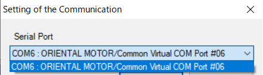

## Page 418

Parameter R/W commands
| 13-14  User output function selection |     |     |     |     |     |
| ------------------------------------- | --- | --- | --- | --- | --- |
Modbus 
| communication  |     |     |     | Initial setting |     |
| -------------- | --- | --- | --- | --------------- | --- |
register address 
|     | Name |     | Description | Update | NET-ID |
| --- | ---- | --- | ----------- | ------ | ------ |
Initial 
| Upper Lower |     |     |     |     | Unit |
| ----------- | --- | --- | --- | --- | ---- |
value
| 35840  35841    | User output (USR-OUT0)  |     |     |     | 17920   |
| --------------- | ----------------------- | --- | --- | --- | ------- |
|                 |                         |     |     | C 0 | −       |
| (8C00h) (8C01h) | (IO) operation mode     |     |     |     | (4600h) |
| 35842  35843    | User output (USR-OUT1)  |     |     |     | 17921   |
|                 |                         |     |     | C 0 | −       |
Selects the operation mode of the user 
| (8C02h) (8C03h) | (IO) operation mode |     |     |     | (4601h) |
| --------------- | ------------------- | --- | --- | --- | ------- |
output.
| 35844  35845    | User output (USR-OUT2)  |                  |     |     | 17922   |
| --------------- | ----------------------- | ---------------- | --- | --- | ------- |
|                 |                         | [Setting range]  |     | C 0 | −       |
| (8C04h) (8C05h) | (IO) operation mode     |                  |     |     | (4602h) |
0: Internal IO judgment
35846  35847  User output (USR-OUT3)  1: Value judgment (value X, value Y) =  17923 
|     |     |     |     | C 0 | −   |
| --- | --- | --- | --- | --- | --- |
(8C06h) (8C07h) (IO) operation mode (value A, value B) (4603h)
35848  35849  User output (USR-OUT4)  2: Value judgment (value X, value Y) =  17924 
|     |     |     |     | C 0 | −   |
| --- | --- | --- | --- | --- | --- |
(8C08h) (8C09h) (IO) operation mode (value of NET-ID = A, value B) (4604h)
3: Value judgment (value X, value Y) = 
| 35850  35851    | User output (USR-OUT5)  |                                |     |     | 17925   |
| --------------- | ----------------------- | ------------------------------ | --- | --- | ------- |
|                 |                         | (value A, value of NET-ID = B) |     | C 0 | −       |
| (8C0Ah) (8C0Bh) | (IO) operation mode     |                                |     |     | (4605h) |
4: Value Judgment (value X, value Y) = 
| 35852  35853    | User output (USR-OUT6)  |                                            |     |     | 17926   |
| --------------- | ----------------------- | ------------------------------------------ | --- | --- | ------- |
|                 |                         | (value of NET-ID = A, value of NET-ID = B) |     | C 0 | −       |
| (8C0Ch) (8C0Dh) | (IO) operation mode     |                                            |     |     | (4606h) |
| 35854  35855    | User output (USR-OUT7)  |                                            |     |     | 17927   |
|                 |                         |                                            |     | C 0 | −       |
| (8C0Eh) (8C0Fh) | (IO) operation mode     |                                            |     |     | (4607h) |
128: 
| 35872  35873    | User output (USR-OUT0)  |     |     |          | 17936   |
| --------------- | ----------------------- | --- | --- | -------- | ------- |
|                 |                         |     |     | C CONST- | −       |
| (8C20h) (8C21h) | (IO) source A function  |     |     |          | (4610h) |
OFF
7 Address codes list
128: 
| 35874  35875    | User output (USR-OUT1)  |     |     |          | 17937   |
| --------------- | ----------------------- | --- | --- | -------- | ------- |
|                 |                         |     |     | C CONST- | −       |
| (8C22h) (8C23h) | (IO) source A function  |     |     |          | (4611h) |
OFF
128: 
| 35876  35877    | User output (USR-OUT2)  |     |     |          | 17938   |
| --------------- | ----------------------- | --- | --- | -------- | ------- |
|                 |                         |     |     | C CONST- | −       |
| (8C24h) (8C25h) | (IO) source A function  |     |     |          | (4612h) |
OFF
|                 |                         | Selects the user output source A function   |     | 128:     |         |
| --------------- | ----------------------- | ------------------------------------------- | --- | -------- | ------- |
| 35878  35879    | User output (USR-OUT3)  |                                             |     |          | 17939   |
|                 |                         | (output signal) for USR-OUT0 to USR-OUT7.   |     | C CONST- | −       |
| (8C26h) (8C27h) | (IO) source A function  |                                             |     |          | (4613h) |
|                 |                         | This is the setting when the operation      |     | OFF      |         |
mode is set to internal IO judgment.
128: 
| 35880  35881    | User output (USR-OUT4)  |                                     |     |          | 17940   |
| --------------- | ----------------------- | ----------------------------------- | --- | -------- | ------- |
|                 |                         | [Setting range]                     |     | C CONST- | −       |
| (8C28h) (8C29h) | (IO) source A function  |                                     |     |          | (4614h) |
|                 |                         | _"2-2 Output signals list" on p.156 |     | OFF      |         |
128: 
| 35882  35883    | User output (USR-OUT5)  |     |     |          | 17941   |
| --------------- | ----------------------- | --- | --- | -------- | ------- |
|                 |                         |     |     | C CONST- | −       |
| (8C2Ah) (8C2Bh) | (IO) source A function  |     |     |          | (4615h) |
OFF
128: 
| 35884  35885    | User output (USR-OUT6)  |     |     |          | 17942   |
| --------------- | ----------------------- | --- | --- | -------- | ------- |
|                 |                         |     |     | C CONST- | −       |
| (8C2Ch) (8C2Dh) | (IO) source A function  |     |     |          | (4616h) |
OFF
128: 
| 35886  35887    | User output (USR-OUT7)  |     |     |          | 17943   |
| --------------- | ----------------------- | --- | --- | -------- | ------- |
|                 |                         |     |     | C CONST- | −       |
| (8C2Eh) (8C2Fh) | (IO) source A function  |     |     |          | (4617h) |
OFF
418

## Page 419

Parameter R/W commands
Modbus 
| communication     |      |     |             | Initial setting |        |     |
| ----------------- | ---- | --- | ----------- | --------------- | ------ | --- |
| register address  | Name |     | Description | Update          | NET-ID |     |
Initial 
| Upper Lower |     |     |     |     | Unit |     |
| ----------- | --- | --- | --- | --- | ---- | --- |
value
User output (USR-OUT0) 
| 35904  35905    |                          |     |     |     | 17952   |     |
| --------------- | ------------------------ | --- | --- | --- | ------- | --- |
|                 | (IO) source A inverting  |     |     | C 0 | −       |     |
| (8C40h) (8C41h) |                          |     |     |     | (4620h) |     |
mode
User output (USR-OUT1) 
| 35906  35907    |                          |     |     |     | 17953   |     |
| --------------- | ------------------------ | --- | --- | --- | ------- | --- |
|                 | (IO) source A inverting  |     |     | C 0 | −       |     |
| (8C42h) (8C43h) |                          |     |     |     | (4621h) |     |
mode
User output (USR-OUT2) 
| 35908  35909    |                          |     |     |     | 17954   |     |
| --------------- | ------------------------ | --- | --- | --- | ------- | --- |
|                 | (IO) source A inverting  |     |     | C 0 | −       |     |
| (8C44h) (8C45h) |                          |     |     |     | (4622h) |     |
mode
Changes ON/OFF of the user output source 
User output (USR-OUT3) 
| 35910  35911  |                          | A.   |     |     | 17955  |     |
| ------------- | ------------------------ | ---- | --- | --- | ------ | --- |
|               | (IO) source A inverting  |      |     | C 0 | −      |     |
(8C46h) (8C47h) This is the setting when the operation  (4623h)
mode
mode is set to internal IO judgment.
User output (USR-OUT4) 
| 35912  35913    |                          | [Setting range]  |     |     | 17956   |     |
| --------------- | ------------------------ | ---------------- | --- | --- | ------- | --- |
|                 | (IO) source A inverting  |                  |     | C 0 | −       |     |
| (8C48h) (8C49h) |                          | 0: Not invert    |     |     | (4624h) |     |
mode
1: Invert
User output (USR-OUT5) 
| 35914  35915    |                          |     |     |     | 17957   |     |
| --------------- | ------------------------ | --- | --- | --- | ------- | --- |
|                 | (IO) source A inverting  |     |     | C 0 | −       |     |
| (8C4Ah) (8C4Bh) |                          |     |     |     | (4625h) |     |
mode
User output (USR-OUT6) 
| 35916  35917    |                          |     |     |     | 17958   |     |
| --------------- | ------------------------ | --- | --- | --- | ------- | --- |
|                 | (IO) source A inverting  |     |     | C 0 | −       |     |
| (8C4Ch) (8C4Dh) |                          |     |     |     | (4626h) |     |
mode
User output (USR-OUT7) 
| 35918  35919    |                          |     |     |     | 17959   |                      |
| --------------- | ------------------------ | --- | --- | --- | ------- | -------------------- |
|                 | (IO) source A inverting  |     |     | C 0 | −       | 7 Address codes list |
| (8C4Eh) (8C4Fh) |                          |     |     |     | (4627h) |                      |
mode
128: 
| 35936  35937    | User output (USR-OUT0)  |     |     |          | 17968   |     |
| --------------- | ----------------------- | --- | --- | -------- | ------- | --- |
|                 |                         |     |     | C CONST- | −       |     |
| (8C60h) (8C61h) | (IO) source B function  |     |     |          | (4630h) |     |
OFF
128: 
| 35938  35939    | User output (USR-OUT1)  |     |     |          | 17969   |     |
| --------------- | ----------------------- | --- | --- | -------- | ------- | --- |
|                 |                         |     |     | C CONST- | −       |     |
| (8C62h) (8C63h) | (IO) source B function  |     |     |          | (4631h) |     |
OFF
128: 
| 35940  35941    | User output (USR-OUT2)  |     |     |          | 17970   |     |
| --------------- | ----------------------- | --- | --- | -------- | ------- | --- |
|                 |                         |     |     | C CONST- | −       |     |
| (8C64h) (8C65h) | (IO) source B function  |     |     |          | (4632h) |     |
OFF
|                 |                         | Selects the user output source B function   |     | 128:     |         |     |
| --------------- | ----------------------- | ------------------------------------------- | --- | -------- | ------- | --- |
| 35942  35943    | User output (USR-OUT3)  |                                             |     |          | 17971   |     |
|                 |                         | (output signal) for USR-OUT0 to USR-OUT7.   |     | C CONST- | −       |     |
| (8C66h) (8C67h) | (IO) source B function  |                                             |     |          | (4633h) |     |
|                 |                         | This is the setting when the operation      |     | OFF      |         |     |
mode is set to internal IO judgment.
128: 
| 35944  35945    | User output (USR-OUT4)  |                                     |     |          | 17972   |     |
| --------------- | ----------------------- | ----------------------------------- | --- | -------- | ------- | --- |
|                 |                         | [Setting range]                     |     | C CONST- | −       |     |
| (8C68h) (8C69h) | (IO) source B function  |                                     |     |          | (4634h) |     |
|                 |                         | _"2-2 Output signals list" on p.156 |     | OFF      |         |     |
128: 
| 35946  35947    | User output (USR-OUT5)  |     |     |          | 17973   |     |
| --------------- | ----------------------- | --- | --- | -------- | ------- | --- |
|                 |                         |     |     | C CONST- | −       |     |
| (8C6Ah) (8C6Bh) | (IO) source B function  |     |     |          | (4635h) |     |
OFF
128: 
| 35948  35949    | User output (USR-OUT6)  |     |     |          | 17974   |     |
| --------------- | ----------------------- | --- | --- | -------- | ------- | --- |
|                 |                         |     |     | C CONST- | −       |     |
| (8C6Ch) (8C6Dh) | (IO) source B function  |     |     |          | (4636h) |     |
OFF
128: 
| 35950  35951    | User output (USR-OUT7)  |     |     |          | 17975   |     |
| --------------- | ----------------------- | --- | --- | -------- | ------- | --- |
|                 |                         |     |     | C CONST- | −       |     |
| (8C6Eh) (8C6Fh) | (IO) source B function  |     |     |          | (4637h) |     |
OFF
419

## Page 420

Parameter R/W commands
Modbus 
communication  Initial setting
| register address  | Name |     | Description | Update | NET-ID |
| ----------------- | ---- | --- | ----------- | ------ | ------ |
Initial 
| Upper Lower |     |     |     |     | Unit |
| ----------- | --- | --- | --- | --- | ---- |
value
User output (USR-OUT0) 
| 35968  35969    |                          |     |     |     | 17984   |
| --------------- | ------------------------ | --- | --- | --- | ------- |
|                 | (IO) source B inverting  |     |     | C 0 | −       |
| (8C80h) (8C81h) |                          |     |     |     | (4640h) |
mode
User output (USR-OUT1) 
| 35970  35971    |                          |     |     |     | 17985   |
| --------------- | ------------------------ | --- | --- | --- | ------- |
|                 | (IO) source B inverting  |     |     | C 0 | −       |
| (8C82h) (8C83h) |                          |     |     |     | (4641h) |
mode
User output (USR-OUT2) 
| 35972  35973    |                          |     |     |     | 17986   |
| --------------- | ------------------------ | --- | --- | --- | ------- |
|                 | (IO) source B inverting  |     |     | C 0 | −       |
| (8C84h) (8C85h) |                          |     |     |     | (4642h) |
mode
Changes ON/OFF of the user output source 
User output (USR-OUT3) 
| 35974  35975  |                          | B.   |     |     | 17987  |
| ------------- | ------------------------ | ---- | --- | --- | ------ |
|               | (IO) source B inverting  |      |     | C 0 | −      |
(8C86h) (8C87h) This is the setting when the operation  (4643h)
mode
mode is set to internal IO judgment.
User output (USR-OUT4) 
| 35976  35977    |                          | [Setting range]  |     |     | 17988   |
| --------------- | ------------------------ | ---------------- | --- | --- | ------- |
|                 | (IO) source B inverting  |                  |     | C 0 | −       |
| (8C88h) (8C89h) |                          | 0: Not invert    |     |     | (4644h) |
mode
1: Invert
User output (USR-OUT5) 
| 35978  35979    |                          |     |     |     | 17989   |
| --------------- | ------------------------ | --- | --- | --- | ------- |
|                 | (IO) source B inverting  |     |     | C 0 | −       |
| (8C8Ah) (8C8Bh) |                          |     |     |     | (4645h) |
mode
User output (USR-OUT6) 
| 35980  35981    |                          |     |     |     | 17990   |
| --------------- | ------------------------ | --- | --- | --- | ------- |
|                 | (IO) source B inverting  |     |     | C 0 | −       |
| (8C8Ch) (8C8Dh) |                          |     |     |     | (4646h) |
mode
User output (USR-OUT7) 
| 35982  35983         |                          |     |     |     | 17991   |
| -------------------- | ------------------------ | --- | --- | --- | ------- |
| 7 Address codes list | (IO) source B inverting  |     |     | C 0 | −       |
| (8C8Eh) (8C8Fh)      |                          |     |     |     | (4647h) |
mode
| 36000  36001    | User output (USR-OUT0)  |                                              |     |      | 18000   |
| --------------- | ----------------------- | -------------------------------------------- | --- | ---- | ------- |
|                 |                         |                                              |     | C 1  | −       |
| (8CA0h) (8CA1h) | (IO) logical operation  |                                              |     |      | (4650h) |
| 36002  36003    | User output (USR-OUT1)  |                                              |     |      | 18001   |
|                 |                         |                                              |     | C 1  | −       |
| (8CA2h) (8CA3h) | (IO) logical operation  |                                              |     |      | (4651h) |
| 36004  36005    | User output (USR-OUT2)  |                                              |     |      | 18002   |
|                 |                         | Sets the logical combination of user output  |     | C 1  | −       |
| (8CA4h) (8CA5h) | (IO) logical operation  |                                              |     |      | (4652h) |
source A and user output source B.  
| 36006  36007    | User output (USR-OUT3)  |                                         |     |     | 18003   |
| --------------- | ----------------------- | --------------------------------------- | --- | --- | ------- |
|                 |                         | This is the setting when the operation  |     | C 1 | −       |
| (8CA6h) (8CA7h) | (IO) logical operation  |                                         |     |     | (4653h) |
mode is set to internal IO judgment.
| 36008  36009    | User output (USR-OUT4)  |                  |     |     | 18004   |
| --------------- | ----------------------- | ---------------- | --- | --- | ------- |
|                 |                         | [Setting range]  |     | C 1 | −       |
| (8CA8h) (8CA9h) | (IO) logical operation  |                  |     |     | (4654h) |
0: AND 
| 36010  36011    | User output (USR-OUT5)  | 1 OR |     |     | 18005   |
| --------------- | ----------------------- | ---- | --- | --- | ------- |
|                 |                         |      |     | C 1 | −       |
| (8CAAh) (8CABh) | (IO) logical operation  |      |     |     | (4655h) |
| 36012  36013    | User output (USR-OUT6)  |      |     |     | 18006   |
|                 |                         |      |     | C 1 | −       |
| (8CACh) (8CADh) | (IO) logical operation  |      |     |     | (4656h) |
| 36014  36015    | User output (USR-OUT7)  |      |     |     | 18007   |
|                 |                         |      |     | C 1 | −       |
| (8CAEh) (8CAFh) | (IO) logical operation  |      |     |     | (4657h) |
420

## Page 421

Parameter R/W commands
Modbus 
| communication     |      |     |             | Initial setting |        |
| ----------------- | ---- | --- | ----------- | --------------- | ------ |
| register address  | Name |     | Description | Update          | NET-ID |
Initial 
| Upper Lower |     |     |     |     | Unit |
| ----------- | --- | --- | --- | --- | ---- |
value
Selects the ON condition of the user 
| 36032  36033    | User output (USR-OUT0)  |           |     |     | 18016   |
| --------------- | ----------------------- | --------- | --- | --- | ------- |
|                 |                         | output.   |     | C 0 | −       |
| (8CC0h) (8CC1h) | (value) ON condition    |           |     |     | (4660h) |
This is the setting when the operation 
mode is set to value judgment.
| 36034  36035  | User output (USR-OUT1)  | [Setting range] |     |     | 18017  |
| ------------- | ----------------------- | --------------- | --- | --- | ------ |
|               |                         |                 |     | C 0 | −      |
0: (value of target NET-ID + value Y) = 
| (8CC2h) (8CC3h) | (value) ON condition |     |     |     | (4661h) |
| --------------- | -------------------- | --- | --- | --- | ------- |
(value X)
1: (target NET-ID value + value Y) < (value 
| 36036  36037  | User output (USR-OUT2)  | X)  |     |     | 18018  |
| ------------- | ----------------------- | --- | --- | --- | ------ |
|               |                         |     |     | C 0 | −      |
(8CC4h) (8CC5h) (value) ON condition 2: (value of target NET-ID + value Y) ≤  (4662h)
(value X)
3: (value X) < (value of target NET-ID + 
| 36038  36039    | User output (USR-OUT3)  |          |     |     | 18019   |
| --------------- | ----------------------- | -------- | --- | --- | ------- |
|                 |                         | value Y) |     | C 0 | −       |
| (8CC6h) (8CC7h) | (value) ON condition    |          |     |     | (4663h) |
4: (value X) ≤ (value of target NET-ID + 
value Y)
5: (value of target NET-ID) < (value X) or 
| 36040  36041  | User output (USR-OUT4)  |     |     |     | 18020  |
| ------------- | ----------------------- | --- | --- | --- | ------ |
|               |                         |     |     | C 0 | −      |
(8CC8h) (8CC9h) (value) ON condition (value Y) < (value of target NET-ID) (4664h)
6: (value of target NET-ID) ≤ (value X) or 
(value Y) ≤ (value of target NET-ID)
36042  36043  User output (USR-OUT5)  7: (value X) < (value of target NET-ID)  18021 
|                 |                      |            |     | C 0 | −       |
| --------------- | -------------------- | ---------- | --- | --- | ------- |
| (8CCAh) (8CCBh) | (value) ON condition | <(value Y) |     |     | (4665h) |
8: (value X) ≤ (value of target NET-ID) ≤ 
(value Y)
| 36044  36045  | User output (USR-OUT6)  |     |     |     | 18022  |
| ------------- | ----------------------- | --- | --- | --- | ------ |
9: (value Y) = ((value of target NET-ID) And 
|     |     |     |     | C 0 | −   |
| --- | --- | --- | --- | --- | --- |
(8CCCh) (8CCDh) (value) ON condition (value X)) (4666h) 7 Address codes list
10: (value Y) = ((value of target NET-ID) Or 
(value X))
| 36046  36047    | User output (USR-OUT7)  |                                               |     |     | 18023   |
| --------------- | ----------------------- | --------------------------------------------- | --- | --- | ------- |
|                 |                         | 11: ((value of target NET-ID) And (value X))  |     | C 0 | −       |
| (8CCEh) (8CCFh) | (value) ON condition    |                                               |     |     | (4667h) |
is not 0
| 36064  36065    | User output (USR-OUT0)  |     |     |     | 18032   |
| --------------- | ----------------------- | --- | --- | --- | ------- |
|                 |                         |     |     | C 0 | −       |
| (8CE0h) (8CE1h) | (value) target NET-ID   |     |     |     | (4670h) |
| 36066  36067    | User output (USR-OUT1)  |     |     |     | 18033   |
|                 |                         |     |     | C 0 | −       |
| (8CE2h) (8CE3h) | (value) target NET-ID   |     |     |     | (4671h) |
| 36068  36069    | User output (USR-OUT2)  |     |     |     | 18034   |
|                 |                         |     |     | C 0 | −       |
| (8CE4h) (8CE5h) | (value) target NET-ID   |     |     |     | (4672h) |
Sets the target NET-ID of the user output.  
| 36070  36071    | User output (USR-OUT3)  |                                         |     |     | 18035   |
| --------------- | ----------------------- | --------------------------------------- | --- | --- | ------- |
|                 |                         | This is the setting when the operation  |     | C 0 | −       |
| (8CE6h) (8CE7h) | (value) target NET-ID   |                                         |     |     | (4673h) |
mode is set to value judgment.
| 36072  36073    | User output (USR-OUT4)  |                  |     |     | 18036   |
| --------------- | ----------------------- | ---------------- | --- | --- | ------- |
|                 |                         | [Setting range]  |     | C 0 | −       |
| (8CE8h) (8CE9h) | (value) target NET-ID   |                  |     |     | (4674h) |
0 to 65,535
| 36074  36075    | User output (USR-OUT5)  |     |     |     | 18037   |
| --------------- | ----------------------- | --- | --- | --- | ------- |
|                 |                         |     |     | C 0 | −       |
| (8CEAh) (8CEBh) | (value) target NET-ID   |     |     |     | (4675h) |
| 36076  36077    | User output (USR-OUT6)  |     |     |     | 18038   |
|                 |                         |     |     | C 0 | −       |
| (8CECh) (8CEDh) | (value) target NET-ID   |     |     |     | (4676h) |
| 36078  36079    | User output (USR-OUT7)  |     |     |     | 18039   |
|                 |                         |     |     | C 0 | −       |
| (8CEEh) (8CEFh) | (value) target NET-ID   |     |     |     | (4677h) |
421

## Page 422

Parameter R/W commands
Modbus 
| communication     |     |      |     |             | Initial setting |        |
| ----------------- | --- | ---- | --- | ----------- | --------------- | ------ |
| register address  |     | Name |     | Description | Update          | NET-ID |
Initial 
| Upper | Lower |     |     |     |     | Unit |
| ----- | ----- | --- | --- | --- | --- | ---- |
value
| 36096   | 36097  User output (USR-OUT0)  |     |     |     |     | 18048   |
| ------- | ------------------------------ | --- | --- | --- | --- | ------- |
|         |                                |     |     |     | A 0 | −       |
| (8D00h) | (8D01h) (value) value A        |     |     |     |     | (4680h) |
| 36098   | 36099  User output (USR-OUT1)  |     |     |     |     | 18049   |
|         |                                |     |     |     | A 0 | −       |
| (8D02h) | (8D03h) (value) value A        |     |     |     |     | (4681h) |
| 36100   | 36101  User output (USR-OUT2)  |     |     |     |     | 18050   |
|         |                                |     |     |     | A 0 | −       |
| (8D04h) | (8D05h) (value) value A        |     |     |     |     | (4682h) |
Sets the value A of the user ID.  
| 36102   | 36103  User output (USR-OUT3)  |     |                                         |     |     | 18051   |
| ------- | ------------------------------ | --- | --------------------------------------- | --- | --- | ------- |
|         |                                |     | This is the setting when the operation  |     | A 0 | −       |
| (8D06h) | (8D07h) (value) value A        |     |                                         |     |     | (4683h) |
mode is set to value judgment.
| 36104   | 36105  User output (USR-OUT4)  |     |                  |     |     | 18052   |
| ------- | ------------------------------ | --- | ---------------- | --- | --- | ------- |
|         |                                |     | [Setting range]  |     | A 0 | −       |
| (8D08h) | (8D09h) (value) value A        |     |                  |     |     | (4684h) |
−2,147,483,648 to 2,147,483,647
| 36106                        | 36107  User output (USR-OUT5)  |     |     |     |     | 18053   |
| ---------------------------- | ------------------------------ | --- | --- | --- | --- | ------- |
|                              |                                |     |     |     | A 0 | −       |
| (8D0Ah)                      | (8D0Bh) (value) value A        |     |     |     |     | (4685h) |
| 36108                        | 36109  User output (USR-OUT6)  |     |     |     |     | 18054   |
|                              |                                |     |     |     | A 0 | −       |
| (8D0Ch)                      | (8D0Dh) (value) value A        |     |     |     |     | (4686h) |
| 36110                        | 36111  User output (USR-OUT7)  |     |     |     |     | 18055   |
|                              |                                |     |     |     | A 0 | −       |
| (8D0Eh)                      | (8D0Fh) (value) value A        |     |     |     |     | (4687h) |
| 36128                        | 36129  User output (USR-OUT0)  |     |     |     |     | 18064   |
|                              |                                |     |     |     | A 0 | −       |
| (8D20h)                      | (8D21h) (value) value B        |     |     |     |     | (4690h) |
| 36130                        | 36131  User output (USR-OUT1)  |     |     |     |     | 18065   |
|                              |                                |     |     |     | A 0 | −       |
| (8D22h)                      | (8D23h) (value) value B        |     |     |     |     | (4691h) |
| 36132                        | 36133  User output (USR-OUT2)  |     |     |     |     | 18066   |
|                              |                                |     |     |     | A 0 | −       |
| 7 Address codes list (8D24h) | (8D25h) (value) value B        |     |     |     |     | (4692h) |
Sets the value B of the user output.  
| 36134   | 36135  User output (USR-OUT3)  |     |                                         |     |     | 18067   |
| ------- | ------------------------------ | --- | --------------------------------------- | --- | --- | ------- |
|         |                                |     | This is the setting when the operation  |     | A 0 | −       |
| (8D26h) | (8D27h) (value) value B        |     |                                         |     |     | (4693h) |
mode is set to value judgment.
| 36136   | 36137  User output (USR-OUT4)  |     |                  |     |     | 18068   |
| ------- | ------------------------------ | --- | ---------------- | --- | --- | ------- |
|         |                                |     | [Setting range]  |     | A 0 | −       |
| (8D28h) | (8D29h) (value) value B        |     |                  |     |     | (4694h) |
−2,147,483,648 to 2,147,483,647
| 36138   | 36139  User output (USR-OUT5)  |     |     |     |     | 18069   |
| ------- | ------------------------------ | --- | --- | --- | --- | ------- |
|         |                                |     |     |     | A 0 | −       |
| (8D2Ah) | (8D2Bh) (value) value B        |     |     |     |     | (4695h) |
| 36140   | 36141  User output (USR-OUT6)  |     |     |     |     | 18070   |
|         |                                |     |     |     | A 0 | −       |
| (8D2Ch) | (8D2Dh) (value) value B        |     |     |     |     | (4696h) |
| 36142   | 36143  User output (USR-OUT7)  |     |     |     |     | 18071   |
|         |                                |     |     |     | A 0 | −       |
| (8D2Eh) | (8D2Fh) (value) value B        |     |     |     |     | (4697h) |
422

## Page 423

Parameter R/W commands
| 13-15  Virtual input function selection (VIN) |     |     |     |     |     |     |
| --------------------------------------------- | --- | --- | --- | --- | --- | --- |
Modbus 
| communication  |      |     |             |        | Initial setting |        |
| -------------- | ---- | --- | ----------- | ------ | --------------- | ------ |
|                | Name |     | Description | Update |                 | NET-ID |
register address 
| Upper Lower     |                          |     |     |     | Initial value Unit |         |
| --------------- | ------------------------ | --- | --- | --- | ------------------ | ------- |
| 35328  35329    | Virtual input (VIR-IN0)  |     |     |     | 0:                 | 17664   |
|                 |                          |     |     | C   |                    | −       |
| (8A00h) (8A01h) | function (link)          |     |     |     | Not used           | (4500h) |
| 35330  35331    | Virtual input (VIR-IN1)  |     |     |     | 0:                 | 17665   |
|                 |                          |     |     | C   |                    | −       |
| (8A02h) (8A03h) | function (link)          |     |     |     | Not used           | (4501h) |
| 35332  35333    | Virtual input (VIR-IN2)  |     |     |     | 0:                 | 17666   |
|                 |                          |     |     | C   |                    | −       |
| (8A04h) (8A05h) | function (link)          |     |     |     | Not used           | (4502h) |
| 35334  35335    | Virtual input (VIR-IN3)  |     |     |     | 0:                 | 17667   |
Selects the input signals to be 
|     |     |     |     | C   |     | −   |
| --- | --- | --- | --- | --- | --- | --- |
(8A06h) (8A07h) function (link) assigned to VIR-IN0 to VIR-IN7. Not used (4503h)
35336  35337  Virtual input (VIR-IN4)  [Setting range]  0:   17668 
|                 |                          | _"2-1 Input signals list" on p.153 |     | C   |           | −       |
| --------------- | ------------------------ | ---------------------------------- | --- | --- | --------- | ------- |
| (8A08h) (8A09h) | function (link)          |                                    |     |     | Not used  | (4504h) |
| 35338  35339    | Virtual input (VIR-IN5)  |                                    |     |     | 0:        | 17669   |
|                 |                          |                                    |     | C   |           | −       |
| (8A0Ah) (8A0Bh) | function (link)          |                                    |     |     | Not used  | (4505h) |
| 35340  35341    | Virtual input (VIR-IN6)  |                                    |     |     | 0:        | 17670   |
|                 |                          |                                    |     | C   |           | −       |
| (8A0Ch) (8A0Dh) | function (link)          |                                    |     |     | Not used  | (4506h) |
| 35342  35343    | Virtual input (VIR-IN7)  |                                    |     |     | 0:        | 17671   |
|                 |                          |                                    |     | C   |           | −       |
| (8A0Eh) (8A0Fh) | function (link)          |                                    |     |     | Not used  | (4507h) |
| 35392  35393    | Virtual input (VIR-IN0)  |                                    |     |     | 128:      | 17696   |
|                 |                          |                                    |     | C   |           | −       |
| (8A40h) (8A41h) | source A function        |                                    |     |     | CONST-OFF | (4520h) |
| 35394  35395    | Virtual input (VIR-IN1)  |                                    |     |     | 128:      | 17697   |
|                 |                          |                                    |     | C   |           | −       |
| (8A42h) (8A43h) | source A function        |                                    |     |     | CONST-OFF | (4521h) |
7 Address codes list
| 35396  35397    | Virtual input (VIR-IN2)  |     |     |     | 128:      | 17698   |
| --------------- | ------------------------ | --- | --- | --- | --------- | ------- |
|                 |                          |     |     | C   |           | −       |
| (8A44h) (8A45h) | source A function        |     |     |     | CONST-OFF | (4522h) |
Selects the virtual input source A 
| 35398  35399    | Virtual input (VIR-IN3)  |                                       |     |     | 128:      | 17699   |
| --------------- | ------------------------ | ------------------------------------- | --- | --- | --------- | ------- |
|                 |                          | function (output signal) for VIR-IN0  |     | C   |           | −       |
| (8A46h) (8A47h) | source A function        |                                       |     |     | CONST-OFF | (4523h) |
to VIR-IN7.
| 35400  35401  | Virtual input (VIR-IN4)  |                  |     |     | 128:  | 17700  |
| ------------- | ------------------------ | ---------------- | --- | --- | ----- | ------ |
|               |                          | [Setting range]  |     | C   |       | −      |
(8A48h) (8A49h) source A function _"2-2 Output signals list" on p.156 CONST-OFF (4524h)
| 35402  35403    | Virtual input (VIR-IN5)  |     |     |     | 128:      | 17701   |
| --------------- | ------------------------ | --- | --- | --- | --------- | ------- |
|                 |                          |     |     | C   |           | −       |
| (8A4Ah) (8A4Bh) | source A function        |     |     |     | CONST-OFF | (4525h) |
| 35404  35405    | Virtual input (VIR-IN6)  |     |     |     | 128:      | 17702   |
|                 |                          |     |     | C   |           | −       |
| (8A4Ch) (8A4Dh) | source A function        |     |     |     | CONST-OFF | (4526h) |
| 35406  35407    | Virtual input (VIR-IN7)  |     |     |     | 128:      | 17703   |
|                 |                          |     |     | C   |           | −       |
| (8A4Eh) (8A4Fh) | source A function        |     |     |     | CONST-OFF | (4527h) |
| 35456  35457    | Virtual input (VIR-IN0)  |     |     |     |           | 17728   |
|                 |                          |     |     | C   | 0         | −       |
| (8A80h) (8A81h) | source A inverting mode  |     |     |     |           | (4540h) |
| 35458  35459    | Virtual input (VIR-IN1)  |     |     |     |           | 17729   |
|                 |                          |     |     | C   | 0         | −       |
| (8A82h) (8A83h) | source A inverting mode  |     |     |     |           | (4541h) |
| 35460  35461    | Virtual input (VIR-IN2)  |     |     |     |           | 17730   |
|                 |                          |     |     | C   | 0         | −       |
| (8A84h) (8A85h) | source A inverting mode  |     |     |     |           | (4542h) |
Changes ON/OFF of the virtual 
| 35462  35463    | Virtual input (VIR-IN3)  |                 |     |     |     | 17731   |
| --------------- | ------------------------ | --------------- | --- | --- | --- | ------- |
|                 |                          | input source A. |     | C   | 0   | −       |
| (8A86h) (8A87h) | source A inverting mode  |                 |     |     |     | (4543h) |
[Setting range] 
| 35464  35465    | Virtual input (VIR-IN4)  |                |     |     |     | 17732   |
| --------------- | ------------------------ | -------------- | --- | --- | --- | ------- |
|                 |                          | 0: Not invert  |     | C   | 0   | −       |
| (8A88h) (8A89h) | source A inverting mode  |                |     |     |     | (4544h) |
1: Invert
| 35466  35467    | Virtual input (VIR-IN5)  |     |     |     |     | 17733   |
| --------------- | ------------------------ | --- | --- | --- | --- | ------- |
|                 |                          |     |     | C   | 0   | −       |
| (8A8Ah) (8A8Bh) | source A inverting mode  |     |     |     |     | (4545h) |
| 35468  35469    | Virtual input (VIR-IN6)  |     |     |     |     | 17734   |
|                 |                          |     |     | C   | 0   | −       |
| (8A8Ch) (8A8Dh) | source A inverting mode  |     |     |     |     | (4546h) |
| 35470  35471    | Virtual input (VIR-IN7)  |     |     |     |     | 17735   |
|                 |                          |     |     | C   | 0   | −       |
| (8A8Eh) (8A8Fh) | source A inverting mode  |     |     |     |     | (4547h) |
423

## Page 424

Parameter R/W commands
Modbus 
| communication  |      |     |             |        | Initial setting |        |
| -------------- | ---- | --- | ----------- | ------ | --------------- | ------ |
|                | Name |     | Description | Update |                 | NET-ID |
register address 
| Upper Lower     |                          |     |     |     | Initial value Unit |         |
| --------------- | ------------------------ | --- | --- | --- | ------------------ | ------- |
| 35520  35521    | Virtual input (VIR-IN0)  |     |     |     | 128:               | 17760   |
|                 |                          |     |     | C   |                    | −       |
| (8AC0h) (8AC1h) | source B function        |     |     |     | CONST-OFF          | (4560h) |
| 35522  35523    | Virtual input (VIR-IN1)  |     |     |     | 128:               | 17761   |
|                 |                          |     |     | C   |                    | −       |
| (8AC2h) (8AC3h) | source B function        |     |     |     | CONST-OFF          | (4561h) |
| 35524  35525    | Virtual input (VIR-IN2)  |     |     |     | 128:               | 17762   |
|                 |                          |     |     | C   |                    | −       |
| (8AC4h) (8AC5h) | source B function        |     |     |     | CONST-OFF          | (4562h) |
Selects the virtual input source B 
| 35526  35527    | Virtual input (VIR-IN3)  |                                       |     |     | 128:      | 17763   |
| --------------- | ------------------------ | ------------------------------------- | --- | --- | --------- | ------- |
|                 |                          | function (output signal) for VIR-IN0  |     | C   |           | −       |
| (8AC6h) (8AC7h) | source B function        |                                       |     |     | CONST-OFF | (4563h) |
to VIR-IN7.
| 35528  35529    | Virtual input (VIR-IN4)  |                  |     |     | 128:      | 17764   |
| --------------- | ------------------------ | ---------------- | --- | --- | --------- | ------- |
|                 |                          | [Setting range]  |     | C   |           | −       |
| (8AC8h) (8AC9h) | source B function        |                  |     |     | CONST-OFF | (4564h) |
_"2-2 Output signals list" on p.156
| 35530  35531    | Virtual input (VIR-IN5)  |     |     |     | 128:      | 17765   |
| --------------- | ------------------------ | --- | --- | --- | --------- | ------- |
|                 |                          |     |     | C   |           | −       |
| (8ACAh) (8ACBh) | source B function        |     |     |     | CONST-OFF | (4565h) |
| 35532  35533    | Virtual input (VIR-IN6)  |     |     |     | 128:      | 17766   |
|                 |                          |     |     | C   |           | −       |
| (8ACCh) (8ACDh) | source B function        |     |     |     | CONST-OFF | (4566h) |
| 35534  35535    | Virtual input (VIR-IN7)  |     |     |     | 128:      | 17767   |
|                 |                          |     |     | C   |           | −       |
| (8ACEh) (8ACFh) | source B function        |     |     |     | CONST-OFF | (4567h) |
| 35584  35585    | Virtual input (VIR-IN0)  |     |     |     |           | 17792   |
|                 |                          |     |     | C   | 0         | −       |
| (8B00h) (8B01h) | source B inverting mode  |     |     |     |           | (4580h) |
| 35586  35587    | Virtual input (VIR-IN1)  |     |     |     |           | 17793   |
|                 |                          |     |     | C   | 0         | −       |
| (8B02h) (8B03h) | source B inverting mode  |     |     |     |           | (4581h) |
| 35588  35589    | Virtual input (VIR-IN2)  |     |     |     |           | 17794   |
|                 |                          |     |     | C   | 0         | −       |
| (8B04h) (8B05h) | source B inverting mode  |     |     |     |           | (4582h) |
7 Address codes list Changes ON/OFF of the virtual 
| 35590  35591    | Virtual input (VIR-IN3)  |                 |     |     |     | 17795   |
| --------------- | ------------------------ | --------------- | --- | --- | --- | ------- |
|                 |                          | input source B. |     | C   | 0   | −       |
| (8B06h) (8B07h) | source B inverting mode  |                 |     |     |     | (4583h) |
[Setting range] 
| 35592  35593    | Virtual input (VIR-IN4)  |                |     |     |     | 17796   |
| --------------- | ------------------------ | -------------- | --- | --- | --- | ------- |
|                 |                          | 0: Not invert  |     | C   | 0   | −       |
| (8B08h) (8B09h) | source B inverting mode  |                |     |     |     | (4584h) |
1: Invert
| 35594  35595    | Virtual input (VIR-IN5)  |     |     |     |     | 17797   |
| --------------- | ------------------------ | --- | --- | --- | --- | ------- |
|                 |                          |     |     | C   | 0   | −       |
| (8B0Ah) (8B0Bh) | source B inverting mode  |     |     |     |     | (4585h) |
| 35596  35597    | Virtual input (VIR-IN6)  |     |     |     |     | 17798   |
|                 |                          |     |     | C   | 0   | −       |
| (8B0Ch) (8B0Dh) | source B inverting mode  |     |     |     |     | (4586h) |
| 35598  35599    | Virtual input (VIR-IN7)  |     |     |     |     | 17799   |
|                 |                          |     |     | C   | 0   | −       |
| (8B0Eh) (8B0Fh) | source B inverting mode  |     |     |     |     | (4587h) |
| 35648  35649    | Virtual input (VIR-IN0)  |     |     |     |     | 17824   |
|                 |                          |     |     | C   | 1   | −       |
| (8B40h) (8B41h) | logical operation        |     |     |     |     | (45A0h) |
| 35650  35651    | Virtual input (VIR-IN1)  |     |     |     |     | 17825   |
|                 |                          |     |     | C   | 1   | −       |
| (8B42h) (8B43h) | logical operation        |     |     |     |     | (45A1h) |
| 35652  35653    | Virtual input (VIR-IN2)  |     |     |     |     | 17826   |
|                 |                          |     |     | C   | 1   | −       |
| (8B44h) (8B45h) | logical operation        |     |     |     |     | (45A2h) |
Sets the logical combination of 
35654  35655  Virtual input (VIR-IN3)  virtual input source A and virtual  17827 
|                 |                   |                 |     | C   | 1   | −       |
| --------------- | ----------------- | --------------- | --- | --- | --- | ------- |
| (8B46h) (8B47h) | logical operation | input source B. |     |     |     | (45A3h) |
35656  35657  Virtual input (VIR-IN4)  [Setting range]  17828 
|                 |                   |         |     | C   | 1   | −       |
| --------------- | ----------------- | ------- | --- | --- | --- | ------- |
| (8B48h) (8B49h) | logical operation | 0: AND  |     |     |     | (45A4h) |
1 OR
| 35658  35659    | Virtual input (VIR-IN5)  |     |     |     |     | 17829   |
| --------------- | ------------------------ | --- | --- | --- | --- | ------- |
|                 |                          |     |     | C   | 1   | −       |
| (8B4Ah) (8B4Bh) | logical operation        |     |     |     |     | (45A5h) |
| 35660  35661    | Virtual input (VIR-IN6)  |     |     |     |     | 17830   |
|                 |                          |     |     | C   | 1   | −       |
| (8B4Ch) (8B4Dh) | logical operation        |     |     |     |     | (45A6h) |
| 35662  35663    | Virtual input (VIR-IN7)  |     |     |     |     | 17831   |
|                 |                          |     |     | C   | 1   | −       |
| (8B4Eh) (8B4Fh) | logical operation        |     |     |     |     | (45A7h) |
424

## Page 425

Parameter R/W commands
Modbus 
communication  Initial setting
|     | Name | Description | Update | NET-ID |
| --- | ---- | ----------- | ------ | ------ |
register address 
| Upper Lower     |                             |     | Initial value | Unit    |
| --------------- | --------------------------- | --- | ------------- | ------- |
| 35712  35713    | Virtual input (VIR-IN0) ON  |     |               | 17856   |
|                 |                             |     | C 0           | ms      |
| (8B80h) (8B81h) | signal dead time            |     |               | (45C0h) |
| 35714  35715    | Virtual input (VIR-IN1) ON  |     |               | 17857   |
|                 |                             |     | C 0           | ms      |
| (8B82h) (8B83h) | signal dead time            |     |               | (45C1h) |
| 35716  35717    | Virtual input (VIR-IN2) ON  |     |               | 17858   |
|                 |                             |     | C 0           | ms      |
(8B84h) (8B85h) signal dead time Sets the ON signal dead-time for  (45C2h)
VIR-IN0 to VIR-IN7.  
| 35718  35719    | Virtual input (VIR-IN3) ON  |                                 |     | 17859   |
| --------------- | --------------------------- | ------------------------------- | --- | ------- |
|                 |                             | (The input signal is turned ON  | C 0 | ms      |
| (8B86h) (8B87h) | signal dead time            |                                 |     | (45C3h) |
when the time having set is 
| 35720  35721    | Virtual input (VIR-IN4) ON  | exceeded.) |     | 17860   |
| --------------- | --------------------------- | ---------- | --- | ------- |
|                 |                             |            | C 0 | ms      |
| (8B88h) (8B89h) | signal dead time            |            |     | (45C4h) |
[Setting range] 
35722  35723  Virtual input (VIR-IN5) ON  0 to 4,000 ms 17861 
|                 |                             |                                     | C 0 | ms      |
| --------------- | --------------------------- | ----------------------------------- | --- | ------- |
| (8B8Ah) (8B8Bh) | signal dead time            |                                     |     | (45C5h) |
| 35724  35725    | Virtual input (VIR-IN6) ON  |                                     |     | 17862   |
|                 |                             |                                     | C 0 | ms      |
| (8B8Ch) (8B8Dh) | signal dead time            |                                     |     | (45C6h) |
| 35726  35727    | Virtual input (VIR-IN7) ON  |                                     |     | 17863   |
|                 |                             |                                     | C 0 | ms      |
| (8B8Eh) (8B8Fh) | signal dead time            |                                     |     | (45C7h) |
| 35776  35777    | Virtual input (VIR-IN0) 1   |                                     |     | 17888   |
|                 |                             |                                     | C 0 | −       |
| (8BC0h) (8BC1h) | shot signal mode            |                                     |     | (45E0h) |
| 35778  35779    | Virtual input (VIR-IN1) 1   |                                     |     | 17889   |
|                 |                             |                                     | C 0 | −       |
| (8BC2h) (8BC3h) | shot signal mode            |                                     |     | (45E1h) |
| 35780  35781    | Virtual input (VIR-IN2) 1   |                                     |     | 17890   |
|                 |                             | Enables the 1-shot signal function  | C 0 | −       |
| (8BC4h) (8BC5h) | shot signal mode            |                                     |     | (45E2h) |
for VIR-IN0 to VIR-IN7.  
7 Address codes list
35782  35783  Virtual input (VIR-IN3) 1  (The input signal having been  17891 
|     |     |     | C 0 | −   |
| --- | --- | --- | --- | --- |
(8BC6h) (8BC7h) shot signal mode turned ON is automatically turned  (45E3h)
OFF after 250 μs.)
| 35784  35785    | Virtual input (VIR-IN4) 1  |                  |     | 17892   |
| --------------- | -------------------------- | ---------------- | --- | ------- |
|                 |                            |                  | C 0 | −       |
| (8BC8h) (8BC9h) | shot signal mode           | [Setting range]  |     | (45E4h) |
0: Disable 
| 35786  35787    | Virtual input (VIR-IN5) 1  |           |     | 17893   |
| --------------- | -------------------------- | --------- | --- | ------- |
|                 |                            | 1: Enable | C 0 | −       |
| (8BCAh) (8BCBh) | shot signal mode           |           |     | (45E5h) |
| 35788  35789    | Virtual input (VIR-IN6) 1  |           |     | 17894   |
|                 |                            |           | C 0 | −       |
| (8BCCh) (8BCDh) | shot signal mode           |           |     | (45E6h) |
| 35790  35791    | Virtual input (VIR-IN7) 1  |           |     | 17895   |
|                 |                            |           | C 0 | −       |
| (8BCEh) (8BCFh) | shot signal mode           |           |     | (45E7h) |
425

## Page 426

Parameter R/W commands
| 13-16  Data transfer |     |     |     |     |     |
| -------------------- | --- | --- | --- | --- | --- |
Modbus 
communication  Initial setting
| register address  | Name |     | Description | Update | NET-ID |
| ----------------- | ---- | --- | ----------- | ------ | ------ |
Initial 
| Upper Lower |     |     |     |     | Unit |
| ----------- | --- | --- | --- | --- | ---- |
value
| 33792  33793         | Data transfer (DTF0)   |     |     | 0:       | 16896   |
| -------------------- | ---------------------- | --- | --- | -------- | ------- |
|                      |                        |     |     | C        | −       |
| (8400h) (8401h)      | trigger IO             |     |     | Not used | (4200h) |
| 33794  33795         | Data transfer (DTF1)   |     |     | 0:       | 16897   |
|                      |                        |     |     | C        | −       |
| (8402h) (8403h)      | trigger IO             |     |     | Not used | (4201h) |
| 33796  33797         | Data transfer (DTF2)   |     |     | 0:       | 16898   |
|                      |                        |     |     | C        | −       |
| (8404h) (8405h)      | trigger IO             |     |     | Not used | (4202h) |
| 33798  33799         | Data transfer (DTF3)   |     |     | 0:       | 16899   |
|                      |                        |     |     | C        | −       |
| (8406h) (8407h)      | trigger IO             |     |     | Not used | (4203h) |
| 33800  33801         | Data transfer (DTF4)   |     |     | 0:       | 16900   |
|                      |                        |     |     | C        | −       |
| (8408h) (8409h)      | trigger IO             |     |     | Not used | (4204h) |
| 33802  33803         | Data transfer (DTF5)   |     |     | 0:       | 16901   |
|                      |                        |     |     | C        | −       |
| (840Ah) (840Bh)      | trigger IO             |     |     | Not used | (4205h) |
| 33804  33805         | Data transfer (DTF6)   |     |     | 0:       | 16902   |
|                      |                        |     |     | C        | −       |
| (840Ch) (840Dh)      | trigger IO             |     |     | Not used | (4206h) |
| 33806  33807         | Data transfer (DTF7)   |     |     | 0:       | 16903   |
|                      |                        |     |     | C        | −       |
| (840Eh) (840Fh)      | trigger IO             |     |     | Not used | (4207h) |
| 33808  33809         | Data transfer (DTF8)   |     |     | 0:       | 16904   |
|                      |                        |     |     | C        | −       |
| (8410h) (8411h)      | trigger IO             |     |     | Not used | (4208h) |
| 33810  33811         | Data transfer (DTF9)   |     |     | 0:       | 16905   |
| 7 Address codes list |                        |     |     | C        | −       |
| (8412h) (8413h)      | trigger IO             |     |     | Not used | (4209h) |
| 33812  33813         | Data transfer (DTF10)  |     |     | 0:       | 16906   |
|                      |                        |     |     | C        | −       |
| (8414h) (8415h)      | trigger IO             |     |     | Not used | (420Ah) |
33814  33815  Data transfer (DTF11)  Selects the output signal to be triggered data  0:   16907 
|                 |            |           |     | C        | −       |
| --------------- | ---------- | --------- | --- | -------- | ------- |
| (8416h) (8417h) | trigger IO | transfer. |     | Not used | (420Bh) |
33816  33817  Data transfer (DTF12)  [Setting range]  0:   16908 
|                 |                        | _"2-2 Output signals list" on p.156 |     | C        | −       |
| --------------- | ---------------------- | ----------------------------------- | --- | -------- | ------- |
| (8418h) (8419h) | trigger IO             |                                     |     | Not used | (420Ch) |
| 33818  33819    | Data transfer (DTF13)  |                                     |     | 0:       | 16909   |
|                 |                        |                                     |     | C        | −       |
| (841Ah) (841Bh) | trigger IO             |                                     |     | Not used | (420Dh) |
| 33820  33821    | Data transfer (DTF14)  |                                     |     | 0:       | 16910   |
|                 |                        |                                     |     | C        | −       |
| (841Ch) (841Dh) | trigger IO             |                                     |     | Not used | (420Eh) |
| 33822  33823    | Data transfer (DTF15)  |                                     |     | 0:       | 16911   |
|                 |                        |                                     |     | C        | −       |
| (841Eh) (841Fh) | trigger IO             |                                     |     | Not used | (420Fh) |
| 33824  33825    | Data transfer (DTF16)  |                                     |     | 0:       | 16912   |
|                 |                        |                                     |     | C        | −       |
| (8420h) (8421h) | trigger IO             |                                     |     | Not used | (4210h) |
| 33826  33827    | Data transfer (DTF17)  |                                     |     | 0:       | 16913   |
|                 |                        |                                     |     | C        | −       |
| (8422h) (8423h) | trigger IO             |                                     |     | Not used | (4211h) |
| 33828  33829    | Data transfer (DTF18)  |                                     |     | 0:       | 16914   |
|                 |                        |                                     |     | C        | −       |
| (8424h) (8425h) | trigger IO             |                                     |     | Not used | (4212h) |
| 33830  33831    | Data transfer (DTF19)  |                                     |     | 0:       | 16915   |
|                 |                        |                                     |     | C        | −       |
| (8426h) (8427h) | trigger IO             |                                     |     | Not used | (4213h) |
| 33832  33833    | Data transfer (DTF20)  |                                     |     | 0:       | 16916   |
|                 |                        |                                     |     | C        | −       |
| (8428h) (8429h) | trigger IO             |                                     |     | Not used | (4214h) |
| 33834  33835    | Data transfer (DTF21)  |                                     |     | 0:       | 16917   |
|                 |                        |                                     |     | C        | −       |
| (842Ah) (842Bh) | trigger IO             |                                     |     | Not used | (4215h) |
| 33836  33837    | Data transfer (DTF22)  |                                     |     | 0:       | 16918   |
|                 |                        |                                     |     | C        | −       |
| (842Ch) (842Dh) | trigger IO             |                                     |     | Not used | (4216h) |
| 33838  33839    | Data transfer (DTF23)  |                                     |     | 0:       | 16919   |
|                 |                        |                                     |     | C        | −       |
| (842Eh) (842Fh) | trigger IO             |                                     |     | Not used | (4217h) |
426

## Page 427

Parameter R/W commands
Modbus 
| communication     |      |     |             | Initial setting |        |     |
| ----------------- | ---- | --- | ----------- | --------------- | ------ | --- |
| register address  | Name |     | Description | Update          | NET-ID |     |
Initial 
| Upper Lower |     |     |     |     | Unit |     |
| ----------- | --- | --- | --- | --- | ---- | --- |
value
| 33840  33841    | Data transfer (DTF24)  |     |     | 0:       | 16920   |     |
| --------------- | ---------------------- | --- | --- | -------- | ------- | --- |
|                 |                        |     |     | C        | −       |     |
| (8430h) (8431h) | trigger IO             |     |     | Not used | (4218h) |     |
| 33842  33843    | Data transfer (DTF25)  |     |     | 0:       | 16921   |     |
|                 |                        |     |     | C        | −       |     |
| (8432h) (8433h) | trigger IO             |     |     | Not used | (4219h) |     |
| 33844  33845    | Data transfer (DTF26)  |     |     | 0:       | 16922   |     |
|                 |                        |     |     | C        | −       |     |
| (8434h) (8435h) | trigger IO             |     |     | Not used | (421Ah) |     |
33846  33847  Data transfer (DTF27)  Selects the output signal to be triggered data  0:   16923 
|                 |            |           |     | C        | −       |     |
| --------------- | ---------- | --------- | --- | -------- | ------- | --- |
| (8436h) (8437h) | trigger IO | transfer. |     | Not used | (421Bh) |     |
33848  33849  Data transfer (DTF28)  [Setting range]  0:   16924 
|     |     |     |     | C   | −   |     |
| --- | --- | --- | --- | --- | --- | --- |
(8438h) (8439h) trigger IO _"2-2 Output signals list" on p.156 Not used (421Ch)
| 33850  33851    | Data transfer (DTF29)  |                                         |     | 0:       | 16925   |                      |
| --------------- | ---------------------- | --------------------------------------- | --- | -------- | ------- | -------------------- |
|                 |                        |                                         |     | C        | −       |                      |
| (843Ah) (843Bh) | trigger IO             |                                         |     | Not used | (421Dh) |                      |
| 33852  33853    | Data transfer (DTF30)  |                                         |     | 0:       | 16926   |                      |
|                 |                        |                                         |     | C        | −       |                      |
| (843Ch) (843Dh) | trigger IO             |                                         |     | Not used | (421Eh) |                      |
| 33854  33855    | Data transfer (DTF31)  |                                         |     | 0:       | 16927   |                      |
|                 |                        |                                         |     | C        | −       |                      |
| (843Eh) (843Fh) | trigger IO             |                                         |     | Not used | (421Fh) |                      |
| 33856  33857    | Data transfer (DTF0)   |                                         |     |          | 16928   |                      |
|                 |                        |                                         |     | C 0      | −       |                      |
| (8440h) (8441h) | trigger form           |                                         |     |          | (4220h) |                      |
| 33858  33859    | Data transfer (DTF1)   |                                         |     |          | 16929   |                      |
|                 |                        |                                         |     | C 0      | −       |                      |
| (8442h) (8443h) | trigger form           |                                         |     |          | (4221h) |                      |
| 33860  33861    | Data transfer (DTF2)   |                                         |     |          | 16930   |                      |
|                 |                        |                                         |     | C 0      | −       |                      |
| (8444h) (8445h) | trigger form           |                                         |     |          | (4222h) | 7 Address codes list |
| 33862  33863    | Data transfer (DTF3)   |                                         |     |          | 16931   |                      |
|                 |                        |                                         |     | C 0      | −       |                      |
| (8446h) (8447h) | trigger form           |                                         |     |          | (4223h) |                      |
| 33864  33865    | Data transfer (DTF4)   |                                         |     |          | 16932   |                      |
|                 |                        |                                         |     | C 0      | −       |                      |
| (8448h) (8449h) | trigger form           |                                         |     |          | (4224h) |                      |
| 33866  33867    | Data transfer (DTF5)   |                                         |     |          | 16933   |                      |
|                 |                        |                                         |     | C 0      | −       |                      |
| (844Ah) (844Bh) | trigger form           |                                         |     |          | (4225h) |                      |
| 33868  33869    | Data transfer (DTF6)   |                                         |     |          | 16934   |                      |
|                 |                        |                                         |     | C 0      | −       |                      |
| (844Ch) (844Dh) | trigger form           |                                         |     |          | (4226h) |                      |
| 33870  33871    | Data transfer (DTF7)   |                                         |     |          | 16935   |                      |
|                 |                        | Selects the edge shape to be triggered. |     | C 0      | −       |                      |
| (844Eh) (844Fh) | trigger form           |                                         |     |          | (4227h) |                      |
[Setting range] 
| 33872  33873    | Data transfer (DTF8)  |                   |     |      | 16936   |     |
| --------------- | --------------------- | ----------------- | --- | ---- | ------- | --- |
|                 |                       | 0: Positive-Edge  |     | C 0  | −       |     |
| (8450h) (8451h) | trigger form          |                   |     |      | (4228h) |     |
1: Negative-Edge 
| 33874  33875    | Data transfer (DTF9)   |                |     |      | 16937   |     |
| --------------- | ---------------------- | -------------- | --- | ---- | ------- | --- |
|                 |                        | 2: Double-Edge |     | C 0  | −       |     |
| (8452h) (8453h) | trigger form           |                |     |      | (4229h) |     |
| 33876  33877    | Data transfer (DTF10)  |                |     |      | 16938   |     |
|                 |                        |                |     | C 0  | −       |     |
| (8454h) (8455h) | trigger form           |                |     |      | (422Ah) |     |
| 33878  33879    | Data transfer (DTF11)  |                |     |      | 16939   |     |
|                 |                        |                |     | C 0  | −       |     |
| (8456h) (8457h) | trigger form           |                |     |      | (422Bh) |     |
| 33880  33881    | Data transfer (DTF12)  |                |     |      | 16940   |     |
|                 |                        |                |     | C 0  | −       |     |
| (8458h) (8459h) | trigger form           |                |     |      | (422Ch) |     |
| 33882  33883    | Data transfer (DTF13)  |                |     |      | 16941   |     |
|                 |                        |                |     | C 0  | −       |     |
| (845Ah) (845Bh) | trigger form           |                |     |      | (422Dh) |     |
| 33884  33885    | Data transfer (DTF14)  |                |     |      | 16942   |     |
|                 |                        |                |     | C 0  | −       |     |
| (845Ch) (845Dh) | trigger form           |                |     |      | (422Eh) |     |
| 33886  33887    | Data transfer (DTF15)  |                |     |      | 16943   |     |
|                 |                        |                |     | C 0  | −       |     |
| (845Eh) (845Fh) | trigger form           |                |     |      | (422Fh) |     |
| 33888  33889    | Data transfer (DTF16)  |                |     |      | 16944   |     |
|                 |                        |                |     | C 0  | −       |     |
| (8460h) (8461h) | trigger form           |                |     |      | (4230h) |     |
427

## Page 428

Parameter R/W commands
Modbus 
| communication     |     |      |     |             | Initial setting |        |
| ----------------- | --- | ---- | --- | ----------- | --------------- | ------ |
| register address  |     | Name |     | Description | Update          | NET-ID |
Initial 
| Upper | Lower |     |     |     |     | Unit |
| ----- | ----- | --- | --- | --- | --- | ---- |
value
| 33890   | 33891  Data transfer (DTF17)  |     |     |     |      | 16945   |
| ------- | ----------------------------- | --- | --- | --- | ---- | ------- |
|         |                               |     |     |     | C 0  | −       |
| (8462h) | (8463h) trigger form          |     |     |     |      | (4231h) |
| 33892   | 33893  Data transfer (DTF18)  |     |     |     |      | 16946   |
|         |                               |     |     |     | C 0  | −       |
| (8464h) | (8465h) trigger form          |     |     |     |      | (4232h) |
| 33894   | 33895  Data transfer (DTF19)  |     |     |     |      | 16947   |
|         |                               |     |     |     | C 0  | −       |
| (8466h) | (8467h) trigger form          |     |     |     |      | (4233h) |
| 33896   | 33897  Data transfer (DTF20)  |     |     |     |      | 16948   |
|         |                               |     |     |     | C 0  | −       |
| (8468h) | (8469h) trigger form          |     |     |     |      | (4234h) |
| 33898   | 33899  Data transfer (DTF21)  |     |     |     |      | 16949   |
|         |                               |     |     |     | C 0  | −       |
| (846Ah) | (846Bh) trigger form          |     |     |     |      | (4235h) |
| 33900   | 33901  Data transfer (DTF22)  |     |     |     |      | 16950   |
|         |                               |     |     |     | C 0  | −       |
| (846Ch) | (846Dh) trigger form          |     |     |     |      | (4236h) |
| 33902   | 33903  Data transfer (DTF23)  |     |     |     |      | 16951   |
|         |                               |     |     |     | C 0  | −       |
Selects the edge shape to be triggered.
| (846Eh) | (846Fh) trigger form |     |     |     |     | (4237h) |
| ------- | -------------------- | --- | --- | --- | --- | ------- |
[Setting range] 
| 33904   | 33905  Data transfer (DTF24)  |     |                   |     |      | 16952   |
| ------- | ----------------------------- | --- | ----------------- | --- | ---- | ------- |
|         |                               |     | 0: Positive-Edge  |     | C 0  | −       |
| (8470h) | (8471h) trigger form          |     |                   |     |      | (4238h) |
1: Negative-Edge 
| 33906                        | 33907  Data transfer (DTF25)  |     | 2: Double-Edge |     |      | 16953   |
| ---------------------------- | ----------------------------- | --- | -------------- | --- | ---- | ------- |
|                              |                               |     |                |     | C 0  | −       |
| (8472h)                      | (8473h) trigger form          |     |                |     |      | (4239h) |
| 33908                        | 33909  Data transfer (DTF26)  |     |                |     |      | 16954   |
|                              |                               |     |                |     | C 0  | −       |
| (8474h)                      | (8475h) trigger form          |     |                |     |      | (423Ah) |
| 33910                        | 33911  Data transfer (DTF27)  |     |                |     |      | 16955   |
|                              |                               |     |                |     | C 0  | −       |
| 7 Address codes list (8476h) | (8477h) trigger form          |     |                |     |      | (423Bh) |
| 33912                        | 33913  Data transfer (DTF28)  |     |                |     |      | 16956   |
|                              |                               |     |                |     | C 0  | −       |
| (8478h)                      | (8479h) trigger form          |     |                |     |      | (423Ch) |
| 33914                        | 33915  Data transfer (DTF29)  |     |                |     |      | 16957   |
|                              |                               |     |                |     | C 0  | −       |
| (847Ah)                      | (847Bh) trigger form          |     |                |     |      | (423Dh) |
| 33916                        | 33917  Data transfer (DTF30)  |     |                |     |      | 16958   |
|                              |                               |     |                |     | C 0  | −       |
| (847Ch)                      | (847Dh) trigger form          |     |                |     |      | (423Eh) |
| 33918                        | 33919  Data transfer (DTF31)  |     |                |     |      | 16959   |
|                              |                               |     |                |     | C 0  | −       |
| (847Eh)                      | (847Fh) trigger form          |     |                |     |      | (423Fh) |
428

## Page 429

Parameter R/W commands
Modbus 
| communication     |      |     |             | Initial setting |        |     |
| ----------------- | ---- | --- | ----------- | --------------- | ------ | --- |
| register address  | Name |     | Description | Update          | NET-ID |     |
Initial 
| Upper Lower |     |     |     |     | Unit |     |
| ----------- | --- | --- | --- | --- | ---- | --- |
value
| 33920  33921    | Data transfer (DTF0)  |     |     |      | 16960   |     |
| --------------- | --------------------- | --- | --- | ---- | ------- | --- |
|                 |                       |     |     | C 0  | −       |     |
| (8480h) (8481h) | transfer mode         |     |     |      | (4240h) |     |
| 33922  33923    | Data transfer (DTF1)  |     |     |      | 16961   |     |
|                 |                       |     |     | C 0  | −       |     |
| (8482h) (8483h) | transfer mode         |     |     |      | (4241h) |     |
| 33924  33925    | Data transfer (DTF2)  |     |     |      | 16962   |     |
|                 |                       |     |     | C 0  | −       |     |
| (8484h) (8485h) | transfer mode         |     |     |      | (4242h) |     |
| 33926  33927    | Data transfer (DTF3)  |     |     |      | 16963   |     |
|                 |                       |     |     | C 0  | −       |     |
| (8486h) (8487h) | transfer mode         |     |     |      | (4243h) |     |
| 33928  33929    | Data transfer (DTF4)  |     |     |      | 16964   |     |
|                 |                       |     |     | C 0  | −       |     |
| (8488h) (8489h) | transfer mode         |     |     |      | (4244h) |     |
| 33930  33931    | Data transfer (DTF5)  |     |     |      | 16965   |     |
|                 |                       |     |     | C 0  | −       |     |
| (848Ah) (848Bh) | transfer mode         |     |     |      | (4245h) |     |
| 33932  33933    | Data transfer (DTF6)  |     |     |      | 16966   |     |
|                 |                       |     |     | C 0  | −       |     |
| (848Ch) (848Dh) | transfer mode         |     |     |      | (4246h) |     |
33934  33935  Data transfer (DTF7)  Selects the transfer mode of data transfer. 16967 
|                 |               |                  |     | C 0  | −       |     |
| --------------- | ------------- | ---------------- | --- | ---- | ------- | --- |
| (848Eh) (848Fh) | transfer mode | [Setting range]  |     |      | (4247h) |     |
33936  33937  Data transfer (DTF8)  0: Transfers the value of the argument NET-ID  16968 
|                 |               |                       |     | C 0  | −       |     |
| --------------- | ------------- | --------------------- | --- | ---- | ------- | --- |
| (8490h) (8491h) | transfer mode | to the target NET-ID  |     |      | (4248h) |     |
1: Transfers the value of the argument NET-ID 
| 33938  33939    | Data transfer (DTF9)  |                                      |     |      | 16969   |     |
| --------------- | --------------------- | ------------------------------------ | --- | ---- | ------- | --- |
|                 |                       | to the target NET-ID with AND-Logic  |     | C 0  | −       |     |
| (8492h) (8493h) | transfer mode         |                                      |     |      | (4249h) |     |
synthesis
| 33940  33941    | Data transfer (DTF10)  |                                                |     |      | 16970   |                      |
| --------------- | ---------------------- | ---------------------------------------------- | --- | ---- | ------- | -------------------- |
|                 |                        | 2: Transfers the value of the argument NET-ID  |     | C 0  | −       |                      |
| (8494h) (8495h) | transfer mode          |                                                |     |      | (424Ah) | 7 Address codes list |
to the target NET-ID with OR-Logic 
| 33942  33943  | Data transfer (DTF11)  | synthesis |     |      | 16971  |     |
| ------------- | ---------------------- | --------- | --- | ---- | ------ | --- |
|               |                        |           |     | C 0  | −      |     |
(8496h) (8497h) transfer mode 3: Transfers the value of the argument NET-ID  (424Bh)
to the target NET-ID with CLR-Logic 
| 33944  33945    | Data transfer (DTF12)  |           |     |      | 16972   |     |
| --------------- | ---------------------- | --------- | --- | ---- | ------- | --- |
|                 |                        |           |     | C 0  | −       |     |
| (8498h) (8499h) | transfer mode          | synthesis |     |      | (424Ch) |     |
4: Transfers the value of the argument NET-ID 
| 33946  33947  | Data transfer (DTF13)  |                                             |     |      | 16973  |     |
| ------------- | ---------------------- | ------------------------------------------- | --- | ---- | ------ | --- |
|               |                        | to the target NET-ID with Additive function |     | C 0  | −      |     |
(849Ah) (849Bh) transfer mode 8: Transfers the value of the argument to the  (424Dh)
| 33948  33949  | Data transfer (DTF14)  | target NET-ID |     |      | 16974  |     |
| ------------- | ---------------------- | ------------- | --- | ---- | ------ | --- |
|               |                        |               |     | C 0  | −      |     |
(849Ch) (849Dh) transfer mode 9: Transfers the value of the argument to the  (424Eh)
target NET-ID with AND-Logic synthesis
| 33950  33951    | Data transfer (DTF15)  |                                                 |     |      | 16975   |     |
| --------------- | ---------------------- | ----------------------------------------------- | --- | ---- | ------- | --- |
|                 |                        | 10: Transfers the value of the argument to the  |     | C 0  | −       |     |
| (849Eh) (849Fh) | transfer mode          |                                                 |     |      | (424Fh) |     |
target NET-ID with OR-Logic synthesis
33952  33953  Data transfer (DTF16)  11: Transfers the value of the argument to the  16976 
|                 |               |     |     | C 0  | −       |     |
| --------------- | ------------- | --- | --- | ---- | ------- | --- |
| (84A0h) (84A1h) | transfer mode |     |     |      | (4250h) |     |
target NET-ID with CLR-Logic synthesis
33954  33955  Data transfer (DTF17)  12: Transfers the value of the argument to the  16977 
|     |     |     |     | C 0  | −   |     |
| --- | --- | --- | --- | ---- | --- | --- |
(84A2h) (84A3h) transfer mode target NET-ID with Additive function (4251h)
| 33956  33957    | Data transfer (DTF18)  |     |     |      | 16978   |     |
| --------------- | ---------------------- | --- | --- | ---- | ------- | --- |
|                 |                        |     |     | C 0  | −       |     |
| (84A4h) (84A5h) | transfer mode          |     |     |      | (4252h) |     |
| 33958  33959    | Data transfer (DTF19)  |     |     |      | 16979   |     |
|                 |                        |     |     | C 0  | −       |     |
| (84A6h) (84A7h) | transfer mode          |     |     |      | (4253h) |     |
| 33960  33961    | Data transfer (DTF20)  |     |     |      | 16980   |     |
|                 |                        |     |     | C 0  | −       |     |
| (84A8h) (84A9h) | transfer mode          |     |     |      | (4254h) |     |
| 33962  33963    | Data transfer (DTF21)  |     |     |      | 16981   |     |
|                 |                        |     |     | C 0  | −       |     |
| (84AAh) (84ABh) | transfer mode          |     |     |      | (4255h) |     |
| 33964  33965    | Data transfer (DTF22)  |     |     |      | 16982   |     |
|                 |                        |     |     | C 0  | −       |     |
| (84ACh) (84ADh) | transfer mode          |     |     |      | (4256h) |     |
| 33966  33967    | Data transfer (DTF23)  |     |     |      | 16983   |     |
|                 |                        |     |     | C 0  | −       |     |
| (84AEh) (84AFh) | transfer mode          |     |     |      | (4257h) |     |
| 33968  33969    | Data transfer (DTF24)  |     |     |      | 16984   |     |
|                 |                        |     |     | C 0  | −       |     |
| (84B0h) (84B1h) | transfer mode          |     |     |      | (4258h) |     |
429

## Page 430

Parameter R/W commands
Modbus 
communication  Initial setting
| register address  | Name |     | Description | Update | NET-ID |
| ----------------- | ---- | --- | ----------- | ------ | ------ |
Initial 
| Upper Lower |     |     |     |     | Unit |
| ----------- | --- | --- | --- | --- | ---- |
value
33970  33971  Data transfer (DTF25)  Selects the transfer mode of data transfer. 16985 
|                 |               |     |     | C 0  | −       |
| --------------- | ------------- | --- | --- | ---- | ------- |
| (84B2h) (84B3h) | transfer mode |     |     |      | (4259h) |
[Setting range]
0: Transfers the value of the argument NET-ID 
to the target NET-ID 
| 33972  33973    | Data transfer (DTF26)  |                                                |     |      | 16986   |
| --------------- | ---------------------- | ---------------------------------------------- | --- | ---- | ------- |
|                 |                        | 1: Transfers the value of the argument NET-ID  |     | C 0  | −       |
| (84B4h) (84B5h) | transfer mode          |                                                |     |      | (425Ah) |
to the target NET-ID with AND-Logic 
synthesis
2: Transfers the value of the argument NET-ID 
| 33974  33975    | Data transfer (DTF27)  |                                     |     |      | 16987   |
| --------------- | ---------------------- | ----------------------------------- | --- | ---- | ------- |
|                 |                        | to the target NET-ID with OR-Logic  |     | C 0  | −       |
| (84B6h) (84B7h) | transfer mode          |                                     |     |      | (425Bh) |
synthesis
3: Transfers the value of the argument NET-ID 
to the target NET-ID with CLR-Logic 
| 33976  33977    | Data transfer (DTF28)  |           |     |      | 16988   |
| --------------- | ---------------------- | --------- | --- | ---- | ------- |
|                 |                        | synthesis |     | C 0  | −       |
| (84B8h) (84B9h) | transfer mode          |           |     |      | (425Ch) |
4: Transfers the value of the argument NET-ID 
to the target NET-ID with Additive function
33978  33979  Data transfer (DTF29)  8: Transfers the value of the argument to the  16989 
|                 |               |               |     | C 0  | −       |
| --------------- | ------------- | ------------- | --- | ---- | ------- |
| (84BAh) (84BBh) | transfer mode | target NET-ID |     |      | (425Dh) |
9: Transfers the value of the argument to the 
target NET-ID with AND-Logic synthesis
33980  33981  Data transfer (DTF30)  10: Transfers the value of the argument to the  16990 
|     |     |     |     | C 0  | −   |
| --- | --- | --- | --- | ---- | --- |
(84BCh) (84BDh) transfer mode target NET-ID with OR-Logic synthesis (425Eh)
11: Transfers the value of the argument to the 
target NET-ID with CLR-Logic synthesis
33982  33983  Data transfer (DTF31)  12: Transfers the value of the argument to the  16991 
| 7 Address codes list |               |     |     | C 0  | −       |
| -------------------- | ------------- | --- | --- | ---- | ------- |
| (84BEh) (84BFh)      | transfer mode |     |     |      | (425Fh) |
target NET-ID with Additive function
| 33984  33985    | Data transfer (DTF0)  |     |     |      | 16992   |
| --------------- | --------------------- | --- | --- | ---- | ------- |
|                 |                       |     |     | A 0  | −       |
| (84C0h) (84C1h) | argument              |     |     |      | (4260h) |
| 33986  33987    | Data transfer (DTF1)  |     |     |      | 16993   |
|                 |                       |     |     | A 0  | −       |
| (84C2h) (84C3h) | argument              |     |     |      | (4261h) |
| 33988  33989    | Data transfer (DTF2)  |     |     |      | 16994   |
|                 |                       |     |     | A 0  | −       |
| (84C4h) (84C5h) | argument              |     |     |      | (4262h) |
| 33990  33991    | Data transfer (DTF3)  |     |     |      | 16995   |
|                 |                       |     |     | A 0  | −       |
| (84C6h) (84C7h) | argument              |     |     |      | (4263h) |
| 33992  33993    | Data transfer (DTF4)  |     |     |      | 16996   |
|                 |                       |     |     | A 0  | −       |
| (84C8h) (84C9h) | argument              |     |     |      | (4264h) |
| 33994  33995    | Data transfer (DTF5)  |     |     |      | 16997   |
|                 |                       |     |     | A 0  | −       |
| (84CAh) (84CBh) | argument              |     |     |      | (4265h) |
33996  33997  Data transfer (DTF6)  Sets the value or NET-ID (data source) to be  16998 
|     |     |     |     | A 0  | −   |
| --- | --- | --- | --- | ---- | --- |
(84CCh) (84CDh) argument transferred in data transfer. (4266h)
| 33998  33999  | Data transfer (DTF7)  | [Setting range]  |     |      | 16999  |
| ------------- | --------------------- | ---------------- | --- | ---- | ------ |
|               |                       |                  |     | A 0  | −      |
(84CEh) (84CFh) argument −2,147,483,648 to 2,147,483,647 (4267h)
| 34000  34001    | Data transfer (DTF8)   |     |     |      | 17000   |
| --------------- | ---------------------- | --- | --- | ---- | ------- |
|                 |                        |     |     | A 0  | −       |
| (84D0h) (84D1h) | argument               |     |     |      | (4268h) |
| 34002  34003    | Data transfer (DTF9)   |     |     |      | 17001   |
|                 |                        |     |     | A 0  | −       |
| (84D2h) (84D3h) | argument               |     |     |      | (4269h) |
| 34004  34005    | Data transfer (DTF10)  |     |     |      | 17002   |
|                 |                        |     |     | A 0  | −       |
| (84D4h) (84D5h) | argument               |     |     |      | (426Ah) |
| 34006  34007    | Data transfer (DTF11)  |     |     |      | 17003   |
|                 |                        |     |     | A 0  | −       |
| (84D6h) (84D7h) | argument               |     |     |      | (426Bh) |
| 34008  34009    | Data transfer (DTF12)  |     |     |      | 17004   |
|                 |                        |     |     | A 0  | −       |
| (84D8h) (84D9h) | argument               |     |     |      | (426Ch) |
| 34010  34011    | Data transfer (DTF13)  |     |     |      | 17005   |
|                 |                        |     |     | A 0  | −       |
| (84DAh) (84DBh) | argument               |     |     |      | (426Dh) |
430

## Page 431

Parameter R/W commands
Modbus 
| communication     |      |     |             | Initial setting |        |     |
| ----------------- | ---- | --- | ----------- | --------------- | ------ | --- |
| register address  | Name |     | Description | Update          | NET-ID |     |
Initial 
| Upper Lower |     |     |     | Unit |     |     |
| ----------- | --- | --- | --- | ---- | --- | --- |
value
| 34012  34013    | Data transfer (DTF14)  |     |     |      | 17006   |     |
| --------------- | ---------------------- | --- | --- | ---- | ------- | --- |
|                 |                        |     |     | A 0  | −       |     |
| (84DCh) (84DDh) | argument               |     |     |      | (426Eh) |     |
| 34014  34015    | Data transfer (DTF15)  |     |     |      | 17007   |     |
|                 |                        |     |     | A 0  | −       |     |
| (84DEh) (84DFh) | argument               |     |     |      | (426Fh) |     |
| 34016  34017    | Data transfer (DTF16)  |     |     |      | 17008   |     |
|                 |                        |     |     | A 0  | −       |     |
| (84E0h) (84E1h) | argument               |     |     |      | (4270h) |     |
| 34018  34019    | Data transfer (DTF17)  |     |     |      | 17009   |     |
|                 |                        |     |     | A 0  | −       |     |
| (84E2h) (84E3h) | argument               |     |     |      | (4271h) |     |
| 34020  34021    | Data transfer (DTF18)  |     |     |      | 17010   |     |
|                 |                        |     |     | A 0  | −       |     |
| (84E4h) (84E5h) | argument               |     |     |      | (4272h) |     |
| 34022  34023    | Data transfer (DTF19)  |     |     |      | 17011   |     |
|                 |                        |     |     | A 0  | −       |     |
| (84E6h) (84E7h) | argument               |     |     |      | (4273h) |     |
| 34024  34025    | Data transfer (DTF20)  |     |     |      | 17012   |     |
|                 |                        |     |     | A 0  | −       |     |
| (84E8h) (84E9h) | argument               |     |     |      | (4274h) |     |
| 34026  34027    | Data transfer (DTF21)  |     |     |      | 17013   |     |
|                 |                        |     |     | A 0  | −       |     |
| (84EAh) (84EBh) | argument               |     |     |      | (4275h) |     |
34028  34029  Data transfer (DTF22)  Sets the value or NET-ID (data source) to be  17014 
|     |     |     |     | A 0  | −   |     |
| --- | --- | --- | --- | ---- | --- | --- |
(84ECh) (84EDh) argument transferred in data transfer. (4276h)
| 34030  34031  | Data transfer (DTF23)  | [Setting range]  |     |      | 17015  |     |
| ------------- | ---------------------- | ---------------- | --- | ---- | ------ | --- |
|               |                        |                  |     | A 0  | −      |     |
(84EEh) (84EFh) argument −2,147,483,648 to 2,147,483,647 (4277h)
| 34032  34033    | Data transfer (DTF24)  |     |     |      | 17016   |                      |
| --------------- | ---------------------- | --- | --- | ---- | ------- | -------------------- |
|                 |                        |     |     | A 0  | −       |                      |
| (84F0h) (84F1h) | argument               |     |     |      | (4278h) | 7 Address codes list |
| 34034  34035    | Data transfer (DTF25)  |     |     |      | 17017   |                      |
|                 |                        |     |     | A 0  | −       |                      |
| (84F2h) (84F3h) | argument               |     |     |      | (4279h) |                      |
| 34036  34037    | Data transfer (DTF26)  |     |     |      | 17018   |                      |
|                 |                        |     |     | A 0  | −       |                      |
| (84F4h) (84F5h) | argument               |     |     |      | (427Ah) |                      |
| 34038  34039    | Data transfer (DTF27)  |     |     |      | 17019   |                      |
|                 |                        |     |     | A 0  | −       |                      |
| (84F6h) (84F7h) | argument               |     |     |      | (427Bh) |                      |
| 34040  34041    | Data transfer (DTF28)  |     |     |      | 17020   |                      |
|                 |                        |     |     | A 0  | −       |                      |
| (84F8h) (84F9h) | argument               |     |     |      | (427Ch) |                      |
| 34042  34043    | Data transfer (DTF29)  |     |     |      | 17021   |                      |
|                 |                        |     |     | A 0  | −       |                      |
| (84FAh) (84FBh) | argument               |     |     |      | (427Dh) |                      |
| 34044  34045    | Data transfer (DTF30)  |     |     |      | 17022   |                      |
|                 |                        |     |     | A 0  | −       |                      |
| (84FCh) (84FDh) | argument               |     |     |      | (427Eh) |                      |
| 34046  34047    | Data transfer (DTF31)  |     |     |      | 17023   |                      |
|                 |                        |     |     | A 0  | −       |                      |
| (84FEh) (84FFh) | argument               |     |     |      | (427Fh) |                      |
| 34048  34049    | Data transfer (DTF0)   |     |     |      | 17024   |                      |
|                 |                        |     |     | A 0  | −       |                      |
| (8500h) (8501h) | target NET-ID          |     |     |      | (4280h) |                      |
| 34050  34051    | Data transfer (DTF1)   |     |     |      | 17025   |                      |
|                 |                        |     |     | A 0  | −       |                      |
| (8502h) (8503h) | target NET-ID          |     |     |      | (4281h) |                      |
| 34052  34053    | Data transfer (DTF2)   |     |     |      | 17026   |                      |
|                 |                        |     |     | A 0  | −       |                      |
| (8504h) (8505h) | target NET-ID          |     |     |      | (4282h) |                      |
Sets the NET-ID (data destination) to be 
34054  34055  Data transfer (DTF3)  transferred in data transfer. 17027 
|                 |               |                  |     | A 0  | −       |     |
| --------------- | ------------- | ---------------- | --- | ---- | ------- | --- |
| (8506h) (8507h) | target NET-ID | [Setting range]  |     |      | (4283h) |     |
0 to 65,535
| 34056  34057    | Data transfer (DTF4)  |     |     |      | 17028   |     |
| --------------- | --------------------- | --- | --- | ---- | ------- | --- |
|                 |                       |     |     | A 0  | −       |     |
| (8508h) (8509h) | target NET-ID         |     |     |      | (4284h) |     |
| 34058  34059    | Data transfer (DTF5)  |     |     |      | 17029   |     |
|                 |                       |     |     | A 0  | −       |     |
| (850Ah) (850Bh) | target NET-ID         |     |     |      | (4285h) |     |
| 34060  34061    | Data transfer (DTF6)  |     |     |      | 17030   |     |
|                 |                       |     |     | A 0  | −       |     |
| (850Ch) (850Dh) | target NET-ID         |     |     |      | (4286h) |     |
431

## Page 432

Parameter R/W commands
Modbus 
| communication     |     |      |     |             | Initial setting |        |
| ----------------- | --- | ---- | --- | ----------- | --------------- | ------ |
| register address  |     | Name |     | Description | Update          | NET-ID |
Initial 
| Upper | Lower |     |     |     | Unit |     |
| ----- | ----- | --- | --- | --- | ---- | --- |
value
| 34062                        | 34063  Data transfer (DTF7)   |     |     |     |      | 17031   |
| ---------------------------- | ----------------------------- | --- | --- | --- | ---- | ------- |
|                              |                               |     |     |     | A 0  | −       |
| (850Eh)                      | (850Fh) target NET-ID         |     |     |     |      | (4287h) |
| 34064                        | 34065  Data transfer (DTF8)   |     |     |     |      | 17032   |
|                              |                               |     |     |     | A 0  | −       |
| (8510h)                      | (8511h) target NET-ID         |     |     |     |      | (4288h) |
| 34066                        | 34067  Data transfer (DTF9)   |     |     |     |      | 17033   |
|                              |                               |     |     |     | A 0  | −       |
| (8512h)                      | (8513h) target NET-ID         |     |     |     |      | (4289h) |
| 34068                        | 34069  Data transfer (DTF10)  |     |     |     |      | 17034   |
|                              |                               |     |     |     | A 0  | −       |
| (8514h)                      | (8515h) target NET-ID         |     |     |     |      | (428Ah) |
| 34070                        | 34071  Data transfer (DTF11)  |     |     |     |      | 17035   |
|                              |                               |     |     |     | A 0  | −       |
| (8516h)                      | (8517h) target NET-ID         |     |     |     |      | (428Bh) |
| 34072                        | 34073  Data transfer (DTF12)  |     |     |     |      | 17036   |
|                              |                               |     |     |     | A 0  | −       |
| (8518h)                      | (8519h) target NET-ID         |     |     |     |      | (428Ch) |
| 34074                        | 34075  Data transfer (DTF13)  |     |     |     |      | 17037   |
|                              |                               |     |     |     | A 0  | −       |
| (851Ah)                      | (851Bh) target NET-ID         |     |     |     |      | (428Dh) |
| 34076                        | 34077  Data transfer (DTF14)  |     |     |     |      | 17038   |
|                              |                               |     |     |     | A 0  | −       |
| (851Ch)                      | (851Dh) target NET-ID         |     |     |     |      | (428Eh) |
| 34078                        | 34079  Data transfer (DTF15)  |     |     |     |      | 17039   |
|                              |                               |     |     |     | A 0  | −       |
| (851Eh)                      | (851Fh) target NET-ID         |     |     |     |      | (428Fh) |
| 34080                        | 34081  Data transfer (DTF16)  |     |     |     |      | 17040   |
|                              |                               |     |     |     | A 0  | −       |
| (8520h)                      | (8521h) target NET-ID         |     |     |     |      | (4290h) |
| 34082                        | 34083  Data transfer (DTF17)  |     |     |     |      | 17041   |
|                              |                               |     |     |     | A 0  | −       |
| 7 Address codes list (8522h) | (8523h) target NET-ID         |     |     |     |      | (4291h) |
| 34084                        | 34085  Data transfer (DTF18)  |     |     |     |      | 17042   |
|                              |                               |     |     |     | A 0  | −       |
| (8524h)                      | (8525h) target NET-ID         |     |     |     |      | (4292h) |
Sets the NET-ID (data destination) to be 
34086  34087  Data transfer (DTF19)  transferred in data transfer. 17043 
|         |                       |     |     |     | A 0  | −       |
| ------- | --------------------- | --- | --- | --- | ---- | ------- |
| (8526h) | (8527h) target NET-ID |     |     |     |      | (4293h) |
[Setting range] 
| 34088   | 34089  Data transfer (DTF20)  |     | 0 to 65,535 |     |      | 17044   |
| ------- | ----------------------------- | --- | ----------- | --- | ---- | ------- |
|         |                               |     |             |     | A 0  | −       |
| (8528h) | (8529h) target NET-ID         |     |             |     |      | (4294h) |
| 34090   | 34091  Data transfer (DTF21)  |     |             |     |      | 17045   |
|         |                               |     |             |     | A 0  | −       |
| (852Ah) | (852Bh) target NET-ID         |     |             |     |      | (4295h) |
| 34092   | 34093  Data transfer (DTF22)  |     |             |     |      | 17046   |
|         |                               |     |             |     | A 0  | −       |
| (852Ch) | (852Dh) target NET-ID         |     |             |     |      | (4296h) |
| 34094   | 34095  Data transfer (DTF23)  |     |             |     |      | 17047   |
|         |                               |     |             |     | A 0  | −       |
| (852Eh) | (852Fh) target NET-ID         |     |             |     |      | (4297h) |
| 34096   | 34097  Data transfer (DTF24)  |     |             |     |      | 17048   |
|         |                               |     |             |     | A 0  | −       |
| (8530h) | (8531h) target NET-ID         |     |             |     |      | (4298h) |
| 34098   | 34099  Data transfer (DTF25)  |     |             |     |      | 17049   |
|         |                               |     |             |     | A 0  | −       |
| (8532h) | (8533h) target NET-ID         |     |             |     |      | (4299h) |
| 34100   | 34101  Data transfer (DTF26)  |     |             |     |      | 17050   |
|         |                               |     |             |     | A 0  | −       |
| (8534h) | (8535h) target NET-ID         |     |             |     |      | (429Ah) |
| 34102   | 34103  Data transfer (DTF27)  |     |             |     |      | 17051   |
|         |                               |     |             |     | A 0  | −       |
| (8536h) | (8537h) target NET-ID         |     |             |     |      | (429Bh) |
| 34104   | 34105  Data transfer (DTF28)  |     |             |     |      | 17052   |
|         |                               |     |             |     | A 0  | −       |
| (8538h) | (8539h) target NET-ID         |     |             |     |      | (429Ch) |
| 34106   | 34107  Data transfer (DTF29)  |     |             |     |      | 17053   |
|         |                               |     |             |     | A 0  | −       |
| (853Ah) | (853Bh) target NET-ID         |     |             |     |      | (429Dh) |
| 34108   | 34109  Data transfer (DTF30)  |     |             |     |      | 17054   |
|         |                               |     |             |     | A 0  | −       |
| (853Ch) | (853Dh) target NET-ID         |     |             |     |      | (429Eh) |
| 34110   | 34111  Data transfer (DTF31)  |     |             |     |      | 17055   |
|         |                               |     |             |     | A 0  | −       |
| (853Eh) | (853Fh) target NET-ID         |     |             |     |      | (429Fh) |
432

## Page 433

Parameter R/W commands
| 13-17  General purpose registers |     |     |     |     |     |     |
| -------------------------------- | --- | --- | --- | --- | --- | --- |
Modbus 
Initial 
communication 
setting
| register address  | Name |     | Description | Update | NET-ID |     |
| ----------------- | ---- | --- | ----------- | ------ | ------ | --- |
Initial 
| Upper Lower |     |     |     |     | Unit |     |
| ----------- | --- | --- | --- | --- | ---- | --- |
value
| 2048  2049      | General register 0   |                                                 |     |     | 1024    |                      |
| --------------- | -------------------- | ----------------------------------------------- | --- | --- | ------- | -------------------- |
|                 |                      |                                                 |     | A 0 | −       |                      |
| (0800h) (0801h) | default value        |                                                 |     |     | (0400h) |                      |
| 2050  2051      | General register 1   |                                                 |     |     | 1025    |                      |
|                 |                      |                                                 |     | A 0 | −       |                      |
| (0802h) (0803h) | default value        |                                                 |     |     | (0401h) |                      |
| 2052  2053      | General register 2   |                                                 |     |     | 1026    |                      |
|                 |                      |                                                 |     | A 0 | −       |                      |
| (0804h) (0805h) | default value        |                                                 |     |     | (0402h) |                      |
| 2054  2055      | General register 3   |                                                 |     |     | 1027    |                      |
|                 |                      |                                                 |     | A 0 | −       |                      |
| (0806h) (0807h) | default value        |                                                 |     |     | (0403h) |                      |
| 2056  2057      | General register 4   |                                                 |     |     | 1028    |                      |
|                 |                      |                                                 |     | A 0 | −       |                      |
| (0808h) (0809h) | default value        |                                                 |     |     | (0404h) |                      |
| 2058  2059      | General register 5   |                                                 |     |     | 1029    |                      |
|                 |                      |                                                 |     | A 0 | −       |                      |
| (080Ah) (080Bh) | default value        |                                                 |     |     | (0405h) |                      |
| 2060  2061      | General register 6   |                                                 |     |     | 1030    |                      |
|                 |                      |                                                 |     | A 0 | −       |                      |
| (080Ch) (080Dh) | default value        |                                                 |     |     | (0406h) |                      |
| 2062  2063      | General register 7   |                                                 |     |     | 1031    |                      |
|                 |                      |                                                 |     | A 0 | −       |                      |
| (080Eh) (080Fh) | default value        |                                                 |     |     | (0407h) |                      |
| 2064  2065      | General register 8   |                                                 |     |     | 1032    |                      |
|                 |                      |                                                 |     | A 0 | −       |                      |
| (0810h) (0811h) | default value        |                                                 |     |     | (0408h) |                      |
| 2066  2067      | General register 9   |                                                 |     |     | 1033    |                      |
|                 |                      |                                                 |     | A 0 | −       | 7 Address codes list |
| (0812h) (0813h) | default value        |                                                 |     |     | (0409h) |                      |
| 2068  2069      | General register 10  |                                                 |     |     | 1034    |                      |
|                 |                      |                                                 |     | A 0 | −       |                      |
| (0814h) (0815h) | default value        |                                                 |     |     | (040Ah) |                      |
| 2070  2071      | General register 11  |                                                 |     |     | 1035    |                      |
|                 |                      | Sets the initial value of the general register. |     | A 0 | −       |                      |
| (0816h) (0817h) | default value        |                                                 |     |     | (040Bh) |                      |
[Setting range] 
| 2072  2073      | General register 12  |                                 |     |     | 1036    |     |
| --------------- | -------------------- | ------------------------------- | --- | --- | ------- | --- |
|                 |                      | −2,147,483,648 to 2,147,483,647 |     | A 0 | −       |     |
| (0818h) (0819h) | default value        |                                 |     |     | (040Ch) |     |
| 2074  2075      | General register 13  |                                 |     |     | 1037    |     |
|                 |                      |                                 |     | A 0 | −       |     |
| (081Ah) (081Bh) | default value        |                                 |     |     | (040Dh) |     |
| 2076  2077      | General register 14  |                                 |     |     | 1038    |     |
|                 |                      |                                 |     | A 0 | −       |     |
| (081Ch) (081Dh) | default value        |                                 |     |     | (040Eh) |     |
| 2078  2079      | General register 15  |                                 |     |     | 1039    |     |
|                 |                      |                                 |     | A 0 | −       |     |
| (081Eh) (081Fh) | default value        |                                 |     |     | (040Fh) |     |
| 2080  2081      | General register 16  |                                 |     |     | 1040    |     |
|                 |                      |                                 |     | A 0 | −       |     |
| (0820h) (0821h) | default value        |                                 |     |     | (0410h) |     |
| 2082  2083      | General register 17  |                                 |     |     | 1041    |     |
|                 |                      |                                 |     | A 0 | −       |     |
| (0822h) (0823h) | default value        |                                 |     |     | (0411h) |     |
| 2084  2085      | General register 18  |                                 |     |     | 1042    |     |
|                 |                      |                                 |     | A 0 | −       |     |
| (0824h) (0825h) | default value        |                                 |     |     | (0412h) |     |
| 2086  2087      | General register 19  |                                 |     |     | 1043    |     |
|                 |                      |                                 |     | A 0 | −       |     |
| (0826h) (0827h) | default value        |                                 |     |     | (0413h) |     |
| 2088  2089      | General register 20  |                                 |     |     | 1044    |     |
|                 |                      |                                 |     | A 0 | −       |     |
| (0828h) (0829h) | default value        |                                 |     |     | (0414h) |     |
| 2090  2091      | General register 21  |                                 |     |     | 1045    |     |
|                 |                      |                                 |     | A 0 | −       |     |
| (082Ah) (082Bh) | default value        |                                 |     |     | (0415h) |     |
| 2092  2093      | General register 22  |                                 |     |     | 1046    |     |
|                 |                      |                                 |     | A 0 | −       |     |
| (082Ch) (082Dh) | default value        |                                 |     |     | (0416h) |     |
| 2094  2095      | General register 23  |                                 |     |     | 1047    |     |
|                 |                      |                                 |     | A 0 | −       |     |
| (082Eh) (082Fh) | default value        |                                 |     |     | (0417h) |     |
433

## Page 434

Parameter R/W commands
Modbus 
Initial 
communication 
setting
| register address  | Name |     | Description | Update | NET-ID |
| ----------------- | ---- | --- | ----------- | ------ | ------ |
Initial 
| Upper Lower |     |     |     |     | Unit |
| ----------- | --- | --- | --- | --- | ---- |
value
| 2096  2097      | General register 24  |                                                 |     |     | 1048    |
| --------------- | -------------------- | ----------------------------------------------- | --- | --- | ------- |
|                 |                      |                                                 |     | A 0 | −       |
| (0830h) (0831h) | default value        |                                                 |     |     | (0418h) |
| 2098  2099      | General register 25  |                                                 |     |     | 1049    |
|                 |                      |                                                 |     | A 0 | −       |
| (0832h) (0833h) | default value        |                                                 |     |     | (0419h) |
| 2100  2101      | General register 26  |                                                 |     |     | 1050    |
|                 |                      |                                                 |     | A 0 | −       |
| (0834h) (0835h) | default value        |                                                 |     |     | (041Ah) |
| 2102  2103      | General register 27  |                                                 |     |     | 1051    |
|                 |                      | Sets the initial value of the general register. |     | A 0 | −       |
| (0836h) (0837h) | default value        |                                                 |     |     | (041Bh) |
[Setting range] 
| 2104  2105      | General register 28  |                                 |     |     | 1052    |
| --------------- | -------------------- | ------------------------------- | --- | --- | ------- |
|                 |                      | −2,147,483,648 to 2,147,483,647 |     | A 0 | −       |
| (0838h) (0839h) | default value        |                                 |     |     | (041Ch) |
| 2106  2107      | General register 29  |                                 |     |     | 1053    |
|                 |                      |                                 |     | A 0 | −       |
| (083Ah) (083Bh) | default value        |                                 |     |     | (041Dh) |
| 2108  2109      | General register 30  |                                 |     |     | 1054    |
|                 |                      |                                 |     | A 0 | −       |
| (083Ch) (083Dh) | default value        |                                 |     |     | (041Eh) |
| 2110  2111      | General register 31  |                                 |     |     | 1055    |
|                 |                      |                                 |     | A 0 | −       |
| (083Eh) (083Fh) | default value        |                                 |     |     | (041Fh) |
7 Address codes list
434

## Page 435

Parameter R/W commands
| 13-18  Latch function |     |     |     |     |     |
| --------------------- | --- | --- | --- | --- | --- |
Modbus 
Initial 
communication 
setting
register address 
|     | Name |     | Description | Update | NET-ID |
| --- | ---- | --- | ----------- | ------ | ------ |
Initial 
| Upper Lower |     |     |     |     | Unit |
| ----------- | --- | --- | --- | --- | ---- |
value
Selects the movement of the latch by the low event.
| 4160  4161      | LAT-JUMP0  | [Setting range]  |     |     | 2080    |
| --------------- | ---------- | ---------------- | --- | --- | ------- |
|                 |            |                  |     | A 0 | −       |
| (1040h) (1041h) | action     | 0: 1 shot        |     |     | (0820h) |
1: Continuous
Selects the movement of the latch by the middle 
event.
| 4162  4163      | LAT-JUMP1  |                  |     |     | 2081    |
| --------------- | ---------- | ---------------- | --- | --- | ------- |
|                 |            | [Setting range]  |     | A 0 | −       |
| (1042h) (1043h) | action     |                  |     |     | (0821h) |
0: 1 shot 
1: Continuous
Selects the movement of the latch by the high event.
| 4164  4165      | LAT-JUMP2  | [Setting range]  |     |     | 2082    |
| --------------- | ---------- | ---------------- | --- | --- | ------- |
|                 |            |                  |     | A 0 | −       |
| (1044h) (1045h) | action     |                  |     |     | (0822h) |
0: 1 shot 
1: Continuous
Selects the movement of the latch by the NEXT input.
| 4166  4167      |                 |                  |     |     | 2083    |
| --------------- | --------------- | ---------------- | --- | --- | ------- |
|                 | LAT-NEXT action | [Setting range]  |     | A 0 | −       |
| (1046h) (1047h) |                 |                  |     |     | (0823h) |
0: 1 shot 
1: Continuous
Selects the movement of the latch by the stop input.
| 4168  4169  |                 |                  |     |     | 2084  |
| ----------- | --------------- | ---------------- | --- | --- | ----- |
|             | LAT-STOP action | [Setting range]  |     | A 0 | −     |
7 Address codes list
| (1048h) (1049h) |     | 0: 1 shot  |     |     | (0824h) |
| --------------- | --- | ---------- | --- | --- | ------- |
1: Continuous
Selects the movement of the latch by USR-LAT0.
| 4176  4177  |     |     |     |     | 2088  |
| ----------- | --- | --- | --- | --- | ----- |
[Setting range] 
|                 | USR-LAT0 action |            |     | A 0 | −       |
| --------------- | --------------- | ---------- | --- | --- | ------- |
| (1050h) (1051h) |                 | 0: 1 shot  |     |     | (0828h) |
1: Continuous
Selects the movement of the latch by USR-LAT1.
| 4178  4179      |                 | [Setting range]  |     |     | 2089    |
| --------------- | --------------- | ---------------- | --- | --- | ------- |
|                 | USR-LAT1 action |                  |     | A 0 | −       |
| (1052h) (1053h) |                 | 0: 1 shot        |     |     | (0829h) |
1: Continuous
Selects the input source of USR-LAT0.
| 4180  4181      |                 | [Setting range]                |     |     | 2090    |
| --------------- | --------------- | ------------------------------ | --- | --- | ------- |
|                 | USR-LAT0 source |                                |     | A 0 | −       |
| (1054h) (1055h) |                 | 0: IO for latch (USR-LAT-IN0)  |     |     | (082Ah) |
1: Phase Z (ZSG-N)
Selects the input source of USR-LAT1.
| 4182  4183      |                 | [Setting range]                |     |     | 2091    |
| --------------- | --------------- | ------------------------------ | --- | --- | ------- |
|                 | USR-LAT1 source |                                |     | A 0 | −       |
| (1056h) (1057h) |                 | 0: IO for latch (USR-LAT-IN1)  |     |     | (082Bh) |
1: Phase Z (ZSG-N)
435

## Page 436

Parameter R/W commands
| 13-19  CANopen objects |     |     |     |     |     |
| ---------------------- | --- | --- | --- | --- | --- |
Modbus 
communication  Initial setting
|     | Name |     | Description | Update | NET-ID |
| --- | ---- | --- | ----------- | ------ | ------ |
register address
| Upper Lower |     |     |     | Initial value | Unit |
| ----------- | --- | --- | --- | ------------- | ---- |
[Setting range] 
0: CANopen device does not generate 
| 34320  34321    | COB-ID SYNC      |              |     |     | 17160   |
| --------------- | ---------------- | ------------ | --- | --- | ------- |
|                 |                  | SYNC message |     | D 0 | −       |
| (8610h) (8611h) | message-generate |              |     |     | (4308h) |
1: CANopen device generates SYNC 
message
COB-ID SYNC 
| 34322  34323    |                | [Setting range]  |     |         | 17161   |
| --------------- | -------------- | ---------------- | --- | ------- | ------- |
|                 | message-11bit  |                  |     | D 0080h | −       |
| (8612h) (8613h) |                | 0001h to 0700h   |     |         | (4309h) |
CAN-ID
| 34324  34325    | Communication    | [Setting range]   |     |     | 17162   |
| --------------- | ---------------- | ----------------- | --- | --- | ------- |
|                 |                  |                   |     | D 0 | us      |
| (8614h) (8615h) | cycle period     | 0 to 1,000,000 us |     |     | (430Ah) |
| 34328  34329    |                  | [Setting range]   |     |     | 17164   |
|                 | Guard time       |                   |     | D 0 | ms      |
| (8618h) (8619h) |                  | 0 to 65,535 ms    |     |     | (430Ch) |
| 34330  34331    |                  | [Setting range]   |     |     | 17165   |
|                 | Life time factor |                   |     | D 0 | −       |
| (861Ah) (861Bh) |                  | 0 to 255          |     |     | (430Dh) |
[Setting range] 
| 34334  34335    |                   |                         |     |     | 17167   |
| --------------- | ----------------- | ----------------------- | --- | --- | ------- |
|                 | COB-ID EMCY-Valid | 0: EMCY exists/is valid |     | D 0 | −       |
| (861Eh) (861Fh) |                   |                         |     |     | (430Fh) |
1: EMCY does not exist/is not valid
COB-ID EMCY-11bit 
| 34336  34337    |          | [Setting range]  |     |     | 17168   |
| --------------- | -------- | ---------------- | --- | --- | ------- |
|                 | CAN-ID   |                  |     | D 0 | −       |
| (8620h) (8621h) |          | 0000h to 0700h   |     |     | (4310h) |
(000: 80h + Node-ID)
7 Address codes list 34340  34341  Consumer heartbeat  [Setting range]  17170 
|                 |                     |                  |     | D 0 | ms      |
| --------------- | ------------------- | ---------------- | --- | --- | ------- |
| (8624h) (8625h) | time-time           | 0 to 65,535 ms   |     |     | (4312h) |
| 34342  34343    | Consumer heartbeat  | [Setting range]  |     |     | 17171   |
|                 |                     |                  |     | D 0 | −       |
| (8626h) (8627h) | time-NodeID         | 0 to 127         |     |     | (4313h) |
| 34344  34345    | Producer heartbeat  | [Setting range]  |     |     | 17172   |
|                 |                     |                  |     | D 0 | ms      |
| (8628h) (8629h) | time                | 0 to 65,535 ms   |     |     | (4314h) |
[Setting range] 
| 34368  34369    |                    |                        |     |     | 17184   |
| --------------- | ------------------ | ---------------------- | --- | --- | ------- |
|                 | RPDO1 COB-ID-Valid | 0: PDO exists/is valid |     | D 0 | −       |
| (8640h) (8641h) |                    |                        |     |     | (4320h) |
1: PDO does not exist/is not valid
RPDO1 COB-ID-11bit 
| 34370  34371    |          | [Setting range]  |     |     | 17185   |
| --------------- | -------- | ---------------- | --- | --- | ------- |
|                 | CAN-ID   |                  |     | D 0 | −       |
| (8642h) (8643h) |          | 0000h to 0700h   |     |     | (4321h) |
(000: 200h + Node-ID)
[Setting range] 
00h: synchronous (reflected in Sync)
FEh: event-driven 
34372  34373  RPDO1 Transmission  (relected at receive timing/TPDO1- 17186 
|     |     |     |     | D FFh | −   |
| --- | --- | --- | --- | ----- | --- |
(8644h) (8645h) type RTR internal issue/Node life time  (4322h)
reset)
FFh: event-driven  
(reflected at receive timing)
| 34382  34383    | RPDO1 Number of   | [Setting range]          |     |              | 17191   |
| --------------- | ----------------- | ------------------------ | --- | ------------ | ------- |
|                 |                   |                          |     | D 1          | −       |
| (864Eh) (864Fh) | mapped            | 0 to 4                   |     |              | (4327h) |
| 34384  34385    |                   | [Setting range]          |     |              | 17192   |
|                 | RPDO1 1st objects |                          |     | D 6040 0010h | −       |
| (8650h) (8651h) |                   | 0000 0000h to 7FFF FFFFh |     |              | (4328h) |
| 34386  34387    |                   | [Setting range]          |     |              | 17193   |
|                 | RPDO1 2nd objects |                          |     | D 0          | −       |
| (8652h) (8653h) |                   | 0000 0000h to 7FFF FFFFh |     |              | (4329h) |
| 34388  34389    |                   | [Setting range]          |     |              | 17194   |
|                 | RPDO1 3rd objects |                          |     | D 0          | −       |
| (8654h) (8655h) |                   | 0000 0000h to 7FFF FFFFh |     |              | (432Ah) |
| 34390  34391    |                   | [Setting range]          |     |              | 17195   |
|                 | RPDO1 4th objects |                          |     | D 0          | −       |
| (8656h) (8657h) |                   | 0000 0000h to 7FFF FFFFh |     |              | (432Bh) |
436

## Page 437

Parameter R/W commands
Modbus 
communication  Initial setting
|     | Name |     | Description | Update | NET-ID |
| --- | ---- | --- | ----------- | ------ | ------ |
register address
| Upper Lower |     |     |     | Initial value | Unit |
| ----------- | --- | --- | --- | ------------- | ---- |
[Setting range] 
| 34400  34401    |                    |                        |     |     | 17200   |
| --------------- | ------------------ | ---------------------- | --- | --- | ------- |
|                 | RPDO2 COB-ID-Valid | 0: PDO exists/is valid |     | D 0 | −       |
| (8660h) (8661h) |                    |                        |     |     | (4330h) |
1: PDO does not exist/is not valid
RPDO2 COB-ID-11bit 
| 34402  34403    |          | [Setting range]  |     |     | 17201   |
| --------------- | -------- | ---------------- | --- | --- | ------- |
|                 | CAN-ID   |                  |     | D 0 | −       |
| (8662h) (8663h) |          | 0000h to 0700h   |     |     | (4331h) |
(000: 300h + Node-ID)
[Setting range] 
00h: synchronous (reflected in Sync)
FEh: event-driven 
34404  34405  RPDO2 Transmission  (relected at receive timing/TPDO2- 17202 
|     |     |     |     | D FFh | −   |
| --- | --- | --- | --- | ----- | --- |
(8664h) (8665h) type RTR internal issue/Node life time  (4332h)
reset)
FFh: event-driven  
(reflected at receive timing)
| 34414  34415    | RPDO2 Number of   | [Setting range]          |     |              | 17207   |
| --------------- | ----------------- | ------------------------ | --- | ------------ | ------- |
|                 |                   |                          |     | D 2          | −       |
| (866Eh) (866Fh) | mapped            | 0 to 4                   |     |              | (4337h) |
| 34416  34417    |                   | [Setting range]          |     |              | 17208   |
|                 | RPDO2 1st objects |                          |     | D 6040 0010h | −       |
| (8670h) (8671h) |                   | 0000 0000h to 7FFF FFFFh |     |              | (4338h) |
| 34418  34419    |                   | [Setting range]          |     |              | 17209   |
|                 | RPDO2 2nd objects |                          |     | D 6060 0008h | −       |
| (8672h) (8673h) |                   | 0000 0000h to 7FFF FFFFh |     |              | (4339h) |
| 34420  34421    |                   | [Setting range]          |     |              | 17210   |
|                 | RPDO2 3rd objects |                          |     | D 0          | −       |
| (8674h) (8675h) |                   | 0000 0000h to 7FFF FFFFh |     |              | (433Ah) |
| 34422  34423    |                   | [Setting range]          |     |              | 17211   |
|                 | RPDO2 4th objects |                          |     | D 0          | −       |
(8676h) (8677h) 0000 0000h to 7FFF FFFFh (433Bh) 7 Address codes list
[Setting range] 
| 34432  34433    |                    |                        |     |     | 17216   |
| --------------- | ------------------ | ---------------------- | --- | --- | ------- |
|                 | RPDO3 COB-ID-Valid | 0: PDO exists/is valid |     | D 0 | −       |
| (8680h) (8681h) |                    |                        |     |     | (4340h) |
1: PDO does not exist/is not valid
RPDO3 COB-ID-11bit 
| 34434  34435    |          | [Setting range]  |     |     | 17217   |
| --------------- | -------- | ---------------- | --- | --- | ------- |
|                 | CAN-ID   |                  |     | D 0 | −       |
| (8682h) (8683h) |          | 0000h to 0700h   |     |     | (4341h) |
(000: 400h + Node-ID)
[Setting range] 
00h: synchronous (reflected in Sync)
FEh: event-driven 
34436  34437  RPDO3 Transmission  (relected at receive timing/TPDO3- 17218 
|     |     |     |     | D FFh | −   |
| --- | --- | --- | --- | ----- | --- |
(8684h) (8685h) type RTR internal issue/Node life time  (4342h)
reset)
FFh: event-driven  
(reflected at receive timing)
| 34446  34447    | RPDO3 Number of   | [Setting range]          |     |              | 17223   |
| --------------- | ----------------- | ------------------------ | --- | ------------ | ------- |
|                 |                   |                          |     | D 2          | −       |
| (868Eh) (868Fh) | mapped            | 0 to 4                   |     |              | (4347h) |
| 34448  34449    |                   | [Setting range]          |     |              | 17224   |
|                 | RPDO3 1st objects |                          |     | D 6040 0010h | −       |
| (8690h) (8691h) |                   | 0000 0000h to 7FFF FFFFh |     |              | (4348h) |
| 34450  34451    |                   | [Setting range]          |     |              | 17225   |
|                 | RPDO3 2nd objects |                          |     | D 607A 0020h | −       |
| (8692h) (8693h) |                   | 0000 0000h to 7FFF FFFFh |     |              | (4349h) |
| 34452  34453    |                   | [Setting range]          |     |              | 17226   |
|                 | RPDO3 3rd objects |                          |     | D 0          | −       |
| (8694h) (8695h) |                   | 0000 0000h to 7FFF FFFFh |     |              | (434Ah) |
| 34454  34455    |                   | [Setting range]          |     |              | 17227   |
|                 | RPDO3 4th objects |                          |     | D 0          | −       |
| (8696h) (8697h) |                   | 0000 0000h to 7FFF FFFFh |     |              | (434Bh) |
[Setting range] 
| 34464  34465    |                    |                        |     |     | 17232   |
| --------------- | ------------------ | ---------------------- | --- | --- | ------- |
|                 | RPDO4 COB-ID-Valid | 0: PDO exists/is valid |     | D 0 | −       |
| (86A0h) (86A1h) |                    |                        |     |     | (4350h) |
1: PDO does not exist/is not valid
RPDO4 COB-ID-11bit 
| 34466  34467    |          | [Setting range]  |     |     | 17233   |
| --------------- | -------- | ---------------- | --- | --- | ------- |
|                 | CAN-ID   |                  |     | D 0 | −       |
| (86A2h) (86A3h) |          | 0000h to 0700h   |     |     | (4351h) |
(000: 500h + Node-ID)
437

## Page 438

Parameter R/W commands
Modbus 
| communication  |      |     |             | Initial setting |        |
| -------------- | ---- | --- | ----------- | --------------- | ------ |
|                | Name |     | Description | Update          | NET-ID |
register address
| Upper Lower |     |     |     | Initial value | Unit |
| ----------- | --- | --- | --- | ------------- | ---- |
[Setting range] 
00h: synchronous (reflected in Sync)
FEh:  event-driven 
34468  34469  RPDO4 Transmission  (relected at receive timing/TPDO4- 17234 
|     |     |     |     | D FFh | −   |
| --- | --- | --- | --- | ----- | --- |
(86A4h) (86A5h) type RTR internal issue/Node life time  (4352h)
reset)
FFh: event-driven  
(reflected at receive timing)
| 34478  34479    | RPDO4 Number of   | [Setting range]          |     |              | 17239   |
| --------------- | ----------------- | ------------------------ | --- | ------------ | ------- |
|                 |                   |                          |     | D 2          | −       |
| (86AEh) (86AFh) | mapped            | 0 to 4                   |     |              | (4357h) |
| 34480  34481    |                   | [Setting range]          |     |              | 17240   |
|                 | RPDO4 1st objects |                          |     | D 6040 0010h | −       |
| (86B0h) (86B1h) |                   | 0000 0000h to 7FFF FFFFh |     |              | (4358h) |
| 34482  34483    |                   | [Setting range]          |     |              | 17241   |
|                 | RPDO4 2nd objects |                          |     | D 60FF 0020h | −       |
| (86B2h) (86B3h) |                   | 0000 0000h to 7FFF FFFFh |     |              | (4359h) |
| 34484  34485    |                   | [Setting range]          |     |              | 17242   |
|                 | RPDO4 3rd objects |                          |     | D 0          | −       |
| (86B4h) (86B5h) |                   | 0000 0000h to 7FFF FFFFh |     |              | (435Ah) |
| 34486  34487    |                   | [Setting range]          |     |              | 17243   |
|                 | RPDO4 4th objects |                          |     | D 0          | −       |
| (86B6h) (86B7h) |                   | 0000 0000h to 7FFF FFFFh |     |              | (435Bh) |
[Setting range] 
| 34496  34497    |                    |                        |     |     | 17248   |
| --------------- | ------------------ | ---------------------- | --- | --- | ------- |
|                 | TPDO1 COB-ID-Valid | 0: PDO exists/is valid |     | D 0 | −       |
| (86C0h) (86C1h) |                    |                        |     |     | (4360h) |
1: PDO does not exist/is not valid
[Setting range]
| 34498  34499    |                  |                            |     |     | 17249   |
| --------------- | ---------------- | -------------------------- | --- | --- | ------- |
|                 | TPDO1 COB-ID-RTR | 0: RTR allowed on this PDO |     | D 1 | −       |
| (86C2h) (86C3h) |                  |                            |     |     | (4361h) |
7 Address codes list 1: no RTR allowed on this PDO
TPDO1 COB-ID-11bit 
| 34500  34501    |          | [Setting range]  |     |     | 17250   |
| --------------- | -------- | ---------------- | --- | --- | ------- |
|                 | CAN-ID   |                  |     | D 0 | −       |
| (86C4h) (86C5h) |          | 0000h to 0700h   |     |     | (4362h) |
(000: 180h + Node-ID)
[Setting range] 
00h: synchronous (acyclic)
01h to F0h: synchronous  
(cyclic every SYNC)
34502  34503  TPDO1 Transmission  F1h to FBh: reserved  17251 
|                 |      |                              |     | D FFh | −       |
| --------------- | ---- | ---------------------------- | --- | ----- | ------- |
| (86C6h) (86C7h) | type | FCh: RTR-only (synchronous)  |     |       | (4363h) |
FDh: RTR-only (event-driven)
FEh to FFh: event-driven  
(when the value is changed/
when EVENT-TIME is elapsed)
| 34504  34505    |                    | [Setting range]          |     |              | 17252   |
| --------------- | ------------------ | ------------------------ | --- | ------------ | ------- |
|                 | TPDO1 Inhibit time |                          |     | D 50         | 100 us  |
| (86C8h) (86C9h) |                    | 0 to 65,535 (1=100 us)   |     |              | (4364h) |
| 34506  34507    |                    | [Setting range]          |     |              | 17253   |
|                 | TPDO1 Event timer  |                          |     | D 0          | ms      |
| (86CAh) (86CBh) |                    | 0 to 65,535 ms           |     |              | (4365h) |
| 34510  34511    | TPDO1 Number of    | [Setting range]          |     |              | 17255   |
|                 |                    |                          |     | D 1          | −       |
| (86CEh) (86CFh) | mapped             | 0 to 4                   |     |              | (4367h) |
| 34512  34513    |                    | [Setting range]          |     |              | 17256   |
|                 | TPDO1 1st objects  |                          |     | D 6041 0010h | −       |
| (86D0h) (86D1h) |                    | 0000 0000h to 7FFF FFFFh |     |              | (4368h) |
| 34514  34515    |                    | [Setting range]          |     |              | 17257   |
|                 | TPDO1 2nd objects  |                          |     | D 0          | −       |
| (86D2h) (86D3h) |                    | 0000 0000h to 7FFF FFFFh |     |              | (4369h) |
| 34516  34517    |                    | [Setting range]          |     |              | 17258   |
|                 | TPDO1 3rd objects  |                          |     | D 0          | −       |
| (86D4h) (86D5h) |                    | 0000 0000h to 7FFF FFFFh |     |              | (436Ah) |
| 34518  34519    |                    | [Setting range]          |     |              | 17259   |
|                 | TPDO1 4th objects  |                          |     | D 0          | −       |
| (86D6h) (86D7h) |                    | 0000 0000h to 7FFF FFFFh |     |              | (436Bh) |
[Setting range] 
| 34528  34529    |                    |                        |     |     | 17264   |
| --------------- | ------------------ | ---------------------- | --- | --- | ------- |
|                 | TPDO2 COB-ID-Valid | 0: PDO exists/is valid |     | D 0 | −       |
| (86E0h) (86E1h) |                    |                        |     |     | (4370h) |
1: PDO does not exist/is not valid
438

## Page 439

Parameter R/W commands
Modbus 
| communication  |      |     |             | Initial setting |        |
| -------------- | ---- | --- | ----------- | --------------- | ------ |
|                | Name |     | Description | Update          | NET-ID |
register address
| Upper Lower |     |     |     | Initial value | Unit |
| ----------- | --- | --- | --- | ------------- | ---- |
[Setting range]
| 34530  34531    |                  |                            |     |     | 17265   |
| --------------- | ---------------- | -------------------------- | --- | --- | ------- |
|                 | TPDO2 COB-ID-RTR | 0: RTR allowed on this PDO |     | D 1 | −       |
| (86E2h) (86E3h) |                  |                            |     |     | (4371h) |
1: no RTR allowed on this PDO
TPDO2 COB-ID-11bit 
| 34532  34533    |          | [Setting range]  |     |     | 17266   |
| --------------- | -------- | ---------------- | --- | --- | ------- |
|                 | CAN-ID   |                  |     | D 0 | −       |
| (86E4h) (86E5h) |          | 0000h to 0700h   |     |     | (4372h) |
(000: 280h + Node-ID)
[Setting range] 
00h: synchronous (acyclic)
01h to F0h: synchronous  
(cyclic every SYNC)
34534  34535  TPDO2 Transmission  F1h to FBh: reserved  17267 
|                 |      |                              |     | D FFh | −       |
| --------------- | ---- | ---------------------------- | --- | ----- | ------- |
| (86E6h) (86E7h) | type | FCh: RTR-only (synchronous)  |     |       | (4373h) |
FDh: RTR-only (event-driven)
FEh to FFh: event-driven  
(when the value is changed/
when EVENT-TIME is elapsed)
| 34536  34537    |                    | [Setting range]          |     |              | 17268   |
| --------------- | ------------------ | ------------------------ | --- | ------------ | ------- |
|                 | TPDO2 Inhibit time |                          |     | D 50         | 100 us  |
| (86E8h) (86E9h) |                    | 0 to 65,535 (1=100 us)   |     |              | (4374h) |
| 34538  34539    |                    | [Setting range]          |     |              | 17269   |
|                 | TPDO2 Event timer  |                          |     | D 0          | ms      |
| (86EAh) (86EBh) |                    | 0 to 65,535 ms           |     |              | (4375h) |
| 34542  34543    | TPDO2 Number of    | [Setting range]          |     |              | 17271   |
|                 |                    |                          |     | D 2          | −       |
| (86EEh) (86EFh) | mapped             | 0 to 4                   |     |              | (4377h) |
| 34544  34545    |                    | [Setting range]          |     |              | 17272   |
|                 | TPDO2 1st objects  |                          |     | D 6041 0010h | −       |
| (86F0h) (86F1h) |                    | 0000 0000h to 7FFF FFFFh |     |              | (4378h) |
7 Address codes list
| 34546  34547    |                   | [Setting range]          |     |              | 17273   |
| --------------- | ----------------- | ------------------------ | --- | ------------ | ------- |
|                 | TPDO2 2nd objects |                          |     | D 6061 0008h | −       |
| (86F2h) (86F3h) |                   | 0000 0000h to 7FFF FFFFh |     |              | (4379h) |
| 34548  34549    |                   | [Setting range]          |     |              | 17274   |
|                 | TPDO2 3rd objects |                          |     | D 0          | −       |
| (86F4h) (86F5h) |                   | 0000 0000h to 7FFF FFFFh |     |              | (437Ah) |
| 34550  34551    |                   | [Setting range]          |     |              | 17275   |
|                 | TPDO2 4th objects |                          |     | D 0          | −       |
| (86F6h) (86F7h) |                   | 0000 0000h to 7FFF FFFFh |     |              | (437Bh) |
[Setting range] 
| 34560  34561    |                    |                        |     |     | 17280   |
| --------------- | ------------------ | ---------------------- | --- | --- | ------- |
|                 | TPDO3 COB-ID-Valid | 0: PDO exists/is valid |     | D 0 | −       |
| (8700h) (8701h) |                    |                        |     |     | (4380h) |
1: PDO does not exist/is not valid
[Setting range]
| 34562  34563    |                  |                            |     |     | 17281   |
| --------------- | ---------------- | -------------------------- | --- | --- | ------- |
|                 | TPDO3 COB-ID-RTR | 0: RTR allowed on this PDO |     | D 1 | −       |
| (8702h) (8703h) |                  |                            |     |     | (4381h) |
1: no RTR allowed on this PDO
TPDO3 COB-ID-11bit 
| 34564  34565    |          | [Setting range]  |     |     | 17282   |
| --------------- | -------- | ---------------- | --- | --- | ------- |
|                 | CAN-ID   |                  |     | D 0 | −       |
| (8704h) (8705h) |          | 0000h to 0700h   |     |     | (4382h) |
(000: 380h + Node-ID)
[Setting range] 
00h: synchronous (acyclic)
01h to F0h: synchronous  
(cyclic every SYNC)
34566  34567  TPDO3 Transmission  F1h to FBh: reserved  17283 
|                 |      |                              |     | D 01h | −       |
| --------------- | ---- | ---------------------------- | --- | ----- | ------- |
| (8706h) (8707h) | type | FCh: RTR-only (synchronous)  |     |       | (4383h) |
FDh: RTR-only (event-driven)
FEh to FFh: event-driven  
(when the value is changed/
when EVENT-TIME is elapsed)
| 34568  34569    |                    | [Setting range]        |     |      | 17284   |
| --------------- | ------------------ | ---------------------- | --- | ---- | ------- |
|                 | TPDO3 Inhibit time |                        |     | D 50 | 100 us  |
| (8708h) (8709h) |                    | 0 to 65,535 (1=100 us) |     |      | (4384h) |
| 34570  34571    |                    | [Setting range]        |     |      | 17285   |
|                 | TPDO3 Event timer  |                        |     | D 0  | ms      |
| (870Ah) (870Bh) |                    | 0 to 65,535 ms         |     |      | (4385h) |
| 34574  34575    | TPDO3 Number of    | [Setting range]        |     |      | 17287   |
|                 |                    |                        |     | D 2  | −       |
| (870Eh) (870Fh) | mapped             | 0 to 4                 |     |      | (4387h) |
439

## Page 440

Parameter R/W commands
Modbus 
| communication  |      |     |             | Initial setting |        |
| -------------- | ---- | --- | ----------- | --------------- | ------ |
|                | Name |     | Description | Update          | NET-ID |
register address
| Upper Lower     |                   |                          |     | Initial value | Unit    |
| --------------- | ----------------- | ------------------------ | --- | ------------- | ------- |
| 34576  34577    |                   | [Setting range]          |     |               | 17288   |
|                 | TPDO3 1st objects |                          |     | D 6041 0010h  | −       |
| (8710h) (8711h) |                   | 0000 0000h to 7FFF FFFFh |     |               | (4388h) |
| 34578  34579    |                   | [Setting range]          |     |               | 17289   |
|                 | TPDO3 2nd objects |                          |     | D 6064 0020h  | −       |
| (8712h) (8713h) |                   | 0000 0000h to 7FFF FFFFh |     |               | (4389h) |
| 34580  34581    |                   | [Setting range]          |     |               | 17290   |
|                 | TPDO3 3rd objects |                          |     | D 0           | −       |
| (8714h) (8715h) |                   | 0000 0000h to 7FFF FFFFh |     |               | (438Ah) |
| 34582  34583    |                   | [Setting range]          |     |               | 17291   |
|                 | TPDO3 4th objects |                          |     | D 0           | −       |
| (8716h) (8717h) |                   | 0000 0000h to 7FFF FFFFh |     |               | (438Bh) |
[Setting range] 
| 34592  34593    |                    |                        |     |     | 17296   |
| --------------- | ------------------ | ---------------------- | --- | --- | ------- |
|                 | TPDO4 COB-ID-Valid | 0: PDO exists/is valid |     | D 0 | −       |
| (8720h) (8721h) |                    |                        |     |     | (4390h) |
1: PDO does not exist/is not valid
[Setting range]
| 34594  34595    |                  |                            |     |     | 17297   |
| --------------- | ---------------- | -------------------------- | --- | --- | ------- |
|                 | TPDO4 COB-ID-RTR | 0: RTR allowed on this PDO |     | D 1 | −       |
| (8722h) (8723h) |                  |                            |     |     | (4391h) |
1: no RTR allowed on this PDO
TPDO4 COB-ID-11bit 
| 34596  34597    |          | [Setting range]  |     |     | 17298   |
| --------------- | -------- | ---------------- | --- | --- | ------- |
|                 | CAN-ID   |                  |     | D 0 | −       |
| (8724h) (8725h) |          | 0000h to 0700h   |     |     | (4392h) |
(000: 480h + Node-ID)
[Setting range] 
00h: synchronous (acyclic)
01h to F0h: synchronous  
(cyclic every SYNC)
34598  34599  TPDO4 Transmission  F1h to FBh: reserved  17299 
|                 |      |                              |     | D 01h | −       |
| --------------- | ---- | ---------------------------- | --- | ----- | ------- |
| (8726h) (8727h) | type | FCh: RTR-only (synchronous)  |     |       | (4393h) |
7 Address codes list FDh: RTR-only (event-driven)
FEh to FFh: event-driven  
(when the value is changed/
when EVENT-TIME is elapsed)
| 34600  34601    |                    | [Setting range]          |     |              | 17300   |
| --------------- | ------------------ | ------------------------ | --- | ------------ | ------- |
|                 | TPDO4 Inhibit time |                          |     | D 50         | 100 us  |
| (8728h) (8729h) |                    | 0 to 65,535 (1=100 us)   |     |              | (4394h) |
| 34602  34603    |                    | [Setting range]          |     |              | 17301   |
|                 | TPDO4 Event timer  |                          |     | D 0          | ms      |
| (872Ah) (872Bh) |                    | 0 to 65,535 ms           |     |              | (4395h) |
| 34606  34607    | TPDO4 Number of    | [Setting range]          |     |              | 17303   |
|                 |                    |                          |     | D 2          | −       |
| (872Eh) (872Fh) | mapped             | 0 to 4                   |     |              | (4397h) |
| 34608  34609    |                    | [Setting range]          |     |              | 17304   |
|                 | TPDO4 1st objects  |                          |     | D 6041 0010h | −       |
| (8730h) (8731h) |                    | 0000 0000h to 7FFF FFFFh |     |              | (4398h) |
| 34610  34611    |                    | [Setting range]          |     |              | 17305   |
|                 | TPDO4 2nd objects  |                          |     | D 606C 0020h | −       |
| (8732h) (8733h) |                    | 0000 0000h to 7FFF FFFFh |     |              | (4399h) |
| 34612  34613    |                    | [Setting range]          |     |              | 17306   |
|                 | TPDO4 3rd objects  |                          |     | D 0          | −       |
| (8734h) (8735h) |                    | 0000 0000h to 7FFF FFFFh |     |              | (439Ah) |
| 34614  34615    |                    | [Setting range]          |     |              | 17307   |
|                 | TPDO4 4th objects  |                          |     | D 0          | −       |
| (8736h) (8737h) |                    | 0000 0000h to 7FFF FFFFh |     |              | (439Bh) |
[Setting range] 
| 34656  34657    | Shutdown option  |                            |     |     | 17328   |
| --------------- | ---------------- | -------------------------- | --- | --- | ------- |
|                 |                  | 0: Disable drive function  |     | A 0 | −       |
| (8760h) (8761h) | code             |                            |     |     | (43B0h) |
1: Slow down with slow down ramp
[Setting range] 
| 34658  34659    | Disable operation  |                           |     |     | 17329   |
| --------------- | ------------------ | ------------------------- | --- | --- | ------- |
|                 |                    | 0: Disable drive function |     | A 1 | −       |
| (8762h) (8763h) | option code        |                           |     |     | (43B1h) |
1: Slow down with slow down ramp
[Setting range] 
0: non 
| 34664  34665    |                    | 1: Profile position mode (pp)  |     |     | 17332   |
| --------------- | ------------------ | ------------------------------ | --- | --- | ------- |
|                 | Modes of operation |                                |     | A 3 | −       |
| (8768h) (8769h) |                    | 3: Profile velocity mode (pv)  |     |     | (43B4h) |
4: Profile torque mode (tq) * 
6: Homing mode (hm)
| 34688  34689    |            | [Setting range]  |     |          | 17344   |
| --------------- | ---------- | ---------------- | --- | -------- | ------- |
|                 | Max torque |                  |     | A 10,000 | −       |
| (8780h) (8781h) |            | 0 to 10,000      |     |          | (43C0h) |
440

## Page 441

Parameter R/W commands
Modbus 
communication  Initial setting
|     | Name |     | Description | Update | NET-ID |
| --- | ---- | --- | ----------- | ------ | ------ |
register address
| Upper Lower     |                      |                    |     | Initial value | Unit    |
| --------------- | -------------------- | ------------------ | --- | ------------- | ------- |
| 34704  34705    |                      | [Setting range]    |     |               | 17352   |
|                 | Profile velocity     |                    |     | A 1           | −       |
| (8790h) (8791h) |                      | 1 to 4,000,000     |     |               | (43C8h) |
| 34708  34709    |                      | [Setting range]    |     |               | 17354   |
|                 | Profile acceleration |                    |     | A 1,000       | −       |
| (8794h) (8795h) |                      | 1 to 1,000,000,000 |     |               | (43CAh) |
| 34710  34711    |                      | [Setting range]    |     |               | 17355   |
|                 | Profile deceleration |                    |     | A 1,000       | −       |
| (8796h) (8797h) |                      | 1 to 1,000,000,000 |     |               | (43CBh) |
[Setting range] 
37: Homing on current position
35: Homing on current position 
(obsolete)
1: Homing on negative limit switch and 
index pulse (Dir: −)
2: Homing on positive limit switch and 
index pulse (Dir: +)
8: Homing on home switch and index 
pulse (Dir: +)
| 34720  34721    |               | 12: Homing on home switch and index  |     |      | 17360   |
| --------------- | ------------- | ------------------------------------ | --- | ---- | ------- |
|                 | Homing method |                                      |     | A 37 | −       |
| (87A0h) (87A1h) |               | pulse (Dir: −)                       |     |      | (43D0h) |
17: Homing on negative limit switch 
without index pulse (Dir: −)
18: Homing on positive limit switch 
without index pulse (Dir: +)
24: Homing on home switch without 
index pulse (Dir: +)
28: Homing on home switch without 
7 Address codes list
index pulse (Dir: −)
−1: Follow (HOME) Homing mode 
parameter
* It is effective for the driver version 4.00 or later.
441

## Page 442

I/O signals assignment list
| 14    | I/O signals assignment list |     |     |     |     |     |
| ----- | --------------------------- | --- | --- | --- | --- | --- |
| 14-1  | Input signals               |     |     |     |     |     |
To assign signals via industrial network, use the "assignment numbers" in the table instead of the signal names.
|                      | Assignment  |             | Assignment  |             | Assignment  |             |
| -------------------- | ----------- | ----------- | ----------- | ----------- | ----------- | ----------- |
|                      |             | Signal name |             | Signal name |             | Signal name |
|                      | number      |             | number      |             | number      |             |
|                      | 0           | Not used    | 52          | FW-JOG-P    | 95          | D-SEL15     |
|                      | 1           | FREE        | 53          | RV-JOG-P    | 96          | R0          |
|                      | 2           | S-ON        | 56          | FW-POS      | 97          | R1          |
|                      | 3           | CLR         | 57          | RV-POS      | 98          | R2          |
|                      | 4           | QSTOP       | 58          | FW-SPD      | 99          | R3          |
|                      | 5           | STOP        | 59          | RV-SPD      | 100         | R4          |
|                      | 7           | BREAK-ATSQ  | 60          | FW-PSH      | 101         | R5          |
|                      | 8           | ALM-RST     | 61          | RV-PSH      | 102         | R6          |
|                      | 9           | P-PRESET    | 64          | USR-LAT-IN0 | 103         | R7          |
|                      | 10          | EL-PRST     | 65          | USR-LAT-IN1 | 104         | R8          |
|                      | 11          | USR-ALM     | 66          | FW-BLK      | 105         | R9          |
|                      | 12          | ETO-CLR     | 67          | RV-BLK      | 106         | R10         |
|                      | 13          | LAT-CLR     | 68          | FW-LS       | 107         | R11         |
| 7 Address codes list | 14          | INFO-CLR    | 69          | RV-LS       | 108         | R12         |
|                      | 16          | HMI         | 70          | HOMES       | 109         | R13         |
|                      | 18          | TRQ-LMT     | 71          | SLIT        | 110         | R14         |
|                      | 19          | SPD-LMT     | 72          | ID-SEL0     | 111         | R15         |
|                      | 24          | PLOOP-MODE  | 73          | ID-SEL1     | 112         | R16         |
|                      | 25          | ATL-EN      | 74          | ID-SEL2     | 113         | R17         |
|                      | 32          | START       | 75          | ID-SEL3     | 114         | R18         |
|                      | 33          | SSTART      | 80          | D-SEL0      | 115         | R19         |
|                      | 35          | NEXT        | 81          | D-SEL1      | 116         | R20         |
|                      | 36          | HOME        | 82          | D-SEL2      | 117         | R21         |
|                      | 40          | M0          | 83          | D-SEL3      | 118         | R22         |
|                      | 41          | M1          | 84          | D-SEL4      | 119         | R23         |
|                      | 42          | M2          | 85          | D-SEL5      | 120         | R24         |
|                      | 43          | M3          | 86          | D-SEL6      | 121         | R25         |
|                      | 44          | M4          | 87          | D-SEL7      | 122         | R26         |
|                      | 45          | M5          | 88          | D-SEL8      | 123         | R27         |
|                      | 46          | M6          | 89          | D-SEL9      | 124         | R28         |
|                      | 47          | M7          | 90          | D-SEL10     | 125         | R29         |
|                      | 48          | FW-JOG      | 91          | D-SEL11     | 126         | R30         |
|                      | 49          | RV-JOG      | 92          | D-SEL12     | 127         | R31         |
|                      | 50          | FW-JOG-H    | 93          | D-SEL13     |             |             |
|                      | 51          | RV-JOG-H    | 94          | D-SEL14     |             |             |
442

## Page 443

I/O signals assignment list
14-2  Output signals
To assign signals via industrial network, use the "assignment numbers" in the table instead of the signal names.
| Assignment  |              | Assignment  |             | Assignment  |             |
| ----------- | ------------ | ----------- | ----------- | ----------- | ----------- |
|             | Signal name  |             | Signal name |             | Signal name |
| number      |              | number      |             | number      |             |
| 1           | FREE_R       | 66          | FW-BLK_R    | 114         | R18_R       |
| 2           | S-ON_R       | 67          | RV-BLK_R    | 115         | R19_R       |
| 3           | CLR_R        | 68          | FW-LS_R     | 116         | R20_R       |
| 4           | QSTOP_R      | 69          | RV-LS_R     | 117         | R21_R       |
| 5           | STOP_R       | 70          | HOMES_R     | 118         | R22_R       |
| 7           | BREAK-ATSQ_R | 71          | SLIT_R      | 119         | R23_R       |
| 8           | ALM-RST_R    | 72          | ID-SEL0_R   | 120         | R24_R       |
| 9           | P-PRESET_R   | 73          | ID-SEL1_R   | 121         | R25_R       |
| 10          | EL-PRST_R    | 74          | ID-SEL2_R   | 122         | R26_R       |
| 11          | USR-ALM_R    | 75          | ID-SEL3_R   | 123         | R27_R       |
| 12          | ETO-CLR_R    | 80          | D-SEL0_R    | 124         | R28_R       |
| 13          | LAT-CLR_R    | 81          | D-SEL1_R    | 125         | R29_R       |
| 14          | INFO-CLR_R   | 82          | D-SEL2_R    | 126         | R30_R       |
| 16          | HMI_R        | 83          | D-SEL3_R    | 127         | R31_R       |
| 18          | TRQ-LMT_R    | 84          | D-SEL4_R    | 128         | CONST-OFF   |
| 19          | SPD-LMT_R    | 85          | D-SEL5_R    | 129         | ALM-A       |
| 24          | PLOOP-MODE_R | 86          | D-SEL6_R    | 130         | ALM-B       |
| 25          | ATL-EN_R     | 87          | D-SEL7_R    | 131         | SYS-RDY     |
7 Address codes list
| 32  | START_R       | 88  | D-SEL8_R  | 133 | SON-MON       |
| --- | ------------- | --- | --------- | --- | ------------- |
| 33  | SSTART_R      | 89  | D-SEL9_R  | 134 | MOVE          |
| 35  | NEXT_R        | 90  | D-SEL10_R | 135 | INFO          |
| 36  | HOME_R        | 91  | D-SEL11_R | 136 | SYS-BSY       |
| 40  | M0_R          | 92  | D-SEL12_R | 137 | ETO-MON       |
| 41  | M1_R          | 93  | D-SEL13_R | 138 | IN-POS        |
| 42  | M2_R          | 94  | D-SEL14_R | 140 | TLC           |
| 43  | M3_R          | 95  | D-SEL15_R | 141 | VA            |
| 44  | M4_R          | 96  | R0_R      | 142 | ZV            |
| 45  | M5_R          | 97  | R1_R      | 145 | RDY-HOME-OPE  |
| 46  | M6_R          | 98  | R2_R      | 146 | RDY-FWRV-OPE  |
| 47  | M7_R          | 99  | R3_R      | 147 | RDY-SD-OPE    |
| 48  | FW-JOG_R      | 100 | R4_R      | 148 | RDY-DD-OPE    |
| 49  | RV-JOG_R      | 101 | R5_R      | 149 | RDY-DPROF-OPE |
| 50  | FW-JOG-H_R    | 102 | R6_R      | 152 | OPE-BSY       |
| 51  | RV-JOG-H_R    | 103 | R7_R      | 154 | SEQ-BSY       |
| 52  | FW-JOG-P_R    | 104 | R8_R      | 155 | DELAY-BSY     |
| 53  | RV-JOG-P_R    | 105 | R9_R      | 159 | DDBUF-FULL    |
| 56  | FW-POS_R      | 106 | R10_R     | 160 | AREA0         |
| 57  | RV-POS_R      | 107 | R11_R     | 162 | AREA2         |
| 58  | FW-SPD_R      | 108 | R12_R     | 163 | AREA3         |
| 59  | RV-SPD_R      | 109 | R13_R     | 164 | AREA4         |
| 60  | FW-PSH_R      | 110 | R14_R     | 165 | AREA5         |
| 61  | RV-PSH_R      | 111 | R15_R     | 166 | AREA6         |
| 64  | USR-LAT-IN0_R | 112 | R16_R     | 167 | AREA7         |
| 65  | USR-LAT-IN1_R | 113 | R17_R     | 168 | WRAP-OVF      |
443

## Page 444

I/O signals assignment list
| Assignment  |             | Assignment  |              | Assignment  |                |
| ----------- | ----------- | ----------- | ------------ | ----------- | -------------- |
|             | Signal name |             | Signal name  |             | Signal name    |
| number      |             | number      |              | number      |                |
| 169         | FW-SLS      | 221         | D-END13      | 292         | INFO-USRIO4    |
| 170         | RV-SLS      | 222         | D-END14      | 293         | INFO-USRIO5    |
| 171         | ZSG-N       | 223         | D-END15      | 294         | INFO-USRIO6    |
| 172         | WRAP-ZERO   | 224         | TRQ-LMTD     | 295         | INFO-USRIO7    |
| 175         | MAREA       | 225         | SPD-LMTD     | 296         | INFO-POS-ERR   |
| 176         | HOME-END    | 228         | OL-DTCT      | 300         | INFO-SPD-H     |
| 177         | ABSPEN      | 232         | USR-OUT0     | 301         | INFO-SPD-L     |
| 178         | ELPRST-MON  | 233         | USR-OUT1     | 302         | INFO-SPD-ERR   |
| 184         | USR-LAT0    | 234         | USR-OUT2     | 304         | INFO-TLC-TIME  |
| 185         | USR-LAT1    | 235         | USR-OUT3     | 306         | INFO-CULD0     |
| 186         | JUMP0-LAT   | 236         | USR-OUT4     | 307         | INFO-CULD1     |
| 187         | JUMP1-LAT   | 237         | USR-OUT5     | 311         | INFO-STLTIME   |
| 188         | JUMP2-LAT   | 238         | USR-OUT6     | 320         | INFO-WH-BOOT   |
| 189         | NEXT-LAT    | 239         | USR-OUT7     | 321         | INFO-WH-USR    |
| 190         | STOP-LAT    | 240         | MAIN-PWR     | 322         | INFO-WH-TOTAL  |
| 192         | PLOOP-MON   | 241         | COMM-PWR     | 326         | INFO-MP-FWCRNT |
| 193         | SLIP        | 244         | MBC          | 327         | INFO-MP-RVCRNT |
| 194         | ATL-MON     | 252         | EDM-MON      | 328         | INFO-TRIP0     |
| 199         | M-CHG       | 253         | HWTOIN-MON   | 329         | INFO-TRIP1     |
| 200         | M-ACT0      | 256         | INFO-USRIO-G | 330         | INFO-ODO       |
| 201         | M-ACT1      | 257         | INFO-START-G | 332         | INFO-CPU-LOAD  |
7 Address codes list
| 202 | M-ACT2  | 258 | INFO-485-G  | 333 | INFO-PTIME      |
| --- | ------- | --- | ----------- | --- | --------------- |
| 203 | M-ACT3  | 262 | INFO-MNT-G  | 334 | INFO-PCOUNT     |
| 204 | M-ACT4  | 263 | INFO-SET-G  | 336 | INFO-485-ERR    |
| 205 | M-ACT5  | 264 | INFO-DRVTMP | 337 | INFO-485-PRCST  |
| 206 | M-ACT6  | 265 | INFO-MTRTMP | 338 | INFO-485-INTVL  |
| 207 | M-ACT7  | 266 | INFO-LOAD   | 344 | INFO-CAN-WNG    |
| 208 | D-END0  | 267 | INFO-TRQ    | 353 | INFO-START-HOME |
| 209 | D-END1  | 268 | INFO-WATT   | 354 | INFO-START-FWRV |
| 210 | D-END2  | 272 | INFO-VOLT-H | 355 | INFO-START-SD   |
| 211 | D-END3  | 273 | INFO-VOLT-L | 356 | INFO-START-DD   |
| 212 | D-END4  | 283 | INFO-PRESET | 357 | INFO-START-DP   |
| 213 | D-END5  | 284 | INFO-DSLMTD | 359 | INFO-IODRV-DIS  |
| 214 | D-END6  | 285 | INFO-IOTEST | 360 | INFO-FW-OT      |
| 215 | D-END7  | 286 | INFO-CONFIG | 361 | INFO-RV-OT      |
| 216 | D-END8  | 287 | INFO-REBOOT | 368 | INFO-UNIT-E     |
| 217 | D-END9  | 288 | INFO-USRIO0 | 369 | INFO-SOFTLMT-E  |
| 218 | D-END10 | 289 | INFO-USRIO1 | 376 | INFO-CPU-FAULT  |
| 219 | D-END11 | 290 | INFO-USRIO2 | 377 | INFO-OC-FAULT   |
| 220 | D-END12 | 291 | INFO-USRIO3 | 378 | INFO-ENC-FAULT  |
444

## Page 445

8 Alarms and Information
This part explains alarm and information functions. It also describes functions useful for maintenance of
equipment.
Table of contents
1 Alarms .....................................................................446
1-1 Alarm reset .....................................................................446
1-2 Alarms list .......................................................................447
1-3 Generation conditions of alarms ............................454
1-4 Alarm history .................................................................459
1-5 Timing chart ...................................................................462
2 Information ............................................................466
2-1 Information output .....................................................466
2-2 Clearing information ...................................................468
2-3 Information history .....................................................468
2-4 Information list..............................................................469
2-5 Information status .......................................................479
2-6 LED indication for information ................................479

## Page 446

Alarms
8
Alarms
and
Information
1 Alarms
This driver has the alarm function to protect from temperature rise, poor connection, error in operation, and others.
If an alarm is generated, the ALM-A output is turned ON and the ALM-B output is turned OFF to stop the motor. At the
same time, the PWR/SYS LED blinks in red.
The present alarm can be checked by counting the number of times the LED blinks, using the support software, or via
communication.
1-1 Alarm reset
Before resetting an alarm, always remove the cause of the alarm and ensure safety, and perform one of the reset
operations specified below.
(Timing chart _p.462)
• Turn the ALM-RST input ON. (The alarm will be reset at the ON edge of the input.)
• Execute the alarm reset via communication.
• Execute the alarm reset using the support software.
• Turn off the power supply and on it again.
Some alarms cannot be reset with the ALM-RST input, the support software, or communication.
Check with "1-2 Alarms list" on p.447. To reset these alarms, turn off the power supply and turn on it
again.
446

## Page 447

Alarms
| 1-2  Alarms list |     |     |     |     |     |     |
| ---------------- | --- | --- | --- | --- | --- | --- |
Reset by 
Number 
| Alarm   |            |     |       |                 | the      | Motor         |
| ------- | ---------- | --- | ----- | --------------- | -------- | ------------- |
| of LED  | Alarm type |     | Cause | Remedial action |          |               |
| code    |            |     |       |                 | ALM-RST  | excitation *1 |
blinks
input
• When the motor was in an 
excitation state, the 
deviation between the 
demand position and the 
actual position exceeded 
the value set in the 
• Decrease the load.
"Position deviation alarm" 
Non-
• Set the acceleration/
|       | Position  | parameter in the motor  |     |                           |          | excitation  |
| ----- | --------- | ----------------------- | --- | ------------------------- | -------- | ----------- |
| 10h 7 |           |                         |     | deceleration time longer. | Possible |             |
|       | deviation | shaft.                  |     |                           |          | after       |
• A load is large or the  • Reconsider the torque  deceleration
limiting value.
acceleration/deceleration 
time is too short against the 
load.
• The operating range of 
positioning push-motion 
SD operation was exceeded.
Turn off the power supply, 
and check the motor, cable, 
and driver are not damaged 
|     |     | The motor, the cable, and the  |     | before turning on the power  |      |      |
| --- | --- | ------------------------------ | --- | ---------------------------- | ---- | ---- |
|     |     |                                |     |                              | Not  | Non- |
20h 9 Overcurrent driver output circuit were  again. If the alarm has still 
|     |     |                  |     |                               | possible | excitation |
| --- | --- | ---------------- | --- | ----------------------------- | -------- | ---------- |
|     |     | short-circuited. |     | not reset, the motor, cable,  |          |            |
or driver may be damaged. 
Contact your nearest 
Oriental Motor sales office.
|     |     | The internal temperature of  |     |     |     | Non- |
| --- | --- | ---------------------------- | --- | --- | --- | ---- |
8 Alarms and Information
Main circuit  the driver reached the upper  Re-examine the ventilation  excitation 
| 21h 7 |          |                             |     |            | Possible |              |
| ----- | -------- | --------------------------- | --- | ---------- | -------- | ------------ |
|       | overheat | limit of the specification  |     | condition. |          | after        |
|       |          | value.                      |     |            |          | deceleration |
• The main power supply 
voltage exceeded the 
• Check the input voltage of 
permissible value.
the main power supply.
• A large load inertia was 
• Decrease the load.
suddenly stopped.
• Set the acceleration/
• Vertical operation (elevating 
deceleration time longer.
operation) was performed.
|     |     |                |                         | • C h e c k  t h e  v a l u e  s e t  i n   t h e |     |         |
| --- | --- | -------------- | ----------------------- | ------------------------------------------------- | --- | ------- |
|     |     | • T h e  v a l | u e  s e t  i n  t h e  |                                                   |     | N o n - |
22h 5 Overvoltage "O v e r v o lt a g e   a la r m   ( u s e r   Possible
exc it a ti on
|     |     | "O v e r v o | l ta g e   a la r m  (user  |     |     |     |
| --- | --- | ------------ | --------------------------- | --- | --- | --- |
setting)" parameter.
setting)" parameter was 
• Check the value set in the 
exceeded.
"Overvoltage alarm (main 
• The value set in the 
power supply voltage 
"Overvoltage alarm (main 
differential conditions)" 
power supply voltage 
parameter.
differential conditions)" 
parameter was exceeded.
Non-
The main power supply was 
|       |              |                              |     | Check the input voltage of  |          | excitation  |
| ----- | ------------ | ---------------------------- | --- | --------------------------- | -------- | ----------- |
| 25h 5 | Undervoltage | shut off momentarily or the  |     |                             | Possible |             |
|       |              |                              |     | the main power supply.      |          | after       |
voltage became low.
deceleration
|       |                | The detection temperature of  |     | • Check the heat radiation    |          | Non-         |
| ----- | -------------- | ----------------------------- | --- | ----------------------------- | -------- | ------------ |
|       |                | the motor reached the upper   |     | condition of the motor.       |          | excitation   |
| 26h 7 | Motor overheat |                               |     |                               | Possible |              |
|       |                | limit of the specification    |     | • Reconsider the ventilation  |          | after        |
|       |                | value.                        |     | condition.                    |          | deceleration |
447

## Page 448

Alarms
Reset by 
Number 
| Alarm   |            |       |                 | the      | Motor         |
| ------- | ---------- | ----- | --------------- | -------- | ------------- |
| of LED  | Alarm type | Cause | Remedial action |          |               |
| code    |            |       |                 | ALM-RST  | excitation *1 |
blinks
input
Turn off the power supply, 
|       |               | An error of the encoder was  | and check the connection of  | Not      | Non-       |
| ----- | ------------- | ---------------------------- | ---------------------------- | -------- | ---------- |
| 28h 2 | Encoder error |                              |                              |          |            |
|       |               | detected during operation.   | the encoder before turning   | possible | excitation |
on the power again.
Internal circuit  The CPU peripheral circuit is  Contact your nearest  Not  Non-
| 29h 9 |     |     |     |     |     |
| ----- | --- | --- | --- | --- | --- |
error damaged. Oriental Motor sales office. possible excitation
Turn off the power supply, 
|       | Encoder        | An error occurred in       |                              |          |            |
| ----- | -------------- | -------------------------- | ---------------------------- | -------- | ---------- |
|       |                |                            | and check the connection of  | Not      | Non-       |
| 2Ah 2 | communication  | communication between the  |                              |          |            |
|       |                |                            | the encoder before turning   | possible | excitation |
|       | error          | driver and the encoder.    |                              |          |            |
on the power again.
Turn off the power supply, 
|       | Motor       |                               | and check the connection      |          |            |
| ----- | ----------- | ----------------------------- | ----------------------------- | -------- | ---------- |
|       |             | The motor and the driver are  |                               | Not      | Non-       |
| 2Dh 2 | connection  |                               | between the motor and the     |          |            |
|       |             | not connected properly.       |                               | possible | excitation |
|       | error *2    |                               | driver before turning on the  |          |            |
power supply again.
• Decrease the load.
• Reconsider operating 
conditions such as the 
A load exceeding the rated 
|     |     |     | acceleration time and  |     | Non- |
| --- | --- | --- | ---------------------- | --- | ---- |
torque was applied for more 
|       |          |                            | deceleration time. |          | excitation  |
| ----- | -------- | -------------------------- | ------------------ | -------- | ----------- |
| 30h 7 | Overload | than the specified time.   |                    | Possible |             |
after 
• If the alarm is generated at 
Refer to p.454 for the 
|     |     |     | a low temperature, warm  |     | deceleration |
| --- | --- | --- | ------------------------ | --- | ------------ |
specified time.
up.
• Check if the motor power 
line is disconnected.
• Decrease the load.
The actual velocity of the 
• Reconsider operating 
Non-
8 Alarms and Information 31h 7 Overspeed motor shaft exceeded the  conditions such as the  Possible
excitation
|     |     | specification value. | acceleration time and  |     |     |
| --- | --- | -------------------- | ---------------------- | --- | --- |
deceleration time.
Initialize all parameters, and 
then turn on the main power 
supply again. If the alarm 
|       |              | The data stored in the driver  |                                  | Not      | Non-       |
| ----- | ------------ | ------------------------------ | -------------------------------- | -------- | ---------- |
| 41h 9 | EEPROM error |                                | has still not reset, the driver  |          |            |
|       |              | was damaged.                   |                                  | possible | excitation |
may be damaged. Contact 
your nearest Oriental Motor 
sales office.
Turn off the power supply, 
An error of the encoder was 
|       | Initial encoder  |                         | and check the connection of  | Not      | Non-       |
| ----- | ---------------- | ----------------------- | ---------------------------- | -------- | ---------- |
| 42h 2 |                  | detected when the main  |                              |          |            |
|       | error            |                         | the encoder before turning   | possible | excitation |
power supply was turned on.
on the power again.
Turn off the power supply, 
and check the motor, cable, 
and driver are not damaged 
before turning on the power 
|       | Encoder      | The data stored in the  |                                | Not      | Non-       |
| ----- | ------------ | ----------------------- | ------------------------------ | -------- | ---------- |
| 44h 9 |              |                         | again. If the alarm has still  |          |            |
|       | EEPROM error | encoder was damaged.    |                                | possible | excitation |
not reset, the motor may be 
damaged. Contact your 
nearest Oriental Motor sales 
office.
Check the motor model 
|       | Motor        | A motor not allowed to       |                            |          |            |
| ----- | ------------ | ---------------------------- | -------------------------- | -------- | ---------- |
|       |              |                              | name and driver model      | Not      | Non-       |
| 45h 2 | combination  | combine with the driver was  |                            |          |            |
|       |              |                              | name, and connect them in  | possible | excitation |
|       | error        | connected.                   |                            |          |            |
the correct combination.
448

## Page 449

Alarms
Reset by 
Number 
| Alarm   |            |       |                 | the      | Motor         |
| ------- | ---------- | ----- | --------------- | -------- | ------------- |
| of LED  | Alarm type | Cause | Remedial action |          |               |
| code    |            |       |                 | ALM-RST  | excitation *1 |
blinks
input
Absolute positioning 
|       | Homing     | operation was started in a   | Execute the position preset  |          |            |
| ----- | ---------- | ---------------------------- | ---------------------------- | -------- | ---------- |
| 4Ah 7 |            |                              |                              | Possible | Excitation |
|       | incomplete | state where the coordinates  | or homing operation.         |          |            |
had not been set.
Turn off the power supply, 
and check the motor, cable, 
and driver are not damaged 
|     | Electromagnetic  | The motor, the cable, and the  | before turning on the power  |      |      |
| --- | ---------------- | ------------------------------ | ---------------------------- | ---- | ---- |
|     |                  |                                |                              | Not  | Non- |
50h 9 brake  driver output circuit were  again. If the alarm has still 
|     |             |                  |                               | possible | excitation |
| --- | ----------- | ---------------- | ----------------------------- | -------- | ---------- |
|     | overcurrent | short-circuited. | not reset, the motor, cable,  |          |            |
or driver may be damaged. 
Contact your nearest 
Oriental Motor sales office.
• The allowable time from 
when one of the HWTO 
input is turned OFF until 
|     |     | when the other is turned    | • Check the wiring of the  |     |     |
| --- | --- | --------------------------- | -------------------------- | --- | --- |
|     |     | OFF exceeded the value set  | HWTO input.                |     |     |
HWTO input  in the "HWTO delay time of  • Increase the value set in  Not  Non-
| 53h 3 |     |     |     |     |     |
| ----- | --- | --- | --- | --- | --- |
circuit error checking dual system"  the "HWTO delay time of  possible excitation
parameter.
checking dual system" 
|     |     | • An error of the circuit  | parameter. |     |     |
| --- | --- | -------------------------- | ---------- | --- | --- |
corresponding to the 
phenomenon above was 
detected.
Turn off the power supply, 
|       | Electromagnetic  |                               | and check the connection of  |          |            |
| ----- | ---------------- | ----------------------------- | ---------------------------- | -------- | ---------- |
|       |                  | The electromagnetic brake is  |                              | Not      | Non-       |
| 55h 2 | brake            |                               | the electromagnetic brake    |          |            |
|       |                  | not connected properly.       |                              | possible | excitation |
|       | connection error |                               | before turning on the power  |          |            |
8 Alarms and Information
again.
Check the sensor logic 
|       | ±LS both sides  | Both the FW-LS input and the  |                               |          |            |
| ----- | --------------- | ----------------------------- | ----------------------------- | -------- | ---------- |
| 60h 3 |                 |                               | installed and the "Inverting  | Possible | Excitation |
|       | active          | RV-LS input were detected.    |                               |          |            |
mode" parameter.
The LS input opposite to the 
operating direction was 
|       | Reverse ±LS  | detected while homing       | Check the wiring of the  |          |            |
| ----- | ------------ | --------------------------- | ------------------------ | -------- | ---------- |
| 61h 3 |              |                             |                          | Possible | Excitation |
|       | connection   | operation in 2-sensor mode  | sensor.                  |          |            |
or 3-sensor mode was 
performed.
449

## Page 450

Alarms
8
Alarms
and
Information
Reset by
Number
Alarm the Motor
of LED Alarm type Cause Remedial action
code ALM-RST excitation *1
blinks
input
• An unanticipated load was
applied while homing
operation was performed.
• Check the load.
• The installation positions of
• Reconsider the sensor
the FW-LS and RV-LS
installation positions and
sensors and the HOME
the starting direction of
sensor are near to each
motor operation.
other.
• Check the sensor logic
• Homing operation was
installed and the "Inverting
executed in a state where
mode" parameter.
Homing both the FW-LS input and
62h 4 operation error the RV-LS input were • See that a load exceeding Possible Excitation
detected. the maximum torque is not
applied upon completion
• Position preset processing
of homing operation.
upon completion of
homing operation was • Reconsider the
failed. specification of the HOME
sensor and the "(HOME)
• In homing operation in one-
Acceleration/deceleration"
way rotation mode, the
parameter.
HOME sensor was exceeded
while the motor
decelerated to a stop.
The HOMES input was not
detected at a position
Install the HOME sensor at a
between the FW-LS input and
63h 4 No HOMES position between the FW-LS Possible Excitation
the RV-LS input while homing
and RV-LS sensors.
operation in 3-sensor mode
was performed.
• Reconsider the connection
status of the load and the
position of the HOME
sensor so that these signals
should be ON while the
The ZSG output and the SLIT
Z, SLIT signal HOMES input is ON.
64h 4 input could not be detected Possible Excitation
error • When a signal is not used,
during homing operation.
set the "(HOME) ZSG signal
detection" parameter or
the "(HOME) SLIT
detection" parameter to
"Disable."
When the "FW-LS/RV-LS input
action" parameter is set to
"Immediate stop with alarm,"
Reset the alarm and then
"Deceleration stop with
Hardware escape from the sensor by
66h 4 alarm," "Follow QSTOP setting Possible Excitation
overtravel operating the motor or
with alarm," or "Follow STOP
manually.
setting with alarm," the
FW-LS input or the RV-LS
input was detected.
When the "Software
overtravel" parameter is set
• Reconsider the operation
to "Immediate stop with
data.
alarm," "Deceleration stop
Software • Reset the alarm and then
67h 6 with alarm," "Follow QSTOP Possible Excitation
overtravel escape from the sensor by
setting with alarm," or "Follow
operating the motor or
STOP setting with alarm," the
manually.
demand position reached the
software limit.
450

## Page 451

Alarms
Reset by 
Number 
| Alarm   |            |     |       |                 | the      | Motor         |
| ------- | ---------- | --- | ----- | --------------- | -------- | ------------- |
| of LED  | Alarm type |     | Cause | Remedial action |          |               |
| code    |            |     |       |                 | ALM-RST  | excitation *1 |
blinks
input
When the "Occur alarm at 
HWTO input OFF" parameter 
|       | HWTO input  |                                |     | Turn both the HWTO1 and  |          | Non-       |
| ----- | ----------- | ------------------------------ | --- | ------------------------ | -------- | ---------- |
| 68h 1 |             | is set to "Enable," the HWTO1  |     |                          | Possible |            |
|       | detection   |                                |     | HWTO2 inputs ON.         |          | excitation |
input or the HWTO2 input 
was turned OFF.
|     |     | The FW-LS input or the RV-LS  |     | Check the value set in the  |     |     |
| --- | --- | ----------------------------- | --- | --------------------------- | --- | --- |
Homing 
|       |             | input was detected while     |     | "(HOME) Travel amount of    |          |            |
| ----- | ----------- | ---------------------------- | --- | --------------------------- | -------- | ---------- |
| 6Ah 6 | additional  |                              |     |                             | Possible | Excitation |
|       |             | homing additional operation  |     | additional operation after  |          |            |
operation error
|     |     | was performed. |     | homing" parameter. |     |     |
| --- | --- | -------------- | --- | ------------------ | --- | --- |
Non-
excitation 
The USR-ALM input is turned 
6Eh 1 User alarm *2 Turn the USR-ALM input OFF. Possible after 
on.
deceleration 
*3
• The motor was operated 
with the travel amount 
exceeding the specification 
value.
• The motor was operated 
|     |     | with the torque limiting  |     | Check the operation data.  |     |     |
| --- | --- | ------------------------- | --- | -------------------------- | --- | --- |
Operation data 
70h 6 value exceeding the  (Sub code of operation data  Possible Excitation
error
|     |     | specification value. |     | error _p.460) |     |     |
| --- | --- | -------------------- | --- | ------------- | --- | --- |
• When the "WRAP setting" 
parameter is set to "32-bit 
range," operation using the 
WRAP function was 
executed.
|     |     | • The control resolution  |     | • Reconsider the setting of  |     |     |
| --- | --- | ------------------------- | --- | ---------------------------- | --- | --- |
exceeding the specification  the user-defined position  8 Alarms and Information
|       | Unit setting  | value was set. |     | unit. | Not  | Non- |
| ----- | ------------- | -------------- | --- | ----- | ---- | ---- |
| 71h 6 |               |                |     |       |      |      |
error • The velocity unit exceeding  • Reconsider the setting of  possible excitation
|     |     | the specification value was  |     | the user-defined velocity  |     |     |
| --- | --- | ---------------------------- | --- | -------------------------- | --- | --- |
|     |     | set.                         |     | unit.                      |     |     |
• A CANopen error occurred.
• When the "Communication 
power supply lost action" 
• Check for an appropriate 
parameter is set to 
error in CANopen.
"Immediate stop with 
|     |     | alarm," "Deceleration stop  |     | • Check if the power supply  |     |     |
| --- | --- | --------------------------- | --- | ---------------------------- | --- | --- |
Network bus 
81h 8 with alarm," "Follow QSTOP  for communication is  Possible Excitation
error
|     |     | setting with alarm", or    |     | supplied properly. *4     |     |     |
| --- | --- | -------------------------- | --- | ------------------------- | --- | --- |
|     |     | "Follow STOP setting with  |     | (Sub code of network bus  |     |     |
|     |     | alarm," OFF (OFF edge) of  |     | error _p.460)             |     |     |
the power supply for 
communication was 
detected. *4
• Check the connection 
|     |     | The number of consecutive  |     | between the driver and the  |     |     |
| --- | --- | -------------------------- | --- | --------------------------- | --- | --- |
|     |     | Modbus communication       |     | host controller.            |     |     |
RS-485 
|       |                | errors reached the value set  |     | • Check the setting of  |          |            |
| ----- | -------------- | ----------------------------- | --- | ----------------------- | -------- | ---------- |
| 84h 8 | communication  |                               |     |                         | Possible | Excitation |
|       |                | in the "Communication error   |     | RS-485 communication.   |          |            |
error
detection (Modbus)" 
• Check if the power supply 
parameter.
for communication is 
supplied properly. *4
451

## Page 452

Alarms
Reset by 
Number 
| Alarm   |            |     |       |                 | the      | Motor         |
| ------- | ---------- | --- | ----- | --------------- | -------- | ------------- |
| of LED  | Alarm type |     | Cause | Remedial action |          |               |
| code    |            |     |       |                 | ALM-RST  | excitation *1 |
blinks
input
• The time set in the 
"Communication timeout 
• Check the connection 
(Modbus)" parameter has 
between the driver and the 
elapsed, and yet the 
|     | RS-485  |     |     | host controller. |     |     |
| --- | ------- | --- | --- | ---------------- | --- | --- |
communication could not 
| 85h 8 | communication  |     |     |     | Possible | Excitation |
| ----- | -------------- | --- | --- | --- | -------- | ---------- |
• Check if the power supply 
|     | timeout | be established with the  |     |     |     |     |
| --- | ------- | ------------------------ | --- | --- | --- | --- |
for communication is 
host controller.
supplied properly. *4
• The direct data operation 
lifetime was activated. *2
|       |                 | A parameter out of             |     | Set the parameter value in   |          |            |
| ----- | --------------- | ------------------------------ | --- | ---------------------------- | -------- | ---------- |
|       |                 | specification was detected in  |     | the range of the             |          |            |
|       | Out of setting  |                                |     |                              | Not      | Non-       |
| 8Ch 8 |                 | the CAN parameter when the     |     | specification.               |          |            |
|       | range           |                                |     |                              | possible | excitation |
|       |                 | power supply was turned on     |     | (Sub code of out of setting  |          |            |
|       |                 | or communication was reset.    |     | range _p.461)                |          |            |
|       |                 |                                |     |                              | Not      | Non-       |
F0h Lighting CPU error CPU malfunctioned. Turn on the power again.
|     |     |     |     |     | possible | excitation |
| --- | --- | --- | --- | --- | -------- | ---------- |
• Reconsider the extended 
|       |              | A load of CPU was exceeded  |     | function used. | Not      | Non-       |
| ----- | ------------ | --------------------------- | --- | -------------- | -------- | ---------- |
| F3h 6 | CPU overload |                             |     |                |          |            |
|       |              | the permissible value.      |     |                | possible | excitation |
• Reconsider the number of 
registrations of PDO.
*1 An excitation state of the motor when an alarm is generated is as follows.  
Non-excitation: If an alarm is generated, the motor current is cut off and the motor holding force is lost.  
    When an electromagnetic brake motor is used, the electromagnetic brake automatically actuates to hold  
|     |   the motor shaft.   |     |     |     |     |     |
| --- | -------------------- | --- | --- | --- | --- | --- |
Non-excitation after deceleration: If an alarm is generated, the motor will decelerates to a stop.  
      After decelerating to a stop, the motor current is cut off and the motor holding force is lost.  
      When an electromagnetic brake motor is used, the electromagnetic brake automatically  
|     |     | actuates to hold the motor shaft.   |     |     |     |     |
| --- | --- | ----------------------------------- | --- | --- | --- | --- |
8 Alarms and Information
Excitation: If an alarm is generated, the motor will decelerates to a stop. 
  After decelerating to a stop, the motor current is not shut off and the motor excitation state is continued.
*2 It is effective for the driver version 3.00 or later.
*3 This is the initial setting. The excitation state after the motor stops can be set with the "User alarm action" parameter.
*4 BLVD-KRD Only
If a 400 W motor or a geared motor is connected to a driver older than the version 3.00, an alarm of  
"Motor combination error" will be generated.
452

## Page 453

Alarms
8
Alarms
and
Information
„ Related parameters
Initial setting
Parameter name Description
Initial value Unit
Sets the condition in which the position deviation alarm is
Position deviation alarm generated. *1
108,000 step
(user setting) [Setting range]
0 to 10,000,000 (User-defined position unit)
Sets how to stop the motor when an alarm which motor
excitation state is "Excitation" or "Non-excitation after
deceleration" is generated.
[Setting range]
Stopping method at alarm
0: Immediate Stop 2 −
generation
1: Deceleration stop
(according to the operation profile during operation)
2: Follow QSTOP setting
(the excitation state is according to the alarm specifications)
Sets the time-out period from when the alarm of "Non-
excitation after deceleration" is generated until the excitation
Stopping timeout at alarm
is turned off. 3,000 ms
generation
[Setting range]
0 to 10,000 ms
Sets the condition in which the overvoltage alarm is
generated. *1
Overvoltage alarm (user setting) [Setting range] 0 1=0.1V
0: Disable
1 to 720 (1 = 0.1 V)
Sets the condition in which the overvoltage alarm is
Overvoltage alarm generated. *1
(main power supply voltage [Setting range] 0 1=0.1V
differential conditions) 0: Disable
1 to 450 (1=0.1 V)
Sets the overload alarm detection time constant.
The motor (encoder) setting value is applied when setting to
disable or a value greater than the motor (encoder) setting
Overload alarm detection time
value. 0 ms
constant (user setting)*2
[Setting range]
0: Disable
1 to 30,000 ms
Sets whether or not to excite the motor after stop when the
user alarm is generated.
User alarm action *3 [Setting range] 0 −
0: Non-excitation after deceleration
1: Excitation
*1 If a value larger than the "Generation conditions of alarms" of page 454 is set, an alarm is generated base on the "Generation
conditions of alarms."
*2 It is effective for the driver version 4.20 or later.
*3 It is effective for the driver version 3.00 or later.
453

## Page 454

Alarms
1-3  Generation conditions of alarms
In the case of alarms shown in the table, an alarm will be generated if the generation condition is exceeded.
Generation condition
| Alarm code |                            | Alarm name |               | BLVD-KRD |       | BLVD-KBRD | BLVD-KCRD |
| ---------- | -------------------------- | ---------- | ------------- | -------- | ----- | --------- | --------- |
|            |                            |            | 200 W or less |          | 400 W | 400 W     | 750 W     |
| 10h        | Position deviation (rev)   |            |               |          |       | 300       |           |
| 21h        | Main circuit overheat (°C) |            |               | 85       |       | 90        | 85        |
| 22h        | Overvoltage (V)            |            |               | 63       |       | 44        | 63        |
| 25h        | Undervoltage (V)           |            |               | 14       | 29    | 14        | 29        |
| 26h        | Motor overheat (°C)        |            |               |          |       | 95        |           |
„ Characteristics of overload alarm
The time when the overload alarm is detected varies according to the load factor of the motor.
The present overload condition can be checked by the load factor monitor and the overload factor monitor.
Refer to p.495 for the load factor and the overload factor.
z  60 W type motor
Overload detection time (reference)
50
Overload detection 
| Load factor |     | time  | 45  |     |     |     |     |
| ----------- | --- | ----- | --- | --- | --- | --- | --- |
]s[ emit noitceted daolrevO
 (reference)
40
| 115% | Not detected |     |     |     |     |     |     |
| ---- | ------------ | --- | --- | --- | --- | --- | --- |
35
| 117% | About 53 seconds |     | 30  |     |     |     |     |
| ---- | ---------------- | --- | --- | --- | --- | --- | --- |
| 140% | About 16 seconds |     | 25  |     |     |     |     |
| 160% | About 10 seconds |     | 20  |     |     |     |     |
| 180% | About 7 seconds  |     | 15  |     |     |     |     |
8 Alarms and Information
| 200% | About 5 seconds |     | 10  |     |     |     |     |
| ---- | --------------- | --- | --- | --- | --- | --- | --- |
5
0
100110120130140150160170180190200210220
Load factor [%]
z  100 W type motor
Overload detection time (reference)
50
Overload detection 
| Load factor |              | time  | 45                          |     |     |     |     |
| ----------- | ------------ | ----- | --------------------------- | --- | --- | --- | --- |
|             |  (reference) |       | ]s[ emit noitceted daolrevO |     |     |     |     |
40
| 119% | Not detected |     |     |     |     |     |     |
| ---- | ------------ | --- | --- | --- | --- | --- | --- |
35
| 121% | About 57 seconds |     |     |     |     |     |     |
| ---- | ---------------- | --- | --- | --- | --- | --- | --- |
30
| 140% | About 18 seconds |     |     |     |     |     |     |
| ---- | ---------------- | --- | --- | --- | --- | --- | --- |
25
| 160% | About 11 seconds |     | 20  |     |     |     |     |
| ---- | ---------------- | --- | --- | --- | --- | --- | --- |
| 180% | About 8 seconds  |     | 15  |     |     |     |     |
| 200% | About 6 seconds  |     | 10  |     |     |     |     |
5
0
100110120130140150160170180190200210220
Load factor [%]
454

## Page 455

Alarms
z  200 W type motor
Overload detection time (reference)
10
Overload detection 
| Load factor | time         | 9                           |
| ----------- | ------------ | --------------------------- |
|             |  (reference) | ]s[ emit noitceted daolrevO |
8
| 109% | Not detected |     |
| ---- | ------------ | --- |
7
| 111% | About 11 seconds |     |
| ---- | ---------------- | --- |
6
| 130% | About 3.5 seconds | 5   |
| ---- | ----------------- | --- |
| 150% | About 2.1 seconds | 4   |
| 170% | About 1.5 seconds | 3   |
| 200% | About 1.0 seconds | 2   |
1
0
100110120130140150160170180190200210220
Load factor [%]
z  400 W type motor
Overload detection time (reference)
|             | Overload detection  | 10                          |
| ----------- | ------------------- | --------------------------- |
| Load factor | time                | 9                           |
|             |  (reference)        | ]s[ emit noitceted daolrevO |
8
| 107% | Not detected |     |
| ---- | ------------ | --- |
7
| 108% | About 12 seconds |     |
| ---- | ---------------- | --- |
6
| 130% | About 3.2 seconds |     |
| ---- | ----------------- | --- |
5
| 150% | About 2.0 seconds |     |
| ---- | ----------------- | --- |
4
| 170% | About 1.4 seconds | 3   |
| ---- | ----------------- | --- |
| 200% | About 0.9 seconds | 2   |
1 8 Alarms and Information
0
100110120130140150160170180190200210220
Load factor [%]
z  750 W type motor
Overload detection time (reference)
|             | Overload detection  | 20  |
| ----------- | ------------------- | --- |
| Load factor | time                | 18  |
]s[ emit noitceted daolrevO
 (reference)
16
| 106% | Not detected      | 14  |
| ---- | ----------------- | --- |
| 107% | About 41 seconds  | 12  |
| 130% | About 9.0 seconds | 10  |
| 150% | About 5.6 seconds | 8   |
| 170% | About 4.0 seconds |     |
6
| 200% | About 2.6 seconds |     |
| ---- | ----------------- | --- |
4
2
0
100110120130140150160170180190200210220
Load factor [%]
455

## Page 456

Alarms
8
Alarms
and
Information
„ Characteristics of overspeed alarm
The condition under which the overspeed alarm is generated varies depending on the motor excitation state and the
main power supply input voltage.
z 60 W type motor
456
]nim/r[
yticoleV
6000
5000
4580
4000
3000
Excitation
Non-excitation
2000
1000
0
10 20 30 40 50 60
Main power supply input voltage [V]
z 100 W type motor
]nim/r[
yticoleV
6000
5000
4690
4000
3000
Excitation
Non-excitation
2000
1000
0
10 20 30 40 50 60
Main power supply input voltage [V]
z 200 W type motor
]nim/r[
yticoleV
6000
5000
4540
4000
3000
Excitation
Non-excitation
2000
1000
0
10 20 30 40 50 60
Main power supply input voltage [V]

## Page 457

Alarms
8
Alarms
and
Information
z 400 W type motor
BLVD-KRD
6000
5000
4480
4000
3000
2000
1000
0
10 20 30 40 50 60
457
]nim/r[
yticoleV
Excitation
Non-excitation
Main power supply input voltage [V]
BLVD-KBRD
6000
5000
4480
4000
3000
2000
1000
0
15 20 25 30 35 40
]nim/r[
yticoleV
Excitation
Non-excitation
Main power supply input voltage [V]
z 750 W type motor
6000
5000
4580
4000
3000
2000
1000
0
10 20 30 40 50 60
]nim/r[
yticoleV
Excitation
Non-excitation
Main power supply input voltage [V]

## Page 458

Alarms
„ Overvoltage alarm
Setting the following parameters can change the condition in which the overvoltage alarm is generated.
Set according to the equipment used.
• Overvoltage alarm (user setting)
• Overvoltage alarm (main power supply voltage differential conditions)
Overvoltage alarm 
(main power supply voltage 
|     | Factory setting |     | Overvoltage alarm  |     |     |
| --- | --------------- | --- | ------------------ | --- | --- |
differential conditions) is set
(user setting) is set
| Voltage |             | Voltage |             | Voltage |             |
| ------- | ----------- | ------- | ----------- | ------- | ----------- |
|         | Overvoltage |         | Overvoltage |         | Overvoltage |
63 V
55 V
48 V
|     | Allowable  |            |     | Allowable  | Overvoltage alarm           |
| --- | ---------- | ---------- | --- | ---------- | --------------------------- |
|     |            | Allowable  |     | operating  |                             |
|     | operating  |            |     |            | (main power supply voltage  |
|     |            | operating  |     | voltage    | differential conditions)    |
voltage
voltage
24 V
15 V
|     | Overvoltage alarm (user setting) |     | Reference voltage for differential  |     |     |
| --- | -------------------------------- | --- | ----------------------------------- | --- | --- |
condition overvoltage*
* It is the main power supply voltage when the main power supply is supplied to the driver.
• The explanation is provided in BLVD-KRD. The allowable operating voltage varies depending on 
the driver and motor used.
• It is not possible to set a voltage that exceeds the conditions for an overvoltage alarm (p.454).
• When both the overvoltage alarm (user setting) and the overvoltage alarm (main power supply 
voltage differential conditions) are set, the overvoltage alarm is generated at the lower voltage.
8 Alarms and Information
458

## Page 459

Alarms
8
Alarms
and
Information
1-4 Alarm history
Up to 16 generated alarm items are stored in the non-volatile memory in order of the latest to oldest. The alarm
history stored in the non-volatile memory can be read or cleared if one of the following is performed.
• Read the alarm history with the monitor command via communication.
• Clear the alarm history with the maintenance command via communication.
• Read and clear the alarm history using the support software.
„ Items that can be checked in the alarm history
Item Description
Code This is an alarm code.
Alarm message This is the description of the alarm.
This is our code for checking. However, when the operation data error (alarm code 70h) or the
Sub code network bus error (alarm code 81h) occurs, the cause of the alarm can be checked by a customer
if the sub code is used. (Refer to the next section.)
Driver temperature This is the driver temperature when an alarm is generated.
Motor temperature This is the motor temperature when an alarm is generated.
Inverter voltage This is the inverter voltage when an alarm was generated.
Main power supply voltage This is the main power supply voltage when an alarm was generated.
Main power supply current This is the main power supply current when an alarm is generated.
Physical I/O input Indicates the input status of the direct I/O when an alarm was generated in hexadecimal.
R-I/O input Indicates the input status of the remote I/O when an alarm was generated in hexadecimal.
R-I/O output Indicates the output status of the remote I/O when an alarm was generated in hexadecimal.
This is the time period from when the main power supply was turned on until an alarm was
Continuous uptime
generated.
Continuous operating time This is the elapsed time from when operation was started until an alarm was generated.
Total operating time This is the total (cumulative) operating time since the main power supply was turned on first
(within continuous uptime) time until an alarm was generated.
This is the total (cumulative) uptime since the main power supply was turned on first time until
Total uptime
an alarm was generated.
Number of boots This is the number of boots when an alarm was generated.
Actual position This is the actual position when an alarm was generated.
Demand velocity This is the demand velocity when an alarm was generated.
Torque This is the torque when an alarm was generated.
Torque limiting value This is the torque limiting value when an alarm was generated.
Motor model This is the motor model when an alarm was generated.
Motor serial number This is the motor serial number connected when an alarm was generated.
If an alarm is generated immediately after the main power is turned on, the detected information
such as temperature may be indefinite.
459

## Page 460

Alarms
z  Sub code of operation data error (alarm code 70h)
| bit 31 | 30 29 | 28 27   | 26 25 | 24 23 | 22 21 | 20 19         | 18 17 | 16  |
| ------ | ----- | ------- | ----- | ----- | ----- | ------------- | ----- | --- |
|        |       | Rsv.[8] |       |       |       | DriveType [8] |       |     |
| MSB    |       |         |       |       |       |               |       | LSB |
| bit 15 | 14 13 | 12 11   | 10 9  | 8 7   | 6 5   | 4 3           | 2 1   | 0   |
MaxVal Push Wrap LOfs SLim Rsv.[4] Vs Trq Dec Acc Vel Pos Type
| MSB      |      |                                                       |     |     |             |     |     | LSB |
| -------- | ---- | ----------------------------------------------------- | --- | --- | ----------- | --- | --- | --- |
| bit      | Code |                                                       |     |     | Description |     |     |     |
| 24 to 31 | Rsv. | This is a reserved function. The value is indefinite. |     |     |             |     |     |     |
16 to 23 DriveType Indicates the operation type when an alarm was generated.
15 MaxVal Operation was executed with the operation profile exceeding the specification value.
The torque limiting value was exceeded the specification value when push-motion operation 
| 14  | Push |     |     |     |     |     |     |     |
| --- | ---- | --- | --- | --- | --- | --- | --- | --- |
was executed.
When the "WRAP setting" parameter is set to "32-bit range," operation using the WRAP function 
| 13  | Wrap |     |     |     |     |     |     |     |
| --- | ---- | --- | --- | --- | --- | --- | --- | --- |
was executed.
12 LOfs The offset value of the loop was exceeded the specification value.
11 SLim Positioning operation that the target position exceeded the software limit was executed.
| 7 to 10 | Rsv. | This is a reserved function. The value is indefinite. |     |     |     |     |     |     |
| ------- | ---- | ----------------------------------------------------- | --- | --- | --- | --- | --- | --- |
6 Vs Operation was executed at the starting velocity exceeding the specification value.
5 Trq Operation was executed with the torque limiting value exceeding the specification value.
4 Dec Operation was executed with the deceleration rate exceeding the specification value.
3 Acc Operation was executed with the acceleration rate exceeding the specification value.
2 Vel Operation was executed at the operating velocity exceeding the specification value.
1 Pos Operation was executed with the positioning travel amount exceeding the specification value.
8 Alarms and Information
0 Type Operation was executed with the operation type out of the specification.
z  Sub code of network bus error (alarm code 81h)
| bit 31 | 30 29 | 28 27 | 26 25 | 24 23 | 22 21 | 20 19 | 18 17 | 16  |
| ------ | ----- | ----- | ----- | ----- | ----- | ----- | ----- | --- |
Rsv.[16]
| MSB    |       |       |      |     |     |     |     | LSB |
| ------ | ----- | ----- | ---- | --- | --- | --- | --- | --- |
| bit 15 | 14 13 | 12 11 | 10 9 | 8 7 | 6 5 | 4 3 | 2 1 | 0   |
Error [16]
| MSB      |      |                                                       |     |     |             |     |     | LSB |
| -------- | ---- | ----------------------------------------------------- | --- | --- | ----------- | --- | --- | --- |
| bit      | Code |                                                       |     |     | Description |     |     |     |
| 16 to 31 | Rsv. | This is a reserved function. The value is indefinite. |     |     |             |     |     |     |
Indicates the description of the error. 
0000h: Communication power loss 
0002h: Abort connection 
8110h: CAN overrun 
| 0 to 15 | Error |     |     |     |     |     |     |     |
| ------- | ----- | --- | --- | --- | --- | --- | --- | --- |
8120h: Passive error mode 
8130h: Node guarding error or heartbeat error 
8140h: Recovery from bus off 
8210h: PDO length error
460

## Page 461

Alarms
z  Sub code of out of setting range (alarm code 8Ch)
| bit 31 | 30 29 | 28 27 | 26 25 | 24 23 | 22 21 | 20 19 | 18 17 | 16  |
| ------ | ----- | ----- | ----- | ----- | ----- | ----- | ----- | --- |
Index [16]
| MSB    |       |               |      |     |             |           |     | LSB |
| ------ | ----- | ------------- | ---- | --- | ----------- | --------- | --- | --- |
| bit 15 | 14 13 | 12 11         | 10 9 | 8 7 | 6 5         | 4 3       | 2 1 | 0   |
|        |       | Sub-index [8] |      |     |             | Error [8] |     |     |
| MSB    |       |               |      |     |             |           |     | LSB |
| bit    | Code  |               |      |     | Description |           |     |     |
16 to 31 Index Indicates the Index of the CANopen Object that was out of range.
8 to 15 Sub-index Indicates the Sub-index of the CANopen Object that was out of range.
Indicates the description of the error. 
The following are typical error.
0Bh: The object does not exist. 
  The object setting is insufficient for the number of PDO mappings. 
| 0 to 7 | Error |     |     |     |     |     |     |     |
| ------ | ----- | --- | --- | --- | --- | --- | --- | --- |
0Ch: PDO mapping object error 
0Dh: PDO mapping size over 
15h: The parameter value is invalid. 
16h: The parameter value is too high. 
17h: The parameter value is too low.
8 Alarms and Information
461

## Page 462

Alarms
8
Alarms
and
Information
1-5 Timing chart
„ When an alarm which motor excitation state is "Excitation" is generated.
1. If an error occurs, the ALM-B output and the RDY-DD-OPE output are turned OFF.
At the same time, the motor stops according to the value set in the "Stopping method alarm generation"
parameter.
Some alarms will stop the motor according to the "FW-LS/RV-LS input action" parameter, "Software overtravel
action" parameter, or "Communication power supply lost action" parameter.
2. Remove the cause of the alarm and then turn the ALM-RST input ON.
The alarm is reset, and the ALM-B output and the RDY-DD-OPE output are turned ON.
3. Check the ALM-B output has been turned ON and then turn the ALM-RST input OFF.
1
Alarm factor Error status
ON
S-ON input
OFF
ON 2 3
ALM-RST input
OFF
ON
RDY-DD-OPE output
OFF
ON
MOVE output
OFF
ON
ALM-B output
OFF
Excitation
Motor excitation
Non-excitation
Hold
Electromagnetic brake
Release
0 s or more
Alarm factor Error status
ON
S-ON input
OFF
1 s or more 2 ms or more
ON
ALM-RST input
OFF
2 ms or less 100 ms or less*2
ON
RDY-DD-OPE output
OFF
*1
ON
MOVE output
OFF
2 ms or less 100 ms or less
ON
ALM-B output
OFF
Excitation
Motor excitation
Non-excitation
Hold
Electromagnetic brake
Release
*1 It varies depending on the driving condition.
*2 It is when the MOVE input is being OFF.
462

## Page 463

Alarms
8
Alarms
and
Information
„ When an alarm which motor excitation state is "Non-excitation" is generated.
1. If an error occurs, the ALM-B output, the MOVE output, and the RDY-DD-OPE output are turned OFF.
At the same time, the motor puts into a non-excitation state.
2. Remove the cause of the alarm and then turn the ALM-RST input ON.
The alarm is reset, and the ALM-B output and the RDY-DD-OPE output are turned ON.
3. Check the ALM-B output has been turned ON and then turn the ALM-RST input OFF.
1
Alarm factor Error status
ON
S-ON input
OFF
ON 2 3
ALM-RST input
OFF
ON
RDY-DD-OPE output
OFF
ON
MOVE output
OFF
ON
ALM-B output
OFF
Excitation
Motor excitation
Non-excitation
Hold
Electromagnetic brake
Release
0 s or more
Alarm factor Error status
ON
S-ON input
OFF
1 s or more 2 ms or more
ON
ALM-RST input
OFF
2 ms or less 150 ms or less*
ON
RDY-DD-OPE output
OFF
2 ms or less
ON
MOVE output
OFF
2 ms or less 100 ms or less
ON
ALM-B output
OFF
10 ms or less 110 ms or less
Excitation
Motor excitation
Non-excitation
20 ms or less 150 ms or less*
Hold
Electromagnetic brake
Release
* 250 ms or less for 750 W motor
463

## Page 464

Alarms
8
Alarms
and
Information
„ When an alarm which motor excitation state is "Non-excitation after deceleration"
is generated.
1. If an error occurs, the ALM-B output and the RDY-DD-OPE output are turned OFF.
At the same time, the motor stops according to the value set in the "Stopping method alarm generation"
parameter.
2. When the motor stops, it puts into a non-excitation state.
3. Remove the cause of the alarm and then turn the ALM-RST input ON.
The alarm is reset, and the ALM-B output and the RDY-DD-OPE output are turned ON.
4. Check the ALM-B output has been turned ON and then turn the ALM-RST input OFF.
1
Alarm factor Error status
ON
S-ON input
OFF
ON 3 4
ALM-RST input
OFF
ON
RDY-DD-OPE output
OFF
ON
SON-MON output
OFF
ON
MOVE output
OFF
ON
ALM-B output
OFF
Motor operation
2
Excitation
Motor excitation
Non-excitation
Hold
Electromagnetic brake
Release
464

## Page 465

Alarms
8
Alarms
and
Information
Alarm factor Error status
ON
S-ON input
OFF
4 s or more *3
1 s or more
ON
ALM-RST input
OFF
2 ms or less 150 ms or less*4
ON
RDY-DD-OPE output
OFF
*1
ON
SON-MON output
OFF
2 ms or less 100 ms or less
MOVE output ON
OFF
2 ms or less
ON
ALM-B output
OFF
*2
Motor operation
10 ms or less 110 ms or less
Excitation
Motor excitation
Non-excitation
20 ms or less 150 ms or less*4
Hold
Electromagnetic brake
Release
*1 It varies depending on the driving condition.
*2 It varies depending on the driving condition.
When a value set in the "Stopping timeout at alarm generation" parameter is exceeded, the motor puts into a
non-excitation state even if it is not stopped.
*3 It varies depending on the driving condition or the value set in the "Stopping timeout at alarm generation"
parameter.
*4 250 ms or less for 750 W motor
465

## Page 466

Information
8
Alarms
and
Information
2 Information
The driver is equipped with a function to generate information output before an alarm is generated.
If information is generated, a bit output of the corresponding information is turned ON.
At the same time, the PWR/SYS LED blinks in blue.
This function can be utilized for periodic maintenance of equipment by setting a suitable value in the parameter of
each information.
For example, utilizing the "Motor temperature information" parameter can prevent equipment malfunction or
production stoppage due to motor overheat.
The motor continues to operate during information unlike in the case of an alarm.
2-1 Information output
There are three types of information outputs as shown below.
z Information bit output
If information is generated, a bit output (INFO-** output) of the corresponding information is turned ON.
z Information group output
If any of bit outputs of information in the group is turned ON, an information group output (INFO-**-G output) is
turned ON.
When all bit outputs of information in the group are turned OFF, the group output is turned OFF.
z Information output (INFO output)
If any of bit outputs of information is turned ON, the INFO output is turned ON.
When all bit outputs of information are turned OFF, the INFO output is turned OFF.
Example: When the "Total uptime" information was generated
• INFO output = ON
• INFO-MNT-G output = ON
• INFO-PTIME output = ON
Relationship for each information output
Information Group output signal Bit output signal
output Description Name Description Name
Assigned I/O status 0 INFO-USRIO0
Assigned I/O status 1 INFO-USRIO1
Assigned I/O status 2 INFO-USRIO2
Assigned I/O status 3 INFO-USRIO3
Assigned I/O status INFO-USRIO-G
Assigned I/O status 4 INFO-USRIO4
Assigned I/O status 5 INFO-USRIO5
Assigned I/O status 6 INFO-USRIO6
INFO
Assigned I/O status 7 INFO-USRIO7
Start homing operation error INFO-START-HOME
Start FW/RV operation error INFO-START-FWRV
Start stored data operation error INFO-START-SD
Start operation INFO-START-G
Start direct data operation error INFO-START-DD
Start drive profile error INFO-START-DP
I/O operation disabled INFO-IODRV-DIS
466

## Page 467

Information
| Information  | Group output signal |            |                                  | Bit output signal |                |
| ------------ | ------------------- | ---------- | -------------------------------- | ----------------- | -------------- |
| output       | Description         | Name       | Description                      |                   | Name           |
|              |                     |            | RS-485 communication error       |                   | INFO-485-ERR   |
|              | RS-485              |            | RS-485 communication processing  |                   |                |
|              |                     | INFO-485-G |                                  |                   | INFO-485-PRCST |
|              | communication       |            | time                             |                   |                |
|              |                     |            | RS-485 communication interval    |                   | INFO-485-INTVL |
|              |                     |            | Cumulative load 0                |                   | INFO-CULD0     |
|              |                     |            | Cumulative load 1                |                   | INFO-CULD1     |
|              |                     |            | User energy consumption          |                   | INFO-WH-USR    |
|              |                     |            | Total energy consumption         |                   | INFO-WH-TOTAL  |
|              | Maintenance         | INFO-MNT-G | Tripmeter 0                      |                   | INFO-TRIP0     |
|              |                     |            | Tripmeter 1                      |                   | INFO-TRIP1     |
|              |                     |            | Odometer                         |                   | INFO-ODO       |
|              |                     |            | Total uptime                     |                   | INFO-PTIME     |
|              |                     |            | Number of boots                  |                   | INFO-PCOUNT    |
|              |                     |            | Unit setting                     |                   | INFO-UNIT-E    |
|              | Setting             | INFO-SET-G |                                  |                   |                |
|              |                     |            | Software limit setting           |                   | INFO-SOFTLMT-E |
|              |                     |            | Driver temperature               |                   | INFO-DRVTMP    |
|              |                     |            | Motor temperature                |                   | INFO-MTRTMP    |
|              |                     |            | Load factor                      |                   | INFO-LOAD      |
|              |                     |            | Torque                           |                   | INFO-TRQ       |
|              |                     |            | Power consumption                |                   | INFO-WATT      |
|              |                     |            | Upper voltage                    |                   | INFO-VOLT-H    |
|              |                     |            | Lower voltage                    |                   | INFO-VOLT-L    |
INFO
|     |     |     | Preset execution                |     | INFO-PRESET |
| --- | --- | --- | ------------------------------- | --- | ----------- |
|     |     |     | Operation start restricted mode |     | INFO-DSLMTD |
8 Alarms and Information
|     |                                  |     | I/O test mode         |     | INFO-IOTEST  |
| --- | -------------------------------- | --- | --------------------- | --- | ------------ |
|     |                                  |     | Configuration request |     | INFO-CONFIG  |
|     |                                  |     | Reboot request        |     | INFO-REBOOT  |
|     |                                  |     | Position deviation    |     | INFO-POS-ERR |
|     |                                  |     | Upper speed           |     | INFO-SPD-H   |
|     | There is no corresponding group  |     | Lower speed           |     | INFO-SPD-L   |
output.
|     |     |     | Speed deviation      |     | INFO-SPD-ERR  |
| --- | --- | --- | -------------------- | --- | ------------- |
|     |     |     | Torque limiting time |     | INFO-TLC-TIME |
|     |     |     | Settling time        |     | INFO-STLTIME  |
|     |     |     | Energy consumption   |     | INFO-WH-BOOT  |
Positive direction main power 
INFO-MP-FWCRNT
supply current
Negative direction main power 
INFO-MP-RVCRNT
supply current
|     |     |     | CPU load                      |     | INFO-CPU-LOAD  |
| --- | --- | --- | ----------------------------- | --- | -------------- |
|     |     |     | CAN communication warning     |     | INFO-CAN-WNG   |
|     |     |     | Forward operation prohibition |     | INFO-FW-OT     |
|     |     |     | Reverse operation prohibition |     | INFO-RV-OT     |
|     |     |     | CPU error                     |     | INFO-CPU-FAULT |
|     |     |     | Overcurrent error             |     | INFO-OC-FAULT  |
|     |     |     | Encoder error                 |     | INFO-ENC-FAULT |
467

## Page 468

Information
8
Alarms
and
Information
2-2 Clearing information
How to clear the information can be set with the "Information auto clear" parameter.
z When the "Information auto clear" parameter is set to "1: Enable" (factory setting)
The generated information will automatically be cleared if the condition to clear information is satisfied.
z When the "Information auto clear" parameter is set to "0: Disable"
Even if the condition to clear information is satisfied, the information is kept generated. The information can be
cleared if one of the following is performed in a state where the condition to clear information is satisfied.
• Execute the Clear information with the maintenance command via communication.
• Execute the Clear information on the information monitor of the support software.
• Turn the INFO-CLR input ON.
• Turn on the main power supply again.
„ Related parameter
Initial setting
Parameter name Description
Initial value Unit
When the condition to clear the information is satisfied, a bit output
of the corresponding information is automatically turned OFF.
Information auto
[Setting range] 1 −
clear
0: Disable
1: Enable
2-3 Information history
Up to 16 generated information items are stored in RAM in order of the latest to oldest. Information items stored as
the information history are the information status and generation time.
The information history stored can be read or cleared when one of the following is performed.
• Read the information history with the monitor command via communication.
• Clear the information history with the maintenance command via communication.
• Read or clear the information history using the support software.
Information history is stored in RAM, so they are cleared when the main power supply of the driver is
turned off.
468

## Page 469

Information
8
Alarms
and
Information
2-4 Information list
Information bit
Information item Cause Reset condition
output signal
The internal temperature of the driver The internal temperature of the
increased to the value set in the "Driver driver fell below the value set in the
Driver temperature INFO-DRVTMP
temperature information" parameter or "Driver temperature information"
higher. parameter.
The detection temperature of the The detection temperature of the
encoder increased to the value set in encoder fell below the value set in
Motor temperature INFO-MTRTMP
the "Motor temperature information" the "Motor temperature
parameter or higher. information" parameter.
The load factor of the motor increased The load factor of the motor fell
Load factor INFO-LOAD to the value set in the "Load factor below the value set in the "Load
information" parameter or more. factor information" parameter.
The detection torque of the motor
The detection torque of the motor
increased to the value set in the
Torque INFO-TRQ fell below the value set in the
"Torque information" parameter or
"Torque information" parameter.
more.
The power consumption increased to The power consumption fell below
the value set in the "Power the value set in the "Power
Power consumption INFO-WATT
consumption information" parameter consumption information"
or more. parameter.
The inverter voltage increased to the The inverter voltage fell below the
Upper voltage INFO-VOLT-H value set in the "Upper voltage value set in the "Upper voltage
information" parameter or more. information" parameter.
The main power supply voltage The main power supply voltage
decreased to the value set in the exceeded the value set in the
Lower voltage INFO-VOLT-L
"Lower voltage information" parameter "Lower voltage information"
or less. parameter.
Preset was executed by the position
Preset execution INFO-PRESET Preset was completed.
preset or homing operation.
• "Remote operation" was executed
with the support software. • Remote operation was canceled.
• Configuration was executed. • Configuration was completed.
Operation start
INFO-DSLMTD • Data was written to the driver from • Writing data was completed.
restricted mode
the support software. • Data was restored to the factory
• "Reset" was executed with the setting.
support software.
• "I/O test" was executed with the
• The I/O test mode was canceled.
I/O test mode INFO-IOTEST support software.
• Configuration was completed.
• Configuration was executed.
The parameter that required executing
Configuration request INFO-CONFIG Configuration was executed.
the configuration was changed.
A parameter required the main power The main power supply was turned
Reboot request INFO-REBOOT
supply to turn on again was changed. on again.
The I/O signal set in the "INFO-USRIO0 The I/O signal set in the "INFO-
Assigned I/O status 0 INFO-USRIO0 output selection" parameter was USRIO0 output selection"
turned ON. parameter was turned OFF.
The I/O signal set in the "INFO-USRIO1 The I/O signal set in the "INFO-
Assigned I/O status 1 INFO-USRIO1 output selection" parameter was USRIO1 output selection"
turned ON. parameter was turned OFF.
The I/O signal set in the "INFO-USRIO2 The I/O signal set in the "INFO-
Assigned I/O status 2 INFO-USRIO2 output selection" parameter was USRIO2 output selection"
turned ON. parameter was turned OFF.
The I/O signal set in the "INFO-USRIO3 The I/O signal set in the "INFO-
Assigned I/O status 3 INFO-USRIO3 output selection" parameter was USRIO3 output selection"
turned ON. parameter was turned OFF.
469

## Page 470

Information
Information bit 
| Information item |     |     | Cause | Reset condition |
| ---------------- | --- | --- | ----- | --------------- |
output signal
|     |     | The I/O signal set in the "INFO-USRIO4  | The I/O signal set in the "INFO- |     |
| --- | --- | --------------------------------------- | -------------------------------- | --- |
Assigned I/O status 4 INFO-USRIO4 output selection" parameter was  USRIO4 output selection" 
|     |     | turned ON.                              | parameter was turned OFF.        |     |
| --- | --- | --------------------------------------- | -------------------------------- | --- |
|     |     | The I/O signal set in the "INFO-USRIO5  | The I/O signal set in the "INFO- |     |
Assigned I/O status 5 INFO-USRIO5 output selection" parameter was  USRIO5 output selection" 
|     |     | turned ON.                              | parameter was turned OFF.        |     |
| --- | --- | --------------------------------------- | -------------------------------- | --- |
|     |     | The I/O signal set in the "INFO-USRIO6  | The I/O signal set in the "INFO- |     |
Assigned I/O status 6 INFO-USRIO6 output selection" parameter was  USRIO6 output selection" 
|     |     | turned ON.                              | parameter was turned OFF.        |     |
| --- | --- | --------------------------------------- | -------------------------------- | --- |
|     |     | The I/O signal set in the "INFO-USRIO7  | The I/O signal set in the "INFO- |     |
Assigned I/O status 7 INFO-USRIO7 output selection" parameter was  USRIO7 output selection" 
|     |     | turned ON. | parameter was turned OFF. |     |
| --- | --- | ---------- | ------------------------- | --- |
The deviation between the demand 
The deviation between the demand 
position and the actual position 
position and the actual position fell 
| Position deviation | INFO-POS-ERR | increased to the value set in the  |     |     |
| ------------------ | ------------ | ---------------------------------- | --- | --- |
below the value set in the "Position 
"Position deviation information" 
deviation information" parameter.
parameter or more.
|     |     | The actual velocity of the motor  | The actual velocity of the motor fell  |     |
| --- | --- | --------------------------------- | -------------------------------------- | --- |
Upper speed INFO-SPD-H increased to the value set in the "Upper  below the value set in the "Upper 
|     |     | speed information" parameter or more.    | speed information" parameter.       |     |
| --- | --- | ---------------------------------------- | ----------------------------------- | --- |
|     |     | When the demand velocity reaches the     | • The actual velocity of the motor  |     |
|     |     | target velocity, the actual velocity of  | exceeded the value set in the       |     |
Lower speed INFO-SPD-L the motor decreased to the value set in  "Lower speed information" 
parameter.
the "Lower speed information" 
|     |     | parameter or less. | • The target velocity was changed. |     |
| --- | --- | ------------------ | ---------------------------------- | --- |
The deviation between the demand 
The deviation between the demand 
velocity and the actual velocity 
velocity and the actual velocity fell 
Speed deviation INFO-SPD-ERR increased to the value set in the "Speed 
below the value set in the "Speed 
deviation information" parameter or 
deviation information" parameter.
8 Alarms and Information more.
The ON time of the TLC output 
increased to the value set in the 
Torque limiting time INFO-TLC-TIME The TLC output was turned OFF.
"Torque limiting time information" 
parameter or more.
|     |     | The cumulative load increased to the  | The cumulative load fell below the  |     |
| --- | --- | ------------------------------------- | ----------------------------------- | --- |
Cumulative load 0 INFO-CULD0 value set in the "Cumulative load 0  value set in the "Cumulative load 0 
|     |     | information" parameter or more.       | information" parameter.             |     |
| --- | --- | ------------------------------------- | ----------------------------------- | --- |
|     |     | The cumulative load increased to the  | The cumulative load fell below the  |     |
Cumulative load 1 INFO-CULD1 value set in the "Cumulative load 1  value set in the "Cumulative load 1 
|     |     | information" parameter or more. | information" parameter. |     |
| --- | --- | ------------------------------- | ----------------------- | --- |
• Operation was started.
The settling time increased to the value 
Settling time INFO-STLTIME set in the "Settling time information"  • The settling time fell below the 
value set in the "Settling time 
parameter or more.
information" parameter.
• A value larger than the energy 
|     |     | The energy consumption increased to  | consumption was set to the  |     |
| --- | --- | ------------------------------------ | --------------------------- | --- |
"Energy consumption 
the value set in the "Energy 
| Energy consumption | INFO-WH-BOOT |                                     |                               |     |
| ------------------ | ------------ | ----------------------------------- | ----------------------------- | --- |
|                    |              | consumption information" parameter  | information" parameter again. |     |
|                    |              | or more.                            | • The main power supply was   |     |
turned on again.
• A value larger than the user 
energy consumption was set to 
The user energy consumption 
the "User energy consumption 
| User energy  |             | increased to the value set in the "User  |                               |     |
| ------------ | ----------- | ---------------------------------------- | ----------------------------- | --- |
|              | INFO-WH-USR |                                          | information" parameter again. |     |
| consumption  |             | energy consumption information"          |                               |     |
• The user energy consumption was 
parameter or more.
cleared using the support 
software or via communication.
470

## Page 471

Information
8
Alarms
and
Information
Information bit
Information item Cause Reset condition
output signal
The total energy consumption A value larger than the total energy
Total energy increased to the value set in the "Total consumption was set again to the
INFO-WH-TOTAL
consumption energy consumption information" "Total energy consumption
parameter or more. information" parameter.
The main power supply current
The main power supply current fell
increased to the value set in the
Positive direction main below the value set in the "Positive
INFO-MP-FWCRNT "Positive direction main power supply
power supply current direction main power supply
current information" parameter or
current information" parameter.
more.
The main power supply current
The main power supply current
exceeded the value set in the
Negative direction main decreased to the value set in the
INFO-MP-RVCRNT "Negative direction main power
power supply current "Negative direction main power supply
supply current information"
current information" parameter or less.
parameter.
• A value larger than the travel
distance of the motor was set to
The travel distance of the motor
the "Tripmeter 0 information"
increased to the value set in the
Tripmeter 0 INFO-TRIP0 parameter again.
"Tripmeter 0 information" parameter or
• The tripmeter 0 was cleared using
more.
the support software or via
communication.
• A value larger than the travel
distance of the motor was set to
The travel distance of the motor
the "Tripmeter 1 information"
increased to the value set in the
Tripmeter 1 INFO-TRIP1 parameter again.
"Tripmeter 1 information" parameter or
• The tripmeter 1 was cleared using
more.
the support software or via
communication.
The cumulative travel distance of the A value larger than the cumulative
motor increased to the value set in the travel distance of the motor was set
Odometer INFO-ODO
"Odometer information" parameter or to the "Odometer information"
more. parameter again.
The CPU load increased to the value set The CPU load fell below the value
CPU load INFO-CPU-LOAD in the "CPU load information" set in the "CPU load information"
parameter or more. parameter.
The total operation time of the driver A value larger than the total
increased to the value set in the "Total operation time of the driver was set
Total uptime INFO-PTIME
uptime information" parameter or to the "Total uptime information"
more. parameter again.
The number of times of starting the A value larger than the number of
driver increased to the value set in the times of starting the driver was set
Number of boots INFO-PCOUNT
"Number of boots information" to the "Number of boots
parameter or more. information" parameter again.
The RS-485 communication error was
consecutively detected equal to or
RS-485 communication RS-485 communication was
INFO-485-ERR more than the value set in the "RS-485
error performed properly.
communication error information"
parameter.
The communication processing time of The communication processing
RS-485 communication increased to time of RS-485 communication fell
RS-485 communication
INFO-485-PRCST the value set in the "RS-485 below the value set in the "RS-485
processing time
communication processing time communication processing time
information" parameter or more. information" parameter.
The communication interval of RS-485 The communication interval of
communication increased to the value RS-485 communication fell below
RS-485 communication
INFO-485-INTVL set in the "RS-485 communication the value set in the "RS-485
interval
interval information" parameter or communication interval
more. information" parameter.
471

## Page 472

Information
8
Alarms
and
Information
Information bit
Information item Cause Reset condition
output signal
The value of the CAN
The value of the CAN communication
CAN communication communication transmission or
INFO-CAN-WNG transmission or reception error counter
warning reception error counter was
was exceeded 96.
decreased to 96 or below.
Start homing Homing operation was executed when
INFO-START-HOME Operation was started properly.
operation error the RDY-HOME-OPE output was OFF.
• FW/RV operation was executed in the
direction having prohibited by the
FW-BLK input or the RV-BLK input.
• FW/RV operation was executed in the
direction having prohibited by the
Start FW/RV
INFO-START-FWRV FW-LS input or the RV-LS input. Operation was started properly.
operation error
• FW/RV operation was executed in the
direction having stopped by the
software limit.
• FW/RV operation was executed when
the RDY-FWRV-OPE output was OFF.
• Stored data operation was executed
in the direction having prohibited by
the FW-BLK input or the RV-BLK input.
• Stored data operation was executed
in the direction having prohibited by
Start stored data the FW-LS input or the RV-LS input.
INFO-START-SD Operation was started properly.
operation error • Stored data operation was executed
in the direction having stopped by
the software limit.
• Stored data operation was executed
when the RDY-SD-OPE output was
OFF.
• Direct data operation was executed in
the direction having prohibited by
the FW-BLK input or the RV-BLK input.
• Direct data operation was executed in
the direction having prohibited by
Start direct data the FW-LS input or the RV-LS input.
INFO-START-DD Operation was started properly.
operation error • Direct data operation was executed in
the direction having stopped by the
software limit.
• Direct data operation was executed
when the RDY-DD-OPE output was
OFF.
• Drive profile was executed in the
direction having prohibited by the
FW-BLK input or the RV-BLK input.
• Drive profile was executed in the
direction having prohibited by the
Start drive profile error INFO-START-DP FW-LS input or the RV-LS input. Operation was started properly.
• Drive profile was executed in the
direction having stopped by the
software limit.
• Drive profile was executed when the
RDY-DPROF-OPE output was OFF.
An operation start signal is being ON
when "I/O test" or "remote operation" All operation start signal were
I/O operation disabled INFO-IODRV-DIS
of the support software was turned OFF.
completed.
472

## Page 473

Information
8
Alarms
and
Information
Information bit
Information item Cause Reset condition
output signal
• Both the FW-LS input and the
• Either the FW-LS input or the FW-BLK
FW-BLK input were turned OFF.
Forward operation input was turned ON.
INFO-FW-OT • The demand position fell in the
prohibition • The demand position exceeded
range of "Corrected max software
"Corrected max software limit."
limit."
• Both the RV-LS input and the
• Either the RV-LS input or the RV-BLK
RV-BLK input were turned OFF.
Reverse operation input was turned ON.
INFO-RV-OT • The demand position fell in the
prohibition • The demand position exceeded
range of "Corrected min software
"Corrected min software limit."
limit."
• The control resolution exceeding the • The control resolution was set in
specification value was set. the range of the specification.
Unit setting INFO-UNIT-E
• The velocity unit exceeding the • The velocity unit was set in the
specification value was set. range of the specification.
"Corrected max software limit" or "Corrected max software limit" and
Software limit setting INFO-SOFTLMT-E "Corrected min software limit" was set "Corrected min software limit" were
outside the WRAP setting range. set within the WRAP setting range.
The CPU overload alarm was The power supply was turned on
CPU error INFO-CPU-FAULT
generated. again.
An alarm of overcurrent or
The power supply was turned on
Overcurrent error INFO-OC-FAULT electromagnetic brake overcurrent was
again.
generated.
An alarm of encoder error, encoder
communication error, initial encoder The power supply was turned on
Encoder error INFO-ENC-FAULT
error, or encoder EEPROM error was again.
generated.
473

## Page 474

Information
8
Alarms
and
Information
„ Related parameters
Initial setting
Parameter name Description
Initial value Unit
INFO action (assigned I/O status group
information (INFO-USRIO-G))
INFO action (start operation group
information (INFO-START-G))
INFO action (RS-485 communication group
information (INFO-485-G))
INFO action (maintenance group
information (INFO-MNT-G))
INFO action (setting group information
(INFO-SET-G))
INFO action (driver temperature
information (INFO-DRVTMP))
INFO action (motor temperature
information (INFO-MTRTMP))
INFO action (load factor information (INFO-
LOAD))
INFO action (torque information (INFO-
TRQ))
INFO action (power consumption
information (INFO-WATT))
INFO action (upper voltage information
(INFO-VOLT-H))
INFO action (lower voltage information
(INFO-VOLT-L)) Sets whether or not to apply to the group output,
INFO output, and LED blinking when information
INFO action (preset execution information
is generated.
(INFO-PRESET))
[Setting range] 1 −
INFO action (Operation start restricted
0: INFO action is not applied *
mode information (INFO-DSLMTD))
1: INFO action is applied
INFO action (I/O test mode information * The information history is left.
(INFO-IOTEST))
INFO action (configuration request
information (INFO-CONFIG))
INFO action (reboot request information
(INFO-REBOOT))
INFO action (assigned I/O status 0
information (INFO-USRIO0))
INFO action (assigned I/O status 1
information (INFO-USRIO1))
INFO action (assigned I/O status 2
information (INFO-USRIO2))
INFO action (assigned I/O status 3
information (INFO-USRIO3))
INFO action (assigned I/O status 4
information (INFO-USRIO4))
INFO action (assigned I/O status 5
information (INFO-USRIO5))
INFO action (assigned I/O status 6
information (INFO-USRIO6))
INFO action (assigned I/O status 7
information (INFO-USRIO7))
INFO action (position deviation information
(INFO-POS-ERR))
474

## Page 475

Information
8
Alarms
and
Information
Initial setting
Parameter name Description
Initial value Unit
INFO action (upper speed information
(INFO-SPD-H))
INFO action (lower speed information
(INFO-SPD-L))
INFO action (speed deviation information
(INFO-SPD-ERR))
INFO action (torque limiting time
information (INFO-TLC-TIME))
INFO action (cumulative load 0 information
(INFO-CULD0))
INFO action (cumulative load 1 information
(INFO-CULD1))
INFO action (settling time information
(INFO-STLTIME))
INFO action (energy consumption
information (INFO-WH-BOOT))
INFO action (user energy consumption
information (INFO-WH-USR))
INFO action (total energy consumption
information (INFO-WH-TOTAL))
INFO action (positive direction main power
supply current information (INFO-MP-
FWCRNT))
INFO action (negative direction main Sets whether or not to apply to the group output,
power supply current information (INFO- INFO output, and LED blinking when information
MP-RVCRNT)) is generated.
INFO action (tripmeter 0 information [Setting range] 1 −
(INFO-TRIP0)) 0: INFO action is not applied *
INFO action (tripmeter 1 information 1: INFO action is applied
(INFO-TRIP1)) * The information history is left.
INFO action (odometer information (INFO-
ODO))
INFO action (CPU load information (INFO-
CPU-LOAD))
INFO action (total uptime information
(INFO-PTIME))
INFO action (number of boots information
(INFO-PCOUNT))
INFO action (RS-485 communication error
information (INFO-485-ERR))
INFO action (RS-485 communication
processing time information (INFO-485-
PRCST))
INFO action (RS-485 communication
interval information (INFO-485-INTVL))
INFO action (CAN communication warning
information (INFO-CAN-WNG))
INFO action (start homing error information
(INFO-START-HOME))
INFO action (start FW/RV operation error
information (INFO-START-FWRV))
INFO action (start stored data operation
error information (INFO-START-SD))
475

## Page 476

Information
Initial setting
Parameter name Description
|     |     | Initial value | Unit |
| --- | --- | ------------- | ---- |
INFO action (start direct data operation 
error information (INFO-START-DD))
INFO action (start drive profile error 
information (INFO-START-DP))
INFO action (driving prohibited information 
(INFO-IDDRV-DIS))
INFO action (forward operation 
Sets whether or not to apply to the group output, 
prohibition information (INFO-FW-OT))
INFO output, and LED blinking when information 
INFO action (reverse operation prohibition 
is generated.
information (INFO-RV-OT))
|     | [Setting range] | 1   | −   |
| --- | --------------- | --- | --- |
INFO action (unit setting information 
0: INFO action is not applied * 
(INFO-UNIT-E))
1: INFO action is applied
| INFO action (software limit setting  | * The information history is left. |     |     |
| ------------------------------------ | ---------------------------------- | --- | --- |
information (INFO-SOFTLMT-E))
INFO action (CPU fault information (INFO-
CPU-FAULT))
INFO action (over current fault information 
(INFO-OC-FAULT))
INFO action (encoder fault information 
(INFO-ENC-FAULT))
INFO-USRIO0 output selection
INFO-USRIO1 output selection
INFO-USRIO2 output selection
Selects the output signals to be checked with the 
INFO-USRIO3 output selection INFO-USRIO0 to INFO-USRIO7 outputs. 128:  
−
| INFO-USRIO4 output selection | [Setting range]  | CONST-OFF |     |
| ---------------------------- | ---------------- | --------- | --- |
_ "2-2 Output signals list" on p.156
INFO-USRIO5 output selection
8 Alarms and Information INFO-USRIO6 output selection
INFO-USRIO7 output selection
| INFO-USRIO0 output inversion |     | 0   | −   |
| ---------------------------- | --- | --- | --- |
| INFO-USRIO1 output inversion |     | 0   | −   |
Sets the ON/OFF inversion function to output 
INFO-USRIO2 output inversion signals to be checked with the INFO-USRIO0 to  0 −
| INFO-USRIO3 output inversion | INFO-USRIO7 outputs. | 0   | −   |
| ---------------------------- | -------------------- | --- | --- |
[Setting range] 
| INFO-USRIO4 output inversion |                | 0   | −   |
| ---------------------------- | -------------- | --- | --- |
| INFO-USRIO5 output inversion | 0: Not invert  | 0   | −   |
1: Invert
| INFO-USRIO6 output inversion |     | 0   | −   |
| ---------------------------- | --- | --- | --- |
| INFO-USRIO7 output inversion |     | 0   | −   |
Sets the condition in which the driver temperature 
information is generated.
Driver temperature information  
|     | [Setting range]  | 0   | °C  |
| --- | ---------------- | --- | --- |
(INFO-DRVTMP)
0: Disable 
1 to 120 °C
Sets the condition in which the motor temperature 
information is generated.
Motor temperature information  
|               |                  | 0   | °C  |
| ------------- | ---------------- | --- | --- |
| (INFO-MTRTMP) | [Setting range]  |     |     |
0: Disable 
1 to 120 °C
Sets the condition in which the position deviation 
information is generated.
Position deviation information  
|     | [Setting range]  | 0   | step |
| --- | ---------------- | --- | ---- |
(INFO-POS-ERR)
0: Disable 
1 to 10,000,000 (User-defined position unit)
476

## Page 477

Information
8
Alarms
and
Information
Initial setting
Parameter name Description
Initial value Unit
Sets the condition in which the upper speed
information is generated.
Upper speed information (INFO-SPD-H) [Setting range] 0 r/min
0: Disable
1 to 4,000,000 (User-defined position unit)
Sets the condition in which the lower speed
information is generated.
Lower speed information (INFO-SPD-L) [Setting range] 0 r/min
0: Disable
1 to 4,000,000 (User-defined position unit)
Sets the condition in which the speed deviation
information is generated.
Speed deviation information
[Setting range] 0 r/min
(INFO-SPD-ERR)
0: Disable
1 to 4,000,000 (User-defined position unit)
Sets the condition in which the load factor
information is generated.
Load factor information (INFO-LOAD) [Setting range] 0 1=0.1%
0: Disable
1 to 10,000 (1=0.1%)
Sets the condition in which the torque information
is generated.
Torque information (INFO-TRQ) [Setting range] 0 1=0.1%
0: Disable
1 to 10,000 (1=0.1%)
Sets the condition in which the torque limiting
time information is generated.
Torque limiting time information
[Setting range] 0 ms
(INFO-TLC-TIME)
0: Disable
1 to 10,000 ms
Sets the condition in which the settling time
information is generated.
Settling time information (INFO-STLTIME) [Setting range] 0 ms
0: Disable
1 to 10,000 ms
Sets the condition in which the upper voltage
information is generated.
Upper voltage information (INFO-VOLT-H) [Setting range] 0 1=0.1 V
0: Disable
1 to 1,000 (1=0.1 V)
Sets the condition in which the lower voltage
information is generated.
Lower voltage information (INFO-VOLT-L) [Setting range] 0 1=0.1 V
0: Disable
1 to 1,000 (1=0.1 V)
Sets the condition in which the positive direction
main power supply current information is
Positive direction main power supply generated.
0 1=0.1 A
current information (INFO-MP-FWCRNT) [Setting range]
0: Disable
1 to 500 (1=0.1 A)
Sets the condition in which the negative direction
main power supply current information is
Negative direction main power supply generated.
0 1=0.1 A
current information (INFO-MP-RVCRNT) [Setting range]
0: Disable
−500 to −1 (1=0.1 A)
477

## Page 478

Information
8
Alarms
and
Information
Initial setting
Parameter name Description
Initial value Unit
Sets the condition in which the power
consumption information is generated.
Power consumption information
[Setting range] 0 1=0.1 W
(INFO-WATT)
0: Disable
1 to 30,000 (1=0.1 W)
Sets the condition in which the energy
consumption information is generated.
Energy consumption information
[Setting range] 0 1=0.001 Wh
(INFO-WH-BOOT)
0: Disable
1 to 2,147,483,647 (1=0.001 Wh)
Sets the condition in which the user energy
consumption information is generated.
User energy consumption information
[Setting range] 0 Wh
(INFO-WH-USR)
0: Disable
1 to 2,147,483,647 (Wh)
Sets the condition in which the total energy
consumption information is generated.
Total energy consumption information
[Setting range] 0 Wh
(INFO-WH-TOTAL)
0: Disable
1 to 2,147,483,647 (Wh)
Sets the condition in which the tripmeter 0
information is generated.
Tripmeter 0 information (INFO-TRIP0) [Setting range] 0 1=0.1 krev
0: Disable
1 to 2,147,483,647 (1=0.1 krev)
Sets the condition in which the tripmeter 1
information is generated.
Tripmeter 1 information (INFO-TRIP1) [Setting range] 0 1=0.1 krev
0: Disable
1 to 2,147,483,647 (1=0.1 krev)
Sets the condition in which the odometer
information is generated.
Odometer information (INFO-ODO) [Setting range] 0 1=0.1 krev
0: Disable
1 to 2,147,483,647 (1=0.1 krev)
Sets the condition in which the cumulative load 0
Cumulative load 0 information information is generated.
0 −
(INFO-CULD0) [Setting range]
0 to 2,147,483,647
Sets the condition in which the cumulative load 1
Cumulative load 1 information information is generated.
0 −
(INFO-CULD1) [Setting range]
0 to 2,147,483,647
Clears the cumulative load when operation is
started (at the ON edge of the MOVE output).
Cumulative load value auto clear [Setting range] 1 −
0: Disable
1: Enable
Sets the divisor of the cumulative load.
Cumulative load value count divisor [Setting range] 1 −
1 to 32,767
Sets the condition in which the RS-485
communication error information is generated.
RS-485 communication error information
[Setting range] 0 −
(INFO-485-ERR)
0: Disable
1 to 10 times
478

## Page 479

Information
8
Alarms
and
Information
Initial setting
Parameter name Description
Initial value Unit
Sets the condition in which the RS-485
communication processing time information is
RS-485 communication processing time generated.
0 ms
information (INFO-485-PRCST) [Setting range]
0: Disable
1 to 10,000 ms
Sets the condition in which the RS-485
communication interval information is generated.
RS-485 communication interval information
[Setting range] 0 ms
(INFO-485-INTVL)
0: Disable
1 to 10,000 ms
Sets the condition in which the CPU load
information is generated.
CPU load information (INFO-CPU-LOAD) [Setting range] 0 %
0: Disable
1 to 100%
Sets the condition in which the total uptime
information is generated.
Total uptime information (INFO-PTIME) [Setting range] 0 min
0: Disable
1 to 30,000,000 min
Sets the condition in which the number of boots
information is generated.
Number of boots information
[Setting range] 0 −
(INFO-PCOUNT)
0: Disable
1 to 2,147,483,647
RS-485 communication interval
C3.5 C3.5
Master Query Query
Slave Response
(Driver)
2-5 Information status
The information presently being generated can be checked using the "information status."
If information is generated, a bit corresponding to the information status is turned ON.
Information status 0 to 3 are provided and the total is 128 bits. (32 bits × 4)
Refer to p.347 for bit arrangements of the information status.
2-6 LED indication for information
If information is generated, the PWR/SYS LED blinks in blue.
Changing the "Information LED condition" parameter can make the setting that the LED does not blink.
„ Related parameter
Initial setting
Parameter name Description
Initial value Unit
Sets the LED status when information is generated.
[Setting range]
Information LED condition 1 −
0: Disable
1: Enable
479

## Page 480

8
Alarms
and
Information
480

## Page 481

9 Extended function
Table of contents
1 Gain tuning ............................................................482
1-1 Setting of load inertia .................................................482
1-2 Setting of motor response ........................................482
2 Vibration suppression ..........................................485
2-1 Command filter .............................................................485
2-2 Resonance suppression .............................................487
2-3 Damping control ..........................................................488
2-4 Electronic damper .......................................................488
3 Virtual input ...........................................................489
4 User output ............................................................490
5 Data transfer ..........................................................492
6 Cumulative load ....................................................493
7 Load status monitor .............................................495
7-1 Load status monitor ....................................................495
7-2 Overload factor monitor ............................................495
8 Actual velocity monitor .......................................496
9 Latch function ........................................................497
10 Driver simulation mode .......................................500
10-1 Use this function for the following ........................500
10-2 Monitor ............................................................................500
10-3 Operation ........................................................................500
10-4 Alarm ................................................................................501
11 LED of driver ...........................................................502
11-1 Changing the lighting color of LED .......................502
11-2 Changing the lighting conditions of LED ............503
11-3 Changing the LED blinking condition
when the main power supply is turned on ........504
12 NMT-Start Remote Node automatic issue ........505

## Page 482

Gain tuning
| 1   | Gain tuning |     |     |     |     |     |     |     |     |     |     |
| --- | ----------- | --- | --- | --- | --- | --- | --- | --- | --- | --- | --- |
The motor response in reaction to the command can be adjusted according to the load inertia and the mechanical 
rigidity.
| 1-1  | Setting of load inertia |     |     |     |     |     |     |     |     |     |     |
| ---- | ----------------------- | --- | --- | --- | --- | --- | --- | --- | --- | --- | --- |
Set the load inertia according to the load inertia of equipment.
Related parameters
Initial setting
|     | Parameter name |     |     |     |     | Description |     |     |               |     |      |
| --- | -------------- | --- | --- | --- | --- | ----------- | --- | --- | ------------- | --- | ---- |
|     |                |     |     |     |     |             |     |     | Initial value |     | Unit |
Selects the setting method of the load inertia.
[Setting range] 
−2: Automatic 
Load inertia setting 
|     |     |     | −1: "Load inertia setting" parameter is used  |     |     |     |     |     |     | 0   | −   |
| --- | --- | --- | --------------------------------------------- | --- | --- | --- | --- | --- | --- | --- | --- |
mode selection
0: Small inertia (2 times) 
1: Medium inertia (7.5 times) 
2: Large inertia (20 times)
Sets the ratio of the load inertia to the motor rotor inertia. When 
the rotor inertia is equal to the load inertia, the ratio is 100%.
|     | Load inertia setting |     |     |     |     |     |     |     |     | 0   | −   |
| --- | -------------------- | --- | --- | --- | --- | --- | --- | --- | --- | --- | --- |
[Setting range] 
0 to 10000%
| 1-2  | Setting of motor response |     |     |     |     |     |     |     |     |     |     |
| ---- | ------------------------- | --- | --- | --- | --- | --- | --- | --- | --- | --- | --- |
Set the motor response in reaction to the command.
Related parameter
Initial setting
|                     | Parameter name |     |     |     |     | Description |     |     |               |     |      |
| ------------------- | -------------- | --- | --- | --- | --- | ----------- | --- | --- | ------------- | --- | ---- |
| 9 Extended function |                |     |     |     |     |             |     |     | Initial value |     | Unit |
Selects the setting method of the motor response in reaction to 
the command.
|     | Motor response setting |     | [Setting Range]  |     |     |     |     |     |     | 4   | −   |
| --- | ---------------------- | --- | ---------------- | --- | --- | --- | --- | --- | --- | --- | --- |
−1: Manual setting 
0 to 8
„ When setting "0" to "8" to the "Motor response setting" parameter
The table below shows each gain setting when "0" to "8" is set in the "Motor response setting" parameter.
|     | Motor     |                |     |                  |      | Speed loop     | Speed         |                |      | Mechanical  |           |
| --- | --------- | -------------- | --- | ---------------- | ---- | -------------- | ------------- | -------------- | ---- | ----------- | --------- |
|     |           | Position loop  |     | Speed loop gain  |      |                |               | Torque filter  |      |             |           |
|     | response  |                |     |                  |      | integral time  | feed-forward  |                |      |             | rigidity  |
|     |           | gain [Hz]      |     |                  | [Hz] |                |               |                | [Hz] |             |           |
|     | setting   |                |     |                  |      | constant [ms]  | [%]           |                |      |             | setting   |
|     | 0         |                | 1   |                  | 14   | 51.00          | 80            |                | 300  |             | 0         |
|     | 1         |                | 2   |                  | 22   | 51.00          | 80            |                | 300  |             | 1         |
|     | 2         |                | 3   |                  | 32   | 48.20          | 80            |                | 320  |             | 2         |
|     | 3         |                | 5   |                  | 46   | 33.80          | 80            |                | 460  |             | 3         |
|     | 4         |                | 6   |                  | 56   | 28.40          | 80            |                | 560  |             | 4         |
|     | 5         |                | 7   |                  | 68   | 23.40          | 80            |                | 680  |             | 5         |
|     | 6         |                | 8   |                  | 82   | 19.40          | 80            |                | 820  |             | 6         |
|     | 7         |                | 10  |                  | 100  | 15.80          | 80            |                | 1000 |             | 7         |
|     | 8         |                | 12  |                  | 120  | 13.20          | 80            |                | 1200 |             | 8         |
482

## Page 483

Gain tuning
9
Extended
function
„ When setting "−1: Manual setting" to the "Motor response setting" parameter
Related parameters
Initial setting
Parameter name Description
Initial value Unit
Selects the rigidity of equipment. The motor response
improves as the setting value increases. An excessively
Mechanical rigidity high value may cause the motor to vibrate or to generate
4 −
setting noise.
[Setting range]
0 to 15
Adjusts the motor response in reaction to the position
deviation. Increasing the value will make the deviation
between the demand position and the actual position
Position loop gain smaller. An excessively large value may increase the motor 6 −
overshoot or cause the motor vibration.
[Setting range]
1 to 50 Hz
Adjusts the motor response in reaction to the speed
deviation. Increasing the value will make the deviation
between the demand velocity and the actual velocity
Speed loop gain smaller. An excessively large value may increase the motor 56 −
overshoot or cause the motor vibration.
[Setting range]
1 to 500 Hz
Decreases the deviation that cannot be adjusted with the
speed loop gain. An excessively long value may slow the
Speed loop integral motor response. Too short value may cause the motor
2,840 1=0.01 ms
time constant vibration.
[Setting range]
1 to 10,000 (1=0.01 ms)
Sets the electronic damper function for vibration
suppression set in the motor in advance.
Electronic damper [Setting range] 1 −
0: Disable
1: Enable
Changes the motor response at high frequencies.
Torque filter (LPF) [Setting range] 560 Hz
0 to 4700 Hz
When the speed is constant, the deviation between the
demand position and the actual position can be reduced
to shorten the settling time. If it is set to 100%, the
deviation will be approximately 0%. However, an
Speed feed-forward 80 %
excessively high value may increase the motor overshoot
or cause the motor vibration.
[Setting range]
0 to 100%
The above parameters are enabled only when the "Motor response setting" parameter is set to
"-1: Manual setting."
Generally speaking, the order of rigidity arranged from low to high is as follows.
Belt and pulley - Rack and pinion - Ball screw - Rigid body (index table, gear, etc.)
483

## Page 484

Gain tuning
„ Control devices block diagram (position control)
Speed
feed-forward
| Control   | Control   |     |     | Control  |     |     |     |     | Motor |
| --------- | --------- | --- | --- | -------- | --- | --- | --- | --- | ----- |
| device    | device    |     |     | device   |     |     |     |     |       |
| position  | position  |     |     | speed    |     |     |     |     |       |
+
| demand | + deviation |               | +          | + deviation | Speed loop    | +   |            |               |     |
| ------ | ----------- | ------------- | ---------- | ----------- | ------------- | --- | ---------- | ------------- | --- |
|        |             | Position loop |            |             | integral time |     | Speed loop | Torque filter |     |
|        |             | gain          |            |             |               |     | gain       |               |     |
|        | −           |               | + Control  | −           | constant      |     |            | (LPF)         |     |
device 
Mechanical rigidity
velocity 
 compensator
demand
|     |                 |      |     |     |     |     | Mechanical       | Actual velocity |     |
| --- | --------------- | ---- | --- | --- | --- | --- | ---------------- | --------------- | --- |
|     | Actual position |      |     |     |     |     | rigidity setting |                 |     |
|     |                 | Name |     |     |     |     | Description      |                 |     |
Control device position demand Indicates the position demand of the control device (after command filter).
|     | Actual position |     |     | Indicates the actual position. |     |     |     |     |     |
| --- | --------------- | --- | --- | ------------------------------ | --- | --- | --- | --- | --- |
Control device position deviation Indicates the position deviation of the control device (after command filter).
Control device velocity demand Indicates the velocity demand of the control device (after command filter).
|     | Actual velocity |     |     | Indicates the actual velocity. |     |     |     |     |     |
| --- | --------------- | --- | --- | ------------------------------ | --- | --- | --- | --- | --- |
Control device speed deviation Indicates the speed deviation of the control device (after command filter).
„ Control devices block diagram (speed control)
Control 
|     | Control   |           |            |     |            |               | Motor |     |     |
| --- | --------- | --------- | ---------- | --- | ---------- | ------------- | ----- | --- | --- |
|     | device    | device    |            |     |            |               |       |     |     |
|     | velocity  | speed     |            |     |            |               |       |     |     |
|     | demand    | deviation | Speed loop | +   |            |               |       |     |     |
|     |           | +         |            | +   | Speed loop | Torque filter |       |     |     |
integral time
|     |     | −   |          |     | gain | (LPF) |     |     |     |
| --- | --- | --- | -------- | --- | ---- | ----- | --- | --- | --- |
|     |     |     | constant |     |      |       |     |     |     |
Mechanical rigidity
 compensator
Actual velocity
Mechanical 
rigidity setting
9 Extended function
|     |     | Name |     |     |     |     | Description |     |     |
| --- | --- | ---- | --- | --- | --- | --- | ----------- | --- | --- |
Control device velocity demand Indicates the velocity demand of the control device (after command filter).
|     | Actual velocity |     |     | Indicates the actual velocity. |     |     |     |     |     |
| --- | --------------- | --- | --- | ------------------------------ | --- | --- | --- | --- | --- |
Control device speed deviation Indicates the speed deviation of the control device (after command filter).
484

## Page 485

Vibration suppression
9
Extended
function
2 Vibration suppression
2-1 Command filter
Using the command filter to adjust the motor response can suppress the motor vibration.
There are two types of command filters, LPF (speed filter) and moving average filter.
Related parameters
Initial setting
Parameter name Description
Initial value Unit
Select the command filter to be activated for the operation
command.
Command filter setting [Setting range] 1 −
1: LPF (speed filter)
2: Moving average filter
Sets the time constant for the command filter to adjust the
motor response.
Command filter time constant 1 ms
[Setting range]
0 to 200 ms
„ LPR (Speed filter)
Select "LPF (speed filter)" in the "Command filter setting" parameter, and set the "Command filter time constant"
parameter.
Increasing a value in the "Command filter time constant" parameter can suppress the motor vibration at low speed
operation and make the motor movement at starting/stopping smoother. However, setting an excessively high time
constant reduces the synchronization performance in response to the command. Set an appropriate value according
to a load or an application.
(cid:12255)When the "Command filter time constant" (cid:12255)When the "Command filter time constant"
parameter is set to 0 ms parameter is set to 200 ms
Setting velocity Setting velocity
Delayed against
the command
Motor velocity Motor velocity
MOVE output MOVE output
485

## Page 486

Vibration suppression
9
Extended
function
„ Moving average filter
Select "Moving average filter" in the "Command filter setting" parameter, and set the "Command filter time constant"
parameter.
The motor response can be adjusted. In addition, the positioning time can be shortened by suppressing the residual
vibration in positioning operation.
The optimal value for the "Command filter time constant" parameter varies depending on a load or operating
condition. Set an appropriate value according to a load or operating condition.
Acceleration/
When the "Command filter time constant" When the "Command filter time constant"
deceleration
parameter is set to 0 ms parameter is set to 200 ms
setting
Setting velocity Setting velocity
With
acceleration/ Motor velocity Motor velocity
deceleration
MOVE output MOVE output
200 ms 200 ms
Setting velocity Setting velocity
Without
acceleration/ Motor velocity Motor velocity
deceleration
MOVE output MOVE output
200 ms 200 ms
„ Command filter and deviation monitor
Deviation monitor Description
Indicates the deviation between the demand position before the command
Position deviation
filter and the actual position.
Indicates the deviation between the demand position after the command
Control device position deviation filter and the actual position.
Refer to p.484 for details.
Indicates the deviation between the demand velocity before the command
Speed deviation
filter and the actual velocity.
Indicates the deviation between the demand velocity after the command
Control device speed deviation filter and the actual velocity.
Refer to p.484 for details.
486

## Page 487

Vibration suppression
9
Extended
function
2-2 Resonance suppression
Set the filter for suppressing the motor resonance.
Related parameters
Initial setting
Parameter name Description
Initial value Unit
Sets the frequency of vibration to be suppressed.
Resonance suppression control A
[Setting range] 1,000 Hz
frequency
100 to 3,200 Hz
Sets the gain to suppress the vibration. Increasing the
value causes the motor response to the deviation to
Resonance suppression control A
lower. 0 %
gain
[Setting range]
0 to 100%
Sets the width of vibration to be suppressed.
Resonance suppression control A
[Setting range] 30 −
width
30 to 120
Sets the frequency of vibration to be suppressed.
Resonance suppression control B
[Setting range] 1,000 Hz
frequency
100 to 3,200 Hz
Sets the gain to suppress the vibration. Increasing the
value causes the motor response to the deviation to
Resonance suppression control B
lower. 0 %
gain
[Setting range]
0 to 100%
Sets the width of vibration to be suppressed.
Resonance suppression control B
[Setting range] 30 −
width
30 to 120
Sets the frequency of vibration to be suppressed.
Resonance suppression control C
[Setting range] 1,000 Hz
frequency
100 to 3,200 Hz
Sets the gain to suppress the vibration. Increasing the
value causes the motor response to the deviation to
Resonance suppression control C
lower. 0 %
gain
[Setting range]
0 to 100%
Sets the width of vibration to be suppressed.
Resonance suppression control C
[Setting range] 30 −
width
30 to 120
Sets the frequency of vibration to be suppressed.
Resonance suppression control D
[Setting range] 1,000 Hz
frequency
100 to 3,200 Hz
Sets the gain to suppress the vibration. Increasing the
value causes the motor response to the deviation to
Resonance suppression control D
lower. 0 %
gain
[Setting range]
0 to 100%
Sets the width of vibration to be suppressed.
Resonance suppression control D
[Setting range] 30 −
width
30 to 120
487

## Page 488

Vibration suppression
9
Extended
function
2-3 Damping control
Even when the motor is installed in a machine with low rigidity, residual vibration during positioning can be
suppressed to shorten the positioning time.
(The optimal value varies depending on the equipment or operating condition.)
Related parameters
Initial setting
Parameter name Description
Initial value Unit
Sets the frequency of vibration to be suppressed.
Damping control frequency [Setting range] 10,000 1=0.01 Hz
700 to 20,000 (1=0.01 Hz)
Sets the gain for damping control (vibration
suppression control).
Damping control gain 0 %
[Setting range]
0 to 100%
2-4 Electronic damper
Whether to enable or disable the electronic damper function for vibration suppression having set in the motor
beforehand can be set.
(Depending on a coupling and a load, the setting to disable may be more effective for vibration suppression. )
Related parameter
Initial setting
Parameter name Description
Initial value Unit
Sets the electronic damper function for vibration suppression set in
the motor in advance.
Electronic damper [Setting range] 1 −
0: Disable
1: Enable
488

## Page 489

Virtual input
3  Virtual input
The virtual input (VIR-IN) is a function that uses the output signal assigned to the virtual input source to configure the 
input to the set input signal. Assign two output signals (A and B) to one virtual input. VIR-IN is input after the logical 
combination of A and B is established.
No wiring is required and this function can be used together with direct I/O because of the input method to use the 
internal I/O. Up to 8 virtual inputs can be set.
Related parameters
Initial setting
| Parameter name |     |     | Description |     |     |     |
| -------------- | --- | --- | ----------- | --- | --- | --- |
Initial value Unit
Selects the input signals to be assigned to VIR-IN0 to VIR-IN7.
| Virtual input function (link) |     | [Setting range]  |     |     |     | 0: Not used − |
| ----------------------------- | --- | ---------------- | --- | --- | --- | ------------- |
_"2-1 Input signals list" on p.153
Selects the virtual input source A function (output signal) for 
| Virtual input source A  |     | VIR-IN0 to VIR-IN7. |     |     |     | 128:   |
| ----------------------- | --- | ------------------- | --- | --- | --- | ------ |
−
| function |     | [Setting range]  |     |     |     | CONST-OFF |
| -------- | --- | ---------------- | --- | --- | --- | --------- |
_"2-2 Output signals list" on p.156
Changes ON/OFF of the virtual input source A.
| Virtual input source A  |     | [Setting range]  |     |     |     |     |
| ----------------------- | --- | ---------------- | --- | --- | --- | --- |
0 −
| inverting mode |     | 0: Not invert  |     |     |     |     |
| -------------- | --- | -------------- | --- | --- | --- | --- |
1: Invert
Selects the virtual input source B function (output signal) for 
| Virtual input source B  |     | VIR-IN0 to VIR-IN7. |     |     |     | 128:   |
| ----------------------- | --- | ------------------- | --- | --- | --- | ------ |
−
| function |     |     |     |     |     | CONST-OFF |
| -------- | --- | --- | --- | --- | --- | --------- |
[Setting range] 
_"2-2 Output signals list" on p.156
Changes ON/OFF of the virtual input source B.
| Virtual input source B  |     | [Setting range]  |     |     |     |     |
| ----------------------- | --- | ---------------- | --- | --- | --- | --- |
0 −
inverting mode
0: Not invert 
1: Invert
Sets the logical combination of virtual input source A and 
virtual input source B. 9 Extended function
Virtual input logical 
1 −
[Setting range] 
operation
0: AND 
1 OR
Sets the ON signal dead-time for VIR-IN0 to VIR-IN7.  
(The input signal is turned ON when the time having set is 
| Virtual input ON signal dead  |     | exceeded.) |     |     |     |     |
| ----------------------------- | --- | ---------- | --- | --- | --- | --- |
0 ms
time
[Setting range] 
0 to 4,000 ms
Enables the 1-shot signal function for VIR-IN0 to VIR-IN7.  
(The input signal having been turned ON is automatically 
turned OFF after 250 μs.)
| Virtual input 1 shot signal |     |     |     |     |     | 0 − |
| --------------------------- | --- | --- | --- | --- | --- | --- |
[Setting range] 
0: Disable 
1: Enable
Setting example: When the TLC output is turned ON using VIR-IN0, turn the STOP input ON to stop the 
motor.
Virtual  Virtual  Virtual input  Virtual input  Virtual  Virtual  Virtual 
Virtual input 
|     | input  | input  source A  |     | source B  | input  input ON  | input 1  |
| --- | ------ | ---------------- | --- | --------- | ---------------- | -------- |
source B 
function  source A  inverting  inverting  logical  signal  shot signal 
function
|         | (link) | function mode  |           | mode       | operation dead time | mode     |
| ------- | ------ | -------------- | --------- | ---------- | ------------------- | -------- |
| VIR-IN0 | STOP   | TLC Not invert | CONST-OFF | Not invert | OR                  | 0 Enable |
489

## Page 490

User output
9
Extended
function
4 User output
The user output (USR-OUT) is a function that controls the output based on a logical conjunction or logical disjunction
of two types of output signals and the comparison result with the internal monitor group.
Up to 8 user outputs can be set.
The output condition of the user output can be selected from the following two items.
„ Internal IO judgment
Assign two types of signals (A and B) to a single user output. USR-OUT is output after the logical combination of A and
B is established.
„ Value judgment
Set the ON condition to a single user output. USR-OUT is output after the ON condition is established.
Related parameters
Initial setting
Parameter name Description Initial
Unit
value
Selects the operation mode of the user output.
[Setting range]
0: Internal IO judgment
User output
1: Value judgment (value X, value Y) = (value A, value B) 0 −
operation mode
2: Value judgment (value X, value Y) = (value of NET-ID=A, value B)
3: Value judgment (value X, value Y) = (value A, value of NET-ID=B)
4: Value Judgment (value X, value Y) = (value of NET-ID=A, value of NET-ID=B)
Selects the user output source A function (output signal) for USR-OUT0 to
User output (IO) 128:
USR-OUT7.
source A CONST- −
[Setting range]
function OFF
_"2-2 Output signals list" on p.156
Changes ON/OFF of the user output source A.
User output (IO)
[Setting range]
source A 0 −
0: Not invert
inverting mode
1: Invert
Selects the user output source B function (output signal) for USR-OUT0 to
User output (IO) 128:
USR-OUT7.
source B CONST- −
[Setting range]
function OFF
_"2-2 Output signals list" on p.156
Changes ON/OFF of the user output source B.
User output (IO)
[Setting range]
source B 0 −
0: Not invert
inverting mode
1: Invert
Sets the logical combination of user output source A and user output source
User output (IO) B.
logical [Setting range] 1 −
operation 0: AND
1 OR
490

## Page 491

User output
Initial setting
| Parameter name |     |     | Description |     |     | Initial  |
| -------------- | --- | --- | ----------- | --- | --- | -------- |
Unit
value
Selects the ON condition of the user output.
[Setting range] 
0: (value of target NET-ID + value Y) = (value X) 
1: (target NET-ID value + value Y) < (value X) 
2: (value of target NET-ID + value Y) ≤ (value X) 
3: (value X) < (value of target NET-ID + value Y) 
User output 
4: (value X) ≤ (value of target NET-ID + value Y) 
| (value) ON  |     |     |     |     |     | 0 − |
| ----------- | --- | --- | --- | --- | --- | --- |
5: (value of target NET-ID) < (value X) or (value Y) < (value of target NET-ID) 
condition
6: (value of target NET-ID) ≤ (value X) or (value Y) ≤ (value of target NET-ID) 
7: (value X) < (value of target NET-ID) <(value Y) 
8: (value X) ≤ (value of target NET-ID) ≤ (value Y) 
9: (value Y) = ((value of target NET-ID) And (value X)) 
10: (value Y) = ((value of target NET-ID) Or (value X)) 
11: ((value of target NET-ID) And (value X)) is not 0
Sets the target NET-ID of the user output.
User output 
| (value) target  | [Setting range]  |     |     |     |     | 0 − |
| --------------- | ---------------- | --- | --- | --- | --- | --- |
| NET-ID          | 0 to 65,535      |     |     |     |     |     |
Sets the value A of the user ID.
User output 
|     | [Setting range]  |     |     |     |     | 0 − |
| --- | ---------------- | --- | --- | --- | --- | --- |
(value) value A
−2,147,483,648 to 2,147,483,647
Sets the value B of the user output.
User output 
|     | [Setting range]  |     |     |     |     | 0 − |
| --- | ---------------- | --- | --- | --- | --- | --- |
(value) value B
−2,147,483,648 to 2,147,483,647
Setting example: Using USR-OUT0, if the IN-POS output and the RDY-SD-OPE outputs are turned ON, 
USR-OUT0 is output.
|               |              | User output  |                   |                   |                   | User output  |
| ------------- | ------------ | ------------ | ----------------- | ----------------- | ----------------- | ------------ |
|               | User output  |              | User output (IO)  |                   | User output (IO)  |              |
|               |              | (IO)         |                   | User output (IO)  |                   | (IO)         |
| Output signal | operation    |              | source A          |                   | source B          |              |
|               |              | source A     |                   | source B function |                   | logical      |
|               | mode         |              | inverting mode    |                   | inverting mode    |              |
|               |              | function     |                   |                   |                   | operation    |
Internal IO 
USR-OUT0 IN-POS 0: Not invert RDY-SD-OPE 0: Not invert 0: AND 9 Extended function
judgment
491

## Page 492

Data transfer
9
Extended
function
5 Data transfer
The data transfer (DTF) is a function that transfers the data (value) to a specified NET-ID using internal I/O.
Related parameters
Initial setting
Parameter name Description
Initial value Unit
Selects the output signal to be triggered data transfer.
Data transfer trigger IO [Setting range] 0: Not used −
_"2-2 Output signals list" on p.156
Selects the edge shape to be triggered.
[Setting range]
Data transfer trigger
0: Positive-Edge 0 −
form
1: Negative-Edge
2: Double-Edge
Selects the transfer mode of data transfer.
[Setting range]
0: Transfers the value of the argument NET-ID to the target NET-ID
1: Transfers the value of the argument NET-ID to the target NET-ID
with AND-Logic synthesis
2: Transfers the value of the argument NET-ID to the target NET-ID
with OR-Logic synthesis
3: Transfers the value of the argument NET-ID to the target NET-ID
with CLR-Logic synthesis
Data transfer transfer 4: Transfers the value of the argument NET-ID to the target NET-ID
0 −
mode with Additive function
8: Transfers the value of the argument to the target NET-ID
9: Transfers the value of the argument to the target NET-ID with
AND-Logic synthesis
10: Transfers the value of the argument to the target NET-ID with
OR-Logic synthesis
11: Transfers the value of the argument to the target NET-ID with
CLR-Logic synthesis
12: Transfers the value of the argument to the target NET-ID with
Additive function
Sets the value or NET-ID (data source) to be transferred in data
transfer.
Data transfer argument 0 −
[Setting range]
−2,147,483,648 to 2,147,483,647
Sets the NET-ID (data destination) to be transferred in data
Data transfer target transfer.
0 −
NET-ID [Setting range]
0 to 65,535
When an alarm of "CPU overload" is generated, the data transfer function is disabled.
492

## Page 493

Cumulative load
9
Extended
function
6 Cumulative load
The driver obtains the load factor in the motor operation pattern as an area, and it can notify as information if the
integrated area (load) exceeds a certain value. This is a useful function that can be used as a guide for the motor life
and the aged deterioration of equipment.
„ How to consider the cumulative load
As the operating time of equipment passes, a friction force and load will be increased by adhesion of rusts or foreign
particles, deterioration of greases and others.
Estimating this kind of load increase (cumulative load) and setting to the information can prevent the equipment
from stopping due to aging problems. Set a value having enough allowance because the load increases at starting or
stopping.
Time passes
Motor operation
ON
MOVE output
OFF
Information is generated
Setting value of cumulative because the cumulative load
load information exceeds the setting value
Illustration of cumulative load The load increases as time
passes or due to adhesion
of foreign particles
Illustration of cumulative load (area)
The load increases at the time of start and stop
„ How to use
1. Open the status monitor window of the support software during operation to check the cumulative load in the
normal operation pattern.
Use this value having enough allowance and estimate the maximum value of the cumulative load.
2. Set the maximum value determined in the step 1 to the information.
3. Equipment starts operating, and when the cumulative load of the motor increases to reach "5,000," the
information is generated.
Perform maintenance on the equipment.
The information is cleared when the main power supply of the driver is turned off because the
cumulative load is stored in RAM.
493

## Page 494

Cumulative load
9
Extended
function
„ "Cumulative load value count divisor" parameter
The upper limit to count the cumulative load is 2,147,483,647.
If the operating time is long, the cumulative load may increase, making it difficult to manage or exceeding the upper
limit.
In this case, use the "Cumulative load value count divisor" parameter. The "Cumulative load value count divisor"
parameter is a divisor used to divide the count value of the cumulative load. Dividing by the cumulative load value
count divisor makes it easier to manage the count value.
Upper limit value
The upper limit value has been reached Increase slows down because the count
while operation is continued to perform, value of the cumulative load is divided by "5"
and the cumulative load cannot be counted
494
daol
evitalumuC
daol
evitalumuC
• When the "Cumulative load value count divisor" • When the "Cumulative load value count divisor"
parameter is "1" parameter is "5"
Upper limit value
Increasing rate=1/5
Increasing rate=1
„ "Cumulative load value auto clear" parameter
• If the "Cumulative load value auto clear" parameter is set to "Enable" (initial value: Enable), the cumulative load is
cleared to 0 each time the MOVE output is turned ON. The cumulative load can be reset for each operation.
• If the "Cumulative load value auto clear" parameter is set to "Disable," the cumulative load is not reset even if the
MOVE output is turned ON, and it is continued to integrate. The cumulative load can be monitored for a certain
period of time or under a certain condition. When this parameter is set to "Disable," reset the cumulative load with
the LAT-CLR input.
• When the "Cumulative load value auto clear" • When the "Cumulative load value auto clear"
parameter is enabled parameter is disabled
Velocity Velocity
ON ON
MOVE output MOVE output
OFF OFF
Cumulative load
Cumulative load
ON
LAT-CLR input
OFF

## Page 495

Load status monitor
9
Extended
function
7 Load status monitor
7-1 Load status monitor
There are two methods to monitor the load status of the motor as shown below.
• Torque monitor: This indicates the output torque presently generated as a percentage of the rated torque being
100%.
• Load factor monitor: This indicates the output torque presently generated as a percentage of the maximum torque
in the continuous duty region being 100%.
100%
100%
30% 40%
[Speed]
This is the load condition when the torque monitor shows 30.0%
and the load factor monitor shows 40.0% at a certain velocity.
495
]rotinom
euqroT[
[Load
factor
monitor]
For the motor specifications where the maximum torque decreases in the continuous duty region,
the load factor monitor will be the value offset by the decrease in the maximum torque in the
continuous duty region when the rated rotation speed is exceeded. The offset value varies
depending on the motor specifications and the rotation speed.
Example of a no-load condition: Torque monitor value = 0%, load factor monitor value = 30%
7-2 Overload factor monitor
The overload alarm is determined according to the value that has been filtered based on the load factor.
Refer to "1-3 Generation conditions of alarms" on p.454 for the detection load factor and the detection time.
The overload factor monitor indicates the status of the overload alarm after filter processing. The overload alarm is
generated when the overload factor reaches 100%.

## Page 496

Actual velocity monitor
9
Extended
function
8 Actual velocity monitor
The filter time constant (LPF) of the actual velocity can be changed.
Related parameter
Initial setting
Parameter name Description
Initial value Unit
Sets the time constant of the actual velocity
monitor.
Actual velocity monitor time constant 5 ms
[Setting range]
1 to 100 ms
Related monitor commands
Initial setting
Name Description
Initial value Unit
Actual velocity Indicates the present actual velocity.
− r/min
(User-defined velocity unit) (User-defined velocity unit)
Actual velocity (r/min) Indicates the present actual velocity. (r/min) − r/min
Actual velocity (step/s) Indicates the present actual velocity. (step/s) − step/s
Related functions
• VA Output
• INFO-SPD-H output
• INFO-SPD-L output
496

## Page 497

Latch function
9
Extended
function
9 Latch function
The latch function is a function that saves the instantaneous operation information in the driver when the operation
is switched by an event jump or the operation is stopped. For example, if operation is switched by the NEXT input
during continuous operation, the operation information at the moment of switching is latched. A trigger to generate
a latch, such as the event jump or the NEXT input, is called "latch trigger." The operation information saved by the
latch function is maintained until it is cleared. The latched operation information can be used for maintenance of the
equipment and checking the operation situation.
„ Information to be latched
• Demand position: Demand position when the latch trigger is generated
• Actual position: Actual position when the latch trigger is generated
• Target position: Target position of operation for the transition destination when latched by the event jump or the
NEXT input.
Target position of operation having stopped when latched by operation stop.
Target position at which the latch trigger is generated when latched by the user latch input.
• Operation data number: Operation data number when latched
• Number of loop times: When latched while loop operation is executed, the number of loop times when latched is
saved.
• Number of latch times: The number of times latched is saved.
• Latch time: Continuous uptime when latched is saved.
All information having latched is cleared if the power supply is turned on again.
„ Types of latch trigger
z User latch input
• When the USR-LAT-IN0 input or the USR-LAT--IN1 input is input
• When the ZSG-N output is turned ON
• The input source of the user latch input can be changed using the parameter.
• The user latch input saves the latch information by both ON edge and OFF edge.
Related parameters
Initial setting
Parameter name Description
Initial value Unit
Selects the input source of USR-LAT0.
[Setting range]
USR-LAT0 source 0 −
0: IO for latch (USR-LAT-IN0)
1: Phase Z (ZSG-N)
Selects the input source of USR-LAT1.
[Setting range]
USR-LAT1 source 0 −
0: IO for latch (USR-LAT-IN1)
1: Phase Z (ZSG-N)
z Event jump [(Low) I/O event number, (Middle) I/O event number, (High) I/O event number], NEXT input
• During stored data operation, when the event jump [(Low) I/O event number, (Middle) I/O event number, (High) I/
O event number] is generated to switch the operation.
• During stored data operation, when the NEXT input is input to switch the operation.
497

## Page 498

Latch function
9
Extended
function
z Stop of operation
• When operation is stopped by the S-ON input, the FREE input, the CLR input, the QSTOP input, or the STOP input.
• When operation is stopped by the Quick stop event or the Halt event.
• When operation is stopped by software overtravel or hardware overtravel.
• When operation was stopped by alarm generation.
• When operation is stopped by the FW-BLK input while operation in the forward direction is executed.
• When operation is stopped by the RV-BLK input while operation in the reverse direction is executed.
• When operation is stopped by "Stop operation" of the maintenance command.
• When the power supply for communication is lost and operation is stopped.
„ Operation of latch trigger
There are two types of latch trigger operation, "1 shot" and "Continuous."
It can be set for each latch trigger.
• 1 shot: The latched value is maintained until the LAT-CLR input is turned from OFF to ON.
• Continuous: The value is overwritten each time the latch trigger is generated.
Related parameters
Initial setting
Parameter name Description
Initial value Unit
Selects the movement of the latch by the low event.
[Setting range]
LAT-JUMP0 action 0 −
0: 1 shot
1: Continuous
Indicates the movement of the latch by the middle event.
[Setting range]
LAT-JUMP1 action 0 −
0: 1 shot
1: Continuous
Selects the movement of the latch by the high event.
[Setting range]
LAT-JUMP2 action 0 −
0: 1 shot
1: Continuous
Selects the movement of the latch by the NEXT input.
[Setting range]
LAT-NEXT action 0 −
0: 1 shot
1: Continuous
Selects the movement of the latch by the stop input.
[Setting range]
LAT-STOP action 0 −
0: 1 shot
1: Continuous
Selects the movement of the latch by USR-LAT0.
[Setting range]
USR-LAT0 action 0 −
0: 1 shot
1: Continuous
Selects the movement of the latch by USR-LAT1.
[Setting range]
USR-LAT1 action 0 −
0: 1 shot
1: Continuous
498

## Page 499

Latch function
9
Extended
function
„ Related I/O signals
z Input signals
• LAT-CLR input
• USR-LAT-IN0 input
• USR-LAT-IN1 input
z Output signals
• USR-LAT0 output
• USR-LAT1 output
• JUMP0-LAT output
• JUMP1-LAT output
• JUMP2-LAT output
• NEXT-LAT output
• STOP-LAT output
• ZSG-N output
499

## Page 500

Driver simulation mode
9
Extended
function
10 Driver simulation mode
Using the driver simulation mode can simulate coordinates and I/O status without connecting a motor.
In the driver simulation mode, the PWR/SYS LED is lit as follows.
Repeating "Green light  Red light  Green and red are simultaneously lit (yellow)  No light"
• In the driver simulation mode, the motor does not operate regardless of whether or not the motor
is connected.
• In the driver simulation mode, the driver functions and I/O signals may differ from those in the
normal state.
Even if a motor and a driver are connected, the motor is in a non-excitation state during the
simulation.
When an electromagnetic brake motor is used, the motor output shaft is held by the electromagnetic
brake.
Related parameter
Initial setting
Parameter name Description
Initial value Unit
Operation can be simulated using a virtual motor without
connecting a motor.
Driver operation mode [Setting range] 0 −
0: Use real motor
1: Virtual motor
10-1 Use this function for the following
• To check the driver command information
• To check the wiring
• To check the operation data and parameters
• To check the input signal status.
• To check the output signal status.
• Verification when an error occurs in the system
10-2 Monitor
In the driver simulation mode, the following monitor values are indefinite.
• Cumulative load
• Torque
• Load factor
• Position deviation
• Speed deviation
• Control device position deviation
• Control device speed deviation
• Settling time
• ATL torque limiting value
10-3 Operation
The driver simulation mode is in a state where an external load does not exist.
The output torque and actual velocity of the motor are calculated values using a virtual motor as a model.
Therefore, exercise caution when simulating the operation based on the output torque such as push-motion
operation.
Also, in homing operation, external sensors cannot be detected because the motor does not rotate. When homing
operation is simulated, it is necessary to turn the sensor input ON intentionally.
500

## Page 501

Driver simulation mode
9
Extended
function
10-4 Alarm
In the driver simulation mode, an alarm of "Initial encoder error" is not generated.
501

## Page 502

LED of driver
9
Extended
function
11 LED of driver
Various driver status can be checked by the lighting state or the number of blinks of LEDs on the driver.
When each color is lit on the LED together, the colors are overlapped.
Refer to the "Operating Manual Installation and Connection Edition" for LED indication of the driver.
11-1 Changing the lighting color of LED
The lighting colors of the PWR/SYS LED and the COMM LED can be changed.
Related parameter
Initial setting
Parameter name Description
Initial value Unit
The lighting colors of the PWR/SYS LED and the COMM LED can
be changed.
LED (PWR/C-DAT) color
[Setting range] 1 −
changing
0: Green
1: White
502

## Page 503

LED of driver
9
Extended
function
11-2 Changing the lighting conditions of LED
The function of the COMM LED can be changed to ON/OFF indication of the output signal.
There is a method of use, for instance, that the LED is lit in white when a specific output signal is ON or in red when
OFF.
Related parameters
Initial setting
Parameter name Description
Initial value Unit
Sets the information to be indicated by the PWR/SYS LED and the
COMM LED.
[Setting range]
LED status
Setting value
PWR/SYS COMM
LED-OUT mode −3 No LED output *1 1 −
No LED output
−2
(Except when an alarm is present)*1
−1 No LED output
0 Normal operation I/O status
1 Normal operation
Selects the output signal to be indicated by the green LED. *2
LED-OUT-GREEN 128:
[Setting range] −
function CONST-OFF
_"2-2 Output signals list" on p.156
Sets whether to invert ON/OFF when the internal I/O is output
with LED-OUT-GREEN.
LED-OUT-GREEN
[Setting range] 0 −
inverting mode
0: Not invert
1: Invert
Selects the output signal to be indicated by the red LED. *2
128:
LED-OUT-RED function [Setting range] −
CONST-OFF
_"2-2 Output signals list" on p.156
Sets whether to invert ON/OFF when the internal I/O is output
with LED-OUT-RED.
LED-OUT-RED inverting
[Setting range] 0 −
mode
0: Not invert
1: Invert
Selects the output signal to be indicated by the blue LED. *2
128:
LED-OUT-BLUE function [Setting range] −
CONST-OFF
_"2-2 Output signals list" on p.156
Sets whether to invert ON/OFF when the internal I/O is output
with LED-OUT-BLUE.
LED-OUT-BLUE inverting
[Setting range] 0 −
mode
0: Not invert
1: Invert
*1 The PWR/SYS LED is lit in red for maximum one second when the main power supply is turned on.
*2 It operates only when the "LED-OUT mode" parameter is set to "0."
503

## Page 504

LED of driver
9
Extended
function
11-3 Changing the LED blinking condition when the main power supply is
turned on
The COMM LED can blink when the main power supply is turned on.
Related parameters
Initial setting
Parameter name Description
Initial value Unit
The COMM LED can blink in green when the main power
Number of times the GREEN supply is turned on.
0 −
LED blinks at booting [Setting range]
0 to 9 times
The COMM LED can blink in red when the main power
Number of times the RED LED supply is turned on.
0 −
blinks at booting [Setting range]
0 to 9 times
The COMM LED can blink in blue when the main power
Number of times the BLUE LED supply is turned on.
0 −
blinks at booting [Setting range]
0 to 9 times
504

## Page 505

NMT-Start Remote Node automatic issue
9
Extended
function
12 NMT-Start Remote Node automatic issue
Selects the automatic issue of NMT-Start Remote Node.
„ Related parameters
Initial setting
Parameter name Description
Initial value Unit
Selects the automatic issue of NMT-Start Remote Node.
[Setting range]
NMT-Start Remote Node
0: Disable 0 −
automatic issue
1: Enable (Once after power activation)
2: Enable (Unlimited)
1: When setting to Enable (Once after power activation)
If the NMT state is Pre-operational, the Start Remote Node is automatically issued to transition to the Operational
state.
It is enabled only once after the power supply is turned on or CAN communication is reset.
2: When setting to Enable (Unlimited)
If the NMT state is Pre-operational, the Start Remote Node is automatically issued to transition to the Operational
state.
There is no limit to the number of times.
NMT state figure
Power on
Initialization
Pre-operational
NMT SDO SYNC EMCY
Stopped
NMT
Operational
NMT SDO SYNC EMCY PDO
It is where the NMT state transition is automatically performed.
The “NMT-Start Remote Node automatic issue” parameter is enabled for driver version 4.00 or later.
505

## Page 506

9
Extended
function
506

## Page 507

10 Appendix
Table of contents
1 Relation between operation types and
operation data/parameters .................................508
2 Main power supply input voltage and
output torque (output power limiting) ............510

## Page 508

Relation between operation types and operation data/parameters
1  Relation between operation types and  
operation data/parameters
|     |     | FW/RV operation |     | Homing operation |     |
| --- | --- | --------------- | --- | ---------------- | --- |
Continuous operation (position control)
|     |     |     | Continuous operation (speed control) Continuous operation (push-motion) |     |     |
| --- | --- | --- | ----------------------------------------------------------------------- | --- | --- |
Stored data operation High-speed JOG operation
|     | Direct data operation |     |     | One-way rotation mode |     |
| --- | --------------------- | --- | --- | --------------------- | --- |
Inching operation
|     | Drive profile |     |     | 2-sensor mode 3-sensor mode |     |
| --- | ------------- | --- | --- | --------------------------- | --- |
JOG operation
Push mode
Parameter name
| Operation data               | −   | − − − |    | − − − | −   |
| ---------------------------- | ----- | ----- | ----- | ----- | --- |
| Operation I/O event          | − −  | − − − | − − − | − − − | −   |
| Command filter setting       |    |    |    |    |    |
| Command filter time constant |    | − − − |    | − − − | −   |
| Starting velocity            |    | − − − |    | − − − | −   |
Permission of absolute positioning 
| without setting absolute  |    | − − − | − − − | − − − | −   |
| ------------------------- | ----- | ----- | ----- | ----- | --- |
coordinates
Acceleration/deceleration setting 
|     |    | − − − |    | − − − | −   |
| --- | ----- | ----- | ----- | ----- | --- |
method
Automatic S-ON for the FW/RV 
|     | − − − |    |    | − − − | −   |
| --- | ----- | ----- | ----- | ----- | --- |
operation
Accept stored data override 
|     | − −  | − − − | − − − | − − − | −   |
| --- | ----- | ----- | ----- | ----- | --- |
operation start by START input
| User-defined position unit setting |    | − −  | − − − |    |    |
| ---------------------------------- | ----- | ----- | ----- | ----- | --- |
10 Appendix User-defined velocity unit setting             
User acceleration/deceleration unit 
|     | −   |    |    |    |    |
| --- | ----- | ----- | ----- | ----- | --- |
setting
| (JOG) Travel amount             | − − − |  −  | − − − | − − − | −   |
| ------------------------------- | ----- | ----- | ----- | ----- | --- |
| (JOG) Operating velocity        | − − − |    | − − − | − − − | −   |
| (JOG) Acceleration/deceleration | − − − |    | − − − | − − − | −   |
| (JOG) Starting velocity         | − − − |    | − − − | − − − | −   |
| (JOG) Operating velocity (high) | − − − | −  − | − − − | − − − | −   |
JOG/HOME command filter time 
|     | − − − |    | − − − |    |    |
| --- | ----- | ----- | ----- | ----- | --- |
constant
| JOG/HOME Torque limit value      | − − − |    | − − − |    |    |
| -------------------------------- | ----- | ----- | ----- | ----- | --- |
| (HOME) Homing mode               | − − − | − − − | − − − |    |    |
| (HOME) Starting direction        | − − − | − − − | − − − |    |    |
| (HOME) Acceleration/deceleration | − − − | − − − | − − − |    |    |
| (HOME) Starting velocity         | − − − | − − − | − − − |    |    |
| (HOME) Operating velocity        | − − − | − − − | − − − |    |    |
| (HOME) Last velocity             | − − − | − − − | − − − |    |    |
| (HOME) SLIT detection            | − − − | − − − | − − − |    |    |
508

## Page 509

Relation between operation types and operation data/parameters
|     |     | FW/RV operation |     | Homing operation |     |
| --- | --- | --------------- | --- | ---------------- | --- |
Continuous operation (position control)
|     |                                             |                          | Continuous operation (speed control) Continuous operation (push-motion) |     |     |
| --- | ------------------------------------------- | ------------------------ | ----------------------------------------------------------------------- | --- | --- |
|     | Direct data operation Stored data operation | High-speed JOG operation |                                                                         |     |     |
One-way rotation mode
Inching operation
|     | Drive profile |     |     | 2-sensor mode 3-sensor mode |     |
| --- | ------------- | --- | --- | --------------------------- | --- |
JOG operation
Push mode
Parameter name
| (HOME) ZSG signal detection | − − − | − − − | − − − |    |    |
| --------------------------- | ----- | ----- | ----- | ----- | --- |
(HOME) Travel amount of additional 
|     | − − − | − − − | − − − |    |    |
| --- | ----- | ----- | ----- | ----- | --- |
operation after homing
(HOME) Backward steps in 2 sensor 
|     | − − − | − − − | − − − |  − − | −   |
| --- | ----- | ----- | ----- | ----- | --- |
homing
(HOME) Operating amount in 
|     | − − − | − − − | − − − | − −  | −   |
| --- | ----- | ----- | ----- | ----- | --- |
unidirectional homing
(HOME) Torque limit value for 
|     | − − − | − − − | − − − | − − − |    |
| --- | ----- | ----- | ----- | ----- | --- |
push-homing
(HOME) Backward steps after first 
|     | − − − | − − − | − − − | − − − |    |
| --- | ----- | ----- | ----- | ----- | --- |
entry in push-homing
(HOME) Pushing time in push-
|     | − − − | − − − | − − − | − − − |    |
| --- | ----- | ----- | ----- | ----- | --- |
homing
(HOME) Backward steps in push-
|     | − − − | − − − | − − − | − − − |    |
| --- | ----- | ----- | ----- | ----- | --- |
homing
10 Appendix
509

## Page 510

Main power supply input voltage and output torque (output power limiting)
10
Appendix
2 Main power supply input voltage and
output torque (output power limiting)
If the input voltage to the main power supply is dropped, the output torque is limited.
z 60 W type motor
0.4 (3.5)
0.35 (3.0)
0.3 (2.6)
0.25 (2.2)
0.2 (1.77)
0.15 (1.32)
0.1 (0.88)
0.05 (0.44)
0
0 500 1000 1500 2000 2500 3000 3500 4000 4500 5000
510
])ni-bl(
m·N[
euqroT
24 V
21.6 V
18 V
15 V
Continuous
duty region
Rotation speed [r/min]
z 100 W type motor
0.8 (7.0)
0.7 (6.1)
0.6 (5.3)
0.5 (4.4)
0.4 (3.5)
0.3 (2.6)
0.2 (1.77)
0.1 (0.88)
0
0 500 1000 1500 2000 2500 3000 3500 4000 4500 5000
])ni-bl(
m·N[
euqroT
24 V
21.6 V
18 V
15 V
Continuous duty region
Rotation speed [r/min]

## Page 511

Main power supply input voltage and output torque (output power limiting)
10
Appendix
z 200 W type motor
1.6 (14.1)
1.4 (12.3)
1.2 (10.6)
1 (8.8)
0.8 (7.0)
0.6 (5.3)
0.4 (3.5)
0.2 (1.77)
0
0 500 1000 1500 2000 2500 3000 3500 4000 4500 5000
511
])ni-bl(
m·N[
euqroT
24 V
21.6 V
18 V
15 V
Continuous
duty region
Rotation speed [r/min]
z 400 W type motor
3.2 (28)
BLVD-KRD
2.8 (24) 48 V
43.2 V
2.4 (21)
36 V
30 V
2.0 (17.7)
1.6 (14.1) BLVD-KBRD
24V
1.2 (10.6)
21.6 V
*
0.8 (7.0) 18 V
15 V
0.4 (3.5)
0
0 500 1000 1500 2000 2500 3000 3500 4000 4500 5000
])ni-bl(
m·N[
euqroT
Continuous
duty region
Rotation speed [r/min]
* The shaded area indicates the time rating of 30 minutes.
z 750 W type motor
6 (53) 48 V
43.2 V
5 (44)
36 V
30 V
4 (35)
3 (26)
2 (17.7)
1.0 (8.8)
0
0 500 1000 1500 2000 2500 3000 3500 4000 4500 5000
])ni-bl(
m·N[
euqroT
Continuous
duty region
Rotation speed [r/min]

## Page 512

10
Appendix
512

## Page 513

„ Revision record
Revision number Revised contents
First edition
• Added 400 W
Second edition
• Update according to design change of driver firmware version 3.00
Third edition Added 60 W
• Added BLVD-KBRD
Forth edition
• Update according to design change of driver firmware version 4.00
Fifth edition Reflection of contents associated with STO compliance
• Added BLVD-KCRD
Sixth edition
• Update according to design change of driver firmware version 4.20

## Page 514

• Unauthorized reproduction or copying of all or part of this manual is prohibited.
If a new copy is required to replace an original manual that has been damaged or lost, please contact your nearest Oriental
Motor branch or sales office.
• Oriental Motor shall not be liable whatsoever for any problems relating to industrial property rights arising from use of any
information, circuit, equipment or device provided or referenced in this manual.
• Characteristics, specifications and dimensions are subject to change without notice.
• While we make every effort to offer accurate information in the manual, we welcome your input. Should you find unclear
descriptions, errors or omissions, please contact the nearest office.
• is a registered trademark or trademark of Oriental Motor Co., Ltd., in Japan and other countries.
Modbus is a registered trademark of Schneider Automation Inc.
CiA® and CANopen® are registered trademarks of CAN in Automation e.V..
Other product names and company names mentioned in this manual may be registered trademarks or trademarks of their
respective companies and are hereby acknowledged. The third-party products mentioned in this manual are recommended
products, and references to their names shall not be construed as any form of performance guarantee. Oriental Motor is not
liable whatsoever for the performance of these third-party products.
© Copyright ORIENTAL MOTOR CO., LTD. 2021
Published in December 2025
• Please contact your nearest Oriental Motor office for further information.
Technical Support Tel:800-468-3982 Singapore Korea
8:30am EST to 5:00pm PST (M-F) Tel:1800-842-0280 Tel:080-777-2042
Schiessstraße 44, 40549 Düsseldorf, Germany Tel:1800-806-161 4-8-1 Higashiueno, Taito-ku, Tokyo
Technical Support Tel:00 800/22 55 66 22 110-8536 Japan
Tel:+81-3-6744-0361
Tel:1800-888-881
www.orientalmotor.co.jp/ja
Blythe Valley Business Park,
Central Blvd Blythe Valley Park,
Tel:1800-120-1995 (For English)
Solihull B90 8AG, United Kingdom
1800-121-4149 (For Hindi)
Tel:+44-1926-671220
Tel:0800-060708
Tel:+33-1 47 86 97 50
Tel:+39-02-93906347 Tel:400-820-6516
